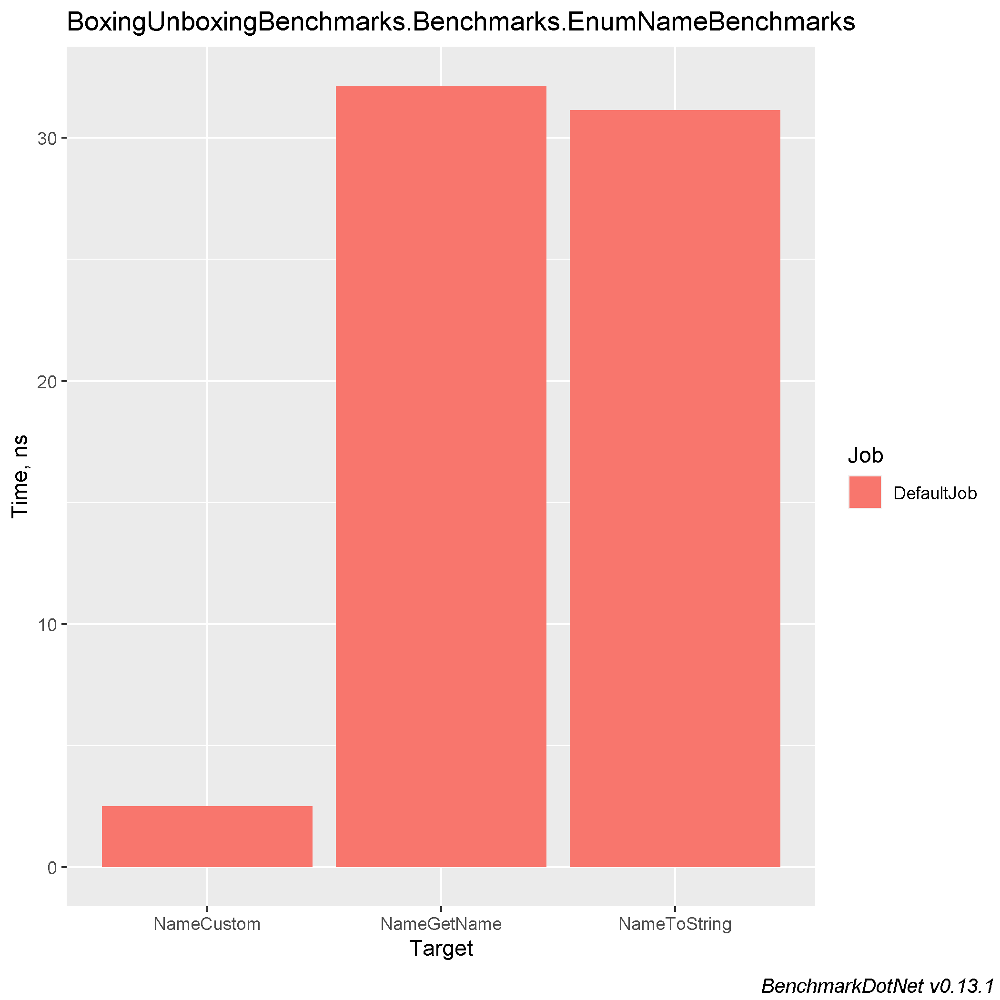
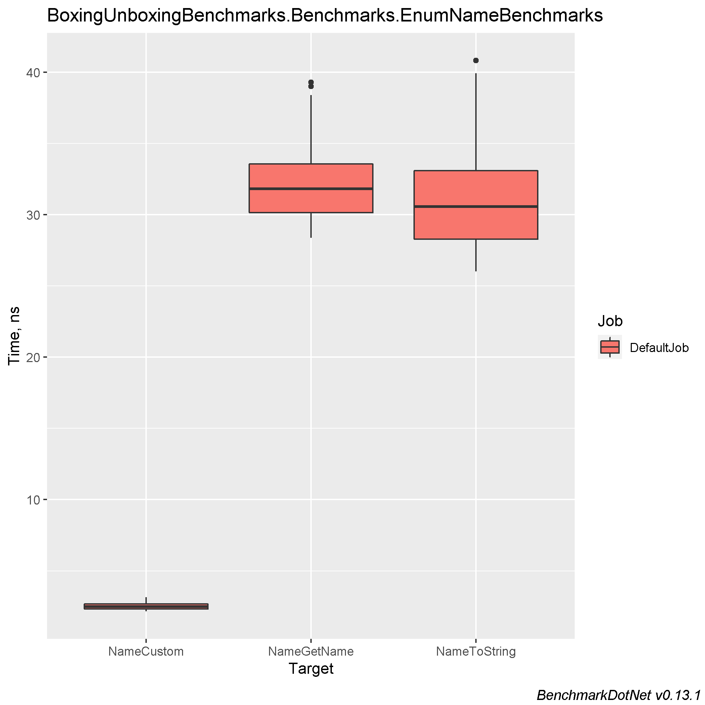
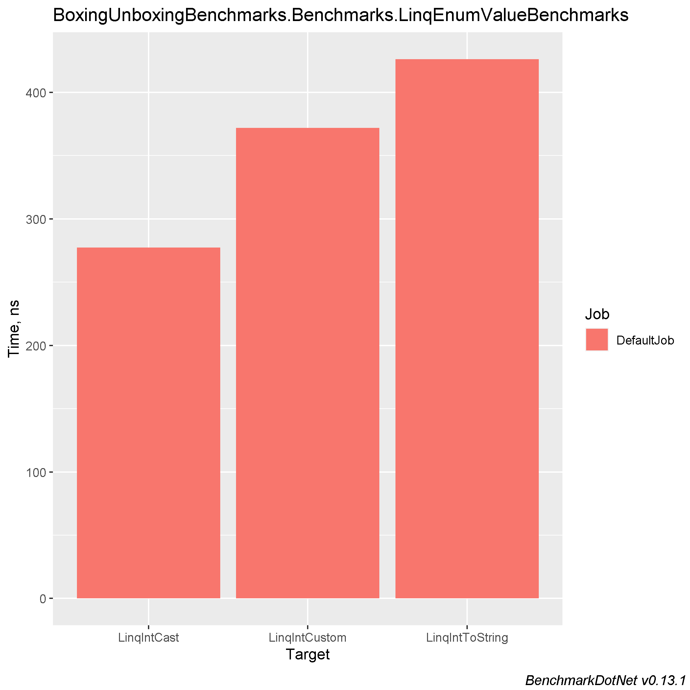
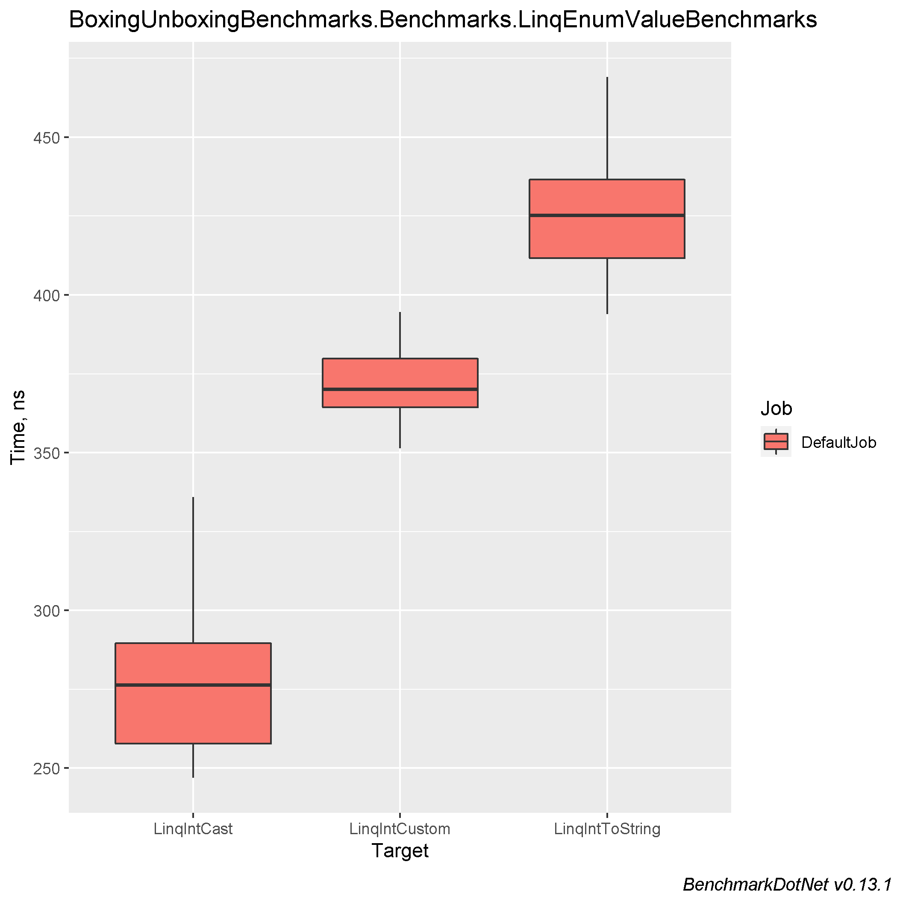
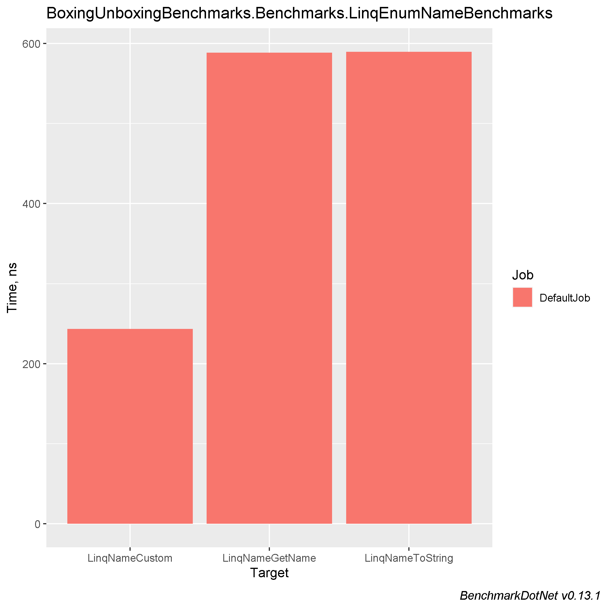
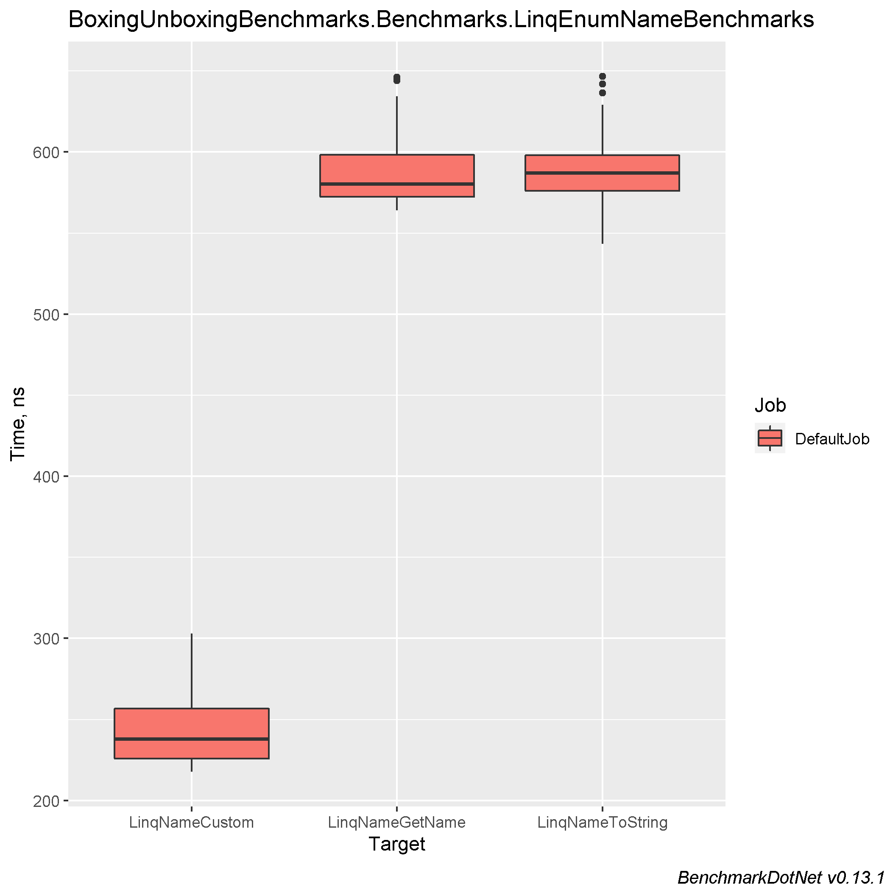

# Getting Int or String from Enum using different approaches

### Table of contents
- [Machine information](#machine-information)
- [Benchmark results](#benchmark-results)
  * [Getting int value from Enum](#getting-int-value-from-enum)
  * [Getting Name of current Enum](#getting-name-of-current-enum)
  * [For-method iterating of getting int value from Enum](#for-method-iterating-of-getting-int-value-from-enum)
  * [For-method iterating of getting Name of current Enum](#for-method-iterating-of-getting-name-of-current-enum)
  * [Linq-method iterating of getting int value from Enum](#linq-method-iterating-of-getting-int-value-from-enum)
  * [Linq-method iterating of getting Name of current Enum](#linq-method-iterating-of-getting-name-of-current-enum)
- [Conclusions](#conclusions)

<a name="machine-info"></a>
## Machine Information

``` ini
BenchmarkDotNet=v0.13.1, OS=Windows 10.0.22621
Intel Core i7-8550U CPU 1.80GHz (Kaby Lake R), 1 CPU, 8 logical and 4 physical cores
.NET SDK=6.0.202
  [Host]     : .NET 6.0.4 (6.0.422.16404), X64 RyuJIT
  DefaultJob : .NET 6.0.4 (6.0.422.16404), X64 RyuJIT
```

<a name="benchmark-results"></a>
## Benchmark results

<a name="getting-int-value-from-enum"></a>
### Getting int value from Enum

| Method      |      Mean |     Error |    StdDev |    StdErr |       Min |        Q1 |    Median |        Q3 |       Max |          Op/s |  Gen 0 | Allocated |
|-------------|----------:|----------:|----------:|----------:|----------:|----------:|----------:|----------:|----------:|--------------:|-------:|----------:|
| IntCast     |  2.262 ns | 0.0789 ns | 0.0659 ns | 0.0183 ns |  2.167 ns |  2.224 ns |  2.250 ns |  2.288 ns |  2.419 ns | 442,145,721.5 |      - |         - |
| IntCustom   |  5.448 ns | 0.1165 ns | 0.0973 ns | 0.0270 ns |  5.279 ns |  5.407 ns |  5.484 ns |  5.505 ns |  5.582 ns | 183,551,001.9 |      - |         - |
| IntToString | 14.404 ns | 0.5976 ns | 1.7431 ns | 0.1761 ns | 12.039 ns | 12.774 ns | 14.185 ns | 15.502 ns | 18.667 ns |  69,425,828.0 | 0.0057 |      24 B |

#### MultimodalDistribution
`EnumValueBenchmarks.IntToString`: Default -> It seems that the distribution is bimodal (mValue = 3.52)


<a name="getting-name-of-current-enum"></a>
### Getting Name of current Enum

| Method       |      Mean |     Error |    StdDev |    StdErr |       Min |        Q1 |    Median |        Q3 |       Max |          Op/s |  Gen 0 | Allocated |
|--------------|----------:|----------:|----------:|----------:|----------:|----------:|----------:|----------:|----------:|--------------:|-------:|----------:|
| NameCustom   |  2.524 ns | 0.1371 ns | 0.2541 ns | 0.0387 ns |  2.155 ns |  2.336 ns |  2.480 ns |  2.684 ns |  3.154 ns | 396,139,904.2 |      - |         - |
| NameToString | 31.141 ns | 1.2277 ns | 3.5617 ns | 0.3616 ns | 26.017 ns | 28.289 ns | 30.565 ns | 33.086 ns | 40.831 ns |  32,112,087.9 | 0.0057 |      24 B |
| NameGetName  | 32.135 ns | 0.9130 ns | 2.6195 ns | 0.2688 ns | 28.383 ns | 30.145 ns | 31.817 ns | 33.568 ns | 39.307 ns |  31,118,650.2 |      - |         - |

#### MultimodalDistribution
`EnumNameBenchmarks.NameToString`: Default -> It seems that the distribution is multimodal (mValue = 4.48)




<a name="for-method-iterating-of-getting-int-value-from-enum"></a>
### For-method iterating of getting int value from Enum

| Method           |     Mean |    Error |   StdDev |  StdErr |   Median |      Min |       Q1 |       Q3 |      Max |        Op/s |  Gen 0 | Allocated |
|------------------|---------:|---------:|---------:|--------:|---------:|---------:|---------:|---------:|---------:|------------:|-------:|----------:|
| ArrayIntCast     | 322.7 ns |  7.50 ns | 21.52 ns | 2.21 ns | 316.7 ns | 292.4 ns | 305.4 ns | 336.4 ns | 380.9 ns | 3,098,671.2 | 0.1144 |     480 B |
| ArrayIntToString | 480.9 ns | 11.68 ns | 32.94 ns | 3.43 ns | 477.2 ns | 422.0 ns | 454.4 ns | 500.9 ns | 571.8 ns | 2,079,578.4 | 0.1831 |     768 B |
| ArrayIntCustom   | 501.8 ns | 15.75 ns | 44.92 ns | 4.63 ns | 494.7 ns | 418.7 ns | 469.9 ns | 525.8 ns | 615.3 ns | 1,992,661.8 | 0.1144 |     480 B |

#### MultimodalDistribution
`ForEnumValueBenchmarks.ArrayIntCast`: Default -> It seems that the distribution is bimodal (mValue = 3.33)


<a name="for-method-iterating-of-getting-name-of-current-enum"></a>
### For-method iterating of getting Name of current Enum

| Method            |     Mean |    Error |   StdDev |  StdErr |      Min |       Q1 |   Median |       Q3 |      Max |        Op/s |  Gen 0 |  Gen 1 | Allocated |
|-------------------|---------:|---------:|---------:|--------:|---------:|---------:|---------:|---------:|---------:|------------:|-------:|-------:|----------:|
| ArrayNameCustom   | 655.3 ns | 13.13 ns | 17.07 ns | 3.49 ns | 634.8 ns | 641.9 ns | 653.5 ns | 666.1 ns | 690.4 ns | 1,526,094.1 | 0.0916 |      - |     384 B |
| ArrayNameToString | 824.8 ns | 16.40 ns | 13.70 ns | 3.80 ns | 803.1 ns | 818.5 ns | 822.3 ns | 830.6 ns | 853.6 ns | 1,212,363.4 | 0.1602 |      - |     672 B |
| ArrayNameGetName  | 903.1 ns | 17.32 ns | 17.01 ns | 4.25 ns | 872.5 ns | 893.8 ns | 901.3 ns | 913.8 ns | 942.7 ns | 1,107,244.2 | 0.0916 | 0.0010 |     384 B |


<a name="linq-method-iterating-of-getting-int-value-from-enum"></a>
### Linq-method iterating of getting int value from Enum

| Method          |     Mean |   Error |   StdDev |  StdErr |      Min |       Q1 |   Median |       Q3 |      Max |        Op/s |  Gen 0 | Allocated |
|-----------------|---------:|--------:|---------:|--------:|---------:|---------:|---------:|---------:|---------:|------------:|-------:|----------:|
| LinqIntCast     | 277.4 ns | 7.69 ns | 22.07 ns | 2.26 ns | 246.9 ns | 257.8 ns | 276.4 ns | 289.6 ns | 335.9 ns | 3,605,546.1 | 0.0343 |     144 B |
| LinqIntCustom   | 372.1 ns | 7.29 ns | 12.17 ns | 2.03 ns | 351.4 ns | 364.4 ns | 370.1 ns | 379.8 ns | 394.6 ns | 2,687,804.8 | 0.0343 |     144 B |
| LinqIntToString | 426.2 ns | 8.48 ns | 16.55 ns | 2.41 ns | 394.0 ns | 411.7 ns | 425.2 ns | 436.6 ns | 469.1 ns | 2,346,122.6 | 0.1030 |     432 B |

#### MultimodalDistribution
`LinqEnumValueBenchmarks.LinqIntCast`: Default     -> It seems that the distribution is bimodal (mValue = 3.75)

`LinqEnumValueBenchmarks.LinqIntToString`: Default -> It seems that the distribution can have several modes (mValue = 2.89)



<a name="linq-method-iterating-of-getting-name-of-current-enum"></a>
### Linq-method iterating of getting Name of current Enum

| Method           |     Mean |    Error |   StdDev |  StdErr |   Median |      Min |       Q1 |       Q3 |      Max |        Op/s |  Gen 0 | Allocated |
|------------------|---------:|---------:|---------:|--------:|---------:|---------:|---------:|---------:|---------:|------------:|-------:|----------:|
| LinqNameCustom   | 243.5 ns |  7.31 ns | 20.99 ns | 2.15 ns | 237.8 ns | 217.6 ns | 225.8 ns | 256.8 ns | 303.0 ns | 4,106,725.3 | 0.0114 |      48 B |
| LinqNameGetName  | 588.5 ns | 11.79 ns | 22.14 ns | 3.34 ns | 580.3 ns | 564.1 ns | 572.4 ns | 598.3 ns | 646.1 ns | 1,699,140.3 | 0.0114 |      48 B |
| LinqNameToString | 589.5 ns | 11.75 ns | 23.47 ns | 3.35 ns | 587.1 ns | 543.3 ns | 576.1 ns | 598.1 ns | 646.7 ns | 1,696,274.7 | 0.0801 |     336 B |




<a name="conclusions"></a>
## Conclusions

1. The best method to get name of Enum is custom method:

```cs
internal static string GetName(TestEnum testEnum) 
  => testEnum switch
  {
      TestEnum.First => nameof(TestEnum.First),
      TestEnum.Second => nameof(TestEnum.Second),
      TestEnum.Third => nameof(TestEnum.Third),
      TestEnum.Fourth => nameof(TestEnum.Fourth),
      TestEnum.Fifth => nameof(TestEnum.Fifth),
      TestEnum.Sixth => nameof(TestEnum.Sixth),
      TestEnum.Seventh => nameof(TestEnum.Seventh),
      TestEnum.Eighth => nameof(TestEnum.Eighth),
      TestEnum.Ninth => nameof(TestEnum.Ninth),
      TestEnum.Tenth => nameof(TestEnum.Tenth),
      TestEnum.Eleventh => nameof(TestEnum.Eleventh),
      TestEnum.Twelfth => nameof(TestEnum.Twelfth),
      TestEnum.Zero => nameof(TestEnum.Zero),
      _ => throw new ArgumentOutOfRangeException(nameof(testEnum), testEnum, message: default)
  };
```

2. As for int value, best method is casting to int. It is rather cheap : `((int) TestEnums[0]).ToString();`