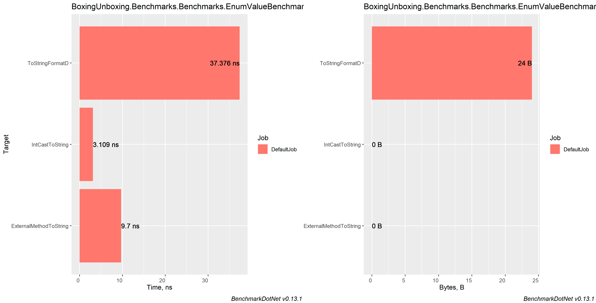
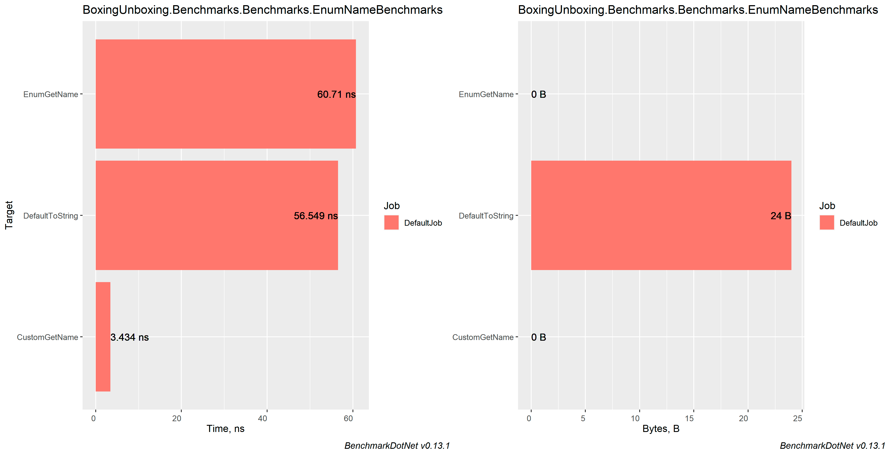

# Getting name or value from Enum

## Table of contents
- [Machine information](#machine-information)
- [Benchmark results](#benchmark-results)
  * [Getting integer value from Enum](#getting-integer-value-from-enum)
  * [Getting Name of current Enum](#getting-name-of-current-enum)
- [Conclusions](#conclusions)

<a name="machine-info"></a>
## Machine Information

``` ini
BenchmarkDotNet=v0.13.1, OS=Windows 10.0.22621
Intel Core i7-8550U CPU 1.80GHz (Kaby Lake R), 1 CPU, 8 logical and 4 physical cores
.NET SDK=6.0.202
  [Host]     : .NET 6.0.4 (6.0.422.16404), X64 RyuJIT
  DefaultJob : .NET 6.0.4 (6.0.422.16404), X64 RyuJIT
```

<a name="benchmark-results"></a>
## Benchmark results

<a name="getting-integer-value-from-enum"></a>
### Getting integer value as string from Enum

| Method                 |      Mean |     Error |   StdDev |    StdErr |          Op/s | Allocated |
|------------------------|----------:|----------:|---------:|----------:|--------------:|----------:|
| IntCastToString        |  3.109 ns | 0.4105 ns | 1.151 ns | 0.1207 ns | 321,657,559.0 |         - |
| ExternalMethodToString |  9.699 ns | 1.4750 ns | 4.303 ns | 0.4346 ns | 103,101,658.8 |         - |
| ToStringFormatD        | 37.376 ns | 3.2854 ns | 9.213 ns | 0.9657 ns |  26,754,935.7 |      24 B |
#### MultimodalDistribution
`EnumValueBenchmarks.ExternalMethodToString:` Default -> It seems that the distribution is multimodal (mValue = 4.22)



<a name="getting-name-of-current-enum"></a>
### Getting Name of current Enum

| Method          |      Mean |     Error |     StdDev |    StdErr |          Op/s | Allocated |
|-----------------|----------:|----------:|-----------:|----------:|--------------:|----------:|
| CustomGetName   |  3.434 ns | 0.1860 ns |  0.2352 ns | 0.0490 ns | 291,230,187.1 |         - |
| DefaultToString | 56.549 ns | 5.5221 ns | 15.8439 ns | 1.6256 ns |  17,683,834.4 |      24 B |
| EnumGetName     | 60.710 ns | 6.2515 ns | 17.7345 ns | 1.8390 ns |  16,471,725.6 |         - |

#### MultimodalDistribution
`EnumNameBenchmarks.EnumGetName:` Default -> It seems that the distribution is bimodal (mValue = 3.45)



<a name="conclusions"></a>
## Conclusions

1. The best method to get name of Enum is custom method:

```cs
internal static string GetName(TestEnum testEnum) 
  => testEnum switch
  {
      TestEnum.First => nameof(TestEnum.First),
      TestEnum.Second => nameof(TestEnum.Second),
      TestEnum.Third => nameof(TestEnum.Third),
      TestEnum.Fourth => nameof(TestEnum.Fourth),
      TestEnum.Fifth => nameof(TestEnum.Fifth),
      TestEnum.Sixth => nameof(TestEnum.Sixth),
      TestEnum.Seventh => nameof(TestEnum.Seventh),
      TestEnum.Eighth => nameof(TestEnum.Eighth),
      TestEnum.Ninth => nameof(TestEnum.Ninth),
      TestEnum.Tenth => nameof(TestEnum.Tenth),
      TestEnum.Eleventh => nameof(TestEnum.Eleventh),
      TestEnum.Twelfth => nameof(TestEnum.Twelfth),
      TestEnum.Zero => nameof(TestEnum.Zero),
      _ => throw new ArgumentOutOfRangeException(nameof(testEnum), testEnum, message: default)
  };
```

The problem is that common method `Enum.GetName` inside uses binary search for some reason. This approach eliminated extensive code and makes it straightforward.

2. As for int value, best method is casting to int. It is rather cheap : `((int) Enum).ToString();`.