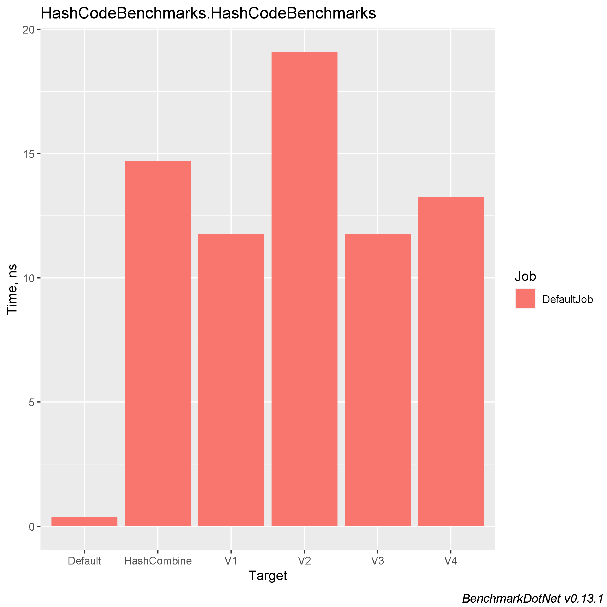

# Comparing different HashCode algorithms from StackOverflow

tl;dr: [See mini article on StackOverflow](https://stackoverflow.com/a/56539595)

### Table of contents
- [What Makes a Good Algorithm?](#what-makes-a-good-algorithm)
    * [Performance](#performance)
    * [Deterministic](#deterministic)
    * [Reduce Collisions](#reduce-collisions)
    * [Hash Uniformity](#hash-uniformity)
    * [Prevents DoS](#prevents-dos)
- [Cryptographically Secure?](#cryptographically-secure)
- [Machine Information](#machine-information)
- [Benchmark results](#benchmark-results)
- [Conclusions](#conclusions)

<a name="what-makes-a-good-algorithm"></a>
# What Makes a Good Algorithm?

<a name="performance"></a>
## Performance
The algorithm that calculates a hash code needs to be fast. A simple algorithm is usually going to be a faster one. One that does not allocate extra memory will also reduce need for garbage collection, which will in turn also improve performance.

In C# hash functions specifically, you often use the `unchecked` keyword which stops overflow checking to improve performance.

<a name="deterministic"></a>
## Deterministic
The hashing algorithm needs to be [deterministic](https://en.wikipedia.org/wiki/Deterministic_algorithm) i.e. given the same input it must always produce the same output.

<a name="reduce-collisions"></a>
## Reduce Collisions
The algorithm that calculates a hash code needs to keep [hash collisions](https://freemanlaw.com/hash-collisions-explained/) to a minimum. A hash collision is a situation that occurs when two calls to GetHashCode on two different objects produce identical hash codes. Note that collisions are allowed (some have the misconceptions that they are not) but they should be kept to a minimum.

A lot of hash functions contain magic numbers like `17` or `23`. These are special [prime numbers](https://en.wikipedia.org/wiki/Prime_number) which due to their mathematical properties help to reduce hash collisions as compared to using non-prime numbers.

<a name="hash-uniformity"></a>
## Hash Uniformity
A good hash function should map the expected inputs as evenly as possible over its output range i.e. it should output a wide range of hashes based on its inputs that are evenly spread. It should have hash uniformity.

<a name="prevents-dos"></a>
## Prevents DoS
In .NET Core each time you restart an application you will get different hash codes. This is a security feature to prevent Denial of Service attacks (DoS). For .NET Framework you **should** enable this feature by adding the following App.config file:
```cs
    <?xml version ="1.0"?>  
    <configuration>  
       <runtime>  
          <UseRandomizedStringHashAlgorithm enabled="1" />  
       </runtime>  
    </configuration>
```
Because of this feature, hash codes should never be used outside of the application domain in which they were created, they should never be used as key fields in a collection and they should never be persisted.

Read more about this [here](https://andrewlock.net/why-is-string-gethashcode-different-each-time-i-run-my-program-in-net-core/).

<a name="cryptographically-secure"></a>

# Cryptographically Secure?
The algorithm does not have to be a [Cryptographic hash function](https://en.wikipedia.org/wiki/Cryptographic_hash_function). Meaning it does not have to satisfy the following conditions:

- It is infeasible to generate a message that yields a given hash value.
- It is infeasible to find two different messages with the same hash value.
- A small change to a message should change the hash value so extensively that the new hash value appears uncorrelated with the old hash value (avalanche effect).

<a name="machine-information"></a>
## Machine Information

``` ini
BenchmarkDotNet=v0.13.1, OS=Windows 10.0.22621
Intel Core i7-8550U CPU 1.80GHz (Kaby Lake R), 1 CPU, 8 logical and 4 physical cores
.NET SDK=6.0.202
  [Host]     : .NET 6.0.4 (6.0.422.16404), X64 RyuJIT
  DefaultJob : .NET 6.0.4 (6.0.422.16404), X64 RyuJIT
```

<a name="benchmark-results"></a>
# Benchmark results

| Method      |       Mean |     Error |    StdDev |    StdErr |        Min |         Q1 |     Median |         Q3 |        Max |            Op/s | Allocated |
|-------------|-----------:|----------:|----------:|----------:|-----------:|-----------:|-----------:|-----------:|-----------:|----------------:|----------:|
| Default     |  0.3886 ns | 0.0329 ns | 0.0292 ns | 0.0078 ns |  0.3476 ns |  0.3728 ns |  0.3859 ns |  0.3944 ns |  0.4487 ns | 2,573,341,173.2 |         - |
| V1          | 11.7647 ns | 0.2601 ns | 0.2891 ns | 0.0663 ns | 11.3148 ns | 11.5945 ns | 11.7632 ns | 11.8286 ns | 12.3520 ns |    84,999,715.8 |         - |
| V3          | 11.7666 ns | 0.2618 ns | 0.3997 ns | 0.0718 ns | 11.0602 ns | 11.5622 ns | 11.7312 ns | 12.0341 ns | 12.6475 ns |    84,986,390.9 |         - |
| V4          | 13.2362 ns | 0.2844 ns | 0.5746 ns | 0.0813 ns | 12.3089 ns | 12.7948 ns | 13.1182 ns | 13.5929 ns | 14.7663 ns |    75,550,625.6 |         - |
| HashCombine | 14.6924 ns | 0.3785 ns | 1.1102 ns | 0.1116 ns | 13.0377 ns | 13.6180 ns | 14.5109 ns | 15.5095 ns | 17.2608 ns |    68,062,338.4 |         - |
| V2          | 19.0793 ns | 0.2513 ns | 0.2227 ns | 0.0595 ns | 18.6759 ns | 18.9744 ns | 19.0571 ns | 19.2516 ns | 19.4625 ns |    52,412,945.7 |         - |




<a name="conclusions"></a>
## Conclusions

Do not make your head blow and use default `GetHashCode` method :)