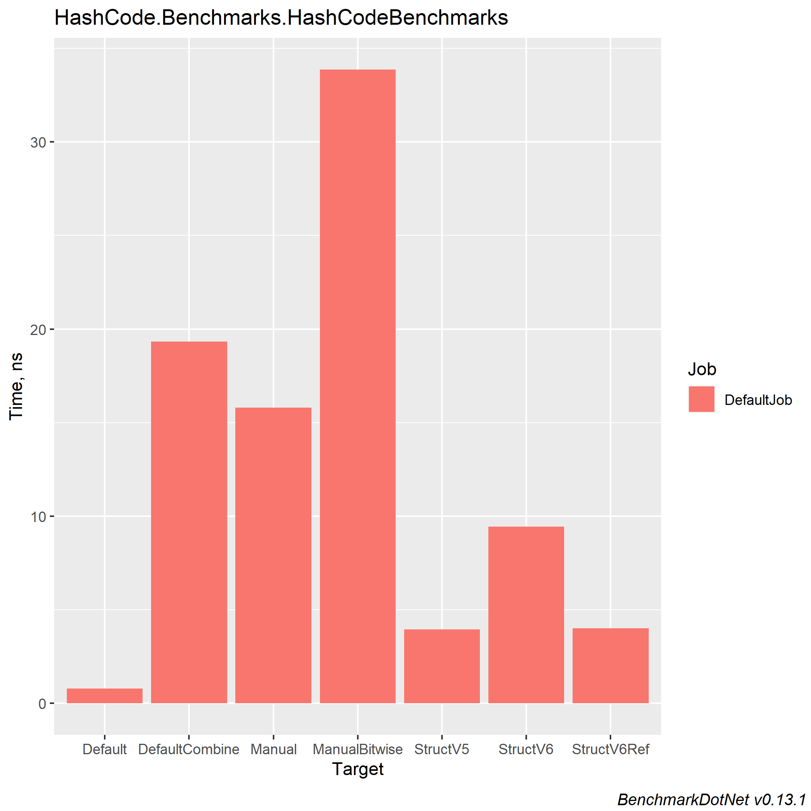
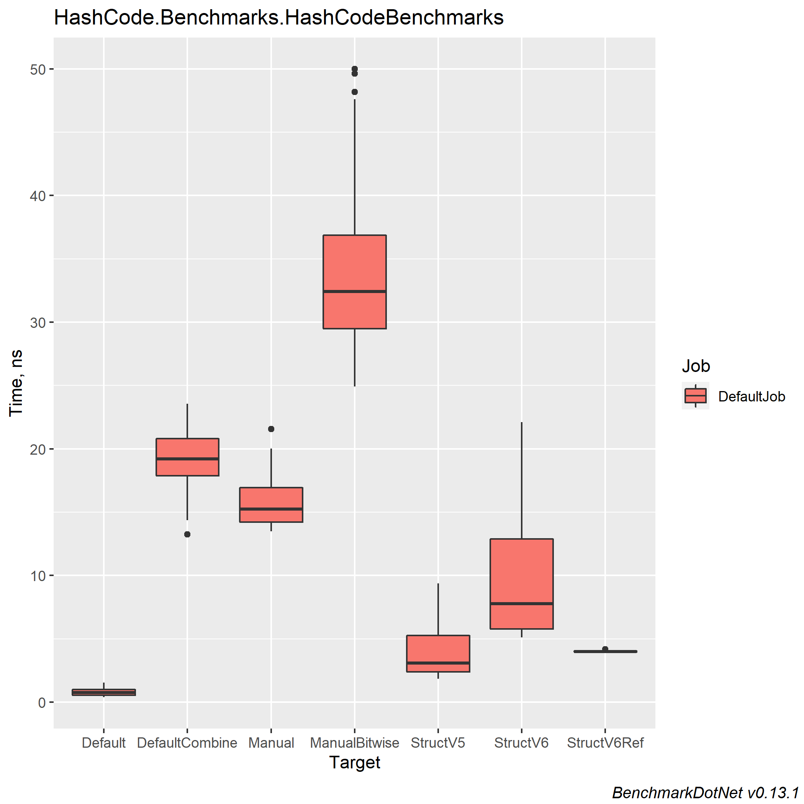

# Comparing different HashCode algorithms from StackOverflow

tl;dr: [See mini article on StackOverflow](https://stackoverflow.com/a/56539595)

### Table of contents
- [What Makes a Good Algorithm?](#what-makes-a-good-algorithm)
    * [Performance](#performance)
    * [Deterministic](#deterministic)
    * [Reduce Collisions](#reduce-collisions)
    * [Hash Uniformity](#hash-uniformity)
    * [Prevents DoS](#prevents-dos)
- [Cryptographically Secure?](#cryptographically-secure)
- [Machine Information](#machine-information)
- [Benchmark results](#benchmark-results)
- [Conclusions](#conclusions)

<a name="what-makes-a-good-algorithm"></a>
# What Makes a Good Algorithm?

<a name="performance"></a>
## Performance
The algorithm that calculates a hash code needs to be fast. A simple algorithm is usually going to be a faster one. One that does not allocate extra memory will also reduce need for garbage collection, which will in turn also improve performance.

In C# hash functions specifically, you often use the `unchecked` keyword which stops overflow checking to improve performance.

<a name="deterministic"></a>
## Deterministic
The hashing algorithm needs to be [deterministic](https://en.wikipedia.org/wiki/Deterministic_algorithm) i.e. given the same input it must always produce the same output.

<a name="reduce-collisions"></a>
## Reduce Collisions
The algorithm that calculates a hash code needs to keep [hash collisions](https://freemanlaw.com/hash-collisions-explained/) to a minimum. A hash collision is a situation that occurs when two calls to GetHashCode on two different objects produce identical hash codes. Note that collisions are allowed (some have the misconceptions that they are not) but they should be kept to a minimum.

A lot of hash functions contain magic numbers like `17` or `23`. These are special [prime numbers](https://en.wikipedia.org/wiki/Prime_number) which due to their mathematical properties help to reduce hash collisions as compared to using non-prime numbers.

<a name="hash-uniformity"></a>
## Hash Uniformity
A good hash function should map the expected inputs as evenly as possible over its output range i.e. it should output a wide range of hashes based on its inputs that are evenly spread. It should have hash uniformity.

<a name="prevents-dos"></a>
## Prevents DoS
In .NET Core each time you restart an application you will get different hash codes. This is a security feature to prevent Denial of Service attacks (DoS). For .NET Framework you **should** enable this feature by adding the following App.config file:
```cs
    <?xml version ="1.0"?>  
    <configuration>  
       <runtime>  
          <UseRandomizedStringHashAlgorithm enabled="1" />  
       </runtime>  
    </configuration>
```
Because of this feature, hash codes should never be used outside of the application domain in which they were created, they should never be used as key fields in a collection and they should never be persisted.

Read more about this [here](https://andrewlock.net/why-is-string-gethashcode-different-each-time-i-run-my-program-in-net-core/).

<a name="cryptographically-secure"></a>

# Cryptographically Secure?
The algorithm does not have to be a [Cryptographic hash function](https://en.wikipedia.org/wiki/Cryptographic_hash_function). Meaning it does not have to satisfy the following conditions:

- It is infeasible to generate a message that yields a given hash value.
- It is infeasible to find two different messages with the same hash value.
- A small change to a message should change the hash value so extensively that the new hash value appears uncorrelated with the old hash value (avalanche effect).

<a name="machine-information"></a>
# Machine Information

``` ini
BenchmarkDotNet=v0.13.1, OS=Windows 10.0.22621
Intel Core i7-8550U CPU 1.80GHz (Kaby Lake R), 1 CPU, 8 logical and 4 physical cores
.NET SDK=6.0.202
  [Host]     : .NET 6.0.4 (6.0.422.16404), X64 RyuJIT
  DefaultJob : .NET 6.0.4 (6.0.422.16404), X64 RyuJIT
```

<a name="benchmark-results"></a>
# Benchmark results

| Method         |       Mean |     Error |    StdDev |    StdErr |     Median |        Min |         Q1 |         Q3 |       Max |            Op/s | Ratio | RatioSD | Allocated |
|----------------|-----------:|----------:|----------:|----------:|-----------:|-----------:|-----------:|-----------:|----------:|----------------:|------:|--------:|----------:|
| Default        |  0.7939 ns | 0.0984 ns | 0.2870 ns | 0.0290 ns |  0.7418 ns |  0.3804 ns |  0.5519 ns |  0.9970 ns |  1.539 ns | 1,259,546,873.0 |  1.00 |    0.00 |         - |
| StructV5       |  3.9422 ns | 0.7204 ns | 2.0900 ns | 0.2122 ns |  3.0666 ns |  1.8546 ns |  2.3802 ns |  5.2689 ns |  9.363 ns |   253,667,726.2 |  5.60 |    3.56 |         - |
| StructV6Ref    |  4.0087 ns | 0.0947 ns | 0.0840 ns | 0.0224 ns |  3.9974 ns |  3.8796 ns |  3.9496 ns |  4.0395 ns |  4.181 ns |   249,458,214.6 |  5.24 |    1.53 |         - |
| StructV6       |  9.4502 ns | 1.4963 ns | 4.4120 ns | 0.4412 ns |  7.7750 ns |  5.1212 ns |  5.7852 ns | 12.8835 ns | 22.116 ns |   105,818,110.8 | 13.82 |    8.51 |         - |
| Manual         | 15.7927 ns | 0.6847 ns | 1.8860 ns | 0.2010 ns | 15.2549 ns | 13.4931 ns | 14.2124 ns | 16.9435 ns | 21.552 ns |    63,320,262.0 | 22.34 |    8.95 |         - |
| DefaultCombine | 19.3328 ns | 0.6286 ns | 1.8534 ns | 0.1853 ns | 19.1892 ns | 13.2464 ns | 17.8747 ns | 20.7973 ns | 23.552 ns |    51,725,432.2 | 27.82 |   10.04 |         - |
| ManualBitwise  | 33.8660 ns | 2.0086 ns | 5.6653 ns | 0.5907 ns | 32.4228 ns | 24.9100 ns | 29.4931 ns | 36.8530 ns | 49.990 ns |    29,528,104.2 | 48.49 |   20.54 |         - |

#### MultimodalDistribution
`HashCodeBenchmarks.StructV5: Default` -> It seems that the distribution can have several modes (mValue = 2.98)
`HashCodeBenchmarks.Manual: Default`   -> It seems that the distribution can have several modes (mValue = 3)
#### BaselineCustomAnalyzer
`Summary` -> A question mark `?` symbol indicates that it was not possible to compute the (Ratio, RatioSD) column(s) because the baseline value is too close to zero.
#### ZeroMeasurement
`HashCodeBenchmarks.Default: Default` -> The method duration is indistinguishable from the empty method duration




<a name="conclusions"></a>
# Conclusions

Do not make your head blow and use default `GetHashCode` method.