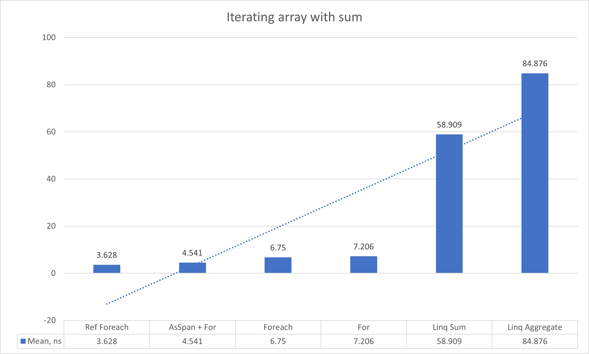
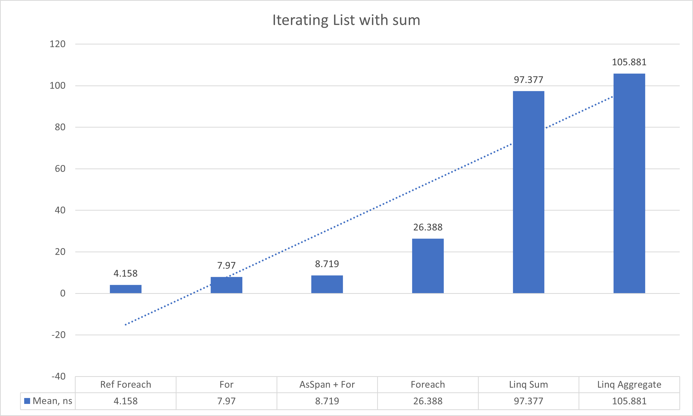
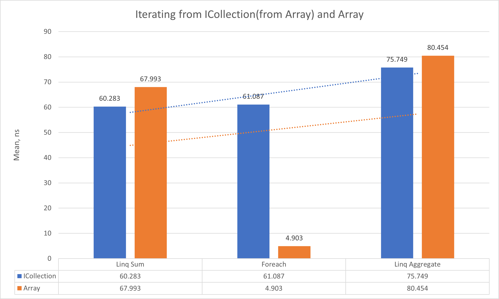
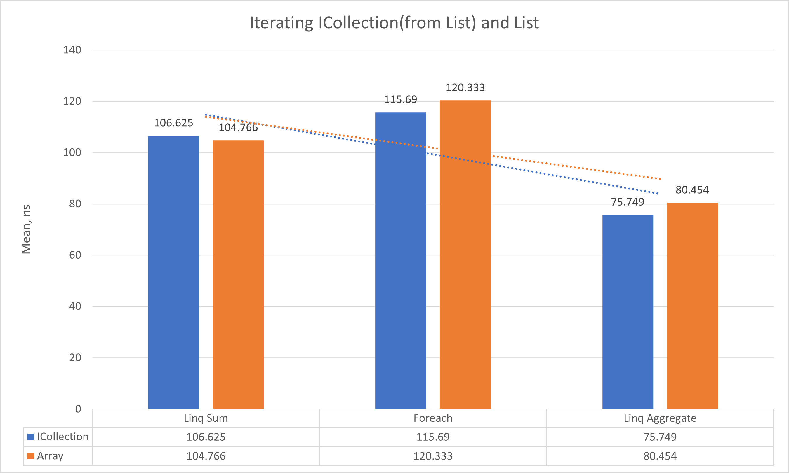
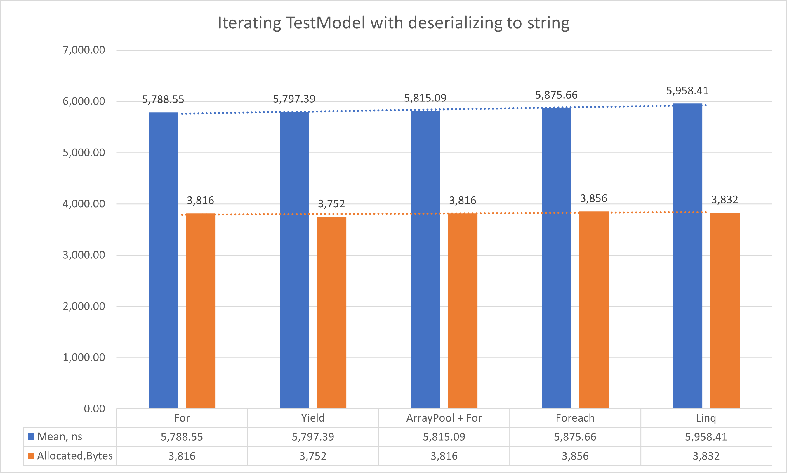
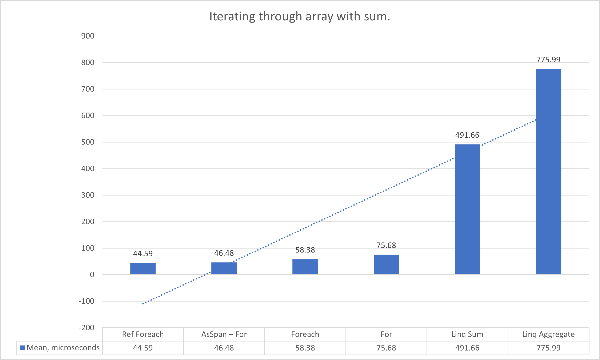
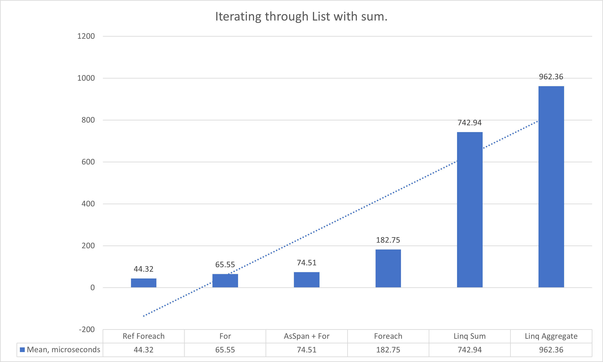
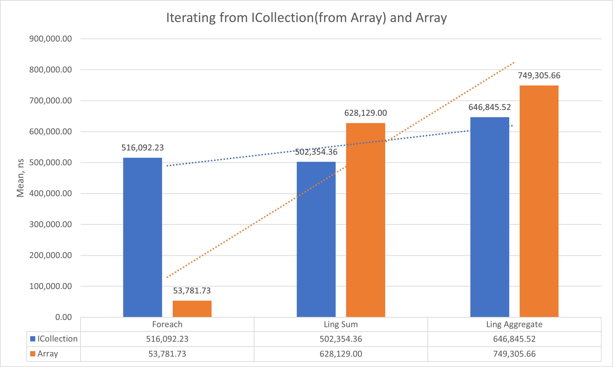
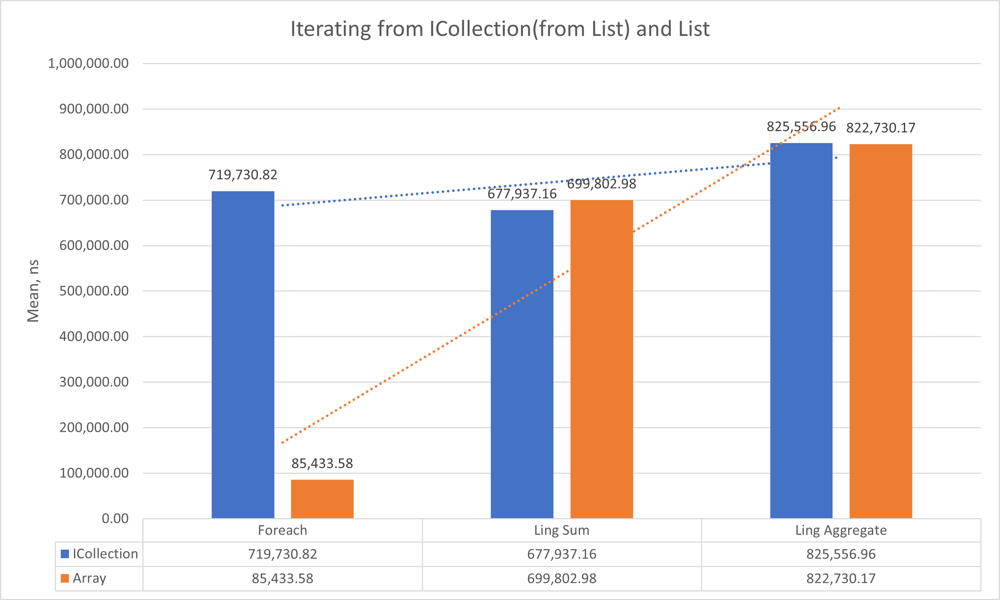
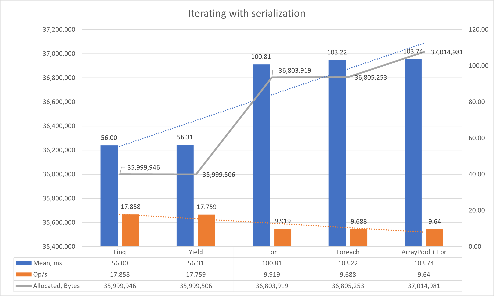

# Comparing collections iteration (For, Foreach, Linq)

### Table of contents
- [Machine information](#machine-information)
- [Benchmark results](#benchmark-results)
  - [10 values](#10-values)
    - [Array](#10-values-array)
    - [List](#10-values-list)
    - [ICollection](#10-values-icollection)
    - [Model Serialization](#10-values-serialization)
  - [100000 values](#100000-values)
    - [Array](#100000-values-array)
    - [List](#100000-values-list)
    - [ICollection](#100000-values-icollection)
    - [Model Serialization](#100000-values-serialization)

<a name="machine-information"></a>
# Machine Information
 
``` ini
BenchmarkDotNet=v0.13.1, OS=Windows 10.0.22621
Intel Core i7-8550U CPU 1.80GHz (Kaby Lake R), 1 CPU, 8 logical and 4 physical cores
.NET SDK=6.0.202
  [Host]     : .NET 6.0.4 (6.0.422.16404), X64 RyuJIT
  DefaultJob : .NET 6.0.4 (6.0.422.16404), X64 RyuJIT
```
<a name="benchmark-results"></a>
# Benchmark results

<a name="10-values"></a>
## 10 Values

For testing were used 10 random generated int values from 0 to 100.000 for eliminating overflow exception.

<a name="10-values-array"></a>
### Array

| Method                                                                                                                                                                                       |      Mean |     Error |    StdDev |    StdErr |       Min |        Q1 |    Median |        Q3 |       Max |          Op/s |
|----------------------------------------------------------------------------------------------------------------------------------------------------------------------------------------------|----------:|----------:|----------:|----------:|----------:|----------:|----------:|----------:|----------:|--------------:|
| [&#39;Ref Foreach&#39;](https://github.com/antomys/CuriousBenchmarks/blob/7933ad3edaa3b5540edfe79c0e39a61ebc05f805/Iterators/Iterators.Benchmarks/Services/IterationService.Array.cs#L55)    |  3.628 ns | 0.0478 ns | 0.0447 ns | 0.0115 ns |  3.554 ns |  3.593 ns |  3.633 ns |  3.650 ns |  3.714 ns | 275,653,620.5 |
| [&#39;AsSpan + For&#39;](https://github.com/antomys/CuriousBenchmarks/blob/7933ad3edaa3b5540edfe79c0e39a61ebc05f805/Iterators/Iterators.Benchmarks/Services/IterationService.Array.cs#L70)   |  4.541 ns | 0.0433 ns | 0.0405 ns | 0.0105 ns |  4.496 ns |  4.509 ns |  4.528 ns |  4.560 ns |  4.633 ns | 220,196,023.7 |
| [&#39;Foreach&#39;](https://github.com/antomys/CuriousBenchmarks/blob/7933ad3edaa3b5540edfe79c0e39a61ebc05f805/Iterators/Iterators.Benchmarks/Services/IterationService.Array.cs#L24)        |  6.750 ns | 0.0405 ns | 0.0359 ns | 0.0096 ns |  6.715 ns |  6.726 ns |  6.735 ns |  6.768 ns |  6.823 ns | 148,156,950.6 |
| [&#39;For&#39;](https://github.com/antomys/CuriousBenchmarks/blob/7933ad3edaa3b5540edfe79c0e39a61ebc05f805/Iterators/Iterators.Benchmarks/Services/IterationService.Array.cs#L9)             |  7.206 ns | 0.0214 ns | 0.0190 ns | 0.0051 ns |  7.181 ns |  7.194 ns |  7.199 ns |  7.212 ns |  7.245 ns | 138,770,003.8 |
| [ &#39;Linq Sum&#39;](https://github.com/antomys/CuriousBenchmarks/blob/7933ad3edaa3b5540edfe79c0e39a61ebc05f805/Iterators/Iterators.Benchmarks/Services/IterationService.Array.cs#L47)      | 58.909 ns | 1.1799 ns | 1.1589 ns | 0.2897 ns | 57.433 ns | 58.069 ns | 58.551 ns | 59.701 ns | 60.895 ns |  16,975,339.0 |
| [&#39;Linq Aggregate&#39;](https://github.com/antomys/CuriousBenchmarks/blob/7933ad3edaa3b5540edfe79c0e39a61ebc05f805/Iterators/Iterators.Benchmarks/Services/IterationService.Array.cs#L39) | 84.876 ns | 0.9933 ns | 0.8805 ns | 0.2353 ns | 81.847 ns | 85.071 ns | 85.125 ns | 85.162 ns | 85.305 ns |  11,781,860.7 |



<a name="10-values-list"></a>
### List

| Method                                                                                                                                                                                      |       Mean |     Error |    StdDev |    StdErr |        Min |         Q1 |     Median |         Q3 |        Max |          Op/s |
|---------------------------------------------------------------------------------------------------------------------------------------------------------------------------------------------|-----------:|----------:|----------:|----------:|-----------:|-----------:|-----------:|-----------:|-----------:|--------------:|
| [&#39;Ref Foreach&#39;](https://github.com/antomys/CuriousBenchmarks/blob/7933ad3edaa3b5540edfe79c0e39a61ebc05f805/Iterators/Iterators.Benchmarks/Services/IterationService.List.cs#L57)    |   4.158 ns | 0.0325 ns | 0.0288 ns | 0.0077 ns |   4.118 ns |   4.139 ns |   4.150 ns |   4.174 ns |   4.213 ns | 240,493,310.9 |
| [&#39;For&#39;](https://github.com/antomys/CuriousBenchmarks/blob/7933ad3edaa3b5540edfe79c0e39a61ebc05f805/Iterators/Iterators.Benchmarks/Services/IterationService.List.cs#L11)            |   7.970 ns | 0.0518 ns | 0.0459 ns | 0.0123 ns |   7.904 ns |   7.937 ns |   7.964 ns |   7.996 ns |   8.063 ns | 125,476,399.1 |
| [&#39;AsSpan + For&#39;](https://github.com/antomys/CuriousBenchmarks/blob/7933ad3edaa3b5540edfe79c0e39a61ebc05f805/Iterators/Iterators.Benchmarks/Services/IterationService.List.cs#L72)   |   8.719 ns | 0.0866 ns | 0.0723 ns | 0.0201 ns |   8.662 ns |   8.669 ns |   8.697 ns |   8.712 ns |   8.915 ns | 114,695,329.6 |
| [&#39;Foreach&#39;](https://github.com/antomys/CuriousBenchmarks/blob/7933ad3edaa3b5540edfe79c0e39a61ebc05f805/Iterators/Iterators.Benchmarks/Services/IterationService.List.cs#L26)        |  26.388 ns | 0.1653 ns | 0.1466 ns | 0.0392 ns |  26.235 ns |  26.284 ns |  26.337 ns |  26.454 ns |  26.693 ns |  37,896,123.2 |
| [&#39;Linq Sum&#39;](https://github.com/antomys/CuriousBenchmarks/blob/7933ad3edaa3b5540edfe79c0e39a61ebc05f805/Iterators/Iterators.Benchmarks/Services/IterationService.List.cs#L49)       |  97.377 ns | 0.4049 ns | 0.3381 ns | 0.0938 ns |  96.650 ns |  97.187 ns |  97.332 ns |  97.648 ns |  97.812 ns |  10,269,359.2 |
| [&#39;Linq Aggregate&#39;](https://github.com/antomys/CuriousBenchmarks/blob/7933ad3edaa3b5540edfe79c0e39a61ebc05f805/Iterators/Iterators.Benchmarks/Services/IterationService.List.cs#L41) | 105.881 ns | 0.4925 ns | 0.4113 ns | 0.1141 ns | 105.209 ns | 105.666 ns | 105.881 ns | 106.095 ns | 106.749 ns |   9,444,550.9 |



<a name="10-values-icollection"></a>
### ICollection

| Method                                                                                                                                                                                                                  |       Mean |      Error |     StdDev |    StdErr |        Min |         Q1 |     Median |         Q3 |        Max |           Op/s |
|-------------------------------------------------------------------------------------------------------------------------------------------------------------------------------------------------------------------------|-----------:|-----------:|-----------:|----------:|-----------:|-----------:|-----------:|-----------:|-----------:|---------------:|
| [&#39;Linq Sum. Array as ICollection&#39;](https://github.com/antomys/CuriousBenchmarks/blob/7933ad3edaa3b5540edfe79c0e39a61ebc05f805/Iterators/Iterators.Benchmarks/Services/IterationService.Collection.cs#L32)       |  60.283 ns |  0.4631 ns |  0.4332 ns | 0.1119 ns |  60.173 ns |  59.301 ns |  60.078 ns |  60.522 ns |  60.988 ns | 16,588,460.552 |
| [&#39;Foreach. Array as ICollection&#39;](https://github.com/antomys/CuriousBenchmarks/blob/7933ad3edaa3b5540edfe79c0e39a61ebc05f805/Iterators/Iterators.Benchmarks/Services/IterationService.Collection.cs#L9)         |  61.087 ns |  0.2153 ns |  0.1681 ns | 0.0485 ns |  61.106 ns |  60.672 ns |  61.042 ns |  61.210 ns |  61.291 ns | 16,370,088.356 |
| [&#39;Linq Aggregate. Array as ICollection&#39;](https://github.com/antomys/CuriousBenchmarks/blob/7933ad3edaa3b5540edfe79c0e39a61ebc05f805/Iterators/Iterators.Benchmarks/Services/IterationService.Collection.cs#L24) |  75.749 ns |  0.6026 ns |  0.5637 ns | 0.1455 ns |  75.543 ns |  75.109 ns |  75.314 ns |  76.060 ns |  77.102 ns | 13,201,453.981 |



| Method                                                                                                                                                                                                                  |       Mean |      Error |     StdDev |    StdErr |        Min |         Q1 |     Median |         Q3 |        Max |           Op/s |
|-------------------------------------------------------------------------------------------------------------------------------------------------------------------------------------------------------------------------|-----------:|-----------:|-----------:|----------:|-----------:|-----------:|-----------:|-----------:|-----------:|---------------:|
| [&#39;Linq Sum. List as ICollection&#39;](https://github.com/antomys/CuriousBenchmarks/blob/7933ad3edaa3b5540edfe79c0e39a61ebc05f805/Iterators/Iterators.Benchmarks/Services/IterationService.Collection.cs#L32)        | 106.625 ns |  0.7736 ns |  0.6460 ns | 0.1792 ns | 106.640 ns | 105.047 ns | 106.276 ns | 106.990 ns | 107.543 ns |  9,378,664.358 |
| [&#39;Linq Aggregate. List as ICollection&#39;](https://github.com/antomys/CuriousBenchmarks/blob/7933ad3edaa3b5540edfe79c0e39a61ebc05f805/Iterators/Iterators.Benchmarks/Services/IterationService.Collection.cs#L24)  | 115.690 ns |  1.0908 ns |  1.0203 ns | 0.2634 ns | 115.850 ns | 113.680 ns | 115.081 ns | 116.376 ns | 117.314 ns |  8,643,778.686 |
| [&#39;Foreach. List as ICollection&#39;](https://github.com/antomys/CuriousBenchmarks/blob/7933ad3edaa3b5540edfe79c0e39a61ebc05f805/Iterators/Iterators.Benchmarks/Services/IterationService.Collection.cs#L9)          | 135.262 ns | 14.4266 ns | 42.3106 ns | 4.2524 ns | 103.662 ns |  99.062 ns | 101.269 ns | 162.031 ns | 251.281 ns |  7,393,082.052 |



<a name="10-values-serialization"></a>
### Model Serialization

| Method                                                                                                                                                                                  |         Mean |       Error |      StdDev |     StdErr |          Min |           Q1 |       Median |           Q3 |          Max |      Op/s | Ratio | RatioSD |  Gen 0 | Allocated |
|-----------------------------------------------------------------------------------------------------------------------------------------------------------------------------------------|-------------:|------------:|------------:|-----------:|-------------:|-------------:|-------------:|-------------:|-------------:|----------:|------:|--------:|-------:|----------:|
| [&#39;For&#39;](https://github.com/antomys/CuriousBenchmarks/blob/7933ad3edaa3b5540edfe79c0e39a61ebc05f805/Iterators/Iterators.Benchmarks/Services/IterationService.cs#L16)             | 5,788.545 ns | 110.4645 ns | 103.3286 ns | 26.6793 ns | 5,571.027 ns | 5,731.013 ns | 5,812.250 ns | 5,847.569 ns | 5,951.153 ns | 172,755.0 |  1.00 |    0.00 | 0.6027 |   3,816 B |
| [&#39;Yield&#39;](https://github.com/antomys/CuriousBenchmarks/blob/7933ad3edaa3b5540edfe79c0e39a61ebc05f805/Iterators/Iterators.Benchmarks/Services/IterationService.cs#L70)           | 5,797.390 ns | 111.7376 ns | 119.5580 ns | 28.1801 ns | 5,657.592 ns | 5,683.626 ns | 5,790.368 ns | 5,924.613 ns | 5,975.655 ns | 172,491.4 |  1.00 |    0.02 | 0.5951 |   3,752 B |
| [&#39;ArrayPool + For&#39;](https://github.com/antomys/CuriousBenchmarks/blob/7933ad3edaa3b5540edfe79c0e39a61ebc05f805/Iterators/Iterators.Benchmarks/Services/IterationService.cs#L37) | 5,815.086 ns |  59.3226 ns |  55.4904 ns | 14.3276 ns | 5,723.172 ns | 5,782.419 ns | 5,826.932 ns | 5,841.574 ns | 5,922.288 ns | 171,966.5 |  1.00 |    0.02 | 0.6027 |   3,816 B |
| [&#39;Foreach&#39;](https://github.com/antomys/CuriousBenchmarks/blob/7933ad3edaa3b5540edfe79c0e39a61ebc05f805/Iterators/Iterators.Benchmarks/Services/IterationService.cs#L86)         | 5,875.656 ns |  51.2581 ns |  47.9469 ns | 12.3798 ns | 5,790.427 ns | 5,836.851 ns | 5,877.033 ns | 5,912.788 ns | 5,948.071 ns | 170,193.8 |  1.02 |    0.02 | 0.6104 |   3,856 B |
| [&#39;Linq&#39;](https://github.com/antomys/CuriousBenchmarks/blob/7933ad3edaa3b5540edfe79c0e39a61ebc05f805/Iterators/Iterators.Benchmarks/Services/IterationService.cs#L106)           | 5,958.414 ns |  84.8508 ns |  79.3695 ns | 20.4931 ns | 5,714.796 ns | 5,944.693 ns | 5,976.887 ns | 6,002.524 ns | 6,036.476 ns | 167,829.9 |  1.03 |    0.03 | 0.6104 |   3,832 B |



<a name="100000-values"></a>
## 100000 Values

For testing were used 100000 random generated int values from 0 to 100.000 for eliminating overflow exception.

<a name="100000-values-array"></a>
### Array

| Method                                                                                                                                                                                       |      Mean |    Error |   StdDev |   StdErr |       Min |        Q1 |    Median |        Q3 |       Max |       Op/s | Allocated |
|----------------------------------------------------------------------------------------------------------------------------------------------------------------------------------------------|----------:|---------:|---------:|---------:|----------:|----------:|----------:|----------:|----------:|-----------:|----------:|
| [&#39;Ref Foreach&#39;](https://github.com/antomys/CuriousBenchmarks/blob/7933ad3edaa3b5540edfe79c0e39a61ebc05f805/Iterators/Iterators.Benchmarks/Services/IterationService.Array.cs#L55)    |  44.59 μs | 0.229 μs | 0.203 μs | 0.054 μs |  44.35 μs |  44.43 μs |  44.55 μs |  44.76 μs |  44.93 μs | 22,424.712 |         - |
| [&#39;AsSpan + For&#39;](https://github.com/antomys/CuriousBenchmarks/blob/7933ad3edaa3b5540edfe79c0e39a61ebc05f805/Iterators/Iterators.Benchmarks/Services/IterationService.Array.cs#L70)   |  46.48 μs | 0.450 μs | 0.399 μs | 0.107 μs |  46.03 μs |  46.18 μs |  46.35 μs |  46.82 μs |  47.30 μs | 21,512.566 |         - |
| [&#39;Foreach&#39;](https://github.com/antomys/CuriousBenchmarks/blob/7933ad3edaa3b5540edfe79c0e39a61ebc05f805/Iterators/Iterators.Benchmarks/Services/IterationService.Array.cs#L24)        |  58.38 μs | 1.149 μs | 1.494 μs | 0.305 μs |  56.47 μs |  56.86 μs |  58.63 μs |  59.81 μs |  60.30 μs | 17,127.744 |         - |
| [&#39;For&#39;](https://github.com/antomys/CuriousBenchmarks/blob/7933ad3edaa3b5540edfe79c0e39a61ebc05f805/Iterators/Iterators.Benchmarks/Services/IterationService.Array.cs#L9)             |  75.68 μs | 0.433 μs | 0.405 μs | 0.105 μs |  75.25 μs |  75.30 μs |  75.62 μs |  75.94 μs |  76.48 μs | 13,214.020 |         - |
| [&#39;Linq Sum&#39;](https://github.com/antomys/CuriousBenchmarks/blob/7933ad3edaa3b5540edfe79c0e39a61ebc05f805/Iterators/Iterators.Benchmarks/Services/IterationService.Array.cs#L47)       | 491.66 μs | 7.620 μs | 7.128 μs | 1.840 μs | 479.97 μs | 486.23 μs | 490.90 μs | 498.35 μs | 501.79 μs |  2,033.918 |      33 B |
| [&#39;Linq Aggregate&#39;](https://github.com/antomys/CuriousBenchmarks/blob/7933ad3edaa3b5540edfe79c0e39a61ebc05f805/Iterators/Iterators.Benchmarks/Services/IterationService.Array.cs#L39) | 775.99 μs | 7.476 μs | 6.243 μs | 1.731 μs | 768.56 μs | 772.50 μs | 774.83 μs | 777.02 μs | 791.69 μs |  1,288.672 |      33 B |



<a name="100000-values-list"></a>
### List

| Method                                                                                                                                                                                      |      Mean |     Error |   StdDev |   StdErr |       Min |        Q1 |    Median |        Q3 |       Max |       Op/s | Ratio | RatioSD | Allocated |
|---------------------------------------------------------------------------------------------------------------------------------------------------------------------------------------------|----------:|----------:|---------:|---------:|----------:|----------:|----------:|----------:|----------:|-----------:|------:|--------:|----------:|
| [&#39;Ref Foreach&#39;](https://github.com/antomys/CuriousBenchmarks/blob/7933ad3edaa3b5540edfe79c0e39a61ebc05f805/Iterators/Iterators.Benchmarks/Services/IterationService.List.cs#L57)    |  44.32 μs |  0.433 μs | 0.384 μs | 0.103 μs |  43.67 μs |  44.12 μs |  44.21 μs |  44.57 μs |  45.10 μs | 22,565.353 |  0.68 |    0.02 |         - |
| [&#39;For&#39;](https://github.com/antomys/CuriousBenchmarks/blob/7933ad3edaa3b5540edfe79c0e39a61ebc05f805/Iterators/Iterators.Benchmarks/Services/IterationService.List.cs#L11)            |  65.55 μs |  1.300 μs | 1.735 μs | 0.347 μs |  63.13 μs |  64.32 μs |  65.33 μs |  66.83 μs |  70.26 μs | 15,255.259 |  1.00 |    0.00 |         - |
| [&#39;AsSpan + For&#39;](https://github.com/antomys/CuriousBenchmarks/blob/7933ad3edaa3b5540edfe79c0e39a61ebc05f805/Iterators/Iterators.Benchmarks/Services/IterationService.List.cs#L72)   |  74.51 μs |  1.059 μs | 0.991 μs | 0.256 μs |  73.52 μs |  73.79 μs |  74.15 μs |  75.01 μs |  76.83 μs | 13,421.209 |  1.14 |    0.03 |         - |
| [&#39;Foreach&#39;](https://github.com/antomys/CuriousBenchmarks/blob/7933ad3edaa3b5540edfe79c0e39a61ebc05f805/Iterators/Iterators.Benchmarks/Services/IterationService.List.cs#L26)        | 182.75 μs |  0.919 μs | 0.815 μs | 0.218 μs | 181.42 μs | 182.48 μs | 182.70 μs | 183.28 μs | 184.35 μs |  5,471.894 |  2.80 |    0.06 |         - |
| [&#39;Linq Sum&#39;](https://github.com/antomys/CuriousBenchmarks/blob/7933ad3edaa3b5540edfe79c0e39a61ebc05f805/Iterators/Iterators.Benchmarks/Services/IterationService.List.cs#L49)       | 742.94 μs |  3.818 μs | 3.188 μs | 0.884 μs | 739.09 μs | 740.29 μs | 741.96 μs | 745.70 μs | 749.20 μs |  1,345.997 | 11.35 |    0.29 |      41 B |
| [&#39;Linq Aggregate&#39;](https://github.com/antomys/CuriousBenchmarks/blob/7933ad3edaa3b5540edfe79c0e39a61ebc05f805/Iterators/Iterators.Benchmarks/Services/IterationService.List.cs#L41) | 962.36 μs | 10.956 μs | 8.554 μs | 2.469 μs | 950.19 μs | 957.48 μs | 961.30 μs | 966.85 μs | 975.99 μs |  1,039.115 | 14.70 |    0.28 |      42 B |



<a name="100000-values-icollection"></a>
### ICollection

| Method                                                                                                                                                                                                                  |           Mean |         Error |        StdDev |        StdErr |            Min |             Q1 |         Median |             Q3 |            Max |      Op/s | Allocated |
|-------------------------------------------------------------------------------------------------------------------------------------------------------------------------------------------------------------------------|---------------:|--------------:|--------------:|--------------:|---------------:|---------------:|---------------:|---------------:|---------------:|----------:|----------:|
| [&#39;Linq Sum. Array as ICollection&#39;](https://github.com/antomys/CuriousBenchmarks/blob/7933ad3edaa3b5540edfe79c0e39a61ebc05f805/Iterators/Iterators.Benchmarks/Services/IterationService.Collection.cs#L32)       | 502,354.359 ns | 7,062.5834 ns | 6,606.3449 ns | 1,705.7509 ns | 501,205.518 ns | 487,869.189 ns | 498,748.633 ns | 506,333.838 ns | 513,406.787 ns | 1,990.627 |      33 B |
| [&#39;Foreach. Array as ICollection&#39;](https://github.com/antomys/CuriousBenchmarks/blob/7933ad3edaa3b5540edfe79c0e39a61ebc05f805/Iterators/Iterators.Benchmarks/Services/IterationService.Collection.cs#L9)         | 516,092.229 ns | 7,007.8484 ns | 6,212.2751 ns | 1,660.3004 ns | 515,910.791 ns | 506,039.551 ns | 511,152.832 ns | 521,417.676 ns | 526,012.988 ns | 1,937.638 |      33 B |
| [&#39;Linq Aggregate. Array as ICollection&#39;](https://github.com/antomys/CuriousBenchmarks/blob/7933ad3edaa3b5540edfe79c0e39a61ebc05f805/Iterators/Iterators.Benchmarks/Services/IterationService.Collection.cs#L24) | 646,845.524 ns | 6,557.6231 ns | 6,134.0047 ns | 1,583.7932 ns | 645,885.010 ns | 638,202.979 ns | 643,207.861 ns | 652,005.713 ns | 655,842.920 ns | 1,545.964 |      33 B |



| Method                                                                                                                                                                                                                 |           Mean |         Error |        StdDev |        StdErr |            Min |             Q1 |         Median |             Q3 |            Max |      Op/s | Allocated |
|------------------------------------------------------------------------------------------------------------------------------------------------------------------------------------------------------------------------|---------------:|--------------:|--------------:|--------------:|---------------:|---------------:|---------------:|---------------:|---------------:|----------:|----------:|
| [&#39;Linq Sum. List as ICollection&#39;](https://github.com/antomys/CuriousBenchmarks/blob/7933ad3edaa3b5540edfe79c0e39a61ebc05f805/Iterators/Iterators.Benchmarks/Services/IterationService.Collection.cs#L32)       | 677,937.158 ns | 3,677.6659 ns | 3,440.0909 ns |   888.2277 ns | 678,031.494 ns | 671,054.834 ns | 675,055.957 ns | 680,462.988 ns | 682,905.713 ns | 1,475.063 |      41 B |
| [&#39;Foreach. List as ICollection&#39;](https://github.com/antomys/CuriousBenchmarks/blob/7933ad3edaa3b5540edfe79c0e39a61ebc05f805/Iterators/Iterators.Benchmarks/Services/IterationService.Collection.cs#L9)         | 719,730.818 ns | 7,287.1408 ns | 6,459.8605 ns | 1,726.4703 ns | 718,560.254 ns | 709,834.473 ns | 714,612.256 ns | 724,415.161 ns | 733,016.016 ns | 1,389.408 |      41 B |
| [&#39;Linq Aggregate. List as ICollection&#39;](https://github.com/antomys/CuriousBenchmarks/blob/7933ad3edaa3b5540edfe79c0e39a61ebc05f805/Iterators/Iterators.Benchmarks/Services/IterationService.Collection.cs#L24) | 825,556.964 ns | 3,379.8205 ns | 2,822.3032 ns |   782.7661 ns | 825,701.758 ns | 820,384.473 ns | 823,766.211 ns | 827,646.289 ns | 830,488.574 ns | 1,211.303 |      41 B |



<a name="100000-values-serialization"></a>
### Model Serialization

| Method                                                                                                                                                                                  |          Mean |        Error |       StdDev |     StdErr |           Min |            Q1 |        Median |            Q3 |           Max |   Op/s | Ratio | RatioSD |     Gen 0 |     Gen 1 |    Gen 2 |    Allocated |
|-----------------------------------------------------------------------------------------------------------------------------------------------------------------------------------------|--------------:|-------------:|-------------:|-----------:|--------------:|--------------:|--------------:|--------------:|--------------:|-------:|------:|--------:|----------:|----------:|---------:|-------------:|
| [&#39;Linq&#39;](https://github.com/antomys/CuriousBenchmarks/blob/7933ad3edaa3b5540edfe79c0e39a61ebc05f805/Iterators/Iterators.Benchmarks/Services/IterationService.cs#L106)           |  55,995.99 μs |   450.540 μs |   421.436 μs | 108.814 μs |  55,191.39 μs |  55,712.16 μs |  55,982.66 μs |  56,355.47 μs |  56,582.79 μs | 17.858 |  0.56 |    0.01 | 5666.6667 |         - |        - | 35,999,946 B |
| [&#39;Yield&#39;](https://github.com/antomys/CuriousBenchmarks/blob/7933ad3edaa3b5540edfe79c0e39a61ebc05f805/Iterators/Iterators.Benchmarks/Services/IterationService.cs#L70)           |  56,309.01 μs |   518.776 μs |   459.882 μs | 122.909 μs |  55,762.01 μs |  55,923.14 μs |  56,143.16 μs |  56,666.45 μs |  57,254.66 μs | 17.759 |  0.56 |    0.01 | 5700.0000 |         - |        - | 35,999,506 B |
| [&#39;For&#39;](https://github.com/antomys/CuriousBenchmarks/blob/7933ad3edaa3b5540edfe79c0e39a61ebc05f805/Iterators/Iterators.Benchmarks/Services/IterationService.cs#L16)             | 100,811.95 μs | 1,841.431 μs | 1,970.311 μs | 464.407 μs |  96,888.12 μs |  99,645.87 μs | 101,302.77 μs | 101,991.76 μs | 104,620.58 μs |  9.919 |  1.00 |    0.00 | 6500.0000 | 2666.6667 | 833.3333 | 36,803,919 B |
| [&#39;Foreach&#39;](https://github.com/antomys/CuriousBenchmarks/blob/7933ad3edaa3b5540edfe79c0e39a61ebc05f805/Iterators/Iterators.Benchmarks/Services/IterationService.cs#L86)         | 103,222.24 μs | 2,002.375 μs | 2,056.292 μs | 498.724 μs | 100,022.51 μs | 101,564.56 μs | 102,928.34 μs | 105,266.84 μs | 106,790.17 μs |  9.688 |  1.03 |    0.03 | 6400.0000 | 2600.0000 | 800.0000 | 36,805,253 B |
| [&#39;ArrayPool + For&#39;](https://github.com/antomys/CuriousBenchmarks/blob/7933ad3edaa3b5540edfe79c0e39a61ebc05f805/Iterators/Iterators.Benchmarks/Services/IterationService.cs#L37) | 103,738.45 μs | 2,012.130 μs | 2,686.136 μs | 537.227 μs |  99,163.36 μs | 102,244.06 μs | 103,612.66 μs | 105,460.54 μs | 110,207.13 μs |  9.640 |  1.03 |    0.03 | 6200.0000 | 2400.0000 | 600.0000 | 37,014,981 B |

