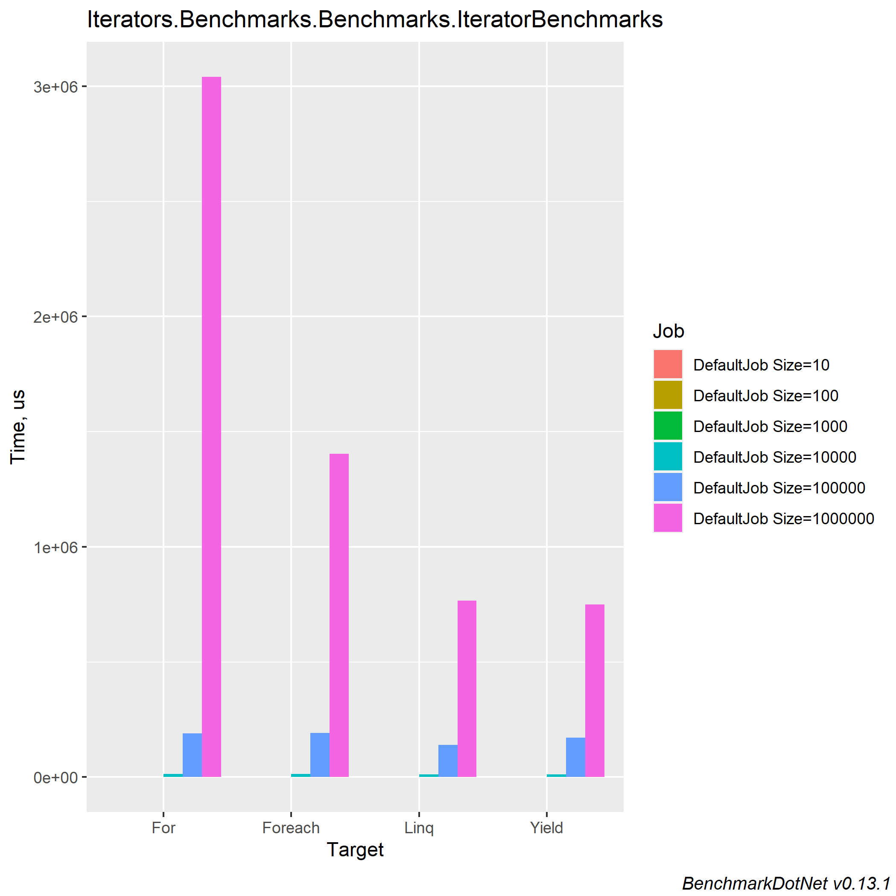
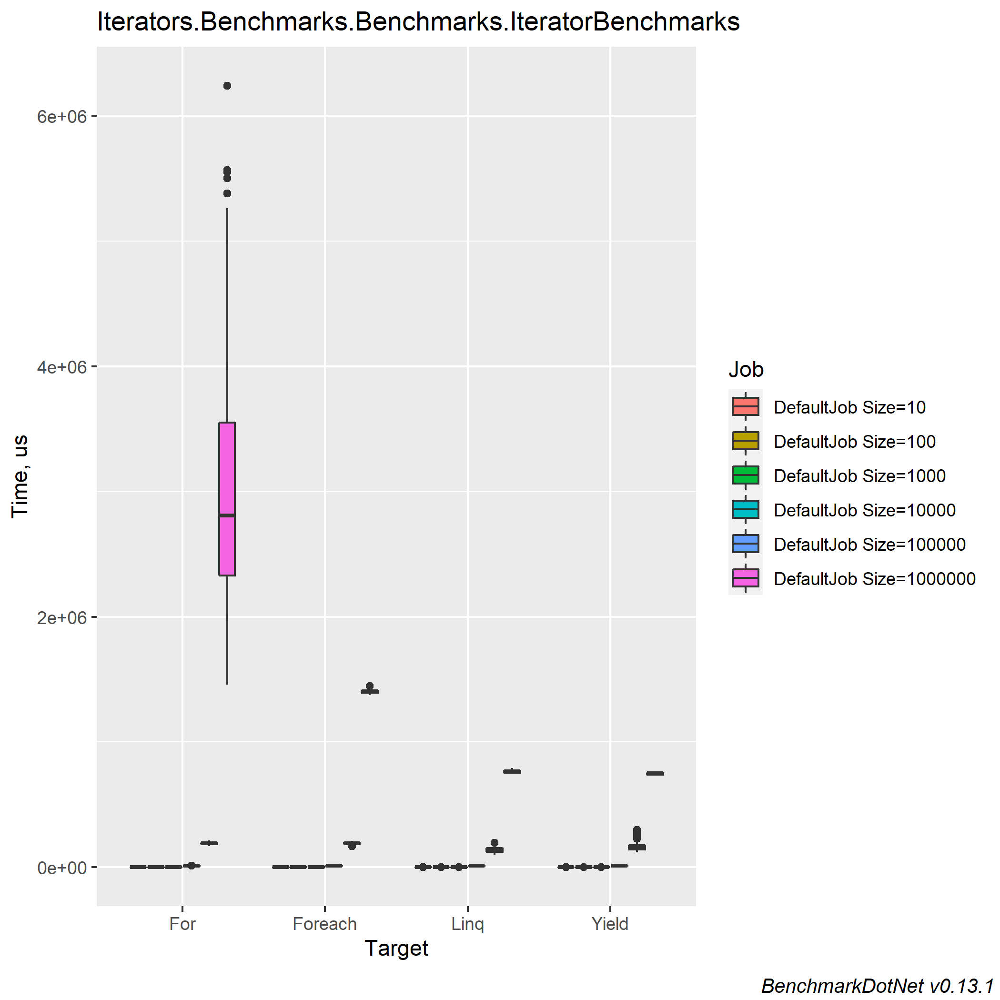

# Comparing collections iteration (For, Foreach, Linq)

### Table of contents
- [Machine information](#machine-information)
- [Benchmark results](#benchmark-results)
- [Conclusions](#conclusions)

<a name="machine-information"></a>
## Machine Information
 
``` ini
BenchmarkDotNet=v0.13.1, OS=Windows 10.0.22621
Intel Core i7-8550U CPU 1.80GHz (Kaby Lake R), 1 CPU, 8 logical and 4 physical cores
.NET SDK=6.0.202
  [Host]     : .NET 6.0.4 (6.0.422.16404), X64 RyuJIT
  DefaultJob : .NET 6.0.4 (6.0.422.16404), X64 RyuJIT
```
<a name="benchmark-results"></a>
## Benchmark results

| Method  | Size    |             Mean |           Error |            StdDev |          StdErr |           Median |              Min |               Q1 |               Q3 |              Max |         Op/s | Ratio | RatioSD |      Gen 0 |      Gen 1 |     Gen 2 |  Allocated |
|---------|---------|-----------------:|----------------:|------------------:|----------------:|-----------------:|-----------------:|-----------------:|-----------------:|-----------------:|-------------:|------:|--------:|-----------:|-----------:|----------:|-----------:|
| For     | 10      |         7.458 μs |       0.1068 μs |         0.0999 μs |       0.0258 μs |         7.487 μs |         7.310 μs |         7.379 μs |         7.546 μs |         7.626 μs | 134,083.1537 |  1.00 |    0.00 |     0.9155 |          - |         - |       4 KB |
| Foreach | 10      |         7.615 μs |       0.1129 μs |         0.0943 μs |       0.0261 μs |         7.657 μs |         7.428 μs |         7.532 μs |         7.691 μs |         7.722 μs | 131,316.1779 |  1.02 |    0.02 |     0.9384 |          - |         - |       4 KB |
| Yield   | 10      |         7.819 μs |       0.1481 μs |         0.1313 μs |       0.0351 μs |         7.796 μs |         7.638 μs |         7.753 μs |         7.869 μs |         8.074 μs | 127,887.1478 |  1.05 |    0.02 |     0.9079 |          - |         - |       4 KB |
| Linq    | 10      |         7.981 μs |       0.1605 μs |         0.4312 μs |       0.0470 μs |         7.819 μs |         7.569 μs |         7.711 μs |         8.006 μs |         9.609 μs | 125,302.7137 |  1.10 |    0.09 |     0.9308 |          - |         - |       4 KB |
|         |         |                  |                 |                   |                 |                  |                  |                  |                  |                  |              |       |         |            |            |           |            |
| For     | 100     |        76.073 μs |       1.4976 μs |         1.5379 μs |       0.3730 μs |        75.890 μs |        73.977 μs |        74.965 μs |        76.945 μs |        79.209 μs |  13,145.3474 |  1.00 |    0.00 |     9.1553 |     0.2441 |         - |      37 KB |
| Foreach | 100     |        76.784 μs |       1.4960 μs |         1.6628 μs |       0.3815 μs |        76.158 μs |        74.695 μs |        75.726 μs |        77.730 μs |        80.433 μs |  13,023.5498 |  1.01 |    0.03 |     9.1553 |          - |         - |      38 KB |
| Linq    | 100     |        80.416 μs |       1.5968 μs |         2.0194 μs |       0.4211 μs |        80.122 μs |        78.111 μs |        79.012 μs |        80.828 μs |        85.624 μs |  12,435.3740 |  1.06 |    0.03 |     8.9111 |          - |         - |      37 KB |
| Yield   | 100     |        88.113 μs |       4.7844 μs |        13.0164 μs |       1.4036 μs |        83.130 μs |        73.721 μs |        79.681 μs |        92.883 μs |       133.487 μs |  11,349.1083 |  1.16 |    0.19 |     8.9111 |          - |         - |      37 KB |
|         |         |                  |                 |                   |                 |                  |                  |                  |                  |                  |              |       |         |            |            |           |            |
| Yield   | 1000    |     1,174.909 μs |      23.3994 μs |        39.0951 μs |       6.5159 μs |     1,173.825 μs |     1,079.770 μs |     1,145.907 μs |     1,196.052 μs |     1,272.271 μs |     851.1295 |  1.31 |    0.09 |    87.8906 |          - |         - |     367 KB |
| Linq    | 1000    |     1,219.245 μs |      24.4459 μs |        67.7396 μs |       7.1804 μs |     1,202.589 μs |     1,109.746 μs |     1,178.701 μs |     1,247.782 μs |     1,429.576 μs |     820.1800 |  1.04 |    0.40 |    87.8906 |          - |         - |     367 KB |
| Foreach | 1000    |     1,385.490 μs |      21.7725 μs |        16.9985 μs |       4.9071 μs |     1,383.764 μs |     1,360.794 μs |     1,373.861 μs |     1,396.888 μs |     1,416.027 μs |     721.7664 |  1.54 |    0.18 |    85.9375 |    25.3906 |         - |     375 KB |
| For     | 1000    |     1,474.076 μs |     242.0811 μs |       706.1619 μs |      71.3331 μs |     1,188.455 μs |       823.803 μs |       890.428 μs |     1,938.704 μs |     3,448.271 μs |     678.3910 |  1.00 |    0.00 |    87.8906 |    29.2969 |         - |     375 KB |
|         |         |                  |                 |                   |                 |                  |                  |                  |                  |                  |              |       |         |            |            |           |            |
| Yield   | 10000   |    11,557.362 μs |     222.7950 μs |       326.5700 μs |      60.6425 μs |    11,499.788 μs |    10,976.231 μs |    11,362.400 μs |    11,786.609 μs |    12,401.600 μs |      86.5249 |  0.85 |    0.03 |   890.6250 |          - |         - |   3,668 KB |
| Linq    | 10000   |    12,216.952 μs |     239.8830 μs |       450.5583 μs |      67.9242 μs |    12,203.095 μs |    11,268.245 μs |    11,975.372 μs |    12,452.714 μs |    13,088.334 μs |      81.8535 |  0.90 |    0.04 |   890.6250 |          - |         - |   3,668 KB |
| Foreach | 10000   |    13,058.904 μs |     259.1015 μs |       336.9052 μs |      68.7705 μs |    13,087.121 μs |    12,461.733 μs |    12,826.198 μs |    13,311.351 μs |    13,900.319 μs |      76.5761 |  0.96 |    0.03 |   625.0000 |   312.5000 |         - |   3,746 KB |
| For     | 10000   |    13,661.733 μs |     265.6202 μs |       284.2106 μs |      66.9891 μs |    13,624.604 μs |    13,107.058 μs |    13,511.512 μs |    13,823.602 μs |    14,301.797 μs |      73.1972 |  1.00 |    0.00 |   671.8750 |   328.1250 |         - |   3,746 KB |
|         |         |                  |                 |                   |                 |                  |                  |                  |                  |                  |              |       |         |            |            |           |            |
| Linq    | 100000  |   139,914.019 μs |   7,245.2397 μs |    21,019.7541 μs |   2,134.2327 μs |   135,730.100 μs |    98,562.800 μs |   124,518.200 μs |   152,018.800 μs |   193,699.900 μs |       7.1472 |  0.71 |    0.11 |  8000.0000 |          - |         - |  36,694 KB |
| Yield   | 100000  |   171,036.770 μs |  15,942.5598 μs |    44,966.2728 μs |   4,688.0580 μs |   152,892.000 μs |   120,866.500 μs |   143,829.925 μs |   176,634.275 μs |   297,281.600 μs |       5.8467 |  0.92 |    0.26 |  8000.0000 |          - |         - |  36,693 KB |
| For     | 100000  |   190,586.351 μs |   3,796.9507 μs |     9,868.7796 μs |   1,110.3245 μs |   190,593.200 μs |   166,892.200 μs |   183,304.050 μs |   196,383.150 μs |   213,956.300 μs |       5.2470 |  1.00 |    0.00 |  6000.0000 |  2000.0000 |         - |  37,475 KB |
| Foreach | 100000  |   192,242.728 μs |   3,844.1548 μs |     9,501.7981 μs |   1,119.7976 μs |   191,786.800 μs |   168,075.500 μs |   187,232.250 μs |   198,699.750 μs |   209,999.200 μs |       5.2018 |  1.01 |    0.07 |  6000.0000 |  2000.0000 |         - |  37,476 KB |
|         |         |                  |                 |                   |                 |                  |                  |                  |                  |                  |              |       |         |            |            |           |            |
| Yield   | 1000000 |   748,983.120 μs |  10,806.2345 μs |    10,108.1585 μs |   2,609.9153 μs |   749,527.500 μs |   731,592.300 μs |   741,155.900 μs |   755,564.850 μs |   766,521.700 μs |       1.3351 |  0.27 |    0.08 | 89000.0000 |          - |         - | 366,787 KB |
| Linq    | 1000000 |   765,760.440 μs |  13,050.2063 μs |    12,207.1711 μs |   3,151.8780 μs |   762,058.300 μs |   753,428.800 μs |   755,737.200 μs |   774,253.450 μs |   793,453.400 μs |       1.3059 |  0.28 |    0.08 | 89000.0000 |          - |         - | 366,790 KB |
| Foreach | 1000000 | 1,403,552.614 μs |  21,388.6901 μs |    18,960.5167 μs |   5,067.4112 μs | 1,402,343.150 μs | 1,373,645.000 μs | 1,391,800.225 μs | 1,410,911.550 μs | 1,446,306.500 μs |       0.7125 |  0.53 |    0.16 | 61000.0000 | 21000.0000 | 1000.0000 | 374,600 KB |
| For     | 1000000 | 3,040,406.014 μs | 383,160.3159 μs | 1,105,505.1194 μs | 112,830.1438 μs | 2,807,890.100 μs | 1,459,530.000 μs | 2,327,462.275 μs | 3,548,398.425 μs | 6,239,187.200 μs |       0.3289 |  1.00 |    0.00 | 60000.0000 | 21000.0000 | 1000.0000 | 374,617 KB |
#### MinIterationTime
`IteratorBenchmarks.Linq: Default` -> The minimum observed iteration time is 98.5628 ms which is very small. It's recommended to increase it to at least 100.0000 ms using more operations.
#### MultimodalDistribution
`IteratorBenchmarks.For: Default` -> It seems that the distribution can have several modes (mValue = 3)




<a name="conclusions"></a>
## Conclusions

There is no difference for now between `for` and `foreach`. For big chunks, better use `Linq` or returning as `Yield return` :)