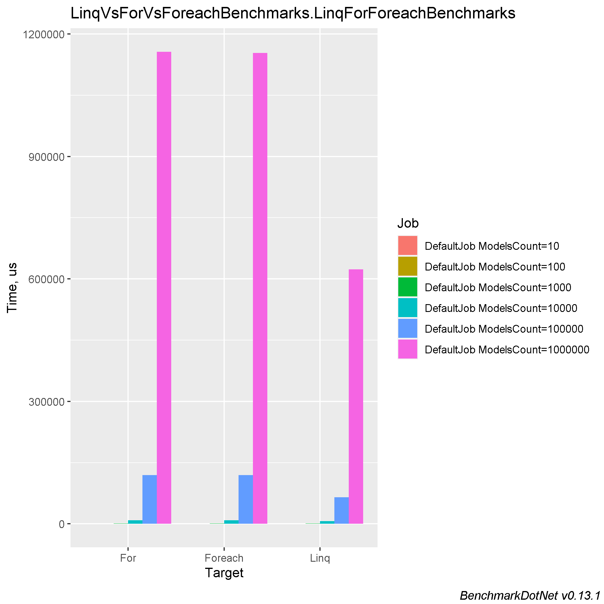
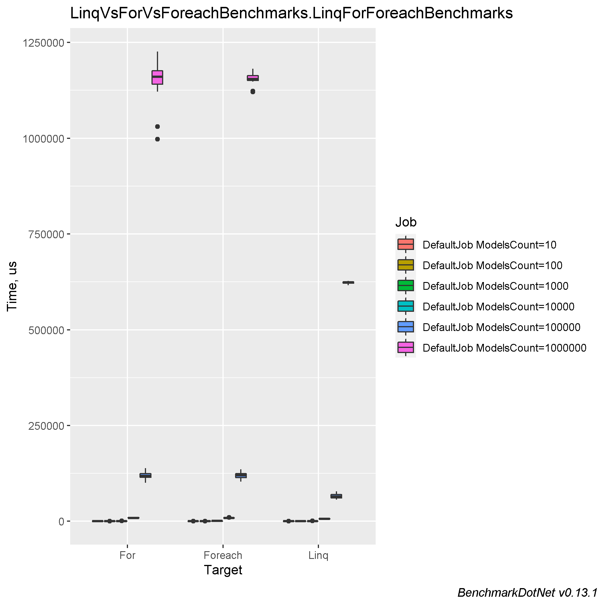

# Comparing collections iteration (For, Foreach, Linq)

### Table of contents
- [Machine information](#machine-information)
- [Benchmark results](#benchmark-results)
- [Conclusions](#conclusions)

<a name="machine-information"></a>
## Machine Information

``` ini
BenchmarkDotNet=v0.13.1, OS=Windows 10.0.22621
Intel Core i7-8550U CPU 1.80GHz (Kaby Lake R), 1 CPU, 8 logical and 4 physical cores
.NET SDK=6.0.202
  [Host]     : .NET 6.0.4 (6.0.422.16404), X64 RyuJIT
  DefaultJob : .NET 6.0.4 (6.0.422.16404), X64 RyuJIT
```
<a name="benchmark-results"></a>
## Benchmark results

| Method  | ModelsCount |             Mean |          Error |         StdDev |        StdErr |              Min |               Q1 |           Median |               Q3 |              Max |         Op/s | Ratio | RatioSD |      Gen 0 |      Gen 1 |    Gen 2 |  Allocated |
|---------|-------------|-----------------:|---------------:|---------------:|--------------:|-----------------:|-----------------:|-----------------:|-----------------:|-----------------:|-------------:|------:|--------:|-----------:|-----------:|---------:|-----------:|
| Foreach | 10          |         6.244 μs |      0.1243 μs |      0.1479 μs |     0.0323 μs |         6.020 μs |         6.123 μs |         6.241 μs |         6.286 μs |         6.593 μs | 160,148.5437 |  0.89 |    0.07 |     0.9232 |          - |        - |       4 KB |
| Linq    | 10          |         6.550 μs |      0.1288 μs |      0.3394 μs |     0.0377 μs |         5.824 μs |         6.323 μs |         6.500 μs |         6.723 μs |         7.477 μs | 152,675.7904 |  0.93 |    0.10 |     0.9155 |          - |        - |       4 KB |
| For     | 10          |         7.088 μs |      0.2590 μs |      0.7556 μs |     0.0763 μs |         5.845 μs |         6.514 μs |         6.927 μs |         7.525 μs |         9.005 μs | 141,077.8033 |  1.00 |    0.00 |     0.9155 |          - |        - |       4 KB |
|         |             |                  |                |                |               |                  |                  |                  |                  |                  |              |       |         |            |            |          |            |
| Foreach | 100         |        61.929 μs |      1.1767 μs |      1.5301 μs |     0.3123 μs |        59.436 μs |        61.041 μs |        61.477 μs |        62.728 μs |        65.367 μs |  16,147.4447 |  0.98 |    0.06 |     9.1553 |     0.3052 |        - |      37 KB |
| For     | 100         |        62.496 μs |      1.2449 μs |      2.8099 μs |     0.3598 μs |        58.765 μs |        60.689 μs |        61.764 μs |        63.142 μs |        69.980 μs |  16,001.0088 |  1.00 |    0.00 |     9.1553 |     1.2207 |        - |      37 KB |
| Linq    | 100         |        62.652 μs |      0.8719 μs |      0.7729 μs |     0.2066 μs |        61.300 μs |        62.150 μs |        62.717 μs |        63.263 μs |        63.717 μs |  15,961.1117 |  1.01 |    0.04 |     8.9111 |          - |        - |      37 KB |
|         |             |                  |                |                |               |                  |                  |                  |                  |                  |              |       |         |            |            |          |            |
| Linq    | 1000        |       624.369 μs |     11.9598 μs |     28.6550 μs |     3.4749 μs |       566.779 μs |       605.593 μs |       619.241 μs |       640.142 μs |       701.697 μs |   1,601.6171 |  0.98 |    0.06 |    88.8672 |          - |        - |     367 KB |
| For     | 1000        |       650.415 μs |     12.5005 μs |     15.8091 μs |     3.2964 μs |       633.528 μs |       639.054 μs |       646.155 μs |       657.162 μs |       695.453 μs |   1,537.4791 |  1.00 |    0.00 |    69.3359 |    33.2031 |        - |     374 KB |
| Foreach | 1000        |       666.754 μs |     15.8122 μs |     46.3746 μs |     4.6608 μs |       583.384 μs |       630.371 μs |       665.557 μs |       698.119 μs |       797.641 μs |   1,499.8038 |  1.04 |    0.09 |    70.3125 |    33.2031 |        - |     375 KB |
|         |             |                  |                |                |               |                  |                  |                  |                  |                  |              |       |         |            |            |          |            |
| Linq    | 10000       |     6,430.077 μs |    152.2339 μs |    448.8650 μs |    44.8865 μs |     5,662.298 μs |     6,158.122 μs |     6,420.350 μs |     6,727.973 μs |     7,529.581 μs |     155.5191 |  0.73 |    0.08 |   890.6250 |          - |        - |   3,668 KB |
| Foreach | 10000       |     8,651.908 μs |    169.6513 μs |    481.2724 μs |    49.9056 μs |     7,553.573 μs |     8,363.917 μs |     8,571.719 μs |     8,908.089 μs |     9,842.947 μs |     115.5814 |  0.97 |    0.12 |   640.6250 |   296.8750 |  46.8750 |   3,746 KB |
| For     | 10000       |     8,980.767 μs |    314.5593 μs |    907.5754 μs |    92.6290 μs |     7,424.141 μs |     8,278.642 μs |     8,761.676 μs |     9,686.451 μs |    11,377.884 μs |     111.3491 |  1.00 |    0.00 |   640.6250 |   296.8750 |  46.8750 |   3,746 KB |
|         |             |                  |                |                |               |                  |                  |                  |                  |                  |              |       |         |            |            |          |            |
| Linq    | 100000      |    65,423.309 μs |  1,878.4370 μs |  5,538.6138 μs |   553.8614 μs |    56,294.812 μs |    60,700.678 μs |    64,657.006 μs |    69,490.516 μs |    78,191.337 μs |      15.2851 |  0.55 |    0.06 |  8875.0000 |          - |        - |  36,677 KB |
| Foreach | 100000      |   119,072.207 μs |  2,593.2321 μs |  7,523.4364 μs |   763.8892 μs |   103,476.520 μs |   113,730.060 μs |   119,647.380 μs |   124,526.320 μs |   135,699.020 μs |       8.3983 |  1.00 |    0.09 |  6400.0000 |  2600.0000 | 600.0000 |  37,459 KB |
| For     | 100000      |   119,250.587 μs |  2,799.2551 μs |  8,165.5586 μs |   824.8460 μs |   100,424.080 μs |   114,451.210 μs |   118,761.720 μs |   124,539.775 μs |   138,919.360 μs |       8.3857 |  1.00 |    0.00 |  6400.0000 |  2600.0000 | 600.0000 |  37,459 KB |
|         |             |                  |                |                |               |                  |                  |                  |                  |                  |              |       |         |            |            |          |            |
| Linq    | 1000000     |   623,254.700 μs |  4,467.2416 μs |  3,487.7284 μs | 1,006.8205 μs |   616,104.200 μs |   621,647.350 μs |   623,701.400 μs |   625,461.450 μs |   627,576.400 μs |       1.6045 |  0.54 |    0.04 | 89000.0000 |          - |        - | 366,768 KB |
| Foreach | 1000000     | 1,153,510.975 μs | 22,283.0925 μs | 17,397.1729 μs | 5,022.1312 μs | 1,121,142.300 μs | 1,150,411.175 μs | 1,154,407.850 μs | 1,163,174.750 μs | 1,181,766.100 μs |       0.8669 |  1.01 |    0.08 | 59000.0000 | 20000.0000 |        - | 374,580 KB |
| For     | 1000000     | 1,156,337.862 μs | 22,820.5393 μs | 41,728.6466 μs | 6,438.8700 μs |   997,330.400 μs | 1,141,195.200 μs | 1,160,636.900 μs | 1,175,847.650 μs | 1,226,216.700 μs |       0.8648 |  1.00 |    0.00 | 59000.0000 | 20000.0000 |        - | 374,581 KB |




<a name="conclusions"></a>
## Conclusions

There is no difference for now between `for` and `foreach`. For big chunks, better use `Linq` :)