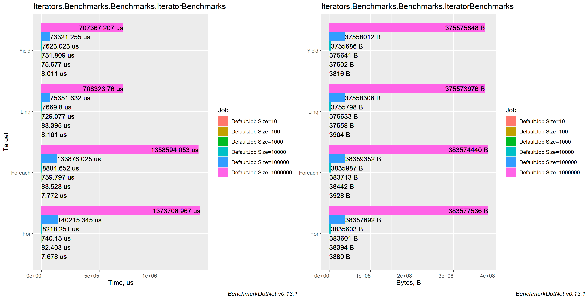

# Comparing collections iteration (For, Foreach, Linq)

### Table of contents
- [Machine information](#machine-information)
- [Benchmark results](#benchmark-results)
- [Conclusions](#conclusions)

<a name="machine-information"></a>
## Machine Information
 
``` ini
BenchmarkDotNet=v0.13.1, OS=Windows 10.0.22621
Intel Core i7-8550U CPU 1.80GHz (Kaby Lake R), 1 CPU, 8 logical and 4 physical cores
.NET SDK=6.0.202
  [Host]     : .NET 6.0.4 (6.0.422.16404), X64 RyuJIT
  DefaultJob : .NET 6.0.4 (6.0.422.16404), X64 RyuJIT
```
<a name="benchmark-results"></a>
## Benchmark results

| Method  | Size    |             Mean |           Error |            StdDev |          StdErr |         Op/s |  Allocated |
|---------|---------|-----------------:|----------------:|------------------:|----------------:|-------------:|-----------:|
| For     | 10      |         7.458 μs |       0.1068 μs |         0.0999 μs |       0.0258 μs | 134,083.1537 |       4 KB |
| Foreach | 10      |         7.615 μs |       0.1129 μs |         0.0943 μs |       0.0261 μs | 131,316.1779 |       4 KB |
| Yield   | 10      |         7.819 μs |       0.1481 μs |         0.1313 μs |       0.0351 μs | 127,887.1478 |       4 KB |
| Linq    | 10      |         7.981 μs |       0.1605 μs |         0.4312 μs |       0.0470 μs | 125,302.7137 |       4 KB |
|         |         |                  |                 |                   |                 |              |            |
| For     | 100     |        76.073 μs |       1.4976 μs |         1.5379 μs |       0.3730 μs |  13,145.3474 |      37 KB |
| Foreach | 100     |        76.784 μs |       1.4960 μs |         1.6628 μs |       0.3815 μs |  13,023.5498 |      38 KB |
| Linq    | 100     |        80.416 μs |       1.5968 μs |         2.0194 μs |       0.4211 μs |  12,435.3740 |      37 KB |
| Yield   | 100     |        88.113 μs |       4.7844 μs |        13.0164 μs |       1.4036 μs |  11,349.1083 |      37 KB |
|         |         |                  |                 |                   |                 |              |            |
| Yield   | 1000    |     1,174.909 μs |      23.3994 μs |        39.0951 μs |       6.5159 μs |     851.1295 |     367 KB |
| Linq    | 1000    |     1,219.245 μs |      24.4459 μs |        67.7396 μs |       7.1804 μs |     820.1800 |     367 KB |
| Foreach | 1000    |     1,385.490 μs |      21.7725 μs |        16.9985 μs |       4.9071 μs |     721.7664 |     375 KB |
| For     | 1000    |     1,474.076 μs |     242.0811 μs |       706.1619 μs |      71.3331 μs |     678.3910 |     375 KB |
|         |         |                  |                 |                   |                 |              |            |
| Yield   | 10000   |    11,557.362 μs |     222.7950 μs |       326.5700 μs |      60.6425 μs |      86.5249 |   3,668 KB |
| Linq    | 10000   |    12,216.952 μs |     239.8830 μs |       450.5583 μs |      67.9242 μs |      81.8535 |   3,668 KB |
| Foreach | 10000   |    13,058.904 μs |     259.1015 μs |       336.9052 μs |      68.7705 μs |      76.5761 |   3,746 KB |
| For     | 10000   |    13,661.733 μs |     265.6202 μs |       284.2106 μs |      66.9891 μs |      73.1972 |   3,746 KB |
|         |         |                  |                 |                   |                 |              |            |
| Linq    | 100000  |   139,914.019 μs |   7,245.2397 μs |    21,019.7541 μs |   2,134.2327 μs |       7.1472 |  36,694 KB |
| Yield   | 100000  |   171,036.770 μs |  15,942.5598 μs |    44,966.2728 μs |   4,688.0580 μs |       5.8467 |  36,693 KB |
| For     | 100000  |   190,586.351 μs |   3,796.9507 μs |     9,868.7796 μs |   1,110.3245 μs |       5.2470 |  37,475 KB |
| Foreach | 100000  |   192,242.728 μs |   3,844.1548 μs |     9,501.7981 μs |   1,119.7976 μs |       5.2018 |  37,476 KB |
|         |         |                  |                 |                   |                 |              |            |
| Yield   | 1000000 |   748,983.120 μs |  10,806.2345 μs |    10,108.1585 μs |   2,609.9153 μs |       1.3351 | 366,787 KB |
| Linq    | 1000000 |   765,760.440 μs |  13,050.2063 μs |    12,207.1711 μs |   3,151.8780 μs |       1.3059 | 366,790 KB |
| Foreach | 1000000 | 1,403,552.614 μs |  21,388.6901 μs |    18,960.5167 μs |   5,067.4112 μs |       0.7125 | 374,600 KB |
| For     | 1000000 | 3,040,406.014 μs | 383,160.3159 μs | 1,105,505.1194 μs | 112,830.1438 μs |       0.3289 | 374,617 KB |
#### MinIterationTime
`IteratorBenchmarks.Linq: Default` -> The minimum observed iteration time is 98.5628 ms which is very small. It's recommended to increase it to at least 100.0000 ms using more operations.
#### MultimodalDistribution
`IteratorBenchmarks.For: Default` -> It seems that the distribution can have several modes (mValue = 3)



<a name="conclusions"></a>
## Conclusions

There is no difference for now between `for` and `foreach`. For big chunks, better use `Linq` or returning as `Yield return`.