# Comparing different libraries for Json Serialization/Deserialization

### Table of contents
- [Machine information](#machine-information)
- [Sources](#sources)
- [Benchmark results](#benchmark-results)
  * [Deserialization](#deserialization)
    * [Simple Model](#simple-model-deserialization)
      * [String](#string-simple-deserialization)
      * [Bytes](#bytes-simple-deserialization)
      * [Stream](#stream-simple-deserialization)
      * [Asynchronous stream](#async-stream-simple-deserialization)
    * [Complex Model](#complex-model-deserialization)
      * [String](#string-complex-deserialization)
      * [Bytes](#bytes-complex-deserialization)
      * [Stream](#stream-complex-deserialization)
      * [Async stream](#async-stream-complex-deserialization)
  * [Serialization](#serialization)
    * [Simple Model](#simple-model-serialization)
      * [String](#string-simple-serialization)
      * [Bytes](#bytes-simple-serialization)
      * [Stream](#stream-simple-serialization)
      * [Asynchronous stream](#async-stream-simple-serialization)
    * [Complex Model](#complex-model-serialization)
      * [String](#string-complex-serialization)
      * [Bytes](#bytes-complex-serialization)
      * [Stream](#stream-complex-serialization)
      * [Async stream](#async-stream-complex-serialization)
- [Conclusions](#conclusions)

<a name="machine-information"></a>
## Machine Information

``` ini
BenchmarkDotNet=v0.13.1, OS=Windows 10.0.22621
Intel Core i7-8550U CPU 1.80GHz (Kaby Lake R), 1 CPU, 8 logical and 4 physical cores
.NET SDK=6.0.202
  [Host]     : .NET 6.0.4 (6.0.422.16404), X64 RyuJIT
  DefaultJob : .NET 6.0.4 (6.0.422.16404), X64 RyuJIT
```
<a name="sources"></a>
## Sources

Currently, following Json Serialization/Deserialization libraries were used:

- MaverickJson : https://github.com/zlatanov/json
- ServiceStack : https://github.com/ServiceStack/ServiceStack
- SpanJson : https://github.com/Tornhoof/SpanJson
- MsgPack : https://github.com/neuecc/MessagePack-CSharp
- Jil : https://github.com/kevin-montrose/Jil
- Utf8Json : https://github.com/neuecc/Utf8Json
- Newtonsoft.Json : https://github.com/JamesNK/Newtonsoft.Json
- Protobuf.Net : https://github.com/protobuf-net/protobuf-net
- JsonSrcGen : https://github.com/trampster/JsonSrcGen **NOTE** Does not support TimeSpan and Enum.
- NETJson : https://github.com/rpgmaker/NetJSON **NOTE** Camelcase troubles (issue with developer created).
- ZeroFormatter : https://github.com/alexinea/Alexinea.ZeroFormatter/ (fork with fixes) **Note** This library is no longer supported, so i use this fork with fixes.

<a name="benchmark-results"></a>
# Benchmark results

<a name="deserialization"></a>
# Deserialization

<a name="simple-model-deserialization"></a>
## Simple Model

<a name="string-simple-deserialization"></a>
### String
| Method                  | CollectionSize |            Mean |         Error |        StdDev |       StdErr |             Min |              Q1 |          Median |              Q3 |             Max |         Op/s | Ratio | RatioSD |    Gen 0 |    Gen 1 |    Gen 2 |   Allocated |
|-------------------------|----------------|----------------:|--------------:|--------------:|-------------:|----------------:|----------------:|----------------:|----------------:|----------------:|-------------:|------:|--------:|---------:|---------:|---------:|------------:|
| JsonSrcGen              | 1              |        155.9 ns |       1.12 ns |       0.99 ns |      0.26 ns |        154.5 ns |        155.0 ns |        156.2 ns |        156.5 ns |        157.6 ns | 6,412,419.91 |  0.22 |    0.00 |   0.0286 |        - |        - |       120 B |
| SpanJson                | 1              |        261.2 ns |       3.86 ns |       3.01 ns |      0.87 ns |        255.9 ns |        259.9 ns |        260.8 ns |        262.6 ns |        266.2 ns | 3,828,061.49 |  0.36 |    0.00 |   0.0267 |        - |        - |       112 B |
| Utf8Json                | 1              |        369.0 ns |       3.64 ns |       3.41 ns |      0.88 ns |        364.4 ns |        366.5 ns |        367.9 ns |        371.8 ns |        375.8 ns | 2,709,826.87 |  0.52 |    0.01 |   0.0668 |        - |        - |       280 B |
| Jil                     | 1              |        398.9 ns |       3.53 ns |       2.95 ns |      0.82 ns |        394.0 ns |        397.4 ns |        398.6 ns |        400.3 ns |        405.2 ns | 2,506,762.35 |  0.56 |    0.00 |   0.0629 |        - |        - |       264 B |
| NetJson                 | 1              |        493.1 ns |       5.38 ns |       4.77 ns |      1.27 ns |        489.2 ns |        490.1 ns |        490.9 ns |        494.1 ns |        505.1 ns | 2,027,893.50 |  0.69 |    0.01 |   0.0839 |        - |        - |       352 B |
| SystemTextJson          | 1              |        715.7 ns |       3.74 ns |       3.12 ns |      0.87 ns |        712.3 ns |        713.2 ns |        715.0 ns |        717.2 ns |        723.4 ns | 1,397,175.10 |  1.00 |    0.00 |   0.1392 |        - |        - |       584 B |
| SystemTextJsonSourceGen | 1              |        760.8 ns |       8.31 ns |       7.37 ns |      1.97 ns |        749.4 ns |        756.1 ns |        758.4 ns |        765.3 ns |        777.6 ns | 1,314,328.15 |  1.06 |    0.01 |   0.1392 |        - |        - |       584 B |
| ServiceStack            | 1              |        869.1 ns |       5.11 ns |       4.26 ns |      1.18 ns |        863.6 ns |        865.9 ns |        867.6 ns |        871.9 ns |        877.1 ns | 1,150,652.96 |  1.21 |    0.01 |   0.1431 |        - |        - |       600 B |
| Maverick                | 1              |        988.1 ns |      19.47 ns |      18.22 ns |      4.70 ns |        959.9 ns |        974.1 ns |        991.2 ns |        996.9 ns |      1,017.8 ns | 1,012,025.75 |  1.38 |    0.02 |   0.1144 |        - |        - |       480 B |
| Newtonsoft              | 1              |      1,621.0 ns |      17.12 ns |      16.01 ns |      4.13 ns |      1,592.9 ns |      1,611.7 ns |      1,623.5 ns |      1,634.7 ns |      1,643.1 ns |   616,896.95 |  2.27 |    0.03 |   0.7229 |        - |        - |     3,032 B |
|                         |                |                 |               |               |              |                 |                 |                 |                 |                 |              |       |         |          |          |          |             |
| JsonSrcGen              | 100            |     16,112.2 ns |     271.55 ns |     254.01 ns |     65.58 ns |     15,746.9 ns |     15,940.2 ns |     16,088.5 ns |     16,265.7 ns |     16,614.8 ns |    62,064.65 |  0.34 |    0.00 |   2.1667 |        - |        - |     9,104 B |
| SpanJson                | 100            |     16,603.3 ns |     233.82 ns |     218.72 ns |     56.47 ns |     16,337.3 ns |     16,435.6 ns |     16,553.4 ns |     16,711.3 ns |     17,046.1 ns |    60,228.91 |  0.35 |    0.01 |   2.1973 |        - |        - |     9,264 B |
| Utf8Json                | 100            |     26,053.3 ns |     161.29 ns |     142.98 ns |     38.21 ns |     25,882.2 ns |     25,998.3 ns |     26,015.1 ns |     26,088.9 ns |     26,361.9 ns |    38,382.79 |  0.55 |    0.01 |   4.1504 |   0.0610 |        - |    17,400 B |
| Jil                     | 100            |     29,908.2 ns |     342.27 ns |     285.81 ns |     79.27 ns |     29,678.1 ns |     29,747.6 ns |     29,817.0 ns |     29,853.6 ns |     30,652.3 ns |    33,435.65 |  0.63 |    0.01 |   2.5635 |        - |        - |    10,776 B |
| SystemTextJson          | 100            |     47,292.9 ns |     390.46 ns |     365.23 ns |     94.30 ns |     46,743.5 ns |     47,012.7 ns |     47,218.5 ns |     47,662.5 ns |     47,832.6 ns |    21,144.81 |  1.00 |    0.00 |   2.5635 |        - |        - |    10,960 B |
| NetJson                 | 100            |     47,610.3 ns |     266.34 ns |     236.10 ns |     63.10 ns |     47,200.1 ns |     47,457.7 ns |     47,581.9 ns |     47,769.3 ns |     48,082.3 ns |    21,003.86 |  1.01 |    0.01 |   6.6528 |        - |        - |    27,920 B |
| SystemTextJsonSourceGen | 100            |     49,804.8 ns |     250.39 ns |     221.96 ns |     59.32 ns |     49,478.9 ns |     49,694.4 ns |     49,763.2 ns |     49,918.9 ns |     50,343.2 ns |    20,078.37 |  1.05 |    0.01 |   2.6245 |        - |        - |    11,080 B |
| ServiceStack            | 100            |     64,154.6 ns |     692.44 ns |     613.83 ns |    164.05 ns |     63,001.7 ns |     63,815.5 ns |     63,997.2 ns |     64,587.9 ns |     65,241.3 ns |    15,587.35 |  1.36 |    0.02 |   4.1504 |        - |        - |    17,376 B |
| Maverick                | 100            |     68,435.2 ns |     621.84 ns |     581.67 ns |    150.19 ns |     67,209.6 ns |     68,032.1 ns |     68,481.6 ns |     68,868.4 ns |     69,270.0 ns |    14,612.36 |  1.45 |    0.01 |   2.5635 |   0.1221 |        - |    11,152 B |
| Newtonsoft              | 100            |    104,932.9 ns |   1,639.89 ns |   1,280.32 ns |    369.60 ns |    102,489.4 ns |    103,916.7 ns |    105,021.2 ns |    105,800.1 ns |    106,789.2 ns |     9,529.90 |  2.22 |    0.04 |   4.7607 |        - |        - |    20,336 B |
|                         |                |                 |               |               |              |                 |                 |                 |                 |                 |              |       |         |          |          |          |             |
| JsonSrcGen              | 1000           |    158,625.5 ns |   1,395.08 ns |   1,164.95 ns |    323.10 ns |    156,999.3 ns |    157,644.0 ns |    158,809.0 ns |    158,980.7 ns |    161,213.4 ns |     6,304.16 |  0.32 |    0.00 |  21.9727 |   0.4883 |        - |    92,144 B |
| SpanJson                | 1000           |    163,113.8 ns |     939.49 ns |     832.84 ns |    222.58 ns |    162,122.6 ns |    162,418.3 ns |    162,955.4 ns |    163,779.1 ns |    164,749.5 ns |     6,130.69 |  0.33 |    0.00 |  21.9727 |   0.7324 |        - |    92,161 B |
| Utf8Json                | 1000           |    259,676.6 ns |   3,162.79 ns |   2,469.30 ns |    712.82 ns |    256,516.3 ns |    258,071.2 ns |    258,727.6 ns |    260,924.9 ns |    265,445.7 ns |     3,850.94 |  0.52 |    0.01 |  39.5508 |   0.4883 |        - |   169,976 B |
| Jil                     | 1000           |    293,414.4 ns |   1,834.24 ns |   1,626.01 ns |    434.57 ns |    291,287.2 ns |    292,166.2 ns |    292,993.8 ns |    294,641.7 ns |    296,726.2 ns |     3,408.15 |  0.59 |    0.01 |  23.9258 |   7.8125 |        - |   100,720 B |
| NetJson                 | 1000           |    476,806.7 ns |   1,556.61 ns |   1,379.89 ns |    368.79 ns |    474,663.0 ns |    475,886.7 ns |    476,456.9 ns |    477,584.3 ns |    480,061.1 ns |     2,097.29 |  0.96 |    0.01 |  65.4297 |  12.6953 |        - |   274,969 B |
| SystemTextJson          | 1000           |    498,105.5 ns |   6,067.66 ns |   5,378.82 ns |  1,437.55 ns |    490,472.3 ns |    495,272.4 ns |    498,198.3 ns |    500,448.2 ns |    509,352.2 ns |     2,007.61 |  1.00 |    0.00 |  23.4375 |   7.8125 |        - |   101,129 B |
| SystemTextJsonSourceGen | 1000           |    515,339.2 ns |   7,646.80 ns |   7,152.82 ns |  1,846.85 ns |    502,875.0 ns |    511,511.6 ns |    513,149.7 ns |    521,576.7 ns |    529,311.3 ns |     1,940.47 |  1.04 |    0.01 |  23.4375 |   7.8125 |        - |   101,033 B |
| ServiceStack            | 1000           |    642,993.5 ns |   5,593.54 ns |   5,232.20 ns |  1,350.95 ns |    635,081.5 ns |    638,230.0 ns |    642,479.1 ns |    646,880.0 ns |    651,267.9 ns |     1,555.23 |  1.29 |    0.02 |  39.0625 |  12.6953 |        - |   164,705 B |
| Maverick                | 1000           |    720,801.8 ns |  12,511.74 ns |  11,091.34 ns |  2,964.28 ns |    700,694.5 ns |    712,840.6 ns |    717,893.6 ns |    730,799.8 ns |    739,692.5 ns |     1,387.34 |  1.45 |    0.02 |  24.4141 |   7.8125 |        - |   102,449 B |
| Newtonsoft              | 1000           |  1,011,399.6 ns |  11,880.67 ns |  10,531.90 ns |  2,814.77 ns |    987,956.8 ns |  1,006,595.2 ns |  1,014,197.9 ns |  1,017,123.7 ns |  1,030,555.3 ns |       988.73 |  2.03 |    0.03 |  35.1563 |  11.7188 |        - |   153,633 B |
|                         |                |                 |               |               |              |                 |                 |                 |                 |                 |              |       |         |          |          |          |             |
| JsonSrcGen              | 10000          |  1,791,153.2 ns |  21,562.04 ns |  19,114.19 ns |  5,108.48 ns |  1,769,453.7 ns |  1,775,762.3 ns |  1,789,276.3 ns |  1,800,214.9 ns |  1,834,996.5 ns |       558.30 |  0.31 |    0.01 | 146.4844 |  72.2656 |        - |   920,249 B |
| SpanJson                | 10000          |  1,869,030.3 ns |  19,494.87 ns |  16,279.10 ns |  4,515.01 ns |  1,853,376.6 ns |  1,854,935.2 ns |  1,865,018.9 ns |  1,882,019.1 ns |  1,905,715.4 ns |       535.04 |  0.32 |    0.01 | 146.4844 |  72.2656 |        - |   920,738 B |
| Jil                     | 10000          |  3,969,853.1 ns |  50,195.51 ns |  46,952.92 ns | 12,123.19 ns |  3,890,698.4 ns |  3,937,604.3 ns |  3,974,914.1 ns |  4,003,143.4 ns |  4,048,399.2 ns |       251.90 |  0.68 |    0.01 | 164.0625 |  78.1250 |  23.4375 | 1,102,872 B |
| Utf8Json                | 10000          |  4,102,512.5 ns |  80,279.92 ns | 150,785.15 ns | 22,731.72 ns |  3,843,832.0 ns |  3,995,115.8 ns |  4,109,955.9 ns |  4,191,742.2 ns |  4,485,557.0 ns |       243.75 |  0.69 |    0.04 | 234.3750 | 171.8750 |  85.9375 | 1,793,955 B |
| SystemTextJson          | 10000          |  5,873,927.9 ns |  96,229.46 ns |  90,013.09 ns | 23,241.28 ns |  5,713,088.3 ns |  5,816,561.3 ns |  5,842,625.0 ns |  5,969,480.9 ns |  5,987,788.3 ns |       170.24 |  1.00 |    0.00 | 250.0000 | 203.1250 | 101.5625 | 1,795,168 B |
| SystemTextJsonSourceGen | 10000          |  5,974,756.0 ns |  60,770.69 ns |  56,844.94 ns | 14,677.30 ns |  5,889,991.8 ns |  5,931,257.4 ns |  5,989,634.0 ns |  6,009,443.0 ns |  6,058,706.6 ns |       167.37 |  1.02 |    0.02 | 250.0000 | 203.1250 | 101.5625 | 1,793,546 B |
| NetJson                 | 10000          |  6,728,060.8 ns |  12,199.51 ns |  10,187.14 ns |  2,825.40 ns |  6,710,272.7 ns |  6,723,767.2 ns |  6,726,581.2 ns |  6,733,000.0 ns |  6,747,141.4 ns |       148.63 |  1.15 |    0.02 | 476.5625 | 164.0625 |  46.8750 | 2,841,115 B |
| Maverick                | 10000          |  8,525,475.6 ns | 161,570.95 ns | 179,585.69 ns | 41,199.78 ns |  8,214,884.4 ns |  8,390,246.1 ns |  8,562,179.7 ns |  8,648,450.8 ns |  8,824,757.8 ns |       117.30 |  1.45 |    0.05 | 250.0000 | 109.3750 |  31.2500 | 1,547,385 B |
| ServiceStack            | 10000          |  9,075,525.9 ns |  99,487.18 ns |  93,060.37 ns | 24,028.08 ns |  8,898,901.6 ns |  9,023,021.9 ns |  9,076,059.4 ns |  9,127,796.1 ns |  9,243,937.5 ns |       110.19 |  1.55 |    0.03 | 265.6250 | 125.0000 |  31.2500 | 1,743,036 B |
| Newtonsoft              | 10000          | 12,370,230.3 ns | 198,311.11 ns | 185,500.34 ns | 47,895.98 ns | 12,006,775.0 ns | 12,250,289.8 ns | 12,347,698.4 ns | 12,500,759.4 ns | 12,716,457.8 ns |        80.84 |  2.11 |    0.04 | 234.3750 | 109.3750 |  31.2500 | 1,587,084 B |

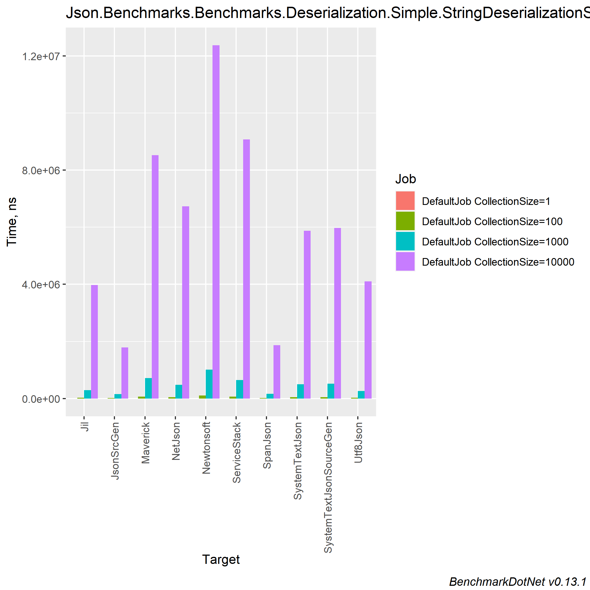

<a name="byte-simple-deserialization"></a>
### Byte
| Method                  | CollectionSize |            Mean |          Error |         StdDev |        StdErr |             Min |              Q1 |          Median |              Q3 |             Max |         Op/s | Ratio | RatioSD |    Gen 0 |    Gen 1 |    Gen 2 |   Allocated |
|-------------------------|----------------|----------------:|---------------:|---------------:|--------------:|----------------:|----------------:|----------------:|----------------:|----------------:|-------------:|------:|--------:|---------:|---------:|---------:|------------:|
| ZeroFormatter           | 1              |        90.01 ns |       1.279 ns |       1.196 ns |      0.309 ns |        88.54 ns |        89.14 ns |        89.39 ns |        90.83 ns |        92.23 ns | 11,110,098.2 |  0.14 |    0.00 |   0.0669 |        - |        - |       280 B |
| JsonSrcGen              | 1              |       206.87 ns |       1.469 ns |       1.303 ns |      0.348 ns |       205.27 ns |       205.78 ns |       206.59 ns |       207.85 ns |       209.48 ns |  4,833,959.5 |  0.32 |    0.00 |   0.0610 |        - |        - |       256 B |
| MsgPackClassic          | 1              |       242.21 ns |       2.620 ns |       2.046 ns |      0.591 ns |       237.89 ns |       242.00 ns |       242.34 ns |       243.36 ns |       244.93 ns |  4,128,665.7 |  0.37 |    0.00 |   0.0343 |        - |        - |       144 B |
| SpanJson                | 1              |       279.45 ns |       3.461 ns |       2.890 ns |      0.802 ns |       276.50 ns |       277.43 ns |       278.96 ns |       279.74 ns |       286.21 ns |  3,578,472.0 |  0.43 |    0.01 |   0.0267 |        - |        - |       112 B |
| Utf8Json                | 1              |       310.21 ns |       3.281 ns |       2.908 ns |      0.777 ns |       306.23 ns |       307.53 ns |       310.59 ns |       312.47 ns |       315.01 ns |  3,223,645.2 |  0.48 |    0.00 |   0.0420 |        - |        - |       176 B |
| MsgPackLz4              | 1              |       329.09 ns |       2.826 ns |       2.643 ns |      0.682 ns |       325.16 ns |       327.29 ns |       328.70 ns |       330.13 ns |       334.10 ns |  3,038,656.9 |  0.51 |    0.01 |   0.0343 |        - |        - |       144 B |
| Jil                     | 1              |       442.16 ns |       8.084 ns |       6.750 ns |      1.872 ns |       433.62 ns |       438.23 ns |       439.40 ns |       445.32 ns |       456.01 ns |  2,261,599.8 |  0.68 |    0.01 |   0.1049 |        - |        - |       440 B |
| Protobuf                | 1              |       647.38 ns |       6.102 ns |       5.707 ns |      1.474 ns |       640.56 ns |       643.22 ns |       645.39 ns |       652.68 ns |       656.58 ns |  1,544,688.2 |  1.00 |    0.01 |   0.0477 |        - |        - |       200 B |
| SystemTextJson          | 1              |       648.07 ns |       5.717 ns |       5.068 ns |      1.355 ns |       638.39 ns |       644.67 ns |       649.23 ns |       650.95 ns |       658.72 ns |  1,543,035.8 |  1.00 |    0.00 |   0.1373 |        - |        - |       576 B |
| SystemTextJsonSourceGen | 1              |       696.96 ns |       5.144 ns |       4.560 ns |      1.219 ns |       687.73 ns |       694.23 ns |       696.80 ns |       698.36 ns |       705.70 ns |  1,434,807.6 |  1.08 |    0.01 |   0.1373 |        - |        - |       576 B |
| Maverick                | 1              |       857.76 ns |      11.005 ns |       9.755 ns |      2.607 ns |       842.84 ns |       850.87 ns |       858.00 ns |       865.53 ns |       872.95 ns |  1,165,825.5 |  1.32 |    0.02 |   0.0706 |        - |        - |       296 B |
|                         |                |                 |                |                |               |                 |                 |                 |                 |                 |              |       |         |          |          |          |             |
| ZeroFormatter           | 100            |     6,570.75 ns |      71.353 ns |      59.583 ns |     16.525 ns |     6,506.80 ns |     6,524.35 ns |     6,543.11 ns |     6,623.02 ns |     6,701.34 ns |    152,189.7 |  0.14 |    0.00 |   5.3635 |   0.0076 |        - |    22,456 B |
| Protobuf                | 100            |    13,515.56 ns |      40.188 ns |      31.376 ns |      9.057 ns |    13,472.09 ns |    13,491.20 ns |    13,504.44 ns |    13,549.55 ns |    13,563.12 ns |     73,988.8 |  0.29 |    0.00 |   2.2125 |        - |        - |     9,264 B |
| MsgPackClassic          | 100            |    16,052.50 ns |     178.376 ns |     166.853 ns |     43.081 ns |    15,840.48 ns |    15,928.43 ns |    16,003.02 ns |    16,137.98 ns |    16,402.91 ns |     62,295.6 |  0.34 |    0.00 |   2.1973 |        - |        - |     9,272 B |
| MsgPackLz4              | 100            |    17,786.45 ns |     136.005 ns |     113.571 ns |     31.499 ns |    17,595.57 ns |    17,700.47 ns |    17,771.69 ns |    17,858.27 ns |    18,021.75 ns |     56,222.6 |  0.38 |    0.00 |   2.1973 |        - |        - |     9,256 B |
| SpanJson                | 100            |    18,022.15 ns |     107.553 ns |     100.605 ns |     25.976 ns |    17,805.25 ns |    17,961.26 ns |    18,035.48 ns |    18,095.74 ns |    18,179.20 ns |     55,487.3 |  0.38 |    0.00 |   2.1973 |        - |        - |     9,288 B |
| JsonSrcGen              | 100            |    21,212.41 ns |     421.944 ns |     374.042 ns |     99.967 ns |    20,873.99 ns |    20,921.54 ns |    21,104.23 ns |    21,345.26 ns |    21,996.28 ns |     47,142.2 |  0.45 |    0.01 |   5.4932 |   0.1221 |        - |    23,008 B |
| Utf8Json                | 100            |    24,852.10 ns |     238.033 ns |     222.657 ns |     57.490 ns |    24,557.77 ns |    24,694.85 ns |    24,803.92 ns |    24,999.44 ns |    25,324.90 ns |     40,238.0 |  0.53 |    0.00 |   2.5330 |   0.1526 |        - |    10,696 B |
| Jil                     | 100            |    28,496.08 ns |     142.774 ns |     133.551 ns |     34.483 ns |    28,306.33 ns |    28,382.15 ns |    28,490.34 ns |    28,564.17 ns |    28,747.98 ns |     35,092.5 |  0.61 |    0.01 |   5.8289 |   0.6409 |        - |    24,496 B |
| SystemTextJson          | 100            |    46,989.00 ns |     326.355 ns |     289.305 ns |     77.320 ns |    46,484.78 ns |    46,794.36 ns |    46,944.79 ns |    47,138.34 ns |    47,575.84 ns |     21,281.6 |  1.00 |    0.00 |   2.6245 |        - |        - |    11,064 B |
| SystemTextJsonSourceGen | 100            |    48,446.32 ns |     296.335 ns |     247.453 ns |     68.631 ns |    48,157.37 ns |    48,225.31 ns |    48,384.79 ns |    48,592.38 ns |    48,903.98 ns |     20,641.4 |  1.03 |    0.01 |   2.6245 |        - |        - |    11,032 B |
| Maverick                | 100            |    66,919.18 ns |     899.673 ns |     797.536 ns |    213.151 ns |    65,664.83 ns |    66,493.92 ns |    66,681.07 ns |    67,399.62 ns |    68,324.38 ns |     14,943.4 |  1.42 |    0.02 |   2.4414 |   0.1221 |        - |    10,713 B |
|                         |                |                 |                |                |               |                 |                 |                 |                 |                 |              |       |         |          |          |          |             |
| ZeroFormatter           | 1000           |    81,253.67 ns |   1,175.570 ns |     981.654 ns |    272.262 ns |    79,991.16 ns |    80,523.24 ns |    81,117.73 ns |    81,586.09 ns |    83,031.78 ns |     12,307.1 |  0.17 |    0.00 |  39.9170 |  18.4326 |        - |   224,056 B |
| Protobuf                | 1000           |   130,821.87 ns |     609.924 ns |     509.314 ns |    141.258 ns |   130,151.73 ns |   130,515.31 ns |   130,707.93 ns |   131,304.88 ns |   131,669.68 ns |      7,644.0 |  0.27 |    0.00 |  21.9727 |   7.3242 |        - |    92,144 B |
| MsgPackClassic          | 1000           |   161,545.59 ns |   1,541.557 ns |   1,441.974 ns |    372.316 ns |   159,748.75 ns |   160,233.84 ns |   161,511.13 ns |   162,253.02 ns |   164,009.47 ns |      6,190.2 |  0.33 |    0.00 |  21.9727 |   7.3242 |        - |    92,296 B |
| SpanJson                | 1000           |   179,027.43 ns |   1,119.006 ns |   1,046.719 ns |    270.262 ns |   177,695.63 ns |   178,249.56 ns |   178,661.72 ns |   179,495.52 ns |   181,269.87 ns |      5,585.7 |  0.36 |    0.00 |  21.9727 |   0.7324 |        - |    92,080 B |
| MsgPackLz4              | 1000           |   179,817.41 ns |   1,376.154 ns |   1,219.925 ns |    326.039 ns |   177,947.03 ns |   179,052.48 ns |   179,464.10 ns |   180,696.80 ns |   181,966.42 ns |      5,561.2 |  0.37 |    0.00 |  21.7285 |   7.0801 |        - |    91,800 B |
| JsonSrcGen              | 1000           |   227,994.59 ns |   1,663.375 ns |   1,388.993 ns |    385.237 ns |   225,784.91 ns |   227,281.35 ns |   227,959.18 ns |   228,764.14 ns |   230,827.44 ns |      4,386.1 |  0.46 |    0.01 |  41.9922 |  19.0430 |        - |   229,600 B |
| Utf8Json                | 1000           |   249,514.55 ns |   2,164.958 ns |   1,919.179 ns |    512.922 ns |   245,638.09 ns |   248,308.09 ns |   249,427.66 ns |   251,098.11 ns |   252,000.63 ns |      4,007.8 |  0.51 |    0.00 |  23.9258 |   7.8125 |        - |   100,642 B |
| Jil                     | 1000           |   349,237.99 ns |   4,176.243 ns |   3,906.460 ns |  1,008.644 ns |   344,411.82 ns |   346,733.13 ns |   347,486.28 ns |   351,846.34 ns |   357,108.79 ns |      2,863.4 |  0.71 |    0.01 |  47.8516 |  35.1563 |  23.9258 |   238,806 B |
| SystemTextJson          | 1000           |   490,990.21 ns |   5,349.559 ns |   5,003.980 ns |  1,292.022 ns |   484,129.00 ns |   486,851.61 ns |   489,488.77 ns |   496,031.69 ns |   499,519.92 ns |      2,036.7 |  1.00 |    0.00 |  23.4375 |   7.8125 |        - |   101,273 B |
| SystemTextJsonSourceGen | 1000           |   493,573.35 ns |   4,612.782 ns |   4,089.111 ns |  1,092.861 ns |   488,316.02 ns |   491,352.93 ns |   493,062.40 ns |   495,306.23 ns |   502,666.80 ns |      2,026.0 |  1.00 |    0.01 |  23.4375 |   7.8125 |        - |   101,105 B |
| Maverick                | 1000           |   686,659.14 ns |   6,135.332 ns |   5,438.812 ns |  1,453.584 ns |   678,896.09 ns |   683,592.70 ns |   686,016.99 ns |   689,117.82 ns |   696,821.29 ns |      1,456.3 |  1.40 |    0.02 |  23.4375 |   7.8125 |        - |   100,554 B |
|                         |                |                 |                |                |               |                 |                 |                 |                 |                 |              |       |         |          |          |          |             |
| Protobuf                | 10000          | 1,541,772.13 ns |  14,951.930 ns |  13,254.496 ns |  3,542.413 ns | 1,527,784.18 ns | 1,533,816.02 ns | 1,539,103.22 ns | 1,543,181.49 ns | 1,568,698.05 ns |        648.6 |  0.26 |    0.00 | 146.4844 |  72.2656 |        - |   920,802 B |
| ZeroFormatter           | 10000          | 1,647,151.99 ns |   8,862.098 ns |   7,856.019 ns |  2,099.609 ns | 1,633,250.20 ns | 1,642,595.95 ns | 1,645,715.72 ns | 1,651,273.39 ns | 1,665,129.88 ns |        607.1 |  0.27 |    0.00 | 355.4688 | 177.7344 |        - | 2,240,057 B |
| MsgPackClassic          | 10000          | 1,813,648.27 ns |   9,702.929 ns |   9,076.126 ns |  2,343.446 ns | 1,800,540.82 ns | 1,807,570.90 ns | 1,811,093.36 ns | 1,819,094.73 ns | 1,830,270.51 ns |        551.4 |  0.30 |    0.00 | 146.4844 |  72.2656 |        - |   920,865 B |
| MsgPackLz4              | 10000          | 2,015,186.86 ns |  12,823.118 ns |  11,367.360 ns |  3,038.055 ns | 1,999,347.07 ns | 2,006,583.98 ns | 2,014,183.01 ns | 2,020,052.64 ns | 2,040,790.82 ns |        496.2 |  0.34 |    0.00 | 144.5313 |  70.3125 |        - |   920,860 B |
| SpanJson                | 10000          | 2,020,004.35 ns |  37,334.159 ns |  34,922.396 ns |  9,016.924 ns | 1,986,544.14 ns | 1,991,796.29 ns | 2,009,507.81 ns | 2,038,692.38 ns | 2,103,228.52 ns |        495.0 |  0.34 |    0.00 | 144.5313 |  70.3125 |        - |   919,708 B |
| JsonSrcGen              | 10000          | 2,980,045.78 ns |  14,633.662 ns |  12,219.771 ns |  3,389.155 ns | 2,952,855.27 ns | 2,973,206.05 ns | 2,980,506.45 ns | 2,985,774.80 ns | 2,997,534.96 ns |        335.6 |  0.50 |    0.01 | 363.2813 | 179.6875 |        - | 2,292,155 B |
| Utf8Json                | 10000          | 3,571,938.91 ns |  42,627.662 ns |  39,873.942 ns | 10,295.407 ns | 3,527,469.92 ns | 3,539,878.12 ns | 3,563,030.08 ns | 3,592,841.60 ns | 3,664,386.33 ns |        280.0 |  0.60 |    0.01 | 167.9688 |  85.9375 |  31.2500 | 1,102,635 B |
| Jil                     | 10000          | 4,253,553.84 ns |  84,849.854 ns | 208,138.137 ns | 24,701.452 ns | 3,848,175.78 ns | 4,098,935.94 ns | 4,269,995.31 ns | 4,412,871.48 ns | 4,672,719.53 ns |        235.1 |  0.70 |    0.04 | 304.6875 | 296.8750 | 156.2500 | 2,484,230 B |
| SystemTextJsonSourceGen | 10000          | 5,914,632.42 ns |  97,272.772 ns |  90,989.011 ns | 23,493.262 ns | 5,823,408.98 ns | 5,844,817.97 ns | 5,856,556.64 ns | 5,970,364.06 ns | 6,102,833.20 ns |        169.1 |  0.99 |    0.02 | 164.0625 |  78.1250 |  23.4375 | 1,103,415 B |
| SystemTextJson          | 10000          | 5,992,005.31 ns |  79,189.562 ns |  74,073.966 ns | 19,125.816 ns | 5,835,698.44 ns | 5,952,993.75 ns | 5,972,557.81 ns | 6,041,316.80 ns | 6,127,134.38 ns |        166.9 |  1.00 |    0.00 | 164.0625 |  78.1250 |  23.4375 | 1,103,488 B |
| Maverick                | 10000          | 7,947,780.99 ns | 151,751.022 ns | 162,371.893 ns | 38,271.422 ns | 7,720,562.50 ns | 7,813,029.30 ns | 7,942,510.16 ns | 8,045,719.92 ns | 8,255,576.56 ns |        125.8 |  1.32 |    0.03 | 156.2500 |  78.1250 |  15.6250 | 1,102,361 B |

<a name="stream-simple-deserialization"></a>
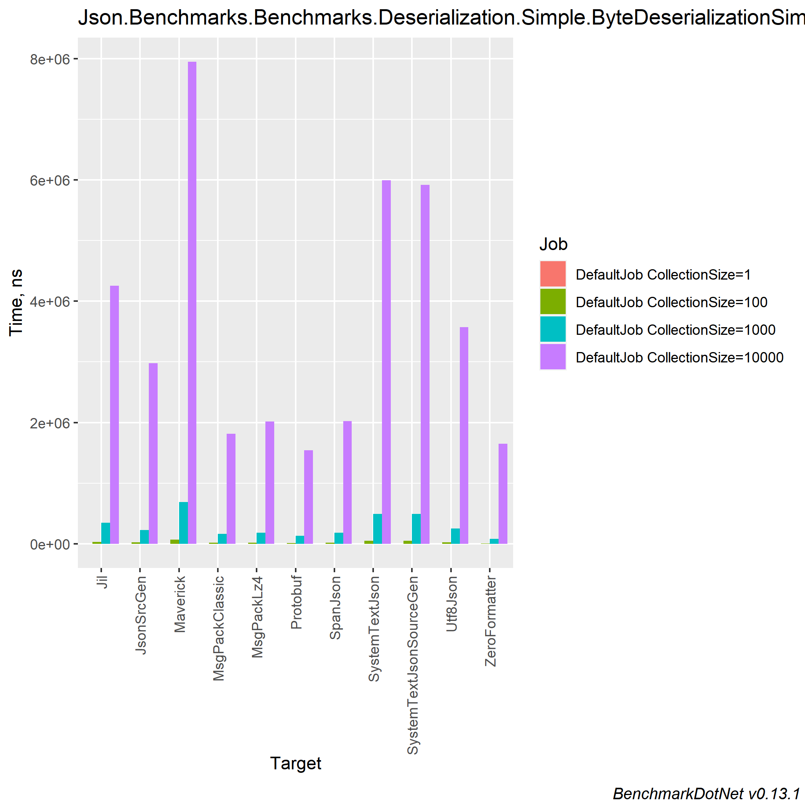
### Stream
| Method                  | CollectionSize |           Mean |         Error |        StdDev |       StdErr |         Median |            Min |             Q1 |              Q3 |             Max |        Op/s | Ratio | RatioSD |    Gen 0 |    Gen 1 |    Gen 2 |   Allocated |
|-------------------------|----------------|---------------:|--------------:|--------------:|-------------:|---------------:|---------------:|---------------:|----------------:|----------------:|------------:|------:|--------:|---------:|---------:|---------:|------------:|
| SpanJson                | 1              |       332.7 ns |       3.14 ns |       2.79 ns |      0.74 ns |       332.7 ns |       328.8 ns |       331.2 ns |        333.3 ns |        337.5 ns | 3,006,093.9 |  0.40 |    0.01 |   0.0515 |        - |        - |       216 B |
| Utf8Json                | 1              |       364.8 ns |       2.72 ns |       2.41 ns |      0.64 ns |       365.2 ns |       360.7 ns |       362.7 ns |        366.3 ns |        368.2 ns | 2,741,118.8 |  0.44 |    0.01 |   0.0420 |        - |        - |       176 B |
| MsgPackClassic          | 1              |       493.3 ns |       6.50 ns |       5.76 ns |      1.54 ns |       492.5 ns |       479.9 ns |       491.3 ns |        496.5 ns |        502.7 ns | 2,027,285.9 |  0.59 |    0.02 |   0.0362 |        - |        - |       152 B |
| MsgPackLz4              | 1              |       570.7 ns |       4.55 ns |       3.55 ns |      1.02 ns |       572.3 ns |       563.9 ns |       568.6 ns |        572.9 ns |        575.0 ns | 1,752,085.4 |  0.68 |    0.02 |   0.0324 |        - |        - |       136 B |
| Protobuf                | 1              |       649.3 ns |       8.62 ns |       8.06 ns |      2.08 ns |       648.1 ns |       640.1 ns |       642.8 ns |        653.6 ns |        668.2 ns | 1,540,114.5 |  0.78 |    0.02 |   0.0553 |        - |        - |       232 B |
| SystemTextJson          | 1              |       827.4 ns |      14.89 ns |      20.38 ns |      4.00 ns |       819.4 ns |       796.9 ns |       815.0 ns |        842.5 ns |        884.2 ns | 1,208,555.7 |  1.00 |    0.00 |   0.1392 |        - |        - |       584 B |
| SystemTextJsonSourceGen | 1              |       837.6 ns |       8.54 ns |       6.66 ns |      1.92 ns |       837.3 ns |       828.2 ns |       833.1 ns |        841.6 ns |        848.0 ns | 1,193,852.4 |  1.00 |    0.03 |   0.1392 |        - |        - |       584 B |
| Maverick                | 1              |       914.7 ns |      11.25 ns |       9.40 ns |      2.61 ns |       912.0 ns |       906.3 ns |       908.5 ns |        917.0 ns |        940.4 ns | 1,093,208.9 |  1.10 |    0.03 |   0.0973 |        - |        - |       408 B |
| ServiceStack            | 1              |     1,252.4 ns |      15.33 ns |      14.34 ns |      3.70 ns |     1,252.1 ns |     1,232.2 ns |     1,242.6 ns |      1,260.4 ns |      1,286.2 ns |   798,489.0 |  1.51 |    0.05 |   0.2155 |        - |        - |       904 B |
|                         |                |                |               |               |              |                |                |                |                 |                 |             |       |         |          |          |          |             |
| Protobuf                | 100            |    15,028.4 ns |     106.07 ns |      94.02 ns |     25.13 ns |    14,993.7 ns |    14,929.1 ns |    14,960.7 ns |     15,048.9 ns |     15,247.9 ns |    66,540.7 |  0.28 |    0.00 |   2.2125 |        - |        - |     9,256 B |
| MsgPackClassic          | 100            |    17,117.0 ns |     321.58 ns |     300.81 ns |     77.67 ns |    17,027.6 ns |    16,785.1 ns |    16,924.8 ns |     17,231.1 ns |     17,720.3 ns |    58,421.4 |  0.32 |    0.01 |   2.2278 |        - |        - |     9,328 B |
| SpanJson                | 100            |    18,954.2 ns |     132.69 ns |     124.12 ns |     32.05 ns |    18,940.0 ns |    18,742.0 ns |    18,897.0 ns |     19,029.4 ns |     19,183.1 ns |    52,758.7 |  0.36 |    0.00 |   3.8757 |        - |        - |    16,248 B |
| MsgPackLz4              | 100            |    19,144.1 ns |     263.98 ns |     246.93 ns |     63.76 ns |    19,066.4 ns |    18,885.6 ns |    18,946.8 ns |     19,298.8 ns |     19,574.6 ns |    52,235.3 |  0.36 |    0.01 |   2.1973 |        - |        - |     9,248 B |
| Utf8Json                | 100            |    25,294.1 ns |     195.46 ns |     163.22 ns |     45.27 ns |    25,231.6 ns |    25,048.8 ns |    25,224.9 ns |     25,416.8 ns |     25,639.5 ns |    39,535.0 |  0.48 |    0.00 |   2.5330 |        - |        - |    10,632 B |
| SystemTextJson          | 100            |    52,942.4 ns |     476.09 ns |     445.34 ns |    114.99 ns |    52,958.9 ns |    52,284.2 ns |    52,545.0 ns |     53,235.2 ns |     53,705.6 ns |    18,888.5 |  1.00 |    0.00 |   2.6245 |        - |        - |    11,000 B |
| SystemTextJsonSourceGen | 100            |    53,414.0 ns |     183.59 ns |     153.31 ns |     42.52 ns |    53,379.2 ns |    53,180.1 ns |    53,328.2 ns |     53,525.2 ns |     53,665.4 ns |    18,721.7 |  1.01 |    0.01 |   2.6245 |        - |        - |    11,008 B |
| ServiceStack            | 100            |    67,530.2 ns |     888.27 ns |     830.89 ns |    214.54 ns |    67,516.5 ns |    66,008.4 ns |    66,968.3 ns |     68,067.8 ns |     69,232.4 ns |    14,808.2 |  1.28 |    0.02 |   5.7373 |   0.1221 |        - |    24,410 B |
| Maverick                | 100            |    70,011.6 ns |     927.67 ns |     774.65 ns |    214.85 ns |    70,207.8 ns |    68,684.9 ns |    69,626.5 ns |     70,543.9 ns |     70,907.3 ns |    14,283.4 |  1.32 |    0.02 |   4.1504 |        - |        - |    17,808 B |
|                         |                |                |               |               |              |                |                |                |                 |                 |             |       |         |          |          |          |             |
| Protobuf                | 1000           |   153,370.6 ns |     995.10 ns |     930.81 ns |    240.34 ns |   153,561.1 ns |   151,407.1 ns |   152,751.5 ns |    154,040.8 ns |    154,564.1 ns |     6,520.2 |  0.24 |    0.00 |  21.9727 |   7.3242 |        - |    92,192 B |
| MsgPackClassic          | 1000           |   166,813.9 ns |   2,276.79 ns |   2,129.71 ns |    549.89 ns |   166,008.0 ns |   164,302.1 ns |   165,211.8 ns |    168,479.7 ns |    171,512.4 ns |     5,994.7 |  0.26 |    0.00 |  21.9727 |   7.3242 |        - |    91,896 B |
| MsgPackLz4              | 1000           |   181,731.2 ns |   1,168.16 ns |     912.02 ns |    263.28 ns |   181,451.5 ns |   180,049.3 ns |   181,323.5 ns |    182,427.0 ns |    183,386.1 ns |     5,502.6 |  0.29 |    0.00 |  21.9727 |   7.3242 |        - |    91,960 B |
| SpanJson                | 1000           |   194,669.5 ns |   1,353.60 ns |   1,199.93 ns |    320.70 ns |   194,621.6 ns |   193,311.3 ns |   193,621.6 ns |    195,307.4 ns |    197,034.6 ns |     5,136.9 |  0.31 |    0.00 |  38.3301 |  10.0098 |        - |   161,072 B |
| Utf8Json                | 1000           |   302,586.2 ns |   5,284.91 ns |   4,413.14 ns |  1,223.98 ns |   302,018.6 ns |   293,160.8 ns |   300,454.5 ns |    305,141.0 ns |    309,819.8 ns |     3,304.8 |  0.48 |    0.01 |  46.3867 |  33.2031 |  22.4609 |   231,806 B |
| SystemTextJsonSourceGen | 1000           |   626,856.8 ns |   5,045.35 ns |   4,213.10 ns |  1,168.50 ns |   627,468.1 ns |   617,652.8 ns |   624,821.9 ns |    629,312.2 ns |    633,612.4 ns |     1,595.3 |  0.99 |    0.01 |  23.4375 |   7.8125 |        - |   101,089 B |
| SystemTextJson          | 1000           |   632,444.7 ns |   5,708.88 ns |   5,060.77 ns |  1,352.55 ns |   631,900.4 ns |   624,282.9 ns |   628,648.3 ns |    636,852.2 ns |    641,215.7 ns |     1,581.2 |  1.00 |    0.00 |  23.4375 |   7.8125 |        - |   101,249 B |
| ServiceStack            | 1000           |   662,479.4 ns |   6,114.20 ns |   5,420.08 ns |  1,448.58 ns |   663,049.6 ns |   654,570.5 ns |   658,941.7 ns |    666,422.9 ns |    672,803.5 ns |     1,509.5 |  1.05 |    0.01 |  54.6875 |  17.5781 |        - |   234,303 B |
| Maverick                | 1000           |   707,344.1 ns |   5,603.99 ns |   4,375.23 ns |  1,263.02 ns |   708,457.3 ns |   694,724.4 ns |   707,184.0 ns |    709,391.5 ns |    711,691.7 ns |     1,413.7 |  1.12 |    0.01 |  39.0625 |  12.6953 |        - |   169,785 B |
|                         |                |                |               |               |              |                |                |                |                 |                 |             |       |         |          |          |          |             |
| Protobuf                | 10000          | 1,697,470.3 ns |  22,519.35 ns |  19,962.82 ns |  5,335.29 ns | 1,688,783.0 ns | 1,676,781.2 ns | 1,685,194.9 ns |  1,701,215.7 ns |  1,741,381.5 ns |       589.1 |  0.23 |    0.00 | 144.5313 |  72.2656 |        - |   919,530 B |
| MsgPackLz4              | 10000          | 2,515,150.8 ns |  40,600.46 ns |  37,977.69 ns |  9,805.80 ns | 2,499,755.3 ns | 2,462,084.2 ns | 2,493,732.6 ns |  2,546,161.3 ns |  2,578,431.4 ns |       397.6 |  0.34 |    0.00 | 167.9688 |  97.6563 |  23.4375 | 1,143,004 B |
| MsgPackClassic          | 10000          | 2,525,516.6 ns |  73,471.63 ns | 214,320.20 ns | 21,649.61 ns | 2,447,035.4 ns | 2,254,469.3 ns | 2,367,099.0 ns |  2,733,624.5 ns |  3,236,693.6 ns |       396.0 |  0.37 |    0.01 | 210.9375 | 140.6250 |  66.4063 | 1,415,129 B |
| SpanJson                | 10000          | 2,925,169.8 ns |  56,958.53 ns |  53,279.04 ns | 13,756.59 ns | 2,917,770.7 ns | 2,859,438.7 ns | 2,887,357.8 ns |  2,965,782.6 ns |  3,037,883.6 ns |       341.9 |  0.39 |    0.01 | 226.5625 | 171.8750 |  82.0313 | 1,611,061 B |
| Utf8Json                | 10000          | 5,137,106.2 ns | 102,671.79 ns | 212,035.05 ns | 29,403.97 ns | 5,119,494.9 ns | 4,651,606.2 ns | 4,959,532.6 ns |  5,261,205.7 ns |  5,637,182.8 ns |       194.7 |  0.69 |    0.03 | 351.5625 | 304.6875 | 203.1250 | 3,069,211 B |
| SystemTextJson          | 10000          | 7,482,713.9 ns |  64,092.56 ns |  59,952.22 ns | 15,479.60 ns | 7,501,480.5 ns | 7,403,977.3 ns | 7,428,824.6 ns |  7,532,964.5 ns |  7,584,502.3 ns |       133.6 |  1.00 |    0.00 | 164.0625 |  78.1250 |  23.4375 | 1,102,952 B |
| SystemTextJsonSourceGen | 10000          | 7,645,361.2 ns |  63,899.31 ns |  53,358.82 ns | 14,799.07 ns | 7,664,337.5 ns | 7,536,033.6 ns | 7,643,957.8 ns |  7,675,235.2 ns |  7,707,137.5 ns |       130.8 |  1.02 |    0.01 | 164.0625 |  78.1250 |  23.4375 | 1,102,423 B |
| Maverick                | 10000          | 7,866,861.1 ns | 111,444.32 ns |  98,792.49 ns | 26,403.40 ns | 7,858,336.3 ns | 7,736,356.2 ns | 7,775,455.5 ns |  7,939,817.6 ns |  8,048,168.8 ns |       127.1 |  1.05 |    0.01 | 265.6250 | 226.5625 | 117.1875 | 1,794,576 B |
| ServiceStack            | 10000          | 9,925,313.6 ns | 194,365.66 ns | 181,809.75 ns | 46,943.08 ns | 9,967,667.2 ns | 9,682,109.4 ns | 9,735,888.3 ns | 10,092,618.0 ns | 10,161,789.1 ns |       100.8 |  1.33 |    0.02 | 328.1250 | 218.7500 |  93.7500 | 2,455,969 B |
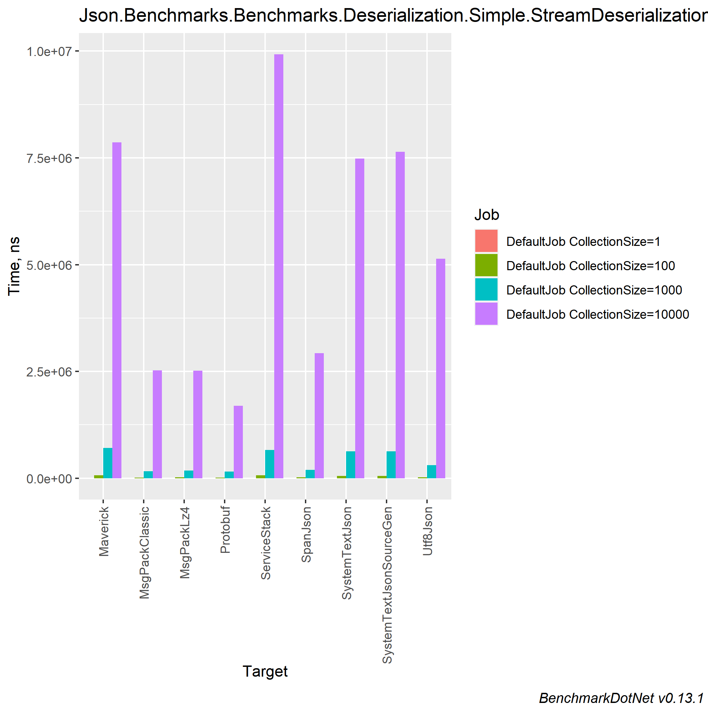
<a name="async-stream-simple-deserialization"></a>
### Async Stream
| Method                  | CollectionSize |           Mean |         Error |        StdDev |       StdErr |         Median |            Min |             Q1 |              Q3 |             Max |        Op/s | Ratio | RatioSD |    Gen 0 |    Gen 1 |    Gen 2 |   Allocated |
|-------------------------|----------------|---------------:|--------------:|--------------:|-------------:|---------------:|---------------:|---------------:|----------------:|----------------:|------------:|------:|--------:|---------:|---------:|---------:|------------:|
| SpanJson                | 1              |       433.2 ns |       6.85 ns |       6.07 ns |      1.62 ns |       430.9 ns |       427.4 ns |       429.4 ns |        435.8 ns |        448.3 ns | 2,308,394.6 |  0.40 |    0.01 |   0.0286 |        - |        - |       120 B |
| Utf8Json                | 1              |       436.9 ns |       1.85 ns |       1.54 ns |      0.43 ns |       436.5 ns |       434.5 ns |       436.2 ns |        437.8 ns |        440.1 ns | 2,288,960.4 |  0.40 |    0.00 |   0.0744 |        - |        - |       312 B |
| MsgPackClassic          | 1              |       541.4 ns |       2.78 ns |       2.47 ns |      0.66 ns |       541.4 ns |       537.7 ns |       539.4 ns |        543.1 ns |        545.7 ns | 1,847,137.6 |  0.50 |    0.00 |   0.0343 |        - |        - |       144 B |
| MsgPackLz4              | 1              |       641.7 ns |       6.19 ns |       5.17 ns |      1.43 ns |       640.9 ns |       635.6 ns |       637.4 ns |        644.2 ns |        653.0 ns | 1,558,426.8 |  0.59 |    0.01 |   0.0343 |        - |        - |       144 B |
| Protobuf                | 1              |       652.8 ns |       9.10 ns |       7.10 ns |      2.05 ns |       651.2 ns |       643.9 ns |       648.5 ns |        658.9 ns |        667.6 ns | 1,531,798.2 |  0.60 |    0.01 |   0.0534 |        - |        - |       224 B |
| SystemTextJsonSourceGen | 1              |     1,016.0 ns |       7.34 ns |       6.13 ns |      1.70 ns |     1,016.0 ns |     1,005.8 ns |     1,012.7 ns |      1,019.0 ns |      1,028.5 ns |   984,248.1 |  0.94 |    0.01 |   0.1373 |        - |        - |       576 B |
| SystemTextJson          | 1              |     1,081.1 ns |       8.92 ns |       7.91 ns |      2.11 ns |     1,078.4 ns |     1,071.7 ns |     1,074.9 ns |      1,087.5 ns |      1,094.4 ns |   924,989.2 |  1.00 |    0.00 |   0.1392 |        - |        - |       584 B |
| ServiceStack            | 1              |     1,350.7 ns |      13.14 ns |      12.29 ns |      3.17 ns |     1,350.9 ns |     1,334.4 ns |     1,341.3 ns |      1,358.2 ns |      1,377.4 ns |   740,350.4 |  1.25 |    0.01 |   0.2499 |        - |        - |     1,048 B |
|                         |                |                |               |               |              |                |                |                |                 |                 |             |       |         |          |          |          |             |
| Protobuf                | 100            |    15,584.2 ns |     275.89 ns |     258.07 ns |     66.63 ns |    15,570.1 ns |    15,172.9 ns |    15,419.6 ns |     15,775.6 ns |     15,989.8 ns |    64,167.4 |  0.29 |    0.01 |   2.2125 |        - |        - |     9,296 B |
| MsgPackClassic          | 100            |    17,056.4 ns |     159.46 ns |     133.16 ns |     36.93 ns |    17,041.9 ns |    16,868.0 ns |    16,948.8 ns |     17,125.8 ns |     17,277.0 ns |    58,629.1 |  0.32 |    0.00 |   2.1973 |        - |        - |     9,272 B |
| SpanJson                | 100            |    19,277.8 ns |     161.39 ns |     150.96 ns |     38.98 ns |    19,285.6 ns |    19,089.4 ns |    19,147.9 ns |     19,366.6 ns |     19,624.2 ns |    51,873.0 |  0.36 |    0.00 |   2.1973 |        - |        - |     9,240 B |
| MsgPackLz4              | 100            |    19,604.6 ns |     670.22 ns |   1,777.33 ns |    196.27 ns |    18,925.6 ns |    18,563.0 ns |    18,757.6 ns |     19,307.9 ns |     26,321.5 ns |    51,008.4 |  0.42 |    0.05 |   2.1973 |        - |        - |     9,216 B |
| Utf8Json                | 100            |    26,799.1 ns |     533.59 ns |     934.54 ns |    149.65 ns |    26,497.2 ns |    25,795.4 ns |    26,257.2 ns |     27,041.4 ns |     29,996.3 ns |    37,314.7 |  0.51 |    0.03 |   2.5635 |   0.0305 |        - |    10,776 B |
| SystemTextJson          | 100            |    53,432.4 ns |     511.71 ns |     478.65 ns |    123.59 ns |    53,296.9 ns |    52,833.0 ns |    53,073.1 ns |     53,769.3 ns |     54,353.1 ns |    18,715.2 |  1.00 |    0.00 |   2.5635 |        - |        - |    10,928 B |
| SystemTextJsonSourceGen | 100            |    54,701.9 ns |     523.00 ns |     489.22 ns |    126.31 ns |    54,504.0 ns |    54,042.5 ns |    54,390.5 ns |     55,010.0 ns |     55,812.8 ns |    18,280.9 |  1.02 |    0.01 |   2.6245 |        - |        - |    11,032 B |
| ServiceStack            | 100            |    67,013.4 ns |     719.56 ns |     637.87 ns |    170.48 ns |    66,872.4 ns |    66,232.6 ns |    66,661.7 ns |     67,305.9 ns |     68,263.0 ns |    14,922.4 |  1.26 |    0.01 |   5.8594 |        - |        - |    24,578 B |
|                         |                |                |               |               |              |                |                |                |                 |                 |             |       |         |          |          |          |             |
| Protobuf                | 1000           |   152,664.1 ns |   1,560.18 ns |   1,383.06 ns |    369.64 ns |   152,497.2 ns |   150,723.2 ns |   151,437.2 ns |    154,107.8 ns |    154,764.9 ns |     6,550.3 |  0.25 |    0.00 |  21.9727 |   7.3242 |        - |    92,312 B |
| MsgPackClassic          | 1000           |   166,199.9 ns |   1,698.04 ns |   1,417.94 ns |    393.27 ns |   165,628.9 ns |   164,121.4 ns |   165,319.8 ns |    166,886.9 ns |    169,184.5 ns |     6,016.9 |  0.27 |    0.00 |  21.9727 |   7.3242 |        - |    92,072 B |
| SpanJson                | 1000           |   190,412.3 ns |   1,436.33 ns |   1,273.27 ns |    340.30 ns |   190,747.6 ns |   188,355.7 ns |   189,295.2 ns |    191,246.5 ns |    192,686.3 ns |     5,251.8 |  0.31 |    0.00 |  21.7285 |   0.4883 |        - |    91,888 B |
| MsgPackLz4              | 1000           |   190,677.2 ns |   3,691.70 ns |   3,950.07 ns |    931.04 ns |   189,709.1 ns |   187,369.0 ns |   187,900.6 ns |    192,700.2 ns |    203,989.7 ns |     5,244.5 |  0.31 |    0.01 |  21.9727 |   7.3242 |        - |    91,912 B |
| Utf8Json                | 1000           |   305,323.7 ns |   5,796.37 ns |   6,900.16 ns |  1,505.74 ns |   303,788.6 ns |   297,520.8 ns |   299,900.2 ns |    309,005.4 ns |    320,968.0 ns |     3,275.2 |  0.50 |    0.01 |  45.8984 |  33.2031 |  21.9727 |   232,018 B |
| SystemTextJson          | 1000           |   616,170.3 ns |   4,955.82 ns |   4,138.33 ns |  1,147.77 ns |   615,365.9 ns |   607,967.9 ns |   614,197.3 ns |    618,077.5 ns |    624,408.2 ns |     1,622.9 |  1.00 |    0.00 |  23.4375 |   7.8125 |        - |   100,985 B |
| SystemTextJsonSourceGen | 1000           |   633,022.6 ns |   7,078.76 ns |   6,621.48 ns |  1,709.66 ns |   633,704.5 ns |   623,426.8 ns |   628,875.2 ns |    636,616.1 ns |    646,545.7 ns |     1,579.7 |  1.03 |    0.01 |  23.4375 |   7.8125 |        - |   101,201 B |
| ServiceStack            | 1000           |   659,855.5 ns |   4,386.21 ns |   3,888.26 ns |  1,039.18 ns |   658,736.3 ns |   653,840.3 ns |   657,200.0 ns |    662,358.0 ns |    668,192.0 ns |     1,515.5 |  1.07 |    0.01 |  54.6875 |  17.5781 |        - |   234,472 B |
|                         |                |                |               |               |              |                |                |                |                 |                 |             |       |         |          |          |          |             |
| Protobuf                | 10000          | 1,795,263.9 ns |  17,424.20 ns |  16,298.61 ns |  4,208.28 ns | 1,795,962.4 ns | 1,762,798.3 ns | 1,786,838.7 ns |  1,803,347.2 ns |  1,823,876.9 ns |       557.0 |  0.25 |    0.00 | 146.4844 |  72.2656 |        - |   920,450 B |
| SpanJson                | 10000          | 2,189,928.6 ns |  21,864.07 ns |  19,381.93 ns |  5,180.04 ns | 2,187,154.5 ns | 2,153,675.4 ns | 2,177,741.6 ns |  2,203,708.5 ns |  2,225,599.2 ns |       456.6 |  0.31 |    0.00 | 144.5313 |  70.3125 |        - |   919,628 B |
| MsgPackLz4              | 10000          | 2,517,703.0 ns |  47,346.08 ns |  44,287.55 ns | 11,435.00 ns | 2,507,255.9 ns | 2,451,025.4 ns | 2,481,732.6 ns |  2,557,564.8 ns |  2,578,010.2 ns |       397.2 |  0.36 |    0.01 | 167.9688 | 101.5625 |  23.4375 | 1,145,301 B |
| MsgPackClassic          | 10000          | 2,952,001.6 ns |  42,603.90 ns |  39,851.72 ns | 10,289.67 ns | 2,979,761.9 ns | 2,864,038.5 ns | 2,921,736.7 ns |  2,987,112.3 ns |  2,988,379.5 ns |       338.8 |  0.42 |    0.01 | 203.1250 | 136.7188 |  58.5938 | 1,415,144 B |
| Utf8Json                | 10000          | 4,804,839.3 ns | 163,313.97 ns | 481,534.91 ns | 48,153.49 ns | 4,975,558.6 ns | 3,890,787.5 ns | 4,356,689.5 ns |  5,153,451.0 ns |  5,805,929.7 ns |       208.1 |  0.60 |    0.03 | 351.5625 | 320.3125 | 203.1250 | 3,068,743 B |
| SystemTextJson          | 10000          | 7,054,294.0 ns |  79,642.77 ns |  74,497.90 ns | 19,235.27 ns | 7,059,440.2 ns | 6,947,407.4 ns | 6,987,884.4 ns |  7,103,998.0 ns |  7,207,684.0 ns |       141.8 |  1.00 |    0.00 | 164.0625 |  78.1250 |  23.4375 | 1,102,377 B |
| SystemTextJsonSourceGen | 10000          | 7,231,093.2 ns |  61,710.41 ns |  51,530.99 ns | 14,292.12 ns | 7,232,029.7 ns | 7,161,714.1 ns | 7,193,109.4 ns |  7,276,725.8 ns |  7,321,221.9 ns |       138.3 |  1.02 |    0.01 | 164.0625 |  78.1250 |  23.4375 | 1,102,781 B |
| ServiceStack            | 10000          | 9,965,140.6 ns | 198,610.71 ns | 236,431.92 ns | 51,593.67 ns | 9,896,082.8 ns | 9,536,268.8 ns | 9,863,289.1 ns | 10,142,760.9 ns | 10,376,704.7 ns |       100.3 |  1.41 |    0.03 | 328.1250 | 218.7500 |  93.7500 | 2,455,440 B |
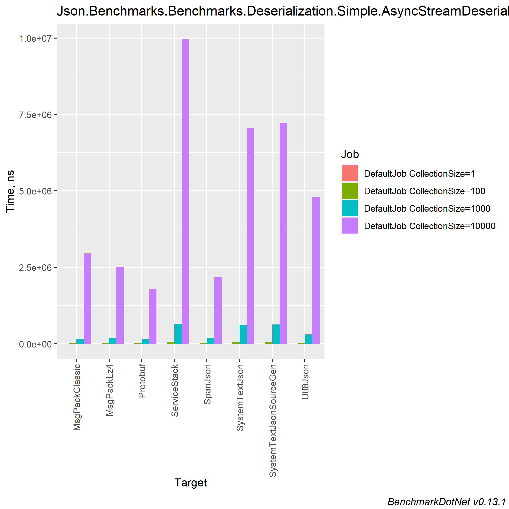
<a name="complex-model-deserialization"></a>
## Complex Model

<a name="string-complex-deserialization"></a>
### String
| Method                  | CollectionSize |           Mean |         Error |        StdDev |        StdErr |            Min |             Q1 |         Median |             Q3 |            Max |        Op/s | Ratio | RatioSD |      Gen 0 |     Gen 1 |   Gen 2 |  Allocated |
|-------------------------|----------------|---------------:|--------------:|--------------:|--------------:|---------------:|---------------:|---------------:|---------------:|---------------:|------------:|------:|--------:|-----------:|----------:|--------:|-----------:|
| JsonSrcGen              | 1              |       5.939 μs |     0.0571 μs |     0.0534 μs |     0.0138 μs |       5.862 μs |       5.899 μs |       5.913 μs |       5.992 μs |       6.022 μs | 168,370.907 |  0.37 |    0.00 |     0.3281 |         - |       - |       1 KB |
| SpanJson                | 1              |       7.948 μs |     0.1109 μs |     0.1038 μs |     0.0268 μs |       7.843 μs |       7.873 μs |       7.909 μs |       7.995 μs |       8.176 μs | 125,820.998 |  0.49 |    0.01 |     0.3204 |         - |       - |       1 KB |
| Utf8Json                | 1              |      10.446 μs |     0.0647 μs |     0.0605 μs |     0.0156 μs |      10.330 μs |      10.408 μs |      10.432 μs |      10.489 μs |      10.552 μs |  95,734.117 |  0.65 |    0.00 |     0.9308 |         - |       - |       4 KB |
| NetJson                 | 1              |      10.923 μs |     0.0647 μs |     0.0605 μs |     0.0156 μs |      10.811 μs |      10.884 μs |      10.915 μs |      10.955 μs |      11.040 μs |  91,549.783 |  0.68 |    0.01 |     0.4578 |         - |       - |       2 KB |
| Jil                     | 1              |      14.700 μs |     0.1106 μs |     0.0980 μs |     0.0262 μs |      14.553 μs |      14.625 μs |      14.734 μs |      14.778 μs |      14.812 μs |  68,025.331 |  0.91 |    0.01 |     1.2360 |         - |       - |       5 KB |
| SystemTextJson          | 1              |      16.161 μs |     0.1030 μs |     0.0860 μs |     0.0238 μs |      16.021 μs |      16.126 μs |      16.156 μs |      16.211 μs |      16.353 μs |  61,878.762 |  1.00 |    0.00 |     1.0681 |         - |       - |       4 KB |
| SystemTextJsonSourceGen | 1              |      16.764 μs |     0.2948 μs |     0.4925 μs |     0.0821 μs |      16.126 μs |      16.478 μs |      16.620 μs |      16.910 μs |      18.384 μs |  59,653.247 |  1.05 |    0.05 |     1.0681 |         - |       - |       4 KB |
| Maverick                | 1              |      16.974 μs |     0.2317 μs |     0.2167 μs |     0.0560 μs |      16.645 μs |      16.839 μs |      16.991 μs |      17.074 μs |      17.385 μs |  58,913.347 |  1.05 |    0.01 |     0.9155 |         - |       - |       4 KB |
| ServiceStack            | 1              |      28.061 μs |     0.1114 μs |     0.0988 μs |     0.0264 μs |      27.920 μs |      27.998 μs |      28.025 μs |      28.110 μs |      28.227 μs |  35,637.187 |  1.74 |    0.01 |     1.7395 |         - |       - |       7 KB |
| Newtonsoft              | 1              |      37.290 μs |     0.3776 μs |     0.3532 μs |     0.0912 μs |      36.767 μs |      37.003 μs |      37.226 μs |      37.576 μs |      37.927 μs |  26,816.597 |  2.31 |    0.02 |     3.2959 |         - |       - |      14 KB |
|                         |                |                |               |               |               |                |                |                |                |                |             |       |         |            |           |         |            |
| JsonSrcGen              | 100            |     721.451 μs |     4.6599 μs |     3.8912 μs |     1.0792 μs |     714.526 μs |     719.191 μs |     721.152 μs |     723.658 μs |     730.166 μs |   1,386.095 |  0.41 |    0.00 |    31.2500 |    6.8359 |       - |     134 KB |
| SpanJson                | 100            |     906.158 μs |     8.8795 μs |     8.3059 μs |     2.1446 μs |     895.675 μs |     899.171 μs |     905.186 μs |     911.757 μs |     923.735 μs |   1,103.560 |  0.52 |    0.00 |    32.2266 |    3.9063 |       - |     134 KB |
| NetJson                 | 100            |   1,107.902 μs |    12.3268 μs |    11.5305 μs |     2.9772 μs |   1,091.432 μs |   1,098.236 μs |   1,106.522 μs |   1,116.115 μs |   1,126.658 μs |     902.607 |  0.63 |    0.01 |    44.9219 |    3.9063 |       - |     186 KB |
| Utf8Json                | 100            |   1,198.711 μs |    23.4007 μs |    36.4321 μs |     6.4403 μs |   1,131.839 μs |   1,179.577 μs |   1,195.618 μs |   1,224.902 μs |   1,263.573 μs |     834.230 |  0.69 |    0.03 |    80.0781 |   52.7344 | 33.2031 |     377 KB |
| Jil                     | 100            |   1,474.669 μs |    12.0999 μs |    11.3182 μs |     2.9224 μs |   1,458.692 μs |   1,467.469 μs |   1,469.506 μs |   1,483.729 μs |   1,497.420 μs |     678.118 |  0.84 |    0.01 |   107.4219 |   33.2031 |       - |     487 KB |
| SystemTextJson          | 100            |   1,745.428 μs |     6.9394 μs |     5.7948 μs |     1.6072 μs |   1,735.383 μs |   1,744.031 μs |   1,744.318 μs |   1,750.516 μs |   1,755.515 μs |     572.925 |  1.00 |    0.00 |    85.9375 |   27.3438 |       - |     400 KB |
| SystemTextJsonSourceGen | 100            |   1,761.627 μs |    10.2174 μs |     9.5574 μs |     2.4677 μs |   1,750.518 μs |   1,754.363 μs |   1,759.593 μs |   1,768.209 μs |   1,781.180 μs |     567.657 |  1.01 |    0.01 |    87.8906 |   27.3438 |       - |     400 KB |
| Maverick                | 100            |   1,786.133 μs |    15.8729 μs |    14.8475 μs |     3.8336 μs |   1,767.784 μs |   1,775.007 μs |   1,783.580 μs |   1,795.344 μs |   1,815.771 μs |     559.869 |  1.02 |    0.01 |    78.1250 |   25.3906 |       - |     346 KB |
| ServiceStack            | 100            |   2,971.959 μs |    18.0616 μs |    15.0823 μs |     4.1831 μs |   2,957.399 μs |   2,959.072 μs |   2,966.419 μs |   2,977.588 μs |   3,007.389 μs |     336.478 |  1.70 |    0.01 |   152.3438 |   46.8750 |       - |     684 KB |
| Newtonsoft              | 100            |   3,722.506 μs |    22.6069 μs |    21.1465 μs |     5.4600 μs |   3,692.997 μs |   3,703.087 μs |   3,721.075 μs |   3,735.956 μs |   3,758.813 μs |     268.636 |  2.13 |    0.01 |   242.1875 |   82.0313 |       - |   1,068 KB |
|                         |                |                |               |               |               |                |                |                |                |                |             |       |         |            |           |         |            |
| JsonSrcGen              | 1000           |   6,661.035 μs |    31.4110 μs |    27.8450 μs |     7.4419 μs |   6,623.432 μs |   6,646.280 μs |   6,649.718 μs |   6,675.802 μs |   6,724.956 μs |     150.127 |  0.30 |    0.00 |   210.9375 |  101.5625 |       - |   1,335 KB |
| SpanJson                | 1000           |   9,218.181 μs |    76.3722 μs |    71.4386 μs |    18.4454 μs |   9,107.520 μs |   9,172.949 μs |   9,206.523 μs |   9,261.196 μs |   9,344.880 μs |     108.481 |  0.42 |    0.00 |   203.1250 |   93.7500 |       - |   1,337 KB |
| NetJson                 | 1000           |  11,233.830 μs |   114.7600 μs |    95.8298 μs |    26.5784 μs |  11,133.294 μs |  11,176.170 μs |  11,222.345 μs |  11,252.777 μs |  11,443.891 μs |      89.017 |  0.51 |    0.01 |   375.0000 |  125.0000 |       - |   1,854 KB |
| Utf8Json                | 1000           |  13,174.959 μs |   122.3548 μs |   108.4643 μs |    28.9883 μs |  13,048.677 μs |  13,101.133 μs |  13,123.527 μs |  13,245.747 μs |  13,417.736 μs |      75.902 |  0.60 |    0.01 |   406.2500 |  234.3750 | 78.1250 |   3,761 KB |
| Jil                     | 1000           |  17,161.703 μs |    70.6503 μs |    66.0863 μs |    17.0634 μs |  17,060.284 μs |  17,110.034 μs |  17,166.978 μs |  17,205.192 μs |  17,305.244 μs |      58.269 |  0.78 |    0.01 |   781.2500 |  281.2500 |       - |   4,873 KB |
| Maverick                | 1000           |  21,711.628 μs |   221.0718 μs |   206.7907 μs |    53.3931 μs |  21,429.794 μs |  21,565.817 μs |  21,636.400 μs |  21,839.458 μs |  22,126.247 μs |      46.058 |  0.98 |    0.01 |   812.5000 |  375.0000 |       - |   4,870 KB |
| SystemTextJsonSourceGen | 1000           |  21,983.682 μs |   424.3376 μs |   396.9257 μs |   102.4858 μs |  21,491.506 μs |  21,699.902 μs |  21,819.953 μs |  22,216.017 μs |  22,721.884 μs |      45.488 |  0.99 |    0.02 |   656.2500 |  312.5000 | 31.2500 |   5,654 KB |
| SystemTextJson          | 1000           |  22,101.637 μs |   206.4263 μs |   172.3754 μs |    47.8083 μs |  21,767.384 μs |  22,074.459 μs |  22,176.859 μs |  22,240.272 μs |  22,268.487 μs |      45.246 |  1.00 |    0.00 |   656.2500 |  312.5000 | 31.2500 |   5,654 KB |
| ServiceStack            | 1000           |  31,217.350 μs |   282.7223 μs |   264.4586 μs |    68.2829 μs |  30,713.787 μs |  31,064.100 μs |  31,204.881 μs |  31,414.444 μs |  31,656.356 μs |      32.033 |  1.41 |    0.01 |  1062.5000 |  187.5000 |       - |   6,825 KB |
| Newtonsoft              | 1000           |  39,324.879 μs |   529.8261 μs |   413.6534 μs |   119.4114 μs |  38,728.423 μs |  39,141.633 μs |  39,317.058 μs |  39,368.867 μs |  40,480.277 μs |      25.429 |  1.78 |    0.02 |  1692.3077 |  307.6923 |       - |  10,609 KB |
|                         |                |                |               |               |               |                |                |                |                |                |             |       |         |            |           |         |            |
| JsonSrcGen              | 10000          |  74,682.008 μs |   666.4527 μs |   590.7929 μs |   157.8961 μs |  73,159.314 μs |  74,490.925 μs |  74,563.829 μs |  74,973.868 μs |  75,571.571 μs |      13.390 |  0.34 |    0.00 |  2142.8571 |  714.2857 |       - |  13,358 KB |
| SpanJson                | 10000          | 101,497.217 μs |   568.7775 μs |   532.0348 μs |   137.3708 μs | 100,435.460 μs | 101,193.120 μs | 101,569.920 μs | 101,836.000 μs | 102,283.660 μs |       9.852 |  0.46 |    0.00 |  2000.0000 |  800.0000 |       - |  13,359 KB |
| NetJson                 | 10000          | 113,729.929 μs |   622.9377 μs |   582.6963 μs |   150.4515 μs | 112,950.680 μs | 113,242.010 μs | 113,768.760 μs | 113,927.310 μs | 114,822.040 μs |       8.793 |  0.51 |    0.01 |  3000.0000 | 1000.0000 |       - |  18,637 KB |
| Utf8Json                | 10000          | 145,425.772 μs | 1,623.7299 μs | 1,518.8379 μs |   392.1623 μs | 143,206.550 μs | 144,251.400 μs | 144,994.525 μs | 146,425.562 μs | 148,074.225 μs |       6.876 |  0.66 |    0.01 |  3250.0000 | 1000.0000 |       - |  37,710 KB |
| Jil                     | 10000          | 178,625.110 μs | 3,558.1868 μs | 6,231.8772 μs |   997.8990 μs | 169,205.300 μs | 172,851.200 μs | 178,487.400 μs | 182,704.200 μs | 191,213.100 μs |       5.598 |  0.80 |    0.03 |  7000.0000 | 2000.0000 |       - |  48,824 KB |
| Maverick                | 10000          | 219,530.493 μs | 2,189.8102 μs | 1,941.2097 μs |   518.8101 μs | 215,746.200 μs | 218,726.375 μs | 219,723.700 μs | 220,936.100 μs | 222,389.900 μs |       4.555 |  0.99 |    0.01 |  8000.0000 | 3000.0000 |       - |  51,148 KB |
| SystemTextJsonSourceGen | 10000          | 220,087.140 μs | 2,514.0541 μs | 2,351.6478 μs |   607.1928 μs | 216,842.000 μs | 218,245.200 μs | 219,335.400 μs | 222,271.275 μs | 223,979.000 μs |       4.544 |  0.99 |    0.01 |  6500.0000 | 2000.0000 |       - |  56,624 KB |
| SystemTextJson          | 10000          | 221,722.613 μs | 2,286.6042 μs | 2,138.8910 μs |   552.2593 μs | 217,915.950 μs | 219,892.125 μs | 222,419.450 μs | 222,860.100 μs | 224,984.350 μs |       4.510 |  1.00 |    0.00 |  6500.0000 | 2000.0000 |       - |  56,622 KB |
| ServiceStack            | 10000          | 327,034.138 μs | 3,144.7504 μs | 2,626.0090 μs |   728.3239 μs | 321,608.500 μs | 325,284.900 μs | 327,357.500 μs | 328,688.500 μs | 331,663.300 μs |       3.058 |  1.48 |    0.02 | 11000.0000 | 3000.0000 |       - |  68,363 KB |
| Newtonsoft              | 10000          | 402,045.971 μs | 4,790.9913 μs | 4,247.0890 μs | 1,135.0823 μs | 394,883.500 μs | 399,071.225 μs | 401,615.850 μs | 403,638.200 μs | 408,602.200 μs |       2.487 |  1.81 |    0.02 | 18000.0000 | 3000.0000 |       - | 106,200 KB |

<a name="byte-complex-deserialization"></a>
### Byte
| Method                  | CollectionSize |             Mean |           Error |          StdDev |        StdErr |              Min |               Q1 |           Median |               Q3 |              Max |          Op/s | Ratio | RatioSD |     Gen 0 |     Gen 1 |    Gen 2 | Allocated |
|-------------------------|----------------|-----------------:|----------------:|----------------:|--------------:|-----------------:|-----------------:|-----------------:|-----------------:|-----------------:|--------------:|------:|--------:|----------:|----------:|---------:|----------:|
| ZeroFormatter           | 1              |         409.4 ns |         4.58 ns |         4.28 ns |       1.11 ns |         405.5 ns |         406.1 ns |         407.9 ns |         411.9 ns |         417.3 ns | 2,442,438.382 |  0.03 |    0.00 |    0.2923 |         - |        - |      1 KB |
| MsgPackClassic          | 1              |       2,673.0 ns |        19.51 ns |        16.29 ns |       4.52 ns |       2,655.2 ns |       2,657.7 ns |       2,666.0 ns |       2,689.4 ns |       2,698.1 ns |   374,111.270 |  0.16 |    0.00 |    0.3357 |         - |        - |      1 KB |
| MsgPackLz4              | 1              |       3,468.0 ns |        21.37 ns |        17.85 ns |       4.95 ns |       3,434.5 ns |       3,460.8 ns |       3,467.5 ns |       3,472.0 ns |       3,510.2 ns |   288,349.749 |  0.21 |    0.00 |    0.3319 |         - |        - |      1 KB |
| Protobuf                | 1              |       5,569.3 ns |        25.85 ns |        22.92 ns |       6.12 ns |       5,519.5 ns |       5,557.9 ns |       5,569.6 ns |       5,582.9 ns |       5,601.6 ns |   179,554.297 |  0.34 |    0.00 |    0.3510 |         - |        - |      1 KB |
| JsonSrcGen              | 1              |       6,147.1 ns |        34.35 ns |        30.45 ns |       8.14 ns |       6,089.5 ns |       6,124.9 ns |       6,146.8 ns |       6,168.8 ns |       6,192.0 ns |   162,677.352 |  0.38 |    0.01 |    0.3281 |         - |        - |      1 KB |
| SpanJson                | 1              |       7,976.2 ns |       154.18 ns |       128.75 ns |      35.71 ns |       7,816.1 ns |       7,878.8 ns |       7,970.0 ns |       8,001.4 ns |       8,218.5 ns |   125,373.189 |  0.49 |    0.01 |    0.3357 |         - |        - |      1 KB |
| Utf8Json                | 1              |      10,003.5 ns |        94.25 ns |        83.55 ns |      22.33 ns |       9,847.9 ns |       9,937.4 ns |      10,012.9 ns |      10,059.8 ns |      10,121.6 ns |    99,965.212 |  0.62 |    0.01 |    0.5188 |         - |        - |      2 KB |
| Jil                     | 1              |      14,321.8 ns |       206.14 ns |       172.14 ns |      47.74 ns |      14,158.5 ns |      14,225.4 ns |      14,263.8 ns |      14,348.1 ns |      14,817.9 ns |    69,823.587 |  0.88 |    0.02 |    2.0294 |         - |        - |      8 KB |
| SystemTextJson          | 1              |      16,253.7 ns |       226.51 ns |       211.88 ns |      54.71 ns |      15,968.3 ns |      16,059.0 ns |      16,310.7 ns |      16,432.6 ns |      16,562.4 ns |    61,524.418 |  1.00 |    0.00 |    1.0681 |         - |        - |      4 KB |
| SystemTextJsonSourceGen | 1              |      16,441.6 ns |       233.61 ns |       218.52 ns |      56.42 ns |      16,177.2 ns |      16,273.6 ns |      16,372.2 ns |      16,605.1 ns |      16,852.6 ns |    60,821.365 |  1.01 |    0.02 |    1.0681 |         - |        - |      4 KB |
| Maverick                | 1              |      16,612.4 ns |       233.59 ns |       207.07 ns |      55.34 ns |      16,333.1 ns |      16,460.2 ns |      16,599.9 ns |      16,700.7 ns |      17,041.8 ns |    60,196.048 |  1.02 |    0.02 |    0.8545 |         - |        - |      4 KB |
|                         |                |                  |                 |                 |               |                  |                  |                  |                  |                  |               |       |         |           |           |          |           |
| ZeroFormatter           | 100            |      44,301.9 ns |       393.74 ns |       368.30 ns |      95.10 ns |      43,684.0 ns |      44,098.5 ns |      44,238.1 ns |      44,508.9 ns |      45,005.2 ns |    22,572.378 |  0.03 |    0.00 |   27.0996 |    9.0332 |        - |    114 KB |
| MsgPackClassic          | 100            |     280,062.9 ns |     3,153.17 ns |     2,633.04 ns |     730.27 ns |     277,237.1 ns |     278,023.2 ns |     278,995.3 ns |     280,934.4 ns |     286,893.5 ns |     3,570.627 |  0.16 |    0.00 |   30.2734 |   10.2539 |        - |    133 KB |
| MsgPackLz4              | 100            |     312,111.8 ns |     3,322.63 ns |     2,774.55 ns |     769.52 ns |     308,565.2 ns |     310,222.9 ns |     311,910.3 ns |     313,449.3 ns |     318,366.3 ns |     3,203.980 |  0.18 |    0.00 |   27.8320 |    9.2773 |        - |    134 KB |
| Protobuf                | 100            |     521,997.7 ns |     5,552.01 ns |     5,193.36 ns |   1,340.92 ns |     513,338.1 ns |     519,285.7 ns |     519,956.3 ns |     526,184.1 ns |     530,117.0 ns |     1,915.717 |  0.30 |    0.00 |   30.2734 |    8.7891 |        - |    134 KB |
| JsonSrcGen              | 100            |     669,428.4 ns |     4,193.34 ns |     3,922.45 ns |   1,012.77 ns |     660,688.6 ns |     667,774.3 ns |     669,721.9 ns |     672,284.9 ns |     674,841.6 ns |     1,493.812 |  0.38 |    0.00 |   31.2500 |   10.7422 |        - |    134 KB |
| SpanJson                | 100            |     848,501.1 ns |     5,112.95 ns |     4,532.50 ns |   1,211.36 ns |     843,139.7 ns |     844,204.2 ns |     848,746.7 ns |     850,869.7 ns |     857,911.2 ns |     1,178.549 |  0.48 |    0.00 |   31.2500 |    8.7891 |        - |    133 KB |
| Utf8Json                | 100            |   1,084,939.8 ns |     8,012.63 ns |     7,102.99 ns |   1,898.35 ns |   1,070,058.6 ns |   1,080,372.4 ns |   1,085,723.8 ns |   1,086,856.5 ns |   1,095,824.4 ns |       921.710 |  0.61 |    0.01 |   44.9219 |   15.6250 |        - |    210 KB |
| SystemTextJson          | 100            |   1,766,354.6 ns |    15,755.25 ns |    13,966.62 ns |   3,732.74 ns |   1,746,969.4 ns |   1,756,946.3 ns |   1,763,610.4 ns |   1,771,915.2 ns |   1,792,632.1 ns |       566.138 |  1.00 |    0.00 |   87.8906 |   23.4375 |        - |    400 KB |
| SystemTextJsonSourceGen | 100            |   1,770,690.8 ns |    14,450.78 ns |    12,810.24 ns |   3,423.68 ns |   1,756,745.1 ns |   1,759,708.9 ns |   1,766,726.4 ns |   1,780,021.0 ns |   1,800,340.2 ns |       564.751 |  1.00 |    0.01 |   87.8906 |   21.4844 |        - |    399 KB |
| Maverick                | 100            |   1,810,121.7 ns |     8,805.35 ns |     7,805.71 ns |   2,086.16 ns |   1,796,872.7 ns |   1,805,374.6 ns |   1,809,720.1 ns |   1,814,156.2 ns |   1,824,514.5 ns |       552.449 |  1.02 |    0.01 |   76.1719 |   19.5313 |        - |    342 KB |
| Jil                     | 100            |   1,868,524.5 ns |    37,225.99 ns |    49,695.63 ns |   9,939.13 ns |   1,790,570.9 ns |   1,828,242.2 ns |   1,860,827.1 ns |   1,895,945.9 ns |   1,972,400.2 ns |       535.182 |  1.06 |    0.03 |  167.9688 |  103.5156 |  56.6406 |    822 KB |
|                         |                |                  |                 |                 |               |                  |                  |                  |                  |                  |               |       |         |           |           |          |           |
| ZeroFormatter           | 1000           |     747,932.6 ns |     3,688.68 ns |     3,080.21 ns |     854.30 ns |     742,903.5 ns |     745,908.2 ns |     748,046.8 ns |     750,112.7 ns |     752,068.0 ns |     1,337.019 |  0.04 |    0.00 |  185.5469 |   92.7734 |        - |  1,141 KB |
| MsgPackClassic          | 1000           |   3,294,660.4 ns |    51,557.70 ns |    48,227.11 ns |  12,452.19 ns |   3,228,279.7 ns |   3,264,395.5 ns |   3,282,078.1 ns |   3,321,402.5 ns |   3,394,204.7 ns |       303.521 |  0.17 |    0.00 |  214.8438 |  105.4688 |        - |  1,337 KB |
| MsgPackLz4              | 1000           |   3,552,262.2 ns |    32,295.15 ns |    28,628.81 ns |   7,651.37 ns |   3,513,816.0 ns |   3,528,612.7 ns |   3,548,770.7 ns |   3,571,488.2 ns |   3,605,116.0 ns |       281.511 |  0.18 |    0.00 |  214.8438 |  105.4688 |        - |  1,335 KB |
| Protobuf                | 1000           |   5,625,177.3 ns |    43,923.12 ns |    36,677.80 ns |  10,172.59 ns |   5,560,990.6 ns |   5,613,693.8 ns |   5,630,068.8 ns |   5,633,714.8 ns |   5,697,324.2 ns |       177.772 |  0.29 |    0.00 |  210.9375 |  101.5625 |        - |  1,336 KB |
| JsonSrcGen              | 1000           |   7,099,817.5 ns |   140,563.06 ns |   172,624.07 ns |  36,803.57 ns |   6,924,831.2 ns |   6,972,383.2 ns |   7,008,593.8 ns |   7,227,334.0 ns |   7,547,336.7 ns |       140.849 |  0.37 |    0.01 |  210.9375 |  101.5625 |        - |  1,336 KB |
| SpanJson                | 1000           |   8,878,435.4 ns |   124,644.62 ns |   110,494.21 ns |  29,530.82 ns |   8,710,092.2 ns |   8,817,183.6 ns |   8,872,118.8 ns |   8,930,239.5 ns |   9,101,146.9 ns |       112.632 |  0.46 |    0.01 |  203.1250 |   93.7500 |        - |  1,335 KB |
| Utf8Json                | 1000           |  11,821,176.8 ns |   201,851.95 ns |   295,871.96 ns |  54,942.04 ns |  11,318,018.8 ns |  11,482,676.6 ns |  11,907,406.2 ns |  11,987,384.4 ns |  12,373,695.3 ns |        84.594 |  0.61 |    0.02 |  328.1250 |  156.2500 |        - |  2,094 KB |
| SystemTextJsonSourceGen | 1000           |  19,243,212.7 ns |   172,580.59 ns |   152,988.20 ns |  40,887.82 ns |  19,070,181.2 ns |  19,103,194.5 ns |  19,245,076.6 ns |  19,308,166.4 ns |  19,577,809.4 ns |        51.966 |  1.00 |    0.01 |  625.0000 |  281.2500 |        - |  3,985 KB |
| Maverick                | 1000           |  19,275,006.2 ns |   181,778.73 ns |   161,142.11 ns |  43,067.04 ns |  19,050,596.9 ns |  19,182,353.1 ns |  19,240,007.8 ns |  19,367,763.3 ns |  19,613,193.8 ns |        51.881 |  1.00 |    0.01 |  531.2500 |  250.0000 |        - |  3,415 KB |
| SystemTextJson          | 1000           |  19,329,651.1 ns |   166,132.35 ns |   147,272.00 ns |  39,360.10 ns |  19,128,793.8 ns |  19,236,047.7 ns |  19,292,957.8 ns |  19,386,721.9 ns |  19,606,362.5 ns |        51.734 |  1.00 |    0.00 |  625.0000 |  281.2500 |        - |  3,985 KB |
| Jil                     | 1000           |  20,675,413.5 ns |   380,739.15 ns |   481,513.12 ns | 100,402.43 ns |  19,774,415.6 ns |  20,244,465.6 ns |  20,806,815.6 ns |  20,852,173.4 ns |  21,771,350.0 ns |        48.367 |  1.06 |    0.02 |  968.7500 |  500.0000 | 187.5000 |  8,212 KB |
|                         |                |                  |                 |                 |               |                  |                  |                  |                  |                  |               |       |         |           |           |          |           |
| ZeroFormatter           | 10000          |  27,274,871.6 ns |   533,769.72 ns |   730,630.02 ns | 143,288.34 ns |  26,239,859.4 ns |  26,781,732.0 ns |  27,248,190.6 ns |  27,817,076.6 ns |  29,150,062.5 ns |        36.664 |  0.13 |    0.00 | 2156.2500 |  937.5000 | 312.5000 | 11,407 KB |
| MsgPackClassic          | 10000          |  47,366,828.7 ns |   789,145.13 ns |   738,166.84 ns | 190,593.86 ns |  46,236,820.0 ns |  46,914,145.0 ns |  47,486,690.0 ns |  47,934,325.0 ns |  48,667,870.0 ns |        21.112 |  0.23 |    0.00 | 2400.0000 | 1100.0000 | 300.0000 | 13,360 KB |
| MsgPackLz4              | 10000          |  52,040,060.0 ns |   925,138.53 ns |   865,375.16 ns | 223,438.90 ns |  51,072,500.0 ns |  51,308,100.0 ns |  51,721,860.0 ns |  52,795,575.0 ns |  53,491,360.0 ns |        19.216 |  0.25 |    0.00 | 2300.0000 |  900.0000 | 200.0000 | 13,359 KB |
| Protobuf                | 10000          |  67,476,416.1 ns |   899,477.38 ns |   797,363.27 ns | 213,104.30 ns |  66,529,137.5 ns |  66,691,665.6 ns |  67,451,931.2 ns |  68,182,821.9 ns |  68,647,125.0 ns |        14.820 |  0.32 |    0.00 | 2250.0000 |  875.0000 | 125.0000 | 13,363 KB |
| JsonSrcGen              | 10000          |  77,084,271.4 ns |   628,300.30 ns |   556,971.85 ns | 148,856.99 ns |  76,040,171.4 ns |  76,758,078.6 ns |  77,101,257.1 ns |  77,409,214.3 ns |  78,182,885.7 ns |        12.973 |  0.37 |    0.00 | 2142.8571 |  714.2857 |        - | 13,360 KB |
| SpanJson                | 10000          |  94,763,760.3 ns |   918,666.31 ns |   767,127.97 ns | 212,763.02 ns |  93,331,483.3 ns |  94,372,366.7 ns |  94,615,966.7 ns |  95,011,650.0 ns |  96,150,516.7 ns |        10.553 |  0.45 |    0.00 | 2333.3333 | 1000.0000 | 166.6667 | 13,360 KB |
| Utf8Json                | 10000          | 133,635,455.0 ns | 1,276,432.06 ns | 1,193,975.34 ns | 308,283.11 ns | 131,342,075.0 ns | 132,989,650.0 ns | 133,748,825.0 ns | 134,416,725.0 ns | 135,694,200.0 ns |         7.483 |  0.64 |    0.01 | 3250.0000 | 1000.0000 |        - | 21,032 KB |
| Jil                     | 10000          | 194,958,692.9 ns | 1,783,559.54 ns | 1,581,079.07 ns | 422,561.16 ns | 192,051,200.0 ns | 194,289,925.0 ns | 195,137,650.0 ns | 195,970,425.0 ns | 197,114,800.0 ns |         5.129 |  0.93 |    0.01 | 7000.0000 | 2000.0000 |        - | 82,231 KB |
| Maverick                | 10000          | 200,697,350.0 ns | 3,730,764.30 ns | 3,664,109.39 ns | 916,027.35 ns | 194,112,700.0 ns | 197,640,150.0 ns | 201,932,000.0 ns | 202,957,375.0 ns | 206,423,900.0 ns |         4.983 |  0.96 |    0.02 | 5000.0000 | 1000.0000 |        - | 34,241 KB |
| SystemTextJsonSourceGen | 10000          | 208,570,142.9 ns | 3,271,265.13 ns | 2,899,891.33 ns | 775,028.56 ns | 203,813,000.0 ns | 206,397,525.0 ns | 208,676,200.0 ns | 209,539,000.0 ns | 214,109,300.0 ns |         4.795 |  1.00 |    0.02 | 6000.0000 | 2000.0000 |        - | 39,945 KB |
| SystemTextJson          | 10000          | 209,119,533.3 ns | 1,488,657.53 ns | 1,392,491.18 ns | 359,539.68 ns | 206,433,100.0 ns | 208,241,025.0 ns | 209,429,600.0 ns | 210,066,900.0 ns | 210,704,450.0 ns |         4.782 |  1.00 |    0.00 | 6500.0000 | 2000.0000 |        - | 39,943 KB |
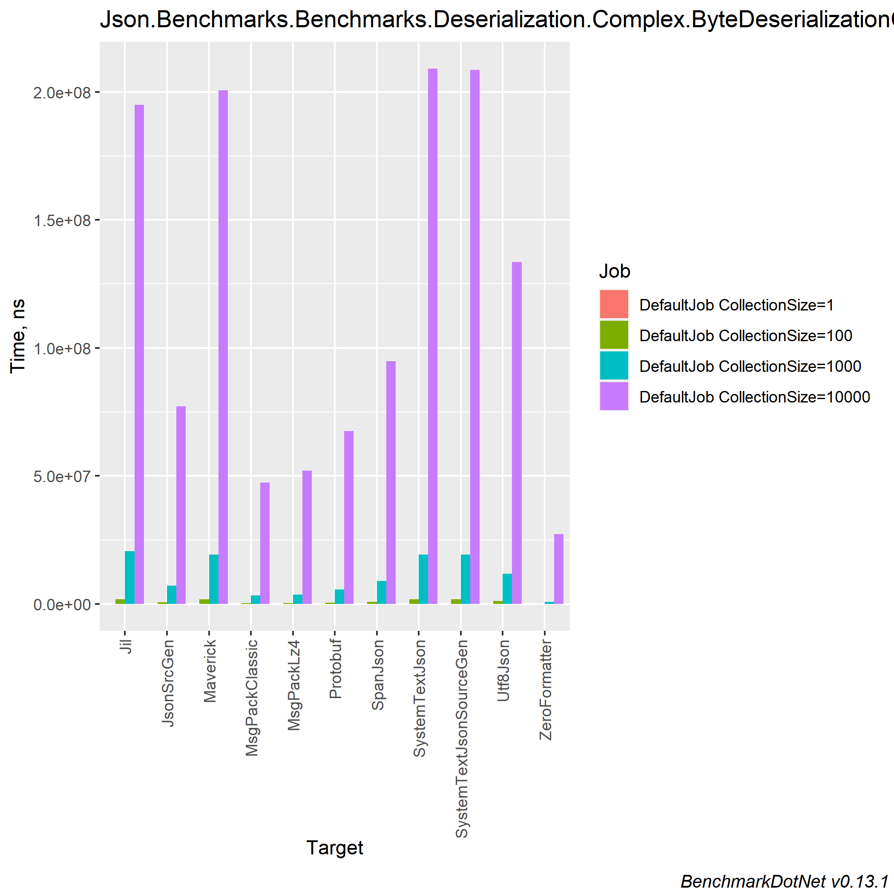
<a name="stream-complex-deserialization"></a>
### Stream
| Method                  | CollectionSize |           Mean |         Error |        StdDev |        StdErr |            Min |             Q1 |         Median |             Q3 |            Max |        Op/s | Ratio | RatioSD |      Gen 0 |     Gen 1 |    Gen 2 |  Allocated |
|-------------------------|----------------|---------------:|--------------:|--------------:|--------------:|---------------:|---------------:|---------------:|---------------:|---------------:|------------:|------:|--------:|-----------:|----------:|---------:|-----------:|
| MsgPackClassic          | 1              |       2.973 μs |     0.0169 μs |     0.0150 μs |     0.0040 μs |       2.954 μs |       2.962 μs |       2.970 μs |       2.980 μs |       3.002 μs | 336,389.931 |  0.16 |    0.00 |     0.3395 |         - |        - |       1 KB |
| MsgPackLz4              | 1              |       3.594 μs |     0.0113 μs |     0.0088 μs |     0.0025 μs |       3.578 μs |       3.589 μs |       3.592 μs |       3.601 μs |       3.607 μs | 278,275.873 |  0.20 |    0.00 |     0.3395 |         - |        - |       1 KB |
| Protobuf                | 1              |       5.653 μs |     0.0386 μs |     0.0342 μs |     0.0091 μs |       5.594 μs |       5.634 μs |       5.649 μs |       5.676 μs |       5.713 μs | 176,898.147 |  0.31 |    0.00 |     0.3586 |         - |        - |       1 KB |
| SpanJson                | 1              |       7.989 μs |     0.0577 μs |     0.0540 μs |     0.0139 μs |       7.921 μs |       7.938 μs |       7.999 μs |       8.024 μs |       8.106 μs | 125,168.716 |  0.44 |    0.00 |     0.7324 |         - |        - |       3 KB |
| Utf8Json                | 1              |       9.708 μs |     0.0601 μs |     0.0502 μs |     0.0139 μs |       9.647 μs |       9.673 μs |       9.691 μs |       9.726 μs |       9.804 μs | 103,010.077 |  0.53 |    0.00 |     0.5188 |         - |        - |       2 KB |
| Maverick                | 1              |      17.177 μs |     0.1552 μs |     0.1452 μs |     0.0375 μs |      16.945 μs |      17.059 μs |      17.196 μs |      17.308 μs |      17.374 μs |  58,216.831 |  0.94 |    0.01 |     1.2817 |         - |        - |       5 KB |
| SystemTextJsonSourceGen | 1              |      17.982 μs |     0.1772 μs |     0.1479 μs |     0.0410 μs |      17.822 μs |      17.901 μs |      17.933 μs |      18.031 μs |      18.349 μs |  55,612.660 |  0.98 |    0.01 |     1.0681 |         - |        - |       4 KB |
| SystemTextJson          | 1              |      18.274 μs |     0.0864 μs |     0.0722 μs |     0.0200 μs |      18.150 μs |      18.236 μs |      18.285 μs |      18.326 μs |      18.379 μs |  54,722.155 |  1.00 |    0.00 |     1.0681 |         - |        - |       4 KB |
| ServiceStack            | 1              |      28.709 μs |     0.1367 μs |     0.1279 μs |     0.0330 μs |      28.513 μs |      28.607 μs |      28.714 μs |      28.810 μs |      28.912 μs |  34,832.158 |  1.57 |    0.01 |     2.2278 |         - |        - |       9 KB |
|                         |                |                |               |               |               |                |                |                |                |                |             |       |         |            |           |          |            |
| MsgPackClassic          | 100            |     283.177 μs |     2.0534 μs |     1.8203 μs |     0.4865 μs |     280.451 μs |     281.625 μs |     283.402 μs |     284.458 μs |     286.271 μs |   3,531.359 |  0.13 |    0.00 |    29.2969 |    9.2773 |        - |     134 KB |
| MsgPackLz4              | 100            |     312.812 μs |     2.7661 μs |     2.5874 μs |     0.6681 μs |     310.111 μs |     310.776 μs |     312.017 μs |     314.098 μs |     317.512 μs |   3,196.803 |  0.14 |    0.00 |    27.8320 |    9.2773 |        - |     134 KB |
| Protobuf                | 100            |     496.839 μs |     3.6878 μs |     3.0795 μs |     0.8541 μs |     492.525 μs |     494.502 μs |     496.290 μs |     498.883 μs |     502.731 μs |   2,012.724 |  0.22 |    0.00 |    28.3203 |    9.7656 |        - |     134 KB |
| SpanJson                | 100            |     873.897 μs |     6.0662 μs |     5.6743 μs |     1.4651 μs |     864.034 μs |     869.652 μs |     873.048 μs |     878.711 μs |     883.783 μs |   1,144.300 |  0.39 |    0.00 |    61.5234 |   44.9219 |  30.2734 |     300 KB |
| Utf8Json                | 100            |   1,200.778 μs |    23.8633 μs |    23.4370 μs |     5.8592 μs |   1,170.856 μs |   1,183.706 μs |   1,201.636 μs |   1,213.739 μs |   1,251.119 μs |     832.794 |  0.54 |    0.01 |   111.3281 |   87.8906 |  66.4063 |     594 KB |
| Maverick                | 100            |   1,851.636 μs |    15.4162 μs |    12.8732 μs |     3.5704 μs |   1,830.597 μs |   1,844.451 μs |   1,853.800 μs |   1,856.889 μs |   1,876.197 μs |     540.063 |  0.83 |    0.01 |   105.4688 |   58.5938 |  29.2969 |     509 KB |
| SystemTextJsonSourceGen | 100            |   2,223.177 μs |    12.4702 μs |    11.0545 μs |     2.9544 μs |   2,206.463 μs |   2,216.900 μs |   2,222.481 μs |   2,228.808 μs |   2,241.909 μs |     449.807 |  0.99 |    0.01 |    85.9375 |   23.4375 |        - |     399 KB |
| SystemTextJson          | 100            |   2,236.713 μs |    15.8875 μs |    13.2667 μs |     3.6795 μs |   2,212.994 μs |   2,230.919 μs |   2,235.788 μs |   2,244.431 μs |   2,259.122 μs |     447.085 |  1.00 |    0.00 |    85.9375 |   27.3438 |        - |     399 KB |
| ServiceStack            | 100            |   3,041.132 μs |    38.1255 μs |    35.6626 μs |     9.2081 μs |   2,971.393 μs |   3,020.152 μs |   3,044.759 μs |   3,061.485 μs |   3,108.167 μs |     328.825 |  1.36 |    0.02 |   183.5938 |   78.1250 |  31.2500 |     853 KB |
|                         |                |                |               |               |               |                |                |                |                |                |             |       |         |            |           |          |            |
| MsgPackClassic          | 1000           |   4,288.927 μs |    83.4168 μs |   111.3590 μs |    22.2718 μs |   4,071.879 μs |   4,210.245 μs |   4,299.686 μs |   4,362.280 μs |   4,506.764 μs |     233.159 |  0.18 |    0.00 |   273.4375 |  171.8750 |  62.5000 |   2,257 KB |
| MsgPackLz4              | 1000           |   4,438.140 μs |    88.1557 μs |   101.5202 μs |    22.7006 μs |   4,247.359 μs |   4,354.410 μs |   4,442.174 μs |   4,510.150 μs |   4,594.534 μs |     225.320 |  0.18 |    0.00 |   257.8125 |  156.2500 |  46.8750 |   2,121 KB |
| Protobuf                | 1000           |   5,511.211 μs |    66.5835 μs |    59.0246 μs |    15.7750 μs |   5,440.793 μs |   5,459.479 μs |   5,514.726 μs |   5,550.782 μs |   5,607.948 μs |     181.448 |  0.23 |    0.00 |   210.9375 |  101.5625 |        - |   1,336 KB |
| SpanJson                | 1000           |   9,824.770 μs |   189.7748 μs |   177.5155 μs |    45.8343 μs |   9,496.636 μs |   9,721.023 μs |   9,857.348 μs |   9,980.882 μs |  10,048.883 μs |     101.784 |  0.40 |    0.01 |   296.8750 |  218.7500 |  93.7500 |   3,004 KB |
| Utf8Json                | 1000           |  13,972.843 μs |   278.2232 μs |   522.5706 μs |    78.7805 μs |  13,122.497 μs |  13,655.230 μs |  13,961.412 μs |  14,158.847 μs |  15,333.016 μs |      71.567 |  0.59 |    0.02 |   640.6250 |  562.5000 | 312.5000 |   6,064 KB |
| Maverick                | 1000           |  20,616.383 μs |   347.8260 μs |   325.3567 μs |    84.0067 μs |  20,223.866 μs |  20,340.445 μs |  20,644.459 μs |  20,821.888 μs |  21,386.569 μs |      48.505 |  0.85 |    0.01 |   593.7500 |  343.7500 |  62.5000 |   5,083 KB |
| SystemTextJsonSourceGen | 1000           |  24,169.165 μs |   152.9257 μs |   143.0468 μs |    36.9345 μs |  23,910.094 μs |  24,073.395 μs |  24,226.759 μs |  24,287.180 μs |  24,333.509 μs |      41.375 |  0.99 |    0.01 |   625.0000 |  281.2500 |        - |   3,985 KB |
| SystemTextJson          | 1000           |  24,333.819 μs |   160.2496 μs |   149.8975 μs |    38.7034 μs |  24,051.475 μs |  24,246.056 μs |  24,374.522 μs |  24,452.964 μs |  24,509.956 μs |      41.095 |  1.00 |    0.00 |   625.0000 |  281.2500 |        - |   3,986 KB |
| ServiceStack            | 1000           |  34,188.684 μs |   439.9080 μs |   411.4902 μs |   106.2463 μs |  33,497.507 μs |  33,972.397 μs |  34,173.367 μs |  34,451.100 μs |  34,861.300 μs |      29.249 |  1.41 |    0.02 |  1066.6667 |  200.0000 |        - |   8,721 KB |
|                         |                |                |               |               |               |                |                |                |                |                |             |       |         |            |           |          |            |
| MsgPackClassic          | 10000          |  50,622.831 μs |   893.4667 μs |   835.7493 μs |   215.7895 μs |  49,068.518 μs |  50,117.991 μs |  50,731.218 μs |  51,047.686 μs |  51,929.309 μs |      19.754 |  0.19 |    0.00 |  2454.5455 | 1090.9091 | 272.7273 |  22,571 KB |
| MsgPackLz4              | 10000          |  52,729.740 μs |   585.0065 μs |   518.5930 μs |   138.5998 μs |  51,577.940 μs |  52,533.795 μs |  52,682.785 μs |  53,095.280 μs |  53,685.810 μs |      18.965 |  0.19 |    0.00 |  2400.0000 | 1100.0000 | 300.0000 |  21,209 KB |
| Protobuf                | 10000          |  65,365.014 μs |   981.7092 μs |   918.2914 μs |   237.1018 μs |  64,069.700 μs |  64,654.938 μs |  65,505.512 μs |  65,822.381 μs |  67,526.212 μs |      15.299 |  0.24 |    0.00 |  2250.0000 |  875.0000 | 125.0000 |  13,361 KB |
| SpanJson                | 10000          |  99,206.464 μs |   963.1054 μs |   853.7679 μs |   228.1791 μs |  97,753.200 μs |  98,793.795 μs |  98,942.910 μs |  99,739.545 μs | 101,161.400 μs |      10.080 |  0.37 |    0.01 |  2000.0000 |  800.0000 |        - |  30,042 KB |
| Utf8Json                | 10000          | 150,967.410 μs | 1,891.3220 μs | 1,676.6076 μs |   448.0922 μs | 148,179.667 μs | 149,954.183 μs | 150,914.333 μs | 152,030.767 μs | 153,382.600 μs |       6.624 |  0.56 |    0.01 |  3333.3333 | 1000.0000 |        - |  86,437 KB |
| Maverick                | 10000          | 216,376.205 μs | 4,292.4208 μs | 4,771.0144 μs | 1,094.5458 μs | 204,902.300 μs | 214,137.400 μs | 216,371.400 μs | 219,065.500 μs | 225,084.900 μs |       4.622 |  0.80 |    0.02 |  5000.0000 | 1000.0000 |        - |  50,929 KB |
| SystemTextJsonSourceGen | 10000          | 270,872.650 μs | 3,306.8199 μs | 2,931.4097 μs |   783.4522 μs | 264,799.800 μs | 268,709.150 μs | 271,061.700 μs | 272,951.275 μs | 275,265.600 μs |       3.692 |  1.00 |    0.02 |  6000.0000 | 2000.0000 |        - |  39,946 KB |
| SystemTextJson          | 10000          | 271,777.540 μs | 4,038.5570 μs | 3,777.6687 μs |   975.3899 μs | 267,171.100 μs | 268,761.900 μs | 270,874.000 μs | 274,322.350 μs | 280,811.800 μs |       3.679 |  1.00 |    0.00 |  6000.0000 | 2000.0000 |        - |  39,946 KB |
| ServiceStack            | 10000          | 336,766.964 μs | 3,958.6781 μs | 3,509.2650 μs |   937.8905 μs | 330,557.800 μs | 335,461.475 μs | 337,065.650 μs | 339,209.550 μs | 342,381.500 μs |       2.969 |  1.24 |    0.02 | 11000.0000 | 3000.0000 |        - | 118,463 KB |
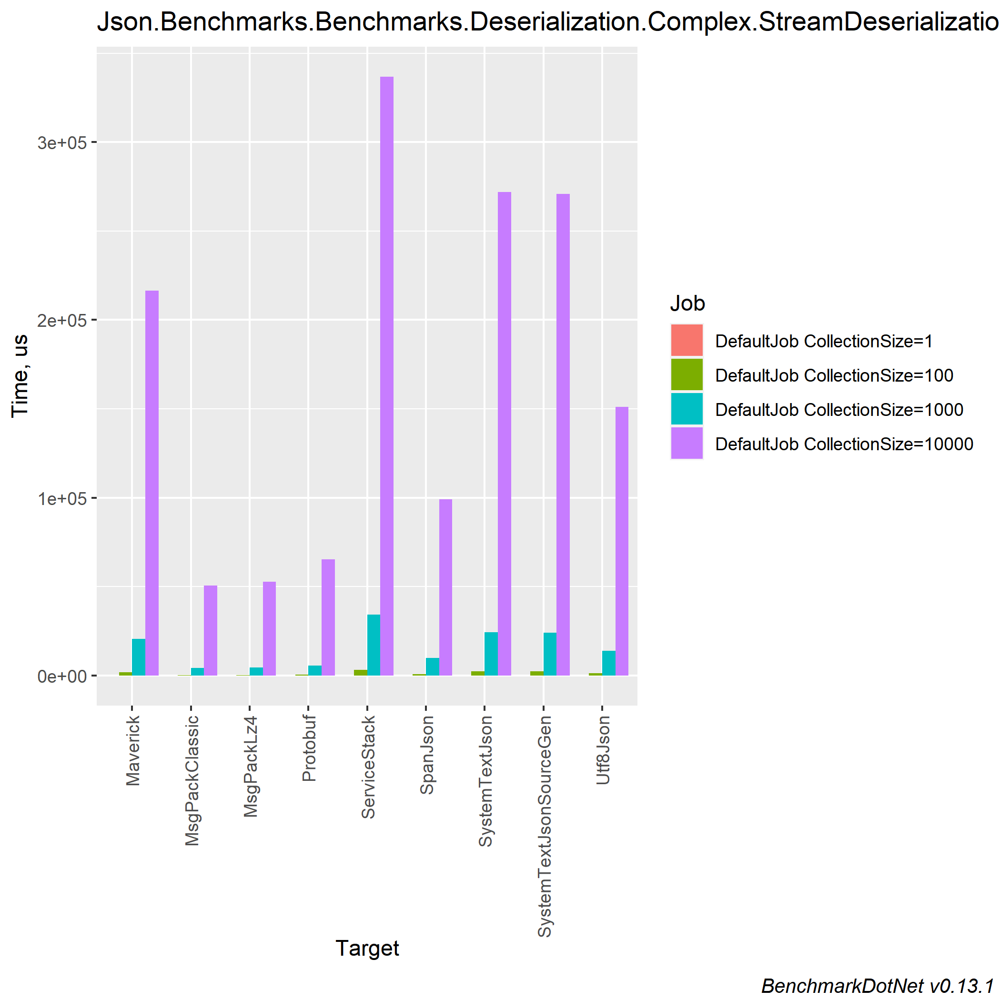
<a name="async-stream-complex-deserialization"></a>
### Async Stream
| Method                  | CollectionSize |           Mean |         Error |        StdDev |        StdErr |            Min |             Q1 |         Median |             Q3 |            Max |        Op/s | Ratio | RatioSD |      Gen 0 |     Gen 1 |    Gen 2 |  Allocated |
|-------------------------|----------------|---------------:|--------------:|--------------:|--------------:|---------------:|---------------:|---------------:|---------------:|---------------:|------------:|------:|--------:|-----------:|----------:|---------:|-----------:|
| MsgPackClassic          | 1              |       3.236 μs |     0.0369 μs |     0.0327 μs |     0.0088 μs |       3.191 μs |       3.207 μs |       3.233 μs |       3.263 μs |       3.297 μs | 309,018.625 |  0.17 |    0.00 |     0.3433 |         - |        - |       1 KB |
| MsgPackLz4              | 1              |       3.988 μs |     0.0440 μs |     0.0368 μs |     0.0102 μs |       3.940 μs |       3.966 μs |       3.985 μs |       3.999 μs |       4.079 μs | 250,729.501 |  0.21 |    0.00 |     0.3357 |         - |        - |       1 KB |
| Protobuf                | 1              |       5.877 μs |     0.0530 μs |     0.0470 μs |     0.0126 μs |       5.813 μs |       5.828 μs |       5.882 μs |       5.916 μs |       5.935 μs | 170,150.876 |  0.31 |    0.00 |     0.3586 |         - |        - |       1 KB |
| SpanJson                | 1              |       8.286 μs |     0.1514 μs |     0.1265 μs |     0.0351 μs |       8.149 μs |       8.203 μs |       8.242 μs |       8.318 μs |       8.594 μs | 120,686.549 |  0.44 |    0.01 |     0.3204 |         - |        - |       1 KB |
| Utf8Json                | 1              |      10.242 μs |     0.1051 μs |     0.0932 μs |     0.0249 μs |      10.140 μs |      10.157 μs |      10.240 μs |      10.310 μs |      10.438 μs |  97,640.187 |  0.54 |    0.01 |     0.5646 |         - |        - |       2 KB |
| SystemTextJson          | 1              |      18.992 μs |     0.1320 μs |     0.1102 μs |     0.0306 μs |      18.841 μs |      18.899 μs |      18.975 μs |      19.081 μs |      19.199 μs |  52,655.109 |  1.00 |    0.00 |     1.0681 |         - |        - |       4 KB |
| SystemTextJsonSourceGen | 1              |      19.271 μs |     0.3848 μs |     0.3599 μs |     0.0929 μs |      18.798 μs |      18.956 μs |      19.199 μs |      19.585 μs |      19.918 μs |  51,890.222 |  1.02 |    0.02 |     1.0681 |         - |        - |       4 KB |
| ServiceStack            | 1              |      29.520 μs |     0.2877 μs |     0.2691 μs |     0.0695 μs |      29.100 μs |      29.361 μs |      29.510 μs |      29.696 μs |      30.111 μs |  33,874.821 |  1.55 |    0.01 |     2.1973 |         - |        - |       9 KB |
|                         |                |                |               |               |               |                |                |                |                |                |             |       |         |            |           |          |            |
| MsgPackClassic          | 100            |     292.000 μs |     2.5731 μs |     2.1487 μs |     0.5959 μs |     287.918 μs |     291.021 μs |     291.661 μs |     293.643 μs |     295.337 μs |   3,424.663 |  0.13 |    0.00 |    29.2969 |    7.8125 |        - |     134 KB |
| MsgPackLz4              | 100            |     320.956 μs |     3.2030 μs |     2.8394 μs |     0.7589 μs |     317.026 μs |     319.300 μs |     319.927 μs |     322.914 μs |     326.208 μs |   3,115.693 |  0.14 |    0.00 |    28.8086 |    9.7656 |        - |     134 KB |
| Protobuf                | 100            |     511.496 μs |     8.4167 μs |     7.8729 μs |     2.0328 μs |     500.211 μs |     505.378 μs |     511.286 μs |     516.684 μs |     526.402 μs |   1,955.049 |  0.22 |    0.00 |    28.3203 |    9.7656 |        - |     134 KB |
| SpanJson                | 100            |     854.109 μs |     6.9364 μs |     5.7922 μs |     1.6065 μs |     847.495 μs |     849.709 μs |     852.936 μs |     858.129 μs |     863.712 μs |   1,170.811 |  0.37 |    0.00 |    31.2500 |    8.7891 |        - |     134 KB |
| Utf8Json                | 100            |   1,244.631 μs |    23.7425 μs |    23.3183 μs |     5.8296 μs |   1,212.050 μs |   1,224.010 μs |   1,240.002 μs |   1,268.464 μs |   1,283.051 μs |     803.451 |  0.54 |    0.01 |   111.3281 |   87.8906 |  64.4531 |     594 KB |
| SystemTextJsonSourceGen | 100            |   2,293.122 μs |    23.6009 μs |    19.7078 μs |     5.4660 μs |   2,262.894 μs |   2,278.343 μs |   2,293.817 μs |   2,304.627 μs |   2,339.007 μs |     436.087 |  0.99 |    0.01 |    85.9375 |   27.3438 |        - |     399 KB |
| SystemTextJson          | 100            |   2,323.918 μs |    24.2536 μs |    21.5002 μs |     5.7462 μs |   2,298.204 μs |   2,307.946 μs |   2,316.298 μs |   2,339.234 μs |   2,363.225 μs |     430.308 |  1.00 |    0.00 |    85.9375 |   27.3438 |        - |     399 KB |
| ServiceStack            | 100            |   3,189.207 μs |    62.5392 μs |    64.2232 μs |    15.5764 μs |   3,076.471 μs |   3,148.454 μs |   3,184.499 μs |   3,219.456 μs |   3,302.678 μs |     313.558 |  1.37 |    0.03 |   183.5938 |   82.0313 |  31.2500 |     853 KB |
|                         |                |                |               |               |               |                |                |                |                |                |             |       |         |            |           |          |            |
| MsgPackLz4              | 1000           |   4,435.016 μs |    87.1321 μs |    85.5753 μs |    21.3938 μs |   4,284.618 μs |   4,393.334 μs |   4,439.914 μs |   4,486.711 μs |   4,569.773 μs |     225.478 |  0.17 |    0.00 |   281.2500 |  187.5000 |  70.3125 |   2,122 KB |
| MsgPackClassic          | 1000           |   4,513.806 μs |    88.8155 μs |   145.9265 μs |    24.6661 μs |   4,165.370 μs |   4,441.627 μs |   4,553.817 μs |   4,602.711 μs |   4,783.364 μs |     221.543 |  0.17 |    0.01 |   296.8750 |  195.3125 |  85.9375 |   2,259 KB |
| Protobuf                | 1000           |   5,502.854 μs |    44.1042 μs |    36.8290 μs |    10.2145 μs |   5,451.502 μs |   5,478.591 μs |   5,496.330 μs |   5,513.183 μs |   5,583.654 μs |     181.724 |  0.21 |    0.00 |   210.9375 |  101.5625 |        - |   1,335 KB |
| SpanJson                | 1000           |   9,269.058 μs |   138.2929 μs |   122.5930 μs |    32.7644 μs |   9,146.864 μs |   9,189.173 μs |   9,225.844 μs |   9,332.204 μs |   9,585.467 μs |     107.886 |  0.36 |    0.01 |   203.1250 |   93.7500 |        - |   1,335 KB |
| Utf8Json                | 1000           |  13,889.429 μs |   275.0307 μs |   411.6530 μs |    75.1572 μs |  13,261.000 μs |  13,594.854 μs |  13,809.112 μs |  14,103.140 μs |  14,774.195 μs |      71.997 |  0.54 |    0.02 |   640.6250 |  562.5000 | 312.5000 |   6,064 KB |
| SystemTextJsonSourceGen | 1000           |  24,243.086 μs |   256.4385 μs |   227.3260 μs |    60.7554 μs |  23,994.388 μs |  24,037.635 μs |  24,192.059 μs |  24,434.009 μs |  24,712.006 μs |      41.249 |  0.94 |    0.01 |   625.0000 |  281.2500 |        - |   3,986 KB |
| SystemTextJson          | 1000           |  25,863.945 μs |   312.1770 μs |   276.7367 μs |    73.9610 μs |  25,512.856 μs |  25,676.657 μs |  25,789.161 μs |  25,991.591 μs |  26,506.966 μs |      38.664 |  1.00 |    0.00 |   625.0000 |  281.2500 |        - |   3,985 KB |
| ServiceStack            | 1000           |  34,545.956 μs |   462.1744 μs |   385.9366 μs |   107.0395 μs |  33,772.507 μs |  34,372.580 μs |  34,550.580 μs |  34,742.660 μs |  35,186.347 μs |      28.947 |  1.34 |    0.02 |  1133.3333 |  266.6667 |  66.6667 |   8,720 KB |
|                         |                |                |               |               |               |                |                |                |                |                |             |       |         |            |           |          |            |
| MsgPackClassic          | 10000          |  55,905.618 μs | 1,074.5290 μs | 1,194.3361 μs |   273.9995 μs |  53,896.820 μs |  54,943.880 μs |  55,836.560 μs |  56,628.345 μs |  58,293.590 μs |      17.887 |  0.20 |    0.01 |  2400.0000 | 1100.0000 | 300.0000 |  22,568 KB |
| MsgPackLz4              | 10000          |  55,922.434 μs |   776.6292 μs |   726.4595 μs |   187.5710 μs |  54,745.800 μs |  55,526.983 μs |  55,962.133 μs |  56,061.217 μs |  57,388.933 μs |      17.882 |  0.20 |    0.00 |  2333.3333 | 1000.0000 | 222.2222 |  21,212 KB |
| Protobuf                | 10000          |  72,151.284 μs | 1,083.8286 μs | 1,013.8139 μs |   261.7656 μs |  70,771.300 μs |  71,441.688 μs |  72,057.900 μs |  72,841.150 μs |  73,803.725 μs |      13.860 |  0.26 |    0.00 |  2250.0000 |  875.0000 | 125.0000 |  13,360 KB |
| SpanJson                | 10000          | 103,582.963 μs | 1,533.7535 μs | 1,434.6740 μs |   370.4312 μs | 101,775.940 μs | 102,132.710 μs | 103,515.960 μs | 104,582.290 μs | 105,795.820 μs |       9.654 |  0.37 |    0.01 |  2000.0000 |  800.0000 |        - |  13,358 KB |
| Utf8Json                | 10000          | 162,329.095 μs | 3,194.7199 μs | 2,832.0359 μs |   756.8934 μs | 157,946.833 μs | 160,120.533 μs | 162,928.483 μs | 163,502.800 μs | 167,295.933 μs |       6.160 |  0.58 |    0.01 |  3333.3333 | 1000.0000 |        - |  86,439 KB |
| SystemTextJsonSourceGen | 10000          | 270,791.600 μs | 3,672.0975 μs | 3,255.2188 μs |   869.9938 μs | 264,135.300 μs | 268,974.575 μs | 271,398.300 μs | 273,386.350 μs | 274,780.600 μs |       3.693 |  0.96 |    0.01 |  6000.0000 | 2000.0000 |        - |  39,946 KB |
| SystemTextJson          | 10000          | 280,499.060 μs | 2,887.0566 μs | 2,700.5546 μs |   697.2802 μs | 276,778.400 μs | 278,627.300 μs | 279,887.800 μs | 282,509.950 μs | 285,776.500 μs |       3.565 |  1.00 |    0.00 |  6000.0000 | 2000.0000 |        - |  39,945 KB |
| ServiceStack            | 10000          | 358,607.307 μs | 4,361.8764 μs | 3,866.6898 μs | 1,033.4163 μs | 349,707.400 μs | 356,343.000 μs | 359,054.400 μs | 360,785.150 μs | 365,414.200 μs |       2.789 |  1.28 |    0.02 | 11000.0000 | 3000.0000 |        - | 118,471 KB |
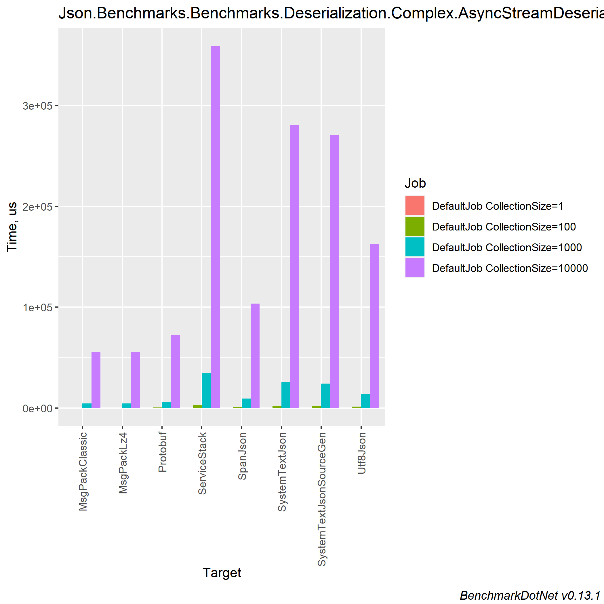
<a name="serialization"></a>
## Serialization

<a name="simple-model-serialization"></a>
## Simple Model

<a name="string-simple-serialization"></a>
### String
| Method                  | CollectionSize |            Mean |          Error |         StdDev |        StdErr |          Median |             Min |              Q1 |              Q3 |             Max |         Op/s | Ratio | RatioSD |    Gen 0 |    Gen 1 |    Gen 2 |   Allocated |
|-------------------------|----------------|----------------:|---------------:|---------------:|--------------:|----------------:|----------------:|----------------:|----------------:|----------------:|-------------:|------:|--------:|---------:|---------:|---------:|------------:|
| JsonSrcGen              | 1              |        89.64 ns |       0.382 ns |       0.338 ns |      0.090 ns |        89.56 ns |        89.13 ns |        89.41 ns |        89.84 ns |        90.39 ns | 11,155,651.9 |  0.20 |    0.01 |   0.0381 |        - |        - |       160 B |
| SpanJson                | 1              |       154.67 ns |       1.356 ns |       1.268 ns |      0.328 ns |       154.93 ns |       152.94 ns |       153.63 ns |       155.33 ns |       157.50 ns |  6,465,489.8 |  0.35 |    0.01 |   0.0381 |        - |        - |       160 B |
| Utf8Json                | 1              |       190.87 ns |       1.255 ns |       1.112 ns |      0.297 ns |       190.89 ns |       188.74 ns |       190.00 ns |       191.82 ns |       192.31 ns |  5,239,241.1 |  0.43 |    0.01 |   0.0610 |        - |        - |       256 B |
| NetJson                 | 1              |       204.11 ns |       1.509 ns |       1.338 ns |      0.358 ns |       203.64 ns |       202.79 ns |       203.23 ns |       204.50 ns |       206.89 ns |  4,899,402.9 |  0.46 |    0.01 |   0.0725 |        - |        - |       304 B |
| SystemTextJsonSourceGen | 1              |       240.85 ns |       4.202 ns |       3.725 ns |      0.996 ns |       239.95 ns |       236.38 ns |       238.89 ns |       241.98 ns |       248.69 ns |  4,151,933.3 |  0.54 |    0.02 |   0.0763 |        - |        - |       320 B |
| Jil                     | 1              |       313.75 ns |       3.468 ns |       3.075 ns |      0.822 ns |       313.39 ns |       309.22 ns |       312.20 ns |       315.68 ns |       319.01 ns |  3,187,251.5 |  0.70 |    0.02 |   0.2046 |        - |        - |       856 B |
| SystemTextJson          | 1              |       448.92 ns |       8.907 ns |      10.258 ns |      2.294 ns |       451.48 ns |       432.71 ns |       437.09 ns |       453.99 ns |       470.65 ns |  2,227,547.8 |  1.00 |    0.00 |   0.1564 |        - |        - |       656 B |
| ServiceStack            | 1              |       638.20 ns |       7.422 ns |       6.942 ns |      1.792 ns |       636.36 ns |       628.41 ns |       633.80 ns |       643.31 ns |       649.17 ns |  1,566,897.1 |  1.43 |    0.04 |   0.1717 |        - |        - |       720 B |
| Maverick                | 1              |       642.63 ns |      12.380 ns |      13.760 ns |      3.157 ns |       639.85 ns |       625.57 ns |       632.37 ns |       648.33 ns |       675.02 ns |  1,556,102.9 |  1.43 |    0.05 |   0.1011 |        - |        - |       424 B |
| Newtonsoft              | 1              |     1,091.56 ns |       8.304 ns |       7.362 ns |      1.967 ns |     1,092.44 ns |     1,080.91 ns |     1,085.69 ns |     1,096.04 ns |     1,103.55 ns |    916,118.6 |  2.44 |    0.06 |   0.4025 |        - |        - |     1,688 B |
|                         |                |                 |                |                |               |                 |                 |                 |                 |                 |              |       |         |          |          |          |             |
| JsonSrcGen              | 100            |    10,236.41 ns |      66.199 ns |      58.684 ns |     15.684 ns |    10,233.97 ns |    10,141.14 ns |    10,189.63 ns |    10,283.62 ns |    10,330.24 ns |     97,690.5 |  0.39 |    0.00 |   3.2806 |        - |        - |    13,808 B |
| SpanJson                | 100            |    10,868.46 ns |      86.908 ns |      72.572 ns |     20.128 ns |    10,838.08 ns |    10,795.95 ns |    10,815.81 ns |    10,902.82 ns |    11,054.78 ns |     92,009.4 |  0.41 |    0.01 |   3.2806 |        - |        - |    13,816 B |
| Utf8Json                | 100            |    11,240.55 ns |      48.601 ns |      37.944 ns |     10.954 ns |    11,237.60 ns |    11,188.55 ns |    11,217.29 ns |    11,253.55 ns |    11,325.06 ns |     88,963.6 |  0.43 |    0.00 |   4.9286 |        - |        - |    20,696 B |
| SystemTextJsonSourceGen | 100            |    13,734.02 ns |      33.430 ns |      26.100 ns |      7.534 ns |    13,725.27 ns |    13,690.61 ns |    13,721.88 ns |    13,741.79 ns |    13,774.97 ns |     72,811.9 |  0.52 |    0.01 |   3.3417 |        - |        - |    14,056 B |
| Jil                     | 100            |    14,401.26 ns |     104.664 ns |      87.399 ns |     24.240 ns |    14,405.47 ns |    14,296.15 ns |    14,325.94 ns |    14,434.69 ns |    14,619.04 ns |     69,438.4 |  0.55 |    0.00 |   7.4005 |   0.7324 |        - |    31,088 B |
| NetJson                 | 100            |    20,855.62 ns |     168.150 ns |     149.061 ns |     39.838 ns |    20,821.73 ns |    20,628.95 ns |    20,762.72 ns |    20,950.59 ns |    21,187.21 ns |     47,948.7 |  0.79 |    0.01 |   7.0190 |        - |        - |    29,505 B |
| SystemTextJson          | 100            |    26,405.90 ns |     282.857 ns |     250.745 ns |     67.014 ns |    26,300.83 ns |    26,091.61 ns |    26,244.16 ns |    26,577.64 ns |    26,893.38 ns |     37,870.3 |  1.00 |    0.00 |   3.4180 |        - |        - |    14,368 B |
| Maverick                | 100            |    38,182.47 ns |     312.564 ns |     261.005 ns |     72.390 ns |    38,191.43 ns |    37,715.13 ns |    38,094.43 ns |    38,383.53 ns |    38,574.58 ns |     26,190.0 |  1.45 |    0.02 |   3.4180 |        - |        - |    14,336 B |
| ServiceStack            | 100            |    44,704.58 ns |     253.250 ns |     211.475 ns |     58.653 ns |    44,610.98 ns |    44,413.11 ns |    44,525.49 ns |    44,838.04 ns |    45,143.02 ns |     22,369.1 |  1.69 |    0.02 |  10.1929 |        - |        - |    42,713 B |
| Newtonsoft              | 100            |    53,791.97 ns |     234.615 ns |     207.980 ns |     55.585 ns |    53,752.93 ns |    53,536.58 ns |    53,644.37 ns |    53,963.48 ns |    54,249.30 ns |     18,590.1 |  2.04 |    0.02 |   8.6670 |        - |        - |    36,376 B |
|                         |                |                 |                |                |               |                 |                 |                 |                 |                 |              |       |         |          |          |          |             |
| JsonSrcGen              | 1000           |   135,268.68 ns |   2,369.406 ns |   2,216.344 ns |    572.258 ns |   134,797.01 ns |   132,390.61 ns |   133,348.29 ns |   137,576.57 ns |   138,697.28 ns |      7,392.7 |  0.43 |    0.02 |  25.3906 |  25.3906 |  25.3906 |   138,132 B |
| SpanJson                | 1000           |   135,563.35 ns |   1,999.509 ns |   1,870.342 ns |    482.920 ns |   135,446.36 ns |   132,676.88 ns |   134,509.08 ns |   136,617.96 ns |   139,423.34 ns |      7,376.6 |  0.43 |    0.02 |  23.6816 |  23.6816 |  23.6816 |   138,101 B |
| SystemTextJsonSourceGen | 1000           |   169,027.12 ns |   1,457.694 ns |   1,620.223 ns |    371.705 ns |   168,721.22 ns |   167,042.29 ns |   167,986.41 ns |   169,798.41 ns |   173,686.06 ns |      5,916.2 |  0.54 |    0.02 |  25.3906 |  25.3906 |  25.3906 |   138,420 B |
| Utf8Json                | 1000           |   182,780.67 ns |   3,131.697 ns |   2,929.391 ns |    756.366 ns |   182,466.43 ns |   177,859.01 ns |   180,795.40 ns |   184,492.77 ns |   188,277.66 ns |      5,471.0 |  0.58 |    0.03 |  57.1289 |  41.2598 |  40.7715 |   337,928 B |
| SystemTextJson          | 1000           |   309,529.01 ns |   5,632.439 ns |  10,156.450 ns |  1,586.171 ns |   305,757.96 ns |   300,362.01 ns |   303,794.53 ns |   310,325.73 ns |   339,654.59 ns |      3,230.7 |  1.00 |    0.00 |  28.8086 |  28.8086 |  28.8086 |   138,897 B |
| Maverick                | 1000           |   407,291.18 ns |   3,176.830 ns |   2,971.608 ns |    767.266 ns |   407,459.67 ns |   401,665.09 ns |   406,343.14 ns |   409,836.50 ns |   411,684.23 ns |      2,455.2 |  1.29 |    0.06 |  27.3438 |  26.8555 |  26.8555 |   139,856 B |
| NetJson                 | 1000           |   431,137.52 ns |   6,615.000 ns |   6,187.675 ns |  1,597.651 ns |   430,061.77 ns |   422,971.19 ns |   425,021.04 ns |   437,523.51 ns |   439,803.42 ns |      2,319.4 |  1.36 |    0.06 |  68.3594 |  26.8555 |  26.8555 |   295,683 B |
| Jil                     | 1000           |   451,048.33 ns |   8,806.541 ns |   9,788.447 ns |  2,245.624 ns |   449,411.28 ns |   435,969.87 ns |   442,727.71 ns |   459,383.37 ns |   463,474.17 ns |      2,217.1 |  1.43 |    0.07 |  62.0117 |  41.9922 |  29.2969 |   284,147 B |
| Newtonsoft              | 1000           |   580,886.63 ns |   7,643.098 ns |   6,775.407 ns |  1,810.804 ns |   578,787.55 ns |   574,823.34 ns |   576,162.08 ns |   583,195.58 ns |   596,564.94 ns |      1,721.5 |  1.84 |    0.09 |  76.1719 |  46.8750 |  31.2500 |   332,448 B |
| ServiceStack            | 1000           | 1,020,514.57 ns |  19,645.058 ns |  23,386.044 ns |  5,103.253 ns | 1,025,658.20 ns |   955,767.58 ns | 1,007,884.38 ns | 1,037,190.82 ns | 1,050,289.26 ns |        979.9 |  3.26 |    0.16 | 101.5625 |  33.2031 |  33.2031 |   424,383 B |
|                         |                |                 |                |                |               |                 |                 |                 |                 |                 |              |       |         |          |          |          |             |
| JsonSrcGen              | 10000          | 1,446,050.04 ns |  15,855.411 ns |  13,239.987 ns |  3,672.112 ns | 1,446,607.71 ns | 1,421,277.64 ns | 1,438,562.99 ns | 1,454,144.82 ns | 1,471,751.46 ns |        691.5 |  0.49 |    0.01 | 144.5313 | 144.5313 | 144.5313 | 1,380,173 B |
| SpanJson                | 10000          | 1,468,689.40 ns |  29,106.889 ns |  73,023.494 ns |  8,488.809 ns | 1,442,707.23 ns | 1,338,874.41 ns | 1,422,414.89 ns | 1,505,057.37 ns | 1,704,968.16 ns |        680.9 |  0.51 |    0.02 | 152.3438 | 152.3438 | 152.3438 | 1,380,666 B |
| SystemTextJsonSourceGen | 10000          | 1,701,341.80 ns |   6,858.155 ns |   6,079.576 ns |  1,624.835 ns | 1,702,329.49 ns | 1,689,263.67 ns | 1,697,911.47 ns | 1,705,683.25 ns | 1,708,807.23 ns |        587.8 |  0.58 |    0.00 | 152.3438 | 152.3438 | 152.3438 | 1,383,052 B |
| SystemTextJson          | 10000          | 2,938,431.30 ns |  19,189.605 ns |  17,949.969 ns |  4,634.662 ns | 2,939,716.41 ns | 2,910,257.81 ns | 2,925,767.77 ns | 2,949,654.49 ns | 2,971,948.05 ns |        340.3 |  1.00 |    0.00 | 164.0625 | 164.0625 | 164.0625 | 1,383,163 B |
| Jil                     | 10000          | 3,271,085.18 ns |  64,325.729 ns |  63,176.467 ns | 15,794.117 ns | 3,265,964.06 ns | 3,183,098.44 ns | 3,216,965.62 ns | 3,316,591.21 ns | 3,387,941.80 ns |        305.7 |  1.11 |    0.02 | 437.5000 | 355.4688 | 199.2188 | 2,781,363 B |
| Utf8Json                | 10000          | 3,421,613.04 ns | 143,868.500 ns | 424,199.517 ns | 42,419.952 ns | 3,628,721.88 ns | 2,497,886.33 ns | 3,098,728.91 ns | 3,751,820.02 ns | 4,003,469.53 ns |        292.3 |  1.18 |    0.15 | 152.3438 | 152.3438 | 152.3438 | 4,035,730 B |
| Maverick                | 10000          | 4,226,710.64 ns |  83,719.550 ns |  99,662.168 ns | 21,748.068 ns | 4,220,533.59 ns | 4,047,605.47 ns | 4,168,071.88 ns | 4,258,396.09 ns | 4,480,809.38 ns |        236.6 |  1.43 |    0.04 | 242.1875 | 218.7500 | 164.0625 | 1,825,734 B |
| NetJson                 | 10000          | 4,405,056.09 ns |  77,949.060 ns | 101,355.796 ns | 20,689.165 ns | 4,408,840.82 ns | 4,182,116.41 ns | 4,357,316.50 ns | 4,427,411.13 ns | 4,632,276.17 ns |        227.0 |  1.50 |    0.04 | 578.1250 | 164.0625 | 164.0625 | 2,952,995 B |
| Newtonsoft              | 10000          | 5,912,078.54 ns |  46,917.284 ns |  43,886.457 ns | 11,331.434 ns | 5,905,945.31 ns | 5,857,978.91 ns | 5,874,016.41 ns | 5,931,968.36 ns | 5,994,277.34 ns |        169.1 |  2.01 |    0.02 | 507.8125 | 398.4375 | 203.1250 | 3,260,675 B |
| ServiceStack            | 10000          | 6,840,329.26 ns | 134,715.325 ns | 175,167.975 ns | 35,756.013 ns | 6,859,998.05 ns | 6,500,693.75 ns | 6,725,649.22 ns | 6,945,482.42 ns | 7,147,604.69 ns |        146.2 |  2.33 |    0.07 | 882.8125 | 203.1250 | 203.1250 | 4,240,052 B |
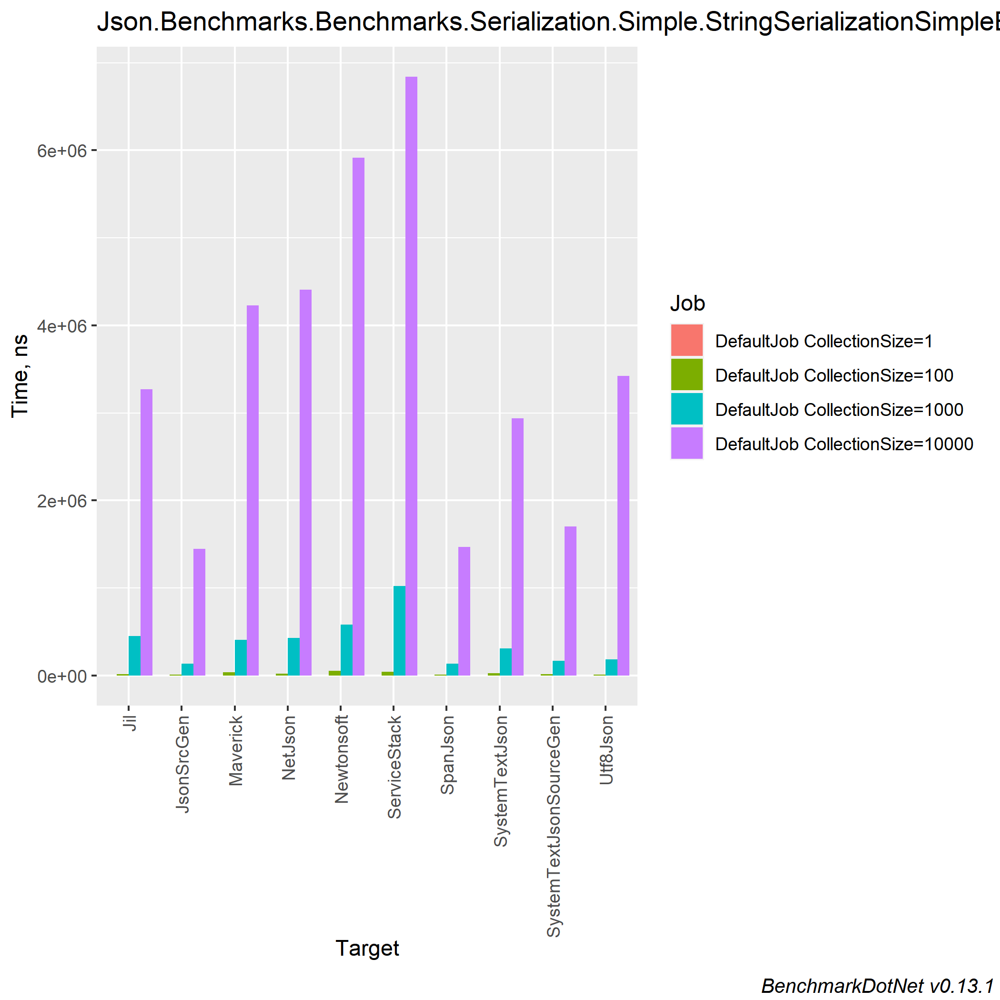
<a name="byte-simple-serialization"></a>
### Byte
| Method                  | CollectionSize |            Mean |         Error |        StdDev |       StdErr |             Min |              Q1 |          Median |              Q3 |             Max |         Op/s | Ratio | RatioSD |    Gen 0 |    Gen 1 |    Gen 2 |   Allocated |
|-------------------------|----------------|----------------:|--------------:|--------------:|-------------:|----------------:|----------------:|----------------:|----------------:|----------------:|-------------:|------:|--------:|---------:|---------:|---------:|------------:|
| JsonSrcGen              | 1              |        92.46 ns |      0.642 ns |      0.569 ns |     0.152 ns |        91.31 ns |        92.08 ns |        92.39 ns |        92.89 ns |        93.51 ns | 10,815,088.8 |  0.22 |    0.01 |   0.0210 |        - |        - |        88 B |
| SpanJson                | 1              |       158.42 ns |      1.483 ns |      1.387 ns |     0.358 ns |       156.56 ns |       157.52 ns |       157.78 ns |       159.61 ns |       160.96 ns |  6,312,368.1 |  0.38 |    0.01 |   0.0229 |        - |        - |        96 B |
| Utf8Json                | 1              |       162.78 ns |      1.647 ns |      1.460 ns |     0.390 ns |       159.42 ns |       161.90 ns |       162.79 ns |       163.99 ns |       164.66 ns |  6,143,425.7 |  0.39 |    0.01 |   0.0229 |        - |        - |        96 B |
| ZeroFormatter           | 1              |       169.91 ns |      1.856 ns |      1.736 ns |     0.448 ns |       167.39 ns |       168.82 ns |       169.51 ns |       171.01 ns |       173.02 ns |  5,885,301.5 |  0.40 |    0.01 |   0.2754 |        - |        - |     1,152 B |
| MsgPackClassic          | 1              |       174.49 ns |      3.417 ns |      5.114 ns |     0.934 ns |       166.98 ns |       170.48 ns |       174.92 ns |       178.71 ns |       187.83 ns |  5,731,086.8 |  0.41 |    0.02 |   0.0210 |        - |        - |        88 B |
| SystemTextJsonSourceGen | 1              |       279.71 ns |      2.743 ns |      2.566 ns |     0.662 ns |       276.12 ns |       277.77 ns |       279.30 ns |       281.56 ns |       284.17 ns |  3,575,193.3 |  0.66 |    0.01 |   0.0610 |        - |        - |       256 B |
| MsgPackLz4Block         | 1              |       365.26 ns |      2.603 ns |      2.032 ns |     0.587 ns |       361.55 ns |       363.97 ns |       365.07 ns |       366.89 ns |       368.07 ns |  2,737,753.2 |  0.87 |    0.02 |   0.0191 |        - |        - |        80 B |
| SystemTextJson          | 1              |       424.70 ns |      4.469 ns |      7.466 ns |     1.244 ns |       410.73 ns |       420.10 ns |       425.23 ns |       427.98 ns |       446.83 ns |  2,354,596.1 |  1.00 |    0.00 |   0.1411 |        - |        - |       592 B |
|                         |                |                 |               |               |              |                 |                 |                 |                 |                 |              |       |         |          |          |          |             |
| ZeroFormatter           | 100            |     7,100.77 ns |     21.498 ns |     16.785 ns |     4.845 ns |     7,072.52 ns |     7,094.71 ns |     7,104.91 ns |     7,108.84 ns |     7,124.45 ns |    140,829.8 |  0.28 |    0.00 |   4.8294 |        - |        - |    20,208 B |
| MsgPackClassic          | 100            |     7,913.38 ns |     77.517 ns |     68.717 ns |    18.365 ns |     7,821.42 ns |     7,862.22 ns |     7,898.63 ns |     7,940.03 ns |     8,059.90 ns |    126,368.3 |  0.31 |    0.00 |   1.1749 |        - |        - |     4,968 B |
| JsonSrcGen              | 100            |    10,169.33 ns |     94.134 ns |     83.448 ns |    22.302 ns |    10,054.49 ns |    10,108.76 ns |    10,145.21 ns |    10,238.43 ns |    10,347.86 ns |     98,334.9 |  0.40 |    0.01 |   1.6479 |        - |        - |     6,952 B |
| Utf8Json                | 100            |    10,225.31 ns |    141.934 ns |    125.820 ns |    33.627 ns |    10,040.13 ns |    10,139.30 ns |    10,180.58 ns |    10,277.70 ns |    10,504.06 ns |     97,796.6 |  0.40 |    0.01 |   1.6479 |        - |        - |     6,928 B |
| SpanJson                | 100            |    10,832.10 ns |     93.841 ns |     83.188 ns |    22.233 ns |    10,719.79 ns |    10,769.91 ns |    10,803.81 ns |    10,895.94 ns |    10,965.30 ns |     92,318.2 |  0.42 |    0.01 |   1.6327 |        - |        - |     6,880 B |
| SystemTextJsonSourceGen | 100            |    12,884.53 ns |    155.396 ns |    129.763 ns |    35.990 ns |    12,795.97 ns |    12,810.78 ns |    12,816.27 ns |    12,880.77 ns |    13,186.48 ns |     77,612.4 |  0.50 |    0.01 |   1.6937 |        - |        - |     7,096 B |
| MsgPackLz4Block         | 100            |    14,307.16 ns |    157.145 ns |    122.688 ns |    35.417 ns |    14,181.63 ns |    14,209.64 ns |    14,251.60 ns |    14,428.72 ns |    14,527.90 ns |     69,895.1 |  0.56 |    0.01 |   0.6256 |        - |        - |     2,632 B |
| SystemTextJson          | 100            |    25,541.02 ns |    465.053 ns |    412.257 ns |   110.180 ns |    25,070.37 ns |    25,228.59 ns |    25,437.51 ns |    25,708.92 ns |    26,464.87 ns |     39,152.7 |  1.00 |    0.00 |   1.7700 |        - |        - |     7,424 B |
|                         |                |                 |               |               |              |                 |                 |                 |                 |                 |              |       |         |          |          |          |             |
| ZeroFormatter           | 1000           |    74,245.60 ns |    313.896 ns |    262.117 ns |    72.698 ns |    73,834.18 ns |    73,996.04 ns |    74,237.72 ns |    74,480.83 ns |    74,650.48 ns |     13,468.8 |  0.28 |    0.01 |  41.6260 |  10.3760 |        - |   176,816 B |
| MsgPackClassic          | 1000           |    84,392.74 ns |    813.929 ns |    721.527 ns |   192.836 ns |    83,691.39 ns |    83,852.01 ns |    84,189.70 ns |    84,452.25 ns |    86,019.95 ns |     11,849.4 |  0.32 |    0.01 |  11.7188 |        - |        - |    49,440 B |
| JsonSrcGen              | 1000           |   115,197.29 ns |  2,003.153 ns |  1,672.723 ns |   463.930 ns |   113,651.66 ns |   114,035.63 ns |   114,545.84 ns |   115,715.03 ns |   119,215.89 ns |      8,680.8 |  0.44 |    0.01 |  16.3574 |   3.1738 |        - |    69,112 B |
| SpanJson                | 1000           |   118,099.62 ns |    536.252 ns |    447.795 ns |   124.196 ns |   117,308.07 ns |   117,783.37 ns |   118,178.22 ns |   118,258.56 ns |   119,102.31 ns |      8,467.4 |  0.45 |    0.01 |  16.3574 |   3.1738 |        - |    68,872 B |
| SystemTextJsonSourceGen | 1000           |   141,166.97 ns |  2,436.019 ns |  2,278.654 ns |   588.346 ns |   138,496.08 ns |   139,216.52 ns |   141,494.52 ns |   142,161.18 ns |   146,270.03 ns |      7,083.8 |  0.54 |    0.02 |  16.3574 |   3.1738 |        - |    69,304 B |
| Utf8Json                | 1000           |   153,070.15 ns |    653.431 ns |    579.250 ns |   154.811 ns |   152,378.25 ns |   152,549.35 ns |   152,976.46 ns |   153,595.64 ns |   154,133.86 ns |      6,533.0 |  0.58 |    0.01 |  40.5273 |  29.2969 |  24.1699 |   200,053 B |
| MsgPackLz4Block         | 1000           |   173,918.83 ns |  1,382.054 ns |  1,154.078 ns |   320.084 ns |   172,183.11 ns |   173,317.24 ns |   173,955.40 ns |   174,760.72 ns |   176,379.47 ns |      5,749.8 |  0.66 |    0.02 |   5.3711 |        - |        - |    22,873 B |
| SystemTextJson          | 1000           |   262,513.48 ns |  5,207.939 ns |  6,395.817 ns | 1,363.593 ns |   253,977.59 ns |   256,775.18 ns |   262,394.24 ns |   267,697.49 ns |   277,912.70 ns |      3,809.3 |  1.00 |    0.00 |  16.1133 |   2.9297 |        - |    69,504 B |
|                         |                |                 |               |               |              |                 |                 |                 |                 |                 |              |       |         |          |          |          |             |
| ZeroFormatter           | 10000          |   836,510.34 ns |  6,587.345 ns |  5,839.510 ns | 1,560.675 ns |   826,131.84 ns |   833,019.46 ns |   836,463.13 ns |   838,351.51 ns |   846,910.64 ns |      1,195.4 |  0.32 |    0.00 | 187.5000 | 157.2266 | 157.2266 | 1,513,637 B |
| MsgPackClassic          | 10000          |   896,839.86 ns |  6,595.392 ns |  6,169.334 ns | 1,592.915 ns |   886,757.71 ns |   892,425.73 ns |   894,936.62 ns |   900,637.11 ns |   908,660.55 ns |      1,115.0 |  0.34 |    0.00 |  67.3828 |  67.3828 |  67.3828 |   494,787 B |
| SpanJson                | 10000          | 1,220,433.79 ns | 10,266.830 ns |  9,101.277 ns | 2,432.419 ns | 1,197,984.18 ns | 1,217,312.99 ns | 1,221,345.51 ns | 1,227,134.42 ns | 1,232,821.09 ns |        819.4 |  0.46 |    0.00 |  95.7031 |  95.7031 |  95.7031 |   690,454 B |
| JsonSrcGen              | 10000          | 1,276,765.37 ns |  6,770.653 ns |  6,002.007 ns | 1,604.104 ns | 1,268,678.03 ns | 1,272,655.86 ns | 1,275,583.40 ns | 1,277,155.57 ns | 1,291,291.31 ns |        783.2 |  0.49 |    0.00 | 103.5156 | 103.5156 | 103.5156 |   690,019 B |
| SystemTextJsonSourceGen | 10000          | 1,480,119.09 ns |  7,680.189 ns |  7,184.053 ns | 1,854.915 ns | 1,467,562.30 ns | 1,475,310.25 ns | 1,479,979.88 ns | 1,485,080.86 ns | 1,490,913.48 ns |        675.6 |  0.56 |    0.01 | 109.3750 | 109.3750 | 109.3750 |   691,816 B |
| Utf8Json                | 10000          | 1,597,707.33 ns | 20,599.808 ns | 19,269.074 ns | 4,975.253 ns | 1,571,828.12 ns | 1,584,870.51 ns | 1,593,265.23 ns | 1,607,845.31 ns | 1,636,216.21 ns |        625.9 |  0.61 |    0.01 | 257.8125 | 257.8125 | 257.8125 | 2,656,621 B |
| MsgPackLz4Block         | 10000          | 1,771,254.67 ns | 19,078.791 ns | 35,834.594 ns | 5,402.268 ns | 1,746,769.34 ns | 1,757,262.65 ns | 1,762,191.41 ns | 1,770,642.58 ns | 1,969,883.01 ns |        564.6 |  0.68 |    0.03 |  35.1563 |  35.1563 |  35.1563 |   224,368 B |
| SystemTextJson          | 10000          | 2,632,414.23 ns | 19,377.970 ns | 17,178.066 ns | 4,591.031 ns | 2,601,370.31 ns | 2,618,413.87 ns | 2,630,863.87 ns | 2,644,850.59 ns | 2,660,719.14 ns |        379.9 |  1.00 |    0.00 |  97.6563 |  97.6563 |  97.6563 |   691,898 B |

<a name="stream-simple-serialization"></a>
### Stream
| Method                  | CollectionSize |            Mean |         Error |        StdDev |       StdErr |          Median |            Min |              Q1 |              Q3 |             Max |         Op/s | Ratio | RatioSD |     Gen 0 |    Gen 1 |    Gen 2 |   Allocated |
|-------------------------|----------------|----------------:|--------------:|--------------:|-------------:|----------------:|---------------:|----------------:|----------------:|----------------:|-------------:|------:|--------:|----------:|---------:|---------:|------------:|
| ZeroFormatter           | 1              |        228.5 ns |       2.86 ns |       2.39 ns |      0.66 ns |        227.8 ns |       225.1 ns |        227.4 ns |        228.2 ns |        234.5 ns | 4,376,656.80 |  0.51 |    0.01 |    0.3576 |        - |        - |     1,496 B |
| SystemTextJsonSourceGen | 1              |        238.3 ns |       1.68 ns |       1.31 ns |      0.38 ns |        238.0 ns |       235.2 ns |        237.8 ns |        239.2 ns |        240.0 ns | 4,196,376.45 |  0.53 |    0.00 |    0.1855 |        - |        - |       776 B |
| MsgPackNoCompress       | 1              |        353.6 ns |       3.34 ns |       2.96 ns |      0.79 ns |        353.1 ns |       349.3 ns |        351.4 ns |        355.0 ns |        360.2 ns | 2,828,192.05 |  0.79 |    0.01 |    0.0820 |        - |        - |       344 B |
| SystemTextJson          | 1              |        449.9 ns |       2.87 ns |       2.55 ns |      0.68 ns |        449.9 ns |       445.9 ns |        448.7 ns |        450.6 ns |        455.0 ns | 2,222,538.70 |  1.00 |    0.00 |    0.2675 |        - |        - |     1,120 B |
| MsgPackLz4Block         | 1              |        535.6 ns |       6.28 ns |       5.57 ns |      1.49 ns |        535.2 ns |       528.0 ns |        531.6 ns |        538.3 ns |        547.8 ns | 1,867,193.94 |  1.19 |    0.02 |    0.0820 |        - |        - |       344 B |
| Maverick                | 1              |        616.5 ns |       5.22 ns |       4.36 ns |      1.21 ns |        616.1 ns |       608.3 ns |        614.1 ns |        618.7 ns |        626.3 ns | 1,622,134.82 |  1.37 |    0.01 |    0.1221 |        - |        - |       512 B |
| ServiceStack            | 1              |        892.3 ns |      16.13 ns |      28.67 ns |      4.53 ns |        879.7 ns |       865.5 ns |        875.6 ns |        893.0 ns |        967.4 ns | 1,120,664.70 |  2.03 |    0.09 |    0.7496 |        - |        - |     3,136 B |
|                         |                |                 |               |               |              |                 |                |                 |                 |                 |              |       |         |           |          |          |             |
| ZeroFormatter           | 100            |      7,580.8 ns |      76.58 ns |      67.89 ns |     18.14 ns |      7,546.5 ns |     7,521.9 ns |      7,536.5 ns |      7,611.3 ns |      7,731.8 ns |   131,912.05 |  0.27 |    0.00 |    5.9586 |        - |        - |    24,960 B |
| MsgPackNoCompress       | 100            |      8,674.4 ns |      58.57 ns |      51.92 ns |     13.88 ns |      8,677.6 ns |     8,552.6 ns |      8,651.0 ns |      8,712.8 ns |      8,749.7 ns |   115,282.25 |  0.31 |    0.00 |    2.9449 |        - |        - |    12,352 B |
| MsgPackLz4Block         | 100            |     14,944.2 ns |     264.72 ns |     639.32 ns |     76.97 ns |     14,666.3 ns |    14,369.1 ns |     14,592.6 ns |     14,975.6 ns |     17,252.6 ns |    66,915.49 |  0.53 |    0.04 |    0.6409 |        - |        - |     2,744 B |
| SystemTextJsonSourceGen | 100            |     15,385.4 ns |     141.54 ns |     132.40 ns |     34.18 ns |     15,371.7 ns |    15,177.3 ns |     15,298.0 ns |     15,488.3 ns |     15,590.0 ns |    64,996.64 |  0.54 |    0.00 |    6.0425 |   0.5493 |        - |    25,384 B |
| SystemTextJson          | 100            |     28,419.7 ns |     142.71 ns |     119.17 ns |     33.05 ns |     28,397.3 ns |    28,228.7 ns |     28,347.5 ns |     28,477.0 ns |     28,720.2 ns |    35,186.80 |  1.00 |    0.00 |    6.1340 |   0.1221 |        - |    25,720 B |
| Maverick                | 100            |     37,053.5 ns |     536.09 ns |     447.66 ns |    124.16 ns |     36,910.2 ns |    36,504.2 ns |     36,728.8 ns |     37,433.2 ns |     37,779.1 ns |    26,987.98 |  1.30 |    0.02 |    2.9907 |        - |        - |    12,568 B |
| ServiceStack            | 100            |     49,845.8 ns |     371.74 ns |     329.54 ns |     88.07 ns |     49,796.2 ns |    49,510.9 ns |     49,613.3 ns |     49,857.1 ns |     50,584.3 ns |    20,061.85 |  1.75 |    0.02 |   11.8408 |        - |        - |    49,696 B |
|                         |                |                 |               |               |              |                 |                |                 |                 |                 |              |       |         |           |          |          |             |
| ZeroFormatter           | 1000           |     78,957.7 ns |   1,406.94 ns |   1,316.05 ns |    339.80 ns |     78,329.9 ns |    77,595.6 ns |     78,047.5 ns |     79,833.3 ns |     81,662.0 ns |    12,665.00 |  0.25 |    0.00 |   52.6123 |        - |        - |   223,368 B |
| MsgPackNoCompress       | 1000           |     90,821.5 ns |     763.14 ns |     637.25 ns |    176.74 ns |     90,795.3 ns |    89,918.8 ns |     90,293.8 ns |     91,299.2 ns |     91,812.3 ns |    11,010.60 |  0.28 |    0.00 |   26.9775 |   6.7139 |        - |   114,617 B |
| MsgPackLz4Block         | 1000           |    173,071.4 ns |   3,284.28 ns |   3,514.14 ns |    828.29 ns |    171,961.8 ns |   169,426.8 ns |    170,594.5 ns |    173,806.9 ns |    181,444.0 ns |     5,777.96 |  0.54 |    0.01 |    5.8594 |   0.7324 |        - |    25,560 B |
| SystemTextJsonSourceGen | 1000           |    191,650.7 ns |     956.22 ns |     847.67 ns |    226.55 ns |    191,886.2 ns |   190,564.2 ns |    190,886.3 ns |    192,034.5 ns |    193,587.7 ns |     5,217.83 |  0.60 |    0.01 |   68.6035 |  39.0625 |  26.6113 |   317,947 B |
| SystemTextJson          | 1000           |    321,770.1 ns |   2,176.72 ns |   2,036.10 ns |    525.72 ns |    321,754.3 ns |   318,337.0 ns |    320,317.5 ns |    322,693.9 ns |    326,153.9 ns |     3,107.81 |  1.00 |    0.00 |   71.7773 |  42.4805 |  29.2969 |   318,883 B |
| Maverick                | 1000           |    410,511.3 ns |   2,573.61 ns |   2,407.36 ns |    621.58 ns |    410,261.7 ns |   406,742.7 ns |    408,614.2 ns |    412,191.6 ns |    415,502.1 ns |     2,435.99 |  1.28 |    0.01 |   56.6406 |  26.8555 |  26.3672 |   258,660 B |
| ServiceStack            | 1000           |    972,021.9 ns |  19,090.84 ns |  25,485.72 ns |  5,097.14 ns |    985,324.4 ns |   921,476.4 ns |    955,872.5 ns |    991,874.0 ns |    998,519.9 ns |     1,028.78 |  3.02 |    0.08 |  130.8594 |  62.5000 |  31.2500 |   553,033 B |
|                         |                |                 |               |               |              |                 |                |                 |                 |                 |              |       |         |           |          |          |             |
| ZeroFormatter           | 10000          |  1,015,243.2 ns |  21,374.57 ns |  62,350.61 ns |  6,298.36 ns |  1,030,424.5 ns |   881,213.1 ns |    966,966.7 ns |  1,052,830.3 ns |  1,151,124.7 ns |       984.99 |  0.29 |    0.01 |  221.6797 | 192.3828 | 191.4063 | 1,978,694 B |
| MsgPackNoCompress       | 10000          |  1,134,365.4 ns |  15,815.95 ns |  13,207.04 ns |  3,662.97 ns |  1,134,445.7 ns | 1,103,395.5 ns |  1,127,206.4 ns |  1,140,372.7 ns |  1,160,176.2 ns |       881.55 |  0.36 |    0.00 |  152.3438 | 125.0000 | 125.0000 | 1,145,834 B |
| SystemTextJsonSourceGen | 10000          |  1,904,835.0 ns |  28,253.06 ns |  26,427.93 ns |  6,823.66 ns |  1,908,705.6 ns | 1,866,115.3 ns |  1,884,466.1 ns |  1,916,139.9 ns |  1,958,375.5 ns |       524.98 |  0.60 |    0.01 |  359.3750 | 332.0313 | 332.0313 | 2,864,204 B |
| MsgPackLz4Block         | 10000          |  2,031,430.5 ns |  25,907.09 ns |  24,233.51 ns |  6,257.07 ns |  2,021,876.6 ns | 1,998,954.7 ns |  2,014,733.6 ns |  2,051,734.2 ns |  2,079,466.4 ns |       492.26 |  0.64 |    0.01 |  101.5625 |  89.8438 |  89.8438 |   702,426 B |
| SystemTextJson          | 10000          |  3,151,014.2 ns |  14,447.07 ns |  13,513.80 ns |  3,489.25 ns |  3,144,322.3 ns | 3,130,151.2 ns |  3,142,106.8 ns |  3,164,209.6 ns |  3,169,583.2 ns |       317.36 |  1.00 |    0.00 |  394.5313 | 371.0938 | 367.1875 | 2,872,112 B |
| Maverick                | 10000          |  4,045,169.7 ns |  49,191.99 ns |  46,014.22 ns | 11,880.82 ns |  4,035,702.3 ns | 3,987,268.8 ns |  4,011,110.5 ns |  4,069,455.1 ns |  4,143,526.6 ns |       247.21 |  1.28 |    0.02 |  281.2500 | 257.8125 | 257.8125 | 2,092,092 B |
| ServiceStack            | 10000          | 10,149,708.8 ns | 197,804.54 ns | 211,648.64 ns | 49,886.06 ns | 10,200,321.1 ns | 9,623,893.8 ns | 10,062,987.1 ns | 10,306,704.3 ns | 10,378,782.8 ns |        98.52 |  3.21 |    0.07 | 1031.2500 | 375.0000 | 328.1250 | 4,961,474 B |
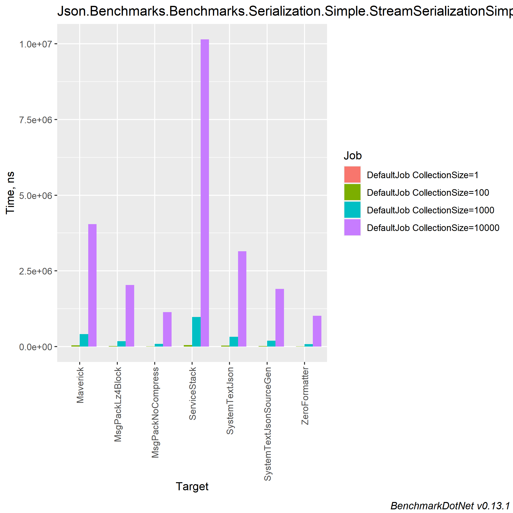
<a name="async-stream-simple-serialization"></a>
### Async Stream
| Method                  | CollectionSize |           Mean |        Error |       StdDev |      StdErr |            Min |             Q1 |         Median |             Q3 |            Max |        Op/s | Ratio | RatioSD |    Gen 0 |    Gen 1 |    Gen 2 |   Allocated |
|-------------------------|----------------|---------------:|-------------:|-------------:|------------:|---------------:|---------------:|---------------:|---------------:|---------------:|------------:|------:|--------:|---------:|---------:|---------:|------------:|
| SpanJson                | 1              |       255.3 ns |      2.84 ns |      2.52 ns |     0.67 ns |       251.7 ns |       253.5 ns |       255.2 ns |       257.0 ns |       260.3 ns | 3,917,199.8 |  0.41 |    0.00 |   0.0992 |        - |        - |       416 B |
| Utf8Json                | 1              |       275.8 ns |      0.95 ns |      0.79 ns |     0.22 ns |       274.5 ns |       275.4 ns |       275.8 ns |       276.5 ns |       277.0 ns | 3,625,494.4 |  0.45 |    0.00 |   0.0992 |        - |        - |       416 B |
| MsgPackClassic          | 1              |       444.8 ns |      3.68 ns |      3.26 ns |     0.87 ns |       441.2 ns |       442.6 ns |       443.7 ns |       445.9 ns |       454.0 ns | 2,248,399.7 |  0.72 |    0.01 |   0.0992 |        - |        - |       416 B |
| SystemTextJsonSourceGen | 1              |       459.4 ns |      6.75 ns |      5.64 ns |     1.56 ns |       455.2 ns |       455.9 ns |       457.4 ns |       459.4 ns |       474.5 ns | 2,176,667.5 |  0.74 |    0.01 |   0.1354 |        - |        - |       568 B |
| SystemTextJson          | 1              |       616.5 ns |      4.06 ns |      3.60 ns |     0.96 ns |       611.9 ns |       614.7 ns |       615.7 ns |       618.4 ns |       625.3 ns | 1,622,049.5 |  1.00 |    0.00 |   0.2174 |        - |        - |       912 B |
| MsgPackLz4Block         | 1              |       644.6 ns |      6.11 ns |      5.11 ns |     1.42 ns |       636.7 ns |       641.1 ns |       645.2 ns |       648.2 ns |       654.6 ns | 1,551,386.1 |  1.04 |    0.01 |   0.0992 |        - |        - |       416 B |
|                         |                |                |              |              |             |                |                |                |                |                |             |       |         |          |          |          |             |
| MsgPackClassic          | 100            |     8,821.5 ns |     55.51 ns |     46.35 ns |    12.86 ns |     8,768.3 ns |     8,790.1 ns |     8,809.7 ns |     8,843.0 ns |     8,938.3 ns |   113,360.0 |  0.34 |    0.00 |   2.9755 |        - |        - |    12,448 B |
| Utf8Json                | 100            |    10,279.5 ns |    204.23 ns |    292.90 ns |    55.35 ns |    10,004.4 ns |    10,095.7 ns |    10,157.9 ns |    10,333.8 ns |    11,095.8 ns |    97,281.2 |  0.40 |    0.01 |   1.6785 |        - |        - |     7,088 B |
| SpanJson                | 100            |    11,050.1 ns |     81.63 ns |     68.17 ns |    18.91 ns |    10,969.6 ns |    10,998.6 ns |    11,018.4 ns |    11,083.7 ns |    11,178.0 ns |    90,497.1 |  0.42 |    0.00 |   1.6785 |        - |        - |     7,048 B |
| MsgPackLz4Block         | 100            |    14,701.4 ns |    159.18 ns |    148.89 ns |    38.44 ns |    14,500.9 ns |    14,597.0 ns |    14,646.9 ns |    14,827.0 ns |    14,947.5 ns |    68,020.7 |  0.57 |    0.01 |   0.7172 |        - |        - |     3,024 B |
| SystemTextJson          | 100            |    26,010.3 ns |    305.50 ns |    285.77 ns |    73.79 ns |    25,574.6 ns |    25,782.8 ns |    25,994.7 ns |    26,215.8 ns |    26,523.0 ns |    38,446.3 |  1.00 |    0.00 |   1.8005 |        - |        - |     7,552 B |
| SystemTextJsonSourceGen | 100            |    27,565.4 ns |    525.82 ns |    683.71 ns |   139.56 ns |    26,978.0 ns |    27,103.4 ns |    27,352.0 ns |    27,568.5 ns |    29,525.6 ns |    36,277.4 |  1.07 |    0.04 |   1.8005 |        - |        - |     7,624 B |
|                         |                |                |              |              |             |                |                |                |                |                |             |       |         |          |          |          |             |
| MsgPackClassic          | 1000           |    89,767.2 ns |    669.92 ns |    559.41 ns |   155.15 ns |    89,036.0 ns |    89,367.7 ns |    89,762.7 ns |    90,175.3 ns |    90,740.8 ns |    11,139.9 |  0.32 |    0.00 |  26.9775 |   6.7139 |        - |   114,720 B |
| SpanJson                | 1000           |   113,275.3 ns |    708.54 ns |    628.10 ns |   167.87 ns |   112,704.0 ns |   112,748.4 ns |   113,066.6 ns |   113,617.4 ns |   114,758.2 ns |     8,828.0 |  0.40 |    0.00 |  16.3574 |   4.0283 |        - |    69,144 B |
| Utf8Json                | 1000           |   142,092.5 ns |    782.86 ns |    693.99 ns |   185.48 ns |   140,828.3 ns |   141,581.5 ns |   142,209.5 ns |   142,620.9 ns |   143,179.4 ns |     7,037.7 |  0.50 |    0.00 |  41.7480 |  30.0293 |  25.3906 |   200,468 B |
| MsgPackLz4Block         | 1000           |   174,878.8 ns |  1,246.51 ns |  1,040.89 ns |   288.69 ns |   173,676.7 ns |   174,020.8 ns |   174,860.8 ns |   175,269.7 ns |   177,536.3 ns |     5,718.2 |  0.62 |    0.00 |   6.1035 |   0.7324 |        - |    25,705 B |
| SystemTextJson          | 1000           |   282,964.0 ns |  2,238.02 ns |  2,093.45 ns |   540.53 ns |   279,456.8 ns |   281,624.4 ns |   282,951.3 ns |   284,367.5 ns |   286,495.1 ns |     3,534.0 |  1.00 |    0.00 |  51.2695 |  26.8555 |  26.3672 |   222,319 B |
| SystemTextJsonSourceGen | 1000           |   287,754.2 ns |  1,756.06 ns |  1,556.70 ns |   416.05 ns |   285,494.8 ns |   286,203.7 ns |   288,278.8 ns |   288,792.5 ns |   289,971.1 ns |     3,475.2 |  1.02 |    0.01 |  53.2227 |  28.3203 |  28.3203 |   222,453 B |
|                         |                |                |              |              |             |                |                |                |                |                |             |       |         |          |          |          |             |
| MsgPackClassic          | 10000          |   978,877.9 ns | 13,260.65 ns | 12,404.02 ns | 3,202.70 ns |   960,099.6 ns |   970,684.6 ns |   978,802.3 ns |   986,338.9 ns | 1,000,165.8 ns |     1,021.6 |  0.35 |    0.01 | 158.2031 | 130.8594 | 130.8594 | 1,147,466 B |
| SpanJson                | 10000          | 1,204,935.9 ns |  5,788.25 ns |  5,131.14 ns | 1,371.35 ns | 1,199,796.1 ns | 1,201,091.4 ns | 1,203,010.3 ns | 1,206,809.1 ns | 1,215,063.9 ns |       829.9 |  0.43 |    0.01 |  95.7031 |  95.7031 |  95.7031 |   690,425 B |
| Utf8Json                | 10000          | 1,622,142.5 ns | 31,149.81 ns | 29,137.55 ns | 7,523.28 ns | 1,591,021.7 ns | 1,595,918.4 ns | 1,617,271.5 ns | 1,643,892.0 ns | 1,678,223.4 ns |       616.5 |  0.58 |    0.01 | 285.1563 | 285.1563 | 285.1563 | 2,658,676 B |
| MsgPackLz4Block         | 10000          | 1,855,153.8 ns |  5,931.03 ns |  5,257.70 ns | 1,405.18 ns | 1,847,311.7 ns | 1,851,666.9 ns | 1,853,883.3 ns | 1,858,906.1 ns | 1,866,130.7 ns |       539.0 |  0.66 |    0.01 | 101.5625 |  89.8438 |  89.8438 |   699,432 B |
| SystemTextJson          | 10000          | 2,793,016.2 ns | 34,977.81 ns | 29,208.06 ns | 8,100.86 ns | 2,750,209.4 ns | 2,771,568.8 ns | 2,790,013.3 ns | 2,821,485.2 ns | 2,835,661.3 ns |       358.0 |  1.00 |    0.00 | 273.4375 | 250.0000 | 250.0000 | 1,877,649 B |
| SystemTextJsonSourceGen | 10000          | 2,865,082.4 ns | 22,502.09 ns | 19,947.51 ns | 5,331.20 ns | 2,837,114.5 ns | 2,851,543.2 ns | 2,862,973.2 ns | 2,875,317.3 ns | 2,907,584.0 ns |       349.0 |  1.03 |    0.01 | 273.4375 | 250.0000 | 250.0000 | 1,875,137 B |
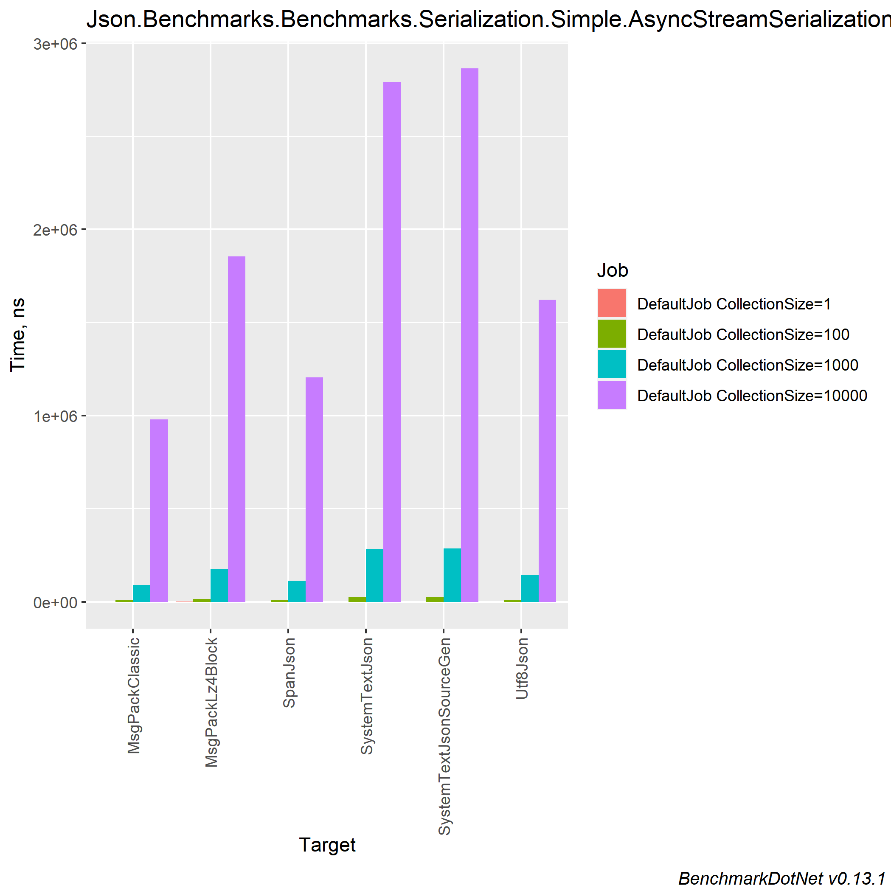
<a name="complex-model-serialization"></a>
## Complex Model

<a name="string-complex-serialization"></a>
### String
| Method                  | CollectionSize |           Mean |         Error |        StdDev |        StdErr |            Min |             Q1 |         Median |             Q3 |            Max |        Op/s | Ratio | RatioSD |      Gen 0 |     Gen 1 |    Gen 2 |  Allocated |
|-------------------------|----------------|---------------:|--------------:|--------------:|--------------:|---------------:|---------------:|---------------:|---------------:|---------------:|------------:|------:|--------:|-----------:|----------:|---------:|-----------:|
| SpanJson                | 1              |       6.105 μs |     0.0225 μs |     0.0176 μs |     0.0051 μs |       6.075 μs |       6.091 μs |       6.107 μs |       6.117 μs |       6.129 μs | 163,812.737 |  0.67 |    0.01 |     0.8163 |         - |        - |       3 KB |
| JsonSrcGen              | 1              |       6.348 μs |     0.0335 μs |     0.0297 μs |     0.0079 μs |       6.305 μs |       6.331 μs |       6.339 μs |       6.365 μs |       6.418 μs | 157,519.076 |  0.70 |    0.00 |     0.7019 |         - |        - |       3 KB |
| SystemTextJsonSourceGen | 1              |       7.290 μs |     0.0584 μs |     0.0518 μs |     0.0138 μs |       7.244 μs |       7.252 μs |       7.260 μs |       7.317 μs |       7.415 μs | 137,177.390 |  0.80 |    0.01 |     0.9155 |         - |        - |       4 KB |
| Jil                     | 1              |       7.825 μs |     0.0389 μs |     0.0325 μs |     0.0090 μs |       7.787 μs |       7.803 μs |       7.814 μs |       7.844 μs |       7.903 μs | 127,788.293 |  0.86 |    0.01 |     2.2430 |         - |        - |       9 KB |
| Utf8Json                | 1              |       7.889 μs |     0.0529 μs |     0.0469 μs |     0.0125 μs |       7.844 μs |       7.860 μs |       7.875 μs |       7.903 μs |       7.996 μs | 126,753.869 |  0.87 |    0.01 |     1.3123 |         - |        - |       5 KB |
| NetJson                 | 1              |       8.262 μs |     0.0495 μs |     0.0413 μs |     0.0115 μs |       8.206 μs |       8.229 μs |       8.257 μs |       8.306 μs |       8.329 μs | 121,034.203 |  0.91 |    0.01 |     2.2583 |         - |        - |       9 KB |
| SystemTextJson          | 1              |       9.077 μs |     0.0801 μs |     0.0710 μs |     0.0190 μs |       8.986 μs |       9.012 μs |       9.076 μs |       9.108 μs |       9.202 μs | 110,162.569 |  1.00 |    0.00 |     0.9308 |         - |        - |       4 KB |
| Maverick                | 1              |      10.392 μs |     0.0601 μs |     0.0502 μs |     0.0139 μs |      10.314 μs |      10.365 μs |      10.378 μs |      10.411 μs |      10.507 μs |  96,229.482 |  1.15 |    0.01 |     0.8850 |         - |        - |       4 KB |
| ServiceStack            | 1              |      17.949 μs |     0.1269 μs |     0.1125 μs |     0.0301 μs |      17.822 μs |      17.879 μs |      17.917 μs |      17.998 μs |      18.183 μs |  55,712.817 |  1.98 |    0.02 |     3.2654 |         - |        - |      13 KB |
| Newtonsoft              | 1              |      22.410 μs |     0.2053 μs |     0.1820 μs |     0.0486 μs |      22.093 μs |      22.312 μs |      22.394 μs |      22.485 μs |      22.739 μs |  44,623.393 |  2.47 |    0.02 |     3.9368 |         - |        - |      16 KB |
|                         |                |                |               |               |               |                |                |                |                |                |             |       |         |            |           |          |            |
| SpanJson                | 100            |     702.801 μs |     1.9214 μs |     1.7033 μs |     0.4552 μs |     700.708 μs |     701.412 μs |     702.375 μs |     703.898 μs |     705.967 μs |   1,422.879 |  0.71 |    0.00 |    66.4063 |   66.4063 |  66.4063 |     334 KB |
| JsonSrcGen              | 100            |     725.504 μs |     3.3819 μs |     2.9980 μs |     0.8012 μs |     720.559 μs |     723.420 μs |     724.860 μs |     728.011 μs |     730.929 μs |   1,378.351 |  0.74 |    0.00 |    66.4063 |   66.4063 |  66.4063 |     287 KB |
| SystemTextJsonSourceGen | 100            |     846.067 μs |     3.7202 μs |     3.1065 μs |     0.8616 μs |     840.089 μs |     845.052 μs |     845.463 μs |     848.430 μs |     851.562 μs |   1,181.940 |  0.86 |    0.00 |    77.1484 |   71.2891 |  71.2891 |     360 KB |
| Jil                     | 100            |     885.642 μs |    11.2893 μs |    10.5600 μs |     2.7266 μs |     867.346 μs |     880.738 μs |     886.092 μs |     891.517 μs |     905.007 μs |   1,129.124 |  0.90 |    0.01 |   164.0625 |  106.4453 |  66.4063 |     797 KB |
| Utf8Json                | 100            |     928.001 μs |     3.4173 μs |     3.0293 μs |     0.8096 μs |     922.502 μs |     926.340 μs |     928.490 μs |     929.529 μs |     933.196 μs |   1,077.585 |  0.94 |    0.00 |   167.9688 |  160.1563 | 160.1563 |     917 KB |
| SystemTextJson          | 100            |     983.954 μs |     3.1545 μs |     2.6341 μs |     0.7306 μs |     978.710 μs |     982.928 μs |     983.622 μs |     984.406 μs |     990.396 μs |   1,016.308 |  1.00 |    0.00 |    66.4063 |   66.4063 |  66.4063 |     335 KB |
| Maverick                | 100            |   1,107.775 μs |     7.9623 μs |     7.4479 μs |     1.9230 μs |   1,097.536 μs |   1,102.334 μs |   1,105.064 μs |   1,113.587 μs |   1,123.105 μs |     902.710 |  1.13 |    0.01 |    62.5000 |   62.5000 |  62.5000 |     338 KB |
| NetJson                 | 100            |   1,980.839 μs |    50.6089 μs |   149.2215 μs |    14.9222 μs |   1,404.359 μs |   1,909.255 μs |   2,000.982 μs |   2,086.476 μs |   2,184.423 μs |     504.837 |  1.86 |    0.22 |   214.8438 |   70.3125 |  70.3125 |     927 KB |
| ServiceStack            | 100            |   2,394.218 μs |    47.4276 μs |    73.8391 μs |    13.0530 μs |   2,254.422 μs |   2,333.576 μs |   2,422.188 μs |   2,444.069 μs |   2,512.049 μs |     417.673 |  2.41 |    0.08 |   316.4063 |   78.1250 |  78.1250 |   1,313 KB |
| Newtonsoft              | 100            |   2,770.963 μs |    53.1877 μs |   139.1829 μs |    15.5611 μs |   2,430.586 μs |   2,692.309 μs |   2,776.016 μs |   2,869.552 μs |   3,034.018 μs |     360.885 |  2.85 |    0.16 |   300.7813 |  164.0625 |  70.3125 |   1,451 KB |
|                         |                |                |               |               |               |                |                |                |                |                |             |       |         |            |           |          |            |
| SpanJson                | 1000           |   7,371.553 μs |    43.6630 μs |    40.8424 μs |    10.5455 μs |   7,309.109 μs |   7,343.458 μs |   7,360.705 μs |   7,406.367 μs |   7,444.998 μs |     135.657 |  0.71 |    0.00 |   218.7500 |  218.7500 | 218.7500 |   3,337 KB |
| JsonSrcGen              | 1000           |   7,508.340 μs |    41.0574 μs |    36.3963 μs |     9.7273 μs |   7,445.310 μs |   7,488.790 μs |   7,501.383 μs |   7,522.372 μs |   7,582.037 μs |     133.185 |  0.73 |    0.01 |   234.3750 |  234.3750 | 234.3750 |   2,871 KB |
| SystemTextJsonSourceGen | 1000           |   8,848.632 μs |    82.8188 μs |    73.4167 μs |    19.6214 μs |   8,737.786 μs |   8,788.330 μs |   8,851.323 μs |   8,881.663 μs |   9,022.392 μs |     113.012 |  0.85 |    0.01 |   281.2500 |  218.7500 | 218.7500 |   3,596 KB |
| Utf8Json                | 1000           |   9,574.721 μs |   146.4545 μs |   136.9936 μs |    35.3716 μs |   9,303.758 μs |   9,510.126 μs |   9,566.870 μs |   9,653.782 μs |   9,842.659 μs |     104.442 |  0.93 |    0.01 |  1046.8750 |  968.7500 | 968.7500 |   9,299 KB |
| SystemTextJson          | 1000           |  10,350.651 μs |    80.2127 μs |    66.9812 μs |    18.5772 μs |  10,251.400 μs |  10,320.527 μs |  10,330.284 μs |  10,388.945 μs |  10,470.747 μs |      96.612 |  1.00 |    0.00 |   281.2500 |  281.2500 | 281.2500 |   3,339 KB |
| Jil                     | 1000           |  11,038.392 μs |   220.4344 μs |   528.1469 μs |    64.0472 μs |  10,084.723 μs |  10,717.302 μs |  10,940.513 μs |  11,430.160 μs |  12,487.237 μs |      90.593 |  1.10 |    0.05 |  1203.1250 |  796.8750 | 375.0000 |   7,866 KB |
| Maverick                | 1000           |  11,634.170 μs |   175.1982 μs |   155.3086 μs |    41.5080 μs |  11,426.408 μs |  11,546.097 μs |  11,595.203 μs |  11,683.747 μs |  11,954.805 μs |      85.954 |  1.12 |    0.02 |   593.7500 |  453.1250 | 343.7500 |   4,793 KB |
| NetJson                 | 1000           |  14,833.662 μs |   193.2752 μs |   180.7897 μs |    46.6797 μs |  14,444.553 μs |  14,727.153 μs |  14,940.025 μs |  14,962.570 μs |  14,993.834 μs |      67.414 |  1.43 |    0.02 |  1890.6250 |  437.5000 | 437.5000 |   9,274 KB |
| ServiceStack            | 1000           |  22,595.352 μs |    76.5616 μs |    59.7743 μs |    17.2553 μs |  22,470.859 μs |  22,563.152 μs |  22,607.489 μs |  22,636.667 μs |  22,668.987 μs |      44.257 |  2.18 |    0.01 |  2750.0000 |  375.0000 | 375.0000 |  13,123 KB |
| Newtonsoft              | 1000           |  28,811.315 μs |   559.1400 μs |   523.0199 μs |   135.0432 μs |  28,021.491 μs |  28,357.983 μs |  28,900.866 μs |  29,102.675 μs |  29,956.497 μs |      34.709 |  2.79 |    0.05 |  2343.7500 |  937.5000 | 437.5000 |  14,404 KB |
|                         |                |                |               |               |               |                |                |                |                |                |             |       |         |            |           |          |            |
| SpanJson                | 10000          |  77,325.242 μs |   931.5332 μs |   825.7799 μs |   220.6990 μs |  76,361.886 μs |  76,865.789 μs |  76,980.707 μs |  77,492.739 μs |  79,375.029 μs |      12.932 |  0.67 |    0.01 |          - |         - |        - |  33,359 KB |
| JsonSrcGen              | 10000          |  78,277.016 μs |   532.4405 μs |   498.0451 μs |   128.5947 μs |  77,795.786 μs |  77,901.114 μs |  78,085.029 μs |  78,552.221 μs |  79,410.214 μs |      12.775 |  0.68 |    0.01 |          - |         - |        - |  28,698 KB |
| SystemTextJsonSourceGen | 10000          |  97,010.241 μs |   678.3523 μs |   634.5311 μs |   163.8352 μs |  96,193.700 μs |  96,431.983 μs |  97,024.100 μs |  97,377.367 μs |  98,081.533 μs |      10.308 |  0.84 |    0.01 |   500.0000 |         - |        - |  35,938 KB |
| NetJson                 | 10000          |  98,540.074 μs |   419.4734 μs |   371.8522 μs |    99.3817 μs |  97,814.967 μs |  98,268.492 μs |  98,614.125 μs |  98,822.533 μs |  99,100.133 μs |      10.148 |  0.85 |    0.01 | 14500.0000 |         - |        - |  92,733 KB |
| Jil                     | 10000          | 102,827.425 μs | 2,205.3555 μs | 6,467.9259 μs |   650.0510 μs |  93,199.700 μs |  96,353.550 μs | 104,191.100 μs | 107,269.600 μs | 118,635.500 μs |       9.725 |  0.90 |    0.06 |  7000.0000 | 2000.0000 |        - |  78,581 KB |
| SystemTextJson          | 10000          | 115,290.609 μs |   908.6041 μs |   758.7256 μs |   210.4326 μs | 114,221.860 μs | 114,679.280 μs | 115,359.160 μs | 115,668.200 μs | 117,037.280 μs |       8.674 |  1.00 |    0.00 |          - |         - |        - |  33,363 KB |
| Utf8Json                | 10000          | 120,793.874 μs | 1,053.3640 μs |   933.7798 μs |   249.5631 μs | 119,328.900 μs | 120,018.115 μs | 120,907.510 μs | 121,540.695 μs | 122,069.440 μs |       8.279 |  1.05 |    0.01 |  1000.0000 |  400.0000 | 400.0000 | 118,673 KB |
| Maverick                | 10000          | 128,438.984 μs | 2,557.1422 μs | 5,612.9892 μs |   737.0216 μs | 118,897.100 μs | 123,984.250 μs | 128,885.800 μs | 132,075.075 μs | 142,541.300 μs |       7.786 |  1.11 |    0.05 |  2000.0000 | 1000.0000 |        - |  50,281 KB |
| ServiceStack            | 10000          | 189,048.959 μs | 3,744.3993 μs | 5,488.4920 μs | 1,019.1874 μs | 181,568.500 μs | 184,310.200 μs | 189,292.700 μs | 191,978.100 μs | 201,403.200 μs |       5.290 |  1.65 |    0.06 | 23000.0000 |         - |        - | 131,225 KB |
| Newtonsoft              | 10000          | 258,177.150 μs | 4,959.2079 μs | 6,090.3527 μs | 1,298.4676 μs | 249,892.600 μs | 252,678.225 μs | 258,366.350 μs | 262,083.175 μs | 268,414.100 μs |       3.873 |  2.23 |    0.05 | 18000.0000 | 4000.0000 |        - | 143,955 KB |
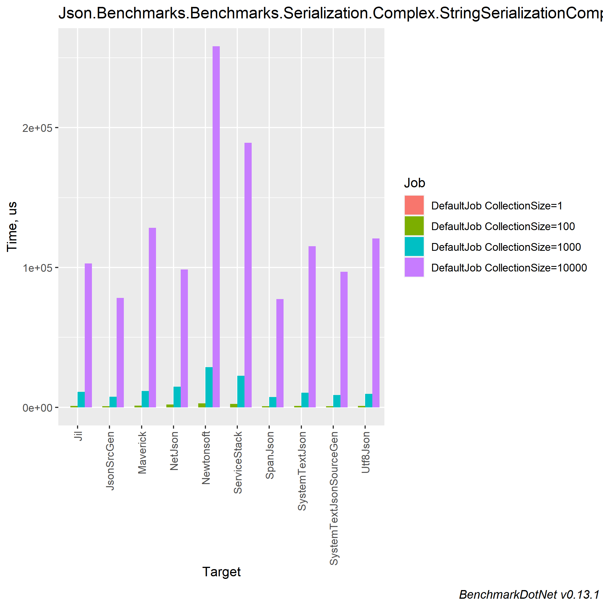
<a name="byte-complex-serialization"></a>
### Byte
| Method                  | CollectionSize |             Mean |           Error |          StdDev |        StdErr |              Min |               Q1 |           Median |               Q3 |              Max |          Op/s | Ratio | RatioSD |     Gen 0 |     Gen 1 |     Gen 2 |    Allocated |
|-------------------------|----------------|-----------------:|----------------:|----------------:|--------------:|-----------------:|-----------------:|-----------------:|-----------------:|-----------------:|--------------:|------:|--------:|----------:|----------:|----------:|-------------:|
| ZeroFormatter           | 1              |         784.3 ns |         8.21 ns |         7.28 ns |       1.94 ns |         775.0 ns |         778.2 ns |         784.3 ns |         787.6 ns |         799.9 ns | 1,274,965.206 |  0.09 |    0.00 |    0.4492 |         - |         - |      1,880 B |
| MsgPackClassic          | 1              |       1,573.4 ns |        23.35 ns |        21.84 ns |       5.64 ns |       1,548.1 ns |       1,558.0 ns |       1,564.3 ns |       1,583.4 ns |       1,619.3 ns |   635,546.622 |  0.17 |    0.00 |    0.2327 |         - |         - |        976 B |
| MsgPackLz4Block         | 1              |       3,714.1 ns |        58.67 ns |        45.81 ns |      13.22 ns |       3,666.8 ns |       3,685.1 ns |       3,699.3 ns |       3,730.5 ns |       3,821.2 ns |   269,244.811 |  0.41 |    0.00 |    0.2174 |         - |         - |        920 B |
| JsonSrcGen              | 1              |       6,115.8 ns |        31.41 ns |        26.23 ns |       7.27 ns |       6,085.5 ns |       6,098.2 ns |       6,107.8 ns |       6,125.5 ns |       6,161.0 ns |   163,510.595 |  0.68 |    0.01 |    0.4196 |         - |         - |      1,760 B |
| SpanJson                | 1              |       6,581.9 ns |        57.34 ns |        53.63 ns |      13.85 ns |       6,499.0 ns |       6,544.3 ns |       6,567.6 ns |       6,617.4 ns |       6,695.2 ns |   151,931.244 |  0.73 |    0.01 |    0.4120 |         - |         - |      1,744 B |
| SystemTextJsonSourceGen | 1              |       7,154.3 ns |        80.64 ns |        71.49 ns |      19.11 ns |       7,077.6 ns |       7,111.1 ns |       7,117.3 ns |       7,194.0 ns |       7,328.6 ns |   139,776.682 |  0.79 |    0.01 |    0.5112 |         - |         - |      2,152 B |
| Utf8Json                | 1              |       7,485.1 ns |       137.50 ns |       178.79 ns |      36.50 ns |       7,364.9 ns |       7,379.4 ns |       7,414.5 ns |       7,480.8 ns |       8,014.8 ns |   133,598.842 |  0.84 |    0.02 |    0.4883 |         - |         - |      2,072 B |
| SystemTextJson          | 1              |       9,004.7 ns |        65.28 ns |        57.87 ns |      15.47 ns |       8,894.1 ns |       8,975.6 ns |       8,994.7 ns |       9,042.0 ns |       9,120.8 ns |   111,053.380 |  1.00 |    0.00 |    0.5188 |         - |         - |      2,232 B |
|                         |                |                  |                 |                 |               |                  |                  |                  |                  |                  |               |       |         |           |           |           |              |
| ZeroFormatter           | 100            |     105,367.5 ns |     1,872.49 ns |     1,563.61 ns |     433.67 ns |     103,359.1 ns |     104,332.0 ns |     105,236.6 ns |     105,900.8 ns |     108,314.7 ns |     9,490.589 |  0.11 |    0.00 |   69.2139 |   32.2266 |   20.3857 |    337,334 B |
| MsgPackClassic          | 100            |     182,932.6 ns |     1,061.19 ns |       886.14 ns |     245.77 ns |     181,464.7 ns |     182,407.2 ns |     182,734.6 ns |     183,563.9 ns |     184,445.2 ns |     5,466.493 |  0.19 |    0.00 |   18.7988 |   18.7988 |   18.7988 |     94,359 B |
| MsgPackLz4Block         | 100            |     359,544.8 ns |     3,331.07 ns |     2,781.59 ns |     771.47 ns |     356,353.2 ns |     357,680.9 ns |     358,817.2 ns |     361,631.1 ns |     365,660.1 ns |     2,781.294 |  0.38 |    0.00 |   19.0430 |    3.4180 |         - |     80,648 B |
| JsonSrcGen              | 100            |     710,035.2 ns |     3,398.91 ns |     3,013.05 ns |     805.27 ns |     705,638.0 ns |     707,201.2 ns |     710,954.7 ns |     711,630.5 ns |     715,796.2 ns |     1,408.381 |  0.74 |    0.00 |   41.0156 |   35.1563 |   35.1563 |    173,500 B |
| SpanJson                | 100            |     734,860.8 ns |     5,596.86 ns |     4,961.47 ns |   1,326.01 ns |     727,732.4 ns |     732,759.4 ns |     733,089.4 ns |     735,347.3 ns |     743,716.0 ns |     1,360.802 |  0.77 |    0.01 |   37.1094 |   37.1094 |   37.1094 |    170,888 B |
| SystemTextJsonSourceGen | 100            |     799,515.4 ns |     3,279.86 ns |     2,738.83 ns |     759.62 ns |     796,521.8 ns |     797,577.5 ns |     798,685.9 ns |     800,708.7 ns |     805,608.8 ns |     1,250.758 |  0.84 |    0.01 |   45.8984 |   40.0391 |   40.0391 |    197,565 B |
| Utf8Json                | 100            |     869,213.6 ns |     4,632.48 ns |     4,333.22 ns |   1,118.83 ns |     863,793.8 ns |     865,714.0 ns |     869,121.7 ns |     872,001.7 ns |     878,783.8 ns |     1,150.465 |  0.91 |    0.01 |  119.1406 |  111.3281 |  111.3281 |    597,587 B |
| SystemTextJson          | 100            |     956,476.4 ns |     6,487.27 ns |     5,417.16 ns |   1,502.45 ns |     948,023.9 ns |     954,016.4 ns |     956,245.6 ns |     957,853.1 ns |     969,300.7 ns |     1,045.504 |  1.00 |    0.00 |   38.0859 |   38.0859 |   38.0859 |    171,475 B |
|                         |                |                  |                 |                 |               |                  |                  |                  |                  |                  |               |       |         |           |           |           |              |
| ZeroFormatter           | 1000           |   1,292,420.5 ns |    25,253.81 ns |    33,713.12 ns |   6,742.62 ns |   1,235,701.6 ns |   1,268,884.0 ns |   1,293,086.7 ns |   1,307,194.5 ns |   1,352,470.9 ns |       773.742 |  0.13 |    0.00 |  228.5156 |  199.2188 |  199.2188 |  2,854,522 B |
| MsgPackClassic          | 1000           |   1,970,134.0 ns |    33,834.15 ns |    29,993.09 ns |   8,015.99 ns |   1,933,352.0 ns |   1,951,292.1 ns |   1,965,239.3 ns |   1,988,146.5 ns |   2,041,405.5 ns |       507.580 |  0.20 |    0.00 |  109.3750 |  109.3750 |  109.3750 |    942,930 B |
| MsgPackLz4Block         | 1000           |   3,949,784.2 ns |    40,973.18 ns |    31,989.17 ns |   9,234.48 ns |   3,894,230.5 ns |   3,924,097.9 ns |   3,961,035.9 ns |   3,971,235.5 ns |   3,985,501.6 ns |       253.178 |  0.39 |    0.00 |   93.7500 |   93.7500 |   93.7500 |    804,363 B |
| SpanJson                | 1000           |   7,826,963.3 ns |   154,038.06 ns |   253,088.94 ns |  42,779.84 ns |   7,227,878.9 ns |   7,882,213.3 ns |   7,933,181.2 ns |   7,970,641.8 ns |   8,083,039.1 ns |       127.763 |  0.76 |    0.03 |  187.5000 |  187.5000 |  187.5000 |  1,708,392 B |
| JsonSrcGen              | 1000           |   8,173,284.3 ns |    86,679.64 ns |    76,839.24 ns |  20,536.15 ns |   8,054,031.2 ns |   8,113,225.8 ns |   8,174,751.6 ns |   8,223,871.5 ns |   8,285,132.8 ns |       122.350 |  0.81 |    0.01 |  234.3750 |  171.8750 |  171.8750 |  1,733,630 B |
| SystemTextJsonSourceGen | 1000           |   8,418,001.8 ns |    99,407.65 ns |    88,122.30 ns |  23,551.67 ns |   8,308,696.1 ns |   8,352,637.1 ns |   8,399,214.8 ns |   8,452,698.0 ns |   8,569,405.5 ns |       118.793 |  0.83 |    0.01 |  234.3750 |  171.8750 |  171.8750 |  1,972,946 B |
| Utf8Json                | 1000           |   9,275,657.8 ns |   102,758.84 ns |    96,120.68 ns |  24,818.25 ns |   9,103,020.3 ns |   9,220,715.6 ns |   9,266,073.4 ns |   9,335,118.8 ns |   9,465,001.6 ns |       107.809 |  0.92 |    0.01 |  734.3750 |  656.2500 |  656.2500 |  6,103,866 B |
| SystemTextJson          | 1000           |  10,087,989.8 ns |    76,436.43 ns |    67,758.90 ns |  18,109.33 ns |   9,982,384.4 ns |  10,029,084.0 ns |  10,103,578.1 ns |  10,120,590.2 ns |  10,206,575.0 ns |        99.128 |  1.00 |    0.00 |  171.8750 |  171.8750 |  171.8750 |  1,710,101 B |
|                         |                |                  |                 |                 |               |                  |                  |                  |                  |                  |               |       |         |           |           |           |              |
| ZeroFormatter           | 10000          |  14,566,211.2 ns |   287,921.94 ns |   661,548.53 ns |  83,347.28 ns |  13,376,340.6 ns |  14,045,129.7 ns |  14,563,371.9 ns |  15,114,950.0 ns |  16,105,831.2 ns |        68.652 |  0.12 |    0.00 |  468.7500 |  437.5000 |  437.5000 | 24,351,906 B |
| MsgPackClassic          | 10000          |  21,303,772.3 ns |   323,762.36 ns |   287,006.90 ns |  76,705.82 ns |  20,768,215.6 ns |  21,156,773.4 ns |  21,316,446.9 ns |  21,472,458.6 ns |  21,923,806.2 ns |        46.940 |  0.18 |    0.00 |  187.5000 |  187.5000 |  187.5000 |  9,427,828 B |
| MsgPackLz4Block         | 10000          |  41,879,893.9 ns |   688,684.60 ns |   644,196.00 ns | 166,330.69 ns |  40,782,050.0 ns |  41,520,116.7 ns |  41,865,300.0 ns |  42,204,308.3 ns |  43,208,666.7 ns |        23.878 |  0.35 |    0.01 |   83.3333 |   83.3333 |   83.3333 |  8,039,796 B |
| JsonSrcGen              | 10000          |  70,788,401.9 ns | 1,019,747.36 ns |   953,872.31 ns | 246,288.77 ns |  69,154,400.0 ns |  70,075,814.3 ns |  71,153,485.7 ns |  71,503,735.7 ns |  72,398,071.4 ns |        14.127 |  0.59 |    0.01 |  571.4286 |         - |         - | 17,332,507 B |
| SpanJson                | 10000          |  79,261,026.7 ns | 1,322,833.11 ns | 1,237,378.91 ns | 319,489.86 ns |  77,406,885.7 ns |  78,148,242.9 ns |  79,306,942.9 ns |  79,884,614.3 ns |  81,867,328.6 ns |        12.617 |  0.66 |    0.01 |         - |         - |         - | 17,082,577 B |
| SystemTextJsonSourceGen | 10000          | 100,773,397.1 ns | 1,016,226.51 ns |   900,858.33 ns | 240,764.52 ns |  99,455,440.0 ns | 100,044,130.0 ns | 100,836,210.0 ns | 101,423,175.0 ns | 102,181,100.0 ns |         9.923 |  0.84 |    0.01 |  600.0000 |         - |         - | 19,723,037 B |
| Utf8Json                | 10000          | 108,272,337.5 ns | 2,102,728.64 ns | 3,273,695.17 ns | 578,713.01 ns | 102,789,100.0 ns | 105,516,950.0 ns | 108,392,100.0 ns | 110,554,375.0 ns | 115,429,500.0 ns |         9.236 |  0.91 |    0.03 | 1000.0000 | 1000.0000 | 1000.0000 | 87,353,472 B |
| SystemTextJson          | 10000          | 119,428,050.0 ns |   997,335.85 ns |   884,112.26 ns | 236,288.94 ns | 118,205,460.0 ns | 118,754,585.0 ns | 119,396,010.0 ns | 120,171,910.0 ns | 120,904,220.0 ns |         8.373 |  1.00 |    0.00 |         - |         - |         - | 17,081,571 B |
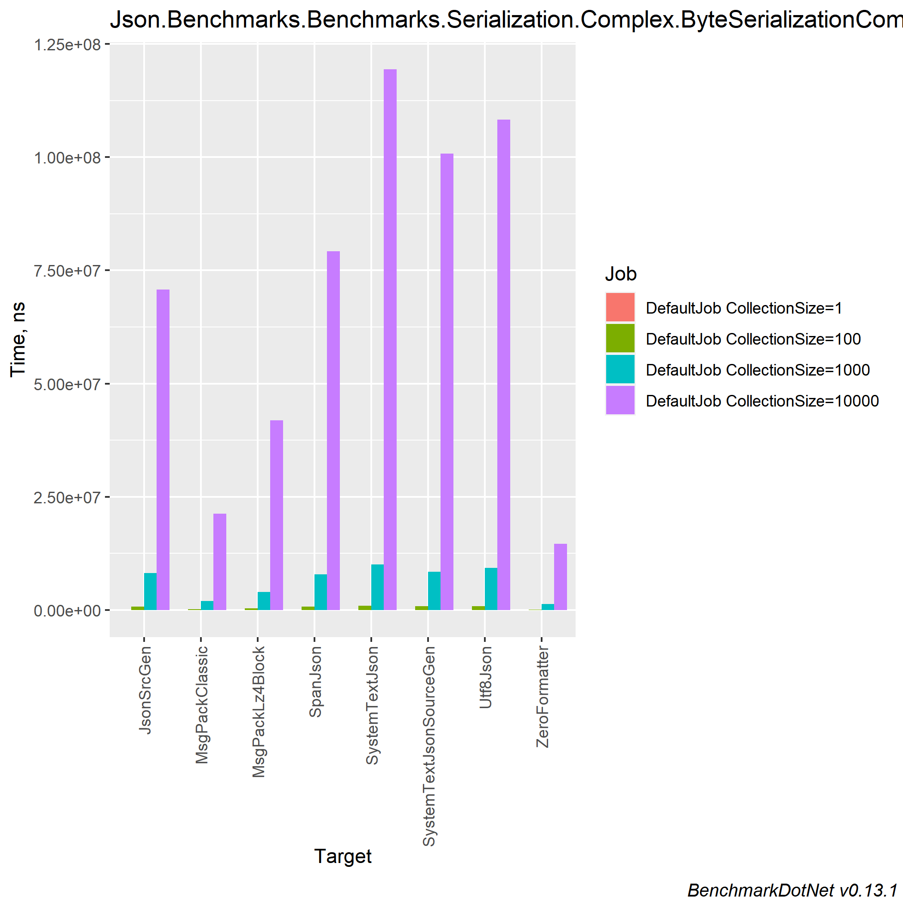
<a name="stream-complex-serialization"></a>
### Stream
| Method                  | CollectionSize |             Mean |           Error |          StdDev |          StdErr |           Median |              Min |               Q1 |               Q3 |              Max |          Op/s | Ratio | RatioSD |      Gen 0 |    Gen 1 |    Gen 2 |     Allocated |
|-------------------------|----------------|-----------------:|----------------:|----------------:|----------------:|-----------------:|-----------------:|-----------------:|-----------------:|-----------------:|--------------:|------:|--------:|-----------:|---------:|---------:|--------------:|
| ZeroFormatter           | 1              |         863.4 ns |         2.96 ns |         2.77 ns |         0.72 ns |         862.8 ns |         859.1 ns |         861.5 ns |         865.8 ns |         867.5 ns | 1,158,236.513 |  0.09 |    0.00 |     0.6523 |        - |        - |       2,728 B |
| MsgPackNoCompress       | 1              |       1,711.5 ns |        12.65 ns |        11.84 ns |         3.06 ns |       1,706.9 ns |       1,694.4 ns |       1,703.0 ns |       1,721.2 ns |       1,732.6 ns |   584,283.786 |  0.18 |    0.00 |     0.2460 |        - |        - |       1,032 B |
| MsgPackLz4Block         | 1              |       3,881.9 ns |        36.24 ns |        32.12 ns |         8.58 ns |       3,873.4 ns |       3,844.2 ns |       3,858.8 ns |       3,896.9 ns |       3,952.5 ns |   257,607.575 |  0.41 |    0.00 |     0.2289 |        - |        - |         976 B |
| SystemTextJsonSourceGen | 1              |       7,932.5 ns |        49.11 ns |        41.01 ns |        11.37 ns |       7,919.8 ns |       7,876.0 ns |       7,912.5 ns |       7,939.1 ns |       8,023.5 ns |   126,062.962 |  0.83 |    0.01 |     2.5177 |        - |        - |      10,592 B |
| SystemTextJson          | 1              |       9,533.1 ns |        61.61 ns |        51.45 ns |        14.27 ns |       9,531.6 ns |       9,449.6 ns |       9,498.9 ns |       9,561.4 ns |       9,649.5 ns |   104,898.001 |  1.00 |    0.00 |     1.7090 |        - |        - |       7,208 B |
| Maverick                | 1              |      10,107.4 ns |        55.77 ns |        49.44 ns |        13.21 ns |      10,105.3 ns |      10,025.4 ns |      10,076.9 ns |      10,116.7 ns |      10,206.6 ns |    98,937.814 |  1.06 |    0.01 |     0.4578 |        - |        - |       1,968 B |
| ServiceStack            | 1              |      19,392.8 ns |       146.71 ns |       122.51 ns |        33.98 ns |      19,375.4 ns |      19,190.8 ns |      19,348.8 ns |      19,479.7 ns |      19,575.6 ns |    51,565.588 |  2.03 |    0.02 |     4.4861 |        - |        - |      18,800 B |
|                         |                |                  |                 |                 |                 |                  |                  |                  |                  |                  |               |       |         |            |          |          |               |
| ZeroFormatter           | 100            |     190,057.0 ns |     4,641.38 ns |    13,465.48 ns |     1,367.21 ns |     188,449.7 ns |     165,472.0 ns |     181,200.3 ns |     198,647.7 ns |     219,995.6 ns |     5,261.581 |  0.18 |    0.01 |    85.4492 |  39.3066 |  21.2402 |     412,861 B |
| MsgPackNoCompress       | 100            |     192,362.4 ns |     1,106.83 ns |       981.17 ns |       262.23 ns |     192,314.8 ns |     190,826.6 ns |     191,595.6 ns |     193,034.6 ns |     194,285.8 ns |     5,198.520 |  0.18 |    0.00 |    54.6875 |  27.5879 |  27.5879 |     262,294 B |
| MsgPackLz4Block         | 100            |     378,819.9 ns |     1,878.80 ns |     1,665.51 ns |       445.13 ns |     378,576.6 ns |     376,533.2 ns |     377,477.5 ns |     380,010.9 ns |     382,028.7 ns |     2,639.777 |  0.36 |    0.00 |    40.0391 |  24.9023 |  24.9023 |     182,699 B |
| SystemTextJsonSourceGen | 100            |     856,778.8 ns |     2,233.48 ns |     1,979.92 ns |       529.16 ns |     856,773.7 ns |     853,838.5 ns |     855,585.9 ns |     857,554.4 ns |     860,908.9 ns |     1,167.162 |  0.80 |    0.00 |   108.3984 |  79.1016 |  75.1953 |     469,128 B |
| SystemTextJson          | 100            |   1,064,518.7 ns |     6,127.81 ns |     5,432.15 ns |     1,451.80 ns |   1,064,522.6 ns |   1,056,057.0 ns |   1,059,644.6 ns |   1,067,790.1 ns |   1,072,650.2 ns |       939.392 |  1.00 |    0.00 |   144.5313 | 117.1875 | 117.1875 |     694,006 B |
| Maverick                | 100            |   1,094,772.3 ns |     7,261.17 ns |     6,792.11 ns |     1,753.71 ns |   1,096,129.7 ns |   1,081,611.5 ns |   1,091,024.2 ns |   1,099,945.6 ns |   1,102,952.3 ns |       913.432 |  1.03 |    0.01 |   103.5156 |  74.2188 |  74.2188 |     519,624 B |
| ServiceStack            | 100            |   2,784,574.6 ns |    34,743.07 ns |    30,798.83 ns |     8,231.33 ns |   2,777,978.1 ns |   2,714,016.0 ns |   2,776,413.6 ns |   2,781,015.4 ns |   2,838,528.9 ns |       359.121 |  2.62 |    0.03 |   359.3750 | 121.0938 |  89.8438 |   1,530,763 B |
|                         |                |                  |                 |                 |                 |                  |                  |                  |                  |                  |               |       |         |            |          |          |               |
| ZeroFormatter           | 1000           |   1,519,598.9 ns |    63,780.22 ns |   177,793.76 ns |    18,741.11 ns |   1,486,480.1 ns |   1,176,486.3 ns |   1,412,813.3 ns |   1,604,435.4 ns |   2,079,491.8 ns |       658.068 |  0.15 |    0.02 |   238.2813 | 207.0313 | 207.0313 |   3,611,076 B |
| MsgPackNoCompress       | 1000           |   1,966,636.7 ns |    15,770.85 ns |    13,980.45 ns |     3,736.43 ns |   1,965,538.5 ns |   1,949,349.2 ns |   1,954,862.7 ns |   1,978,392.4 ns |   1,994,286.3 ns |       508.482 |  0.18 |    0.00 |   238.2813 | 210.9375 | 210.9375 |   2,326,077 B |
| MsgPackLz4Block         | 1000           |   3,834,052.5 ns |    13,051.01 ns |    11,569.38 ns |     3,092.05 ns |   3,830,695.7 ns |   3,818,098.4 ns |   3,827,875.9 ns |   3,836,985.6 ns |   3,860,750.0 ns |       260.821 |  0.35 |    0.00 |   214.8438 | 199.2188 | 199.2188 |   1,853,191 B |
| SystemTextJsonSourceGen | 1000           |   8,801,564.4 ns |    70,879.68 ns |    62,832.99 ns |    16,792.82 ns |   8,815,881.2 ns |   8,678,907.8 ns |   8,779,942.2 ns |   8,828,813.7 ns |   8,913,081.2 ns |       113.616 |  0.81 |    0.01 |   562.5000 | 484.3750 | 484.3750 |   3,790,524 B |
| SystemTextJson          | 1000           |  10,828,768.5 ns |    81,595.08 ns |    72,331.91 ns |    19,331.52 ns |  10,807,641.4 ns |  10,742,620.3 ns |  10,781,497.3 ns |  10,868,523.4 ns |  10,994,164.1 ns |        92.347 |  1.00 |    0.00 |   750.0000 | 734.3750 | 734.3750 |   6,104,388 B |
| Maverick                | 1000           |  11,088,400.0 ns |    60,469.45 ns |    56,563.16 ns |    14,604.54 ns |  11,100,626.6 ns |  10,966,040.6 ns |  11,053,295.3 ns |  11,122,823.4 ns |  11,165,173.4 ns |        90.184 |  1.02 |    0.01 |   515.6250 | 484.3750 | 484.3750 |   4,182,416 B |
| ServiceStack            | 1000           |  26,345,980.3 ns |   174,089.57 ns |   145,372.68 ns |    40,319.13 ns |  26,382,946.9 ns |  25,896,462.5 ns |  26,331,590.6 ns |  26,406,925.0 ns |  26,469,500.0 ns |        37.956 |  2.43 |    0.03 |  2968.7500 | 593.7500 | 562.5000 |  14,217,086 B |
|                         |                |                  |                 |                 |                 |                  |                  |                  |                  |                  |               |       |         |            |          |          |               |
| ZeroFormatter           | 10000          |  16,709,999.4 ns |   371,867.37 ns | 1,096,459.32 ns |   109,645.93 ns |  16,789,796.9 ns |  13,431,178.1 ns |  16,019,734.4 ns |  17,437,395.3 ns |  19,230,956.2 ns |        59.844 |  0.15 |    0.01 |   500.0000 | 468.7500 | 468.7500 |  31,926,144 B |
| MsgPackNoCompress       | 10000          |  20,818,877.7 ns |   211,143.24 ns |   197,503.52 ns |    50,995.19 ns |  20,863,375.0 ns |  20,470,715.6 ns |  20,677,532.8 ns |  20,951,467.2 ns |  21,070,237.5 ns |        48.033 |  0.19 |    0.01 |   312.5000 | 312.5000 | 312.5000 |  18,830,837 B |
| MsgPackLz4Block         | 10000          |  41,739,345.6 ns |   269,213.54 ns |   251,822.51 ns |    65,020.29 ns |  41,684,333.3 ns |  41,367,975.0 ns |  41,537,762.5 ns |  41,985,916.7 ns |  42,150,425.0 ns |        23.958 |  0.37 |    0.01 |   416.6667 | 416.6667 | 416.6667 |  30,725,369 B |
| SystemTextJsonSourceGen | 10000          |  97,906,786.4 ns | 1,903,084.01 ns | 2,337,158.07 ns |   498,283.78 ns |  98,328,491.7 ns |  93,153,083.3 ns |  97,502,012.5 ns |  99,211,341.7 ns | 101,775,183.3 ns |        10.214 |  0.88 |    0.03 |  1000.0000 | 500.0000 | 500.0000 |  58,645,380 B |
| SystemTextJson          | 10000          | 111,676,232.4 ns | 2,171,377.63 ns | 3,182,777.18 ns |   591,026.89 ns | 109,776,920.0 ns | 108,415,400.0 ns | 109,287,740.0 ns | 115,742,560.0 ns | 117,265,820.0 ns |         8.954 |  1.00 |    0.00 |   400.0000 | 400.0000 | 400.0000 |  52,565,061 B |
| Maverick                | 10000          | 115,430,413.3 ns | 2,283,940.86 ns | 2,136,399.70 ns |   551,616.03 ns | 115,160,200.0 ns | 111,900,200.0 ns | 113,898,100.0 ns | 117,132,350.0 ns | 118,498,800.0 ns |         8.663 |  1.03 |    0.03 |          - |        - |        - |  66,958,816 B |
| ServiceStack            | 10000          | 206,347,175.0 ns | 4,124,690.87 ns | 4,750,000.14 ns | 1,062,132.32 ns | 203,706,100.0 ns | 200,731,200.0 ns | 202,402,975.0 ns | 211,307,125.0 ns | 214,694,100.0 ns |         4.846 |  1.84 |    0.07 | 23000.0000 |        - |        - | 167,276,672 B |
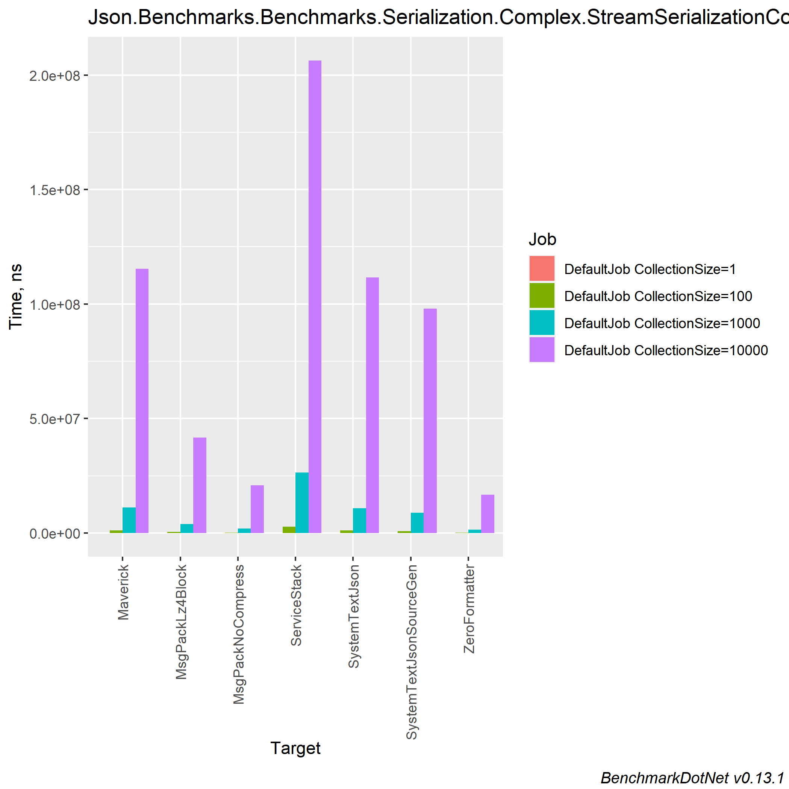
<a name="async-stream-complex-serialization"></a>
### Async Stream
| Method                  | CollectionSize |           Mean |         Error |        StdDev |      StdErr |            Min |             Q1 |         Median |             Q3 |            Max |        Op/s | Ratio | RatioSD |     Gen 0 |     Gen 1 |     Gen 2 | Allocated |
|-------------------------|----------------|---------------:|--------------:|--------------:|------------:|---------------:|---------------:|---------------:|---------------:|---------------:|------------:|------:|--------:|----------:|----------:|----------:|----------:|
| MsgPackClassic          | 1              |       1.884 μs |     0.0115 μs |     0.0108 μs |   0.0028 μs |       1.866 μs |       1.878 μs |       1.885 μs |       1.891 μs |       1.905 μs | 530,663.315 |  0.20 |    0.00 |    0.2632 |         - |         - |      1 KB |
| MsgPackLz4Block         | 1              |       4.012 μs |     0.0330 μs |     0.0276 μs |   0.0076 μs |       3.980 μs |       3.992 μs |       4.002 μs |       4.039 μs |       4.052 μs | 249,248.668 |  0.42 |    0.01 |    0.2441 |         - |         - |      1 KB |
| SpanJson                | 1              |       6.530 μs |     0.0305 μs |     0.0271 μs |   0.0072 μs |       6.483 μs |       6.510 μs |       6.527 μs |       6.550 μs |       6.576 μs | 153,145.596 |  0.69 |    0.01 |    0.4425 |         - |         - |      2 KB |
| Utf8Json                | 1              |       7.647 μs |     0.0623 μs |     0.0552 μs |   0.0147 μs |       7.577 μs |       7.597 μs |       7.637 μs |       7.703 μs |       7.733 μs | 130,767.472 |  0.81 |    0.01 |    0.5188 |         - |         - |      2 KB |
| SystemTextJson          | 1              |       9.450 μs |     0.0889 μs |     0.0831 μs |   0.0215 μs |       9.296 μs |       9.402 μs |       9.438 μs |       9.498 μs |       9.640 μs | 105,823.841 |  1.00 |    0.00 |    0.5493 |         - |         - |      2 KB |
| SystemTextJsonSourceGen | 1              |       9.919 μs |     0.0385 μs |     0.0321 μs |   0.0089 μs |       9.874 μs |       9.898 μs |       9.908 μs |       9.939 μs |       9.986 μs | 100,812.170 |  1.05 |    0.01 |    0.5646 |         - |         - |      2 KB |
|                         |                |                |               |               |             |                |                |                |                |                |             |       |         |           |           |           |           |
| MsgPackClassic          | 100            |     192.035 μs |     0.7789 μs |     0.6081 μs |   0.1755 μs |     190.979 μs |     191.588 μs |     192.057 μs |     192.461 μs |     192.926 μs |   5,207.376 |  0.19 |    0.00 |   55.1758 |   28.5645 |   27.8320 |    256 KB |
| MsgPackLz4Block         | 100            |     378.441 μs |     1.9901 μs |     1.7642 μs |   0.4715 μs |     376.693 μs |     377.068 μs |     378.045 μs |     379.292 μs |     383.141 μs |   2,642.420 |  0.38 |    0.00 |   40.0391 |   25.3906 |   24.9023 |    178 KB |
| SpanJson                | 100            |     713.321 μs |     1.7420 μs |     1.4546 μs |   0.4034 μs |     710.503 μs |     712.841 μs |     713.689 μs |     714.306 μs |     715.414 μs |   1,401.894 |  0.72 |    0.01 |   38.0859 |   38.0859 |   38.0859 |    167 KB |
| Utf8Json                | 100            |     875.665 μs |     4.8526 μs |     4.3017 μs |   1.1497 μs |     867.567 μs |     873.970 μs |     875.331 μs |     877.568 μs |     884.982 μs |   1,141.990 |  0.89 |    0.01 |  119.1406 |  111.3281 |  111.3281 |    583 KB |
| SystemTextJson          | 100            |     988.235 μs |     9.7932 μs |     8.6814 μs |   2.3202 μs |     977.973 μs |     981.531 μs |     986.037 μs |     991.825 μs |   1,007.578 μs |   1,011.905 |  1.00 |    0.00 |   99.6094 |   76.1719 |   76.1719 |    449 KB |
| SystemTextJsonSourceGen | 100            |     993.734 μs |     5.5584 μs |     4.9274 μs |   1.3169 μs |     983.610 μs |     990.307 μs |     995.129 μs |     996.275 μs |   1,001.231 μs |   1,006.306 |  1.01 |    0.01 |  103.5156 |   80.0781 |   80.0781 |    450 KB |
|                         |                |                |               |               |             |                |                |                |                |                |             |       |         |           |           |           |           |
| MsgPackClassic          | 1000           |   1,947.053 μs |    25.4849 μs |    23.8386 μs |   6.1551 μs |   1,917.499 μs |   1,929.150 μs |   1,944.263 μs |   1,963.154 μs |   2,005.759 μs |     513.597 |  0.20 |    0.00 |  238.2813 |  214.8438 |  210.9375 |  2,273 KB |
| MsgPackLz4Block         | 1000           |   4,000.512 μs |    35.1663 μs |    31.1740 μs |   8.3316 μs |   3,939.676 μs |   3,980.745 μs |   4,002.808 μs |   4,014.335 μs |   4,054.070 μs |     249.968 |  0.40 |    0.00 |  210.9375 |  195.3125 |  195.3125 |  1,810 KB |
| SpanJson                | 1000           |   7,226.861 μs |    20.6550 μs |    19.3207 μs |   4.9886 μs |   7,202.913 μs |   7,211.114 μs |   7,220.350 μs |   7,238.011 μs |   7,262.809 μs |     138.373 |  0.73 |    0.00 |  179.6875 |  179.6875 |  179.6875 |  1,670 KB |
| Utf8Json                | 1000           |   8,895.726 μs |    65.9609 μs |    58.4726 μs |  15.6275 μs |   8,798.114 μs |   8,860.111 μs |   8,888.603 μs |   8,933.486 μs |   8,994.663 μs |     112.414 |  0.90 |    0.01 |  765.6250 |  687.5000 |  687.5000 |  5,962 KB |
| SystemTextJsonSourceGen | 1000           |   9,883.265 μs |    74.9354 μs |    70.0946 μs |  18.0984 μs |   9,771.936 μs |   9,841.510 μs |   9,877.497 μs |   9,917.820 μs |  10,000.625 μs |     101.181 |  1.00 |    0.01 |  500.0000 |  484.3750 |  484.3750 |  3,690 KB |
| SystemTextJson          | 1000           |   9,921.196 μs |    69.6673 μs |    61.7583 μs |  16.5056 μs |   9,770.950 μs |   9,919.260 μs |   9,937.932 μs |   9,965.657 μs |   9,977.200 μs |     100.794 |  1.00 |    0.00 |  500.0000 |  484.3750 |  484.3750 |  3,681 KB |
|                         |                |                |               |               |             |                |                |                |                |                |             |       |         |           |           |           |           |
| MsgPackClassic          | 10000          |  27,226.241 μs |   521.1469 μs | 1,076.2587 μs | 149.2502 μs |  25,293.597 μs |  26,529.266 μs |  27,402.256 μs |  27,974.688 μs |  30,102.263 μs |      36.729 |  0.23 |    0.01 |  468.7500 |  468.7500 |  468.7500 | 36,794 KB |
| MsgPackLz4Block         | 10000          |  45,913.671 μs |   900.2907 μs |   842.1325 μs | 217.4377 μs |  44,658.260 μs |  45,255.390 μs |  46,058.250 μs |  46,382.265 μs |  47,555.840 μs |      21.780 |  0.39 |    0.01 |  400.0000 |  400.0000 |  400.0000 | 29,985 KB |
| SpanJson                | 10000          |  77,334.139 μs | 1,278.8902 μs | 1,196.2747 μs | 308.8768 μs |  75,913.929 μs |  76,208.157 μs |  77,231.271 μs |  78,260.950 μs |  79,601.600 μs |      12.931 |  0.65 |    0.01 |         - |         - |         - | 16,682 KB |
| Utf8Json                | 10000          | 110,359.182 μs | 2,160.6834 μs | 3,167.1017 μs | 588.1160 μs | 105,321.040 μs | 106,905.920 μs | 111,527.940 μs | 112,693.200 μs | 114,723.680 μs |       9.061 |  0.93 |    0.03 | 1600.0000 | 1000.0000 | 1000.0000 | 85,307 KB |
| SystemTextJsonSourceGen | 10000          | 117,840.268 μs | 1,739.4272 μs | 1,627.0613 μs | 420.1054 μs | 114,357.860 μs | 116,811.290 μs | 118,239.060 μs | 118,944.630 μs | 120,308.400 μs |       8.486 |  0.99 |    0.02 |  400.0000 |  400.0000 |  400.0000 | 59,223 KB |
| SystemTextJson          | 10000          | 118,762.563 μs | 1,641.8328 μs | 1,455.4420 μs | 388.9832 μs | 116,591.040 μs | 118,111.905 μs | 118,353.260 μs | 119,859.695 μs | 121,610.180 μs |       8.420 |  1.00 |    0.00 |  400.0000 |  400.0000 |  400.0000 | 59,143 KB |
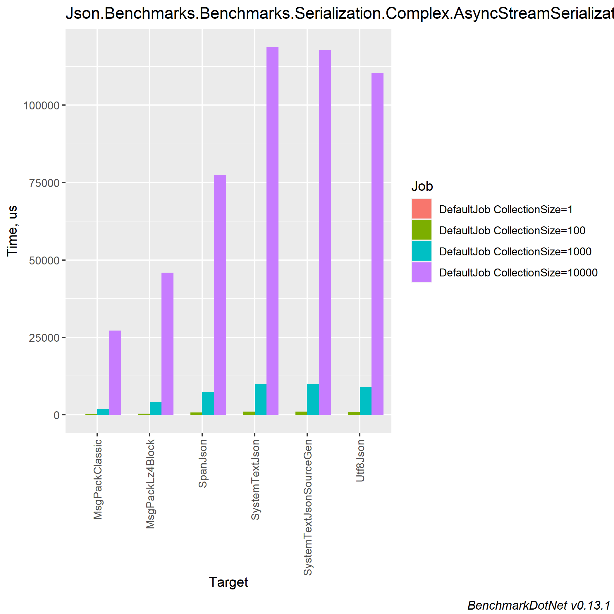
<a name="conclusions"></a>
## Conclusions

Personally I will recommend using `SpanJson`. It has clean api and no additional overhead.
The two fastest are `MessagePack` and `Protobuf`, but they come with cost of compatibility with other serializers and have extraordinary API. (Because they are binary serializers).

As for `JsonSrcGen`, it has major drawbacks as `[assembly]` writing in `Program.cs` and no support for critical collections as Dictionary with int key and Enums. Do not recommend to use for now.

`SpanJson` is good at combining with `System.Text.Json` or `Newtonsoft.Json`, so consider using it in your project