# Comparing different libraries for Json Serialization/Deserialization

### Table of contents
- [Machine information](#machine-information)
- [Sources](#sources)
- [Benchmark results](#benchmark-results)
  * [Deserialization](#deserialization)
    * [Simple Model](#simple-model-deserialization)
      * [String](#string-simple-deserialization)
      * [Bytes](#bytes-simple-deserialization)
      * [Stream](#stream-simple-deserialization)
      * [Asynchronous stream](#async-stream-simple-deserialization)
    * [Complex Model](#complex-model-deserialization)
      * [String](#string-complex-deserialization)
      * [Bytes](#bytes-complex-deserialization)
      * [Stream](#stream-complex-deserialization)
      * [Async stream](#async-stream-complex-deserialization)
  * [Serialization](#serialization)
    * [Simple Model](#simple-model-serialization)
      * [String](#string-simple-serialization)
      * [Bytes](#bytes-simple-serialization)
      * [Stream](#stream-simple-serialization)
      * [Asynchronous stream](#async-stream-simple-serialization)
    * [Complex Model](#complex-model-serialization)
      * [String](#string-complex-serialization)
      * [Bytes](#bytes-complex-serialization)
      * [Stream](#stream-complex-serialization)
      * [Async stream](#async-stream-complex-serialization)
- [Conclusions](#conclusions)

<a name="machine-information"></a>
## Machine Information

``` ini
BenchmarkDotNet=v0.13.1, OS=Windows 10.0.22621
Intel Core i7-8550U CPU 1.80GHz (Kaby Lake R), 1 CPU, 8 logical and 4 physical cores
.NET SDK=6.0.202
  [Host]     : .NET 6.0.4 (6.0.422.16404), X64 RyuJIT
  DefaultJob : .NET 6.0.4 (6.0.422.16404), X64 RyuJIT
```
<a name="sources"></a>
## Sources

Currently, following Json Serialization/Deserialization libraries were used:

- MaverickJson : https://github.com/zlatanov/json
- ServiceStack : https://github.com/ServiceStack/ServiceStack
- SpanJson : https://github.com/Tornhoof/SpanJson
- MsgPack : https://github.com/neuecc/MessagePack-CSharp
- Jil : https://github.com/kevin-montrose/Jil
- Utf8Json : https://github.com/neuecc/Utf8Json
- Newtonsoft.Json : https://github.com/JamesNK/Newtonsoft.Json
- Protobuf.Net : https://github.com/protobuf-net/protobuf-net
- JsonSrcGen : https://github.com/trampster/JsonSrcGen **NOTE** Does not support TimeSpan and Enum.
- NETJson : https://github.com/rpgmaker/NetJSON **NOTE** Camelcase troubles (issue with developer created).
- ZeroFormatter : https://github.com/alexinea/Alexinea.ZeroFormatter/ (fork with fixes) **Note** This library is no longer supported, so i use this fork with fixes.

<a name="benchmark-results"></a>
# Benchmark results

<a name="deserialization"></a>
## Deserialization

<a name="simple-model-deserialization"></a>
## Simple Model

<a name="string-simple-deserialization"></a>
### String
| Method                  | Count |            Mean |         Error |        StdDev |       StdErr |         Op/s |   Allocated |
|-------------------------|-------|----------------:|--------------:|--------------:|-------------:|-------------:|------------:|
| JsonSrcGen              | 1     |        155.9 ns |       1.12 ns |       0.99 ns |      0.26 ns | 6,412,419.91 |       120 B |
| SpanJson                | 1     |        261.2 ns |       3.86 ns |       3.01 ns |      0.87 ns | 3,828,061.49 |       112 B |
| Utf8Json                | 1     |        369.0 ns |       3.64 ns |       3.41 ns |      0.88 ns | 2,709,826.87 |       280 B |
| Jil                     | 1     |        398.9 ns |       3.53 ns |       2.95 ns |      0.82 ns | 2,506,762.35 |       264 B |
| NetJson                 | 1     |        493.1 ns |       5.38 ns |       4.77 ns |      1.27 ns | 2,027,893.50 |       352 B |
| SystemTextJson          | 1     |        715.7 ns |       3.74 ns |       3.12 ns |      0.87 ns | 1,397,175.10 |       584 B |
| SystemTextJsonSourceGen | 1     |        760.8 ns |       8.31 ns |       7.37 ns |      1.97 ns | 1,314,328.15 |       584 B |
| ServiceStack            | 1     |        869.1 ns |       5.11 ns |       4.26 ns |      1.18 ns | 1,150,652.96 |       600 B |
| Maverick                | 1     |        988.1 ns |      19.47 ns |      18.22 ns |      4.70 ns | 1,012,025.75 |       480 B |
| Newtonsoft              | 1     |      1,621.0 ns |      17.12 ns |      16.01 ns |      4.13 ns |   616,896.95 |     3,032 B |
|                         |       |                 |               |               |              |              |             |
| JsonSrcGen              | 100   |     16,112.2 ns |     271.55 ns |     254.01 ns |     65.58 ns |    62,064.65 |     9,104 B |
| SpanJson                | 100   |     16,603.3 ns |     233.82 ns |     218.72 ns |     56.47 ns |    60,228.91 |     9,264 B |
| Utf8Json                | 100   |     26,053.3 ns |     161.29 ns |     142.98 ns |     38.21 ns |    38,382.79 |    17,400 B |
| Jil                     | 100   |     29,908.2 ns |     342.27 ns |     285.81 ns |     79.27 ns |    33,435.65 |    10,776 B |
| SystemTextJson          | 100   |     47,292.9 ns |     390.46 ns |     365.23 ns |     94.30 ns |    21,144.81 |    10,960 B |
| NetJson                 | 100   |     47,610.3 ns |     266.34 ns |     236.10 ns |     63.10 ns |    21,003.86 |    27,920 B |
| SystemTextJsonSourceGen | 100   |     49,804.8 ns |     250.39 ns |     221.96 ns |     59.32 ns |    20,078.37 |    11,080 B |
| ServiceStack            | 100   |     64,154.6 ns |     692.44 ns |     613.83 ns |    164.05 ns |    15,587.35 |    17,376 B |
| Maverick                | 100   |     68,435.2 ns |     621.84 ns |     581.67 ns |    150.19 ns |    14,612.36 |    11,152 B |
| Newtonsoft              | 100   |    104,932.9 ns |   1,639.89 ns |   1,280.32 ns |    369.60 ns |     9,529.90 |    20,336 B |
|                         |       |                 |               |               |              |              |             |
| JsonSrcGen              | 1000  |    158,625.5 ns |   1,395.08 ns |   1,164.95 ns |    323.10 ns |     6,304.16 |    92,144 B |
| SpanJson                | 1000  |    163,113.8 ns |     939.49 ns |     832.84 ns |    222.58 ns |     6,130.69 |    92,161 B |
| Utf8Json                | 1000  |    259,676.6 ns |   3,162.79 ns |   2,469.30 ns |    712.82 ns |     3,850.94 |   169,976 B |
| Jil                     | 1000  |    293,414.4 ns |   1,834.24 ns |   1,626.01 ns |    434.57 ns |     3,408.15 |   100,720 B |
| NetJson                 | 1000  |    476,806.7 ns |   1,556.61 ns |   1,379.89 ns |    368.79 ns |     2,097.29 |   274,969 B |
| SystemTextJson          | 1000  |    498,105.5 ns |   6,067.66 ns |   5,378.82 ns |  1,437.55 ns |     2,007.61 |   101,129 B |
| SystemTextJsonSourceGen | 1000  |    515,339.2 ns |   7,646.80 ns |   7,152.82 ns |  1,846.85 ns |     1,940.47 |   101,033 B |
| ServiceStack            | 1000  |    642,993.5 ns |   5,593.54 ns |   5,232.20 ns |  1,350.95 ns |     1,555.23 |   164,705 B |
| Maverick                | 1000  |    720,801.8 ns |  12,511.74 ns |  11,091.34 ns |  2,964.28 ns |     1,387.34 |   102,449 B |
| Newtonsoft              | 1000  |  1,011,399.6 ns |  11,880.67 ns |  10,531.90 ns |  2,814.77 ns |       988.73 |   153,633 B |
|                         |       |                 |               |               |              |              |             |
| JsonSrcGen              | 10000 |  1,791,153.2 ns |  21,562.04 ns |  19,114.19 ns |  5,108.48 ns |       558.30 |   920,249 B |
| SpanJson                | 10000 |  1,869,030.3 ns |  19,494.87 ns |  16,279.10 ns |  4,515.01 ns |       535.04 |   920,738 B |
| Jil                     | 10000 |  3,969,853.1 ns |  50,195.51 ns |  46,952.92 ns | 12,123.19 ns |       251.90 | 1,102,872 B |
| Utf8Json                | 10000 |  4,102,512.5 ns |  80,279.92 ns | 150,785.15 ns | 22,731.72 ns |       243.75 | 1,793,955 B |
| SystemTextJson          | 10000 |  5,873,927.9 ns |  96,229.46 ns |  90,013.09 ns | 23,241.28 ns |       170.24 | 1,795,168 B |
| SystemTextJsonSourceGen | 10000 |  5,974,756.0 ns |  60,770.69 ns |  56,844.94 ns | 14,677.30 ns |       167.37 | 1,793,546 B |
| NetJson                 | 10000 |  6,728,060.8 ns |  12,199.51 ns |  10,187.14 ns |  2,825.40 ns |       148.63 | 2,841,115 B |
| Maverick                | 10000 |  8,525,475.6 ns | 161,570.95 ns | 179,585.69 ns | 41,199.78 ns |       117.30 | 1,547,385 B |
| ServiceStack            | 10000 |  9,075,525.9 ns |  99,487.18 ns |  93,060.37 ns | 24,028.08 ns |       110.19 | 1,743,036 B |
| Newtonsoft              | 10000 | 12,370,230.3 ns | 198,311.11 ns | 185,500.34 ns | 47,895.98 ns |        80.84 | 1,587,084 B |

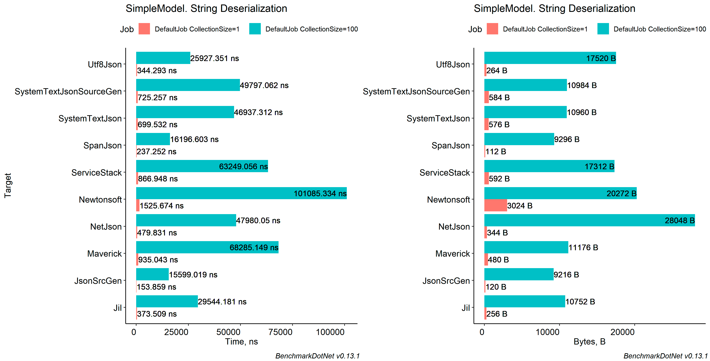

<a name="byte-simple-deserialization"></a>
### Byte
| Method                  | Count |            Mean |          Error |         StdDev |        StdErr |         Op/s |   Allocated |
|-------------------------|-------|----------------:|---------------:|---------------:|--------------:|-------------:|------------:|
| ZeroFormatter           | 1     |        90.01 ns |       1.279 ns |       1.196 ns |      0.309 ns | 11,110,098.2 |       280 B |
| JsonSrcGen              | 1     |       206.87 ns |       1.469 ns |       1.303 ns |      0.348 ns |  4,833,959.5 |       256 B |
| MsgPackClassic          | 1     |       242.21 ns |       2.620 ns |       2.046 ns |      0.591 ns |  4,128,665.7 |       144 B |
| SpanJson                | 1     |       279.45 ns |       3.461 ns |       2.890 ns |      0.802 ns |  3,578,472.0 |       112 B |
| Utf8Json                | 1     |       310.21 ns |       3.281 ns |       2.908 ns |      0.777 ns |  3,223,645.2 |       176 B |
| MsgPackLz4              | 1     |       329.09 ns |       2.826 ns |       2.643 ns |      0.682 ns |  3,038,656.9 |       144 B |
| Jil                     | 1     |       442.16 ns |       8.084 ns |       6.750 ns |      1.872 ns |  2,261,599.8 |       440 B |
| Protobuf                | 1     |       647.38 ns |       6.102 ns |       5.707 ns |      1.474 ns |  1,544,688.2 |       200 B |
| SystemTextJson          | 1     |       648.07 ns |       5.717 ns |       5.068 ns |      1.355 ns |  1,543,035.8 |       576 B |
| SystemTextJsonSourceGen | 1     |       696.96 ns |       5.144 ns |       4.560 ns |      1.219 ns |  1,434,807.6 |       576 B |
| Maverick                | 1     |       857.76 ns |      11.005 ns |       9.755 ns |      2.607 ns |  1,165,825.5 |       296 B |
|                         |       |                 |                |                |               |              |             |
| ZeroFormatter           | 100   |     6,570.75 ns |      71.353 ns |      59.583 ns |     16.525 ns |    152,189.7 |    22,456 B |
| Protobuf                | 100   |    13,515.56 ns |      40.188 ns |      31.376 ns |      9.057 ns |     73,988.8 |     9,264 B |
| MsgPackClassic          | 100   |    16,052.50 ns |     178.376 ns |     166.853 ns |     43.081 ns |     62,295.6 |     9,272 B |
| MsgPackLz4              | 100   |    17,786.45 ns |     136.005 ns |     113.571 ns |     31.499 ns |     56,222.6 |     9,256 B |
| SpanJson                | 100   |    18,022.15 ns |     107.553 ns |     100.605 ns |     25.976 ns |     55,487.3 |     9,288 B |
| JsonSrcGen              | 100   |    21,212.41 ns |     421.944 ns |     374.042 ns |     99.967 ns |     47,142.2 |    23,008 B |
| Utf8Json                | 100   |    24,852.10 ns |     238.033 ns |     222.657 ns |     57.490 ns |     40,238.0 |    10,696 B |
| Jil                     | 100   |    28,496.08 ns |     142.774 ns |     133.551 ns |     34.483 ns |     35,092.5 |    24,496 B |
| SystemTextJson          | 100   |    46,989.00 ns |     326.355 ns |     289.305 ns |     77.320 ns |     21,281.6 |    11,064 B |
| SystemTextJsonSourceGen | 100   |    48,446.32 ns |     296.335 ns |     247.453 ns |     68.631 ns |     20,641.4 |    11,032 B |
| Maverick                | 100   |    66,919.18 ns |     899.673 ns |     797.536 ns |    213.151 ns |     14,943.4 |    10,713 B |
|                         |       |                 |                |                |               |              |             |
| ZeroFormatter           | 1000  |    81,253.67 ns |   1,175.570 ns |     981.654 ns |    272.262 ns |     12,307.1 |   224,056 B |
| Protobuf                | 1000  |   130,821.87 ns |     609.924 ns |     509.314 ns |    141.258 ns |      7,644.0 |    92,144 B |
| MsgPackClassic          | 1000  |   161,545.59 ns |   1,541.557 ns |   1,441.974 ns |    372.316 ns |      6,190.2 |    92,296 B |
| SpanJson                | 1000  |   179,027.43 ns |   1,119.006 ns |   1,046.719 ns |    270.262 ns |      5,585.7 |    92,080 B |
| MsgPackLz4              | 1000  |   179,817.41 ns |   1,376.154 ns |   1,219.925 ns |    326.039 ns |      5,561.2 |    91,800 B |
| JsonSrcGen              | 1000  |   227,994.59 ns |   1,663.375 ns |   1,388.993 ns |    385.237 ns |      4,386.1 |   229,600 B |
| Utf8Json                | 1000  |   249,514.55 ns |   2,164.958 ns |   1,919.179 ns |    512.922 ns |      4,007.8 |   100,642 B |
| Jil                     | 1000  |   349,237.99 ns |   4,176.243 ns |   3,906.460 ns |  1,008.644 ns |      2,863.4 |   238,806 B |
| SystemTextJson          | 1000  |   490,990.21 ns |   5,349.559 ns |   5,003.980 ns |  1,292.022 ns |      2,036.7 |   101,273 B |
| SystemTextJsonSourceGen | 1000  |   493,573.35 ns |   4,612.782 ns |   4,089.111 ns |  1,092.861 ns |      2,026.0 |   101,105 B |
| Maverick                | 1000  |   686,659.14 ns |   6,135.332 ns |   5,438.812 ns |  1,453.584 ns |      1,456.3 |   100,554 B |
|                         |       |                 |                |                |               |              |             |
| Protobuf                | 10000 | 1,541,772.13 ns |  14,951.930 ns |  13,254.496 ns |  3,542.413 ns |        648.6 |   920,802 B |
| ZeroFormatter           | 10000 | 1,647,151.99 ns |   8,862.098 ns |   7,856.019 ns |  2,099.609 ns |        607.1 | 2,240,057 B |
| MsgPackClassic          | 10000 | 1,813,648.27 ns |   9,702.929 ns |   9,076.126 ns |  2,343.446 ns |        551.4 |   920,865 B |
| MsgPackLz4              | 10000 | 2,015,186.86 ns |  12,823.118 ns |  11,367.360 ns |  3,038.055 ns |        496.2 |   920,860 B |
| SpanJson                | 10000 | 2,020,004.35 ns |  37,334.159 ns |  34,922.396 ns |  9,016.924 ns |        495.0 |   919,708 B |
| JsonSrcGen              | 10000 | 2,980,045.78 ns |  14,633.662 ns |  12,219.771 ns |  3,389.155 ns |        335.6 | 2,292,155 B |
| Utf8Json                | 10000 | 3,571,938.91 ns |  42,627.662 ns |  39,873.942 ns | 10,295.407 ns |        280.0 | 1,102,635 B |
| Jil                     | 10000 | 4,253,553.84 ns |  84,849.854 ns | 208,138.137 ns | 24,701.452 ns |        235.1 | 2,484,230 B |
| SystemTextJsonSourceGen | 10000 | 5,914,632.42 ns |  97,272.772 ns |  90,989.011 ns | 23,493.262 ns |        169.1 | 1,103,415 B |
| SystemTextJson          | 10000 | 5,992,005.31 ns |  79,189.562 ns |  74,073.966 ns | 19,125.816 ns |        166.9 | 1,103,488 B |
| Maverick                | 10000 | 7,947,780.99 ns | 151,751.022 ns | 162,371.893 ns | 38,271.422 ns |        125.8 | 1,102,361 B |

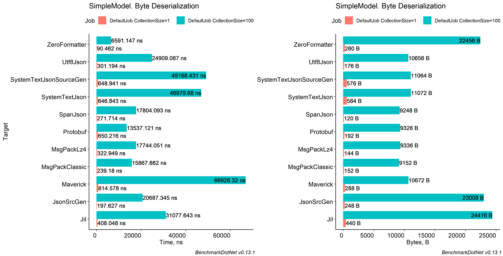

<a name="stream-simple-deserialization"></a>
### Stream
| Method                  | Count |           Mean |         Error |        StdDev |       StdErr |        Op/s |   Allocated |
|-------------------------|-------|---------------:|--------------:|--------------:|-------------:|------------:|------------:|
| SpanJson                | 1     |       332.7 ns |       3.14 ns |       2.79 ns |      0.74 ns | 3,006,093.9 |       216 B |
| Utf8Json                | 1     |       364.8 ns |       2.72 ns |       2.41 ns |      0.64 ns | 2,741,118.8 |       176 B |
| MsgPackClassic          | 1     |       493.3 ns |       6.50 ns |       5.76 ns |      1.54 ns | 2,027,285.9 |       152 B |
| MsgPackLz4              | 1     |       570.7 ns |       4.55 ns |       3.55 ns |      1.02 ns | 1,752,085.4 |       136 B |
| Protobuf                | 1     |       649.3 ns |       8.62 ns |       8.06 ns |      2.08 ns | 1,540,114.5 |       232 B |
| SystemTextJson          | 1     |       827.4 ns |      14.89 ns |      20.38 ns |      4.00 ns | 1,208,555.7 |       584 B |
| SystemTextJsonSourceGen | 1     |       837.6 ns |       8.54 ns |       6.66 ns |      1.92 ns | 1,193,852.4 |       584 B |
| Maverick                | 1     |       914.7 ns |      11.25 ns |       9.40 ns |      2.61 ns | 1,093,208.9 |       408 B |
| ServiceStack            | 1     |     1,252.4 ns |      15.33 ns |      14.34 ns |      3.70 ns |   798,489.0 |       904 B |
|                         |       |                |               |               |              |             |             |
| Protobuf                | 100   |    15,028.4 ns |     106.07 ns |      94.02 ns |     25.13 ns |    66,540.7 |     9,256 B |
| MsgPackClassic          | 100   |    17,117.0 ns |     321.58 ns |     300.81 ns |     77.67 ns |    58,421.4 |     9,328 B |
| SpanJson                | 100   |    18,954.2 ns |     132.69 ns |     124.12 ns |     32.05 ns |    52,758.7 |    16,248 B |
| MsgPackLz4              | 100   |    19,144.1 ns |     263.98 ns |     246.93 ns |     63.76 ns |    52,235.3 |     9,248 B |
| Utf8Json                | 100   |    25,294.1 ns |     195.46 ns |     163.22 ns |     45.27 ns |    39,535.0 |    10,632 B |
| SystemTextJson          | 100   |    52,942.4 ns |     476.09 ns |     445.34 ns |    114.99 ns |    18,888.5 |    11,000 B |
| SystemTextJsonSourceGen | 100   |    53,414.0 ns |     183.59 ns |     153.31 ns |     42.52 ns |    18,721.7 |    11,008 B |
| ServiceStack            | 100   |    67,530.2 ns |     888.27 ns |     830.89 ns |    214.54 ns |    14,808.2 |    24,410 B |
| Maverick                | 100   |    70,011.6 ns |     927.67 ns |     774.65 ns |    214.85 ns |    14,283.4 |    17,808 B |
|                         |       |                |               |               |              |             |             |
| Protobuf                | 1000  |   153,370.6 ns |     995.10 ns |     930.81 ns |    240.34 ns |     6,520.2 |    92,192 B |
| MsgPackClassic          | 1000  |   166,813.9 ns |   2,276.79 ns |   2,129.71 ns |    549.89 ns |     5,994.7 |    91,896 B |
| MsgPackLz4              | 1000  |   181,731.2 ns |   1,168.16 ns |     912.02 ns |    263.28 ns |     5,502.6 |    91,960 B |
| SpanJson                | 1000  |   194,669.5 ns |   1,353.60 ns |   1,199.93 ns |    320.70 ns |     5,136.9 |   161,072 B |
| Utf8Json                | 1000  |   302,586.2 ns |   5,284.91 ns |   4,413.14 ns |  1,223.98 ns |     3,304.8 |   231,806 B |
| SystemTextJsonSourceGen | 1000  |   626,856.8 ns |   5,045.35 ns |   4,213.10 ns |  1,168.50 ns |     1,595.3 |   101,089 B |
| SystemTextJson          | 1000  |   632,444.7 ns |   5,708.88 ns |   5,060.77 ns |  1,352.55 ns |     1,581.2 |   101,249 B |
| ServiceStack            | 1000  |   662,479.4 ns |   6,114.20 ns |   5,420.08 ns |  1,448.58 ns |     1,509.5 |   234,303 B |
| Maverick                | 1000  |   707,344.1 ns |   5,603.99 ns |   4,375.23 ns |  1,263.02 ns |     1,413.7 |   169,785 B |
|                         |       |                |               |               |              |             |             |
| Protobuf                | 10000 | 1,697,470.3 ns |  22,519.35 ns |  19,962.82 ns |  5,335.29 ns |       589.1 |   919,530 B |
| MsgPackLz4              | 10000 | 2,515,150.8 ns |  40,600.46 ns |  37,977.69 ns |  9,805.80 ns |       397.6 | 1,143,004 B |
| MsgPackClassic          | 10000 | 2,525,516.6 ns |  73,471.63 ns | 214,320.20 ns | 21,649.61 ns |       396.0 | 1,415,129 B |
| SpanJson                | 10000 | 2,925,169.8 ns |  56,958.53 ns |  53,279.04 ns | 13,756.59 ns |       341.9 | 1,611,061 B |
| Utf8Json                | 10000 | 5,137,106.2 ns | 102,671.79 ns | 212,035.05 ns | 29,403.97 ns |       194.7 | 3,069,211 B |
| SystemTextJson          | 10000 | 7,482,713.9 ns |  64,092.56 ns |  59,952.22 ns | 15,479.60 ns |       133.6 | 1,102,952 B |
| SystemTextJsonSourceGen | 10000 | 7,645,361.2 ns |  63,899.31 ns |  53,358.82 ns | 14,799.07 ns |       130.8 | 1,102,423 B |
| Maverick                | 10000 | 7,866,861.1 ns | 111,444.32 ns |  98,792.49 ns | 26,403.40 ns |       127.1 | 1,794,576 B |
| ServiceStack            | 10000 | 9,925,313.6 ns | 194,365.66 ns | 181,809.75 ns | 46,943.08 ns |       100.8 | 2,455,969 B |

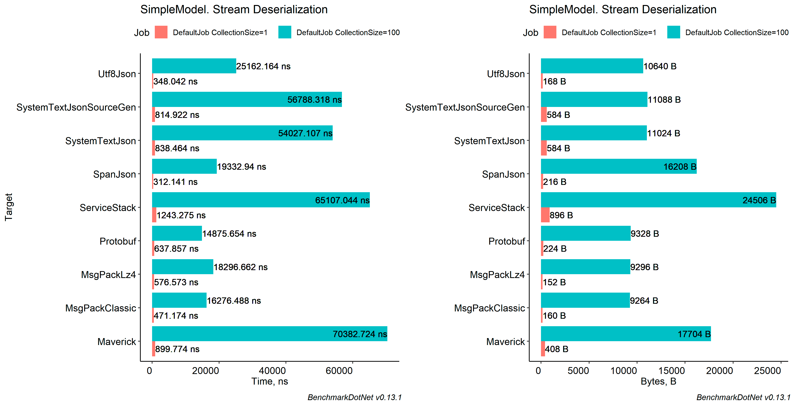

<a name="async-stream-simple-deserialization"></a>
### Async Stream
| Method                  | Count |           Mean |         Error |        StdDev |       StdErr |        Op/s |   Allocated |
|-------------------------|-------|---------------:|--------------:|--------------:|-------------:|------------:|------------:|
| SpanJson                | 1     |       433.2 ns |       6.85 ns |       6.07 ns |      1.62 ns | 2,308,394.6 |       120 B |
| Utf8Json                | 1     |       436.9 ns |       1.85 ns |       1.54 ns |      0.43 ns | 2,288,960.4 |       312 B |
| MsgPackClassic          | 1     |       541.4 ns |       2.78 ns |       2.47 ns |      0.66 ns | 1,847,137.6 |       144 B |
| MsgPackLz4              | 1     |       641.7 ns |       6.19 ns |       5.17 ns |      1.43 ns | 1,558,426.8 |       144 B |
| Protobuf                | 1     |       652.8 ns |       9.10 ns |       7.10 ns |      2.05 ns | 1,531,798.2 |       224 B |
| SystemTextJsonSourceGen | 1     |     1,016.0 ns |       7.34 ns |       6.13 ns |      1.70 ns |   984,248.1 |       576 B |
| SystemTextJson          | 1     |     1,081.1 ns |       8.92 ns |       7.91 ns |      2.11 ns |   924,989.2 |       584 B |
| ServiceStack            | 1     |     1,350.7 ns |      13.14 ns |      12.29 ns |      3.17 ns |   740,350.4 |     1,048 B |
|                         |       |                |               |               |              |             |             |
| Protobuf                | 100   |    15,584.2 ns |     275.89 ns |     258.07 ns |     66.63 ns |    64,167.4 |     9,296 B |
| MsgPackClassic          | 100   |    17,056.4 ns |     159.46 ns |     133.16 ns |     36.93 ns |    58,629.1 |     9,272 B |
| SpanJson                | 100   |    19,277.8 ns |     161.39 ns |     150.96 ns |     38.98 ns |    51,873.0 |     9,240 B |
| MsgPackLz4              | 100   |    19,604.6 ns |     670.22 ns |   1,777.33 ns |    196.27 ns |    51,008.4 |     9,216 B |
| Utf8Json                | 100   |    26,799.1 ns |     533.59 ns |     934.54 ns |    149.65 ns |    37,314.7 |    10,776 B |
| SystemTextJson          | 100   |    53,432.4 ns |     511.71 ns |     478.65 ns |    123.59 ns |    18,715.2 |    10,928 B |
| SystemTextJsonSourceGen | 100   |    54,701.9 ns |     523.00 ns |     489.22 ns |    126.31 ns |    18,280.9 |    11,032 B |
| ServiceStack            | 100   |    67,013.4 ns |     719.56 ns |     637.87 ns |    170.48 ns |    14,922.4 |    24,578 B |
|                         |       |                |               |               |              |             |             |
| Protobuf                | 1000  |   152,664.1 ns |   1,560.18 ns |   1,383.06 ns |    369.64 ns |     6,550.3 |    92,312 B |
| MsgPackClassic          | 1000  |   166,199.9 ns |   1,698.04 ns |   1,417.94 ns |    393.27 ns |     6,016.9 |    92,072 B |
| SpanJson                | 1000  |   190,412.3 ns |   1,436.33 ns |   1,273.27 ns |    340.30 ns |     5,251.8 |    91,888 B |
| MsgPackLz4              | 1000  |   190,677.2 ns |   3,691.70 ns |   3,950.07 ns |    931.04 ns |     5,244.5 |    91,912 B |
| Utf8Json                | 1000  |   305,323.7 ns |   5,796.37 ns |   6,900.16 ns |  1,505.74 ns |     3,275.2 |   232,018 B |
| SystemTextJson          | 1000  |   616,170.3 ns |   4,955.82 ns |   4,138.33 ns |  1,147.77 ns |     1,622.9 |   100,985 B |
| SystemTextJsonSourceGen | 1000  |   633,022.6 ns |   7,078.76 ns |   6,621.48 ns |  1,709.66 ns |     1,579.7 |   101,201 B |
| ServiceStack            | 1000  |   659,855.5 ns |   4,386.21 ns |   3,888.26 ns |  1,039.18 ns |     1,515.5 |   234,472 B |
|                         |       |                |               |               |              |             |             |
| Protobuf                | 10000 | 1,795,263.9 ns |  17,424.20 ns |  16,298.61 ns |  4,208.28 ns |       557.0 |   920,450 B |
| SpanJson                | 10000 | 2,189,928.6 ns |  21,864.07 ns |  19,381.93 ns |  5,180.04 ns |       456.6 |   919,628 B |
| MsgPackLz4              | 10000 | 2,517,703.0 ns |  47,346.08 ns |  44,287.55 ns | 11,435.00 ns |       397.2 | 1,145,301 B |
| MsgPackClassic          | 10000 | 2,952,001.6 ns |  42,603.90 ns |  39,851.72 ns | 10,289.67 ns |       338.8 | 1,415,144 B |
| Utf8Json                | 10000 | 4,804,839.3 ns | 163,313.97 ns | 481,534.91 ns | 48,153.49 ns |       208.1 | 3,068,743 B |
| SystemTextJson          | 10000 | 7,054,294.0 ns |  79,642.77 ns |  74,497.90 ns | 19,235.27 ns |       141.8 | 1,102,377 B |
| SystemTextJsonSourceGen | 10000 | 7,231,093.2 ns |  61,710.41 ns |  51,530.99 ns | 14,292.12 ns |       138.3 | 1,102,781 B |
| ServiceStack            | 10000 | 9,965,140.6 ns | 198,610.71 ns | 236,431.92 ns | 51,593.67 ns |       100.3 | 2,455,440 B |

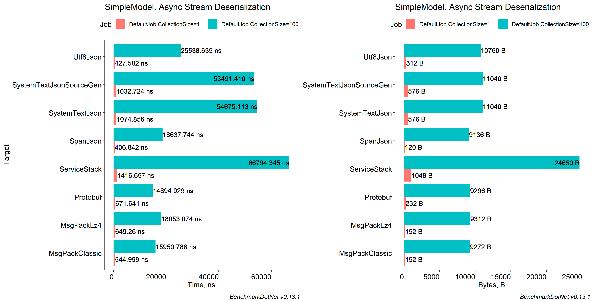

<a name="complex-model-deserialization"></a>
## Complex Model

<a name="string-complex-deserialization"></a>
### String
| Method                  | Count |           Mean |         Error |        StdDev |        StdErr |        Op/s |  Allocated |
|-------------------------|-------|---------------:|--------------:|--------------:|--------------:|------------:|-----------:|
| JsonSrcGen              | 1     |       5.939 μs |     0.0571 μs |     0.0534 μs |     0.0138 μs | 168,370.907 |       1 KB |
| SpanJson                | 1     |       7.948 μs |     0.1109 μs |     0.1038 μs |     0.0268 μs | 125,820.998 |       1 KB |
| Utf8Json                | 1     |      10.446 μs |     0.0647 μs |     0.0605 μs |     0.0156 μs |  95,734.117 |       4 KB |
| NetJson                 | 1     |      10.923 μs |     0.0647 μs |     0.0605 μs |     0.0156 μs |  91,549.783 |       2 KB |
| Jil                     | 1     |      14.700 μs |     0.1106 μs |     0.0980 μs |     0.0262 μs |  68,025.331 |       5 KB |
| SystemTextJson          | 1     |      16.161 μs |     0.1030 μs |     0.0860 μs |     0.0238 μs |  61,878.762 |       4 KB |
| SystemTextJsonSourceGen | 1     |      16.764 μs |     0.2948 μs |     0.4925 μs |     0.0821 μs |  59,653.247 |       4 KB |
| Maverick                | 1     |      16.974 μs |     0.2317 μs |     0.2167 μs |     0.0560 μs |  58,913.347 |       4 KB |
| ServiceStack            | 1     |      28.061 μs |     0.1114 μs |     0.0988 μs |     0.0264 μs |  35,637.187 |       7 KB |
| Newtonsoft              | 1     |      37.290 μs |     0.3776 μs |     0.3532 μs |     0.0912 μs |  26,816.597 |      14 KB |
|                         |       |                |               |               |               |             |            |
| JsonSrcGen              | 100   |     721.451 μs |     4.6599 μs |     3.8912 μs |     1.0792 μs |   1,386.095 |     134 KB |
| SpanJson                | 100   |     906.158 μs |     8.8795 μs |     8.3059 μs |     2.1446 μs |   1,103.560 |     134 KB |
| NetJson                 | 100   |   1,107.902 μs |    12.3268 μs |    11.5305 μs |     2.9772 μs |     902.607 |     186 KB |
| Utf8Json                | 100   |   1,198.711 μs |    23.4007 μs |    36.4321 μs |     6.4403 μs |     834.230 |     377 KB |
| Jil                     | 100   |   1,474.669 μs |    12.0999 μs |    11.3182 μs |     2.9224 μs |     678.118 |     487 KB |
| SystemTextJson          | 100   |   1,745.428 μs |     6.9394 μs |     5.7948 μs |     1.6072 μs |     572.925 |     400 KB |
| SystemTextJsonSourceGen | 100   |   1,761.627 μs |    10.2174 μs |     9.5574 μs |     2.4677 μs |     567.657 |     400 KB |
| Maverick                | 100   |   1,786.133 μs |    15.8729 μs |    14.8475 μs |     3.8336 μs |     559.869 |     346 KB |
| ServiceStack            | 100   |   2,971.959 μs |    18.0616 μs |    15.0823 μs |     4.1831 μs |     336.478 |     684 KB |
| Newtonsoft              | 100   |   3,722.506 μs |    22.6069 μs |    21.1465 μs |     5.4600 μs |     268.636 |   1,068 KB |
|                         |       |                |               |               |               |             |            |
| JsonSrcGen              | 1000  |   6,661.035 μs |    31.4110 μs |    27.8450 μs |     7.4419 μs |     150.127 |   1,335 KB |
| SpanJson                | 1000  |   9,218.181 μs |    76.3722 μs |    71.4386 μs |    18.4454 μs |     108.481 |   1,337 KB |
| NetJson                 | 1000  |  11,233.830 μs |   114.7600 μs |    95.8298 μs |    26.5784 μs |      89.017 |   1,854 KB |
| Utf8Json                | 1000  |  13,174.959 μs |   122.3548 μs |   108.4643 μs |    28.9883 μs |      75.902 |   3,761 KB |
| Jil                     | 1000  |  17,161.703 μs |    70.6503 μs |    66.0863 μs |    17.0634 μs |      58.269 |   4,873 KB |
| Maverick                | 1000  |  21,711.628 μs |   221.0718 μs |   206.7907 μs |    53.3931 μs |      46.058 |   4,870 KB |
| SystemTextJsonSourceGen | 1000  |  21,983.682 μs |   424.3376 μs |   396.9257 μs |   102.4858 μs |      45.488 |   5,654 KB |
| SystemTextJson          | 1000  |  22,101.637 μs |   206.4263 μs |   172.3754 μs |    47.8083 μs |      45.246 |   5,654 KB |
| ServiceStack            | 1000  |  31,217.350 μs |   282.7223 μs |   264.4586 μs |    68.2829 μs |      32.033 |   6,825 KB |
| Newtonsoft              | 1000  |  39,324.879 μs |   529.8261 μs |   413.6534 μs |   119.4114 μs |      25.429 |  10,609 KB |
|                         |       |                |               |               |               |             |            |
| JsonSrcGen              | 10000 |  74,682.008 μs |   666.4527 μs |   590.7929 μs |   157.8961 μs |      13.390 |  13,358 KB |
| SpanJson                | 10000 | 101,497.217 μs |   568.7775 μs |   532.0348 μs |   137.3708 μs |       9.852 |  13,359 KB |
| NetJson                 | 10000 | 113,729.929 μs |   622.9377 μs |   582.6963 μs |   150.4515 μs |       8.793 |  18,637 KB |
| Utf8Json                | 10000 | 145,425.772 μs | 1,623.7299 μs | 1,518.8379 μs |   392.1623 μs |       6.876 |  37,710 KB |
| Jil                     | 10000 | 178,625.110 μs | 3,558.1868 μs | 6,231.8772 μs |   997.8990 μs |       5.598 |  48,824 KB |
| Maverick                | 10000 | 219,530.493 μs | 2,189.8102 μs | 1,941.2097 μs |   518.8101 μs |       4.555 |  51,148 KB |
| SystemTextJsonSourceGen | 10000 | 220,087.140 μs | 2,514.0541 μs | 2,351.6478 μs |   607.1928 μs |       4.544 |  56,624 KB |
| SystemTextJson          | 10000 | 221,722.613 μs | 2,286.6042 μs | 2,138.8910 μs |   552.2593 μs |       4.510 |  56,622 KB |
| ServiceStack            | 10000 | 327,034.138 μs | 3,144.7504 μs | 2,626.0090 μs |   728.3239 μs |       3.058 |  68,363 KB |
| Newtonsoft              | 10000 | 402,045.971 μs | 4,790.9913 μs | 4,247.0890 μs | 1,135.0823 μs |       2.487 | 106,200 KB |

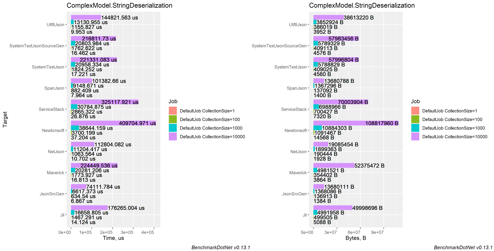

<a name="byte-complex-deserialization"></a>
### Byte
| Method                  | Count |             Mean |           Error |          StdDev |        StdErr |          Op/s | Allocated |
|-------------------------|-------|-----------------:|----------------:|----------------:|--------------:|--------------:|----------:|
| ZeroFormatter           | 1     |         409.4 ns |         4.58 ns |         4.28 ns |       1.11 ns | 2,442,438.382 |      1 KB |
| MsgPackClassic          | 1     |       2,673.0 ns |        19.51 ns |        16.29 ns |       4.52 ns |   374,111.270 |      1 KB |
| MsgPackLz4              | 1     |       3,468.0 ns |        21.37 ns |        17.85 ns |       4.95 ns |   288,349.749 |      1 KB |
| Protobuf                | 1     |       5,569.3 ns |        25.85 ns |        22.92 ns |       6.12 ns |   179,554.297 |      1 KB |
| JsonSrcGen              | 1     |       6,147.1 ns |        34.35 ns |        30.45 ns |       8.14 ns |   162,677.352 |      1 KB |
| SpanJson                | 1     |       7,976.2 ns |       154.18 ns |       128.75 ns |      35.71 ns |   125,373.189 |      1 KB |
| Utf8Json                | 1     |      10,003.5 ns |        94.25 ns |        83.55 ns |      22.33 ns |    99,965.212 |      2 KB |
| Jil                     | 1     |      14,321.8 ns |       206.14 ns |       172.14 ns |      47.74 ns |    69,823.587 |      8 KB |
| SystemTextJson          | 1     |      16,253.7 ns |       226.51 ns |       211.88 ns |      54.71 ns |    61,524.418 |      4 KB |
| SystemTextJsonSourceGen | 1     |      16,441.6 ns |       233.61 ns |       218.52 ns |      56.42 ns |    60,821.365 |      4 KB |
| Maverick                | 1     |      16,612.4 ns |       233.59 ns |       207.07 ns |      55.34 ns |    60,196.048 |      4 KB |
|                         |       |                  |                 |                 |               |               |           |
| ZeroFormatter           | 100   |      44,301.9 ns |       393.74 ns |       368.30 ns |      95.10 ns |    22,572.378 |    114 KB |
| MsgPackClassic          | 100   |     280,062.9 ns |     3,153.17 ns |     2,633.04 ns |     730.27 ns |     3,570.627 |    133 KB |
| MsgPackLz4              | 100   |     312,111.8 ns |     3,322.63 ns |     2,774.55 ns |     769.52 ns |     3,203.980 |    134 KB |
| Protobuf                | 100   |     521,997.7 ns |     5,552.01 ns |     5,193.36 ns |   1,340.92 ns |     1,915.717 |    134 KB |
| JsonSrcGen              | 100   |     669,428.4 ns |     4,193.34 ns |     3,922.45 ns |   1,012.77 ns |     1,493.812 |    134 KB |
| SpanJson                | 100   |     848,501.1 ns |     5,112.95 ns |     4,532.50 ns |   1,211.36 ns |     1,178.549 |    133 KB |
| Utf8Json                | 100   |   1,084,939.8 ns |     8,012.63 ns |     7,102.99 ns |   1,898.35 ns |       921.710 |    210 KB |
| SystemTextJson          | 100   |   1,766,354.6 ns |    15,755.25 ns |    13,966.62 ns |   3,732.74 ns |       566.138 |    400 KB |
| SystemTextJsonSourceGen | 100   |   1,770,690.8 ns |    14,450.78 ns |    12,810.24 ns |   3,423.68 ns |       564.751 |    399 KB |
| Maverick                | 100   |   1,810,121.7 ns |     8,805.35 ns |     7,805.71 ns |   2,086.16 ns |       552.449 |    342 KB |
| Jil                     | 100   |   1,868,524.5 ns |    37,225.99 ns |    49,695.63 ns |   9,939.13 ns |       535.182 |    822 KB |
|                         |       |                  |                 |                 |               |               |           |
| ZeroFormatter           | 1000  |     747,932.6 ns |     3,688.68 ns |     3,080.21 ns |     854.30 ns |     1,337.019 |  1,141 KB |
| MsgPackClassic          | 1000  |   3,294,660.4 ns |    51,557.70 ns |    48,227.11 ns |  12,452.19 ns |       303.521 |  1,337 KB |
| MsgPackLz4              | 1000  |   3,552,262.2 ns |    32,295.15 ns |    28,628.81 ns |   7,651.37 ns |       281.511 |  1,335 KB |
| Protobuf                | 1000  |   5,625,177.3 ns |    43,923.12 ns |    36,677.80 ns |  10,172.59 ns |       177.772 |  1,336 KB |
| JsonSrcGen              | 1000  |   7,099,817.5 ns |   140,563.06 ns |   172,624.07 ns |  36,803.57 ns |       140.849 |  1,336 KB |
| SpanJson                | 1000  |   8,878,435.4 ns |   124,644.62 ns |   110,494.21 ns |  29,530.82 ns |       112.632 |  1,335 KB |
| Utf8Json                | 1000  |  11,821,176.8 ns |   201,851.95 ns |   295,871.96 ns |  54,942.04 ns |        84.594 |  2,094 KB |
| SystemTextJsonSourceGen | 1000  |  19,243,212.7 ns |   172,580.59 ns |   152,988.20 ns |  40,887.82 ns |        51.966 |  3,985 KB |
| Maverick                | 1000  |  19,275,006.2 ns |   181,778.73 ns |   161,142.11 ns |  43,067.04 ns |        51.881 |  3,415 KB |
| SystemTextJson          | 1000  |  19,329,651.1 ns |   166,132.35 ns |   147,272.00 ns |  39,360.10 ns |        51.734 |  3,985 KB |
| Jil                     | 1000  |  20,675,413.5 ns |   380,739.15 ns |   481,513.12 ns | 100,402.43 ns |        48.367 |  8,212 KB |
|                         |       |                  |                 |                 |               |               |           |
| ZeroFormatter           | 10000 |  27,274,871.6 ns |   533,769.72 ns |   730,630.02 ns | 143,288.34 ns |        36.664 | 11,407 KB |
| MsgPackClassic          | 10000 |  47,366,828.7 ns |   789,145.13 ns |   738,166.84 ns | 190,593.86 ns |        21.112 | 13,360 KB |
| MsgPackLz4              | 10000 |  52,040,060.0 ns |   925,138.53 ns |   865,375.16 ns | 223,438.90 ns |        19.216 | 13,359 KB |
| Protobuf                | 10000 |  67,476,416.1 ns |   899,477.38 ns |   797,363.27 ns | 213,104.30 ns |        14.820 | 13,363 KB |
| JsonSrcGen              | 10000 |  77,084,271.4 ns |   628,300.30 ns |   556,971.85 ns | 148,856.99 ns |        12.973 | 13,360 KB |
| SpanJson                | 10000 |  94,763,760.3 ns |   918,666.31 ns |   767,127.97 ns | 212,763.02 ns |        10.553 | 13,360 KB |
| Utf8Json                | 10000 | 133,635,455.0 ns | 1,276,432.06 ns | 1,193,975.34 ns | 308,283.11 ns |         7.483 | 21,032 KB |
| Jil                     | 10000 | 194,958,692.9 ns | 1,783,559.54 ns | 1,581,079.07 ns | 422,561.16 ns |         5.129 | 82,231 KB |
| Maverick                | 10000 | 200,697,350.0 ns | 3,730,764.30 ns | 3,664,109.39 ns | 916,027.35 ns |         4.983 | 34,241 KB |
| SystemTextJsonSourceGen | 10000 | 208,570,142.9 ns | 3,271,265.13 ns | 2,899,891.33 ns | 775,028.56 ns |         4.795 | 39,945 KB |
| SystemTextJson          | 10000 | 209,119,533.3 ns | 1,488,657.53 ns | 1,392,491.18 ns | 359,539.68 ns |         4.782 | 39,943 KB |

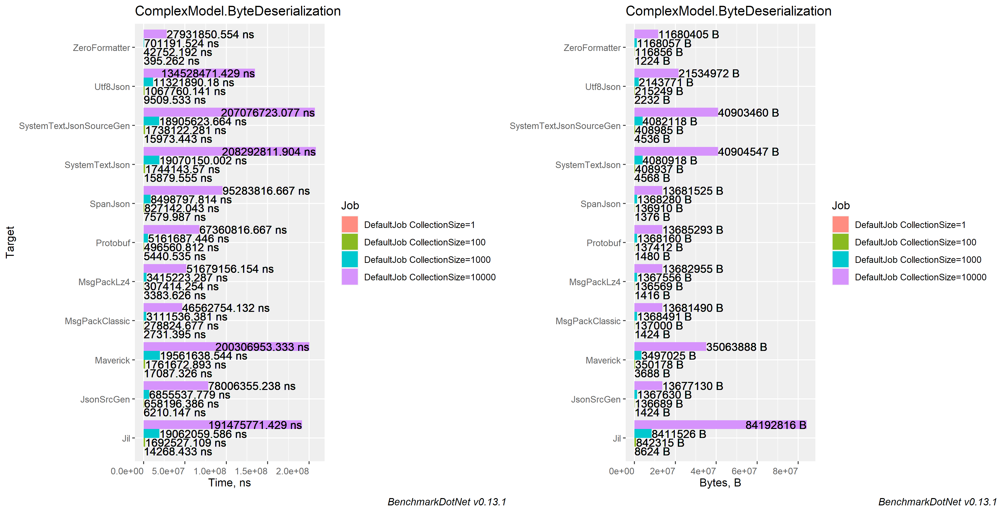

<a name="stream-complex-deserialization"></a>
### Stream
| Method                  | Count |           Mean |         Error |        StdDev |        StdErr |        Op/s |  Allocated |
|-------------------------|-------|---------------:|--------------:|--------------:|--------------:|------------:|-----------:|
| MsgPackClassic          | 1     |       2.973 μs |     0.0169 μs |     0.0150 μs |     0.0040 μs | 336,389.931 |       1 KB |
| MsgPackLz4              | 1     |       3.594 μs |     0.0113 μs |     0.0088 μs |     0.0025 μs | 278,275.873 |       1 KB |
| Protobuf                | 1     |       5.653 μs |     0.0386 μs |     0.0342 μs |     0.0091 μs | 176,898.147 |       1 KB |
| SpanJson                | 1     |       7.989 μs |     0.0577 μs |     0.0540 μs |     0.0139 μs | 125,168.716 |       3 KB |
| Utf8Json                | 1     |       9.708 μs |     0.0601 μs |     0.0502 μs |     0.0139 μs | 103,010.077 |       2 KB |
| Maverick                | 1     |      17.177 μs |     0.1552 μs |     0.1452 μs |     0.0375 μs |  58,216.831 |       5 KB |
| SystemTextJsonSourceGen | 1     |      17.982 μs |     0.1772 μs |     0.1479 μs |     0.0410 μs |  55,612.660 |       4 KB |
| SystemTextJson          | 1     |      18.274 μs |     0.0864 μs |     0.0722 μs |     0.0200 μs |  54,722.155 |       4 KB |
| ServiceStack            | 1     |      28.709 μs |     0.1367 μs |     0.1279 μs |     0.0330 μs |  34,832.158 |       9 KB |
|                         |       |                |               |               |               |             |            |
| MsgPackClassic          | 100   |     283.177 μs |     2.0534 μs |     1.8203 μs |     0.4865 μs |   3,531.359 |     134 KB |
| MsgPackLz4              | 100   |     312.812 μs |     2.7661 μs |     2.5874 μs |     0.6681 μs |   3,196.803 |     134 KB |
| Protobuf                | 100   |     496.839 μs |     3.6878 μs |     3.0795 μs |     0.8541 μs |   2,012.724 |     134 KB |
| SpanJson                | 100   |     873.897 μs |     6.0662 μs |     5.6743 μs |     1.4651 μs |   1,144.300 |     300 KB |
| Utf8Json                | 100   |   1,200.778 μs |    23.8633 μs |    23.4370 μs |     5.8592 μs |     832.794 |     594 KB |
| Maverick                | 100   |   1,851.636 μs |    15.4162 μs |    12.8732 μs |     3.5704 μs |     540.063 |     509 KB |
| SystemTextJsonSourceGen | 100   |   2,223.177 μs |    12.4702 μs |    11.0545 μs |     2.9544 μs |     449.807 |     399 KB |
| SystemTextJson          | 100   |   2,236.713 μs |    15.8875 μs |    13.2667 μs |     3.6795 μs |     447.085 |     399 KB |
| ServiceStack            | 100   |   3,041.132 μs |    38.1255 μs |    35.6626 μs |     9.2081 μs |     328.825 |     853 KB |
|                         |       |                |               |               |               |             |            |
| MsgPackClassic          | 1000  |   4,288.927 μs |    83.4168 μs |   111.3590 μs |    22.2718 μs |     233.159 |   2,257 KB |
| MsgPackLz4              | 1000  |   4,438.140 μs |    88.1557 μs |   101.5202 μs |    22.7006 μs |     225.320 |   2,121 KB |
| Protobuf                | 1000  |   5,511.211 μs |    66.5835 μs |    59.0246 μs |    15.7750 μs |     181.448 |   1,336 KB |
| SpanJson                | 1000  |   9,824.770 μs |   189.7748 μs |   177.5155 μs |    45.8343 μs |     101.784 |   3,004 KB |
| Utf8Json                | 1000  |  13,972.843 μs |   278.2232 μs |   522.5706 μs |    78.7805 μs |      71.567 |   6,064 KB |
| Maverick                | 1000  |  20,616.383 μs |   347.8260 μs |   325.3567 μs |    84.0067 μs |      48.505 |   5,083 KB |
| SystemTextJsonSourceGen | 1000  |  24,169.165 μs |   152.9257 μs |   143.0468 μs |    36.9345 μs |      41.375 |   3,985 KB |
| SystemTextJson          | 1000  |  24,333.819 μs |   160.2496 μs |   149.8975 μs |    38.7034 μs |      41.095 |   3,986 KB |
| ServiceStack            | 1000  |  34,188.684 μs |   439.9080 μs |   411.4902 μs |   106.2463 μs |      29.249 |   8,721 KB |
|                         |       |                |               |               |               |             |            |
| MsgPackClassic          | 10000 |  50,622.831 μs |   893.4667 μs |   835.7493 μs |   215.7895 μs |      19.754 |  22,571 KB |
| MsgPackLz4              | 10000 |  52,729.740 μs |   585.0065 μs |   518.5930 μs |   138.5998 μs |      18.965 |  21,209 KB |
| Protobuf                | 10000 |  65,365.014 μs |   981.7092 μs |   918.2914 μs |   237.1018 μs |      15.299 |  13,361 KB |
| SpanJson                | 10000 |  99,206.464 μs |   963.1054 μs |   853.7679 μs |   228.1791 μs |      10.080 |  30,042 KB |
| Utf8Json                | 10000 | 150,967.410 μs | 1,891.3220 μs | 1,676.6076 μs |   448.0922 μs |       6.624 |  86,437 KB |
| Maverick                | 10000 | 216,376.205 μs | 4,292.4208 μs | 4,771.0144 μs | 1,094.5458 μs |       4.622 |  50,929 KB |
| SystemTextJsonSourceGen | 10000 | 270,872.650 μs | 3,306.8199 μs | 2,931.4097 μs |   783.4522 μs |       3.692 |  39,946 KB |
| SystemTextJson          | 10000 | 271,777.540 μs | 4,038.5570 μs | 3,777.6687 μs |   975.3899 μs |       3.679 |  39,946 KB |
| ServiceStack            | 10000 | 336,766.964 μs | 3,958.6781 μs | 3,509.2650 μs |   937.8905 μs |       2.969 | 118,463 KB |

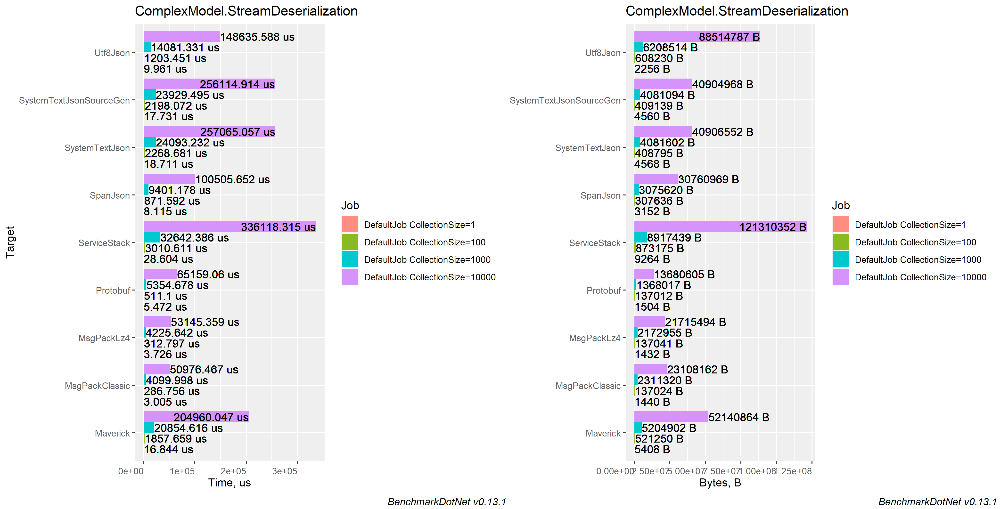

<a name="async-stream-complex-deserialization"></a>
### Async Stream
| Method                  | Count |           Mean |         Error |        StdDev |        StdErr |        Op/s |  Allocated |
|-------------------------|-------|---------------:|--------------:|--------------:|--------------:|------------:|-----------:|
| MsgPackClassic          | 1     |       3.236 μs |     0.0369 μs |     0.0327 μs |     0.0088 μs | 309,018.625 |       1 KB |
| MsgPackLz4              | 1     |       3.988 μs |     0.0440 μs |     0.0368 μs |     0.0102 μs | 250,729.501 |       1 KB |
| Protobuf                | 1     |       5.877 μs |     0.0530 μs |     0.0470 μs |     0.0126 μs | 170,150.876 |       1 KB |
| SpanJson                | 1     |       8.286 μs |     0.1514 μs |     0.1265 μs |     0.0351 μs | 120,686.549 |       1 KB |
| Utf8Json                | 1     |      10.242 μs |     0.1051 μs |     0.0932 μs |     0.0249 μs |  97,640.187 |       2 KB |
| SystemTextJson          | 1     |      18.992 μs |     0.1320 μs |     0.1102 μs |     0.0306 μs |  52,655.109 |       4 KB |
| SystemTextJsonSourceGen | 1     |      19.271 μs |     0.3848 μs |     0.3599 μs |     0.0929 μs |  51,890.222 |       4 KB |
| ServiceStack            | 1     |      29.520 μs |     0.2877 μs |     0.2691 μs |     0.0695 μs |  33,874.821 |       9 KB |
|                         |       |                |               |               |               |             |            |
| MsgPackClassic          | 100   |     292.000 μs |     2.5731 μs |     2.1487 μs |     0.5959 μs |   3,424.663 |     134 KB |
| MsgPackLz4              | 100   |     320.956 μs |     3.2030 μs |     2.8394 μs |     0.7589 μs |   3,115.693 |     134 KB |
| Protobuf                | 100   |     511.496 μs |     8.4167 μs |     7.8729 μs |     2.0328 μs |   1,955.049 |     134 KB |
| SpanJson                | 100   |     854.109 μs |     6.9364 μs |     5.7922 μs |     1.6065 μs |   1,170.811 |     134 KB |
| Utf8Json                | 100   |   1,244.631 μs |    23.7425 μs |    23.3183 μs |     5.8296 μs |     803.451 |     594 KB |
| SystemTextJsonSourceGen | 100   |   2,293.122 μs |    23.6009 μs |    19.7078 μs |     5.4660 μs |     436.087 |     399 KB |
| SystemTextJson          | 100   |   2,323.918 μs |    24.2536 μs |    21.5002 μs |     5.7462 μs |     430.308 |     399 KB |
| ServiceStack            | 100   |   3,189.207 μs |    62.5392 μs |    64.2232 μs |    15.5764 μs |     313.558 |     853 KB |
|                         |       |                |               |               |               |             |            |
| MsgPackLz4              | 1000  |   4,435.016 μs |    87.1321 μs |    85.5753 μs |    21.3938 μs |     225.478 |   2,122 KB |
| MsgPackClassic          | 1000  |   4,513.806 μs |    88.8155 μs |   145.9265 μs |    24.6661 μs |     221.543 |   2,259 KB |
| Protobuf                | 1000  |   5,502.854 μs |    44.1042 μs |    36.8290 μs |    10.2145 μs |     181.724 |   1,335 KB |
| SpanJson                | 1000  |   9,269.058 μs |   138.2929 μs |   122.5930 μs |    32.7644 μs |     107.886 |   1,335 KB |
| Utf8Json                | 1000  |  13,889.429 μs |   275.0307 μs |   411.6530 μs |    75.1572 μs |      71.997 |   6,064 KB |
| SystemTextJsonSourceGen | 1000  |  24,243.086 μs |   256.4385 μs |   227.3260 μs |    60.7554 μs |      41.249 |   3,986 KB |
| SystemTextJson          | 1000  |  25,863.945 μs |   312.1770 μs |   276.7367 μs |    73.9610 μs |      38.664 |   3,985 KB |
| ServiceStack            | 1000  |  34,545.956 μs |   462.1744 μs |   385.9366 μs |   107.0395 μs |      28.947 |   8,720 KB |
|                         |       |                |               |               |               |             |            |
| MsgPackClassic          | 10000 |  55,905.618 μs | 1,074.5290 μs | 1,194.3361 μs |   273.9995 μs |      17.887 |  22,568 KB |
| MsgPackLz4              | 10000 |  55,922.434 μs |   776.6292 μs |   726.4595 μs |   187.5710 μs |      17.882 |  21,212 KB |
| Protobuf                | 10000 |  72,151.284 μs | 1,083.8286 μs | 1,013.8139 μs |   261.7656 μs |      13.860 |  13,360 KB |
| SpanJson                | 10000 | 103,582.963 μs | 1,533.7535 μs | 1,434.6740 μs |   370.4312 μs |       9.654 |  13,358 KB |
| Utf8Json                | 10000 | 162,329.095 μs | 3,194.7199 μs | 2,832.0359 μs |   756.8934 μs |       6.160 |  86,439 KB |
| SystemTextJsonSourceGen | 10000 | 270,791.600 μs | 3,672.0975 μs | 3,255.2188 μs |   869.9938 μs |       3.693 |  39,946 KB |
| SystemTextJson          | 10000 | 280,499.060 μs | 2,887.0566 μs | 2,700.5546 μs |   697.2802 μs |       3.565 |  39,945 KB |
| ServiceStack            | 10000 | 358,607.307 μs | 4,361.8764 μs | 3,866.6898 μs | 1,033.4163 μs |       2.789 | 118,471 KB |

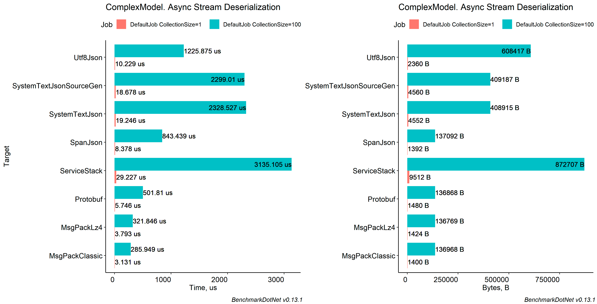

<a name="serialization"></a>
## Serialization

<a name="simple-model-serialization"></a>
## Simple Model

<a name="string-simple-serialization"></a>
### String
| Method                  | Count |            Mean |          Error |         StdDev |        StdErr |         Op/s |   Allocated |
|-------------------------|-------|----------------:|---------------:|---------------:|--------------:|-------------:|------------:|
| JsonSrcGen              | 1     |        89.64 ns |       0.382 ns |       0.338 ns |      0.090 ns | 11,155,651.9 |       160 B |
| SpanJson                | 1     |       154.67 ns |       1.356 ns |       1.268 ns |      0.328 ns |  6,465,489.8 |       160 B |
| Utf8Json                | 1     |       190.87 ns |       1.255 ns |       1.112 ns |      0.297 ns |  5,239,241.1 |       256 B |
| NetJson                 | 1     |       204.11 ns |       1.509 ns |       1.338 ns |      0.358 ns |  4,899,402.9 |       304 B |
| SystemTextJsonSourceGen | 1     |       240.85 ns |       4.202 ns |       3.725 ns |      0.996 ns |  4,151,933.3 |       320 B |
| Jil                     | 1     |       313.75 ns |       3.468 ns |       3.075 ns |      0.822 ns |  3,187,251.5 |       856 B |
| SystemTextJson          | 1     |       448.92 ns |       8.907 ns |      10.258 ns |      2.294 ns |  2,227,547.8 |       656 B |
| ServiceStack            | 1     |       638.20 ns |       7.422 ns |       6.942 ns |      1.792 ns |  1,566,897.1 |       720 B |
| Maverick                | 1     |       642.63 ns |      12.380 ns |      13.760 ns |      3.157 ns |  1,556,102.9 |       424 B |
| Newtonsoft              | 1     |     1,091.56 ns |       8.304 ns |       7.362 ns |      1.967 ns |    916,118.6 |     1,688 B |
|                         |       |                 |                |                |               |              |             |
| JsonSrcGen              | 100   |    10,236.41 ns |      66.199 ns |      58.684 ns |     15.684 ns |     97,690.5 |    13,808 B |
| SpanJson                | 100   |    10,868.46 ns |      86.908 ns |      72.572 ns |     20.128 ns |     92,009.4 |    13,816 B |
| Utf8Json                | 100   |    11,240.55 ns |      48.601 ns |      37.944 ns |     10.954 ns |     88,963.6 |    20,696 B |
| SystemTextJsonSourceGen | 100   |    13,734.02 ns |      33.430 ns |      26.100 ns |      7.534 ns |     72,811.9 |    14,056 B |
| Jil                     | 100   |    14,401.26 ns |     104.664 ns |      87.399 ns |     24.240 ns |     69,438.4 |    31,088 B |
| NetJson                 | 100   |    20,855.62 ns |     168.150 ns |     149.061 ns |     39.838 ns |     47,948.7 |    29,505 B |
| SystemTextJson          | 100   |    26,405.90 ns |     282.857 ns |     250.745 ns |     67.014 ns |     37,870.3 |    14,368 B |
| Maverick                | 100   |    38,182.47 ns |     312.564 ns |     261.005 ns |     72.390 ns |     26,190.0 |    14,336 B |
| ServiceStack            | 100   |    44,704.58 ns |     253.250 ns |     211.475 ns |     58.653 ns |     22,369.1 |    42,713 B |
| Newtonsoft              | 100   |    53,791.97 ns |     234.615 ns |     207.980 ns |     55.585 ns |     18,590.1 |    36,376 B |
|                         |       |                 |                |                |               |              |             |
| JsonSrcGen              | 1000  |   135,268.68 ns |   2,369.406 ns |   2,216.344 ns |    572.258 ns |      7,392.7 |   138,132 B |
| SpanJson                | 1000  |   135,563.35 ns |   1,999.509 ns |   1,870.342 ns |    482.920 ns |      7,376.6 |   138,101 B |
| SystemTextJsonSourceGen | 1000  |   169,027.12 ns |   1,457.694 ns |   1,620.223 ns |    371.705 ns |      5,916.2 |   138,420 B |
| Utf8Json                | 1000  |   182,780.67 ns |   3,131.697 ns |   2,929.391 ns |    756.366 ns |      5,471.0 |   337,928 B |
| SystemTextJson          | 1000  |   309,529.01 ns |   5,632.439 ns |  10,156.450 ns |  1,586.171 ns |      3,230.7 |   138,897 B |
| Maverick                | 1000  |   407,291.18 ns |   3,176.830 ns |   2,971.608 ns |    767.266 ns |      2,455.2 |   139,856 B |
| NetJson                 | 1000  |   431,137.52 ns |   6,615.000 ns |   6,187.675 ns |  1,597.651 ns |      2,319.4 |   295,683 B |
| Jil                     | 1000  |   451,048.33 ns |   8,806.541 ns |   9,788.447 ns |  2,245.624 ns |      2,217.1 |   284,147 B |
| Newtonsoft              | 1000  |   580,886.63 ns |   7,643.098 ns |   6,775.407 ns |  1,810.804 ns |      1,721.5 |   332,448 B |
| ServiceStack            | 1000  | 1,020,514.57 ns |  19,645.058 ns |  23,386.044 ns |  5,103.253 ns |        979.9 |   424,383 B |
|                         |       |                 |                |                |               |              |             |
| JsonSrcGen              | 10000 | 1,446,050.04 ns |  15,855.411 ns |  13,239.987 ns |  3,672.112 ns |        691.5 | 1,380,173 B |
| SpanJson                | 10000 | 1,468,689.40 ns |  29,106.889 ns |  73,023.494 ns |  8,488.809 ns |        680.9 | 1,380,666 B |
| SystemTextJsonSourceGen | 10000 | 1,701,341.80 ns |   6,858.155 ns |   6,079.576 ns |  1,624.835 ns |        587.8 | 1,383,052 B |
| SystemTextJson          | 10000 | 2,938,431.30 ns |  19,189.605 ns |  17,949.969 ns |  4,634.662 ns |        340.3 | 1,383,163 B |
| Jil                     | 10000 | 3,271,085.18 ns |  64,325.729 ns |  63,176.467 ns | 15,794.117 ns |        305.7 | 2,781,363 B |
| Utf8Json                | 10000 | 3,421,613.04 ns | 143,868.500 ns | 424,199.517 ns | 42,419.952 ns |        292.3 | 4,035,730 B |
| Maverick                | 10000 | 4,226,710.64 ns |  83,719.550 ns |  99,662.168 ns | 21,748.068 ns |        236.6 | 1,825,734 B |
| NetJson                 | 10000 | 4,405,056.09 ns |  77,949.060 ns | 101,355.796 ns | 20,689.165 ns |        227.0 | 2,952,995 B |
| Newtonsoft              | 10000 | 5,912,078.54 ns |  46,917.284 ns |  43,886.457 ns | 11,331.434 ns |        169.1 | 3,260,675 B |
| ServiceStack            | 10000 | 6,840,329.26 ns | 134,715.325 ns | 175,167.975 ns | 35,756.013 ns |        146.2 | 4,240,052 B |

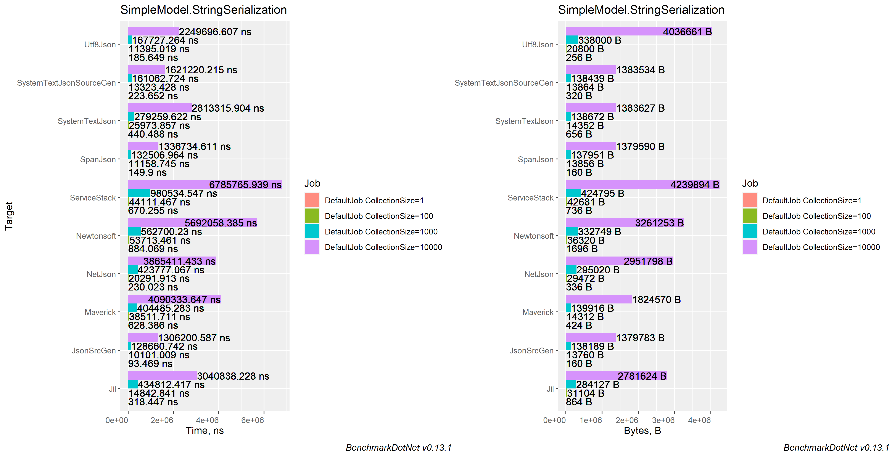

<a name="byte-simple-serialization"></a>
### Byte
| Method                  | Count |            Mean |         Error |        StdDev |       StdErr |         Op/s |   Allocated |
|-------------------------|-------|----------------:|--------------:|--------------:|-------------:|-------------:|------------:|
| JsonSrcGen              | 1     |        92.46 ns |      0.642 ns |      0.569 ns |     0.152 ns | 10,815,088.8 |        88 B |
| SpanJson                | 1     |       158.42 ns |      1.483 ns |      1.387 ns |     0.358 ns |  6,312,368.1 |        96 B |
| Utf8Json                | 1     |       162.78 ns |      1.647 ns |      1.460 ns |     0.390 ns |  6,143,425.7 |        96 B |
| ZeroFormatter           | 1     |       169.91 ns |      1.856 ns |      1.736 ns |     0.448 ns |  5,885,301.5 |     1,152 B |
| MsgPackClassic          | 1     |       174.49 ns |      3.417 ns |      5.114 ns |     0.934 ns |  5,731,086.8 |        88 B |
| SystemTextJsonSourceGen | 1     |       279.71 ns |      2.743 ns |      2.566 ns |     0.662 ns |  3,575,193.3 |       256 B |
| MsgPackLz4Block         | 1     |       365.26 ns |      2.603 ns |      2.032 ns |     0.587 ns |  2,737,753.2 |        80 B |
| SystemTextJson          | 1     |       424.70 ns |      4.469 ns |      7.466 ns |     1.244 ns |  2,354,596.1 |       592 B |
|                         |       |                 |               |               |              |              |             |
| ZeroFormatter           | 100   |     7,100.77 ns |     21.498 ns |     16.785 ns |     4.845 ns |    140,829.8 |    20,208 B |
| MsgPackClassic          | 100   |     7,913.38 ns |     77.517 ns |     68.717 ns |    18.365 ns |    126,368.3 |     4,968 B |
| JsonSrcGen              | 100   |    10,169.33 ns |     94.134 ns |     83.448 ns |    22.302 ns |     98,334.9 |     6,952 B |
| Utf8Json                | 100   |    10,225.31 ns |    141.934 ns |    125.820 ns |    33.627 ns |     97,796.6 |     6,928 B |
| SpanJson                | 100   |    10,832.10 ns |     93.841 ns |     83.188 ns |    22.233 ns |     92,318.2 |     6,880 B |
| SystemTextJsonSourceGen | 100   |    12,884.53 ns |    155.396 ns |    129.763 ns |    35.990 ns |     77,612.4 |     7,096 B |
| MsgPackLz4Block         | 100   |    14,307.16 ns |    157.145 ns |    122.688 ns |    35.417 ns |     69,895.1 |     2,632 B |
| SystemTextJson          | 100   |    25,541.02 ns |    465.053 ns |    412.257 ns |   110.180 ns |     39,152.7 |     7,424 B |
|                         |       |                 |               |               |              |              |             |
| ZeroFormatter           | 1000  |    74,245.60 ns |    313.896 ns |    262.117 ns |    72.698 ns |     13,468.8 |   176,816 B |
| MsgPackClassic          | 1000  |    84,392.74 ns |    813.929 ns |    721.527 ns |   192.836 ns |     11,849.4 |    49,440 B |
| JsonSrcGen              | 1000  |   115,197.29 ns |  2,003.153 ns |  1,672.723 ns |   463.930 ns |      8,680.8 |    69,112 B |
| SpanJson                | 1000  |   118,099.62 ns |    536.252 ns |    447.795 ns |   124.196 ns |      8,467.4 |    68,872 B |
| SystemTextJsonSourceGen | 1000  |   141,166.97 ns |  2,436.019 ns |  2,278.654 ns |   588.346 ns |      7,083.8 |    69,304 B |
| Utf8Json                | 1000  |   153,070.15 ns |    653.431 ns |    579.250 ns |   154.811 ns |      6,533.0 |   200,053 B |
| MsgPackLz4Block         | 1000  |   173,918.83 ns |  1,382.054 ns |  1,154.078 ns |   320.084 ns |      5,749.8 |    22,873 B |
| SystemTextJson          | 1000  |   262,513.48 ns |  5,207.939 ns |  6,395.817 ns | 1,363.593 ns |      3,809.3 |    69,504 B |
|                         |       |                 |               |               |              |              |             |
| ZeroFormatter           | 10000 |   836,510.34 ns |  6,587.345 ns |  5,839.510 ns | 1,560.675 ns |      1,195.4 | 1,513,637 B |
| MsgPackClassic          | 10000 |   896,839.86 ns |  6,595.392 ns |  6,169.334 ns | 1,592.915 ns |      1,115.0 |   494,787 B |
| SpanJson                | 10000 | 1,220,433.79 ns | 10,266.830 ns |  9,101.277 ns | 2,432.419 ns |        819.4 |   690,454 B |
| JsonSrcGen              | 10000 | 1,276,765.37 ns |  6,770.653 ns |  6,002.007 ns | 1,604.104 ns |        783.2 |   690,019 B |
| SystemTextJsonSourceGen | 10000 | 1,480,119.09 ns |  7,680.189 ns |  7,184.053 ns | 1,854.915 ns |        675.6 |   691,816 B |
| Utf8Json                | 10000 | 1,597,707.33 ns | 20,599.808 ns | 19,269.074 ns | 4,975.253 ns |        625.9 | 2,656,621 B |
| MsgPackLz4Block         | 10000 | 1,771,254.67 ns | 19,078.791 ns | 35,834.594 ns | 5,402.268 ns |        564.6 |   224,368 B |
| SystemTextJson          | 10000 | 2,632,414.23 ns | 19,377.970 ns | 17,178.066 ns | 4,591.031 ns |        379.9 |   691,898 B |

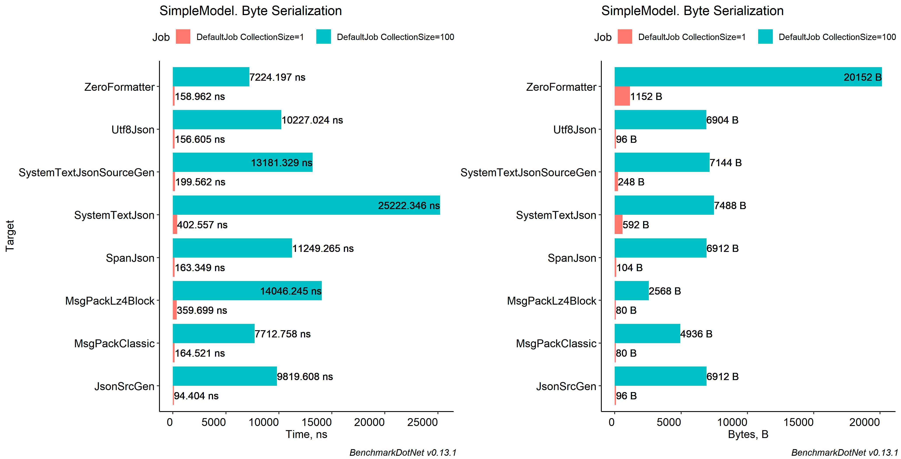

<a name="stream-simple-serialization"></a>
### Stream
| Method                  | Count |            Mean |         Error |        StdDev |       StdErr |         Op/s |   Allocated |
|-------------------------|-------|----------------:|--------------:|--------------:|-------------:|-------------:|------------:|
| ZeroFormatter           | 1     |        228.5 ns |       2.86 ns |       2.39 ns |      0.66 ns | 4,376,656.80 |     1,496 B |
| SystemTextJsonSourceGen | 1     |        238.3 ns |       1.68 ns |       1.31 ns |      0.38 ns | 4,196,376.45 |       776 B |
| MsgPackNoCompress       | 1     |        353.6 ns |       3.34 ns |       2.96 ns |      0.79 ns | 2,828,192.05 |       344 B |
| SystemTextJson          | 1     |        449.9 ns |       2.87 ns |       2.55 ns |      0.68 ns | 2,222,538.70 |     1,120 B |
| MsgPackLz4Block         | 1     |        535.6 ns |       6.28 ns |       5.57 ns |      1.49 ns | 1,867,193.94 |       344 B |
| Maverick                | 1     |        616.5 ns |       5.22 ns |       4.36 ns |      1.21 ns | 1,622,134.82 |       512 B |
| ServiceStack            | 1     |        892.3 ns |      16.13 ns |      28.67 ns |      4.53 ns | 1,120,664.70 |     3,136 B |
|                         |       |                 |               |               |              |              |             |
| ZeroFormatter           | 100   |      7,580.8 ns |      76.58 ns |      67.89 ns |     18.14 ns |   131,912.05 |    24,960 B |
| MsgPackNoCompress       | 100   |      8,674.4 ns |      58.57 ns |      51.92 ns |     13.88 ns |   115,282.25 |    12,352 B |
| MsgPackLz4Block         | 100   |     14,944.2 ns |     264.72 ns |     639.32 ns |     76.97 ns |    66,915.49 |     2,744 B |
| SystemTextJsonSourceGen | 100   |     15,385.4 ns |     141.54 ns |     132.40 ns |     34.18 ns |    64,996.64 |    25,384 B |
| SystemTextJson          | 100   |     28,419.7 ns |     142.71 ns |     119.17 ns |     33.05 ns |    35,186.80 |    25,720 B |
| Maverick                | 100   |     37,053.5 ns |     536.09 ns |     447.66 ns |    124.16 ns |    26,987.98 |    12,568 B |
| ServiceStack            | 100   |     49,845.8 ns |     371.74 ns |     329.54 ns |     88.07 ns |    20,061.85 |    49,696 B |
|                         |       |                 |               |               |              |              |             |
| ZeroFormatter           | 1000  |     78,957.7 ns |   1,406.94 ns |   1,316.05 ns |    339.80 ns |    12,665.00 |   223,368 B |
| MsgPackNoCompress       | 1000  |     90,821.5 ns |     763.14 ns |     637.25 ns |    176.74 ns |    11,010.60 |   114,617 B |
| MsgPackLz4Block         | 1000  |    173,071.4 ns |   3,284.28 ns |   3,514.14 ns |    828.29 ns |     5,777.96 |    25,560 B |
| SystemTextJsonSourceGen | 1000  |    191,650.7 ns |     956.22 ns |     847.67 ns |    226.55 ns |     5,217.83 |   317,947 B |
| SystemTextJson          | 1000  |    321,770.1 ns |   2,176.72 ns |   2,036.10 ns |    525.72 ns |     3,107.81 |   318,883 B |
| Maverick                | 1000  |    410,511.3 ns |   2,573.61 ns |   2,407.36 ns |    621.58 ns |     2,435.99 |   258,660 B |
| ServiceStack            | 1000  |    972,021.9 ns |  19,090.84 ns |  25,485.72 ns |  5,097.14 ns |     1,028.78 |   553,033 B |
|                         |       |                 |               |               |              |              |             |
| ZeroFormatter           | 10000 |  1,015,243.2 ns |  21,374.57 ns |  62,350.61 ns |  6,298.36 ns |       984.99 | 1,978,694 B |
| MsgPackNoCompress       | 10000 |  1,134,365.4 ns |  15,815.95 ns |  13,207.04 ns |  3,662.97 ns |       881.55 | 1,145,834 B |
| SystemTextJsonSourceGen | 10000 |  1,904,835.0 ns |  28,253.06 ns |  26,427.93 ns |  6,823.66 ns |       524.98 | 2,864,204 B |
| MsgPackLz4Block         | 10000 |  2,031,430.5 ns |  25,907.09 ns |  24,233.51 ns |  6,257.07 ns |       492.26 |   702,426 B |
| SystemTextJson          | 10000 |  3,151,014.2 ns |  14,447.07 ns |  13,513.80 ns |  3,489.25 ns |       317.36 | 2,872,112 B |
| Maverick                | 10000 |  4,045,169.7 ns |  49,191.99 ns |  46,014.22 ns | 11,880.82 ns |       247.21 | 2,092,092 B |
| ServiceStack            | 10000 | 10,149,708.8 ns | 197,804.54 ns | 211,648.64 ns | 49,886.06 ns |        98.52 | 4,961,474 B |

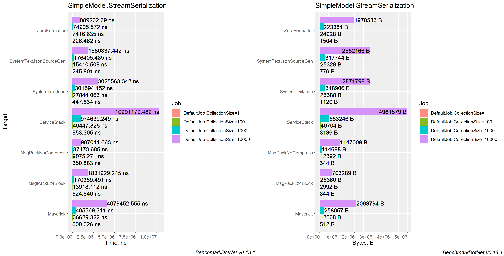

<a name="async-stream-simple-serialization"></a>
### Async Stream
| Method                  | Count |           Mean |        Error |       StdDev |      StdErr |        Op/s |   Allocated |
|-------------------------|-------|---------------:|-------------:|-------------:|------------:|------------:|------------:|
| SpanJson                | 1     |       255.3 ns |      2.84 ns |      2.52 ns |     0.67 ns | 3,917,199.8 |       416 B |
| Utf8Json                | 1     |       275.8 ns |      0.95 ns |      0.79 ns |     0.22 ns | 3,625,494.4 |       416 B |
| MsgPackClassic          | 1     |       444.8 ns |      3.68 ns |      3.26 ns |     0.87 ns | 2,248,399.7 |       416 B |
| SystemTextJsonSourceGen | 1     |       459.4 ns |      6.75 ns |      5.64 ns |     1.56 ns | 2,176,667.5 |       568 B |
| SystemTextJson          | 1     |       616.5 ns |      4.06 ns |      3.60 ns |     0.96 ns | 1,622,049.5 |       912 B |
| MsgPackLz4Block         | 1     |       644.6 ns |      6.11 ns |      5.11 ns |     1.42 ns | 1,551,386.1 |       416 B |
|                         |       |                |              |              |             |             |             |
| MsgPackClassic          | 100   |     8,821.5 ns |     55.51 ns |     46.35 ns |    12.86 ns |   113,360.0 |    12,448 B |
| Utf8Json                | 100   |    10,279.5 ns |    204.23 ns |    292.90 ns |    55.35 ns |    97,281.2 |     7,088 B |
| SpanJson                | 100   |    11,050.1 ns |     81.63 ns |     68.17 ns |    18.91 ns |    90,497.1 |     7,048 B |
| MsgPackLz4Block         | 100   |    14,701.4 ns |    159.18 ns |    148.89 ns |    38.44 ns |    68,020.7 |     3,024 B |
| SystemTextJson          | 100   |    26,010.3 ns |    305.50 ns |    285.77 ns |    73.79 ns |    38,446.3 |     7,552 B |
| SystemTextJsonSourceGen | 100   |    27,565.4 ns |    525.82 ns |    683.71 ns |   139.56 ns |    36,277.4 |     7,624 B |
|                         |       |                |              |              |             |             |             |
| MsgPackClassic          | 1000  |    89,767.2 ns |    669.92 ns |    559.41 ns |   155.15 ns |    11,139.9 |   114,720 B |
| SpanJson                | 1000  |   113,275.3 ns |    708.54 ns |    628.10 ns |   167.87 ns |     8,828.0 |    69,144 B |
| Utf8Json                | 1000  |   142,092.5 ns |    782.86 ns |    693.99 ns |   185.48 ns |     7,037.7 |   200,468 B |
| MsgPackLz4Block         | 1000  |   174,878.8 ns |  1,246.51 ns |  1,040.89 ns |   288.69 ns |     5,718.2 |    25,705 B |
| SystemTextJson          | 1000  |   282,964.0 ns |  2,238.02 ns |  2,093.45 ns |   540.53 ns |     3,534.0 |   222,319 B |
| SystemTextJsonSourceGen | 1000  |   287,754.2 ns |  1,756.06 ns |  1,556.70 ns |   416.05 ns |     3,475.2 |   222,453 B |
|                         |       |                |              |              |             |             |             |
| MsgPackClassic          | 10000 |   978,877.9 ns | 13,260.65 ns | 12,404.02 ns | 3,202.70 ns |     1,021.6 | 1,147,466 B |
| SpanJson                | 10000 | 1,204,935.9 ns |  5,788.25 ns |  5,131.14 ns | 1,371.35 ns |       829.9 |   690,425 B |
| Utf8Json                | 10000 | 1,622,142.5 ns | 31,149.81 ns | 29,137.55 ns | 7,523.28 ns |       616.5 | 2,658,676 B |
| MsgPackLz4Block         | 10000 | 1,855,153.8 ns |  5,931.03 ns |  5,257.70 ns | 1,405.18 ns |       539.0 |   699,432 B |
| SystemTextJson          | 10000 | 2,793,016.2 ns | 34,977.81 ns | 29,208.06 ns | 8,100.86 ns |       358.0 | 1,877,649 B |
| SystemTextJsonSourceGen | 10000 | 2,865,082.4 ns | 22,502.09 ns | 19,947.51 ns | 5,331.20 ns |       349.0 | 1,875,137 B |

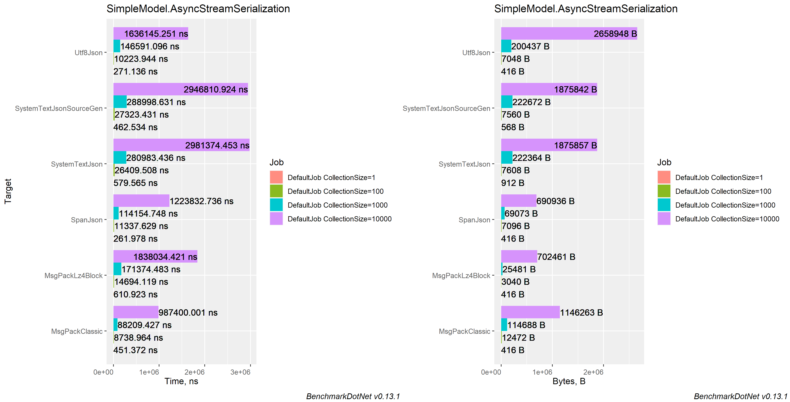

<a name="complex-model-serialization"></a>
## Complex Model

<a name="string-complex-serialization"></a>
### String
| Method                  | Count |           Mean |         Error |        StdDev |        StdErr |        Op/s |  Allocated |
|-------------------------|-------|---------------:|--------------:|--------------:|--------------:|------------:|-----------:|
| SpanJson                | 1     |       6.105 μs |     0.0225 μs |     0.0176 μs |     0.0051 μs | 163,812.737 |       3 KB |
| JsonSrcGen              | 1     |       6.348 μs |     0.0335 μs |     0.0297 μs |     0.0079 μs | 157,519.076 |       3 KB |
| SystemTextJsonSourceGen | 1     |       7.290 μs |     0.0584 μs |     0.0518 μs |     0.0138 μs | 137,177.390 |       4 KB |
| Jil                     | 1     |       7.825 μs |     0.0389 μs |     0.0325 μs |     0.0090 μs | 127,788.293 |       9 KB |
| Utf8Json                | 1     |       7.889 μs |     0.0529 μs |     0.0469 μs |     0.0125 μs | 126,753.869 |       5 KB |
| NetJson                 | 1     |       8.262 μs |     0.0495 μs |     0.0413 μs |     0.0115 μs | 121,034.203 |       9 KB |
| SystemTextJson          | 1     |       9.077 μs |     0.0801 μs |     0.0710 μs |     0.0190 μs | 110,162.569 |       4 KB |
| Maverick                | 1     |      10.392 μs |     0.0601 μs |     0.0502 μs |     0.0139 μs |  96,229.482 |       4 KB |
| ServiceStack            | 1     |      17.949 μs |     0.1269 μs |     0.1125 μs |     0.0301 μs |  55,712.817 |      13 KB |
| Newtonsoft              | 1     |      22.410 μs |     0.2053 μs |     0.1820 μs |     0.0486 μs |  44,623.393 |      16 KB |
|                         |       |                |               |               |               |             |            |
| SpanJson                | 100   |     702.801 μs |     1.9214 μs |     1.7033 μs |     0.4552 μs |   1,422.879 |     334 KB |
| JsonSrcGen              | 100   |     725.504 μs |     3.3819 μs |     2.9980 μs |     0.8012 μs |   1,378.351 |     287 KB |
| SystemTextJsonSourceGen | 100   |     846.067 μs |     3.7202 μs |     3.1065 μs |     0.8616 μs |   1,181.940 |     360 KB |
| Jil                     | 100   |     885.642 μs |    11.2893 μs |    10.5600 μs |     2.7266 μs |   1,129.124 |     797 KB |
| Utf8Json                | 100   |     928.001 μs |     3.4173 μs |     3.0293 μs |     0.8096 μs |   1,077.585 |     917 KB |
| SystemTextJson          | 100   |     983.954 μs |     3.1545 μs |     2.6341 μs |     0.7306 μs |   1,016.308 |     335 KB |
| Maverick                | 100   |   1,107.775 μs |     7.9623 μs |     7.4479 μs |     1.9230 μs |     902.710 |     338 KB |
| NetJson                 | 100   |   1,980.839 μs |    50.6089 μs |   149.2215 μs |    14.9222 μs |     504.837 |     927 KB |
| ServiceStack            | 100   |   2,394.218 μs |    47.4276 μs |    73.8391 μs |    13.0530 μs |     417.673 |   1,313 KB |
| Newtonsoft              | 100   |   2,770.963 μs |    53.1877 μs |   139.1829 μs |    15.5611 μs |     360.885 |   1,451 KB |
|                         |       |                |               |               |               |             |            |
| SpanJson                | 1000  |   7,371.553 μs |    43.6630 μs |    40.8424 μs |    10.5455 μs |     135.657 |   3,337 KB |
| JsonSrcGen              | 1000  |   7,508.340 μs |    41.0574 μs |    36.3963 μs |     9.7273 μs |     133.185 |   2,871 KB |
| SystemTextJsonSourceGen | 1000  |   8,848.632 μs |    82.8188 μs |    73.4167 μs |    19.6214 μs |     113.012 |   3,596 KB |
| Utf8Json                | 1000  |   9,574.721 μs |   146.4545 μs |   136.9936 μs |    35.3716 μs |     104.442 |   9,299 KB |
| SystemTextJson          | 1000  |  10,350.651 μs |    80.2127 μs |    66.9812 μs |    18.5772 μs |      96.612 |   3,339 KB |
| Jil                     | 1000  |  11,038.392 μs |   220.4344 μs |   528.1469 μs |    64.0472 μs |      90.593 |   7,866 KB |
| Maverick                | 1000  |  11,634.170 μs |   175.1982 μs |   155.3086 μs |    41.5080 μs |      85.954 |   4,793 KB |
| NetJson                 | 1000  |  14,833.662 μs |   193.2752 μs |   180.7897 μs |    46.6797 μs |      67.414 |   9,274 KB |
| ServiceStack            | 1000  |  22,595.352 μs |    76.5616 μs |    59.7743 μs |    17.2553 μs |      44.257 |  13,123 KB |
| Newtonsoft              | 1000  |  28,811.315 μs |   559.1400 μs |   523.0199 μs |   135.0432 μs |      34.709 |  14,404 KB |
|                         |       |                |               |               |               |             |            |
| SpanJson                | 10000 |  77,325.242 μs |   931.5332 μs |   825.7799 μs |   220.6990 μs |      12.932 |  33,359 KB |
| JsonSrcGen              | 10000 |  78,277.016 μs |   532.4405 μs |   498.0451 μs |   128.5947 μs |      12.775 |  28,698 KB |
| SystemTextJsonSourceGen | 10000 |  97,010.241 μs |   678.3523 μs |   634.5311 μs |   163.8352 μs |      10.308 |  35,938 KB |
| NetJson                 | 10000 |  98,540.074 μs |   419.4734 μs |   371.8522 μs |    99.3817 μs |      10.148 |  92,733 KB |
| Jil                     | 10000 | 102,827.425 μs | 2,205.3555 μs | 6,467.9259 μs |   650.0510 μs |       9.725 |  78,581 KB |
| SystemTextJson          | 10000 | 115,290.609 μs |   908.6041 μs |   758.7256 μs |   210.4326 μs |       8.674 |  33,363 KB |
| Utf8Json                | 10000 | 120,793.874 μs | 1,053.3640 μs |   933.7798 μs |   249.5631 μs |       8.279 | 118,673 KB |
| Maverick                | 10000 | 128,438.984 μs | 2,557.1422 μs | 5,612.9892 μs |   737.0216 μs |       7.786 |  50,281 KB |
| ServiceStack            | 10000 | 189,048.959 μs | 3,744.3993 μs | 5,488.4920 μs | 1,019.1874 μs |       5.290 | 131,225 KB |
| Newtonsoft              | 10000 | 258,177.150 μs | 4,959.2079 μs | 6,090.3527 μs | 1,298.4676 μs |       3.873 | 143,955 KB |

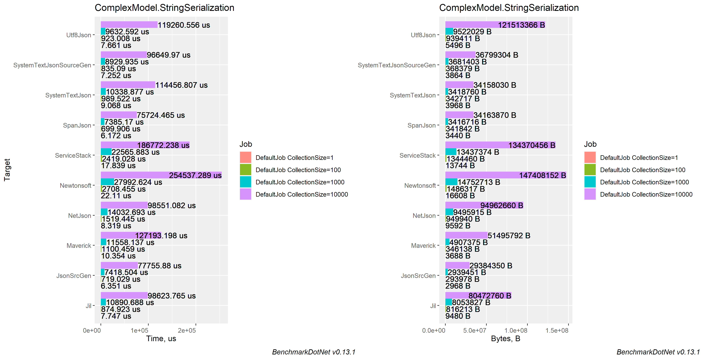

<a name="byte-complex-serialization"></a>
### Byte
| Method                  | Count |             Mean |           Error |          StdDev |        StdErr |          Op/s |    Allocated |
|-------------------------|-------|-----------------:|----------------:|----------------:|--------------:|--------------:|-------------:|
| ZeroFormatter           | 1     |         784.3 ns |         8.21 ns |         7.28 ns |       1.94 ns | 1,274,965.206 |      1,880 B |
| MsgPackClassic          | 1     |       1,573.4 ns |        23.35 ns |        21.84 ns |       5.64 ns |   635,546.622 |        976 B |
| MsgPackLz4Block         | 1     |       3,714.1 ns |        58.67 ns |        45.81 ns |      13.22 ns |   269,244.811 |        920 B |
| JsonSrcGen              | 1     |       6,115.8 ns |        31.41 ns |        26.23 ns |       7.27 ns |   163,510.595 |      1,760 B |
| SpanJson                | 1     |       6,581.9 ns |        57.34 ns |        53.63 ns |      13.85 ns |   151,931.244 |      1,744 B |
| SystemTextJsonSourceGen | 1     |       7,154.3 ns |        80.64 ns |        71.49 ns |      19.11 ns |   139,776.682 |      2,152 B |
| Utf8Json                | 1     |       7,485.1 ns |       137.50 ns |       178.79 ns |      36.50 ns |   133,598.842 |      2,072 B |
| SystemTextJson          | 1     |       9,004.7 ns |        65.28 ns |        57.87 ns |      15.47 ns |   111,053.380 |      2,232 B |
|                         |       |                  |                 |                 |               |               |              |
| ZeroFormatter           | 100   |     105,367.5 ns |     1,872.49 ns |     1,563.61 ns |     433.67 ns |     9,490.589 |    337,334 B |
| MsgPackClassic          | 100   |     182,932.6 ns |     1,061.19 ns |       886.14 ns |     245.77 ns |     5,466.493 |     94,359 B |
| MsgPackLz4Block         | 100   |     359,544.8 ns |     3,331.07 ns |     2,781.59 ns |     771.47 ns |     2,781.294 |     80,648 B |
| JsonSrcGen              | 100   |     710,035.2 ns |     3,398.91 ns |     3,013.05 ns |     805.27 ns |     1,408.381 |    173,500 B |
| SpanJson                | 100   |     734,860.8 ns |     5,596.86 ns |     4,961.47 ns |   1,326.01 ns |     1,360.802 |    170,888 B |
| SystemTextJsonSourceGen | 100   |     799,515.4 ns |     3,279.86 ns |     2,738.83 ns |     759.62 ns |     1,250.758 |    197,565 B |
| Utf8Json                | 100   |     869,213.6 ns |     4,632.48 ns |     4,333.22 ns |   1,118.83 ns |     1,150.465 |    597,587 B |
| SystemTextJson          | 100   |     956,476.4 ns |     6,487.27 ns |     5,417.16 ns |   1,502.45 ns |     1,045.504 |    171,475 B |
|                         |       |                  |                 |                 |               |               |              |
| ZeroFormatter           | 1000  |   1,292,420.5 ns |    25,253.81 ns |    33,713.12 ns |   6,742.62 ns |       773.742 |  2,854,522 B |
| MsgPackClassic          | 1000  |   1,970,134.0 ns |    33,834.15 ns |    29,993.09 ns |   8,015.99 ns |       507.580 |    942,930 B |
| MsgPackLz4Block         | 1000  |   3,949,784.2 ns |    40,973.18 ns |    31,989.17 ns |   9,234.48 ns |       253.178 |    804,363 B |
| SpanJson                | 1000  |   7,826,963.3 ns |   154,038.06 ns |   253,088.94 ns |  42,779.84 ns |       127.763 |  1,708,392 B |
| JsonSrcGen              | 1000  |   8,173,284.3 ns |    86,679.64 ns |    76,839.24 ns |  20,536.15 ns |       122.350 |  1,733,630 B |
| SystemTextJsonSourceGen | 1000  |   8,418,001.8 ns |    99,407.65 ns |    88,122.30 ns |  23,551.67 ns |       118.793 |  1,972,946 B |
| Utf8Json                | 1000  |   9,275,657.8 ns |   102,758.84 ns |    96,120.68 ns |  24,818.25 ns |       107.809 |  6,103,866 B |
| SystemTextJson          | 1000  |  10,087,989.8 ns |    76,436.43 ns |    67,758.90 ns |  18,109.33 ns |        99.128 |  1,710,101 B |
|                         |       |                  |                 |                 |               |               |              |
| ZeroFormatter           | 10000 |  14,566,211.2 ns |   287,921.94 ns |   661,548.53 ns |  83,347.28 ns |        68.652 | 24,351,906 B |
| MsgPackClassic          | 10000 |  21,303,772.3 ns |   323,762.36 ns |   287,006.90 ns |  76,705.82 ns |        46.940 |  9,427,828 B |
| MsgPackLz4Block         | 10000 |  41,879,893.9 ns |   688,684.60 ns |   644,196.00 ns | 166,330.69 ns |        23.878 |  8,039,796 B |
| JsonSrcGen              | 10000 |  70,788,401.9 ns | 1,019,747.36 ns |   953,872.31 ns | 246,288.77 ns |        14.127 | 17,332,507 B |
| SpanJson                | 10000 |  79,261,026.7 ns | 1,322,833.11 ns | 1,237,378.91 ns | 319,489.86 ns |        12.617 | 17,082,577 B |
| SystemTextJsonSourceGen | 10000 | 100,773,397.1 ns | 1,016,226.51 ns |   900,858.33 ns | 240,764.52 ns |         9.923 | 19,723,037 B |
| Utf8Json                | 10000 | 108,272,337.5 ns | 2,102,728.64 ns | 3,273,695.17 ns | 578,713.01 ns |         9.236 | 87,353,472 B |
| SystemTextJson          | 10000 | 119,428,050.0 ns |   997,335.85 ns |   884,112.26 ns | 236,288.94 ns |         8.373 | 17,081,571 B |

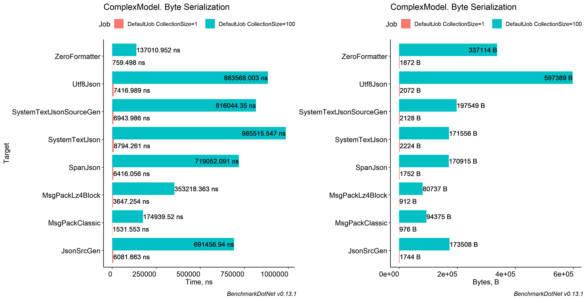

<a name="stream-complex-serialization"></a>
### Stream
| Method                  | Count |             Mean |           Error |          StdDev |          StdErr |          Op/s |     Allocated |
|-------------------------|-------|-----------------:|----------------:|----------------:|----------------:|--------------:|--------------:|
| ZeroFormatter           | 1     |         863.4 ns |         2.96 ns |         2.77 ns |         0.72 ns | 1,158,236.513 |       2,728 B |
| MsgPackNoCompress       | 1     |       1,711.5 ns |        12.65 ns |        11.84 ns |         3.06 ns |   584,283.786 |       1,032 B |
| MsgPackLz4Block         | 1     |       3,881.9 ns |        36.24 ns |        32.12 ns |         8.58 ns |   257,607.575 |         976 B |
| SystemTextJsonSourceGen | 1     |       7,932.5 ns |        49.11 ns |        41.01 ns |        11.37 ns |   126,062.962 |      10,592 B |
| SystemTextJson          | 1     |       9,533.1 ns |        61.61 ns |        51.45 ns |        14.27 ns |   104,898.001 |       7,208 B |
| Maverick                | 1     |      10,107.4 ns |        55.77 ns |        49.44 ns |        13.21 ns |    98,937.814 |       1,968 B |
| ServiceStack            | 1     |      19,392.8 ns |       146.71 ns |       122.51 ns |        33.98 ns |    51,565.588 |      18,800 B |
|                         |       |                  |                 |                 |                 |               |               |
| ZeroFormatter           | 100   |     190,057.0 ns |     4,641.38 ns |    13,465.48 ns |     1,367.21 ns |     5,261.581 |     412,861 B |
| MsgPackNoCompress       | 100   |     192,362.4 ns |     1,106.83 ns |       981.17 ns |       262.23 ns |     5,198.520 |     262,294 B |
| MsgPackLz4Block         | 100   |     378,819.9 ns |     1,878.80 ns |     1,665.51 ns |       445.13 ns |     2,639.777 |     182,699 B |
| SystemTextJsonSourceGen | 100   |     856,778.8 ns |     2,233.48 ns |     1,979.92 ns |       529.16 ns |     1,167.162 |     469,128 B |
| SystemTextJson          | 100   |   1,064,518.7 ns |     6,127.81 ns |     5,432.15 ns |     1,451.80 ns |       939.392 |     694,006 B |
| Maverick                | 100   |   1,094,772.3 ns |     7,261.17 ns |     6,792.11 ns |     1,753.71 ns |       913.432 |     519,624 B |
| ServiceStack            | 100   |   2,784,574.6 ns |    34,743.07 ns |    30,798.83 ns |     8,231.33 ns |       359.121 |   1,530,763 B |
|                         |       |                  |                 |                 |                 |               |               |
| ZeroFormatter           | 1000  |   1,519,598.9 ns |    63,780.22 ns |   177,793.76 ns |    18,741.11 ns |       658.068 |   3,611,076 B |
| MsgPackNoCompress       | 1000  |   1,966,636.7 ns |    15,770.85 ns |    13,980.45 ns |     3,736.43 ns |       508.482 |   2,326,077 B |
| MsgPackLz4Block         | 1000  |   3,834,052.5 ns |    13,051.01 ns |    11,569.38 ns |     3,092.05 ns |       260.821 |   1,853,191 B |
| SystemTextJsonSourceGen | 1000  |   8,801,564.4 ns |    70,879.68 ns |    62,832.99 ns |    16,792.82 ns |       113.616 |   3,790,524 B |
| SystemTextJson          | 1000  |  10,828,768.5 ns |    81,595.08 ns |    72,331.91 ns |    19,331.52 ns |        92.347 |   6,104,388 B |
| Maverick                | 1000  |  11,088,400.0 ns |    60,469.45 ns |    56,563.16 ns |    14,604.54 ns |        90.184 |   4,182,416 B |
| ServiceStack            | 1000  |  26,345,980.3 ns |   174,089.57 ns |   145,372.68 ns |    40,319.13 ns |        37.956 |  14,217,086 B |
|                         |       |                  |                 |                 |                 |               |               |
| ZeroFormatter           | 10000 |  16,709,999.4 ns |   371,867.37 ns | 1,096,459.32 ns |   109,645.93 ns |        59.844 |  31,926,144 B |
| MsgPackNoCompress       | 10000 |  20,818,877.7 ns |   211,143.24 ns |   197,503.52 ns |    50,995.19 ns |        48.033 |  18,830,837 B |
| MsgPackLz4Block         | 10000 |  41,739,345.6 ns |   269,213.54 ns |   251,822.51 ns |    65,020.29 ns |        23.958 |  30,725,369 B |
| SystemTextJsonSourceGen | 10000 |  97,906,786.4 ns | 1,903,084.01 ns | 2,337,158.07 ns |   498,283.78 ns |        10.214 |  58,645,380 B |
| SystemTextJson          | 10000 | 111,676,232.4 ns | 2,171,377.63 ns | 3,182,777.18 ns |   591,026.89 ns |         8.954 |  52,565,061 B |
| Maverick                | 10000 | 115,430,413.3 ns | 2,283,940.86 ns | 2,136,399.70 ns |   551,616.03 ns |         8.663 |  66,958,816 B |
| ServiceStack            | 10000 | 206,347,175.0 ns | 4,124,690.87 ns | 4,750,000.14 ns | 1,062,132.32 ns |         4.846 | 167,276,672 B |


<a name="async-stream-complex-serialization"></a>
### Async Stream
| Method                  | Count |           Mean |         Error |        StdDev |      StdErr |        Op/s | Allocated |
|-------------------------|-------|---------------:|--------------:|--------------:|------------:|------------:|----------:|
| MsgPackClassic          | 1     |       1.884 μs |     0.0115 μs |     0.0108 μs |   0.0028 μs | 530,663.315 |      1 KB |
| MsgPackLz4Block         | 1     |       4.012 μs |     0.0330 μs |     0.0276 μs |   0.0076 μs | 249,248.668 |      1 KB |
| SpanJson                | 1     |       6.530 μs |     0.0305 μs |     0.0271 μs |   0.0072 μs | 153,145.596 |      2 KB |
| Utf8Json                | 1     |       7.647 μs |     0.0623 μs |     0.0552 μs |   0.0147 μs | 130,767.472 |      2 KB |
| SystemTextJson          | 1     |       9.450 μs |     0.0889 μs |     0.0831 μs |   0.0215 μs | 105,823.841 |      2 KB |
| SystemTextJsonSourceGen | 1     |       9.919 μs |     0.0385 μs |     0.0321 μs |   0.0089 μs | 100,812.170 |      2 KB |
|                         |       |                |               |               |             |             |           |
| MsgPackClassic          | 100   |     192.035 μs |     0.7789 μs |     0.6081 μs |   0.1755 μs |   5,207.376 |    256 KB |
| MsgPackLz4Block         | 100   |     378.441 μs |     1.9901 μs |     1.7642 μs |   0.4715 μs |   2,642.420 |    178 KB |
| SpanJson                | 100   |     713.321 μs |     1.7420 μs |     1.4546 μs |   0.4034 μs |   1,401.894 |    167 KB |
| Utf8Json                | 100   |     875.665 μs |     4.8526 μs |     4.3017 μs |   1.1497 μs |   1,141.990 |    583 KB |
| SystemTextJson          | 100   |     988.235 μs |     9.7932 μs |     8.6814 μs |   2.3202 μs |   1,011.905 |    449 KB |
| SystemTextJsonSourceGen | 100   |     993.734 μs |     5.5584 μs |     4.9274 μs |   1.3169 μs |   1,006.306 |    450 KB |
|                         |       |                |               |               |             |             |           |
| MsgPackClassic          | 1000  |   1,947.053 μs |    25.4849 μs |    23.8386 μs |   6.1551 μs |     513.597 |  2,273 KB |
| MsgPackLz4Block         | 1000  |   4,000.512 μs |    35.1663 μs |    31.1740 μs |   8.3316 μs |     249.968 |  1,810 KB |
| SpanJson                | 1000  |   7,226.861 μs |    20.6550 μs |    19.3207 μs |   4.9886 μs |     138.373 |  1,670 KB |
| Utf8Json                | 1000  |   8,895.726 μs |    65.9609 μs |    58.4726 μs |  15.6275 μs |     112.414 |  5,962 KB |
| SystemTextJsonSourceGen | 1000  |   9,883.265 μs |    74.9354 μs |    70.0946 μs |  18.0984 μs |     101.181 |  3,690 KB |
| SystemTextJson          | 1000  |   9,921.196 μs |    69.6673 μs |    61.7583 μs |  16.5056 μs |     100.794 |  3,681 KB |
|                         |       |                |               |               |             |             |           |
| MsgPackClassic          | 10000 |  27,226.241 μs |   521.1469 μs | 1,076.2587 μs | 149.2502 μs |      36.729 | 36,794 KB |
| MsgPackLz4Block         | 10000 |  45,913.671 μs |   900.2907 μs |   842.1325 μs | 217.4377 μs |      21.780 | 29,985 KB |
| SpanJson                | 10000 |  77,334.139 μs | 1,278.8902 μs | 1,196.2747 μs | 308.8768 μs |      12.931 | 16,682 KB |
| Utf8Json                | 10000 | 110,359.182 μs | 2,160.6834 μs | 3,167.1017 μs | 588.1160 μs |       9.061 | 85,307 KB |
| SystemTextJsonSourceGen | 10000 | 117,840.268 μs | 1,739.4272 μs | 1,627.0613 μs | 420.1054 μs |       8.486 | 59,223 KB |
| SystemTextJson          | 10000 | 118,762.563 μs | 1,641.8328 μs | 1,455.4420 μs | 388.9832 μs |       8.420 |      1.00 |

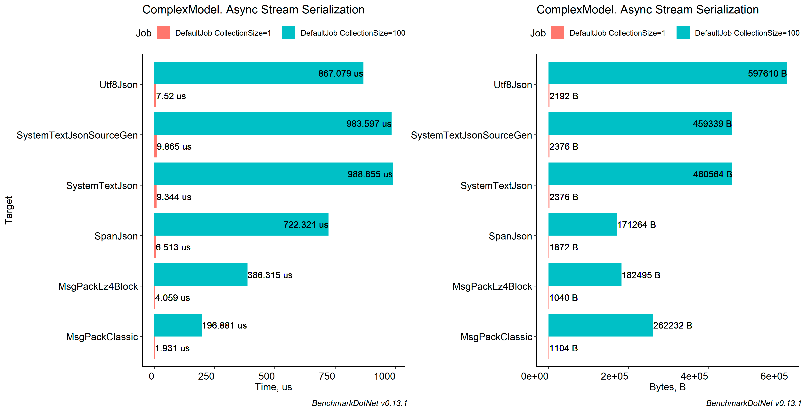

<a name="conclusions"></a>
## Conclusions

Personally I will recommend using `SpanJson`. It has clean api and no additional overhead.
The two fastest are `MessagePack` and `Protobuf`, but they come with cost of compatibility with other serializers and have extraordinary API. (Because they are binary serializers).

As for `JsonSrcGen`, it has major drawbacks as `[assembly]` writing in `Program.cs` and no support for critical collections as Dictionary with int key and Enums. Do not recommend to use for now.

`SpanJson` is good at combining with `System.Text.Json` or `Newtonsoft.Json`, so consider using it in your project