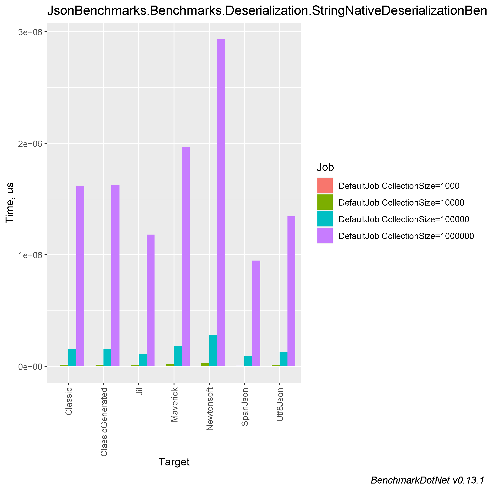
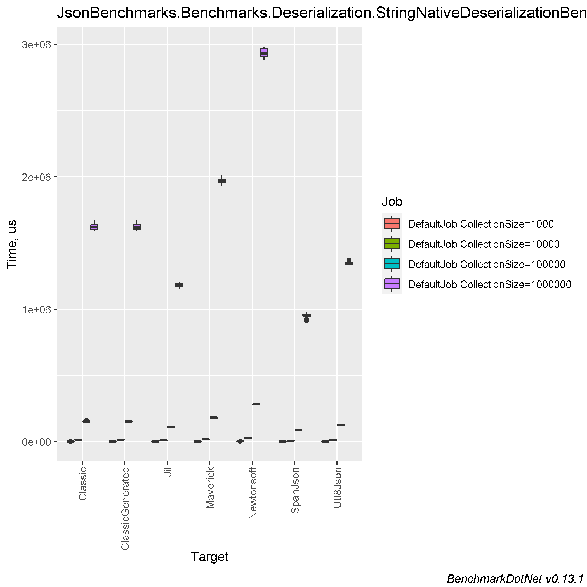
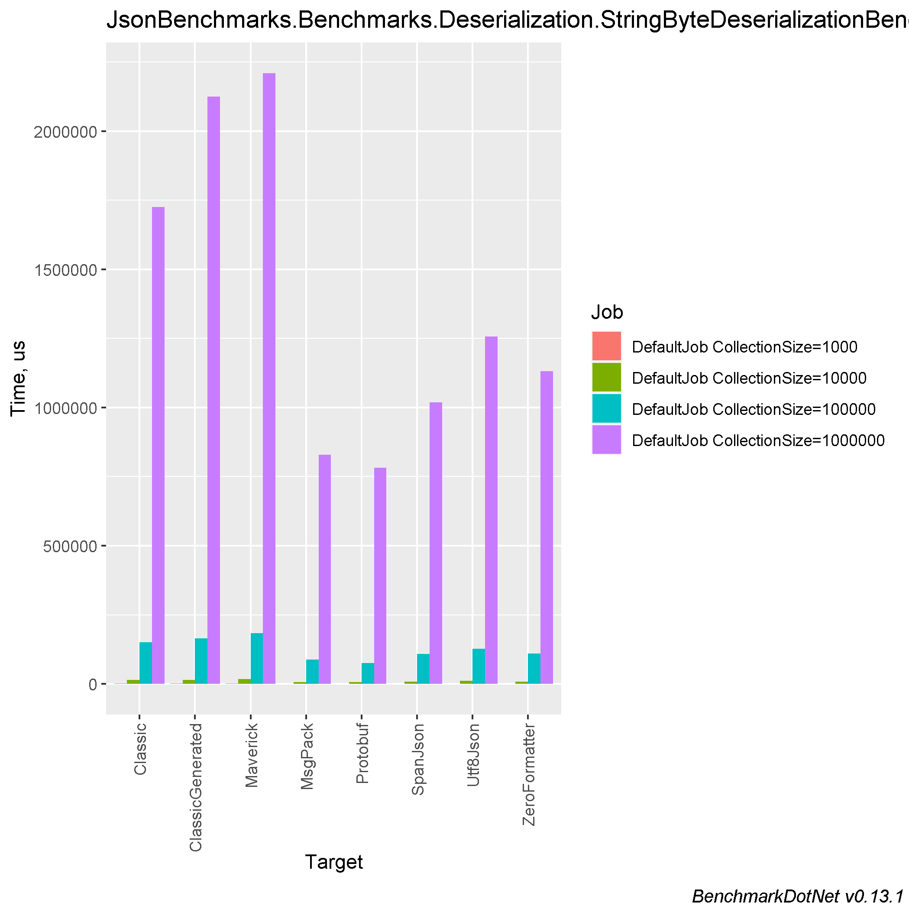
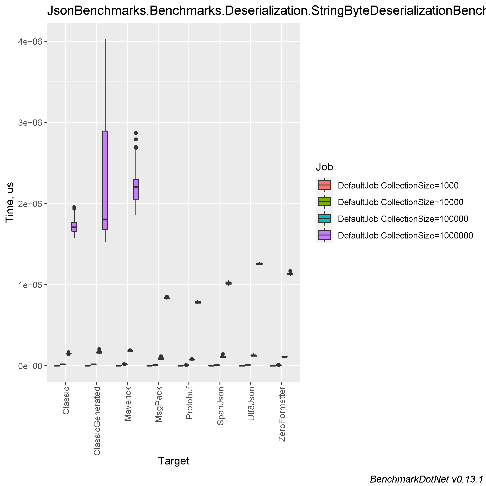
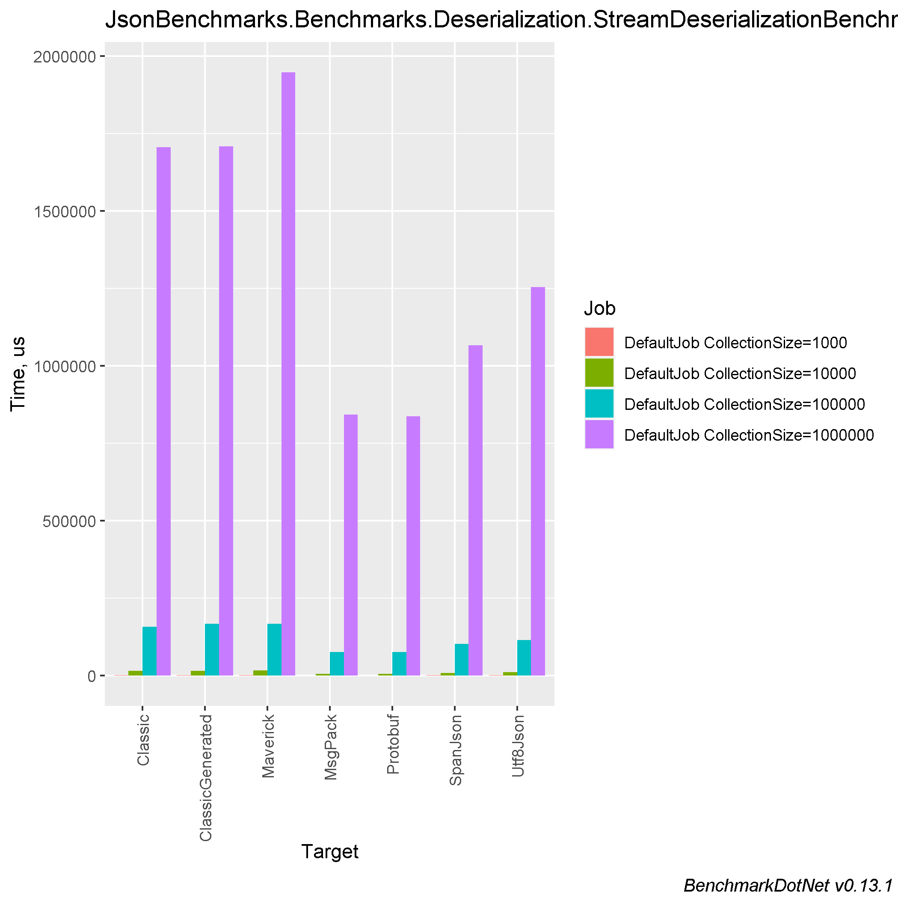
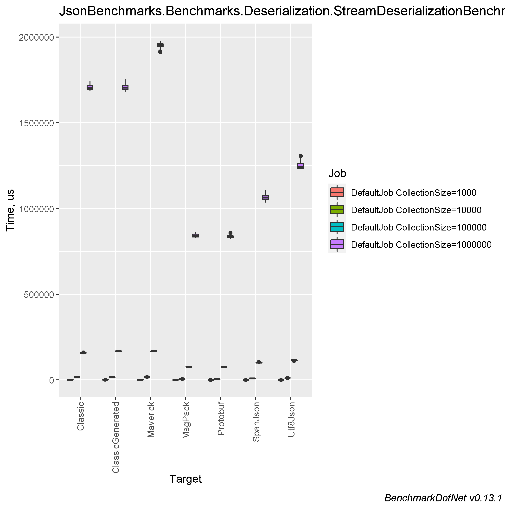

# Comparing different libraries for Json Serialization/Deserialization

### Table of contents
- [Machine information](#machine-information)
- [Sources](#sources)
- [Benchmark results](#benchmark-results)
  * [Deserialization](#deserialization)
    * [String](#string-des)
    * [Byte string](#byte-string-des)
    * [Stream](#stream-des)
    * [Asynchronous stream](#asynchronous-stream-des)
  * [Serialization](#serialization)
    * [String](#string-ser)
    * [Byte](#byte-ser)
    * [Stream](#stream-ser)
    * [Asynchronous stream](#asynchronous-stream-ser)
- [Conclusions](#conclusions)

<a name="machine-information"></a>
## Machine Information

``` ini
BenchmarkDotNet=v0.13.1, OS=Windows 10.0.22621
Intel Core i7-8550U CPU 1.80GHz (Kaby Lake R), 1 CPU, 8 logical and 4 physical cores
.NET SDK=6.0.202
  [Host]     : .NET 6.0.4 (6.0.422.16404), X64 RyuJIT
  DefaultJob : .NET 6.0.4 (6.0.422.16404), X64 RyuJIT
```
<a name="sources"></a>
## Sources

Currently, following Json Serialization/Deserialization libraries were used:

- MaverickJson : https://github.com/zlatanov/json
- SpanJson : https://github.com/Tornhoof/SpanJson
- MsgPack : https://github.com/neuecc/MessagePack-CSharp
- Jil : https://github.com/kevin-montrose/Jil
- Utf8Json : https://github.com/neuecc/Utf8Json
- Newtonsoft.Json : https://github.com/JamesNK/Newtonsoft.Json
- Protobuf.Net : https://github.com/protobuf-net/protobuf-net
- ZeroFormatter : https://github.com/alexinea/Alexinea.ZeroFormatter/ (fork with fixes) **Note** This library is no longer supported, so i use this fork with fixes.

<a name="benchmark-results"></a>
## Benchmark results

<a name="deserialization"></a>
## Deserialization

<a name="string-des"></a>
### String

| Method                  | CollectionSize |           Mean |        Error |       StdDev |      StdErr |            Min |             Q1 |         Median |             Q3 |            Max |       Op/s | Ratio | RatioSD |      Gen 0 |      Gen 1 |    Gen 2 |  Allocated |
|-------------------------|----------------|---------------:|-------------:|-------------:|------------:|---------------:|---------------:|---------------:|---------------:|---------------:|-----------:|------:|--------:|-----------:|-----------:|---------:|-----------:|
| SpanJson                | 1000           |       600.7 μs |      5.68 μs |      4.74 μs |     1.31 μs |       593.9 μs |       596.7 μs |       602.4 μs |       603.6 μs |       610.3 μs | 1,664.6227 |  0.50 |    0.01 |    36.1328 |    15.6250 |        - |     183 KB |
| Jil                     | 1000           |       868.0 μs |      5.89 μs |      5.51 μs |     1.42 μs |       856.9 μs |       863.8 μs |       868.9 μs |       872.6 μs |       874.3 μs | 1,152.0349 |  0.72 |    0.01 |    36.1328 |    13.6719 |        - |     191 KB |
| Utf8Json                | 1000           |       993.9 μs |     19.49 μs |     20.01 μs |     4.85 μs |       972.5 μs |       978.0 μs |       982.2 μs |     1,008.3 μs |     1,029.7 μs | 1,006.0892 |  0.82 |    0.02 |    71.2891 |    61.5234 |  38.0859 |     330 KB |
| SystemTextJson          | 1000           |     1,204.9 μs |     21.91 μs |     19.42 μs |     5.19 μs |     1,180.1 μs |     1,192.8 μs |     1,201.6 μs |     1,210.6 μs |     1,242.5 μs |   829.9323 |  1.00 |    0.00 |    37.1094 |    15.6250 |        - |     192 KB |
| SystemTextJsonSourceGen | 1000           |     1,223.7 μs |     21.05 μs |     19.69 μs |     5.08 μs |     1,193.5 μs |     1,210.5 μs |     1,214.3 μs |     1,238.4 μs |     1,259.4 μs |   817.2239 |  1.02 |    0.02 |    37.1094 |    15.6250 |        - |     192 KB |
| Maverick                | 1000           |     1,580.5 μs |     18.11 μs |     16.94 μs |     4.37 μs |     1,562.9 μs |     1,567.3 μs |     1,573.0 μs |     1,593.2 μs |     1,615.4 μs |   632.7300 |  1.31 |    0.03 |    41.0156 |    11.7188 |        - |     203 KB |
| Newtonsoft              | 1000           |     2,284.5 μs |     30.48 μs |     27.02 μs |     7.22 μs |     2,246.5 μs |     2,265.5 μs |     2,283.6 μs |     2,297.1 μs |     2,345.4 μs |   437.7352 |  1.90 |    0.04 |    89.8438 |    42.9688 |        - |     477 KB |
|                         |                |                |              |              |             |                |                |                |                |                |            |       |         |            |            |          |            |
| SpanJson                | 10000          |     6,931.8 μs |     41.26 μs |     38.60 μs |     9.97 μs |     6,890.2 μs |     6,899.9 μs |     6,916.8 μs |     6,948.0 μs |     7,000.7 μs |   144.2623 |  0.48 |    0.01 |   296.8750 |   148.4375 |        - |   1,827 KB |
| Jil                     | 10000          |    10,435.8 μs |    169.21 μs |    158.27 μs |    40.87 μs |    10,177.0 μs |    10,344.9 μs |    10,420.3 μs |    10,541.9 μs |    10,743.4 μs |    95.8239 |  0.72 |    0.01 |   328.1250 |   125.0000 |  31.2500 |   2,005 KB |
| Utf8Json                | 10000          |    12,098.3 μs |     75.56 μs |     66.98 μs |    17.90 μs |    11,975.0 μs |    12,050.9 μs |    12,105.5 μs |    12,148.1 μs |    12,211.9 μs |    82.6564 |  0.83 |    0.01 |   359.3750 |   203.1250 |  93.7500 |   3,387 KB |
| SystemTextJson          | 10000          |    14,533.7 μs |    178.76 μs |    158.47 μs |    42.35 μs |    14,290.4 μs |    14,413.9 μs |    14,535.0 μs |    14,634.2 μs |    14,858.8 μs |    68.8058 |  1.00 |    0.00 |   375.0000 |   203.1250 | 109.3750 |   3,387 KB |
| SystemTextJsonSourceGen | 10000          |    14,721.1 μs |    188.29 μs |    176.12 μs |    45.48 μs |    14,414.4 μs |    14,606.6 μs |    14,709.0 μs |    14,840.1 μs |    15,041.5 μs |    67.9298 |  1.01 |    0.02 |   375.0000 |   203.1250 | 109.3750 |   3,387 KB |
| Maverick                | 10000          |    19,172.8 μs |    265.92 μs |    248.75 μs |    64.23 μs |    18,658.1 μs |    19,049.9 μs |    19,176.7 μs |    19,353.5 μs |    19,625.8 μs |    52.1571 |  1.32 |    0.02 |   562.5000 |   218.7500 |  62.5000 |   3,244 KB |
| Newtonsoft              | 10000          |    27,905.5 μs |    443.83 μs |    370.62 μs |   102.79 μs |    27,129.3 μs |    27,709.0 μs |    27,901.8 μs |    28,133.9 μs |    28,530.3 μs |    35.8352 |  1.92 |    0.04 |   812.5000 |   281.2500 |  93.7500 |   4,823 KB |
|                         |                |                |              |              |             |                |                |                |                |                |            |       |         |            |            |          |            |
| SpanJson                | 100000         |    89,392.9 μs |  1,495.82 μs |  1,399.19 μs |   361.27 μs |    86,903.7 μs |    88,554.6 μs |    88,978.7 μs |    90,334.1 μs |    92,309.2 μs |    11.1866 |  0.58 |    0.01 |  3166.6667 |  1333.3333 | 333.3333 |  18,266 KB |
| Jil                     | 100000         |   111,001.1 μs |  1,072.98 μs |    895.98 μs |   248.50 μs |   109,332.6 μs |   110,450.8 μs |   110,808.6 μs |   111,645.1 μs |   112,571.6 μs |     9.0089 |  0.72 |    0.01 |  3000.0000 |  1200.0000 | 200.0000 |  19,533 KB |
| Utf8Json                | 100000         |   126,188.5 μs |  1,883.14 μs |  1,761.49 μs |   454.81 μs |   124,011.0 μs |   124,863.2 μs |   125,595.6 μs |   127,706.7 μs |   129,243.8 μs |     7.9247 |  0.82 |    0.02 |  3000.0000 |  1250.0000 | 250.0000 |  33,348 KB |
| SystemTextJson          | 100000         |   154,180.3 μs |  2,849.46 μs |  2,379.43 μs |   659.93 μs |   151,207.5 μs |   152,929.8 μs |   153,687.6 μs |   155,229.8 μs |   159,391.9 μs |     6.4859 |  1.00 |    0.00 |  3000.0000 |  1250.0000 | 250.0000 |  33,348 KB |
| SystemTextJsonSourceGen | 100000         |   154,239.8 μs |  2,285.70 μs |  2,138.04 μs |   552.04 μs |   150,125.4 μs |   153,170.1 μs |   153,469.7 μs |   155,570.9 μs |   158,639.6 μs |     6.4834 |  1.00 |    0.02 |  3000.0000 |  1250.0000 | 250.0000 |  33,348 KB |
| Maverick                | 100000         |   181,069.5 μs |  3,193.49 μs |  2,987.19 μs |   771.29 μs |   176,378.5 μs |   178,869.6 μs |   181,661.1 μs |   182,575.0 μs |   186,929.0 μs |     5.5227 |  1.17 |    0.02 |  5000.0000 |  2000.0000 |        - |  34,231 KB |
| Newtonsoft              | 100000         |   283,909.3 μs |  2,190.21 μs |  1,828.93 μs |   507.25 μs |   281,726.4 μs |   282,442.0 μs |   283,586.2 μs |   284,892.3 μs |   288,251.5 μs |     3.5223 |  1.84 |    0.03 |  7000.0000 |  2000.0000 |        - |  47,666 KB |
|                         |                |                |              |              |             |                |                |                |                |                |            |       |         |            |            |          |            |
| SpanJson                | 1000000        |   949,570.2 μs | 18,240.14 μs | 18,731.28 μs | 4,543.00 μs |   915,064.5 μs |   947,948.0 μs |   955,429.1 μs |   961,739.8 μs |   978,981.6 μs |     1.0531 |  0.58 |    0.02 | 28000.0000 |  9000.0000 |        - | 182,681 KB |
| Jil                     | 1000000        | 1,182,723.4 μs | 16,863.47 μs | 15,774.10 μs | 4,072.86 μs | 1,153,978.3 μs | 1,168,572.2 μs | 1,184,302.1 μs | 1,193,182.2 μs | 1,207,311.7 μs |     0.8455 |  0.73 |    0.01 | 28000.0000 |  9000.0000 |        - | 191,253 KB |
| Utf8Json                | 1000000        | 1,345,978.1 μs | 11,743.32 μs |  9,806.20 μs | 2,719.75 μs | 1,333,916.2 μs | 1,339,729.2 μs | 1,342,782.2 μs | 1,350,410.1 μs | 1,369,596.9 μs |     0.7430 |  0.83 |    0.01 | 28000.0000 |  9000.0000 |        - | 329,400 KB |
| SystemTextJson          | 1000000        | 1,621,824.5 μs | 27,129.69 μs | 25,377.13 μs | 6,552.35 μs | 1,589,490.9 μs | 1,603,499.4 μs | 1,621,064.0 μs | 1,637,453.4 μs | 1,670,535.2 μs |     0.6166 |  1.00 |    0.00 | 28000.0000 |  9000.0000 |        - | 329,404 KB |
| SystemTextJsonSourceGen | 1000000        | 1,622,151.6 μs | 24,597.43 μs | 23,008.45 μs | 5,940.76 μs | 1,592,347.7 μs | 1,604,899.6 μs | 1,617,780.6 μs | 1,638,880.8 μs | 1,673,925.5 μs |     0.6165 |  1.00 |    0.02 | 28000.0000 |  9000.0000 |        - | 329,401 KB |
| Maverick                | 1000000        | 1,967,597.9 μs | 26,962.78 μs | 22,515.14 μs | 6,244.58 μs | 1,927,374.8 μs | 1,955,955.2 μs | 1,968,860.1 μs | 1,979,703.1 μs | 2,012,425.5 μs |     0.5082 |  1.22 |    0.02 | 51000.0000 | 17000.0000 |        - | 340,951 KB |
| Newtonsoft              | 1000000        | 2,934,562.0 μs | 37,890.05 μs | 31,639.91 μs | 8,775.33 μs | 2,881,069.7 μs | 2,909,509.1 μs | 2,930,660.2 μs | 2,966,308.5 μs | 2,978,517.3 μs |     0.3408 |  1.81 |    0.03 | 74000.0000 | 20000.0000 |        - | 472,507 KB |




<a name="byte-string-des"></a>
### Byte string

| Method                  | CollectionSize |           Mean |         Error |        StdDev |       StdErr |         Median |            Min |             Q1 |             Q3 |            Max |       Op/s | Ratio | RatioSD |      Gen 0 |      Gen 1 |    Gen 2 |  Allocated |
|-------------------------|----------------|---------------:|--------------:|--------------:|-------------:|---------------:|---------------:|---------------:|---------------:|---------------:|-----------:|------:|--------:|-----------:|-----------:|---------:|-----------:|
| ZeroFormatter           | 1000           |       337.9 μs |       1.68 μs |       1.57 μs |      0.40 μs |       337.6 μs |       335.0 μs |       337.0 μs |       339.0 μs |       340.4 μs | 2,959.0393 |  0.28 |    0.00 |    64.9414 |    32.2266 |        - |     398 KB |
| Protobuf                | 1000           |       467.6 μs |       4.61 μs |       4.09 μs |      1.09 μs |       466.0 μs |       461.6 μs |       464.8 μs |       470.0 μs |       476.5 μs | 2,138.7940 |  0.39 |    0.00 |    36.1328 |    16.6016 |        - |     183 KB |
| MsgPack                 | 1000           |       534.1 μs |       8.61 μs |       8.06 μs |      2.08 μs |       533.2 μs |       523.1 μs |       527.3 μs |       541.9 μs |       545.2 μs | 1,872.2872 |  0.44 |    0.01 |    36.1328 |    15.6250 |        - |     183 KB |
| SpanJson                | 1000           |       669.3 μs |       6.01 μs |       5.33 μs |      1.42 μs |       670.8 μs |       660.2 μs |       665.8 μs |       672.3 μs |       677.9 μs | 1,494.0817 |  0.56 |    0.01 |    37.1094 |    16.6016 |        - |     183 KB |
| Utf8Json                | 1000           |       910.6 μs |       5.48 μs |       4.86 μs |      1.30 μs |       909.9 μs |       901.9 μs |       908.5 μs |       914.5 μs |       918.1 μs | 1,098.2016 |  0.76 |    0.01 |    35.1563 |    14.6484 |        - |     191 KB |
| SystemTextJsonSourceGen | 1000           |     1,184.1 μs |      14.42 μs |      12.05 μs |      3.34 μs |     1,184.2 μs |     1,163.2 μs |     1,177.6 μs |     1,193.2 μs |     1,203.0 μs |   844.5185 |  0.99 |    0.01 |    35.1563 |    15.6250 |        - |     192 KB |
| SystemTextJson          | 1000           |     1,202.3 μs |      11.98 μs |      10.62 μs |      2.84 μs |     1,204.0 μs |     1,182.5 μs |     1,196.4 μs |     1,206.5 μs |     1,219.2 μs |   831.7586 |  1.00 |    0.00 |    35.1563 |    15.6250 |        - |     192 KB |
| Maverick                | 1000           |     1,511.6 μs |      24.26 μs |      22.70 μs |      5.86 μs |     1,507.8 μs |     1,476.8 μs |     1,497.1 μs |     1,522.6 μs |     1,552.4 μs |   661.5555 |  1.26 |    0.02 |    37.1094 |    15.6250 |        - |     191 KB |
|                         |                |                |               |               |              |                |                |                |                |                |            |       |         |            |            |          |            |
| Protobuf                | 10000          |     5,840.0 μs |     136.33 μs |     388.95 μs |     40.12 μs |     5,809.6 μs |     5,270.5 μs |     5,511.5 μs |     6,044.7 μs |     6,947.5 μs |   171.2317 |  0.39 |    0.01 |   296.8750 |   148.4375 |        - |   1,827 KB |
| MsgPack                 | 10000          |     6,602.1 μs |     165.57 μs |     477.71 μs |     48.76 μs |     6,525.8 μs |     5,893.9 μs |     6,259.4 μs |     6,916.5 μs |     7,805.7 μs |   151.4665 |  0.48 |    0.03 |   296.8750 |   148.4375 |        - |   1,827 KB |
| SpanJson                | 10000          |     7,541.9 μs |     128.50 μs |     192.34 μs |     35.12 μs |     7,460.6 μs |     7,308.9 μs |     7,417.1 μs |     7,652.7 μs |     7,937.2 μs |   132.5934 |  0.55 |    0.02 |   296.8750 |   148.4375 |        - |   1,827 KB |
| ZeroFormatter           | 10000          |     7,875.5 μs |     275.46 μs |     794.76 μs |     81.11 μs |     7,818.3 μs |     6,552.1 μs |     7,269.2 μs |     8,317.0 μs |    10,258.7 μs |   126.9757 |  0.55 |    0.06 |   687.5000 |   343.7500 |  39.0625 |   3,984 KB |
| Utf8Json                | 10000          |    11,308.7 μs |     148.23 μs |     131.40 μs |     35.12 μs |    11,313.3 μs |    11,108.1 μs |    11,232.7 μs |    11,378.6 μs |    11,519.3 μs |    88.4275 |  0.81 |    0.01 |   328.1250 |   125.0000 |  31.2500 |   2,005 KB |
| SystemTextJson          | 10000          |    13,881.0 μs |     177.96 μs |     166.46 μs |     42.98 μs |    13,885.2 μs |    13,619.2 μs |    13,768.3 μs |    13,982.3 μs |    14,259.0 μs |    72.0408 |  1.00 |    0.00 |   328.1250 |   125.0000 |  31.2500 |   2,006 KB |
| SystemTextJsonSourceGen | 10000          |    14,026.5 μs |     152.37 μs |     142.52 μs |     36.80 μs |    14,028.5 μs |    13,730.9 μs |    13,955.0 μs |    14,124.5 μs |    14,260.5 μs |    71.2936 |  1.01 |    0.01 |   328.1250 |   125.0000 |  31.2500 |   2,006 KB |
| Maverick                | 10000          |    16,737.6 μs |     157.24 μs |     139.39 μs |     37.25 μs |    16,782.6 μs |    16,403.2 μs |    16,677.8 μs |    16,825.1 μs |    16,928.8 μs |    59.7456 |  1.21 |    0.02 |   312.5000 |   125.0000 |  31.2500 |   2,005 KB |
|                         |                |                |               |               |              |                |                |                |                |                |            |       |         |            |            |          |            |
| Protobuf                | 100000         |    76,135.3 μs |   1,506.86 μs |   3,145.39 μs |    432.05 μs |    75,920.3 μs |    70,078.5 μs |    73,739.6 μs |    77,764.6 μs |    83,862.1 μs |    13.1345 |  0.51 |    0.03 |  3000.0000 |  1142.8571 | 285.7143 |  18,266 KB |
| MsgPack                 | 100000         |    87,565.4 μs |   3,252.21 μs |   9,435.24 μs |    958.00 μs |    82,925.0 μs |    77,095.5 μs |    80,266.5 μs |    93,456.6 μs |   115,632.9 μs |    11.4200 |  0.58 |    0.08 |  3000.0000 |  1142.8571 | 285.7143 |  18,266 KB |
| SpanJson                | 100000         |   108,861.0 μs |   3,521.06 μs |  10,215.23 μs |  1,037.20 μs |   105,923.7 μs |    97,327.9 μs |   100,257.5 μs |   115,095.3 μs |   139,199.9 μs |     9.1860 |  0.72 |    0.06 |  3000.0000 |  1200.0000 | 200.0000 |  18,267 KB |
| ZeroFormatter           | 100000         |   110,134.0 μs |   2,158.76 μs |   2,569.85 μs |    560.79 μs |   109,554.6 μs |   107,001.1 μs |   108,075.5 μs |   111,534.9 μs |   116,279.3 μs |     9.0798 |  0.74 |    0.03 |  6750.0000 |  2500.0000 | 500.0000 |  39,844 KB |
| Utf8Json                | 100000         |   126,852.0 μs |   3,295.96 μs |   9,666.47 μs |    971.52 μs |   124,330.7 μs |   114,708.0 μs |   118,507.4 μs |   132,818.0 μs |   153,455.4 μs |     7.8832 |  0.84 |    0.06 |  3000.0000 |  1200.0000 | 200.0000 |  19,533 KB |
| SystemTextJson          | 100000         |   150,700.0 μs |   2,982.06 μs |   4,729.87 μs |    823.36 μs |   149,996.3 μs |   143,026.6 μs |   148,782.3 μs |   151,780.6 μs |   166,343.1 μs |     6.6357 |  1.00 |    0.00 |  2666.6667 |  1000.0000 |        - |  19,534 KB |
| SystemTextJsonSourceGen | 100000         |   165,278.2 μs |   4,697.76 μs |  13,629.05 μs |  1,383.82 μs |   162,796.8 μs |   145,030.8 μs |   155,239.4 μs |   171,711.4 μs |   202,626.1 μs |     6.0504 |  1.10 |    0.11 |  2750.0000 |  1000.0000 |        - |  19,534 KB |
| Maverick                | 100000         |   182,946.9 μs |   3,084.73 μs |   3,428.67 μs |    786.59 μs |   182,080.9 μs |   179,255.2 μs |   180,593.0 μs |   183,231.9 μs |   190,260.6 μs |     5.4661 |  1.23 |    0.04 |  2000.0000 |  1000.0000 |        - |  19,534 KB |
|                         |                |                |               |               |              |                |                |                |                |                |            |       |         |            |            |          |            |
| Protobuf                | 1000000        |   782,069.9 μs |  15,414.70 μs |  14,418.92 μs |  3,722.95 μs |   781,122.4 μs |   761,242.3 μs |   772,252.2 μs |   790,372.1 μs |   808,142.3 μs |     1.2787 |  0.46 |    0.03 | 28000.0000 |  9000.0000 |        - | 182,684 KB |
| MsgPack                 | 1000000        |   829,361.8 μs |  12,366.46 μs |  10,326.55 μs |  2,864.07 μs |   832,688.0 μs |   813,672.2 μs |   823,060.5 μs |   833,709.7 μs |   850,597.1 μs |     1.2057 |  0.49 |    0.03 | 28000.0000 |  9000.0000 |        - | 182,681 KB |
| SpanJson                | 1000000        | 1,018,852.8 μs |  19,799.92 μs |  21,185.70 μs |  4,993.52 μs | 1,015,803.6 μs |   981,725.4 μs | 1,006,290.5 μs | 1,030,389.1 μs | 1,057,444.0 μs |     0.9815 |  0.60 |    0.04 | 28000.0000 |  9000.0000 |        - | 182,681 KB |
| ZeroFormatter           | 1000000        | 1,131,548.1 μs |  17,872.26 μs |  15,843.29 μs |  4,234.30 μs | 1,129,274.8 μs | 1,107,233.2 μs | 1,122,163.7 μs | 1,138,775.5 μs | 1,165,911.2 μs |     0.8837 |  0.66 |    0.05 | 63000.0000 | 21000.0000 |        - | 398,441 KB |
| Utf8Json                | 1000000        | 1,256,615.1 μs |  14,027.70 μs |  12,435.19 μs |  3,323.45 μs | 1,257,202.4 μs | 1,241,031.0 μs | 1,245,260.9 μs | 1,264,755.6 μs | 1,281,981.2 μs |     0.7958 |  0.74 |    0.05 | 28000.0000 |  9000.0000 |        - | 191,253 KB |
| SystemTextJson          | 1000000        | 1,725,785.3 μs |  32,365.36 μs |  90,755.93 μs |  9,513.81 μs | 1,705,544.9 μs | 1,575,882.3 μs | 1,656,491.9 μs | 1,767,639.1 μs | 1,952,290.5 μs |     0.5794 |  1.00 |    0.00 | 28000.0000 |  9000.0000 |        - | 191,253 KB |
| SystemTextJsonSourceGen | 1000000        | 2,125,270.3 μs | 217,519.56 μs | 641,361.32 μs | 64,136.13 μs | 1,802,800.2 μs | 1,529,247.6 μs | 1,676,026.1 μs | 2,891,662.5 μs | 4,027,072.9 μs |     0.4705 |  1.26 |    0.37 | 28000.0000 |  9000.0000 |        - | 191,253 KB |
| Maverick                | 1000000        | 2,210,232.7 μs |  83,591.99 μs | 231,633.02 μs | 24,553.05 μs | 2,201,368.5 μs | 1,854,129.8 μs | 2,052,940.6 μs | 2,295,849.3 μs | 2,871,131.3 μs |     0.4524 |  1.28 |    0.15 | 28000.0000 |  9000.0000 |        - | 191,253 KB |




<a name="stream-des"></a>
### Stream

| Method                  | CollectionSize |           Mean |        Error |       StdDev |      StdErr |            Min |             Q1 |         Median |             Q3 |            Max |       Op/s | Ratio | RatioSD |      Gen 0 |     Gen 1 |    Gen 2 |  Allocated |
|-------------------------|----------------|---------------:|-------------:|-------------:|------------:|---------------:|---------------:|---------------:|---------------:|---------------:|-----------:|------:|--------:|-----------:|----------:|---------:|-----------:|
| Protobuf                | 1000           |       518.3 μs |     10.34 μs |     11.90 μs |     2.66 μs |       502.9 μs |       509.6 μs |       515.7 μs |       524.1 μs |       549.8 μs | 1,929.3354 |  0.38 |    0.01 |    36.1328 |   13.6719 |        - |     183 KB |
| MsgPack                 | 1000           |       531.9 μs |      7.20 μs |      6.73 μs |     1.74 μs |       524.1 μs |       527.1 μs |       529.0 μs |       536.8 μs |       546.6 μs | 1,879.9123 |  0.39 |    0.01 |    36.1328 |   16.6016 |        - |     183 KB |
| SpanJson                | 1000           |       843.1 μs |     16.43 μs |     17.58 μs |     4.14 μs |       789.0 μs |       843.3 μs |       848.0 μs |       850.8 μs |       864.8 μs | 1,186.1416 |  0.62 |    0.02 |    48.8281 |   43.9453 |  42.9688 |     321 KB |
| Utf8Json                | 1000           |       911.5 μs |      7.63 μs |      6.37 μs |     1.77 μs |       901.1 μs |       908.6 μs |       910.0 μs |       913.8 μs |       926.0 μs | 1,097.1233 |  0.67 |    0.01 |    35.1563 |   16.6016 |        - |     191 KB |
| SystemTextJson          | 1000           |     1,370.4 μs |     11.89 μs |     10.54 μs |     2.82 μs |     1,354.7 μs |     1,364.5 μs |     1,367.8 μs |     1,378.5 μs |     1,390.1 μs |   729.7314 |  1.00 |    0.00 |    33.2031 |   15.6250 |        - |     192 KB |
| SystemTextJsonSourceGen | 1000           |     1,372.3 μs |     12.44 μs |     10.39 μs |     2.88 μs |     1,350.4 μs |     1,368.7 μs |     1,370.4 μs |     1,376.7 μs |     1,391.9 μs |   728.6887 |  1.00 |    0.01 |    37.1094 |   15.6250 |        - |     192 KB |
| Maverick                | 1000           |     1,577.0 μs |     14.72 μs |     13.77 μs |     3.56 μs |     1,558.1 μs |     1,567.5 μs |     1,570.8 μs |     1,591.5 μs |     1,598.6 μs |   634.1129 |  1.15 |    0.01 |    68.3594 |   58.5938 |  35.1563 |     330 KB |
|                         |                |                |              |              |             |                |                |                |                |                |            |       |         |            |           |          |            |
| Protobuf                | 10000          |     5,689.0 μs |     82.92 μs |     69.24 μs |    19.20 μs |     5,610.3 μs |     5,638.4 μs |     5,664.9 μs |     5,742.2 μs |     5,825.2 μs |   175.7775 |  0.36 |    0.01 |   296.8750 |  148.4375 |        - |   1,827 KB |
| MsgPack                 | 10000          |     5,956.5 μs |    108.35 μs |    128.99 μs |    28.15 μs |     5,847.0 μs |     5,873.2 μs |     5,896.9 μs |     5,953.6 μs |     6,246.5 μs |   167.8834 |  0.37 |    0.01 |   296.8750 |  148.4375 |        - |   1,827 KB |
| SpanJson                | 10000          |     8,478.9 μs |    166.87 μs |    192.17 μs |    42.97 μs |     8,089.6 μs |     8,362.2 μs |     8,490.7 μs |     8,620.2 μs |     8,855.3 μs |   117.9400 |  0.53 |    0.02 |   468.7500 |  359.3750 | 171.8750 |   3,209 KB |
| Utf8Json                | 10000          |    11,362.9 μs |    152.32 μs |    135.02 μs |    36.09 μs |    11,105.9 μs |    11,279.9 μs |    11,357.0 μs |    11,405.5 μs |    11,668.8 μs |    88.0058 |  0.71 |    0.02 |   328.1250 |  125.0000 |  31.2500 |   2,005 KB |
| SystemTextJsonSourceGen | 10000          |    15,743.3 μs |    165.65 μs |    154.95 μs |    40.01 μs |    15,444.6 μs |    15,644.5 μs |    15,736.9 μs |    15,851.1 μs |    15,988.9 μs |    63.5189 |  0.98 |    0.02 |   312.5000 |  125.0000 |  31.2500 |   2,006 KB |
| SystemTextJson          | 10000          |    16,009.3 μs |    315.38 μs |    263.36 μs |    73.04 μs |    15,645.3 μs |    15,796.0 μs |    16,002.8 μs |    16,268.8 μs |    16,329.4 μs |    62.4637 |  1.00 |    0.00 |   312.5000 |  125.0000 |  31.2500 |   2,006 KB |
| Maverick                | 10000          |    17,089.0 μs |    165.03 μs |    146.29 μs |    39.10 μs |    16,909.8 μs |    16,961.0 μs |    17,078.0 μs |    17,141.0 μs |    17,414.9 μs |    58.5172 |  1.07 |    0.02 |   468.7500 |  343.7500 | 218.7500 |   3,387 KB |
|                         |                |                |              |              |             |                |                |                |                |                |            |       |         |            |           |          |            |
| Protobuf                | 100000         |    76,165.6 μs |    792.11 μs |    740.94 μs |   191.31 μs |    75,157.2 μs |    75,610.7 μs |    76,143.6 μs |    76,688.6 μs |    77,718.5 μs |    13.1293 |  0.48 |    0.01 |  3000.0000 | 1142.8571 | 285.7143 |  18,267 KB |
| MsgPack                 | 100000         |    76,721.5 μs |    602.00 μs |    563.11 μs |   145.40 μs |    75,684.4 μs |    76,246.7 μs |    76,729.9 μs |    77,191.5 μs |    77,502.1 μs |    13.0342 |  0.49 |    0.00 |  3000.0000 | 1142.8571 | 285.7143 |  18,267 KB |
| SpanJson                | 100000         |   102,050.3 μs |  1,573.70 μs |  1,395.04 μs |   372.84 μs |    99,685.1 μs |   101,085.2 μs |   101,955.1 μs |   102,791.0 μs |   105,453.4 μs |     9.7991 |  0.65 |    0.01 |  3000.0000 | 1200.0000 | 200.0000 |  32,081 KB |
| Utf8Json                | 100000         |   114,872.5 μs |  1,650.43 μs |  1,463.07 μs |   391.02 μs |   111,897.7 μs |   114,461.5 μs |   115,077.5 μs |   115,713.6 μs |   116,973.8 μs |     8.7053 |  0.73 |    0.01 |  3000.0000 | 1200.0000 | 200.0000 |  19,533 KB |
| SystemTextJson          | 100000         |   157,652.1 μs |  1,196.57 μs |    999.19 μs |   277.13 μs |   156,240.2 μs |   157,136.9 μs |   157,388.3 μs |   158,100.4 μs |   160,073.2 μs |     6.3431 |  1.00 |    0.00 |  2750.0000 | 1000.0000 |        - |  19,534 KB |
| SystemTextJsonSourceGen | 100000         |   166,904.9 μs |  1,991.34 μs |  1,662.86 μs |   461.19 μs |   163,935.7 μs |   165,783.1 μs |   167,229.7 μs |   167,756.2 μs |   170,005.8 μs |     5.9914 |  1.06 |    0.01 |  2750.0000 | 1000.0000 |        - |  19,534 KB |
| Maverick                | 100000         |   167,282.2 μs |  2,776.43 μs |  2,461.23 μs |   657.79 μs |   163,667.3 μs |   165,119.2 μs |   167,382.9 μs |   168,658.1 μs |   172,357.4 μs |     5.9779 |  1.06 |    0.02 |  2000.0000 | 1000.0000 |        - |  33,349 KB |
|                         |                |                |              |              |             |                |                |                |                |                |            |       |         |            |           |          |            |
| Protobuf                | 1000000        |   836,735.5 μs | 11,580.76 μs | 10,266.04 μs | 2,743.72 μs |   822,080.7 μs |   829,410.0 μs |   834,953.8 μs |   840,497.7 μs |   858,052.2 μs |     1.1951 |  0.49 |    0.01 | 28000.0000 | 9000.0000 |        - | 182,684 KB |
| MsgPack                 | 1000000        |   843,253.5 μs | 13,656.66 μs | 12,774.45 μs | 3,298.35 μs |   826,304.6 μs |   833,229.6 μs |   839,337.8 μs |   851,130.4 μs |   864,520.5 μs |     1.1859 |  0.49 |    0.01 | 28000.0000 | 9000.0000 |        - | 182,683 KB |
| SpanJson                | 1000000        | 1,065,860.1 μs | 19,836.05 μs | 19,481.65 μs | 4,870.41 μs | 1,034,001.4 μs | 1,052,959.2 μs | 1,064,141.7 μs | 1,076,161.3 μs | 1,105,395.9 μs |     0.9382 |  0.62 |    0.01 | 28000.0000 | 9000.0000 |        - | 320,835 KB |
| Utf8Json                | 1000000        | 1,253,601.4 μs | 23,667.21 μs | 26,306.04 μs | 6,035.02 μs | 1,228,152.3 μs | 1,235,168.6 μs | 1,242,044.5 μs | 1,262,957.6 μs | 1,306,008.8 μs |     0.7977 |  0.74 |    0.02 | 28000.0000 | 9000.0000 |        - | 191,253 KB |
| SystemTextJson          | 1000000        | 1,706,578.7 μs | 17,077.42 μs | 15,974.23 μs | 4,124.53 μs | 1,683,967.7 μs | 1,694,018.4 μs | 1,703,700.6 μs | 1,717,219.3 μs | 1,742,858.1 μs |     0.5860 |  1.00 |    0.00 | 28000.0000 | 9000.0000 |        - | 191,253 KB |
| SystemTextJsonSourceGen | 1000000        | 1,709,330.1 μs | 23,153.65 μs | 20,525.11 μs | 5,485.57 μs | 1,681,479.2 μs | 1,694,057.3 μs | 1,705,135.8 μs | 1,719,589.6 μs | 1,755,179.3 μs |     0.5850 |  1.00 |    0.01 | 28000.0000 | 9000.0000 |        - | 191,253 KB |
| Maverick                | 1000000        | 1,948,179.4 μs | 22,214.56 μs | 19,692.63 μs | 5,263.08 μs | 1,913,135.4 μs | 1,942,927.2 μs | 1,951,824.4 μs | 1,960,933.7 μs | 1,979,193.7 μs |     0.5133 |  1.14 |    0.01 | 28000.0000 | 9000.0000 |        - | 329,401 KB |




<a name="asynchronous-stream-des"></a>
### Asynchronous stream

| Method                  | CollectionSize |           Mean |        Error |        StdDev |       StdErr |         Median |            Min |             Q1 |             Q3 |            Max |       Op/s | Ratio | RatioSD |      Gen 0 |     Gen 1 |    Gen 2 |  Allocated |
|-------------------------|----------------|---------------:|-------------:|--------------:|-------------:|---------------:|---------------:|---------------:|---------------:|---------------:|-----------:|------:|--------:|-----------:|----------:|---------:|-----------:|
| Protobuf                | 1000           |       580.1 μs |     15.52 μs |      45.04 μs |      4.57 μs |       571.3 μs |       520.9 μs |       545.8 μs |       611.3 μs |       690.4 μs | 1,723.8440 |  0.37 |    0.03 |    37.1094 |   17.5781 |        - |     183 KB |
| MsgPack                 | 1000           |       616.1 μs |     13.23 μs |      39.01 μs |      3.90 μs |       613.5 μs |       542.2 μs |       586.0 μs |       642.5 μs |       716.6 μs | 1,623.0114 |  0.39 |    0.03 |    35.1563 |   15.6250 |        - |     183 KB |
| SpanJson                | 1000           |       804.1 μs |     34.05 μs |      96.04 μs |     10.01 μs |       781.4 μs |       688.0 μs |       730.8 μs |       852.6 μs |     1,075.8 μs | 1,243.6667 |  0.51 |    0.06 |    37.1094 |   13.6719 |        - |     183 KB |
| Utf8Json                | 1000           |     1,120.9 μs |     22.38 μs |      62.03 μs |      6.57 μs |     1,111.5 μs |     1,023.4 μs |     1,072.5 μs |     1,156.4 μs |     1,287.4 μs |   892.1183 |  0.71 |    0.06 |   125.0000 |  107.4219 |  87.8906 |     576 KB |
| SystemTextJsonSourceGen | 1000           |     1,451.1 μs |     28.65 μs |      53.82 μs |      8.11 μs |     1,443.3 μs |     1,369.7 μs |     1,402.6 μs |     1,489.6 μs |     1,570.5 μs |   689.1191 |  0.91 |    0.07 |    35.1563 |   15.6250 |        - |     192 KB |
| SystemTextJson          | 1000           |     1,589.4 μs |     36.94 μs |     107.76 μs |     10.89 μs |     1,570.2 μs |     1,417.0 μs |     1,509.6 μs |     1,653.9 μs |     1,869.2 μs |   629.1558 |  1.00 |    0.00 |    35.1563 |   13.6719 |        - |     192 KB |
|                         |                |                |              |               |              |                |                |                |                |                |            |       |         |            |           |          |            |
| Protobuf                | 10000          |     9,997.3 μs |    442.51 μs |   1,304.74 μs |    130.47 μs |     9,637.3 μs |     7,779.0 μs |     9,030.7 μs |    10,813.3 μs |    13,423.4 μs |   100.0274 |  0.56 |    0.09 |   296.8750 |  140.6250 |        - |   1,827 KB |
| MsgPack                 | 10000          |    11,167.8 μs |    724.50 μs |   2,101.90 μs |    213.42 μs |    10,462.8 μs |     8,565.8 μs |     9,574.9 μs |    12,257.3 μs |    16,785.2 μs |    89.5429 |  0.62 |    0.13 |   281.2500 |  125.0000 |        - |   1,827 KB |
| SpanJson                | 10000          |    12,120.6 μs |    456.82 μs |   1,303.34 μs |    134.43 μs |    11,947.3 μs |     9,305.4 μs |    11,383.6 μs |    12,833.0 μs |    15,435.8 μs |    82.5041 |  0.67 |    0.09 |   296.8750 |  140.6250 |        - |   1,827 KB |
| Utf8Json                | 10000          |    16,669.3 μs |    538.42 μs |   1,570.61 μs |    158.66 μs |    16,242.0 μs |    13,677.7 μs |    15,430.2 μs |    17,832.4 μs |    21,275.9 μs |    59.9905 |  0.93 |    0.10 |   750.0000 |  687.5000 | 468.7500 |   5,976 KB |
| SystemTextJson          | 10000          |    18,055.7 μs |    403.44 μs |   1,189.54 μs |    118.95 μs |    17,945.2 μs |    16,007.1 μs |    17,140.2 μs |    18,855.3 μs |    21,350.5 μs |    55.3840 |  1.00 |    0.00 |   312.5000 |  125.0000 |  31.2500 |   2,006 KB |
| SystemTextJsonSourceGen | 10000          |    21,405.9 μs |  1,236.15 μs |   3,605.90 μs |    364.25 μs |    20,341.2 μs |    16,489.8 μs |    18,400.1 μs |    24,097.8 μs |    30,051.6 μs |    46.7162 |  1.19 |    0.22 |   312.5000 |  125.0000 |  31.2500 |   2,006 KB |
|                         |                |                |              |               |              |                |                |                |                |                |            |       |         |            |           |          |            |
| Protobuf                | 100000         |    88,459.6 μs |  3,162.64 μs |   9,124.94 μs |    931.31 μs |    85,629.1 μs |    77,764.4 μs |    81,090.4 μs |    94,369.9 μs |   114,248.6 μs |    11.3046 |  0.25 |    0.08 |  3166.6667 | 1333.3333 | 333.3333 |  18,269 KB |
| MsgPack                 | 100000         |    90,585.3 μs |  3,385.79 μs |   9,876.52 μs |    997.68 μs |    87,739.0 μs |    78,540.3 μs |    81,726.1 μs |    97,738.0 μs |   117,334.8 μs |    11.0393 |  0.25 |    0.07 |  3000.0000 | 1142.8571 | 285.7143 |  18,266 KB |
| SpanJson                | 100000         |   158,081.8 μs |  7,866.75 μs |  22,947.67 μs |  2,318.06 μs |   154,280.8 μs |   121,729.2 μs |   140,775.6 μs |   170,743.4 μs |   218,894.6 μs |     6.3258 |  0.44 |    0.14 |  3000.0000 | 1250.0000 | 250.0000 |  18,267 KB |
| Utf8Json                | 100000         |   176,219.6 μs |  5,402.95 μs |  15,760.65 μs |  1,592.07 μs |   175,667.5 μs |   148,888.4 μs |   163,007.8 μs |   184,577.5 μs |   215,065.8 μs |     5.6747 |  0.50 |    0.15 |  2000.0000 | 1000.0000 |        - |  52,174 KB |
| SystemTextJsonSourceGen | 100000         |   256,701.2 μs |  9,472.40 μs |  26,871.63 μs |  2,786.46 μs |   251,299.5 μs |   216,856.5 μs |   234,171.8 μs |   270,914.5 μs |   335,627.2 μs |     3.8956 |  0.71 |    0.22 |  2666.6667 | 1000.0000 |        - |  19,534 KB |
| SystemTextJson          | 100000         |   381,874.2 μs | 33,385.01 μs |  98,436.46 μs |  9,843.65 μs |   415,688.5 μs |   204,360.9 μs |   283,004.0 μs |   468,106.6 μs |   566,915.6 μs |     2.6187 |  1.00 |    0.00 |  2000.0000 | 1000.0000 |        - |  19,534 KB |
|                         |                |                |              |               |              |                |                |                |                |                |            |       |         |            |           |          |            |
| MsgPack                 | 1000000        |   849,148.8 μs | 15,720.08 μs |  19,305.67 μs |  4,115.98 μs |   842,033.7 μs |   826,044.9 μs |   834,900.0 μs |   857,741.0 μs |   886,267.8 μs |     1.1776 |  0.41 |    0.02 | 28000.0000 | 9000.0000 |        - | 182,681 KB |
| Protobuf                | 1000000        |   867,777.9 μs | 15,869.65 μs |  28,208.28 μs |  4,460.12 μs |   858,913.7 μs |   838,838.8 μs |   851,760.8 μs |   871,817.4 μs |   980,187.4 μs |     1.1524 |  0.43 |    0.03 | 28000.0000 | 9000.0000 |        - | 182,681 KB |
| SpanJson                | 1000000        | 1,180,236.0 μs | 22,932.89 μs |  59,605.64 μs |  6,706.16 μs | 1,167,678.3 μs | 1,096,788.8 μs | 1,134,211.6 μs | 1,207,335.8 μs | 1,362,864.2 μs |     0.8473 |  0.59 |    0.05 | 28000.0000 | 9000.0000 |        - | 182,681 KB |
| Utf8Json                | 1000000        | 1,698,734.5 μs | 50,020.82 μs | 141,900.75 μs | 14,714.42 μs | 1,680,920.3 μs | 1,421,286.6 μs | 1,595,464.1 μs | 1,781,257.8 μs | 2,088,259.0 μs |     0.5887 |  0.85 |    0.08 | 28000.0000 | 9000.0000 |        - | 715,406 KB |
| SystemTextJson          | 1000000        | 2,000,593.2 μs | 39,645.24 μs | 112,466.94 μs | 11,662.28 μs | 1,979,517.7 μs | 1,779,441.9 μs | 1,930,957.6 μs | 2,085,008.1 μs | 2,309,440.6 μs |     0.4999 |  1.00 |    0.00 | 28000.0000 | 9000.0000 |        - | 191,253 KB |
| SystemTextJsonSourceGen | 1000000        | 2,040,371.7 μs | 59,521.88 μs | 171,734.23 μs | 17,527.55 μs | 2,058,235.8 μs | 1,735,317.3 μs | 1,907,809.7 μs | 2,155,243.6 μs | 2,503,533.0 μs |     0.4901 |  1.02 |    0.10 | 28000.0000 | 9000.0000 |        - | 191,253 KB |


<a name="serialization"></a>
## Serialization

<a name="string-ser"></a>
### String

| Method                  | Size   |           Mean |        Error |       StdDev |      StdErr |            Min |             Q1 |         Median |             Q3 |            Max |       Op/s | Ratio | RatioSD |      Gen 0 |      Gen 1 |     Gen 2 |  Allocated |
|-------------------------|--------|---------------:|-------------:|-------------:|------------:|---------------:|---------------:|---------------:|---------------:|---------------:|-----------:|------:|--------:|-----------:|-----------:|----------:|-----------:|
| SpanJson                | 100    |       331.9 μs |      4.67 μs |      4.14 μs |     1.11 μs |       326.7 μs |       328.8 μs |       331.5 μs |       333.8 μs |       342.1 μs | 3,012.7501 |  0.62 |    0.01 |    38.5742 |    38.5742 |   38.5742 |     171 KB |
| Jil                     | 100    |       417.7 μs |      8.33 μs |      7.79 μs |     2.01 μs |       405.0 μs |       412.1 μs |       415.4 μs |       422.8 μs |       434.8 μs | 2,394.0038 |  0.78 |    0.02 |    90.8203 |    57.6172 |   40.0391 |     388 KB |
| SystemTextJsonSourceGen | 100    |       460.6 μs |      8.99 μs |      9.62 μs |     2.27 μs |       450.8 μs |       454.5 μs |       455.6 μs |       463.9 μs |       481.8 μs | 2,170.8809 |  0.86 |    0.02 |    53.2227 |    53.2227 |   53.2227 |     181 KB |
| SystemTextJson          | 100    |       539.5 μs |      4.72 μs |      4.18 μs |     1.12 μs |       533.5 μs |       537.2 μs |       538.7 μs |       540.8 μs |       548.3 μs | 1,853.4821 |  1.00 |    0.00 |    41.0156 |    41.0156 |   41.0156 |     172 KB |
| Maverick                | 100    |       574.9 μs |      3.18 μs |      2.82 μs |     0.75 μs |       571.4 μs |       572.8 μs |       574.5 μs |       576.2 μs |       581.2 μs | 1,739.3684 |  1.07 |    0.01 |    37.1094 |    37.1094 |   37.1094 |     173 KB |
| Utf8Json                | 100    |       616.2 μs |     17.63 μs |     51.44 μs |     5.20 μs |       515.3 μs |       580.5 μs |       615.1 μs |       647.5 μs |       741.2 μs | 1,622.9467 |  1.14 |    0.06 |    82.0313 |    78.1250 |   78.1250 |     401 KB |
| Newtonsoft              | 100    |     1,221.2 μs |     17.77 μs |     14.84 μs |     4.12 μs |     1,206.5 μs |     1,210.1 μs |     1,219.2 μs |     1,224.2 μs |     1,258.9 μs |   818.8842 |  2.26 |    0.04 |   156.2500 |    78.1250 |   44.9219 |     654 KB |
|                         |        |                |              |              |             |                |                |                |                |                |            |       |         |            |            |           |            |
| SpanJson                | 1000   |     3,175.0 μs |     26.62 μs |     22.23 μs |     6.17 μs |     3,147.3 μs |     3,158.3 μs |     3,172.6 μs |     3,182.9 μs |     3,223.0 μs |   314.9591 |  0.60 |    0.01 |   238.2813 |   238.2813 |  238.2813 |   1,712 KB |
| SystemTextJsonSourceGen | 1000   |     3,688.7 μs |     24.57 μs |     21.78 μs |     5.82 μs |     3,664.2 μs |     3,673.5 μs |     3,683.2 μs |     3,699.3 μs |     3,737.2 μs |   271.0966 |  0.69 |    0.00 |   265.6250 |   242.1875 |  242.1875 |   1,805 KB |
| Jil                     | 1000   |     4,803.4 μs |     95.30 μs |    237.32 μs |    27.78 μs |     4,125.0 μs |     4,622.0 μs |     4,844.3 μs |     4,956.3 μs |     5,372.7 μs |   208.1868 |  0.92 |    0.06 |   656.2500 |   484.3750 |  250.0000 |   3,867 KB |
| SystemTextJson          | 1000   |     5,329.3 μs |     24.44 μs |     21.67 μs |     5.79 μs |     5,292.5 μs |     5,318.0 μs |     5,329.8 μs |     5,338.3 μs |     5,367.4 μs |   187.6407 |  1.00 |    0.00 |   234.3750 |   234.3750 |  234.3750 |   1,713 KB |
| Maverick                | 1000   |     5,913.6 μs |     68.22 μs |     63.81 μs |    16.48 μs |     5,838.9 μs |     5,869.3 μs |     5,894.4 μs |     5,956.8 μs |     6,031.4 μs |   169.1031 |  1.11 |    0.01 |   351.5625 |   312.5000 |  242.1875 |   2,333 KB |
| Utf8Json                | 1000   |     5,943.7 μs |    118.24 μs |    307.32 μs |    34.58 μs |     5,231.4 μs |     5,712.1 μs |     5,958.8 μs |     6,174.7 μs |     6,689.4 μs |   168.2449 |  1.14 |    0.07 |   726.5625 |   687.5000 |  687.5000 |   4,644 KB |
| Newtonsoft              | 1000   |    12,641.1 μs |    236.29 μs |    221.03 μs |    57.07 μs |    12,325.9 μs |    12,464.7 μs |    12,640.5 μs |    12,771.0 μs |    13,069.0 μs |    79.1071 |  2.37 |    0.05 |  1140.6250 |   671.8750 |  281.2500 |   6,524 KB |
|                         |        |                |              |              |             |                |                |                |                |                |            |       |         |            |            |           |            |
| SpanJson                | 10000  |    33,502.3 μs |    168.45 μs |    157.56 μs |    40.68 μs |    33,253.6 μs |    33,389.3 μs |    33,464.1 μs |    33,595.9 μs |    33,852.0 μs |    29.8487 |  0.58 |    0.01 |          - |          - |         - |  17,108 KB |
| SystemTextJsonSourceGen | 10000  |    44,754.4 μs |    367.35 μs |    306.75 μs |    85.08 μs |    44,304.7 μs |    44,594.9 μs |    44,712.7 μs |    44,950.9 μs |    45,438.5 μs |    22.3442 |  0.77 |    0.01 |   250.0000 |    83.3333 |   83.3333 |  18,042 KB |
| Jil                     | 10000  |    51,715.5 μs |    942.06 μs |    881.20 μs |   227.53 μs |    50,505.7 μs |    51,177.5 μs |    51,445.0 μs |    52,268.0 μs |    53,718.4 μs |    19.3366 |  0.89 |    0.02 |  4300.0000 |  2000.0000 |  700.0000 |  38,615 KB |
| Utf8Json                | 10000  |    57,283.1 μs |  1,056.98 μs |    988.70 μs |   255.28 μs |    55,952.9 μs |    56,546.2 μs |    57,013.6 μs |    57,932.3 μs |    59,485.8 μs |    17.4571 |  0.99 |    0.02 |   888.8889 |   555.5556 |  555.5556 |  59,860 KB |
| SystemTextJson          | 10000  |    57,828.6 μs |    605.72 μs |    536.96 μs |   143.51 μs |    56,805.0 μs |    57,585.2 μs |    58,015.3 μs |    58,154.2 μs |    58,492.9 μs |    17.2925 |  1.00 |    0.00 |          - |          - |         - |  17,104 KB |
| Maverick                | 10000  |    69,253.9 μs |    387.10 μs |    302.22 μs |    87.24 μs |    68,384.3 μs |    69,252.9 μs |    69,330.1 μs |    69,408.3 μs |    69,509.4 μs |    14.4396 |  1.20 |    0.01 |  1875.0000 |  1125.0000 |  500.0000 |  25,659 KB |
| Newtonsoft              | 10000  |   137,772.6 μs |  2,692.50 μs |  2,765.00 μs |   670.61 μs |   133,405.5 μs |   135,119.1 μs |   137,205.9 μs |   140,512.5 μs |   141,290.0 μs |     7.2583 |  2.38 |    0.05 |  8750.0000 |  2750.0000 |  750.0000 |  65,151 KB |
|                         |        |                |              |              |             |                |                |                |                |                |            |       |         |            |            |           |            |
| SpanJson                | 100000 |   340,973.6 μs |  1,829.11 μs |  1,527.39 μs |   423.62 μs |   338,418.2 μs |   340,564.7 μs |   340,814.9 μs |   341,904.4 μs |   344,384.7 μs |     2.9328 |  0.57 |    0.01 |          - |          - |         - | 171,067 KB |
| SystemTextJsonSourceGen | 100000 |   447,079.6 μs |  4,766.71 μs |  3,980.42 μs | 1,103.97 μs |   441,103.9 μs |   444,670.2 μs |   447,526.9 μs |   448,176.5 μs |   455,887.9 μs |     2.2367 |  0.74 |    0.01 |  2000.0000 |          - |         - | 180,415 KB |
| Utf8Json                | 100000 |   561,121.7 μs |  3,405.19 μs |  3,185.22 μs |   822.42 μs |   556,853.9 μs |   558,839.8 μs |   560,024.3 μs |   564,203.9 μs |   565,828.6 μs |     1.7821 |  0.93 |    0.01 |  3000.0000 |          - |         - | 534,220 KB |
| Jil                     | 100000 |   596,543.2 μs | 11,763.16 μs | 11,552.99 μs | 2,888.25 μs |   579,773.3 μs |   588,248.3 μs |   594,246.5 μs |   605,925.8 μs |   619,522.7 μs |     1.6763 |  0.99 |    0.03 | 38000.0000 | 13000.0000 | 1000.0000 | 386,019 KB |
| SystemTextJson          | 100000 |   603,627.0 μs |  8,925.94 μs |  8,349.33 μs | 2,155.79 μs |   587,519.4 μs |   599,071.0 μs |   602,923.1 μs |   607,753.3 μs |   618,559.3 μs |     1.6567 |  1.00 |    0.00 |          - |          - |         - | 171,044 KB |
| Maverick                | 100000 |   682,092.5 μs |  9,074.68 μs |  8,044.47 μs | 2,149.97 μs |   665,396.1 μs |   678,826.7 μs |   686,444.1 μs |   687,760.2 μs |   690,445.8 μs |     1.4661 |  1.13 |    0.02 | 14000.0000 |  5000.0000 |         - | 258,743 KB |
| Newtonsoft              | 100000 | 1,403,463.4 μs | 18,513.23 μs | 17,317.29 μs | 4,471.31 μs | 1,379,391.5 μs | 1,394,293.2 μs | 1,397,885.7 μs | 1,412,700.8 μs | 1,439,541.1 μs |     0.7125 |  2.33 |    0.04 | 79000.0000 | 21000.0000 | 1000.0000 | 651,463 KB |


<a name="byte-ser"></a>
### Byte

| Method                  | Size   |          Mean |        Error |        StdDev |       StdErr |        Median |           Min |            Q1 |            Q3 |           Max |       Op/s | Ratio | RatioSD |      Gen 0 |     Gen 1 |    Gen 2 |  Allocated |
|-------------------------|--------|--------------:|-------------:|--------------:|-------------:|--------------:|--------------:|--------------:|--------------:|--------------:|-----------:|------:|--------:|-----------:|----------:|---------:|-----------:|
| ZeroFormatter           | 100    |      77.13 μs |     1.477 μs |      1.451 μs |     0.363 μs |      76.88 μs |      75.01 μs |      76.06 μs |      77.96 μs |      79.82 μs | 12,964.600 |  0.15 |    0.00 |    39.9780 |    4.9438 |        - |     165 KB |
| MsgPackClassic          | 100    |      97.02 μs |     0.800 μs |      0.709 μs |     0.190 μs |      97.03 μs |      95.99 μs |      96.51 μs |      97.42 μs |      98.62 μs | 10,307.266 |  0.19 |    0.00 |    12.8174 |    2.0752 |        - |      53 KB |
| MsgPackLz4Block         | 100    |     210.79 μs |     1.819 μs |      1.613 μs |     0.431 μs |     210.46 μs |     208.91 μs |     209.67 μs |     211.66 μs |     214.37 μs |  4,744.050 |  0.42 |    0.00 |     9.0332 |    0.9766 |        - |      38 KB |
| SpanJson                | 100    |     303.21 μs |     2.099 μs |      1.639 μs |     0.473 μs |     302.92 μs |     301.39 μs |     302.07 μs |     303.23 μs |     306.77 μs |  3,298.072 |  0.61 |    0.01 |    25.3906 |   25.3906 |  25.3906 |      86 KB |
| SystemTextJsonSourceGen | 100    |     403.41 μs |     5.328 μs |      4.984 μs |     1.287 μs |     401.51 μs |     395.21 μs |     401.21 μs |     406.15 μs |     411.40 μs |  2,478.855 |  0.81 |    0.01 |    26.8555 |   26.8555 |  26.8555 |      95 KB |
| Utf8Json                | 100    |     405.13 μs |     5.871 μs |      4.584 μs |     1.323 μs |     404.87 μs |     398.03 μs |     402.64 μs |     408.23 μs |     413.03 μs |  2,468.373 |  0.81 |    0.01 |    53.7109 |   49.8047 |  49.8047 |     229 KB |
| SystemTextJson          | 100    |     500.74 μs |     3.164 μs |      2.642 μs |     0.733 μs |     499.74 μs |     497.55 μs |     498.82 μs |     503.05 μs |     505.30 μs |  1,997.061 |  1.00 |    0.00 |    22.4609 |   22.4609 |  22.4609 |      86 KB |
|                         |        |               |              |               |              |               |               |               |               |               |            |       |         |            |           |          |            |
| MsgPackClassic          | 1000   |   1,007.17 μs |    20.084 μs |     18.787 μs |     4.851 μs |   1,001.47 μs |     982.12 μs |     993.82 μs |   1,018.33 μs |   1,054.50 μs |    992.880 |  0.20 |    0.00 |    83.9844 |   83.9844 |  83.9844 |     529 KB |
| ZeroFormatter           | 1000   |   1,181.35 μs |    23.542 μs |     66.015 μs |     6.920 μs |   1,184.31 μs |   1,032.11 μs |   1,138.43 μs |   1,222.56 μs |   1,341.90 μs |    846.490 |  0.24 |    0.01 |   201.1719 |  171.8750 | 170.8984 |   1,398 KB |
| MsgPackLz4Block         | 1000   |   2,117.93 μs |    16.195 μs |     14.356 μs |     3.837 μs |   2,117.78 μs |   2,097.32 μs |   2,106.38 μs |   2,130.01 μs |   2,138.85 μs |    472.160 |  0.42 |    0.00 |    66.4063 |   66.4063 |  66.4063 |     378 KB |
| SpanJson                | 1000   |   3,021.99 μs |    15.949 μs |     14.918 μs |     3.852 μs |   3,019.12 μs |   2,999.61 μs |   3,010.39 μs |   3,032.87 μs |   3,046.28 μs |    330.907 |  0.60 |    0.00 |   160.1563 |  160.1563 | 160.1563 |     857 KB |
| SystemTextJsonSourceGen | 1000   |   3,601.56 μs |    38.162 μs |     35.696 μs |     9.217 μs |   3,581.23 μs |   3,559.56 μs |   3,576.75 μs |   3,631.90 μs |   3,674.18 μs |    277.658 |  0.72 |    0.01 |   183.5938 |  160.1563 | 160.1563 |     950 KB |
| Utf8Json                | 1000   |   4,054.69 μs |    71.474 μs |     66.857 μs |    17.262 μs |   4,037.34 μs |   3,952.52 μs |   4,008.29 μs |   4,117.83 μs |   4,186.71 μs |    246.628 |  0.81 |    0.01 |   531.2500 |  492.1875 | 492.1875 |   2,933 KB |
| SystemTextJson          | 1000   |   5,033.40 μs |    24.192 μs |     21.446 μs |     5.732 μs |   5,031.49 μs |   5,003.30 μs |   5,017.98 μs |   5,042.78 μs |   5,079.05 μs |    198.673 |  1.00 |    0.00 |   156.2500 |  156.2500 | 156.2500 |     857 KB |
|                         |        |               |              |               |              |               |               |               |               |               |            |       |         |            |           |          |            |
| ZeroFormatter           | 10000  |   7,539.35 μs |   137.846 μs |    135.383 μs |    33.846 μs |   7,560.75 μs |   7,279.99 μs |   7,494.35 μs |   7,611.69 μs |   7,802.76 μs |    132.638 |  0.14 |    0.00 |   539.0625 |  507.8125 | 507.8125 |  11,932 KB |
| MsgPackClassic          | 10000  |  10,334.05 μs |   133.101 μs |    124.503 μs |    32.147 μs |  10,314.28 μs |  10,102.64 μs |  10,253.66 μs |  10,403.56 μs |  10,578.67 μs |     96.767 |  0.19 |    0.00 |   234.3750 |  234.3750 | 234.3750 |   5,279 KB |
| MsgPackLz4Block         | 10000  |  21,605.54 μs |   110.266 μs |    103.143 μs |    26.631 μs |  21,583.55 μs |  21,475.01 μs |  21,518.67 μs |  21,677.10 μs |  21,820.26 μs |     46.284 |  0.40 |    0.01 |   156.2500 |  156.2500 | 156.2500 |   3,775 KB |
| SpanJson                | 10000  |  30,644.66 μs |   129.811 μs |    115.074 μs |    30.755 μs |  30,624.31 μs |  30,482.97 μs |  30,582.54 μs |  30,710.70 μs |  30,865.03 μs |     32.632 |  0.57 |    0.01 |   218.7500 |  218.7500 | 218.7500 |   8,555 KB |
| SystemTextJsonSourceGen | 10000  |  38,845.73 μs |   257.363 μs |    228.145 μs |    60.974 μs |  38,910.81 μs |  38,424.52 μs |  38,742.66 μs |  39,001.52 μs |  39,113.16 μs |     25.743 |  0.72 |    0.01 |   153.8462 |         - |        - |   9,490 KB |
| Utf8Json                | 10000  |  47,487.96 μs |   949.187 μs |  1,735.642 μs |   267.815 μs |  47,572.69 μs |  44,125.97 μs |  46,046.00 μs |  48,684.34 μs |  51,405.82 μs |     21.058 |  0.88 |    0.03 |  1083.3333 |  750.0000 | 750.0000 |  42,757 KB |
| SystemTextJson          | 10000  |  54,109.69 μs |   823.295 μs |    770.111 μs |   198.842 μs |  53,852.65 μs |  53,149.16 μs |  53,595.30 μs |  54,442.04 μs |  55,552.76 μs |     18.481 |  1.00 |    0.00 |          - |         - |        - |   8,552 KB |
|                         |        |               |              |               |              |               |               |               |               |               |            |       |         |            |           |          |            |
| ZeroFormatter           | 100000 |  98,900.63 μs | 1,892.054 μs |  2,024.476 μs |   477.174 μs |  98,118.96 μs |  96,956.48 μs |  97,582.79 μs |  99,311.82 μs | 103,308.17 μs |     10.111 |  0.18 |    0.00 |   333.3333 |  333.3333 | 333.3333 | 168,474 KB |
| MsgPackClassic          | 100000 | 133,181.51 μs | 2,900.723 μs |  8,552.848 μs |   855.285 μs | 135,690.60 μs | 120,987.20 μs | 124,180.05 μs | 139,314.65 μs | 153,949.90 μs |      7.509 |  0.24 |    0.01 |  7000.0000 | 3000.0000 |        - |  96,009 KB |
| MsgPackLz4Block         | 100000 | 261,363.34 μs | 2,475.288 μs |  2,066.978 μs |   573.276 μs | 261,547.50 μs | 255,949.25 μs | 261,133.70 μs | 262,362.30 μs | 264,062.20 μs |      3.826 |  0.47 |    0.01 | 13500.0000 | 7000.0000 | 500.0000 | 119,463 KB |
| SpanJson                | 100000 | 315,541.92 μs | 1,524.829 μs |  1,426.326 μs |   368.276 μs | 315,390.00 μs | 313,422.70 μs | 314,393.28 μs | 316,652.97 μs | 318,367.00 μs |      3.169 |  0.57 |    0.01 |          - |         - |        - |  85,531 KB |
| SystemTextJsonSourceGen | 100000 | 391,013.05 μs | 2,702.194 μs |  2,527.634 μs |   652.632 μs | 390,460.90 μs | 387,283.60 μs | 389,150.50 μs | 393,082.40 μs | 395,876.60 μs |      2.557 |  0.71 |    0.01 |  2000.0000 |         - |        - |  94,904 KB |
| Utf8Json                | 100000 | 464,304.26 μs | 9,285.559 μs | 11,053.797 μs | 2,412.136 μs | 469,190.80 μs | 449,208.70 μs | 452,971.40 μs | 473,055.00 μs | 482,632.30 μs |      2.154 |  0.84 |    0.02 |  3000.0000 |         - |        - | 363,155 KB |
| SystemTextJson          | 100000 | 551,813.03 μs | 5,556.295 μs |  5,197.362 μs | 1,341.953 μs | 553,004.10 μs | 542,801.80 μs | 549,326.75 μs | 554,267.65 μs | 560,318.80 μs |      1.812 |  1.00 |    0.00 |          - |         - |        - |  85,523 KB |


<a name="stream-ser"></a>
### Stream

| Method                  | CollectionSize |          Mean |         Error |        StdDev |       StdErr |           Min |            Q1 |        Median |            Q3 |           Max |       Op/s | Ratio | RatioSD |      Gen 0 |     Gen 1 |    Gen 2 |  Allocated |
|-------------------------|----------------|--------------:|--------------:|--------------:|-------------:|--------------:|--------------:|--------------:|--------------:|--------------:|-----------:|------:|--------:|-----------:|----------:|---------:|-----------:|
| ZeroFormatter           | 100            |      86.87 μs |      1.667 μs |      2.226 μs |     0.445 μs |      83.21 μs |      85.19 μs |      86.51 μs |      88.04 μs |      91.03 μs | 11,511.531 |  0.12 |    0.00 |    49.1333 |   12.2681 |        - |     202 KB |
| MsgPackNoCompress       | 100            |     111.85 μs |      2.001 μs |      1.671 μs |     0.464 μs |     109.12 μs |     110.56 μs |     111.94 μs |     113.22 μs |     114.73 μs |  8,940.568 |  0.15 |    0.00 |    26.9775 |    6.7139 |        - |     112 KB |
| MsgPackLz4Block         | 100            |     210.85 μs |      2.278 μs |      2.019 μs |     0.540 μs |     207.90 μs |     208.99 μs |     210.96 μs |     212.44 μs |     214.19 μs |  4,742.687 |  0.28 |    0.00 |    10.0098 |    1.9531 |        - |      41 KB |
| SystemTextJsonSourceGen | 100            |     512.34 μs |      3.994 μs |      3.736 μs |     0.965 μs |     506.47 μs |     510.66 μs |     512.68 μs |     514.29 μs |     519.41 μs |  1,951.835 |  0.68 |    0.01 |    35.6445 |   35.6445 |  35.6445 |     233 KB |
| Maverick                | 100            |     573.00 μs |      2.465 μs |      1.925 μs |     0.556 μs |     568.83 μs |     571.95 μs |     573.42 μs |     574.64 μs |     574.91 μs |  1,745.209 |  0.76 |    0.01 |    59.5703 |   30.2734 |  29.2969 |     252 KB |
| SystemTextJson          | 100            |     754.78 μs |      9.536 μs |      8.920 μs |     2.303 μs |     743.61 μs |     748.38 μs |     751.33 μs |     758.37 μs |     772.92 μs |  1,324.898 |  1.00 |    0.00 |    68.3594 |   68.3594 |  68.3594 |     327 KB |
|                         |                |               |               |               |              |               |               |               |               |               |            |       |         |            |           |          |            |
| MsgPackNoCompress       | 1000           |   1,298.46 μs |     25.622 μs |     52.339 μs |     7.329 μs |   1,210.42 μs |   1,263.94 μs |   1,288.20 μs |   1,336.02 μs |   1,423.12 μs |    770.143 |  0.23 |    0.01 |   179.6875 |  152.3438 | 152.3438 |   1,121 KB |
| ZeroFormatter           | 1000           |   1,369.17 μs |     65.471 μs |    193.042 μs |    19.304 μs |   1,065.62 μs |   1,198.01 μs |   1,387.26 μs |   1,527.92 μs |   1,886.85 μs |    730.369 |  0.21 |    0.01 |   233.3984 |  203.1250 | 203.1250 |   1,771 KB |
| MsgPackLz4Block         | 1000           |   2,346.66 μs |     44.095 μs |     41.247 μs |    10.650 μs |   2,282.63 μs |   2,318.05 μs |   2,355.39 μs |   2,376.41 μs |   2,422.37 μs |    426.138 |  0.41 |    0.01 |   128.9063 |  117.1875 | 117.1875 |     737 KB |
| SystemTextJsonSourceGen | 1000           |   3,995.06 μs |     78.363 μs |     73.301 μs |    18.926 μs |   3,882.96 μs |   3,939.55 μs |   3,984.49 μs |   4,057.00 μs |   4,116.38 μs |    250.309 |  0.70 |    0.01 |   382.8125 |  332.0313 | 332.0313 |   1,871 KB |
| SystemTextJson          | 1000           |   5,674.92 μs |     77.136 μs |     68.379 μs |    18.275 μs |   5,579.86 μs |   5,608.56 μs |   5,686.70 μs |   5,732.52 μs |   5,772.89 μs |    176.214 |  1.00 |    0.00 |   523.4375 |  500.0000 | 500.0000 |   2,966 KB |
| Maverick                | 1000           |   5,688.17 μs |     66.055 μs |     58.556 μs |    15.650 μs |   5,620.85 μs |   5,646.44 μs |   5,671.60 μs |   5,719.15 μs |   5,788.27 μs |    175.804 |  1.00 |    0.02 |   359.3750 |  328.1250 | 328.1250 |   2,038 KB |
|                         |                |               |               |               |              |               |               |               |               |               |            |       |         |            |           |          |            |
| ZeroFormatter           | 10000          |  10,665.47 μs |    219.961 μs |    648.561 μs |    64.856 μs |   8,718.52 μs |  10,186.63 μs |  10,681.34 μs |  11,056.32 μs |  11,990.21 μs |     93.761 |  0.16 |    0.01 |   687.5000 |  656.2500 | 656.2500 |  15,673 KB |
| MsgPackNoCompress       | 10000          |  13,010.63 μs |    258.073 μs |    316.936 μs |    67.571 μs |  12,605.69 μs |  12,759.99 μs |  12,931.02 μs |  13,183.23 μs |  13,733.02 μs |     76.860 |  0.20 |    0.01 |   437.5000 |  421.8750 | 421.8750 |  18,398 KB |
| MsgPackLz4Block         | 10000          |  24,359.24 μs |    258.326 μs |    241.639 μs |    62.391 μs |  23,994.09 μs |  24,198.32 μs |  24,385.99 μs |  24,484.36 μs |  24,827.43 μs |     41.052 |  0.38 |    0.01 |   466.6667 |  466.6667 | 466.6667 |  12,544 KB |
| SystemTextJsonSourceGen | 10000          |  43,580.87 μs |    460.750 μs |    408.443 μs |   109.161 μs |  43,020.07 μs |  43,261.75 μs |  43,528.35 μs |  43,899.85 μs |  44,251.72 μs |     22.946 |  0.68 |    0.02 |   916.6667 |  666.6667 | 666.6667 |  29,056 KB |
| Maverick                | 10000          |  57,471.68 μs |    467.239 μs |    414.196 μs |   110.698 μs |  56,580.77 μs |  57,287.46 μs |  57,457.32 μs |  57,779.47 μs |  58,041.94 μs |     17.400 |  0.89 |    0.02 |   571.4286 |  571.4286 | 571.4286 |  32,677 KB |
| SystemTextJson          | 10000          |  64,206.81 μs |  1,236.840 μs |  1,323.405 μs |   311.929 μs |  62,920.06 μs |  63,211.73 μs |  63,471.91 μs |  65,115.63 μs |  67,232.03 μs |     15.575 |  1.00 |    0.00 |   777.7778 |  777.7778 | 777.7778 |  25,676 KB |
|                         |                |               |               |               |              |               |               |               |               |               |            |       |         |            |           |          |            |
| ZeroFormatter           | 100000         | 137,497.54 μs |  2,745.088 μs |  4,735.142 μs |   768.141 μs | 127,139.07 μs | 134,618.02 μs | 137,855.02 μs | 141,110.19 μs | 146,179.55 μs |      7.273 |  0.20 |    0.01 |   500.0000 |  500.0000 | 500.0000 | 205,879 KB |
| MsgPackNoCompress       | 100000         | 190,970.06 μs |  3,603.392 μs |  3,855.589 μs |   908.771 μs | 184,828.50 μs | 188,532.20 μs | 191,010.80 μs | 193,245.42 μs | 198,655.60 μs |      5.236 |  0.28 |    0.01 |  7000.0000 | 3000.0000 |        - | 190,637 KB |
| MsgPackLz4Block         | 100000         | 297,667.19 μs |  5,219.380 μs |  4,882.212 μs | 1,260.582 μs | 289,773.70 μs | 294,257.90 μs | 297,456.10 μs | 300,806.10 μs | 305,869.30 μs |      3.359 |  0.44 |    0.01 | 13000.0000 | 6000.0000 |        - | 206,311 KB |
| SystemTextJsonSourceGen | 100000         | 455,446.87 μs |  4,034.753 μs |  3,369.202 μs |   934.448 μs | 449,531.60 μs | 453,419.80 μs | 455,912.00 μs | 457,137.30 μs | 460,086.50 μs |      2.196 |  0.67 |    0.01 |  2000.0000 |         - |        - | 232,617 KB |
| Maverick                | 100000         | 646,357.43 μs | 10,184.202 μs |  9,526.309 μs | 2,459.682 μs | 637,821.70 μs | 640,038.95 μs | 640,903.60 μs | 651,618.15 μs | 667,179.80 μs |      1.547 |  0.96 |    0.03 |          - |         - |        - | 262,077 KB |
| SystemTextJson          | 100000         | 677,583.36 μs | 13,376.436 μs | 15,923.695 μs | 3,474.835 μs | 651,277.40 μs | 662,357.80 μs | 678,774.20 μs | 685,791.60 μs | 716,224.60 μs |      1.476 |  1.00 |    0.00 |          - |         - |        - | 360,589 KB |


<a name="asynchronous-stream-ser"></a>
### Asynchronous Stream

| Method                  | CollectionSize |         Mean |       Error |       StdDev |      StdErr |          Min |           Q1 |       Median |           Q3 |          Max |      Op/s | Ratio | RatioSD |      Gen 0 |     Gen 1 |    Gen 2 |  Allocated |
|-------------------------|----------------|-------------:|------------:|-------------:|------------:|-------------:|-------------:|-------------:|-------------:|-------------:|----------:|------:|--------:|-----------:|----------:|---------:|-----------:|
| MsgPackClassic          | 100            |     111.3 μs |     2.22 μs |      2.56 μs |     0.57 μs |     108.3 μs |     109.9 μs |     110.0 μs |     113.3 μs |     117.3 μs | 8,988.356 |  0.19 |    0.01 |    26.9775 |    6.7139 |        - |     112 KB |
| MsgPackLz4Block         | 100            |     211.5 μs |     1.44 μs |      1.35 μs |     0.35 μs |     209.2 μs |     210.7 μs |     211.5 μs |     212.2 μs |     213.9 μs | 4,727.334 |  0.37 |    0.01 |    10.0098 |    1.9531 |        - |      41 KB |
| SpanJson                | 100            |     355.2 μs |     7.01 μs |     12.99 μs |     1.98 μs |     316.1 μs |     356.5 μs |     360.1 μs |     362.2 μs |     370.0 μs | 2,815.163 |  0.62 |    0.03 |    25.3906 |   25.3906 |  25.3906 |      86 KB |
| Utf8Json                | 100            |     496.4 μs |    10.18 μs |     30.02 μs |     3.00 μs |     427.1 μs |     475.0 μs |     499.4 μs |     514.8 μs |     567.8 μs | 2,014.694 |  0.87 |    0.05 |    52.7344 |   48.8281 |  48.8281 |     230 KB |
| SystemTextJson          | 100            |     576.1 μs |     9.81 μs |     19.13 μs |     2.79 μs |     562.3 μs |     566.9 μs |     570.2 μs |     577.2 μs |     667.6 μs | 1,735.820 |  1.00 |    0.00 |    53.7109 |   29.2969 |  29.2969 |     218 KB |
| SystemTextJsonSourceGen | 100            |     680.8 μs |     7.23 μs |      6.77 μs |     1.75 μs |     670.4 μs |     674.5 μs |     680.0 μs |     686.4 μs |     689.9 μs | 1,468.910 |  1.18 |    0.05 |    36.1328 |   36.1328 |  36.1328 |     217 KB |
|                         |                |              |             |              |             |              |              |              |              |              |           |       |         |            |           |          |            |
| MsgPackClassic          | 1000           |   1,253.0 μs |    24.88 μs |     34.88 μs |     6.71 μs |   1,209.0 μs |   1,225.7 μs |   1,244.2 μs |   1,277.3 μs |   1,327.1 μs |   798.073 |  0.23 |    0.01 |   179.6875 |  154.2969 | 152.3438 |   1,121 KB |
| MsgPackLz4Block         | 1000           |   2,480.7 μs |    49.48 μs |     96.50 μs |    14.08 μs |   2,286.9 μs |   2,408.6 μs |   2,466.6 μs |   2,530.3 μs |   2,692.1 μs |   403.108 |  0.46 |    0.02 |   128.9063 |  117.1875 | 117.1875 |     735 KB |
| SpanJson                | 1000           |   3,130.3 μs |    37.82 μs |     35.38 μs |     9.13 μs |   3,093.6 μs |   3,101.8 μs |   3,111.3 μs |   3,155.0 μs |   3,203.2 μs |   319.455 |  0.57 |    0.02 |   160.1563 |  160.1563 | 160.1563 |     857 KB |
| Utf8Json                | 1000           |   4,258.0 μs |    53.75 μs |     47.65 μs |    12.73 μs |   4,191.3 μs |   4,222.4 μs |   4,249.7 μs |   4,290.1 μs |   4,352.3 μs |   234.854 |  0.78 |    0.03 |   531.2500 |  492.1875 | 492.1875 |   2,933 KB |
| SystemTextJsonSourceGen | 1000           |   5,419.3 μs |    55.63 μs |     52.03 μs |    13.43 μs |   5,329.9 μs |   5,390.6 μs |   5,426.2 μs |   5,442.8 μs |   5,510.0 μs |   184.527 |  0.99 |    0.03 |   351.5625 |  328.1250 | 328.1250 |   1,831 KB |
| SystemTextJson          | 1000           |   5,435.2 μs |   106.45 μs |    134.63 μs |    28.07 μs |   5,235.2 μs |   5,336.0 μs |   5,395.7 μs |   5,510.5 μs |   5,696.2 μs |   183.986 |  1.00 |    0.00 |   351.5625 |  328.1250 | 328.1250 |   1,839 KB |
|                         |                |              |             |              |             |              |              |              |              |              |           |       |         |            |           |          |            |
| MsgPackClassic          | 10000          |  14,470.0 μs |   287.29 μs |    295.03 μs |    71.55 μs |  13,972.3 μs |  14,308.9 μs |  14,444.0 μs |  14,620.2 μs |  14,981.9 μs |    69.108 |  0.25 |    0.01 |   390.6250 |  375.0000 | 375.0000 |  18,397 KB |
| MsgPackLz4Block         | 10000          |  23,466.3 μs |   462.44 μs |    772.63 μs |   128.77 μs |  22,683.7 μs |  22,868.9 μs |  23,134.6 μs |  24,141.0 μs |  25,648.2 μs |    42.614 |  0.41 |    0.01 |   468.7500 |  468.7500 | 468.7500 |  12,488 KB |
| SpanJson                | 10000          |  32,369.6 μs |   256.82 μs |    200.51 μs |    57.88 μs |  32,044.3 μs |  32,251.3 μs |  32,393.6 μs |  32,514.2 μs |  32,687.4 μs |    30.893 |  0.55 |    0.01 |          - |         - |        - |   8,553 KB |
| Utf8Json                | 10000          |  45,765.2 μs |   890.79 μs |    874.87 μs |   218.72 μs |  44,306.6 μs |  45,174.8 μs |  45,757.9 μs |  46,158.2 μs |  47,362.5 μs |    21.851 |  0.78 |    0.01 |  1090.9091 |  727.2727 | 727.2727 |  42,757 KB |
| SystemTextJson          | 10000          |  58,337.3 μs |   380.13 μs |    336.97 μs |    90.06 μs |  57,889.5 μs |  58,043.2 μs |  58,408.0 μs |  58,459.0 μs |  59,028.9 μs |    17.142 |  1.00 |    0.00 |   666.6667 |  666.6667 | 666.6667 |  29,572 KB |
| SystemTextJsonSourceGen | 10000          |  58,869.5 μs | 1,120.80 μs |  1,048.40 μs |   270.69 μs |  56,888.1 μs |  58,112.7 μs |  58,950.0 μs |  59,572.3 μs |  60,433.3 μs |    16.987 |  1.01 |    0.02 |   666.6667 |  666.6667 | 666.6667 |  29,565 KB |
|                         |                |              |             |              |             |              |              |              |              |              |           |       |         |            |           |          |            |
| MsgPackClassic          | 100000         | 180,255.7 μs | 3,587.57 μs |  6,188.38 μs | 1,003.89 μs | 167,974.9 μs | 176,365.7 μs | 181,195.6 μs | 182,847.6 μs | 192,048.0 μs |     5.548 |  0.31 |    0.01 |  7000.0000 | 3000.0000 |        - | 190,613 KB |
| MsgPackLz4Block         | 100000         | 282,076.1 μs | 2,472.90 μs |  2,064.99 μs |   572.72 μs | 279,146.6 μs | 280,367.0 μs | 282,131.9 μs | 283,381.9 μs | 286,619.6 μs |     3.545 |  0.49 |    0.00 | 13000.0000 | 6000.0000 |        - | 206,518 KB |
| SpanJson                | 100000         | 315,302.5 μs | 1,483.99 μs |  1,315.52 μs |   351.59 μs | 314,229.6 μs | 314,400.1 μs | 314,810.3 μs | 315,223.8 μs | 317,845.0 μs |     3.172 |  0.54 |    0.00 |          - |         - |        - |  85,532 KB |
| Utf8Json                | 100000         | 460,235.5 μs | 9,107.85 μs | 12,158.71 μs | 2,431.74 μs | 445,349.4 μs | 450,826.7 μs | 457,579.1 μs | 467,604.0 μs | 488,301.1 μs |     2.173 |  0.80 |    0.02 |  3000.0000 |         - |        - | 363,152 KB |
| SystemTextJson          | 100000         | 578,664.4 μs | 2,700.92 μs |  2,394.29 μs |   639.90 μs | 574,564.0 μs | 577,195.2 μs | 578,280.5 μs | 579,266.0 μs | 583,186.2 μs |     1.728 |  1.00 |    0.00 |          - |         - |        - | 236,485 KB |
| SystemTextJsonSourceGen | 100000         | 581,166.0 μs | 4,302.27 μs |  3,813.85 μs | 1,019.30 μs | 577,096.3 μs | 578,399.0 μs | 579,958.8 μs | 582,298.0 μs | 588,603.0 μs |     1.721 |  1.00 |    0.00 |          - |         - |        - | 236,839 KB |


<a name="conclusions"></a>
## Conclusions

`Jil` behaved very unexpectedly bad. In some cases it refused to work with no reason.

Personally i will recommend using `SpanJson`. It has clean api and no additional overhead.
The two fastest are `MessagePack` and `Protobuf`, but they come with cost of compatibility with other serializers and have extraordinary API.

`SpanJson` is good at combining with `System.Text.Json` or `Newtonsoft.Json`, so consider using it in your project