# Comparing different libraries for Json Serialization/Deserialization

### Table of contents
- [Machine information](#machine-information)
- [Sources](#sources)
- [Benchmark results](#benchmark-results)
  * [Deserialization](#deserialization)
    * [String](#string-des)
    * [Byte string](#byte-string-des)
    * [Stream](#stream-des)
    * [Asynchronous stream](#asynchronous-stream-des)
  * [Serialization](#serialization)
    * [String](#string-ser)
    * [Byte](#byte-ser)
    * [Stream](#stream-ser)
    * [Asynchronous stream](#asynchronous-stream-ser)
- [Conclusions](#conclusions)

<a name="machine-information"></a>
## Machine Information

``` ini
BenchmarkDotNet=v0.13.1, OS=Windows 10.0.22621
Intel Core i7-8550U CPU 1.80GHz (Kaby Lake R), 1 CPU, 8 logical and 4 physical cores
.NET SDK=6.0.202
  [Host]     : .NET 6.0.4 (6.0.422.16404), X64 RyuJIT
  DefaultJob : .NET 6.0.4 (6.0.422.16404), X64 RyuJIT
```
<a name="sources"></a>
## Sources

Currently, following Json Serialization/Deserialization libraries were used:

- MaverickJson : https://github.com/zlatanov/json
- SpanJson : https://github.com/Tornhoof/SpanJson
- MsgPack : https://github.com/neuecc/MessagePack-CSharp
- Jil : https://github.com/kevin-montrose/Jil
- Utf8Json : https://github.com/neuecc/Utf8Json
- Newtonsoft.Json : https://github.com/JamesNK/Newtonsoft.Json
- Protobuf.Net : https://github.com/protobuf-net/protobuf-net
- ZeroFormatter : https://github.com/alexinea/Alexinea.ZeroFormatter/ (fork with fixes) **Note** This library is no longer supported, so i use this fork with fixes.

<a name="benchmark-results"></a>
## Benchmark results

<a name="deserialization"></a>
## Deserialization

<a name="string-des"></a>
### String

| Method                  | CollectionSize |           Mean |        Error |       StdDev |      StdErr |            Min |             Q1 |         Median |             Q3 |            Max |       Op/s | Ratio | RatioSD |      Gen 0 |      Gen 1 |     Gen 2 |  Allocated |
|-------------------------|----------------|---------------:|-------------:|-------------:|------------:|---------------:|---------------:|---------------:|---------------:|---------------:|-----------:|------:|--------:|-----------:|-----------:|----------:|-----------:|
| SpanJson                | 100            |       452.2 μs |      5.37 μs |      5.02 μs |     1.30 μs |       446.1 μs |       449.0 μs |       450.3 μs |       455.1 μs |       463.0 μs | 2,211.4077 |  0.44 |    0.01 |    17.5781 |     0.9766 |         - |      73 KB |
| Utf8Json                | 100            |       661.5 μs |     13.18 μs |     12.94 μs |     3.24 μs |       640.6 μs |       651.6 μs |       660.3 μs |       671.7 μs |       680.9 μs | 1,511.7432 |  0.64 |    0.01 |    52.7344 |    32.2266 |   20.5078 |     218 KB |
| Jil                     | 100            |       765.1 μs |     10.66 μs |      9.97 μs |     2.57 μs |       750.5 μs |       758.0 μs |       763.8 μs |       773.4 μs |       782.1 μs | 1,307.0776 |  0.74 |    0.02 |    45.8984 |     3.9063 |         - |     190 KB |
| SystemTextJsonSourceGen | 100            |       965.6 μs |     13.30 μs |     12.44 μs |     3.21 μs |       950.6 μs |       958.4 μs |       961.1 μs |       971.9 μs |       990.9 μs | 1,035.5933 |  0.94 |    0.02 |    38.0859 |     1.9531 |         - |     158 KB |
| SystemTextJson          | 100            |     1,029.7 μs |     11.86 μs |     14.56 μs |     3.11 μs |     1,010.5 μs |     1,018.3 μs |     1,025.3 μs |     1,041.9 μs |     1,056.9 μs |   971.1924 |  1.00 |    0.00 |    37.1094 |     3.9063 |         - |     158 KB |
| Maverick                | 100            |     1,052.7 μs |     16.28 μs |     15.23 μs |     3.93 μs |     1,032.9 μs |     1,041.4 μs |     1,049.1 μs |     1,061.5 μs |     1,089.6 μs |   949.9465 |  1.02 |    0.01 |    27.3438 |          - |         - |     119 KB |
| Newtonsoft              | 100            |     2,278.8 μs |     39.51 μs |     36.96 μs |     9.54 μs |     2,229.3 μs |     2,245.5 μs |     2,276.0 μs |     2,296.4 μs |     2,353.6 μs |   438.8266 |  2.21 |    0.04 |    97.6563 |    15.6250 |         - |     410 KB |
|                         |                |                |              |              |             |                |                |                |                |                |            |       |         |            |            |           |            |
| SpanJson                | 1000           |     4,480.4 μs |     50.99 μs |     45.20 μs |    12.08 μs |     4,441.7 μs |     4,447.3 μs |     4,464.9 μs |     4,504.7 μs |     4,605.7 μs |   223.1941 |  0.39 |    0.01 |   117.1875 |    54.6875 |         - |     727 KB |
| Utf8Json                | 1000           |     6,787.8 μs |    114.47 μs |    107.07 μs |    27.65 μs |     6,658.4 μs |     6,706.5 μs |     6,746.8 μs |     6,857.1 μs |     7,066.4 μs |   147.3237 |  0.60 |    0.01 |   359.3750 |   296.8750 |  148.4375 |   2,176 KB |
| Jil                     | 1000           |     8,164.7 μs |     90.47 μs |     75.55 μs |    20.95 μs |     8,073.6 μs |     8,115.4 μs |     8,159.1 μs |     8,203.9 μs |     8,348.6 μs |   122.4785 |  0.72 |    0.01 |   296.8750 |   140.6250 |         - |   1,895 KB |
| Maverick                | 1000           |    10,901.1 μs |    144.19 μs |    127.82 μs |    34.16 μs |    10,731.3 μs |    10,780.6 μs |    10,885.7 μs |    11,006.7 μs |    11,089.2 μs |    91.7335 |  0.96 |    0.02 |   296.8750 |   140.6250 |         - |   1,782 KB |
| SystemTextJsonSourceGen | 1000           |    10,938.4 μs |    172.12 μs |    143.72 μs |    39.86 μs |    10,715.7 μs |    10,830.0 μs |    10,908.8 μs |    11,057.5 μs |    11,216.2 μs |    91.4208 |  0.96 |    0.02 |   390.6250 |   296.8750 |  140.6250 |   2,427 KB |
| SystemTextJson          | 1000           |    11,390.8 μs |    181.35 μs |    169.64 μs |    43.80 μs |    11,145.1 μs |    11,267.3 μs |    11,347.3 μs |    11,495.6 μs |    11,771.0 μs |    87.7904 |  1.00 |    0.00 |   390.6250 |   296.8750 |  140.6250 |   2,427 KB |
| Newtonsoft              | 1000           |    23,128.3 μs |    269.68 μs |    252.26 μs |    65.13 μs |    22,764.5 μs |    22,944.2 μs |    23,096.2 μs |    23,349.8 μs |    23,554.0 μs |    43.2371 |  2.03 |    0.04 |   687.5000 |   250.0000 |         - |   4,067 KB |
|                         |                |                |              |              |             |                |                |                |                |                |            |       |         |            |            |           |            |
| SpanJson                | 10000          |    52,992.6 μs |    383.09 μs |    358.34 μs |    92.52 μs |    52,505.9 μs |    52,762.0 μs |    52,938.5 μs |    53,176.9 μs |    53,751.0 μs |    18.8706 |  0.43 |    0.00 |  1100.0000 |   400.0000 |         - |   7,267 KB |
| Utf8Json                | 10000          |    96,549.1 μs |  1,445.22 μs |  1,351.86 μs |   349.05 μs |    94,789.8 μs |    95,625.5 μs |    95,944.4 μs |    97,537.5 μs |    99,538.5 μs |    10.3574 |  0.77 |    0.01 |  2166.6667 |  1000.0000 |  166.6667 |  21,846 KB |
| Jil                     | 10000          |   113,561.9 μs |  1,990.88 μs |  1,862.27 μs |   480.84 μs |   111,046.1 μs |   112,017.0 μs |   113,356.7 μs |   114,996.1 μs |   116,711.5 μs |     8.8058 |  0.91 |    0.02 |  3400.0000 |  1400.0000 |  400.0000 |  19,033 KB |
| SystemTextJson          | 10000          |   124,631.5 μs |    970.58 μs |    907.88 μs |   234.41 μs |   122,827.4 μs |   124,248.0 μs |   124,927.5 μs |   125,282.6 μs |   125,816.6 μs |     8.0237 |  1.00 |    0.00 |  2600.0000 |  1000.0000 |  200.0000 |  24,356 KB |
| SystemTextJsonSourceGen | 10000          |   130,184.9 μs |  2,576.72 μs |  2,530.69 μs |   632.67 μs |   125,442.1 μs |   129,295.1 μs |   130,278.4 μs |   131,600.7 μs |   135,028.8 μs |     7.6814 |  1.04 |    0.02 |  2750.0000 |  1000.0000 |  250.0000 |  24,358 KB |
| Maverick                | 10000          |   137,795.6 μs |  2,124.41 μs |  1,987.18 μs |   513.09 μs |   135,245.6 μs |   136,316.1 μs |   137,737.7 μs |   138,656.6 μs |   142,036.4 μs |     7.2571 |  1.11 |    0.02 |  3500.0000 |  1250.0000 |  250.0000 |  20,280 KB |
| Newtonsoft              | 10000          |   254,292.0 μs |  3,836.63 μs |  3,401.08 μs |   908.98 μs |   248,990.9 μs |   251,108.6 μs |   254,842.0 μs |   257,126.4 μs |   258,792.2 μs |     3.9325 |  2.04 |    0.03 |  6000.0000 |  1000.0000 |         - |  41,088 KB |
|                         |                |                |              |              |             |                |                |                |                |                |            |       |         |            |            |           |            |
| SpanJson                | 100000         |   570,783.6 μs |  7,668.21 μs |  7,172.85 μs | 1,852.02 μs |   559,014.4 μs |   566,180.4 μs |   569,830.4 μs |   577,153.3 μs |   580,426.1 μs |     1.7520 |  0.42 |    0.01 | 11000.0000 |  4000.0000 |         - |  72,664 KB |
| Utf8Json                | 100000         |   916,491.5 μs | 12,734.01 μs | 11,911.40 μs | 3,075.51 μs |   894,409.7 μs |   908,859.8 μs |   917,278.2 μs |   923,601.9 μs |   937,555.6 μs |     1.0911 |  0.67 |    0.01 | 21000.0000 |  7000.0000 |         - | 217,938 KB |
| Jil                     | 100000         | 1,006,533.2 μs | 10,408.65 μs |  8,126.39 μs | 2,345.89 μs |   989,449.7 μs | 1,003,463.1 μs | 1,007,631.6 μs | 1,011,155.1 μs | 1,017,222.6 μs |     0.9935 |  0.74 |    0.01 | 30000.0000 |  8000.0000 |         - | 189,807 KB |
| SystemTextJsonSourceGen | 100000         | 1,312,654.9 μs | 25,444.84 μs | 39,614.55 μs | 7,002.93 μs | 1,221,499.7 μs | 1,304,192.5 μs | 1,317,866.9 μs | 1,339,486.1 μs | 1,370,806.1 μs |     0.7618 |  0.95 |    0.04 | 25000.0000 |  6000.0000 |         - | 243,040 KB |
| SystemTextJson          | 100000         | 1,361,757.2 μs | 22,719.79 μs | 21,252.10 μs | 5,487.27 μs | 1,328,202.1 μs | 1,345,721.9 μs | 1,361,821.2 μs | 1,372,839.2 μs | 1,401,115.1 μs |     0.7343 |  1.00 |    0.00 | 25000.0000 |  6000.0000 |         - | 243,041 KB |
| Maverick                | 100000         | 1,511,816.6 μs | 11,454.21 μs |  8,942.70 μs | 2,581.53 μs | 1,496,451.9 μs | 1,504,592.2 μs | 1,512,370.8 μs | 1,517,629.9 μs | 1,526,945.5 μs |     0.6615 |  1.11 |    0.02 | 34000.0000 | 12000.0000 | 1000.0000 | 204,512 KB |
| Newtonsoft              | 100000         | 2,608,301.2 μs | 21,164.22 μs | 19,797.02 μs | 5,111.57 μs | 2,574,201.6 μs | 2,595,525.6 μs | 2,602,640.4 μs | 2,623,662.3 μs | 2,638,632.7 μs |     0.3834 |  1.92 |    0.03 | 66000.0000 | 17000.0000 |         - | 409,884 KB |

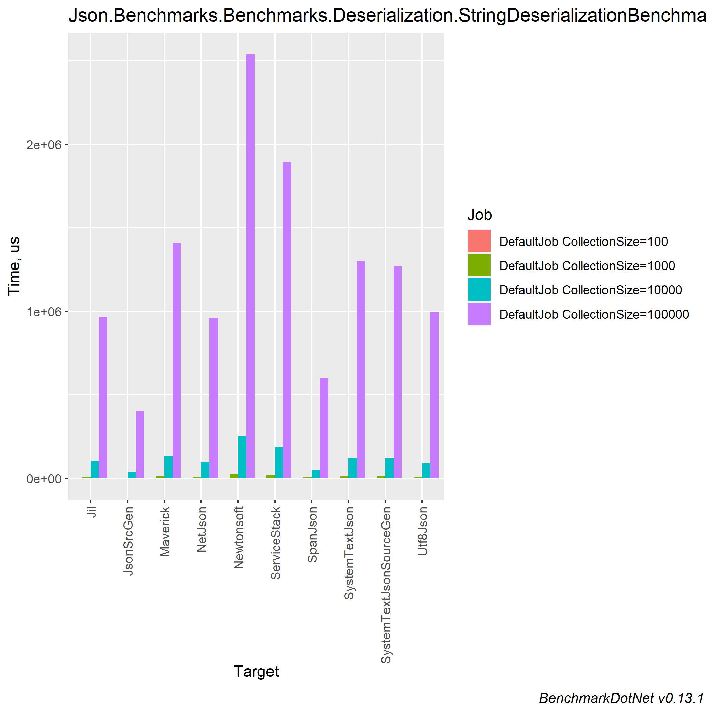
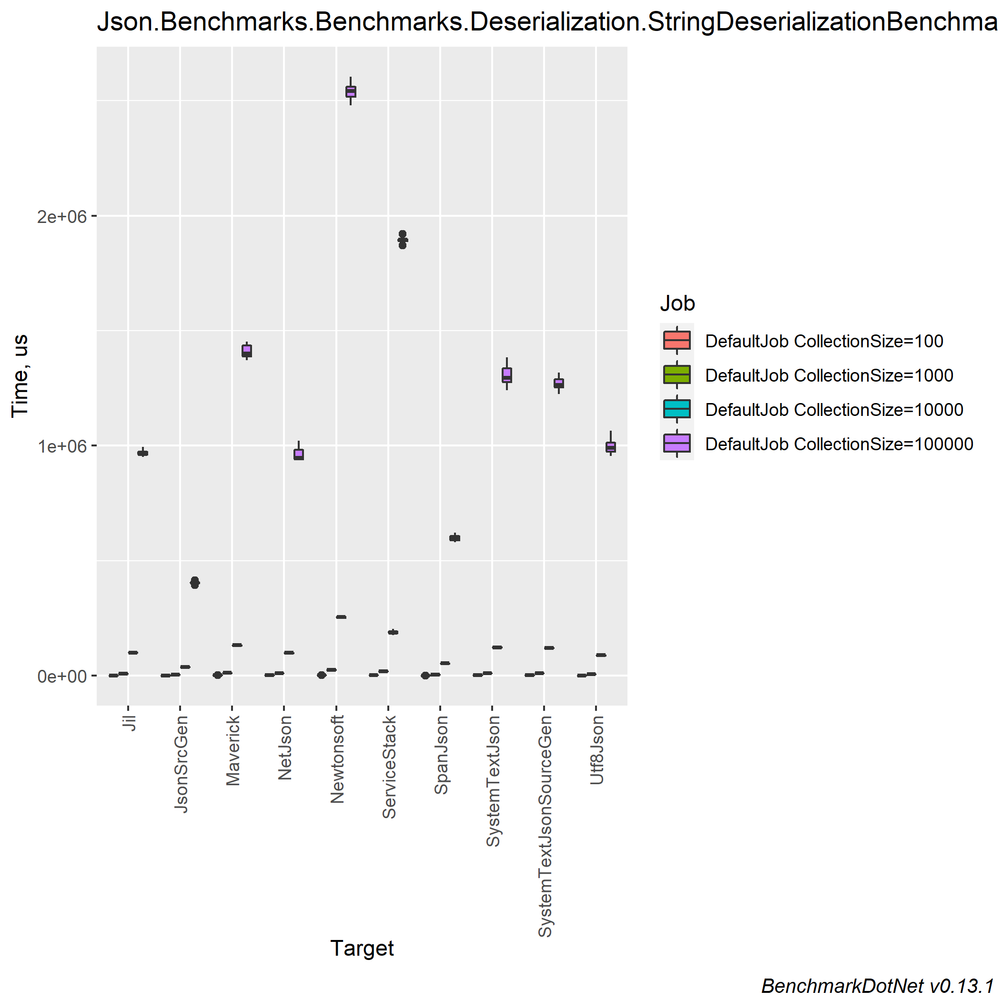

<a name="byte-string-des"></a>
### Byte

| Method                  | CollectionSize |            Mean |         Error |        StdDev |       StdErr |             Min |              Q1 |          Median |              Q3 |             Max |        Op/s | Ratio | RatioSD |      Gen 0 |     Gen 1 |    Gen 2 |  Allocated |
|-------------------------|----------------|----------------:|--------------:|--------------:|-------------:|----------------:|----------------:|----------------:|----------------:|----------------:|------------:|------:|--------:|-----------:|----------:|---------:|-----------:|
| ZeroFormatter           | 100            |        61.42 μs |      1.045 μs |      0.926 μs |     0.248 μs |        59.78 μs |        60.84 μs |        61.33 μs |        62.01 μs |        62.96 μs | 16,281.7996 |  0.06 |    0.00 |    27.0386 |    8.9722 |        - |     114 KB |
| MsgPackClassic          | 100            |       182.94 μs |      2.009 μs |      1.677 μs |     0.465 μs |       180.22 μs |       182.13 μs |       182.66 μs |       183.43 μs |       186.73 μs |  5,466.2437 |  0.19 |    0.00 |    17.5781 |    4.8828 |        - |      73 KB |
| MsgPackLz4              | 100            |       211.37 μs |      2.239 μs |      1.985 μs |     0.530 μs |       208.65 μs |       209.73 μs |       211.30 μs |       213.02 μs |       214.19 μs |  4,731.1316 |  0.22 |    0.00 |    17.5781 |    0.7324 |        - |      73 KB |
| Protobuf                | 100            |       304.02 μs |      4.547 μs |      4.254 μs |     1.098 μs |       299.45 μs |       301.03 μs |       302.12 μs |       307.09 μs |       313.15 μs |  3,289.2462 |  0.32 |    0.01 |    17.5781 |         - |        - |      73 KB |
| SpanJson                | 100            |       429.77 μs |      2.659 μs |      2.357 μs |     0.630 μs |       426.26 μs |       428.48 μs |       429.29 μs |       431.55 μs |       433.61 μs |  2,326.8269 |  0.45 |    0.00 |    17.5781 |    0.9766 |        - |      73 KB |
| Utf8Json                | 100            |       602.06 μs |     12.013 μs |     21.967 μs |     3.390 μs |       573.17 μs |       590.70 μs |       596.37 μs |       608.44 μs |       675.15 μs |  1,660.9539 |  0.62 |    0.04 |    32.2266 |    1.9531 |        - |     132 KB |
| Jil                     | 100            |       914.47 μs |     14.212 μs |     13.294 μs |     3.433 μs |       892.11 μs |       906.43 μs |       914.43 μs |       924.02 μs |       937.22 μs |  1,093.5319 |  0.95 |    0.01 |    79.1016 |   52.7344 |  33.2031 |     361 KB |
| SystemTextJsonSourceGen | 100            |       952.00 μs |      8.106 μs |      7.582 μs |     1.958 μs |       941.85 μs |       947.01 μs |       950.42 μs |       958.14 μs |       963.90 μs |  1,050.4253 |  0.98 |    0.01 |    38.0859 |   10.7422 |        - |     158 KB |
| SystemTextJson          | 100            |       965.65 μs |      5.047 μs |      4.474 μs |     1.196 μs |       959.32 μs |       963.24 μs |       964.38 μs |       968.85 μs |       973.90 μs |  1,035.5759 |  1.00 |    0.00 |    38.0859 |    3.9063 |        - |     158 KB |
| Maverick                | 100            |       979.67 μs |      7.157 μs |      5.588 μs |     1.613 μs |       972.60 μs |       976.19 μs |       978.13 μs |       981.14 μs |       991.90 μs |  1,020.7480 |  1.02 |    0.01 |    28.3203 |    0.9766 |        - |     117 KB |
|                         |                |                 |               |               |              |                 |                 |                 |                 |                 |             |       |         |            |           |          |            |
| ZeroFormatter           | 1000           |       927.56 μs |     16.325 μs |     22.345 μs |     4.382 μs |       896.55 μs |       913.70 μs |       924.60 μs |       939.40 μs |       992.94 μs |  1,078.0961 |  0.09 |    0.00 |   185.5469 |   92.7734 |        - |   1,141 KB |
| MsgPackClassic          | 1000           |     1,989.89 μs |     19.493 μs |     18.234 μs |     4.708 μs |     1,953.86 μs |     1,981.53 μs |     1,989.37 μs |     2,006.26 μs |     2,014.33 μs |    502.5407 |  0.19 |    0.00 |   117.1875 |   58.5938 |        - |     727 KB |
| MsgPackLz4              | 1000           |     2,283.11 μs |     26.261 μs |     24.565 μs |     6.343 μs |     2,248.75 μs |     2,265.80 μs |     2,280.77 μs |     2,296.18 μs |     2,336.78 μs |    437.9998 |  0.22 |    0.01 |   117.1875 |   58.5938 |        - |     726 KB |
| Protobuf                | 1000           |     3,244.51 μs |     53.311 μs |     44.517 μs |    12.347 μs |     3,185.95 μs |     3,225.69 μs |     3,232.24 μs |     3,250.29 μs |     3,341.15 μs |    308.2128 |  0.30 |    0.01 |   117.1875 |   58.5938 |        - |     727 KB |
| SpanJson                | 1000           |     4,367.91 μs |     60.411 μs |     53.553 μs |    14.313 μs |     4,303.29 μs |     4,333.25 μs |     4,357.88 μs |     4,378.54 μs |     4,485.11 μs |    228.9423 |  0.41 |    0.01 |   117.1875 |   54.6875 |        - |     726 KB |
| Utf8Json                | 1000           |     6,145.11 μs |     65.912 μs |     58.429 μs |    15.616 μs |     6,046.90 μs |     6,110.22 μs |     6,147.97 μs |     6,171.87 μs |     6,256.58 μs |    162.7309 |  0.58 |    0.01 |   210.9375 |  101.5625 |        - |   1,320 KB |
| Jil                     | 1000           |     9,642.54 μs |    189.767 μs |    239.995 μs |    50.042 μs |     8,978.20 μs |     9,539.60 μs |     9,723.51 μs |     9,819.96 μs |     9,980.06 μs |    103.7071 |  0.92 |    0.04 |   515.6250 |  390.6250 | 203.1250 |   3,609 KB |
| SystemTextJsonSourceGen | 1000           |     9,754.47 μs |     99.885 μs |     88.545 μs |    23.665 μs |     9,646.12 μs |     9,689.01 μs |     9,710.31 μs |     9,819.74 μs |     9,898.27 μs |    102.5171 |  0.92 |    0.02 |   250.0000 |  125.0000 |        - |   1,571 KB |
| Maverick                | 1000           |    10,352.21 μs |    182.868 μs |    171.055 μs |    44.166 μs |    10,184.95 μs |    10,206.56 μs |    10,250.59 μs |    10,509.66 μs |    10,670.73 μs |     96.5977 |  0.98 |    0.03 |   187.5000 |   93.7500 |        - |   1,165 KB |
| SystemTextJson          | 1000           |    10,420.17 μs |    206.096 μs |    308.475 μs |    56.320 μs |    10,054.30 μs |    10,149.91 μs |    10,355.20 μs |    10,610.83 μs |    11,192.71 μs |     95.9677 |  1.00 |    0.00 |   250.0000 |  125.0000 |        - |   1,571 KB |
|                         |                |                 |               |               |              |                 |                 |                 |                 |                 |             |       |         |            |           |          |            |
| MsgPackClassic          | 10000          |    27,268.34 μs |    356.020 μs |    297.293 μs |    82.454 μs |    26,954.98 μs |    26,993.17 μs |    27,231.01 μs |    27,461.03 μs |    27,945.95 μs |     36.6726 |  0.22 |    0.00 |  1312.5000 |  562.5000 | 156.2500 |   7,266 KB |
| ZeroFormatter           | 10000          |    28,278.31 μs |    429.565 μs |    494.688 μs |   110.616 μs |    27,147.38 μs |    28,111.66 μs |    28,365.78 μs |    28,597.95 μs |    29,101.60 μs |     35.3628 |  0.22 |    0.00 |  2156.2500 |  968.7500 | 343.7500 |  11,407 KB |
| MsgPackLz4              | 10000          |    32,839.45 μs |    557.609 μs |    494.306 μs |   132.109 μs |    32,199.52 μs |    32,475.62 μs |    32,786.92 μs |    33,272.99 μs |    33,706.05 μs |     30.4512 |  0.26 |    0.01 |  1312.5000 |  562.5000 | 156.2500 |   7,266 KB |
| Protobuf                | 10000          |    35,593.05 μs |    603.856 μs |    564.847 μs |   145.843 μs |    34,783.12 μs |    35,224.09 μs |    35,516.35 μs |    35,853.28 μs |    36,662.98 μs |     28.0954 |  0.28 |    0.01 |  1200.0000 |  466.6667 |  66.6667 |   7,265 KB |
| SpanJson                | 10000          |    47,286.15 μs |    385.985 μs |    342.166 μs |    91.448 μs |    46,696.26 μs |    47,056.13 μs |    47,438.74 μs |    47,515.95 μs |    47,750.37 μs |     21.1478 |  0.37 |    0.00 |  1100.0000 |  400.0000 |        - |   7,264 KB |
| Utf8Json                | 10000          |    91,856.64 μs |  1,266.370 μs |  1,122.604 μs |   300.029 μs |    88,998.43 μs |    91,343.02 μs |    92,048.49 μs |    92,311.60 μs |    93,679.07 μs |     10.8865 |  0.73 |    0.01 |  2166.6667 | 1000.0000 | 166.6667 |  13,293 KB |
| Jil                     | 10000          |   109,323.40 μs |    951.228 μs |    889.779 μs |   229.740 μs |   107,963.50 μs |   108,841.65 μs |   109,120.32 μs |   109,859.11 μs |   111,158.50 μs |      9.1472 |  0.87 |    0.01 |  3200.0000 | 1200.0000 | 200.0000 |  36,182 KB |
| SystemTextJsonSourceGen | 10000          |   123,722.15 μs |  1,532.743 μs |  1,433.728 μs |   370.187 μs |   121,368.98 μs |   122,961.64 μs |   123,557.40 μs |   124,736.69 μs |   126,332.64 μs |      8.0826 |  0.98 |    0.02 |  2600.0000 | 1000.0000 | 200.0000 |  15,805 KB |
| SystemTextJson          | 10000          |   126,352.46 μs |  1,218.824 μs |  1,080.455 μs |   288.764 μs |   124,386.86 μs |   125,848.69 μs |   126,438.37 μs |   126,916.69 μs |   128,651.98 μs |      7.9144 |  1.00 |    0.00 |  2600.0000 | 1000.0000 | 200.0000 |  15,803 KB |
| Maverick                | 10000          |   126,843.15 μs |  1,471.528 μs |  1,376.469 μs |   355.403 μs |   125,191.32 μs |   125,670.47 μs |   126,858.06 μs |   127,789.90 μs |   129,062.54 μs |      7.8838 |  1.00 |    0.01 |  1800.0000 |  800.0000 |        - |  11,742 KB |
|                         |                |                 |               |               |              |                 |                 |                 |                 |                 |             |       |         |            |           |          |            |
| ZeroFormatter           | 100000         |   260,281.50 μs |  5,137.257 μs |  9,522.236 μs | 1,452.127 μs |   247,474.40 μs |   251,073.65 μs |   260,243.10 μs |   263,485.50 μs |   281,754.70 μs |      3.8420 |  0.20 |    0.01 | 18000.0000 | 6000.0000 |        - | 114,063 KB |
| MsgPackClassic          | 100000         |   294,938.20 μs |  5,874.554 μs |  8,792.756 μs | 1,605.330 μs |   280,985.90 μs |   287,830.50 μs |   295,439.75 μs |   301,549.53 μs |   312,027.60 μs |      3.3905 |  0.23 |    0.01 | 11000.0000 | 4000.0000 |        - |  72,656 KB |
| MsgPackLz4              | 100000         |   356,313.61 μs |  5,720.522 μs |  5,071.094 μs | 1,355.307 μs |   343,284.00 μs |   355,043.62 μs |   356,081.70 μs |   359,036.45 μs |   364,717.50 μs |      2.8065 |  0.27 |    0.01 | 18000.0000 | 7000.0000 |        - | 115,826 KB |
| Protobuf                | 100000         |   416,850.35 μs |  8,077.860 μs |  8,295.368 μs | 2,011.922 μs |   405,879.40 μs |   408,826.70 μs |   417,538.90 μs |   422,878.70 μs |   431,787.90 μs |      2.3989 |  0.32 |    0.01 | 11000.0000 | 4000.0000 |        - |  72,660 KB |
| SpanJson                | 100000         |   547,492.11 μs |  5,982.576 μs |  5,596.105 μs | 1,444.908 μs |   537,378.90 μs |   544,451.60 μs |   547,818.30 μs |   550,655.60 μs |   556,761.00 μs |      1.8265 |  0.42 |    0.00 | 11000.0000 | 4000.0000 |        - |  72,663 KB |
| Utf8Json                | 100000         |   872,102.53 μs | 11,864.818 μs |  9,907.660 μs | 2,747.891 μs |   855,683.50 μs |   866,663.30 μs |   869,257.10 μs |   877,753.50 μs |   891,249.70 μs |      1.1467 |  0.67 |    0.01 | 21000.0000 | 7000.0000 |        - | 132,419 KB |
| Jil                     | 100000         | 1,056,486.74 μs | 11,778.717 μs | 11,017.819 μs | 2,844.789 μs | 1,041,130.80 μs | 1,048,761.40 μs | 1,056,383.80 μs | 1,063,933.75 μs | 1,084,435.20 μs |      0.9465 |  0.81 |    0.01 | 30000.0000 | 8000.0000 |        - | 361,278 KB |
| SystemTextJson          | 100000         | 1,298,018.48 μs | 15,499.006 μs | 14,497.780 μs | 3,743.311 μs | 1,277,888.40 μs | 1,286,180.30 μs | 1,296,395.80 μs | 1,306,281.40 μs | 1,326,841.90 μs |      0.7704 |  1.00 |    0.00 | 25000.0000 | 6000.0000 |        - | 157,517 KB |
| SystemTextJsonSourceGen | 100000         | 1,300,298.54 μs | 10,844.020 μs |  9,612.942 μs | 2,569.167 μs | 1,285,301.60 μs | 1,295,911.80 μs | 1,298,610.25 μs | 1,302,595.98 μs | 1,319,312.80 μs |      0.7691 |  1.00 |    0.01 | 25000.0000 | 6000.0000 |        - | 157,522 KB |
| Maverick                | 100000         | 1,325,037.65 μs | 14,034.146 μs | 13,127.549 μs | 3,389.519 μs | 1,303,746.50 μs | 1,316,134.00 μs | 1,324,653.20 μs | 1,334,198.55 μs | 1,346,128.10 μs |      0.7547 |  1.02 |    0.02 | 18000.0000 | 6000.0000 |        - | 116,888 KB |

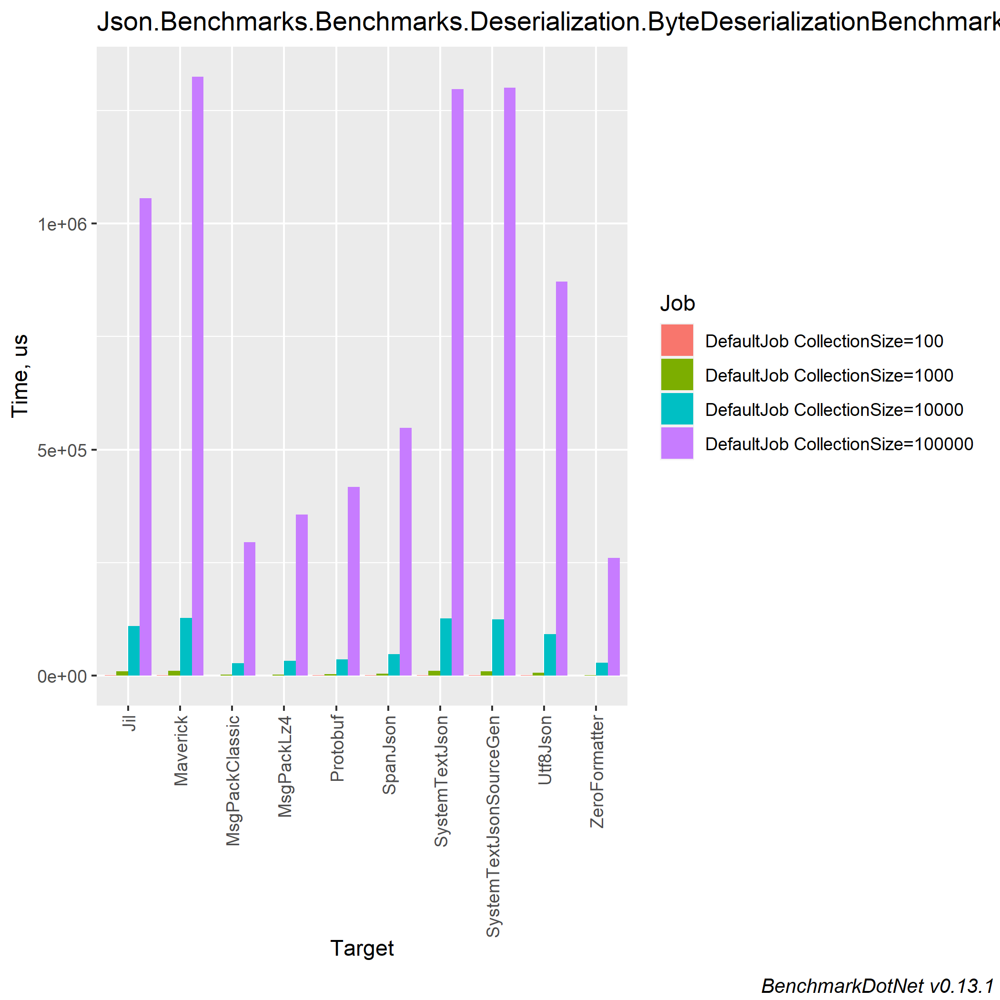
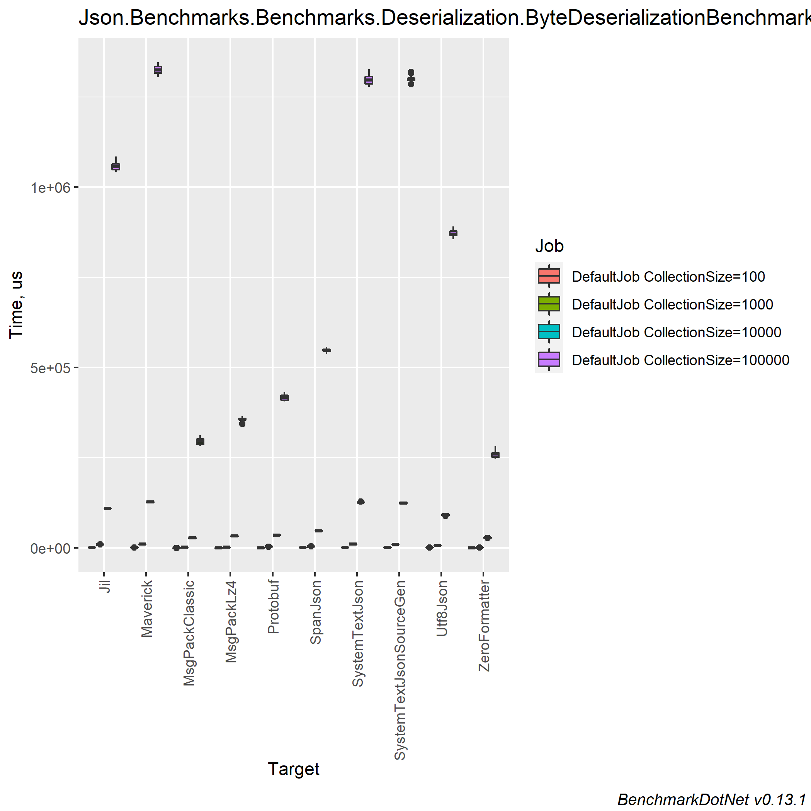

<a name="stream-des"></a>
### Stream

| Method                  | CollectionSize |           Mean |        Error |       StdDev |      StdErr |            Min |             Q1 |         Median |             Q3 |            Max |       Op/s | Ratio | RatioSD |      Gen 0 |     Gen 1 |    Gen 2 |  Allocated |
|-------------------------|----------------|---------------:|-------------:|-------------:|------------:|---------------:|---------------:|---------------:|---------------:|---------------:|-----------:|------:|--------:|-----------:|----------:|---------:|-----------:|
| MsgPackClassic          | 100            |       178.2 μs |      1.05 μs |      0.82 μs |     0.24 μs |       177.2 μs |       177.5 μs |       178.0 μs |       179.1 μs |       179.5 μs | 5,611.7486 |  0.15 |    0.00 |    17.5781 |         - |        - |      73 KB |
| MsgPackLz4              | 100            |       202.9 μs |      1.05 μs |      0.82 μs |     0.24 μs |       201.2 μs |       202.3 μs |       203.2 μs |       203.4 μs |       204.1 μs | 4,928.1515 |  0.17 |    0.00 |    17.5781 |    2.4414 |        - |      73 KB |
| Protobuf                | 100            |       295.0 μs |      5.38 μs |      5.03 μs |     1.30 μs |       289.2 μs |       290.9 μs |       294.3 μs |       298.5 μs |       303.4 μs | 3,390.0774 |  0.24 |    0.00 |    17.5781 |    2.4414 |        - |      73 KB |
| SpanJson                | 100            |       461.5 μs |      4.87 μs |      4.56 μs |     1.18 μs |       455.7 μs |       457.7 μs |       461.1 μs |       464.2 μs |       469.5 μs | 2,166.8521 |  0.38 |    0.01 |    35.1563 |   25.8789 |  17.5781 |     158 KB |
| Utf8Json                | 100            |       640.0 μs |     12.29 μs |     11.50 μs |     2.97 μs |       624.4 μs |       630.6 μs |       641.0 μs |       646.9 μs |       664.9 μs | 1,562.5326 |  0.53 |    0.01 |    58.5938 |   39.0625 |  26.3672 |     261 KB |
| Maverick                | 100            |     1,023.0 μs |     12.69 μs |     11.25 μs |     3.01 μs |     1,011.0 μs |     1,014.6 μs |     1,019.1 μs |     1,027.3 μs |     1,048.0 μs |   977.5606 |  0.84 |    0.01 |    44.9219 |   27.3438 |  17.5781 |     203 KB |
| SystemTextJsonSourceGen | 100            |     1,201.8 μs |     13.38 μs |     11.17 μs |     3.10 μs |     1,190.0 μs |     1,192.3 μs |     1,198.1 μs |     1,208.4 μs |     1,229.4 μs |   832.0509 |  0.99 |    0.02 |    37.1094 |    5.8594 |        - |     158 KB |
| SystemTextJson          | 100            |     1,212.7 μs |     16.07 μs |     15.03 μs |     3.88 μs |     1,195.7 μs |     1,201.2 μs |     1,209.7 μs |     1,222.3 μs |     1,239.5 μs |   824.6353 |  1.00 |    0.00 |    37.1094 |    7.8125 |        - |     158 KB |
|                         |                |                |              |              |             |                |                |                |                |                |            |       |         |            |           |          |            |
| MsgPackLz4              | 1000           |     2,554.0 μs |     50.90 μs |     64.37 μs |    13.42 μs |     2,432.2 μs |     2,521.6 μs |     2,535.8 μs |     2,594.1 μs |     2,688.8 μs |   391.5370 |  0.20 |    0.00 |   171.8750 |  113.2813 |  54.6875 |   1,105 KB |
| MsgPackClassic          | 1000           |     2,572.5 μs |     35.60 μs |     33.30 μs |     8.60 μs |     2,516.5 μs |     2,547.5 μs |     2,572.9 μs |     2,585.1 μs |     2,635.4 μs |   388.7221 |  0.20 |    0.00 |   191.4063 |  152.3438 |  74.2188 |   1,255 KB |
| Protobuf                | 1000           |     3,004.7 μs |     43.18 μs |     40.39 μs |    10.43 μs |     2,957.1 μs |     2,975.2 μs |     2,988.4 μs |     3,034.2 μs |     3,068.9 μs |   332.8164 |  0.24 |    0.00 |   117.1875 |   58.5938 |        - |     727 KB |
| SpanJson                | 1000           |     4,805.3 μs |     93.61 μs |     96.13 μs |    23.31 μs |     4,657.2 μs |     4,737.9 μs |     4,806.8 μs |     4,847.9 μs |     4,995.2 μs |   208.1039 |  0.38 |    0.01 |   226.5625 |  210.9375 | 109.3750 |   1,582 KB |
| Utf8Json                | 1000           |     6,986.8 μs |    100.25 μs |     93.77 μs |    24.21 μs |     6,830.7 μs |     6,925.0 μs |     6,975.9 μs |     7,054.5 μs |     7,133.6 μs |   143.1265 |  0.55 |    0.01 |   453.1250 |  398.4375 | 242.1875 |   3,240 KB |
| Maverick                | 1000           |    10,659.5 μs |    116.99 μs |    109.44 μs |    28.26 μs |    10,515.1 μs |    10,580.4 μs |    10,630.6 μs |    10,729.1 μs |    10,876.6 μs |    93.8134 |  0.84 |    0.01 |   281.2500 |  203.1250 |  93.7500 |   2,021 KB |
| SystemTextJsonSourceGen | 1000           |    12,287.6 μs |    151.45 μs |    126.47 μs |    35.08 μs |    12,119.5 μs |    12,184.7 μs |    12,283.4 μs |    12,351.6 μs |    12,587.2 μs |    81.3827 |  0.97 |    0.01 |   250.0000 |  125.0000 |        - |   1,572 KB |
| SystemTextJson          | 1000           |    12,626.4 μs |     98.25 μs |     91.90 μs |    23.73 μs |    12,493.5 μs |    12,551.1 μs |    12,617.9 μs |    12,691.4 μs |    12,780.6 μs |    79.1990 |  1.00 |    0.00 |   250.0000 |  125.0000 |        - |   1,572 KB |
|                         |                |                |              |              |             |                |                |                |                |                |            |       |         |            |           |          |            |
| MsgPackClassic          | 10000          |    28,285.4 μs |    276.97 μs |    259.08 μs |    66.89 μs |    27,938.8 μs |    27,991.3 μs |    28,389.7 μs |    28,446.8 μs |    28,791.7 μs |    35.3539 |  0.20 |    0.00 |  1312.5000 |  562.5000 | 156.2500 |  12,545 KB |
| MsgPackLz4              | 10000          |    30,731.8 μs |    303.27 μs |    236.77 μs |    68.35 μs |    30,382.6 μs |    30,444.9 μs |    30,854.5 μs |    30,911.6 μs |    30,952.4 μs |    32.5396 |  0.22 |    0.00 |  1312.5000 |  562.5000 | 156.2500 |  11,038 KB |
| Protobuf                | 10000          |    35,514.5 μs |    582.60 μs |    544.97 μs |   140.71 μs |    34,682.2 μs |    35,110.1 μs |    35,436.3 μs |    35,842.5 μs |    36,694.7 μs |    28.1575 |  0.25 |    0.00 |  1214.2857 |  428.5714 |  71.4286 |   7,266 KB |
| SpanJson                | 10000          |    52,096.0 μs |    654.73 μs |    612.44 μs |   158.13 μs |    51,264.7 μs |    51,613.6 μs |    51,951.0 μs |    52,446.7 μs |    53,443.0 μs |    19.1953 |  0.37 |    0.00 |  1100.0000 |  400.0000 |        - |  15,818 KB |
| Utf8Json                | 10000          |    95,574.5 μs |    743.08 μs |    658.72 μs |   176.05 μs |    94,473.9 μs |    95,156.6 μs |    95,365.1 μs |    96,135.7 μs |    96,783.9 μs |    10.4630 |  0.67 |    0.00 |  2166.6667 | 1000.0000 | 166.6667 |  45,933 KB |
| Maverick                | 10000          |   121,402.0 μs |  1,349.25 μs |  1,196.07 μs |   319.66 μs |   119,657.6 μs |   120,659.8 μs |   121,110.0 μs |   121,960.1 μs |   123,784.6 μs |     8.2371 |  0.86 |    0.01 |  1750.0000 |  750.0000 |        - |  20,294 KB |
| SystemTextJsonSourceGen | 10000          |   140,733.2 μs |  1,360.21 μs |  1,205.79 μs |   322.26 μs |   139,050.7 μs |   139,681.1 μs |   140,747.8 μs |   141,563.7 μs |   143,019.8 μs |     7.1056 |  0.99 |    0.01 |  2500.0000 | 1000.0000 |        - |  15,804 KB |
| SystemTextJson          | 10000          |   141,902.5 μs |    825.64 μs |    731.91 μs |   195.61 μs |   140,836.0 μs |   141,220.7 μs |   142,067.8 μs |   142,367.9 μs |   143,137.6 μs |     7.0471 |  1.00 |    0.00 |  2500.0000 | 1000.0000 |        - |  15,804 KB |
|                         |                |                |              |              |             |                |                |                |                |                |            |       |         |            |           |          |            |
| MsgPackClassic          | 100000         |   330,963.4 μs |  3,844.76 μs |  3,408.28 μs |   910.90 μs |   325,488.5 μs |   327,907.2 μs |   331,165.6 μs |   332,708.2 μs |   336,827.7 μs |     3.0215 |  0.23 |    0.00 | 11500.0000 | 4000.0000 |        - | 125,438 KB |
| MsgPackLz4              | 100000         |   397,439.3 μs |  7,445.35 μs |  6,964.38 μs | 1,798.20 μs |   387,478.8 μs |   391,524.0 μs |   397,071.4 μs |   402,027.8 μs |   413,003.0 μs |     2.5161 |  0.27 |    0.00 | 18000.0000 | 7000.0000 |        - | 153,597 KB |
| Protobuf                | 100000         |   405,551.7 μs |  7,948.71 μs | 10,880.28 μs | 2,133.80 μs |   390,405.5 μs |   393,651.0 μs |   407,775.3 μs |   412,634.6 μs |   427,793.5 μs |     2.4658 |  0.28 |    0.01 | 11000.0000 | 4000.0000 |        - |  72,665 KB |
| SpanJson                | 100000         |   570,446.6 μs |  6,658.57 μs |  5,902.65 μs | 1,577.55 μs |   555,242.8 μs |   569,887.2 μs |   571,489.2 μs |   573,321.2 μs |   578,732.3 μs |     1.7530 |  0.39 |    0.00 | 11000.0000 | 4000.0000 |        - | 158,180 KB |
| Utf8Json                | 100000         | 1,009,232.2 μs |  8,327.91 μs |  6,954.18 μs | 1,928.74 μs |   998,098.6 μs | 1,006,109.9 μs | 1,008,498.4 μs | 1,011,570.2 μs | 1,024,224.9 μs |     0.9909 |  0.69 |    0.01 | 21000.0000 | 7000.0000 |        - | 394,439 KB |
| Maverick                | 100000         | 1,293,528.7 μs | 13,304.43 μs | 11,794.03 μs | 3,152.09 μs | 1,277,946.5 μs | 1,283,781.3 μs | 1,293,129.1 μs | 1,302,544.1 μs | 1,313,139.8 μs |     0.7731 |  0.88 |    0.01 | 18000.0000 | 6000.0000 |        - | 202,415 KB |
| SystemTextJsonSourceGen | 100000         | 1,449,719.3 μs |  9,320.56 μs |  8,262.44 μs | 2,208.23 μs | 1,432,847.0 μs | 1,444,854.6 μs | 1,449,954.7 μs | 1,454,866.4 μs | 1,463,051.0 μs |     0.6898 |  0.99 |    0.00 | 25000.0000 | 6000.0000 |        - | 157,519 KB |
| SystemTextJson          | 100000         | 1,468,011.7 μs | 11,127.18 μs |  8,687.37 μs | 2,507.83 μs | 1,454,172.6 μs | 1,462,397.6 μs | 1,466,932.5 μs | 1,472,722.7 μs | 1,484,342.4 μs |     0.6812 |  1.00 |    0.00 | 25000.0000 | 6000.0000 |        - | 157,518 KB |

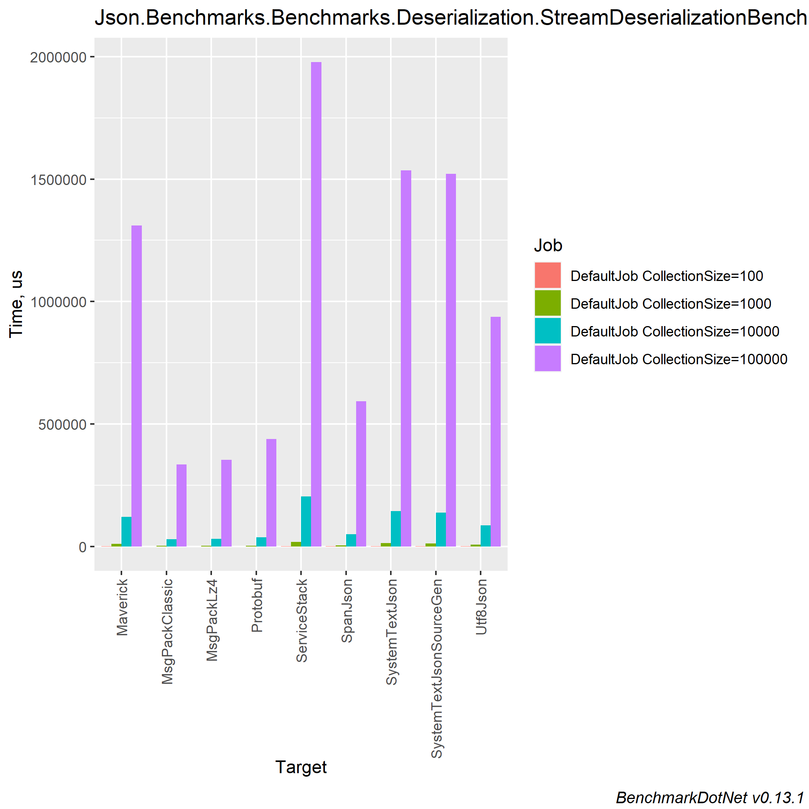


<a name="asynchronous-stream-des"></a>
### Asynchronous stream

| Method                  | CollectionSize |           Mean |        Error |       StdDev |      StdErr |            Min |             Q1 |         Median |             Q3 |            Max |       Op/s | Ratio | RatioSD |      Gen 0 |     Gen 1 |    Gen 2 |  Allocated |
|-------------------------|----------------|---------------:|-------------:|-------------:|------------:|---------------:|---------------:|---------------:|---------------:|---------------:|-----------:|------:|--------:|-----------:|----------:|---------:|-----------:|
| MsgPackClassic          | 100            |       187.8 μs |      2.96 μs |      2.76 μs |     0.71 μs |       183.9 μs |       186.3 μs |       186.6 μs |       189.7 μs |       193.2 μs | 5,324.9466 |  0.15 |    0.00 |    17.8223 |    0.2441 |        - |      73 KB |
| MsgPackLz4              | 100            |       214.6 μs |      2.38 μs |      2.11 μs |     0.56 μs |       211.7 μs |       213.2 μs |       214.3 μs |       215.9 μs |       219.8 μs | 4,659.9686 |  0.17 |    0.00 |    17.5781 |    1.4648 |        - |      73 KB |
| Protobuf                | 100            |       304.9 μs |      4.42 μs |      3.92 μs |     1.05 μs |       299.0 μs |       301.9 μs |       305.5 μs |       307.3 μs |       314.0 μs | 3,279.2976 |  0.24 |    0.00 |    17.5781 |    2.4414 |        - |      73 KB |
| SpanJson                | 100            |       434.8 μs |      7.75 μs |      6.87 μs |     1.84 μs |       426.2 μs |       430.0 μs |       432.6 μs |       439.0 μs |       447.7 μs | 2,299.7252 |  0.34 |    0.01 |    17.5781 |    3.9063 |        - |      73 KB |
| Utf8Json                | 100            |       670.2 μs |     11.92 μs |      9.95 μs |     2.76 μs |       654.0 μs |       667.6 μs |       671.0 μs |       673.3 μs |       691.1 μs | 1,492.1141 |  0.53 |    0.01 |    58.5938 |   41.9922 |  26.3672 |     261 KB |
| SystemTextJsonSourceGen | 100            |     1,233.6 μs |     24.18 μs |     23.75 μs |     5.94 μs |     1,209.7 μs |     1,218.4 μs |     1,224.9 μs |     1,237.6 μs |     1,285.7 μs |   810.6126 |  0.97 |    0.02 |    37.1094 |    1.9531 |        - |     158 KB |
| SystemTextJson          | 100            |     1,272.0 μs |     12.92 μs |     10.79 μs |     2.99 μs |     1,255.2 μs |     1,267.0 μs |     1,270.5 μs |     1,276.1 μs |     1,297.2 μs |   786.1924 |  1.00 |    0.00 |    37.1094 |    3.9063 |        - |     158 KB |
|                         |                |                |              |              |             |                |                |                |                |                |            |       |         |            |           |          |            |
| MsgPackClassic          | 1000           |     2,579.3 μs |     40.35 μs |     31.51 μs |     9.09 μs |     2,519.7 μs |     2,572.2 μs |     2,587.4 μs |     2,595.7 μs |     2,625.9 μs |   387.7008 |  0.19 |    0.00 |   195.3125 |  160.1563 |  78.1250 |   1,255 KB |
| MsgPackLz4              | 1000           |     2,900.2 μs |     55.18 μs |     65.69 μs |    14.33 μs |     2,734.7 μs |     2,886.5 μs |     2,899.1 μs |     2,939.0 μs |     3,019.5 μs |   344.8021 |  0.22 |    0.01 |   175.7813 |  121.0938 |  58.5938 |   1,105 KB |
| Protobuf                | 1000           |     3,023.2 μs |     46.58 μs |     43.57 μs |    11.25 μs |     2,974.8 μs |     2,991.0 μs |     3,011.5 μs |     3,050.6 μs |     3,106.0 μs |   330.7744 |  0.23 |    0.00 |   117.1875 |   58.5938 |        - |     726 KB |
| SpanJson                | 1000           |     4,410.7 μs |     84.06 μs |     86.32 μs |    20.94 μs |     4,316.5 μs |     4,338.3 μs |     4,390.3 μs |     4,460.5 μs |     4,579.8 μs |   226.7213 |  0.33 |    0.01 |   117.1875 |   54.6875 |        - |     727 KB |
| Utf8Json                | 1000           |     6,961.6 μs |     94.32 μs |     88.23 μs |    22.78 μs |     6,865.0 μs |     6,889.4 μs |     6,941.4 μs |     7,010.4 μs |     7,123.6 μs |   143.6458 |  0.52 |    0.01 |   460.9375 |  414.0625 | 250.0000 |   3,241 KB |
| SystemTextJsonSourceGen | 1000           |    12,430.7 μs |    125.10 μs |    110.90 μs |    29.64 μs |    12,265.4 μs |    12,342.2 μs |    12,414.1 μs |    12,496.3 μs |    12,641.7 μs |    80.4458 |  0.93 |    0.01 |   250.0000 |  125.0000 |        - |   1,571 KB |
| SystemTextJson          | 1000           |    13,363.0 μs |    176.07 μs |    137.47 μs |    39.68 μs |    13,217.2 μs |    13,287.5 μs |    13,319.4 μs |    13,388.5 μs |    13,735.2 μs |    74.8335 |  1.00 |    0.00 |   250.0000 |  125.0000 |        - |   1,571 KB |
|                         |                |                |              |              |             |                |                |                |                |                |            |       |         |            |           |          |            |
| MsgPackClassic          | 10000          |    30,746.2 μs |    342.37 μs |    303.50 μs |    81.11 μs |    30,371.0 μs |    30,497.1 μs |    30,691.5 μs |    30,921.2 μs |    31,358.0 μs |    32.5243 |  0.20 |    0.00 |  1312.5000 |  562.5000 | 156.2500 |  12,544 KB |
| MsgPackLz4              | 10000          |    31,804.9 μs |    620.12 μs |  1,053.00 μs |   173.11 μs |    30,418.7 μs |    31,100.5 μs |    31,406.9 μs |    32,429.5 μs |    34,325.3 μs |    31.4417 |  0.21 |    0.01 |  1200.0000 |  466.6667 |  66.6667 |  11,039 KB |
| Protobuf                | 10000          |    38,218.4 μs |    471.32 μs |    417.81 μs |   111.67 μs |    37,316.2 μs |    37,992.0 μs |    38,383.3 μs |    38,483.2 μs |    38,820.5 μs |    26.1654 |  0.25 |    0.00 |  1214.2857 |  428.5714 |  71.4286 |   7,267 KB |
| SpanJson                | 10000          |    52,810.3 μs |  1,003.28 μs |    889.39 μs |   237.70 μs |    51,629.4 μs |    52,261.1 μs |    52,639.3 μs |    53,002.4 μs |    54,708.6 μs |    18.9357 |  0.34 |    0.01 |  1100.0000 |  400.0000 |        - |   7,267 KB |
| Utf8Json                | 10000          |   102,564.8 μs |  1,161.45 μs |  1,086.42 μs |   280.51 μs |   100,569.0 μs |   102,102.6 μs |   102,593.0 μs |   103,275.7 μs |   104,328.0 μs |     9.7499 |  0.67 |    0.01 |  2500.0000 | 1333.3333 | 500.0000 |  45,934 KB |
| SystemTextJsonSourceGen | 10000          |   150,699.8 μs |  1,869.62 μs |  1,657.37 μs |   442.95 μs |   148,230.1 μs |   149,755.6 μs |   150,110.7 μs |   151,453.4 μs |   154,700.6 μs |     6.6357 |  0.98 |    0.01 |  2500.0000 | 1000.0000 |        - |  15,806 KB |
| SystemTextJson          | 10000          |   153,894.0 μs |  2,103.50 μs |  1,967.61 μs |   508.04 μs |   149,890.6 μs |   152,675.3 μs |   153,865.0 μs |   154,985.4 μs |   158,102.8 μs |     6.4980 |  1.00 |    0.00 |  2500.0000 | 1000.0000 |        - |  15,803 KB |
|                         |                |                |              |              |             |                |                |                |                |                |            |       |         |            |           |          |            |
| MsgPackClassic          | 100000         |   303,054.4 μs |  5,336.03 μs |  4,991.32 μs | 1,288.75 μs |   297,056.6 μs |   299,435.1 μs |   301,113.3 μs |   305,693.6 μs |   313,351.5 μs |     3.2997 |  0.20 |    0.00 | 11500.0000 | 4000.0000 |        - | 125,438 KB |
| MsgPackLz4              | 100000         |   371,741.6 μs |  4,277.40 μs |  3,571.82 μs |   990.64 μs |   364,289.0 μs |   369,829.2 μs |   371,359.5 μs |   373,595.9 μs |   378,329.1 μs |     2.6900 |  0.25 |    0.00 | 19000.0000 | 7500.0000 | 500.0000 | 153,580 KB |
| Protobuf                | 100000         |   390,319.6 μs |  5,679.91 μs |  5,312.99 μs | 1,371.81 μs |   381,496.9 μs |   385,276.7 μs |   391,074.4 μs |   394,003.5 μs |   399,342.9 μs |     2.5620 |  0.26 |    0.00 | 11000.0000 | 4000.0000 |        - |  72,660 KB |
| SpanJson                | 100000         |   520,994.3 μs |  7,392.11 μs |  6,914.58 μs | 1,785.34 μs |   510,871.5 μs |   514,020.8 μs |   522,810.3 μs |   526,729.3 μs |   528,954.3 μs |     1.9194 |  0.35 |    0.00 | 11000.0000 | 4000.0000 |        - |  72,664 KB |
| Utf8Json                | 100000         |   933,433.6 μs | 10,039.30 μs |  9,390.77 μs | 2,424.69 μs |   917,103.3 μs |   927,571.7 μs |   934,053.5 μs |   939,162.7 μs |   951,810.6 μs |     1.0713 |  0.62 |    0.01 | 21000.0000 | 7000.0000 |        - | 394,432 KB |
| SystemTextJsonSourceGen | 100000         | 1,484,322.0 μs | 12,510.08 μs | 11,701.94 μs | 3,021.43 μs | 1,469,807.9 μs | 1,474,895.9 μs | 1,480,470.3 μs | 1,496,190.1 μs | 1,506,609.3 μs |     0.6737 |  0.99 |    0.01 | 25000.0000 | 6000.0000 |        - | 157,522 KB |
| SystemTextJson          | 100000         | 1,496,791.5 μs | 17,556.37 μs | 15,563.27 μs | 4,159.46 μs | 1,470,375.2 μs | 1,491,273.3 μs | 1,496,188.6 μs | 1,502,855.1 μs | 1,529,822.4 μs |     0.6681 |  1.00 |    0.00 | 25000.0000 | 6000.0000 |        - | 157,521 KB |

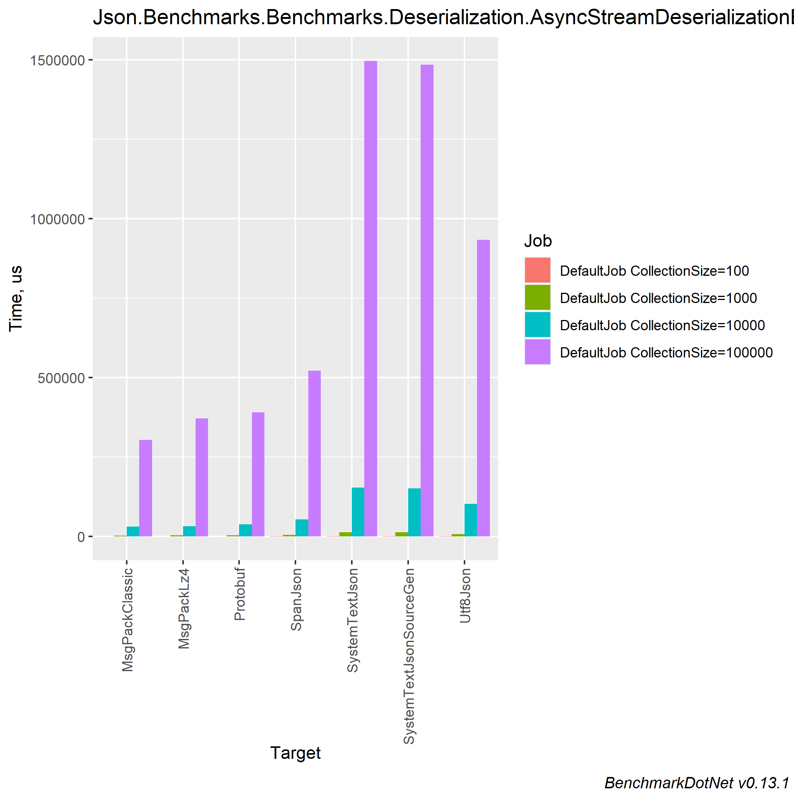
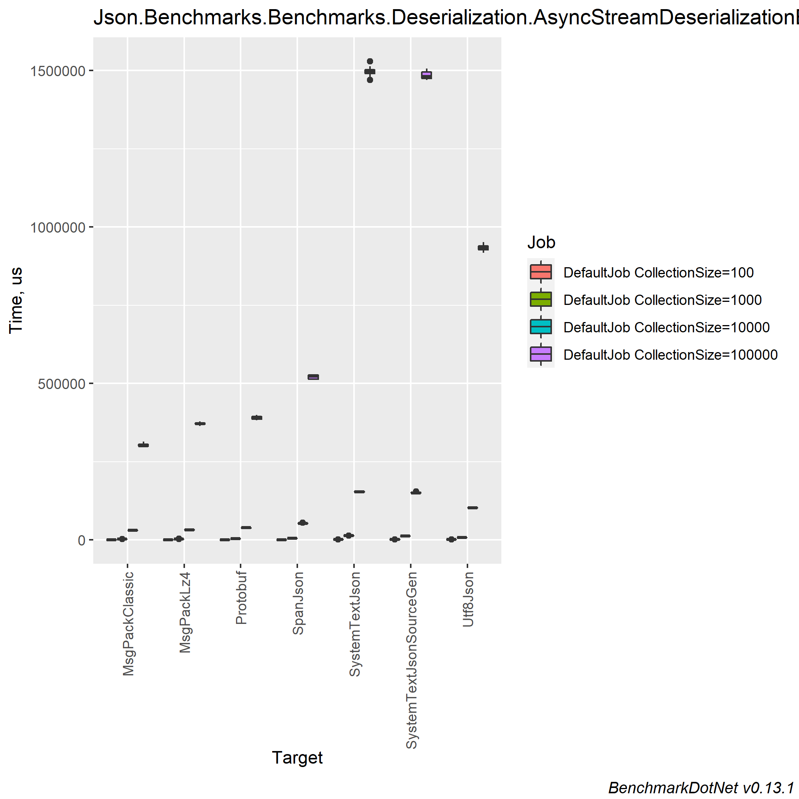

<a name="serialization"></a>
## Serialization

<a name="string-ser"></a>
### String

| Method                  | Size   |           Mean |        Error |       StdDev |      StdErr |         Median |            Min |             Q1 |             Q3 |            Max |       Op/s | Ratio | RatioSD |      Gen 0 |      Gen 1 |     Gen 2 |  Allocated |
|-------------------------|--------|---------------:|-------------:|-------------:|------------:|---------------:|---------------:|---------------:|---------------:|---------------:|-----------:|------:|--------:|-----------:|-----------:|----------:|-----------:|
| SpanJson                | 100    |       409.3 μs |      8.08 μs |     15.17 μs |     2.29 μs |       412.0 μs |       350.1 μs |       409.0 μs |       416.4 μs |       423.8 μs | 2,443.4306 |  0.71 |    0.04 |    49.8047 |    49.8047 |   49.8047 |     171 KB |
| Jil                     | 100    |       414.1 μs |      7.23 μs |      6.41 μs |     1.71 μs |       412.3 μs |       406.2 μs |       410.2 μs |       416.5 μs |       427.3 μs | 2,414.8028 |  0.74 |    0.01 |    90.8203 |    59.5703 |   40.0391 |     388 KB |
| SystemTextJsonSourceGen | 100    |       450.6 μs |      4.93 μs |      4.12 μs |     1.14 μs |       449.7 μs |       446.9 μs |       447.9 μs |       451.2 μs |       461.9 μs | 2,219.3305 |  0.80 |    0.01 |    53.2227 |    53.2227 |   53.2227 |     181 KB |
| SystemTextJson          | 100    |       561.2 μs |      6.13 μs |      5.43 μs |     1.45 μs |       560.3 μs |       554.7 μs |       556.8 μs |       564.9 μs |       572.1 μs | 1,781.8973 |  1.00 |    0.00 |    41.9922 |    41.9922 |   41.9922 |     172 KB |
| Maverick                | 100    |       579.5 μs |      9.78 μs |     12.72 μs |     2.60 μs |       577.2 μs |       561.7 μs |       571.4 μs |       583.2 μs |       608.8 μs | 1,725.5316 |  1.04 |    0.03 |    37.1094 |    37.1094 |   37.1094 |     173 KB |
| Utf8Json                | 100    |       582.9 μs |     12.89 μs |     37.81 μs |     3.80 μs |       587.3 μs |       500.0 μs |       560.6 μs |       611.4 μs |       675.0 μs | 1,715.6068 |  1.09 |    0.02 |    83.9844 |    80.0781 |   80.0781 |     401 KB |
| Newtonsoft              | 100    |     1,255.0 μs |     19.79 μs |     16.52 μs |     4.58 μs |     1,261.8 μs |     1,227.3 μs |     1,245.9 μs |     1,266.0 μs |     1,279.3 μs |   796.8186 |  2.24 |    0.05 |   156.2500 |    80.0781 |   44.9219 |     654 KB |
|                         |        |                |              |              |             |                |                |                |                |                |            |       |         |            |            |           |            |
| SpanJson                | 1000   |     3,579.1 μs |     56.93 μs |     50.47 μs |    13.49 μs |     3,582.5 μs |     3,424.0 μs |     3,570.2 μs |     3,599.2 μs |     3,647.8 μs |   279.4029 |  0.65 |    0.01 |   242.1875 |   242.1875 |  242.1875 |   1,713 KB |
| SystemTextJsonSourceGen | 1000   |     3,938.4 μs |     75.25 μs |     77.27 μs |    18.74 μs |     3,936.7 μs |     3,821.8 μs |     3,880.2 μs |     4,006.8 μs |     4,053.2 μs |   253.9091 |  0.72 |    0.01 |   265.6250 |   242.1875 |  242.1875 |   1,805 KB |
| SystemTextJson          | 1000   |     5,501.2 μs |     24.15 μs |     20.17 μs |     5.59 μs |     5,501.1 μs |     5,465.2 μs |     5,496.9 μs |     5,504.0 μs |     5,534.6 μs |   181.7781 |  1.00 |    0.00 |   234.3750 |   234.3750 |  234.3750 |   1,713 KB |
| Utf8Json                | 1000   |     5,560.7 μs |    109.02 μs |    281.41 μs |    31.86 μs |     5,586.8 μs |     5,001.0 μs |     5,346.0 μs |     5,729.1 μs |     6,324.7 μs |   179.8323 |  1.05 |    0.07 |   687.5000 |   648.4375 |  648.4375 |   4,645 KB |
| Jil                     | 1000   |     5,613.6 μs |    110.66 μs |    215.84 μs |    31.48 μs |     5,631.1 μs |     5,153.0 μs |     5,449.3 μs |     5,746.8 μs |     6,152.4 μs |   178.1381 |  1.01 |    0.04 |   671.8750 |   492.1875 |  257.8125 |   3,867 KB |
| Maverick                | 1000   |     6,211.5 μs |     48.19 μs |     42.72 μs |    11.42 μs |     6,208.4 μs |     6,127.3 μs |     6,184.1 μs |     6,225.2 μs |     6,292.7 μs |   160.9916 |  1.13 |    0.01 |   359.3750 |   312.5000 |  250.0000 |   2,329 KB |
| Newtonsoft              | 1000   |    13,399.5 μs |    262.90 μs |    269.98 μs |    65.48 μs |    13,322.2 μs |    12,934.9 μs |    13,232.0 μs |    13,590.6 μs |    13,824.7 μs |    74.6297 |  2.43 |    0.05 |  1171.8750 |   734.3750 |  296.8750 |   6,525 KB |
|                         |        |                |              |              |             |                |                |                |                |                |            |       |         |            |            |           |            |
| SpanJson                | 10000  |    33,412.6 μs |    601.25 μs |    562.41 μs |   145.21 μs |    33,448.1 μs |    32,111.3 μs |    33,146.8 μs |    33,821.0 μs |    34,248.2 μs |    29.9288 |  0.54 |    0.01 |   125.0000 |   125.0000 |  125.0000 |  17,107 KB |
| SystemTextJsonSourceGen | 10000  |    44,659.9 μs |    559.08 μs |    495.61 μs |   132.46 μs |    44,637.3 μs |    43,570.9 μs |    44,561.8 μs |    44,905.2 μs |    45,513.9 μs |    22.3914 |  0.72 |    0.01 |   181.8182 |          - |         - |  18,043 KB |
| Jil                     | 10000  |    56,397.2 μs |  1,102.93 μs |  1,781.02 μs |   305.44 μs |    56,066.1 μs |    53,348.5 μs |    55,053.5 μs |    57,710.9 μs |    59,439.8 μs |    17.7314 |  0.90 |    0.03 |  4100.0000 |  1900.0000 |  700.0000 |  38,610 KB |
| Utf8Json                | 10000  |    58,158.4 μs |  1,116.88 μs |  1,286.20 μs |   287.60 μs |    57,707.4 μs |    56,594.7 μs |    57,307.5 μs |    58,812.5 μs |    60,782.8 μs |    17.1944 |  0.94 |    0.03 |  1000.0000 |   625.0000 |  625.0000 |  59,860 KB |
| SystemTextJson          | 10000  |    62,139.3 μs |  1,081.11 μs |  1,011.27 μs |   261.11 μs |    62,032.6 μs |    60,699.9 μs |    61,423.2 μs |    62,543.1 μs |    64,206.9 μs |    16.0929 |  1.00 |    0.00 |          - |          - |         - |  17,103 KB |
| Maverick                | 10000  |    73,969.0 μs |  1,468.27 μs |  2,105.75 μs |   397.95 μs |    73,714.4 μs |    70,292.6 μs |    72,494.4 μs |    75,225.5 μs |    78,145.0 μs |    13.5192 |  1.20 |    0.05 |  1714.2857 |  1000.0000 |  428.5714 |  25,659 KB |
| Newtonsoft              | 10000  |   145,495.9 μs |  2,887.03 μs |  6,457.26 μs |   833.63 μs |   145,509.0 μs |   130,239.8 μs |   141,366.0 μs |   150,146.4 μs |   161,428.4 μs |     6.8730 |  2.26 |    0.12 |  8000.0000 |  2000.0000 |         - |  65,149 KB |
|                         |        |                |              |              |             |                |                |                |                |                |            |       |         |            |            |           |            |
| SpanJson                | 100000 |   367,265.3 μs |  2,731.52 μs |  2,421.42 μs |   647.15 μs |   367,420.7 μs |   362,315.0 μs |   365,442.7 μs |   368,859.1 μs |   371,624.6 μs |     2.7228 |  0.60 |    0.01 |          - |          - |         - | 171,070 KB |
| SystemTextJsonSourceGen | 100000 |   456,819.3 μs |  8,568.18 μs | 21,963.53 μs | 2,502.98 μs |   446,383.8 μs |   438,355.3 μs |   442,873.0 μs |   459,077.2 μs |   522,291.6 μs |     2.1890 |  0.75 |    0.05 |  2000.0000 |          - |         - | 180,421 KB |
| SystemTextJson          | 100000 |   614,027.0 μs | 10,172.32 μs |  9,515.20 μs | 2,456.81 μs |   610,007.6 μs |   600,864.9 μs |   606,231.1 μs |   621,364.1 μs |   635,032.6 μs |     1.6286 |  1.00 |    0.00 |          - |          - |         - | 171,042 KB |
| Utf8Json                | 100000 |   617,666.7 μs |  9,070.35 μs |  7,081.53 μs | 2,044.26 μs |   614,758.2 μs |   609,398.2 μs |   613,042.6 μs |   622,750.6 μs |   633,778.1 μs |     1.6190 |  1.01 |    0.02 |  3000.0000 |          - |         - | 534,224 KB |
| Jil                     | 100000 |   665,424.4 μs | 13,149.17 μs | 14,615.27 μs | 3,352.97 μs |   666,095.8 μs |   643,794.2 μs |   653,672.1 μs |   673,119.2 μs |   691,054.5 μs |     1.5028 |  1.08 |    0.03 | 36000.0000 | 13000.0000 | 1000.0000 | 385,990 KB |
| Maverick                | 100000 |   735,804.8 μs | 14,474.09 μs | 21,664.14 μs | 3,955.31 μs |   740,020.6 μs |   685,780.0 μs |   729,734.6 μs |   750,963.9 μs |   764,172.7 μs |     1.3591 |  1.18 |    0.04 | 14000.0000 |  5000.0000 |         - | 258,747 KB |
| Newtonsoft              | 100000 | 1,483,921.7 μs | 16,732.88 μs | 15,651.95 μs | 4,041.32 μs | 1,483,683.3 μs | 1,458,268.1 μs | 1,470,978.6 μs | 1,496,816.4 μs | 1,508,337.0 μs |     0.6739 |  2.42 |    0.05 | 79000.0000 | 20000.0000 | 1000.0000 | 651,440 KB |

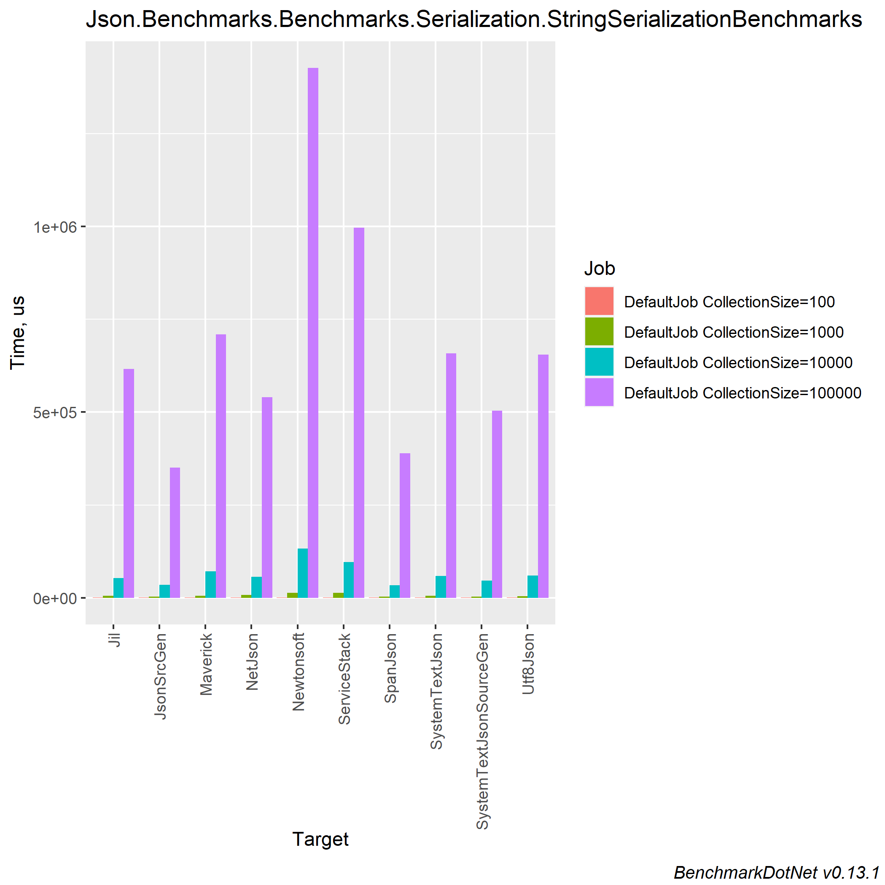


<a name="byte-ser"></a>
### Byte

| Method                  | CollectionSize |          Mean |         Error |        StdDev |       StdErr |        Median |           Min |            Q1 |            Q3 |           Max |       Op/s | Ratio | RatioSD |      Gen 0 |     Gen 1 |    Gen 2 |  Allocated |
|-------------------------|----------------|--------------:|--------------:|--------------:|-------------:|--------------:|--------------:|--------------:|--------------:|--------------:|-----------:|------:|--------:|-----------:|----------:|---------:|-----------:|
| ZeroFormatter           | 100            |      76.58 μs |      1.447 μs |      1.353 μs |     0.349 μs |      75.97 μs |      75.05 μs |      75.65 μs |      77.23 μs |      79.14 μs | 13,058.319 |  0.15 |    0.00 |    39.9780 |    0.8545 |        - |     165 KB |
| MsgPackClassic          | 100            |      97.03 μs |      1.081 μs |      1.012 μs |     0.261 μs |      96.79 μs |      95.98 μs |      96.29 μs |      97.43 μs |      99.04 μs | 10,306.318 |  0.19 |    0.00 |    12.8174 |    2.0752 |        - |      53 KB |
| MsgPackLz4Block         | 100            |     210.81 μs |      1.497 μs |      1.168 μs |     0.337 μs |     210.91 μs |     209.02 μs |     209.77 μs |     211.40 μs |     213.02 μs |  4,743.691 |  0.42 |    0.00 |     9.0332 |    0.9766 |        - |      38 KB |
| SpanJson                | 100            |     341.49 μs |      6.825 μs |     13.941 μs |     1.952 μs |     347.57 μs |     306.80 μs |     344.70 μs |     349.67 μs |     357.38 μs |  2,928.372 |  0.64 |    0.03 |    25.3906 |   25.3906 |  25.3906 |      86 KB |
| SystemTextJsonSourceGen | 100            |     403.95 μs |      4.551 μs |      4.257 μs |     1.099 μs |     402.88 μs |     400.12 μs |     400.76 μs |     406.15 μs |     412.73 μs |  2,475.556 |  0.80 |    0.01 |    26.8555 |   26.8555 |  26.8555 |      95 KB |
| Utf8Json                | 100            |     415.60 μs |      7.530 μs |     13.189 μs |     2.112 μs |     414.51 μs |     400.24 μs |     406.56 μs |     420.74 μs |     460.01 μs |  2,406.155 |  0.84 |    0.04 |    54.1992 |   50.2930 |  50.2930 |     229 KB |
| SystemTextJson          | 100            |     503.88 μs |      4.797 μs |      4.252 μs |     1.136 μs |     503.10 μs |     497.49 μs |     501.09 μs |     506.44 μs |     511.57 μs |  1,984.580 |  1.00 |    0.00 |    22.4609 |   22.4609 |  22.4609 |      86 KB |
|                         |                |               |               |               |              |               |               |               |               |               |            |       |         |            |           |          |            |
| ZeroFormatter           | 1000           |     940.95 μs |     18.780 μs |     52.352 μs |     5.518 μs |     943.64 μs |     823.91 μs |     904.96 μs |     979.99 μs |   1,050.22 μs |  1,062.758 |  0.18 |    0.01 |   189.4531 |  160.1563 | 159.1797 |   1,398 KB |
| MsgPackClassic          | 1000           |   1,107.43 μs |     21.889 μs |     45.204 μs |     6.269 μs |   1,110.76 μs |   1,011.76 μs |   1,073.21 μs |   1,134.97 μs |   1,199.66 μs |    902.988 |  0.22 |    0.00 |    89.8438 |   89.8438 |  89.8438 |     528 KB |
| MsgPackLz4Block         | 1000           |   2,182.44 μs |     40.495 μs |     37.879 μs |     9.780 μs |   2,167.27 μs |   2,128.43 μs |   2,158.16 μs |   2,207.21 μs |   2,249.32 μs |    458.203 |  0.43 |    0.01 |    66.4063 |   66.4063 |  66.4063 |     378 KB |
| SpanJson                | 1000           |   3,268.32 μs |     31.374 μs |     27.812 μs |     7.433 μs |   3,268.37 μs |   3,235.18 μs |   3,243.54 μs |   3,283.75 μs |   3,322.69 μs |    305.968 |  0.64 |    0.01 |   160.1563 |  160.1563 | 160.1563 |     856 KB |
| SystemTextJsonSourceGen | 1000           |   3,845.26 μs |     74.938 μs |     83.294 μs |    19.109 μs |   3,838.25 μs |   3,718.85 μs |   3,804.12 μs |   3,871.84 μs |   4,065.92 μs |    260.061 |  0.76 |    0.02 |   179.6875 |  156.2500 | 156.2500 |     950 KB |
| Utf8Json                | 1000           |   4,337.42 μs |     84.233 μs |    115.300 μs |    22.612 μs |   4,307.33 μs |   4,190.76 μs |   4,258.78 μs |   4,367.23 μs |   4,623.24 μs |    230.552 |  0.85 |    0.02 |   531.2500 |  492.1875 | 492.1875 |   2,932 KB |
| SystemTextJson          | 1000           |   5,087.97 μs |     48.279 μs |     42.798 μs |    11.438 μs |   5,081.96 μs |   5,025.12 μs |   5,059.37 μs |   5,110.20 μs |   5,169.39 μs |    196.542 |  1.00 |    0.00 |   156.2500 |  156.2500 | 156.2500 |     857 KB |
|                         |                |               |               |               |              |               |               |               |               |               |            |       |         |            |           |          |            |
| ZeroFormatter           | 10000          |   9,167.20 μs |    176.725 μs |    436.820 μs |    51.480 μs |   9,140.80 μs |   8,161.22 μs |   8,873.70 μs |   9,408.15 μs |  10,225.77 μs |    109.085 |  0.17 |    0.01 |   523.4375 |  492.1875 | 492.1875 |  11,932 KB |
| MsgPackClassic          | 10000          |  11,380.32 μs |    136.306 μs |    120.832 μs |    32.294 μs |  11,367.02 μs |  11,154.29 μs |  11,307.44 μs |  11,427.73 μs |  11,649.33 μs |     87.871 |  0.21 |    0.00 |   218.7500 |  218.7500 | 218.7500 |   5,280 KB |
| MsgPackLz4Block         | 10000          |  23,277.33 μs |    139.117 μs |    123.324 μs |    32.960 μs |  23,293.39 μs |  23,079.20 μs |  23,205.14 μs |  23,353.73 μs |  23,492.42 μs |     42.960 |  0.43 |    0.01 |   156.2500 |  156.2500 | 156.2500 |   3,773 KB |
| SpanJson                | 10000          |  32,866.66 μs |    458.165 μs |    357.705 μs |   103.261 μs |  32,978.58 μs |  32,234.03 μs |  32,584.51 μs |  33,095.21 μs |  33,332.96 μs |     30.426 |  0.61 |    0.01 |   133.3333 |  133.3333 | 133.3333 |   8,554 KB |
| SystemTextJsonSourceGen | 10000          |  39,430.21 μs |    545.065 μs |    483.186 μs |   129.137 μs |  39,512.99 μs |  38,737.65 μs |  39,004.72 μs |  39,831.79 μs |  40,104.18 μs |     25.361 |  0.74 |    0.02 |   153.8462 |         - |        - |   9,489 KB |
| Utf8Json                | 10000          |  48,396.05 μs |    966.818 μs |  2,142.402 μs |   278.917 μs |  48,347.80 μs |  44,292.97 μs |  46,727.73 μs |  50,008.79 μs |  53,436.05 μs |     20.663 |  0.90 |    0.04 |  1250.0000 |  916.6667 | 916.6667 |  42,755 KB |
| SystemTextJson          | 10000          |  53,582.72 μs |    953.161 μs |    891.588 μs |   230.207 μs |  53,651.17 μs |  52,322.88 μs |  52,898.76 μs |  54,023.42 μs |  55,184.63 μs |     18.663 |  1.00 |    0.00 |          - |         - |        - |   8,552 KB |
|                         |                |               |               |               |              |               |               |               |               |               |            |       |         |            |           |          |            |
| ZeroFormatter           | 100000         |  97,940.18 μs |  1,242.119 μs |  1,037.226 μs |   287.675 μs |  98,017.00 μs |  96,141.40 μs |  97,500.75 μs |  98,867.55 μs |  99,279.63 μs |     10.210 |  0.17 |    0.00 |   333.3333 |  333.3333 | 333.3333 | 168,474 KB |
| MsgPackClassic          | 100000         | 156,369.54 μs |  3,103.813 μs |  8,444.152 μs |   910.556 μs | 153,063.90 μs | 136,677.00 μs | 149,772.70 μs | 164,209.40 μs | 176,006.20 μs |      6.395 |  0.27 |    0.02 |  7000.0000 | 3000.0000 |        - |  96,011 KB |
| MsgPackLz4Block         | 100000         | 289,537.26 μs |  3,588.891 μs |  3,181.459 μs |   850.281 μs | 290,082.40 μs | 283,323.55 μs | 287,498.92 μs | 291,562.11 μs | 294,924.75 μs |      3.454 |  0.50 |    0.02 | 13500.0000 | 7000.0000 | 500.0000 | 119,470 KB |
| SpanJson                | 100000         | 335,118.22 μs |  3,338.245 μs |  2,787.585 μs |   773.137 μs | 335,144.70 μs | 331,672.90 μs | 332,926.60 μs | 338,121.50 μs | 339,244.50 μs |      2.984 |  0.57 |    0.01 |          - |         - |        - |  85,534 KB |
| SystemTextJsonSourceGen | 100000         | 393,964.69 μs |  5,322.479 μs |  4,978.651 μs | 1,285.482 μs | 393,932.60 μs | 386,399.60 μs | 389,371.50 μs | 397,696.10 μs | 402,287.80 μs |      2.538 |  0.68 |    0.02 |  2000.0000 |         - |        - |  94,904 KB |
| Utf8Json                | 100000         | 462,512.96 μs |  9,221.757 μs | 12,310.781 μs | 2,462.156 μs | 466,202.10 μs | 446,827.80 μs | 448,313.60 μs | 471,422.50 μs | 482,201.50 μs |      2.162 |  0.81 |    0.03 |  3000.0000 |         - |        - | 363,157 KB |
| SystemTextJson          | 100000         | 565,357.46 μs | 11,131.670 μs | 19,201.584 μs | 3,114.908 μs | 559,641.65 μs | 539,714.20 μs | 550,505.07 μs | 574,316.32 μs | 615,816.40 μs |      1.769 |  1.00 |    0.00 |          - |         - |        - |  85,522 KB |

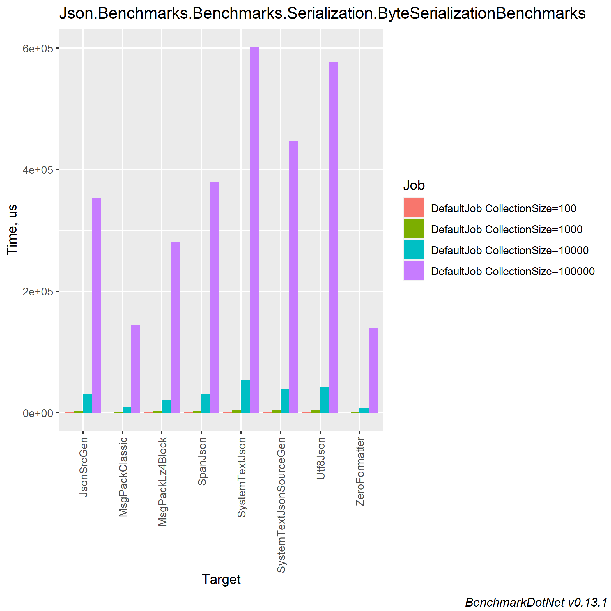
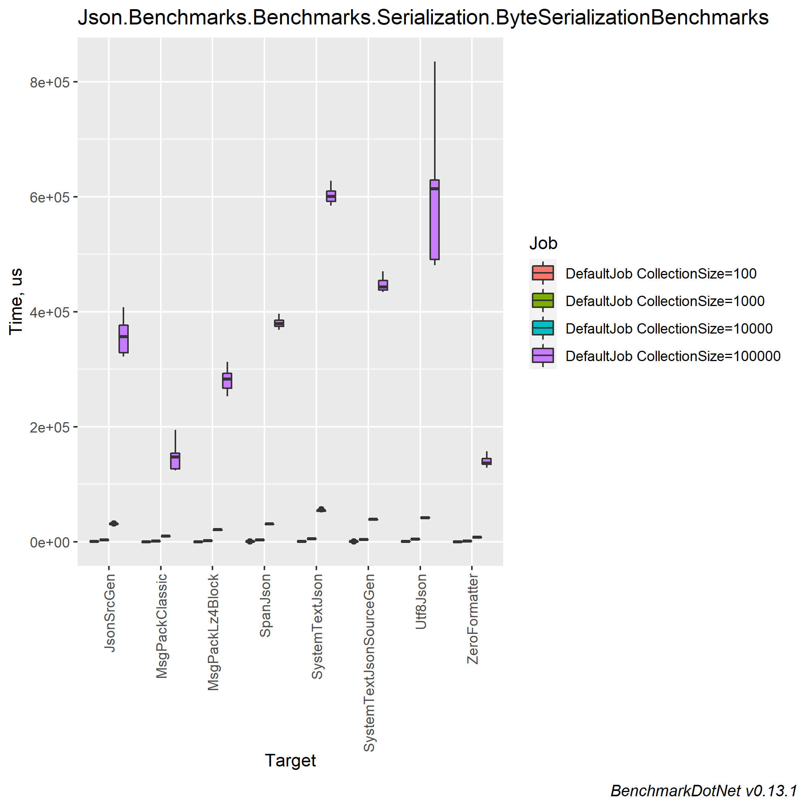

<a name="stream-ser"></a>
### Stream

| Method                  | CollectionSize |          Mean |         Error |        StdDev |       StdErr |           Min |            Q1 |        Median |            Q3 |           Max |       Op/s | Ratio | RatioSD |      Gen 0 |     Gen 1 |    Gen 2 |  Allocated |
|-------------------------|----------------|--------------:|--------------:|--------------:|-------------:|--------------:|--------------:|--------------:|--------------:|--------------:|-----------:|------:|--------:|-----------:|----------:|---------:|-----------:|
| ZeroFormatter           | 100            |      89.84 μs |      1.564 μs |      2.656 μs |     0.437 μs |      85.39 μs |      87.69 μs |      89.99 μs |      92.09 μs |      94.29 μs | 11,131.479 |  0.11 |    0.00 |    49.1333 |   12.2681 |        - |     202 KB |
| MsgPackNoCompress       | 100            |     115.84 μs |      1.247 μs |      1.106 μs |     0.296 μs |     113.58 μs |     115.25 μs |     115.86 μs |     116.67 μs |     117.74 μs |  8,632.548 |  0.14 |    0.00 |    26.9775 |    6.7139 |        - |     112 KB |
| MsgPackLz4Block         | 100            |     217.10 μs |      0.879 μs |      0.734 μs |     0.203 μs |     215.78 μs |     216.54 μs |     217.06 μs |     217.70 μs |     218.13 μs |  4,606.225 |  0.27 |    0.00 |    10.0098 |    1.9531 |        - |      41 KB |
| SystemTextJsonSourceGen | 100            |     554.34 μs |     10.201 μs |      9.043 μs |     2.417 μs |     538.92 μs |     548.14 μs |     555.84 μs |     558.09 μs |     570.80 μs |  1,803.939 |  0.69 |    0.01 |    34.1797 |   34.1797 |  34.1797 |     233 KB |
| Maverick                | 100            |     576.89 μs |      9.463 μs |     14.164 μs |     2.586 μs |     558.81 μs |     566.66 μs |     570.18 μs |     589.69 μs |     615.08 μs |  1,733.439 |  0.72 |    0.02 |    59.5703 |   29.2969 |  29.2969 |     252 KB |
| SystemTextJson          | 100            |     806.92 μs |      5.661 μs |      5.295 μs |     1.367 μs |     798.73 μs |     803.60 μs |     805.70 μs |     810.45 μs |     818.86 μs |  1,239.280 |  1.00 |    0.00 |    68.3594 |   68.3594 |  68.3594 |     327 KB |
|                         |                |               |               |               |              |               |               |               |               |               |            |       |         |            |           |          |            |
| MsgPackNoCompress       | 1000           |   1,140.44 μs |     21.289 μs |     20.909 μs |     5.227 μs |   1,117.36 μs |   1,124.60 μs |   1,135.38 μs |   1,149.38 μs |   1,188.73 μs |    876.852 |  0.19 |    0.00 |   187.5000 |  160.1563 | 160.1563 |   1,121 KB |
| ZeroFormatter           | 1000           |   1,610.02 μs |     41.277 μs |    121.705 μs |    12.170 μs |   1,253.69 μs |   1,529.26 μs |   1,601.81 μs |   1,693.67 μs |   1,911.78 μs |    621.109 |  0.28 |    0.02 |   220.7031 |  189.4531 | 189.4531 |   1,772 KB |
| MsgPackLz4Block         | 1000           |   2,271.88 μs |     30.395 μs |     28.431 μs |     7.341 μs |   2,219.76 μs |   2,244.44 μs |   2,278.87 μs |   2,286.17 μs |   2,318.47 μs |    440.164 |  0.38 |    0.01 |   132.8125 |  121.0938 | 121.0938 |     737 KB |
| SystemTextJsonSourceGen | 1000           |   4,334.43 μs |     86.014 μs |    235.462 μs |    25.244 μs |   4,019.22 μs |   4,140.94 μs |   4,279.43 μs |   4,471.44 μs |   4,987.59 μs |    230.711 |  0.72 |    0.05 |   375.0000 |  335.9375 | 328.1250 |   1,851 KB |
| Maverick                | 1000           |   5,685.48 μs |     83.822 μs |     74.306 μs |    19.859 μs |   5,568.07 μs |   5,647.14 μs |   5,692.58 μs |   5,735.71 μs |   5,795.70 μs |    175.887 |  0.95 |    0.02 |   359.3750 |  328.1250 | 328.1250 |   2,045 KB |
| SystemTextJson          | 1000           |   5,976.42 μs |     97.594 μs |     86.514 μs |    23.122 μs |   5,857.33 μs |   5,920.11 μs |   5,986.36 μs |   6,006.83 μs |   6,171.27 μs |    167.324 |  1.00 |    0.00 |   523.4375 |  500.0000 | 500.0000 |   2,966 KB |
|                         |                |               |               |               |              |               |               |               |               |               |            |       |         |            |           |          |            |
| ZeroFormatter           | 10000          |  12,109.35 μs |    423.900 μs |  1,249.880 μs |   124.988 μs |   9,775.21 μs |  11,000.44 μs |  12,404.14 μs |  13,027.46 μs |  14,466.70 μs |     82.581 |  0.18 |    0.01 |   765.6250 |  734.3750 | 734.3750 |  15,672 KB |
| MsgPackNoCompress       | 10000          |  14,416.85 μs |    257.350 μs |    214.899 μs |    59.602 μs |  14,008.96 μs |  14,267.06 μs |  14,408.36 μs |  14,524.08 μs |  14,847.66 μs |     69.363 |  0.24 |    0.00 |   500.0000 |  484.3750 | 484.3750 |  18,399 KB |
| MsgPackLz4Block         | 10000          |  24,663.28 μs |    221.679 μs |    207.359 μs |    53.540 μs |  24,342.14 μs |  24,523.28 μs |  24,654.41 μs |  24,807.33 μs |  24,982.19 μs |     40.546 |  0.41 |    0.01 |   468.7500 |  468.7500 | 468.7500 |  12,517 KB |
| SystemTextJsonSourceGen | 10000          |  39,626.08 μs |    265.728 μs |    207.463 μs |    59.890 μs |  39,245.95 μs |  39,518.22 μs |  39,694.53 μs |  39,772.03 μs |  39,880.08 μs |     25.236 |  0.65 |    0.01 |   846.1538 |  615.3846 | 615.3846 |  29,041 KB |
| Maverick                | 10000          |  58,783.91 μs |    341.929 μs |    266.956 μs |    77.063 μs |  58,258.84 μs |  58,669.22 μs |  58,744.47 μs |  58,944.52 μs |  59,145.98 μs |     17.011 |  0.97 |    0.02 |   666.6667 |  666.6667 | 666.6667 |  32,768 KB |
| SystemTextJson          | 10000          |  60,659.80 μs |  1,056.061 μs |    987.840 μs |   255.059 μs |  59,133.28 μs |  59,948.60 μs |  60,429.09 μs |  61,389.77 μs |  62,317.04 μs |     16.485 |  1.00 |    0.00 |   777.7778 |  777.7778 | 777.7778 |  25,680 KB |
|                         |                |               |               |               |              |               |               |               |               |               |            |       |         |            |           |          |            |
| ZeroFormatter           | 100000         | 121,025.45 μs |  2,410.925 μs |  4,222.540 μs |   676.148 μs | 110,903.82 μs | 119,240.69 μs | 121,182.50 μs | 123,535.20 μs | 128,947.25 μs |      8.263 |  0.18 |    0.01 |   750.0000 |  750.0000 | 750.0000 | 205,879 KB |
| MsgPackNoCompress       | 100000         | 184,505.93 μs |  3,589.890 μs |  4,792.400 μs |   958.480 μs | 171,989.70 μs | 181,089.40 μs | 184,649.90 μs | 187,151.40 μs | 193,746.60 μs |      5.420 |  0.27 |    0.01 |  7000.0000 | 3000.0000 |        - | 190,609 KB |
| MsgPackLz4Block         | 100000         | 294,959.80 μs |  1,942.928 μs |  1,722.355 μs |   460.319 μs | 291,590.70 μs | 293,924.55 μs | 295,257.42 μs | 295,887.90 μs | 297,991.85 μs |      3.390 |  0.44 |    0.01 | 13500.0000 | 7000.0000 | 500.0000 | 206,701 KB |
| SystemTextJsonSourceGen | 100000         | 450,699.81 μs |  3,304.596 μs |  3,091.122 μs |   798.124 μs | 445,686.90 μs | 448,039.50 μs | 451,314.50 μs | 452,827.25 μs | 455,220.10 μs |      2.219 |  0.67 |    0.02 |  2000.0000 |         - |        - | 232,873 KB |
| Maverick                | 100000         | 647,901.93 μs |  7,248.989 μs |  6,780.709 μs | 1,750.772 μs | 639,979.20 μs | 641,968.35 μs | 648,436.30 μs | 651,830.90 μs | 660,963.50 μs |      1.543 |  0.96 |    0.03 |          - |         - |        - | 262,141 KB |
| SystemTextJson          | 100000         | 676,564.77 μs | 13,018.414 μs | 15,987.782 μs | 3,408.606 μs | 651,348.90 μs | 660,986.95 μs | 680,275.75 μs | 688,796.57 μs | 700,461.40 μs |      1.478 |  1.00 |    0.00 |          - |         - |        - | 360,443 KB |

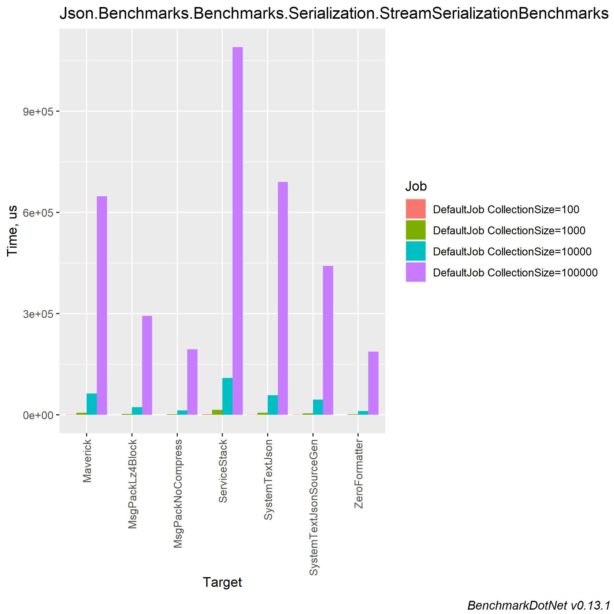
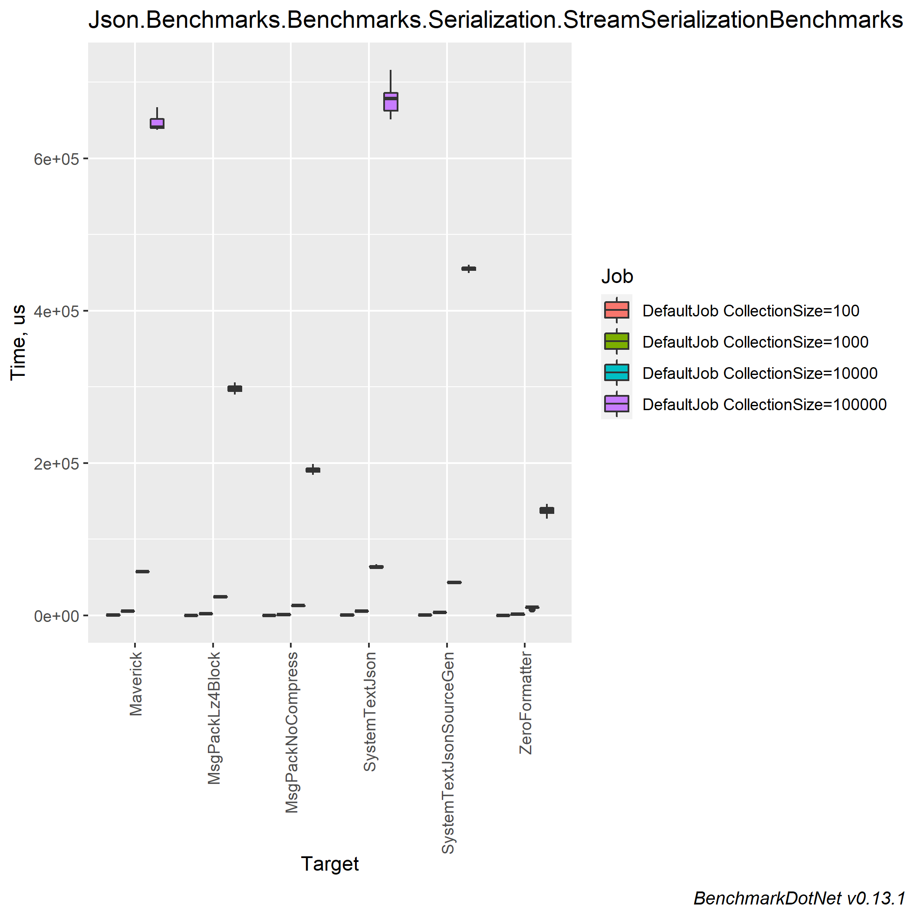

<a name="asynchronous-stream-ser"></a>
### Asynchronous Stream

| Method                  | CollectionSize |         Mean |        Error |       StdDev |      StdErr |          Min |           Q1 |       Median |           Q3 |          Max |      Op/s | Ratio | RatioSD |      Gen 0 |     Gen 1 |    Gen 2 |  Allocated |
|-------------------------|----------------|-------------:|-------------:|-------------:|------------:|-------------:|-------------:|-------------:|-------------:|-------------:|----------:|------:|--------:|-----------:|----------:|---------:|-----------:|
| MsgPackClassic          | 100            |     116.3 μs |      2.22 μs |      2.08 μs |     0.54 μs |     113.3 μs |     114.9 μs |     115.9 μs |     117.3 μs |     120.8 μs | 8,600.263 |  0.20 |    0.00 |    26.9775 |    6.7139 |        - |     112 KB |
| MsgPackLz4Block         | 100            |     218.3 μs |      3.38 μs |      3.16 μs |     0.82 μs |     214.4 μs |     216.1 μs |     217.4 μs |     220.0 μs |     224.8 μs | 4,580.252 |  0.38 |    0.01 |     9.7656 |    1.9531 |        - |      41 KB |
| SpanJson                | 100            |     337.9 μs |      6.67 μs |     13.16 μs |     1.90 μs |     305.6 μs |     337.5 μs |     342.7 μs |     346.2 μs |     355.2 μs | 2,959.484 |  0.59 |    0.02 |    25.3906 |   25.3906 |  25.3906 |      86 KB |
| Utf8Json                | 100            |     518.3 μs |     10.36 μs |     28.02 μs |     3.04 μs |     468.3 μs |     497.1 μs |     514.3 μs |     539.4 μs |     597.1 μs | 1,929.566 |  0.91 |    0.05 |    52.2461 |   48.3398 |  48.3398 |     230 KB |
| SystemTextJson          | 100            |     572.1 μs |      3.27 μs |      6.06 μs |     0.92 μs |     564.5 μs |     568.1 μs |     570.6 μs |     574.7 μs |     589.2 μs | 1,747.890 |  1.00 |    0.00 |    53.7109 |   30.2734 |  29.2969 |     217 KB |
| SystemTextJsonSourceGen | 100            |     683.4 μs |      5.18 μs |      4.32 μs |     1.20 μs |     675.3 μs |     681.2 μs |     682.3 μs |     686.1 μs |     692.8 μs | 1,463.267 |  1.19 |    0.02 |    36.1328 |   36.1328 |  36.1328 |     218 KB |
|                         |                |              |              |              |             |              |              |              |              |              |           |       |         |            |           |          |            |
| MsgPackClassic          | 1000           |   1,232.7 μs |     23.24 μs |     25.83 μs |     5.93 μs |   1,200.7 μs |   1,211.5 μs |   1,228.6 μs |   1,246.9 μs |   1,291.9 μs |   811.240 |  0.22 |    0.01 |   175.7813 |  148.4375 | 148.4375 |   1,121 KB |
| MsgPackLz4Block         | 1000           |   2,513.1 μs |     49.62 μs |     71.17 μs |    13.45 μs |   2,370.8 μs |   2,456.6 μs |   2,501.8 μs |   2,556.3 μs |   2,652.7 μs |   397.919 |  0.45 |    0.01 |   128.9063 |  117.1875 | 117.1875 |     737 KB |
| SpanJson                | 1000           |   3,209.2 μs |     21.37 μs |     18.94 μs |     5.06 μs |   3,172.9 μs |   3,199.8 μs |   3,214.2 μs |   3,221.8 μs |   3,234.0 μs |   311.604 |  0.58 |    0.00 |   160.1563 |  160.1563 | 160.1563 |     857 KB |
| Utf8Json                | 1000           |   4,372.8 μs |     87.10 μs |    100.31 μs |    22.43 μs |   4,226.9 μs |   4,302.9 μs |   4,359.2 μs |   4,444.6 μs |   4,603.4 μs |   228.685 |  0.79 |    0.02 |   523.4375 |  484.3750 | 484.3750 |   2,933 KB |
| SystemTextJsonSourceGen | 1000           |   5,571.3 μs |     46.86 μs |     43.83 μs |    11.32 μs |   5,486.4 μs |   5,545.6 μs |   5,578.0 μs |   5,607.3 μs |   5,640.1 μs |   179.490 |  1.00 |    0.01 |   351.5625 |  328.1250 | 328.1250 |   1,836 KB |
| SystemTextJson          | 1000           |   5,577.4 μs |     35.65 μs |     31.61 μs |     8.45 μs |   5,511.6 μs |   5,556.5 μs |   5,580.4 μs |   5,598.5 μs |   5,618.6 μs |   179.294 |  1.00 |    0.00 |   351.5625 |  328.1250 | 328.1250 |   1,839 KB |
|                         |                |              |              |              |             |              |              |              |              |              |           |       |         |            |           |          |            |
| MsgPackClassic          | 10000          |  13,784.5 μs |    274.27 μs |    703.05 μs |    80.12 μs |  12,314.7 μs |  13,193.3 μs |  13,971.0 μs |  14,245.6 μs |  15,023.1 μs |    72.545 |  0.24 |    0.01 |   484.3750 |  468.7500 | 468.7500 |  18,391 KB |
| MsgPackLz4Block         | 10000          |  25,193.0 μs |    202.89 μs |    189.79 μs |    49.00 μs |  24,739.0 μs |  25,088.9 μs |  25,223.0 μs |  25,307.8 μs |  25,490.1 μs |    39.694 |  0.45 |    0.00 |   468.7500 |  468.7500 | 468.7500 |  12,516 KB |
| SpanJson                | 10000          |  30,897.1 μs |    215.88 μs |    191.37 μs |    51.15 μs |  30,665.4 μs |  30,779.1 μs |  30,856.4 μs |  31,011.7 μs |  31,389.5 μs |    32.365 |  0.56 |    0.00 |   218.7500 |  218.7500 | 218.7500 |   8,555 KB |
| Utf8Json                | 10000          |  49,375.8 μs |    972.90 μs |  1,395.30 μs |   263.69 μs |  45,856.6 μs |  48,628.7 μs |  49,694.3 μs |  50,135.3 μs |  51,560.4 μs |    20.253 |  0.89 |    0.03 |  1083.3333 |  750.0000 | 750.0000 |  42,755 KB |
| SystemTextJsonSourceGen | 10000          |  55,261.5 μs |    487.16 μs |    431.85 μs |   115.42 μs |  54,480.6 μs |  54,927.1 μs |  55,333.7 μs |  55,429.7 μs |  56,040.8 μs |    18.096 |  0.99 |    0.01 |   600.0000 |  600.0000 | 600.0000 |  29,559 KB |
| SystemTextJson          | 10000          |  55,498.8 μs |    302.00 μs |    252.18 μs |    69.94 μs |  55,023.7 μs |  55,391.4 μs |  55,482.4 μs |  55,594.0 μs |  55,961.2 μs |    18.018 |  1.00 |    0.00 |   666.6667 |  666.6667 | 666.6667 |  29,548 KB |
|                         |                |              |              |              |             |              |              |              |              |              |           |       |         |            |           |          |            |
| MsgPackClassic          | 100000         | 183,107.0 μs |  3,746.94 μs | 10,810.77 μs | 1,103.37 μs | 167,368.0 μs | 175,597.8 μs | 180,457.5 μs | 187,397.8 μs | 209,471.5 μs |     5.461 |  0.33 |    0.01 |  7000.0000 | 3000.0000 |        - | 190,593 KB |
| MsgPackLz4Block         | 100000         | 287,458.6 μs |  4,957.61 μs |  4,394.79 μs | 1,174.56 μs | 282,222.2 μs | 284,466.4 μs | 286,628.8 μs | 288,724.2 μs | 296,398.3 μs |     3.479 |  0.47 |    0.01 | 13000.0000 | 6000.0000 |        - | 206,615 KB |
| SpanJson                | 100000         | 332,719.6 μs |  1,289.15 μs |  1,142.80 μs |   305.43 μs | 331,223.8 μs | 331,887.5 μs | 332,581.2 μs | 333,443.6 μs | 335,233.2 μs |     3.006 |  0.55 |    0.00 |          - |         - |        - |  85,536 KB |
| Utf8Json                | 100000         | 501,516.7 μs |  9,813.11 μs | 15,277.84 μs | 2,700.77 μs | 477,457.4 μs | 488,405.7 μs | 501,365.1 μs | 514,710.1 μs | 530,252.4 μs |     1.994 |  0.82 |    0.03 |  3000.0000 |         - |        - | 363,148 KB |
| SystemTextJson          | 100000         | 608,447.1 μs |  3,585.18 μs |  2,799.07 μs |   808.02 μs | 602,138.7 μs | 607,131.4 μs | 607,949.9 μs | 610,376.9 μs | 612,280.7 μs |     1.644 |  1.00 |    0.00 |          - |         - |        - | 237,012 KB |
| SystemTextJsonSourceGen | 100000         | 616,278.5 μs | 10,167.78 μs |  9,013.47 μs | 2,408.95 μs | 606,589.1 μs | 611,593.8 μs | 613,953.3 μs | 619,221.7 μs | 636,955.5 μs |     1.623 |  1.01 |    0.02 |          - |         - |        - | 236,295 KB |

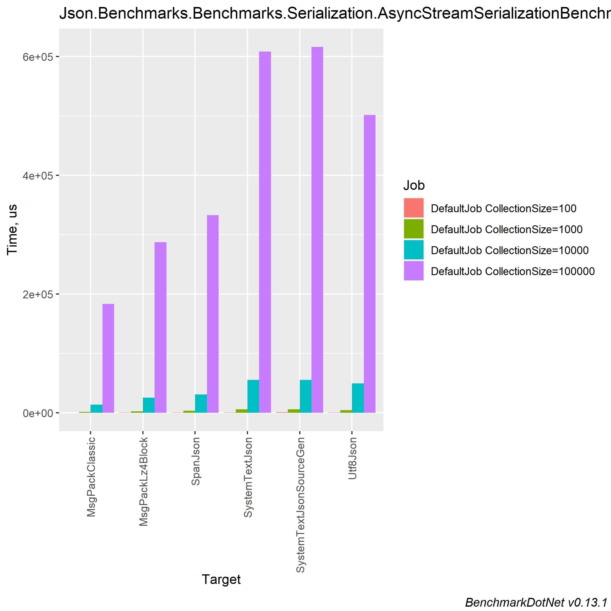
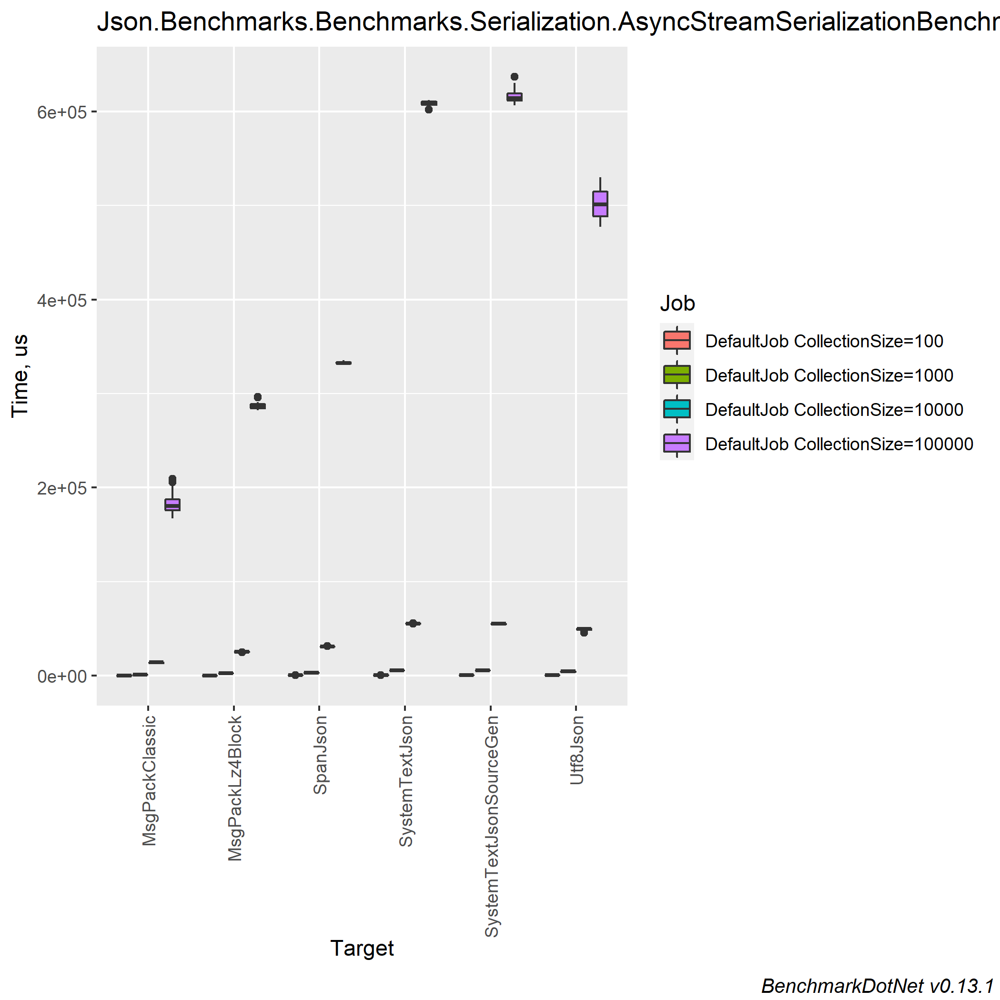

<a name="conclusions"></a>
## Conclusions

`Jil` behaved very unexpectedly bad. In some cases it refused to work with no reason.

Personally i will recommend using `SpanJson`. It has clean api and no additional overhead.
The two fastest are `MessagePack` and `Protobuf`, but they come with cost of compatibility with other serializers and have extraordinary API.

`SpanJson` is good at combining with `System.Text.Json` or `Newtonsoft.Json`, so consider using it in your project