# Comparing different libraries for Json Serialization/Deserialization

### Table of contents
- [Machine information](#machine-information)
- [Sources](#sources)
- [Benchmark results](#benchmark-results)
  * [Deserialization](#deserialization)
    * [String](#string-des)
    * [Byte string](#byte-string-des)
    * [Stream](#stream-des)
    * [Asynchronous stream](#asynchronous-stream-des)
  * [Serialization](#serialization)
    * [String](#string-ser)
    * [Byte](#byte-ser)
    * [Stream](#stream-ser)
    * [Asynchronous stream](#asynchronous-stream-ser)
- [Conclusions](#conclusions)

<a name="machine-information"></a>
## Machine Information

``` ini
BenchmarkDotNet=v0.13.1, OS=Windows 10.0.22621
Intel Core i7-8550U CPU 1.80GHz (Kaby Lake R), 1 CPU, 8 logical and 4 physical cores
.NET SDK=6.0.202
  [Host]     : .NET 6.0.4 (6.0.422.16404), X64 RyuJIT
  DefaultJob : .NET 6.0.4 (6.0.422.16404), X64 RyuJIT
```
<a name="sources"></a>
## Sources

Currently, following Json Serialization/Deserialization libraries were used:

- MaverickJson : https://github.com/zlatanov/json
- SpanJson : https://github.com/Tornhoof/SpanJson
- MsgPack : https://github.com/neuecc/MessagePack-CSharp
- Jil : https://github.com/kevin-montrose/Jil
- Utf8Json : https://github.com/neuecc/Utf8Json
- Newtonsoft.Json : https://github.com/JamesNK/Newtonsoft.Json
- Protobuf.Net : https://github.com/protobuf-net/protobuf-net
- ZeroFormatter : https://github.com/alexinea/Alexinea.ZeroFormatter/ (fork with fixes) **Note** This library is no longer supported, so i use this fork with fixes.

<a name="benchmark-results"></a>
## Benchmark results

<a name="deserialization"></a>
## Deserialization

<a name="string-des"></a>
### String

| Method                  | CollectionSize |           Mean |        Error |       StdDev |      StdErr |            Min |             Q1 |         Median |             Q3 |            Max |       Op/s | Ratio | RatioSD |      Gen 0 |      Gen 1 |    Gen 2 |  Allocated |
|-------------------------|----------------|---------------:|-------------:|-------------:|------------:|---------------:|---------------:|---------------:|---------------:|---------------:|-----------:|------:|--------:|-----------:|-----------:|---------:|-----------:|
| SpanJson                | 1000           |       600.7 μs |      5.68 μs |      4.74 μs |     1.31 μs |       593.9 μs |       596.7 μs |       602.4 μs |       603.6 μs |       610.3 μs | 1,664.6227 |  0.50 |    0.01 |    36.1328 |    15.6250 |        - |     183 KB |
| Jil                     | 1000           |       868.0 μs |      5.89 μs |      5.51 μs |     1.42 μs |       856.9 μs |       863.8 μs |       868.9 μs |       872.6 μs |       874.3 μs | 1,152.0349 |  0.72 |    0.01 |    36.1328 |    13.6719 |        - |     191 KB |
| Utf8Json                | 1000           |       993.9 μs |     19.49 μs |     20.01 μs |     4.85 μs |       972.5 μs |       978.0 μs |       982.2 μs |     1,008.3 μs |     1,029.7 μs | 1,006.0892 |  0.82 |    0.02 |    71.2891 |    61.5234 |  38.0859 |     330 KB |
| SystemTextJson          | 1000           |     1,204.9 μs |     21.91 μs |     19.42 μs |     5.19 μs |     1,180.1 μs |     1,192.8 μs |     1,201.6 μs |     1,210.6 μs |     1,242.5 μs |   829.9323 |  1.00 |    0.00 |    37.1094 |    15.6250 |        - |     192 KB |
| SystemTextJsonSourceGen | 1000           |     1,223.7 μs |     21.05 μs |     19.69 μs |     5.08 μs |     1,193.5 μs |     1,210.5 μs |     1,214.3 μs |     1,238.4 μs |     1,259.4 μs |   817.2239 |  1.02 |    0.02 |    37.1094 |    15.6250 |        - |     192 KB |
| Maverick                | 1000           |     1,580.5 μs |     18.11 μs |     16.94 μs |     4.37 μs |     1,562.9 μs |     1,567.3 μs |     1,573.0 μs |     1,593.2 μs |     1,615.4 μs |   632.7300 |  1.31 |    0.03 |    41.0156 |    11.7188 |        - |     203 KB |
| Newtonsoft              | 1000           |     2,284.5 μs |     30.48 μs |     27.02 μs |     7.22 μs |     2,246.5 μs |     2,265.5 μs |     2,283.6 μs |     2,297.1 μs |     2,345.4 μs |   437.7352 |  1.90 |    0.04 |    89.8438 |    42.9688 |        - |     477 KB |
|                         |                |                |              |              |             |                |                |                |                |                |            |       |         |            |            |          |            |
| SpanJson                | 10000          |     6,931.8 μs |     41.26 μs |     38.60 μs |     9.97 μs |     6,890.2 μs |     6,899.9 μs |     6,916.8 μs |     6,948.0 μs |     7,000.7 μs |   144.2623 |  0.48 |    0.01 |   296.8750 |   148.4375 |        - |   1,827 KB |
| Jil                     | 10000          |    10,435.8 μs |    169.21 μs |    158.27 μs |    40.87 μs |    10,177.0 μs |    10,344.9 μs |    10,420.3 μs |    10,541.9 μs |    10,743.4 μs |    95.8239 |  0.72 |    0.01 |   328.1250 |   125.0000 |  31.2500 |   2,005 KB |
| Utf8Json                | 10000          |    12,098.3 μs |     75.56 μs |     66.98 μs |    17.90 μs |    11,975.0 μs |    12,050.9 μs |    12,105.5 μs |    12,148.1 μs |    12,211.9 μs |    82.6564 |  0.83 |    0.01 |   359.3750 |   203.1250 |  93.7500 |   3,387 KB |
| SystemTextJson          | 10000          |    14,533.7 μs |    178.76 μs |    158.47 μs |    42.35 μs |    14,290.4 μs |    14,413.9 μs |    14,535.0 μs |    14,634.2 μs |    14,858.8 μs |    68.8058 |  1.00 |    0.00 |   375.0000 |   203.1250 | 109.3750 |   3,387 KB |
| SystemTextJsonSourceGen | 10000          |    14,721.1 μs |    188.29 μs |    176.12 μs |    45.48 μs |    14,414.4 μs |    14,606.6 μs |    14,709.0 μs |    14,840.1 μs |    15,041.5 μs |    67.9298 |  1.01 |    0.02 |   375.0000 |   203.1250 | 109.3750 |   3,387 KB |
| Maverick                | 10000          |    19,172.8 μs |    265.92 μs |    248.75 μs |    64.23 μs |    18,658.1 μs |    19,049.9 μs |    19,176.7 μs |    19,353.5 μs |    19,625.8 μs |    52.1571 |  1.32 |    0.02 |   562.5000 |   218.7500 |  62.5000 |   3,244 KB |
| Newtonsoft              | 10000          |    27,905.5 μs |    443.83 μs |    370.62 μs |   102.79 μs |    27,129.3 μs |    27,709.0 μs |    27,901.8 μs |    28,133.9 μs |    28,530.3 μs |    35.8352 |  1.92 |    0.04 |   812.5000 |   281.2500 |  93.7500 |   4,823 KB |
|                         |                |                |              |              |             |                |                |                |                |                |            |       |         |            |            |          |            |
| SpanJson                | 100000         |    89,392.9 μs |  1,495.82 μs |  1,399.19 μs |   361.27 μs |    86,903.7 μs |    88,554.6 μs |    88,978.7 μs |    90,334.1 μs |    92,309.2 μs |    11.1866 |  0.58 |    0.01 |  3166.6667 |  1333.3333 | 333.3333 |  18,266 KB |
| Jil                     | 100000         |   111,001.1 μs |  1,072.98 μs |    895.98 μs |   248.50 μs |   109,332.6 μs |   110,450.8 μs |   110,808.6 μs |   111,645.1 μs |   112,571.6 μs |     9.0089 |  0.72 |    0.01 |  3000.0000 |  1200.0000 | 200.0000 |  19,533 KB |
| Utf8Json                | 100000         |   126,188.5 μs |  1,883.14 μs |  1,761.49 μs |   454.81 μs |   124,011.0 μs |   124,863.2 μs |   125,595.6 μs |   127,706.7 μs |   129,243.8 μs |     7.9247 |  0.82 |    0.02 |  3000.0000 |  1250.0000 | 250.0000 |  33,348 KB |
| SystemTextJson          | 100000         |   154,180.3 μs |  2,849.46 μs |  2,379.43 μs |   659.93 μs |   151,207.5 μs |   152,929.8 μs |   153,687.6 μs |   155,229.8 μs |   159,391.9 μs |     6.4859 |  1.00 |    0.00 |  3000.0000 |  1250.0000 | 250.0000 |  33,348 KB |
| SystemTextJsonSourceGen | 100000         |   154,239.8 μs |  2,285.70 μs |  2,138.04 μs |   552.04 μs |   150,125.4 μs |   153,170.1 μs |   153,469.7 μs |   155,570.9 μs |   158,639.6 μs |     6.4834 |  1.00 |    0.02 |  3000.0000 |  1250.0000 | 250.0000 |  33,348 KB |
| Maverick                | 100000         |   181,069.5 μs |  3,193.49 μs |  2,987.19 μs |   771.29 μs |   176,378.5 μs |   178,869.6 μs |   181,661.1 μs |   182,575.0 μs |   186,929.0 μs |     5.5227 |  1.17 |    0.02 |  5000.0000 |  2000.0000 |        - |  34,231 KB |
| Newtonsoft              | 100000         |   283,909.3 μs |  2,190.21 μs |  1,828.93 μs |   507.25 μs |   281,726.4 μs |   282,442.0 μs |   283,586.2 μs |   284,892.3 μs |   288,251.5 μs |     3.5223 |  1.84 |    0.03 |  7000.0000 |  2000.0000 |        - |  47,666 KB |
|                         |                |                |              |              |             |                |                |                |                |                |            |       |         |            |            |          |            |
| SpanJson                | 1000000        |   949,570.2 μs | 18,240.14 μs | 18,731.28 μs | 4,543.00 μs |   915,064.5 μs |   947,948.0 μs |   955,429.1 μs |   961,739.8 μs |   978,981.6 μs |     1.0531 |  0.58 |    0.02 | 28000.0000 |  9000.0000 |        - | 182,681 KB |
| Jil                     | 1000000        | 1,182,723.4 μs | 16,863.47 μs | 15,774.10 μs | 4,072.86 μs | 1,153,978.3 μs | 1,168,572.2 μs | 1,184,302.1 μs | 1,193,182.2 μs | 1,207,311.7 μs |     0.8455 |  0.73 |    0.01 | 28000.0000 |  9000.0000 |        - | 191,253 KB |
| Utf8Json                | 1000000        | 1,345,978.1 μs | 11,743.32 μs |  9,806.20 μs | 2,719.75 μs | 1,333,916.2 μs | 1,339,729.2 μs | 1,342,782.2 μs | 1,350,410.1 μs | 1,369,596.9 μs |     0.7430 |  0.83 |    0.01 | 28000.0000 |  9000.0000 |        - | 329,400 KB |
| SystemTextJson          | 1000000        | 1,621,824.5 μs | 27,129.69 μs | 25,377.13 μs | 6,552.35 μs | 1,589,490.9 μs | 1,603,499.4 μs | 1,621,064.0 μs | 1,637,453.4 μs | 1,670,535.2 μs |     0.6166 |  1.00 |    0.00 | 28000.0000 |  9000.0000 |        - | 329,404 KB |
| SystemTextJsonSourceGen | 1000000        | 1,622,151.6 μs | 24,597.43 μs | 23,008.45 μs | 5,940.76 μs | 1,592,347.7 μs | 1,604,899.6 μs | 1,617,780.6 μs | 1,638,880.8 μs | 1,673,925.5 μs |     0.6165 |  1.00 |    0.02 | 28000.0000 |  9000.0000 |        - | 329,401 KB |
| Maverick                | 1000000        | 1,967,597.9 μs | 26,962.78 μs | 22,515.14 μs | 6,244.58 μs | 1,927,374.8 μs | 1,955,955.2 μs | 1,968,860.1 μs | 1,979,703.1 μs | 2,012,425.5 μs |     0.5082 |  1.22 |    0.02 | 51000.0000 | 17000.0000 |        - | 340,951 KB |
| Newtonsoft              | 1000000        | 2,934,562.0 μs | 37,890.05 μs | 31,639.91 μs | 8,775.33 μs | 2,881,069.7 μs | 2,909,509.1 μs | 2,930,660.2 μs | 2,966,308.5 μs | 2,978,517.3 μs |     0.3408 |  1.81 |    0.03 | 74000.0000 | 20000.0000 |        - | 472,507 KB |

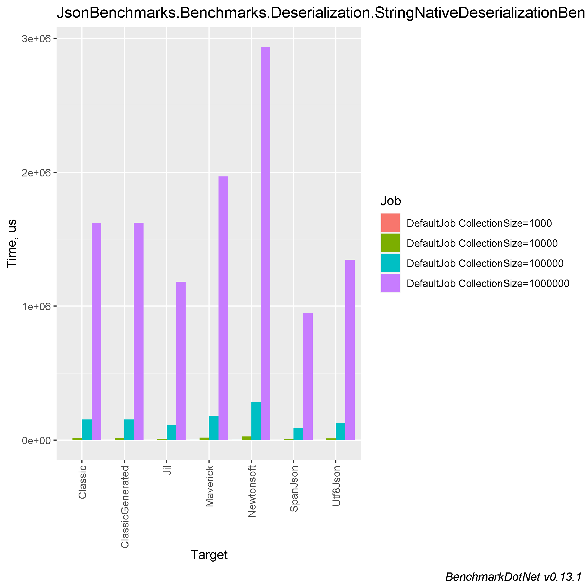
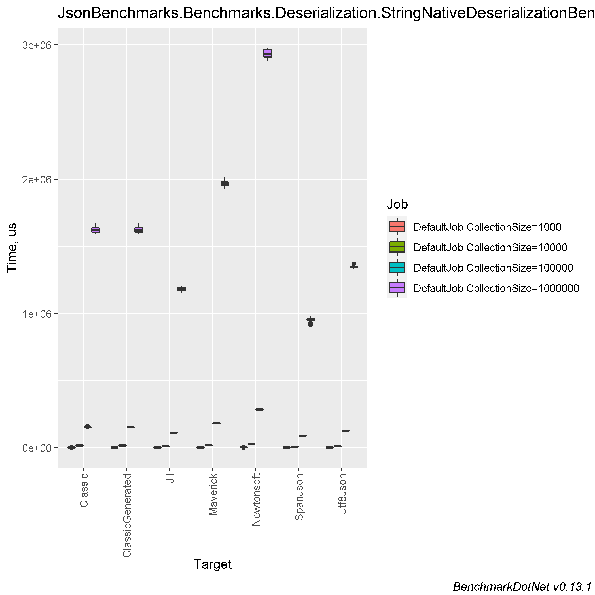

<a name="byte-string-des"></a>
### Byte string

| Method                  | CollectionSize |           Mean |         Error |        StdDev |       StdErr |         Median |            Min |             Q1 |             Q3 |            Max |       Op/s | Ratio | RatioSD |      Gen 0 |      Gen 1 |    Gen 2 |  Allocated |
|-------------------------|----------------|---------------:|--------------:|--------------:|-------------:|---------------:|---------------:|---------------:|---------------:|---------------:|-----------:|------:|--------:|-----------:|-----------:|---------:|-----------:|
| ZeroFormatter           | 1000           |       337.9 μs |       1.68 μs |       1.57 μs |      0.40 μs |       337.6 μs |       335.0 μs |       337.0 μs |       339.0 μs |       340.4 μs | 2,959.0393 |  0.28 |    0.00 |    64.9414 |    32.2266 |        - |     398 KB |
| Protobuf                | 1000           |       467.6 μs |       4.61 μs |       4.09 μs |      1.09 μs |       466.0 μs |       461.6 μs |       464.8 μs |       470.0 μs |       476.5 μs | 2,138.7940 |  0.39 |    0.00 |    36.1328 |    16.6016 |        - |     183 KB |
| MsgPack                 | 1000           |       534.1 μs |       8.61 μs |       8.06 μs |      2.08 μs |       533.2 μs |       523.1 μs |       527.3 μs |       541.9 μs |       545.2 μs | 1,872.2872 |  0.44 |    0.01 |    36.1328 |    15.6250 |        - |     183 KB |
| SpanJson                | 1000           |       669.3 μs |       6.01 μs |       5.33 μs |      1.42 μs |       670.8 μs |       660.2 μs |       665.8 μs |       672.3 μs |       677.9 μs | 1,494.0817 |  0.56 |    0.01 |    37.1094 |    16.6016 |        - |     183 KB |
| Utf8Json                | 1000           |       910.6 μs |       5.48 μs |       4.86 μs |      1.30 μs |       909.9 μs |       901.9 μs |       908.5 μs |       914.5 μs |       918.1 μs | 1,098.2016 |  0.76 |    0.01 |    35.1563 |    14.6484 |        - |     191 KB |
| SystemTextJsonSourceGen | 1000           |     1,184.1 μs |      14.42 μs |      12.05 μs |      3.34 μs |     1,184.2 μs |     1,163.2 μs |     1,177.6 μs |     1,193.2 μs |     1,203.0 μs |   844.5185 |  0.99 |    0.01 |    35.1563 |    15.6250 |        - |     192 KB |
| SystemTextJson          | 1000           |     1,202.3 μs |      11.98 μs |      10.62 μs |      2.84 μs |     1,204.0 μs |     1,182.5 μs |     1,196.4 μs |     1,206.5 μs |     1,219.2 μs |   831.7586 |  1.00 |    0.00 |    35.1563 |    15.6250 |        - |     192 KB |
| Maverick                | 1000           |     1,511.6 μs |      24.26 μs |      22.70 μs |      5.86 μs |     1,507.8 μs |     1,476.8 μs |     1,497.1 μs |     1,522.6 μs |     1,552.4 μs |   661.5555 |  1.26 |    0.02 |    37.1094 |    15.6250 |        - |     191 KB |
|                         |                |                |               |               |              |                |                |                |                |                |            |       |         |            |            |          |            |
| Protobuf                | 10000          |     5,840.0 μs |     136.33 μs |     388.95 μs |     40.12 μs |     5,809.6 μs |     5,270.5 μs |     5,511.5 μs |     6,044.7 μs |     6,947.5 μs |   171.2317 |  0.39 |    0.01 |   296.8750 |   148.4375 |        - |   1,827 KB |
| MsgPack                 | 10000          |     6,602.1 μs |     165.57 μs |     477.71 μs |     48.76 μs |     6,525.8 μs |     5,893.9 μs |     6,259.4 μs |     6,916.5 μs |     7,805.7 μs |   151.4665 |  0.48 |    0.03 |   296.8750 |   148.4375 |        - |   1,827 KB |
| SpanJson                | 10000          |     7,541.9 μs |     128.50 μs |     192.34 μs |     35.12 μs |     7,460.6 μs |     7,308.9 μs |     7,417.1 μs |     7,652.7 μs |     7,937.2 μs |   132.5934 |  0.55 |    0.02 |   296.8750 |   148.4375 |        - |   1,827 KB |
| ZeroFormatter           | 10000          |     7,875.5 μs |     275.46 μs |     794.76 μs |     81.11 μs |     7,818.3 μs |     6,552.1 μs |     7,269.2 μs |     8,317.0 μs |    10,258.7 μs |   126.9757 |  0.55 |    0.06 |   687.5000 |   343.7500 |  39.0625 |   3,984 KB |
| Utf8Json                | 10000          |    11,308.7 μs |     148.23 μs |     131.40 μs |     35.12 μs |    11,313.3 μs |    11,108.1 μs |    11,232.7 μs |    11,378.6 μs |    11,519.3 μs |    88.4275 |  0.81 |    0.01 |   328.1250 |   125.0000 |  31.2500 |   2,005 KB |
| SystemTextJson          | 10000          |    13,881.0 μs |     177.96 μs |     166.46 μs |     42.98 μs |    13,885.2 μs |    13,619.2 μs |    13,768.3 μs |    13,982.3 μs |    14,259.0 μs |    72.0408 |  1.00 |    0.00 |   328.1250 |   125.0000 |  31.2500 |   2,006 KB |
| SystemTextJsonSourceGen | 10000          |    14,026.5 μs |     152.37 μs |     142.52 μs |     36.80 μs |    14,028.5 μs |    13,730.9 μs |    13,955.0 μs |    14,124.5 μs |    14,260.5 μs |    71.2936 |  1.01 |    0.01 |   328.1250 |   125.0000 |  31.2500 |   2,006 KB |
| Maverick                | 10000          |    16,737.6 μs |     157.24 μs |     139.39 μs |     37.25 μs |    16,782.6 μs |    16,403.2 μs |    16,677.8 μs |    16,825.1 μs |    16,928.8 μs |    59.7456 |  1.21 |    0.02 |   312.5000 |   125.0000 |  31.2500 |   2,005 KB |
|                         |                |                |               |               |              |                |                |                |                |                |            |       |         |            |            |          |            |
| Protobuf                | 100000         |    76,135.3 μs |   1,506.86 μs |   3,145.39 μs |    432.05 μs |    75,920.3 μs |    70,078.5 μs |    73,739.6 μs |    77,764.6 μs |    83,862.1 μs |    13.1345 |  0.51 |    0.03 |  3000.0000 |  1142.8571 | 285.7143 |  18,266 KB |
| MsgPack                 | 100000         |    87,565.4 μs |   3,252.21 μs |   9,435.24 μs |    958.00 μs |    82,925.0 μs |    77,095.5 μs |    80,266.5 μs |    93,456.6 μs |   115,632.9 μs |    11.4200 |  0.58 |    0.08 |  3000.0000 |  1142.8571 | 285.7143 |  18,266 KB |
| SpanJson                | 100000         |   108,861.0 μs |   3,521.06 μs |  10,215.23 μs |  1,037.20 μs |   105,923.7 μs |    97,327.9 μs |   100,257.5 μs |   115,095.3 μs |   139,199.9 μs |     9.1860 |  0.72 |    0.06 |  3000.0000 |  1200.0000 | 200.0000 |  18,267 KB |
| ZeroFormatter           | 100000         |   110,134.0 μs |   2,158.76 μs |   2,569.85 μs |    560.79 μs |   109,554.6 μs |   107,001.1 μs |   108,075.5 μs |   111,534.9 μs |   116,279.3 μs |     9.0798 |  0.74 |    0.03 |  6750.0000 |  2500.0000 | 500.0000 |  39,844 KB |
| Utf8Json                | 100000         |   126,852.0 μs |   3,295.96 μs |   9,666.47 μs |    971.52 μs |   124,330.7 μs |   114,708.0 μs |   118,507.4 μs |   132,818.0 μs |   153,455.4 μs |     7.8832 |  0.84 |    0.06 |  3000.0000 |  1200.0000 | 200.0000 |  19,533 KB |
| SystemTextJson          | 100000         |   150,700.0 μs |   2,982.06 μs |   4,729.87 μs |    823.36 μs |   149,996.3 μs |   143,026.6 μs |   148,782.3 μs |   151,780.6 μs |   166,343.1 μs |     6.6357 |  1.00 |    0.00 |  2666.6667 |  1000.0000 |        - |  19,534 KB |
| SystemTextJsonSourceGen | 100000         |   165,278.2 μs |   4,697.76 μs |  13,629.05 μs |  1,383.82 μs |   162,796.8 μs |   145,030.8 μs |   155,239.4 μs |   171,711.4 μs |   202,626.1 μs |     6.0504 |  1.10 |    0.11 |  2750.0000 |  1000.0000 |        - |  19,534 KB |
| Maverick                | 100000         |   182,946.9 μs |   3,084.73 μs |   3,428.67 μs |    786.59 μs |   182,080.9 μs |   179,255.2 μs |   180,593.0 μs |   183,231.9 μs |   190,260.6 μs |     5.4661 |  1.23 |    0.04 |  2000.0000 |  1000.0000 |        - |  19,534 KB |
|                         |                |                |               |               |              |                |                |                |                |                |            |       |         |            |            |          |            |
| Protobuf                | 1000000        |   782,069.9 μs |  15,414.70 μs |  14,418.92 μs |  3,722.95 μs |   781,122.4 μs |   761,242.3 μs |   772,252.2 μs |   790,372.1 μs |   808,142.3 μs |     1.2787 |  0.46 |    0.03 | 28000.0000 |  9000.0000 |        - | 182,684 KB |
| MsgPack                 | 1000000        |   829,361.8 μs |  12,366.46 μs |  10,326.55 μs |  2,864.07 μs |   832,688.0 μs |   813,672.2 μs |   823,060.5 μs |   833,709.7 μs |   850,597.1 μs |     1.2057 |  0.49 |    0.03 | 28000.0000 |  9000.0000 |        - | 182,681 KB |
| SpanJson                | 1000000        | 1,018,852.8 μs |  19,799.92 μs |  21,185.70 μs |  4,993.52 μs | 1,015,803.6 μs |   981,725.4 μs | 1,006,290.5 μs | 1,030,389.1 μs | 1,057,444.0 μs |     0.9815 |  0.60 |    0.04 | 28000.0000 |  9000.0000 |        - | 182,681 KB |
| ZeroFormatter           | 1000000        | 1,131,548.1 μs |  17,872.26 μs |  15,843.29 μs |  4,234.30 μs | 1,129,274.8 μs | 1,107,233.2 μs | 1,122,163.7 μs | 1,138,775.5 μs | 1,165,911.2 μs |     0.8837 |  0.66 |    0.05 | 63000.0000 | 21000.0000 |        - | 398,441 KB |
| Utf8Json                | 1000000        | 1,256,615.1 μs |  14,027.70 μs |  12,435.19 μs |  3,323.45 μs | 1,257,202.4 μs | 1,241,031.0 μs | 1,245,260.9 μs | 1,264,755.6 μs | 1,281,981.2 μs |     0.7958 |  0.74 |    0.05 | 28000.0000 |  9000.0000 |        - | 191,253 KB |
| SystemTextJson          | 1000000        | 1,725,785.3 μs |  32,365.36 μs |  90,755.93 μs |  9,513.81 μs | 1,705,544.9 μs | 1,575,882.3 μs | 1,656,491.9 μs | 1,767,639.1 μs | 1,952,290.5 μs |     0.5794 |  1.00 |    0.00 | 28000.0000 |  9000.0000 |        - | 191,253 KB |
| SystemTextJsonSourceGen | 1000000        | 2,125,270.3 μs | 217,519.56 μs | 641,361.32 μs | 64,136.13 μs | 1,802,800.2 μs | 1,529,247.6 μs | 1,676,026.1 μs | 2,891,662.5 μs | 4,027,072.9 μs |     0.4705 |  1.26 |    0.37 | 28000.0000 |  9000.0000 |        - | 191,253 KB |
| Maverick                | 1000000        | 2,210,232.7 μs |  83,591.99 μs | 231,633.02 μs | 24,553.05 μs | 2,201,368.5 μs | 1,854,129.8 μs | 2,052,940.6 μs | 2,295,849.3 μs | 2,871,131.3 μs |     0.4524 |  1.28 |    0.15 | 28000.0000 |  9000.0000 |        - | 191,253 KB |

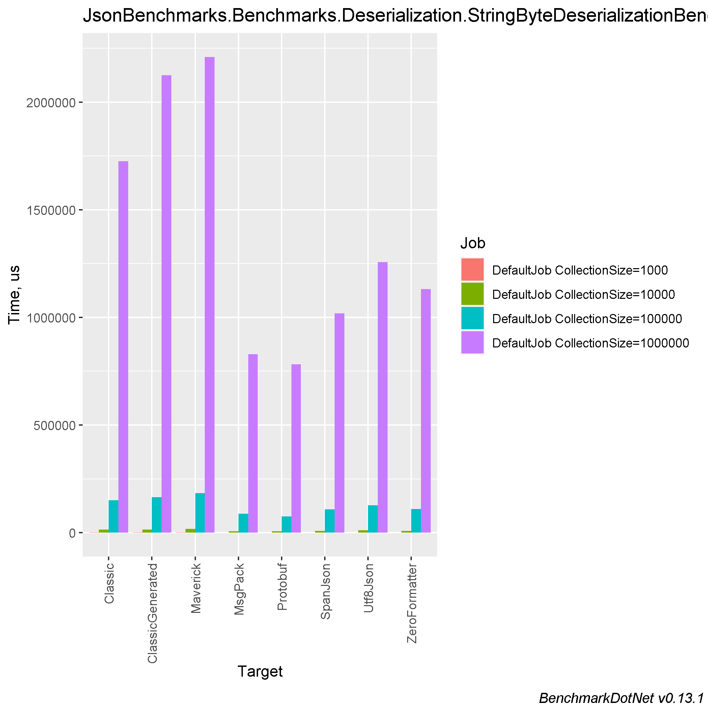
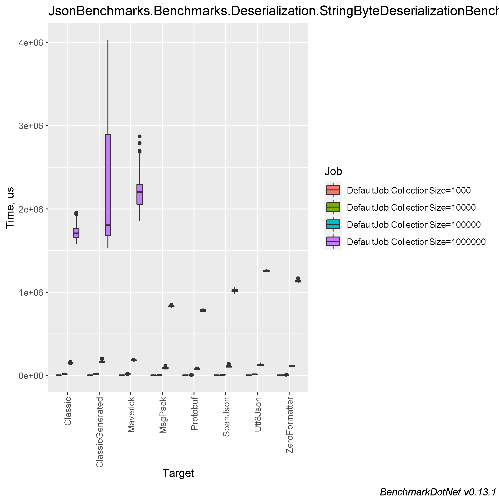

<a name="stream-des"></a>
### Stream

| Method           | CollectionSize |           Mean |        Error |       StdDev |      StdErr |            Min |             Q1 |         Median |             Q3 |            Max |       Op/s | Ratio | RatioSD |      Gen 0 |     Gen 1 |    Gen 2 |  Allocated |
|------------------|----------------|---------------:|-------------:|-------------:|------------:|---------------:|---------------:|---------------:|---------------:|---------------:|-----------:|------:|--------:|-----------:|----------:|---------:|-----------:|
| Protobuf         | 1000           |       518.3 μs |     10.34 μs |     11.90 μs |     2.66 μs |       502.9 μs |       509.6 μs |       515.7 μs |       524.1 μs |       549.8 μs | 1,929.3354 |  0.38 |    0.01 |    36.1328 |   13.6719 |        - |     183 KB |
| MsgPack          | 1000           |       531.9 μs |      7.20 μs |      6.73 μs |     1.74 μs |       524.1 μs |       527.1 μs |       529.0 μs |       536.8 μs |       546.6 μs | 1,879.9123 |  0.39 |    0.01 |    36.1328 |   16.6016 |        - |     183 KB |
| SpanJson         | 1000           |       843.1 μs |     16.43 μs |     17.58 μs |     4.14 μs |       789.0 μs |       843.3 μs |       848.0 μs |       850.8 μs |       864.8 μs | 1,186.1416 |  0.62 |    0.02 |    48.8281 |   43.9453 |  42.9688 |     321 KB |
| Utf8Json         | 1000           |       911.5 μs |      7.63 μs |      6.37 μs |     1.77 μs |       901.1 μs |       908.6 μs |       910.0 μs |       913.8 μs |       926.0 μs | 1,097.1233 |  0.67 |    0.01 |    35.1563 |   16.6016 |        - |     191 KB |
| SystemTextJson          | 1000           |     1,370.4 μs |     11.89 μs |     10.54 μs |     2.82 μs |     1,354.7 μs |     1,364.5 μs |     1,367.8 μs |     1,378.5 μs |     1,390.1 μs |   729.7314 |  1.00 |    0.00 |    33.2031 |   15.6250 |        - |     192 KB |
| SystemTextJsonSourceGen | 1000           |     1,372.3 μs |     12.44 μs |     10.39 μs |     2.88 μs |     1,350.4 μs |     1,368.7 μs |     1,370.4 μs |     1,376.7 μs |     1,391.9 μs |   728.6887 |  1.00 |    0.01 |    37.1094 |   15.6250 |        - |     192 KB |
| Maverick         | 1000           |     1,577.0 μs |     14.72 μs |     13.77 μs |     3.56 μs |     1,558.1 μs |     1,567.5 μs |     1,570.8 μs |     1,591.5 μs |     1,598.6 μs |   634.1129 |  1.15 |    0.01 |    68.3594 |   58.5938 |  35.1563 |     330 KB |
|                  |                |                |              |              |             |                |                |                |                |                |            |       |         |            |           |          |            |
| Protobuf         | 10000          |     5,689.0 μs |     82.92 μs |     69.24 μs |    19.20 μs |     5,610.3 μs |     5,638.4 μs |     5,664.9 μs |     5,742.2 μs |     5,825.2 μs |   175.7775 |  0.36 |    0.01 |   296.8750 |  148.4375 |        - |   1,827 KB |
| MsgPack          | 10000          |     5,956.5 μs |    108.35 μs |    128.99 μs |    28.15 μs |     5,847.0 μs |     5,873.2 μs |     5,896.9 μs |     5,953.6 μs |     6,246.5 μs |   167.8834 |  0.37 |    0.01 |   296.8750 |  148.4375 |        - |   1,827 KB |
| SpanJson         | 10000          |     8,478.9 μs |    166.87 μs |    192.17 μs |    42.97 μs |     8,089.6 μs |     8,362.2 μs |     8,490.7 μs |     8,620.2 μs |     8,855.3 μs |   117.9400 |  0.53 |    0.02 |   468.7500 |  359.3750 | 171.8750 |   3,209 KB |
| Utf8Json         | 10000          |    11,362.9 μs |    152.32 μs |    135.02 μs |    36.09 μs |    11,105.9 μs |    11,279.9 μs |    11,357.0 μs |    11,405.5 μs |    11,668.8 μs |    88.0058 |  0.71 |    0.02 |   328.1250 |  125.0000 |  31.2500 |   2,005 KB |
| SystemTextJsonSourceGen | 10000          |    15,743.3 μs |    165.65 μs |    154.95 μs |    40.01 μs |    15,444.6 μs |    15,644.5 μs |    15,736.9 μs |    15,851.1 μs |    15,988.9 μs |    63.5189 |  0.98 |    0.02 |   312.5000 |  125.0000 |  31.2500 |   2,006 KB |
| SystemTextJson          | 10000          |    16,009.3 μs |    315.38 μs |    263.36 μs |    73.04 μs |    15,645.3 μs |    15,796.0 μs |    16,002.8 μs |    16,268.8 μs |    16,329.4 μs |    62.4637 |  1.00 |    0.00 |   312.5000 |  125.0000 |  31.2500 |   2,006 KB |
| Maverick         | 10000          |    17,089.0 μs |    165.03 μs |    146.29 μs |    39.10 μs |    16,909.8 μs |    16,961.0 μs |    17,078.0 μs |    17,141.0 μs |    17,414.9 μs |    58.5172 |  1.07 |    0.02 |   468.7500 |  343.7500 | 218.7500 |   3,387 KB |
|                  |                |                |              |              |             |                |                |                |                |                |            |       |         |            |           |          |            |
| Protobuf         | 100000         |    76,165.6 μs |    792.11 μs |    740.94 μs |   191.31 μs |    75,157.2 μs |    75,610.7 μs |    76,143.6 μs |    76,688.6 μs |    77,718.5 μs |    13.1293 |  0.48 |    0.01 |  3000.0000 | 1142.8571 | 285.7143 |  18,267 KB |
| MsgPack          | 100000         |    76,721.5 μs |    602.00 μs |    563.11 μs |   145.40 μs |    75,684.4 μs |    76,246.7 μs |    76,729.9 μs |    77,191.5 μs |    77,502.1 μs |    13.0342 |  0.49 |    0.00 |  3000.0000 | 1142.8571 | 285.7143 |  18,267 KB |
| SpanJson         | 100000         |   102,050.3 μs |  1,573.70 μs |  1,395.04 μs |   372.84 μs |    99,685.1 μs |   101,085.2 μs |   101,955.1 μs |   102,791.0 μs |   105,453.4 μs |     9.7991 |  0.65 |    0.01 |  3000.0000 | 1200.0000 | 200.0000 |  32,081 KB |
| Utf8Json         | 100000         |   114,872.5 μs |  1,650.43 μs |  1,463.07 μs |   391.02 μs |   111,897.7 μs |   114,461.5 μs |   115,077.5 μs |   115,713.6 μs |   116,973.8 μs |     8.7053 |  0.73 |    0.01 |  3000.0000 | 1200.0000 | 200.0000 |  19,533 KB |
| SystemTextJson          | 100000         |   157,652.1 μs |  1,196.57 μs |    999.19 μs |   277.13 μs |   156,240.2 μs |   157,136.9 μs |   157,388.3 μs |   158,100.4 μs |   160,073.2 μs |     6.3431 |  1.00 |    0.00 |  2750.0000 | 1000.0000 |        - |  19,534 KB |
| SystemTextJsonSourceGen | 100000         |   166,904.9 μs |  1,991.34 μs |  1,662.86 μs |   461.19 μs |   163,935.7 μs |   165,783.1 μs |   167,229.7 μs |   167,756.2 μs |   170,005.8 μs |     5.9914 |  1.06 |    0.01 |  2750.0000 | 1000.0000 |        - |  19,534 KB |
| Maverick         | 100000         |   167,282.2 μs |  2,776.43 μs |  2,461.23 μs |   657.79 μs |   163,667.3 μs |   165,119.2 μs |   167,382.9 μs |   168,658.1 μs |   172,357.4 μs |     5.9779 |  1.06 |    0.02 |  2000.0000 | 1000.0000 |        - |  33,349 KB |
|                  |                |                |              |              |             |                |                |                |                |                |            |       |         |            |           |          |            |
| Protobuf         | 1000000        |   836,735.5 μs | 11,580.76 μs | 10,266.04 μs | 2,743.72 μs |   822,080.7 μs |   829,410.0 μs |   834,953.8 μs |   840,497.7 μs |   858,052.2 μs |     1.1951 |  0.49 |    0.01 | 28000.0000 | 9000.0000 |        - | 182,684 KB |
| MsgPack          | 1000000        |   843,253.5 μs | 13,656.66 μs | 12,774.45 μs | 3,298.35 μs |   826,304.6 μs |   833,229.6 μs |   839,337.8 μs |   851,130.4 μs |   864,520.5 μs |     1.1859 |  0.49 |    0.01 | 28000.0000 | 9000.0000 |        - | 182,683 KB |
| SpanJson         | 1000000        | 1,065,860.1 μs | 19,836.05 μs | 19,481.65 μs | 4,870.41 μs | 1,034,001.4 μs | 1,052,959.2 μs | 1,064,141.7 μs | 1,076,161.3 μs | 1,105,395.9 μs |     0.9382 |  0.62 |    0.01 | 28000.0000 | 9000.0000 |        - | 320,835 KB |
| Utf8Json         | 1000000        | 1,253,601.4 μs | 23,667.21 μs | 26,306.04 μs | 6,035.02 μs | 1,228,152.3 μs | 1,235,168.6 μs | 1,242,044.5 μs | 1,262,957.6 μs | 1,306,008.8 μs |     0.7977 |  0.74 |    0.02 | 28000.0000 | 9000.0000 |        - | 191,253 KB |
| SystemTextJson          | 1000000        | 1,706,578.7 μs | 17,077.42 μs | 15,974.23 μs | 4,124.53 μs | 1,683,967.7 μs | 1,694,018.4 μs | 1,703,700.6 μs | 1,717,219.3 μs | 1,742,858.1 μs |     0.5860 |  1.00 |    0.00 | 28000.0000 | 9000.0000 |        - | 191,253 KB |
| SystemTextJsonSourceGen | 1000000        | 1,709,330.1 μs | 23,153.65 μs | 20,525.11 μs | 5,485.57 μs | 1,681,479.2 μs | 1,694,057.3 μs | 1,705,135.8 μs | 1,719,589.6 μs | 1,755,179.3 μs |     0.5850 |  1.00 |    0.01 | 28000.0000 | 9000.0000 |        - | 191,253 KB |
| Maverick         | 1000000        | 1,948,179.4 μs | 22,214.56 μs | 19,692.63 μs | 5,263.08 μs | 1,913,135.4 μs | 1,942,927.2 μs | 1,951,824.4 μs | 1,960,933.7 μs | 1,979,193.7 μs |     0.5133 |  1.14 |    0.01 | 28000.0000 | 9000.0000 |        - | 329,401 KB |

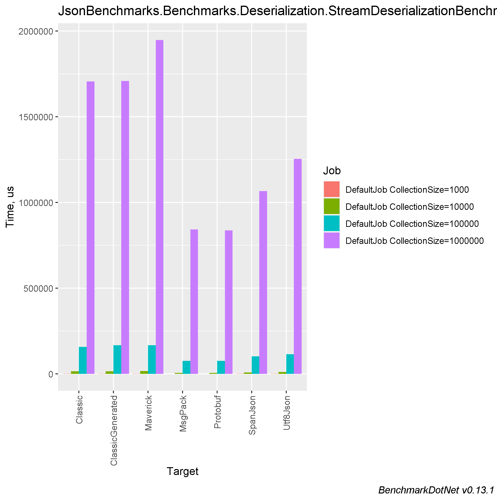
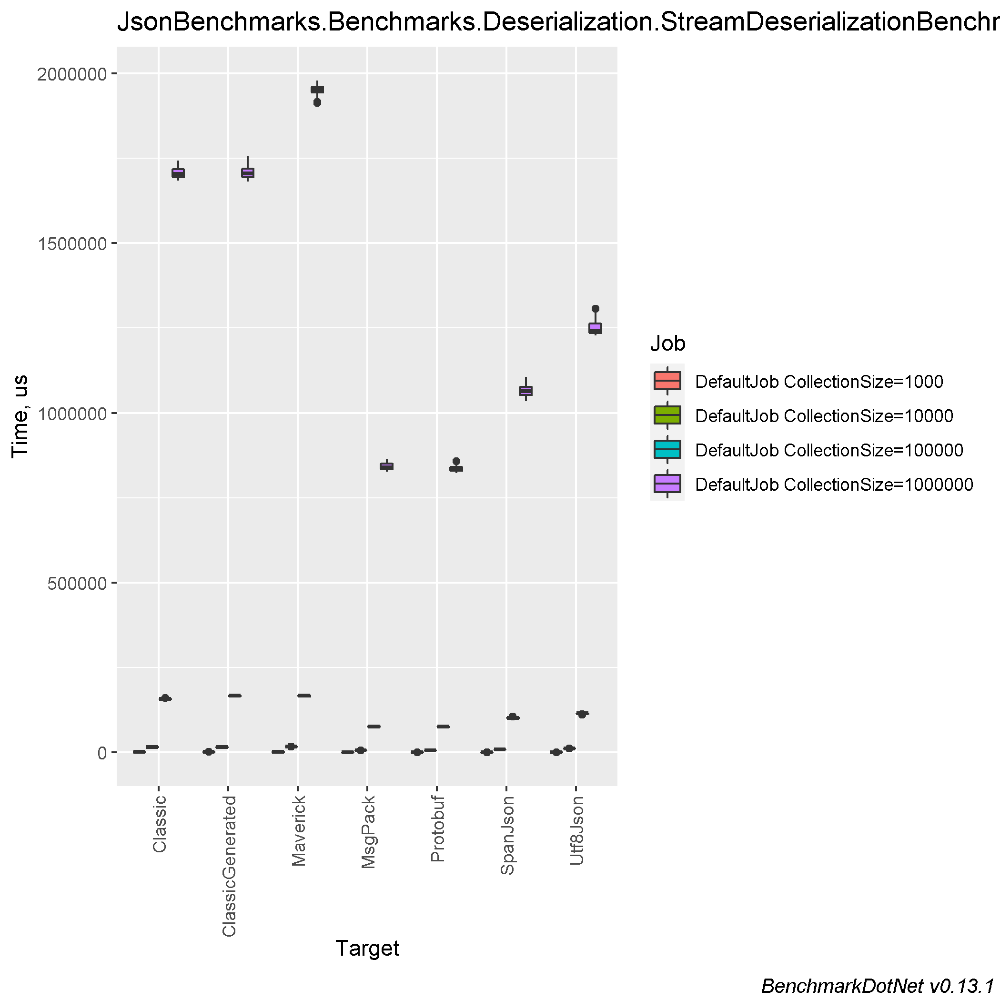

<a name="asynchronous-stream-des"></a>
### Asynchronous stream

| Method           | CollectionSize |           Mean |        Error |        StdDev |       StdErr |         Median |            Min |             Q1 |             Q3 |            Max |       Op/s | Ratio | RatioSD |      Gen 0 |     Gen 1 |    Gen 2 |  Allocated |
|------------------|----------------|---------------:|-------------:|--------------:|-------------:|---------------:|---------------:|---------------:|---------------:|---------------:|-----------:|------:|--------:|-----------:|----------:|---------:|-----------:|
| Protobuf         | 1000           |       580.1 μs |     15.52 μs |      45.04 μs |      4.57 μs |       571.3 μs |       520.9 μs |       545.8 μs |       611.3 μs |       690.4 μs | 1,723.8440 |  0.37 |    0.03 |    37.1094 |   17.5781 |        - |     183 KB |
| MsgPack          | 1000           |       616.1 μs |     13.23 μs |      39.01 μs |      3.90 μs |       613.5 μs |       542.2 μs |       586.0 μs |       642.5 μs |       716.6 μs | 1,623.0114 |  0.39 |    0.03 |    35.1563 |   15.6250 |        - |     183 KB |
| SpanJson         | 1000           |       804.1 μs |     34.05 μs |      96.04 μs |     10.01 μs |       781.4 μs |       688.0 μs |       730.8 μs |       852.6 μs |     1,075.8 μs | 1,243.6667 |  0.51 |    0.06 |    37.1094 |   13.6719 |        - |     183 KB |
| Utf8Json         | 1000           |     1,120.9 μs |     22.38 μs |      62.03 μs |      6.57 μs |     1,111.5 μs |     1,023.4 μs |     1,072.5 μs |     1,156.4 μs |     1,287.4 μs |   892.1183 |  0.71 |    0.06 |   125.0000 |  107.4219 |  87.8906 |     576 KB |
| SystemTextJsonSourceGen | 1000           |     1,451.1 μs |     28.65 μs |      53.82 μs |      8.11 μs |     1,443.3 μs |     1,369.7 μs |     1,402.6 μs |     1,489.6 μs |     1,570.5 μs |   689.1191 |  0.91 |    0.07 |    35.1563 |   15.6250 |        - |     192 KB |
| SystemTextJson          | 1000           |     1,589.4 μs |     36.94 μs |     107.76 μs |     10.89 μs |     1,570.2 μs |     1,417.0 μs |     1,509.6 μs |     1,653.9 μs |     1,869.2 μs |   629.1558 |  1.00 |    0.00 |    35.1563 |   13.6719 |        - |     192 KB |
|                  |                |                |              |               |              |                |                |                |                |                |            |       |         |            |           |          |            |
| Protobuf         | 10000          |     9,997.3 μs |    442.51 μs |   1,304.74 μs |    130.47 μs |     9,637.3 μs |     7,779.0 μs |     9,030.7 μs |    10,813.3 μs |    13,423.4 μs |   100.0274 |  0.56 |    0.09 |   296.8750 |  140.6250 |        - |   1,827 KB |
| MsgPack          | 10000          |    11,167.8 μs |    724.50 μs |   2,101.90 μs |    213.42 μs |    10,462.8 μs |     8,565.8 μs |     9,574.9 μs |    12,257.3 μs |    16,785.2 μs |    89.5429 |  0.62 |    0.13 |   281.2500 |  125.0000 |        - |   1,827 KB |
| SpanJson         | 10000          |    12,120.6 μs |    456.82 μs |   1,303.34 μs |    134.43 μs |    11,947.3 μs |     9,305.4 μs |    11,383.6 μs |    12,833.0 μs |    15,435.8 μs |    82.5041 |  0.67 |    0.09 |   296.8750 |  140.6250 |        - |   1,827 KB |
| Utf8Json         | 10000          |    16,669.3 μs |    538.42 μs |   1,570.61 μs |    158.66 μs |    16,242.0 μs |    13,677.7 μs |    15,430.2 μs |    17,832.4 μs |    21,275.9 μs |    59.9905 |  0.93 |    0.10 |   750.0000 |  687.5000 | 468.7500 |   5,976 KB |
| SystemTextJson          | 10000          |    18,055.7 μs |    403.44 μs |   1,189.54 μs |    118.95 μs |    17,945.2 μs |    16,007.1 μs |    17,140.2 μs |    18,855.3 μs |    21,350.5 μs |    55.3840 |  1.00 |    0.00 |   312.5000 |  125.0000 |  31.2500 |   2,006 KB |
| SystemTextJsonSourceGen | 10000          |    21,405.9 μs |  1,236.15 μs |   3,605.90 μs |    364.25 μs |    20,341.2 μs |    16,489.8 μs |    18,400.1 μs |    24,097.8 μs |    30,051.6 μs |    46.7162 |  1.19 |    0.22 |   312.5000 |  125.0000 |  31.2500 |   2,006 KB |
|                  |                |                |              |               |              |                |                |                |                |                |            |       |         |            |           |          |            |
| Protobuf         | 100000         |    88,459.6 μs |  3,162.64 μs |   9,124.94 μs |    931.31 μs |    85,629.1 μs |    77,764.4 μs |    81,090.4 μs |    94,369.9 μs |   114,248.6 μs |    11.3046 |  0.25 |    0.08 |  3166.6667 | 1333.3333 | 333.3333 |  18,269 KB |
| MsgPack          | 100000         |    90,585.3 μs |  3,385.79 μs |   9,876.52 μs |    997.68 μs |    87,739.0 μs |    78,540.3 μs |    81,726.1 μs |    97,738.0 μs |   117,334.8 μs |    11.0393 |  0.25 |    0.07 |  3000.0000 | 1142.8571 | 285.7143 |  18,266 KB |
| SpanJson         | 100000         |   158,081.8 μs |  7,866.75 μs |  22,947.67 μs |  2,318.06 μs |   154,280.8 μs |   121,729.2 μs |   140,775.6 μs |   170,743.4 μs |   218,894.6 μs |     6.3258 |  0.44 |    0.14 |  3000.0000 | 1250.0000 | 250.0000 |  18,267 KB |
| Utf8Json         | 100000         |   176,219.6 μs |  5,402.95 μs |  15,760.65 μs |  1,592.07 μs |   175,667.5 μs |   148,888.4 μs |   163,007.8 μs |   184,577.5 μs |   215,065.8 μs |     5.6747 |  0.50 |    0.15 |  2000.0000 | 1000.0000 |        - |  52,174 KB |
| SystemTextJsonSourceGen | 100000         |   256,701.2 μs |  9,472.40 μs |  26,871.63 μs |  2,786.46 μs |   251,299.5 μs |   216,856.5 μs |   234,171.8 μs |   270,914.5 μs |   335,627.2 μs |     3.8956 |  0.71 |    0.22 |  2666.6667 | 1000.0000 |        - |  19,534 KB |
| SystemTextJson          | 100000         |   381,874.2 μs | 33,385.01 μs |  98,436.46 μs |  9,843.65 μs |   415,688.5 μs |   204,360.9 μs |   283,004.0 μs |   468,106.6 μs |   566,915.6 μs |     2.6187 |  1.00 |    0.00 |  2000.0000 | 1000.0000 |        - |  19,534 KB |
|                  |                |                |              |               |              |                |                |                |                |                |            |       |         |            |           |          |            |
| MsgPack          | 1000000        |   849,148.8 μs | 15,720.08 μs |  19,305.67 μs |  4,115.98 μs |   842,033.7 μs |   826,044.9 μs |   834,900.0 μs |   857,741.0 μs |   886,267.8 μs |     1.1776 |  0.41 |    0.02 | 28000.0000 | 9000.0000 |        - | 182,681 KB |
| Protobuf         | 1000000        |   867,777.9 μs | 15,869.65 μs |  28,208.28 μs |  4,460.12 μs |   858,913.7 μs |   838,838.8 μs |   851,760.8 μs |   871,817.4 μs |   980,187.4 μs |     1.1524 |  0.43 |    0.03 | 28000.0000 | 9000.0000 |        - | 182,681 KB |
| SpanJson         | 1000000        | 1,180,236.0 μs | 22,932.89 μs |  59,605.64 μs |  6,706.16 μs | 1,167,678.3 μs | 1,096,788.8 μs | 1,134,211.6 μs | 1,207,335.8 μs | 1,362,864.2 μs |     0.8473 |  0.59 |    0.05 | 28000.0000 | 9000.0000 |        - | 182,681 KB |
| Utf8Json         | 1000000        | 1,698,734.5 μs | 50,020.82 μs | 141,900.75 μs | 14,714.42 μs | 1,680,920.3 μs | 1,421,286.6 μs | 1,595,464.1 μs | 1,781,257.8 μs | 2,088,259.0 μs |     0.5887 |  0.85 |    0.08 | 28000.0000 | 9000.0000 |        - | 715,406 KB |
| SystemTextJson          | 1000000        | 2,000,593.2 μs | 39,645.24 μs | 112,466.94 μs | 11,662.28 μs | 1,979,517.7 μs | 1,779,441.9 μs | 1,930,957.6 μs | 2,085,008.1 μs | 2,309,440.6 μs |     0.4999 |  1.00 |    0.00 | 28000.0000 | 9000.0000 |        - | 191,253 KB |
| SystemTextJsonSourceGen | 1000000        | 2,040,371.7 μs | 59,521.88 μs | 171,734.23 μs | 17,527.55 μs | 2,058,235.8 μs | 1,735,317.3 μs | 1,907,809.7 μs | 2,155,243.6 μs | 2,503,533.0 μs |     0.4901 |  1.02 |    0.10 | 28000.0000 | 9000.0000 |        - | 191,253 KB |

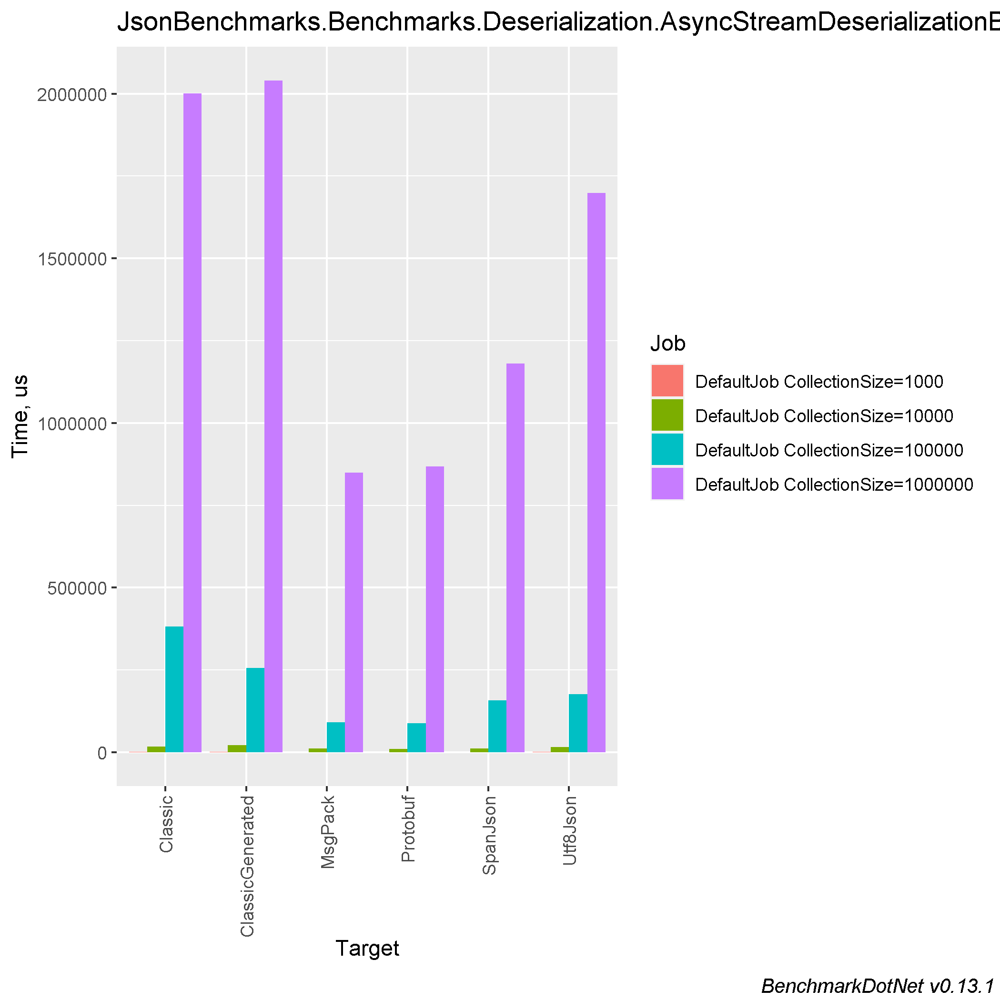
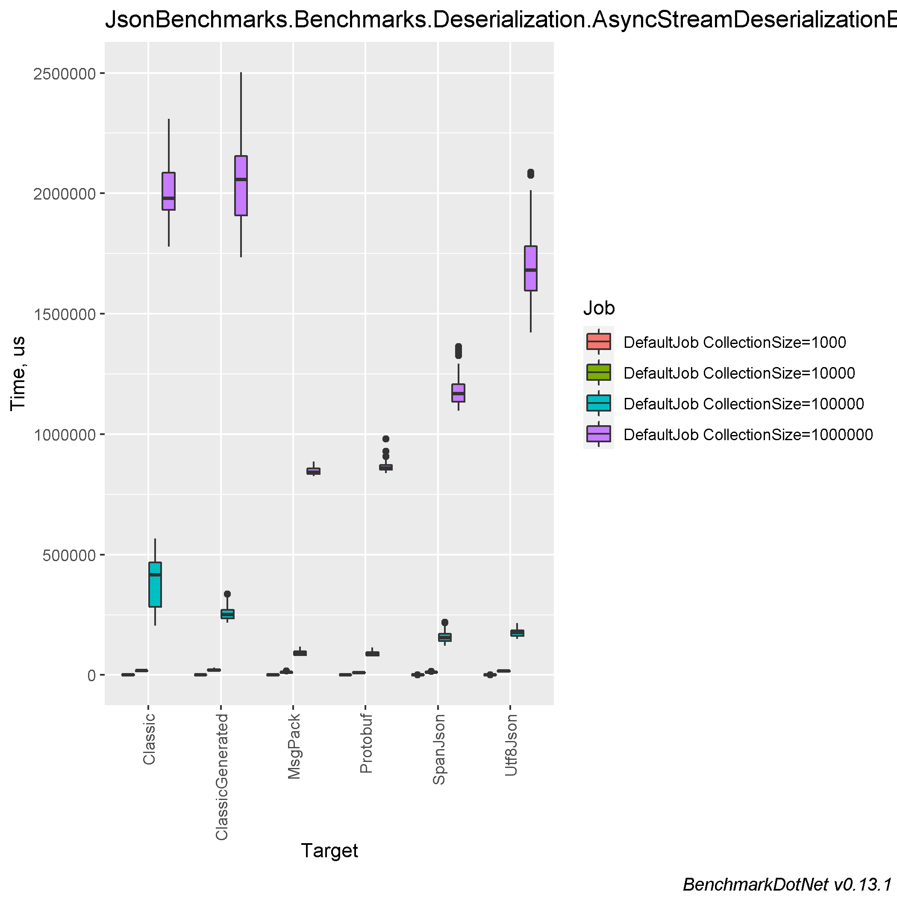

<a name="serialization"></a>
## Serialization

<a name="string-ser"></a>
### String

| Method           | CollectionSize |           Mean |        Error |       StdDev |      StdErr |         Median |            Min |             Q1 |             Q3 |            Max |       Op/s | Ratio | RatioSD |       Gen 0 |      Gen 1 |     Gen 2 |    Allocated |
|------------------|----------------|---------------:|-------------:|-------------:|------------:|---------------:|---------------:|---------------:|---------------:|---------------:|-----------:|------:|--------:|------------:|-----------:|----------:|-------------:|
| SpanJsonString   | 1000           |       419.6 μs |      8.15 μs |     10.88 μs |     2.18 μs |       418.4 μs |       404.8 μs |       411.8 μs |       423.6 μs |       442.6 μs | 2,383.1736 |  0.59 |    0.01 |     60.5469 |    60.5469 |   60.5469 |       277 KB |
| SystemTextJsonSourceGen | 1000           |       555.0 μs |      6.13 μs |      5.11 μs |     1.42 μs |       555.4 μs |       547.7 μs |       550.1 μs |       559.5 μs |       561.8 μs | 1,801.8348 |  0.77 |    0.01 |     83.0078 |    83.0078 |   83.0078 |       277 KB |
| SpanJsonFromByte | 1000           |       616.5 μs |      8.08 μs |      7.56 μs |     1.95 μs |       616.2 μs |       600.7 μs |       613.1 μs |       622.6 μs |       626.7 μs | 1,622.0969 |  0.85 |    0.01 |    124.0234 |   124.0234 |  124.0234 |       415 KB |
| Jil              | 1000           |       620.1 μs |      3.11 μs |      2.76 μs |     0.74 μs |       620.3 μs |       615.8 μs |       618.2 μs |       621.0 μs |       625.7 μs | 1,612.6308 |  0.86 |    0.01 |     83.0078 |    83.0078 |   83.0078 |       525 KB |
| SystemTextJson          | 1000           |       722.4 μs |      7.32 μs |      6.85 μs |     1.77 μs |       721.3 μs |       712.1 μs |       718.8 μs |       726.1 μs |       736.3 μs | 1,384.2448 |  1.00 |    0.00 |     83.0078 |    83.0078 |   83.0078 |       277 KB |
| MsgPackLz4Block  | 1000           |       844.5 μs |      6.04 μs |      5.04 μs |     1.40 μs |       844.7 μs |       836.5 μs |       840.8 μs |       848.5 μs |       852.9 μs | 1,184.1167 |  1.17 |    0.01 |    119.1406 |    75.1953 |   39.0625 |       593 KB |
| Utf8Json         | 1000           |       890.2 μs |      9.48 μs |      7.92 μs |     2.20 μs |       888.5 μs |       878.4 μs |       888.2 μs |       892.1 μs |       907.4 μs | 1,123.3844 |  1.23 |    0.02 |    249.0234 |   249.0234 |  249.0234 |       799 KB |
| Maverick         | 1000           |       994.6 μs |     13.80 μs |     12.90 μs |     3.33 μs |       993.1 μs |       975.9 μs |       983.6 μs |     1,003.4 μs |     1,019.4 μs | 1,005.3971 |  1.38 |    0.02 |     64.4531 |    64.4531 |   64.4531 |       280 KB |
| Newtonsoft       | 1000           |     1,271.4 μs |     21.35 μs |     19.97 μs |     5.16 μs |     1,263.1 μs |     1,247.6 μs |     1,257.8 μs |     1,286.5 μs |     1,316.4 μs |   786.5177 |  1.76 |    0.02 |     82.0313 |    82.0313 |   82.0313 |       607 KB |
| MsgPackSystemTextJson   | 1000           |     1,526.6 μs |     13.34 μs |     12.48 μs |     3.22 μs |     1,528.3 μs |     1,507.0 μs |     1,515.4 μs |     1,535.0 μs |     1,549.2 μs |   655.0580 |  2.11 |    0.02 |    220.7031 |   109.3750 |  109.3750 |     1,095 KB |
|                  |                |                |              |              |             |                |                |                |                |                |            |       |         |             |            |           |              |
| SpanJsonString   | 10000          |     4,478.2 μs |     63.04 μs |     55.88 μs |    14.93 μs |     4,474.4 μs |     4,381.4 μs |     4,440.7 μs |     4,519.1 μs |     4,584.5 μs |   223.3030 |  0.65 |    0.01 |    171.8750 |   171.8750 |  171.8750 |     2,764 KB |
| SystemTextJsonSourceGen | 10000          |     5,107.2 μs |     56.11 μs |     49.74 μs |    13.29 μs |     5,102.3 μs |     5,044.2 μs |     5,073.5 μs |     5,121.7 μs |     5,206.2 μs |   195.8024 |  0.74 |    0.01 |    234.3750 |   234.3750 |  234.3750 |     2,765 KB |
| SpanJsonFromByte | 10000          |     5,397.9 μs |    107.71 μs |    124.04 μs |    27.74 μs |     5,365.6 μs |     5,157.0 μs |     5,338.9 μs |     5,499.9 μs |     5,675.1 μs |   185.2558 |  0.78 |    0.02 |    281.2500 |   281.2500 |  281.2500 |     4,146 KB |
| Jil              | 10000          |     6,142.5 μs |    119.38 μs |    224.22 μs |    33.80 μs |     6,133.6 μs |     5,607.3 μs |     5,996.3 μs |     6,275.6 μs |     6,592.6 μs |   162.8007 |  0.88 |    0.04 |    820.3125 |   617.1875 |  375.0000 |     5,163 KB |
| Utf8Json         | 10000          |     6,505.8 μs |    124.68 μs |    153.11 μs |    32.64 μs |     6,493.0 μs |     6,290.3 μs |     6,373.1 μs |     6,591.6 μs |     6,867.8 μs |   153.7091 |  0.95 |    0.03 |    984.3750 |   984.3750 |  984.3750 |     8,114 KB |
| SystemTextJson          | 10000          |     6,869.6 μs |     73.77 μs |     69.00 μs |    17.82 μs |     6,854.7 μs |     6,785.9 μs |     6,812.2 μs |     6,913.9 μs |     7,039.9 μs |   145.5682 |  1.00 |    0.00 |    234.3750 |   234.3750 |  234.3750 |     2,765 KB |
| MsgPackLz4Block  | 10000          |     7,866.3 μs |     64.20 μs |     60.05 μs |    15.51 μs |     7,855.8 μs |     7,748.2 μs |     7,835.9 μs |     7,913.3 μs |     7,946.2 μs |   127.1250 |  1.15 |    0.02 |   1070.3125 |   664.0625 |  242.1875 |     5,898 KB |
| Maverick         | 10000          |    10,349.6 μs |     63.53 μs |     59.43 μs |    15.34 μs |    10,337.6 μs |    10,262.4 μs |    10,306.4 μs |    10,395.7 μs |    10,454.4 μs |    96.6225 |  1.51 |    0.02 |    515.6250 |   406.2500 |  312.5000 |     3,924 KB |
| Newtonsoft       | 10000          |    11,341.6 μs |    192.11 μs |    188.68 μs |    47.17 μs |    11,314.2 μs |    11,097.6 μs |    11,187.1 μs |    11,429.0 μs |    11,758.8 μs |    88.1706 |  1.65 |    0.03 |    937.5000 |   703.1250 |  375.0000 |     6,013 KB |
| MsgPackSystemTextJson   | 10000          |    17,742.1 μs |    354.26 μs |    508.07 μs |    96.02 μs |    17,822.6 μs |    16,800.4 μs |    17,337.4 μs |    18,127.8 μs |    18,898.8 μs |    56.3632 |  2.58 |    0.05 |   1750.0000 |  1218.7500 |  468.7500 |    10,797 KB |
|                  |                |                |              |              |             |                |                |                |                |                |            |       |         |             |            |           |              |
| SpanJsonString   | 100000         |    46,851.0 μs |    549.98 μs |    514.45 μs |   132.83 μs |    46,914.4 μs |    46,028.0 μs |    46,391.5 μs |    47,068.7 μs |    47,748.1 μs |    21.3443 |  0.60 |    0.01 |           - |          - |         - |    27,636 KB |
| SystemTextJsonSourceGen | 100000         |    61,054.2 μs |    666.72 μs |    623.65 μs |   161.03 μs |    61,168.0 μs |    59,464.1 μs |    60,820.5 μs |    61,349.9 μs |    61,872.2 μs |    16.3789 |  0.79 |    0.01 |    111.1111 |   111.1111 |  111.1111 |    27,629 KB |
| SpanJsonFromByte | 100000         |    61,288.9 μs |    734.15 μs |    650.80 μs |   173.93 μs |    61,127.4 μs |    60,410.1 μs |    60,814.2 μs |    61,752.4 μs |    62,313.8 μs |    16.3162 |  0.79 |    0.01 |    222.2222 |   222.2222 |  222.2222 |    41,454 KB |
| Jil              | 100000         |    66,642.6 μs |  1,321.21 μs |  1,356.78 μs |   329.07 μs |    66,780.4 μs |    64,195.7 μs |    66,121.0 μs |    67,190.0 μs |    69,377.1 μs |    15.0054 |  0.86 |    0.02 |   4875.0000 |  2125.0000 |  625.0000 |    51,492 KB |
| MsgPackLz4Block  | 100000         |    76,930.0 μs |  1,488.33 μs |  2,134.51 μs |   403.38 μs |    77,068.6 μs |    73,346.7 μs |    75,250.7 μs |    78,074.7 μs |    81,030.0 μs |    12.9988 |  0.99 |    0.03 |   5285.7143 |  1857.1429 |  571.4286 |    58,537 KB |
| SystemTextJson          | 100000         |    77,676.4 μs |    938.44 μs |    877.82 μs |   226.65 μs |    77,550.6 μs |    76,011.8 μs |    77,165.3 μs |    78,272.9 μs |    79,521.9 μs |    12.8739 |  1.00 |    0.00 |           - |          - |         - |    27,631 KB |
| Utf8Json         | 100000         |    78,779.3 μs |  1,558.03 μs |  2,379.27 μs |   427.33 μs |    79,370.0 μs |    75,173.3 μs |    76,629.0 μs |    81,101.9 μs |    82,322.4 μs |    12.6937 |  1.02 |    0.03 |    428.5714 |   428.5714 |  428.5714 |    74,095 KB |
| Maverick         | 100000         |   119,505.4 μs |  2,319.79 μs |  2,056.44 μs |   549.61 μs |   119,396.5 μs |   116,448.7 μs |   118,230.5 μs |   120,241.9 μs |   123,914.1 μs |     8.3678 |  1.54 |    0.03 |   2400.0000 |  1000.0000 |  200.0000 |    41,530 KB |
| Newtonsoft       | 100000         |   126,224.0 μs |  2,101.63 μs |  1,863.04 μs |   497.92 μs |   125,955.3 μs |   123,189.4 μs |   125,299.0 μs |   127,253.8 μs |   130,338.2 μs |     7.9224 |  1.62 |    0.03 |   5750.0000 |  2500.0000 |  500.0000 |    60,057 KB |
| MsgPackSystemTextJson   | 100000         |   160,351.4 μs |  3,203.82 μs |  3,561.04 μs |   816.96 μs |   160,459.3 μs |   153,962.0 μs |   157,628.5 μs |   163,557.5 μs |   165,657.6 μs |     6.2363 |  2.06 |    0.04 |  13000.0000 |  3000.0000 |         - |   107,898 KB |
|                  |                |                |              |              |             |                |                |                |                |                |            |       |         |             |            |           |              |
| SpanJsonString   | 1000000        |   472,972.3 μs |  4,765.45 μs |  4,457.61 μs | 1,150.95 μs |   471,523.2 μs |   467,301.5 μs |   469,384.2 μs |   477,107.8 μs |   479,755.2 μs |     2.1143 |  0.60 |    0.01 |           - |          - |         - |   276,369 KB |
| SystemTextJsonSourceGen | 1000000        |   627,853.3 μs |  4,636.51 μs |  3,871.70 μs | 1,073.82 μs |   626,674.9 μs |   622,587.8 μs |   624,678.9 μs |   631,296.2 μs |   634,174.0 μs |     1.5927 |  0.80 |    0.01 |           - |          - |         - |   276,297 KB |
| SpanJsonFromByte | 1000000        |   699,623.9 μs | 31,017.89 μs | 91,456.95 μs | 9,145.70 μs |   748,382.8 μs |   592,444.8 μs |   601,825.7 μs |   769,348.2 μs |   897,654.0 μs |     1.4293 |  1.01 |    0.09 |           - |          - |         - |   414,549 KB |
| Jil              | 1000000        |   768,746.8 μs | 20,559.20 μs | 59,645.97 μs | 6,056.13 μs |   772,626.6 μs |   699,627.5 μs |   714,108.0 μs |   805,021.5 μs |   926,943.9 μs |     1.3008 |  1.04 |    0.07 |  43000.0000 | 15000.0000 | 1000.0000 |   514,844 KB |
| SystemTextJson          | 1000000        |   788,440.1 μs |  6,865.25 μs |  5,732.79 μs | 1,589.99 μs |   786,966.9 μs |   779,850.5 μs |   784,500.1 μs |   790,768.6 μs |   801,813.4 μs |     1.2683 |  1.00 |    0.00 |           - |          - |         - |   276,298 KB |
| MsgPackLz4Block  | 1000000        |   930,472.1 μs | 14,418.43 μs | 13,487.01 μs | 3,482.33 μs |   933,629.2 μs |   900,376.5 μs |   926,827.2 μs |   936,909.9 μs |   947,386.1 μs |     1.0747 |  1.18 |    0.02 | 108000.0000 | 29000.0000 | 1000.0000 |   743,319 KB |
| Utf8Json         | 1000000        | 1,004,468.8 μs | 31,922.93 μs | 93,624.42 μs | 9,409.61 μs | 1,019,591.0 μs |   867,879.9 μs |   888,998.6 μs | 1,074,517.2 μs | 1,253,334.6 μs |     0.9956 |  1.23 |    0.10 |           - |          - |         - |   938,710 KB |
| Maverick         | 1000000        | 1,215,814.8 μs | 21,233.24 μs | 21,804.98 μs | 5,288.48 μs | 1,218,699.7 μs | 1,175,492.6 μs | 1,211,295.3 μs | 1,227,012.1 μs | 1,251,071.6 μs |     0.8225 |  1.54 |    0.03 |  23000.0000 |  8000.0000 |         - |   418,016 KB |
| Newtonsoft       | 1000000        | 1,437,942.7 μs | 28,470.96 μs | 27,962.29 μs | 6,990.57 μs | 1,431,643.1 μs | 1,408,119.1 μs | 1,416,431.6 μs | 1,449,849.1 μs | 1,509,383.6 μs |     0.6954 |  1.83 |    0.04 |  54000.0000 | 19000.0000 | 1000.0000 |   600,446 KB |
| MsgPackSystemTextJson   | 1000000        | 1,799,303.4 μs | 23,389.21 μs | 21,878.29 μs | 5,648.95 μs | 1,802,752.2 μs | 1,764,899.2 μs | 1,780,202.3 μs | 1,817,390.1 μs | 1,827,154.9 μs |     0.5558 |  2.28 |    0.03 | 138000.0000 | 37000.0000 | 1000.0000 | 1,159,745 KB |

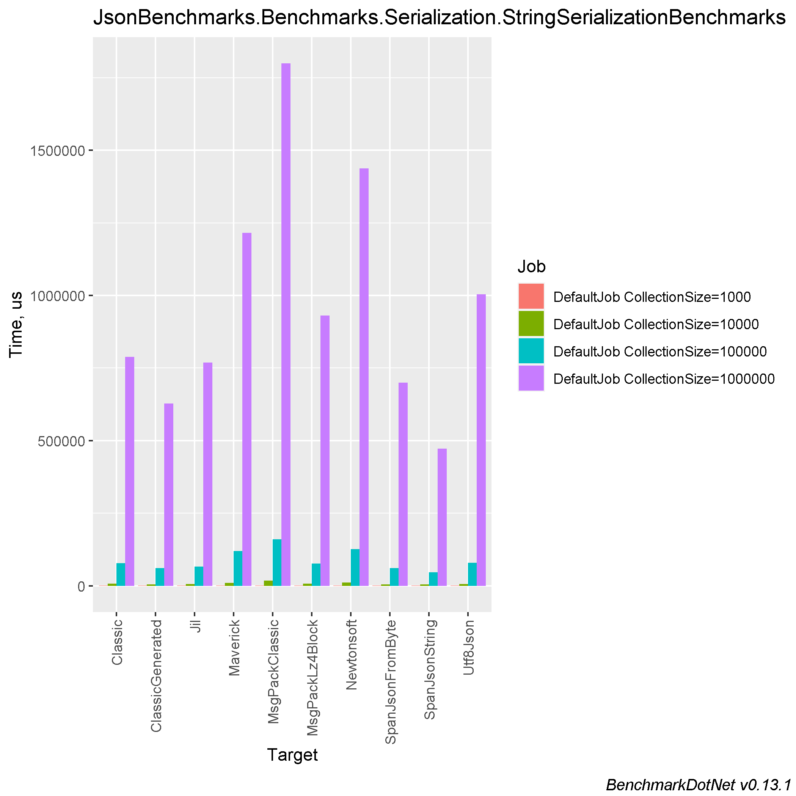
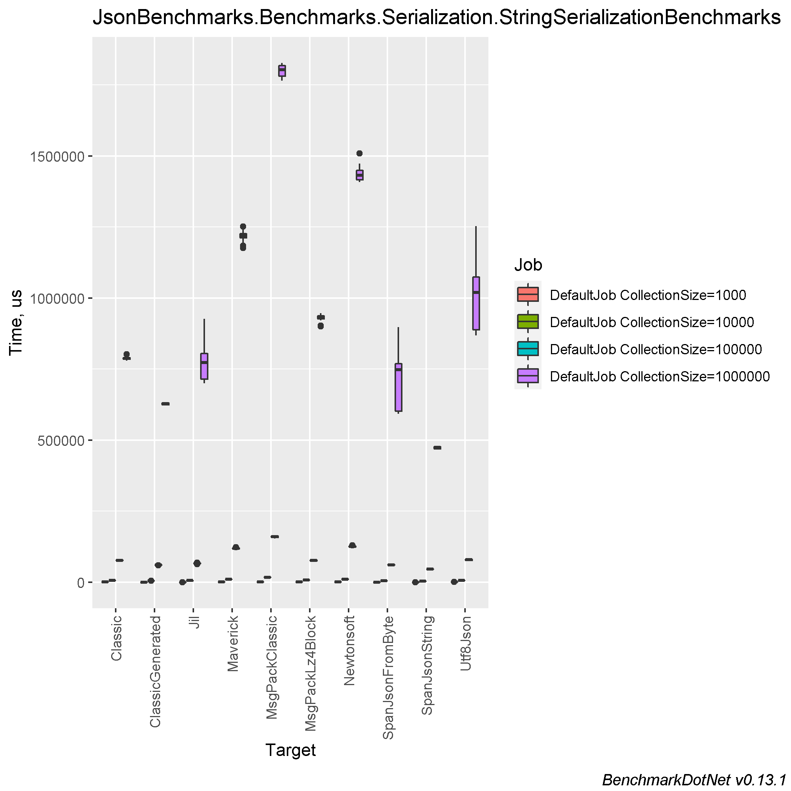

<a name="byte-ser"></a>
### Byte

| Method           | CollectionSize |         Mean |       Error |       StdDev |      StdErr |          Min |           Q1 |       Median |           Q3 |          Max |      Op/s | Ratio | RatioSD |      Gen 0 |      Gen 1 |    Gen 2 |  Allocated |
|------------------|----------------|-------------:|------------:|-------------:|------------:|-------------:|-------------:|-------------:|-------------:|-------------:|----------:|------:|--------:|-----------:|-----------:|---------:|-----------:|
| ZeroFormatter    | 1000           |     275.1 μs |     1.56 μs |      1.30 μs |     0.36 μs |     273.8 μs |     274.3 μs |     274.8 μs |     275.3 μs |     278.6 μs | 3,634.458 |  0.41 |    0.01 |    83.0078 |    82.5195 |  41.5039 |     334 KB |
| MsgPackSystemTextJson   | 1000           |     394.3 μs |     4.41 μs |      4.13 μs |     1.07 μs |     388.3 μs |     391.6 μs |     394.6 μs |     396.9 μs |     401.2 μs | 2,536.367 |  0.58 |    0.01 |    29.2969 |    29.2969 |  29.2969 |      90 KB |
| SpanJson         | 1000           |     463.6 μs |     3.31 μs |      3.10 μs |     0.80 μs |     459.0 μs |     460.9 μs |     463.0 μs |     466.6 μs |     468.0 μs | 2,157.245 |  0.68 |    0.01 |    43.4570 |    43.4570 |  43.4570 |     138 KB |
| SystemTextJsonSourceGen | 1000           |     501.1 μs |     5.27 μs |      4.67 μs |     1.25 μs |     490.3 μs |     499.9 μs |     501.6 μs |     504.3 μs |     507.1 μs | 1,995.423 |  0.74 |    0.02 |    42.9688 |    42.9688 |  42.9688 |     138 KB |
| MsgPackLz4Block  | 1000           |     505.3 μs |     2.74 μs |      2.56 μs |     0.66 μs |     501.7 μs |     503.5 μs |     504.6 μs |     506.6 μs |     510.4 μs | 1,978.969 |  0.75 |    0.01 |    10.7422 |     0.9766 |        - |      47 KB |
| SystemTextJson          | 1000           |     676.6 μs |    12.66 μs |     13.00 μs |     3.15 μs |     657.1 μs |     667.0 μs |     673.9 μs |     683.7 μs |     704.7 μs | 1,477.882 |  1.00 |    0.00 |    42.9688 |    42.9688 |  42.9688 |     139 KB |
| Utf8Json         | 1000           |     758.3 μs |     8.26 μs |      7.73 μs |     2.00 μs |     741.4 μs |     754.6 μs |     759.4 μs |     764.1 μs |     771.0 μs | 1,318.657 |  1.12 |    0.02 |   166.0156 |   166.0156 | 166.0156 |     522 KB |
|                  |                |              |             |              |             |              |              |              |              |              |           |       |         |            |            |          |            |
| ZeroFormatter    | 10000          |   2,247.0 μs |    44.08 μs |     93.94 μs |    12.67 μs |   2,047.6 μs |   2,193.7 μs |   2,226.5 μs |   2,307.3 μs |   2,440.0 μs |   445.040 |  0.36 |    0.01 |   355.4688 |   324.2188 | 324.2188 |   2,834 KB |
| MsgPackSystemTextJson   | 10000          |   3,663.4 μs |    71.59 μs |    104.93 μs |    19.49 μs |   3,553.7 μs |   3,588.6 μs |   3,620.6 μs |   3,681.0 μs |   3,937.6 μs |   272.969 |  0.59 |    0.02 |   117.1875 |   117.1875 | 117.1875 |     904 KB |
| SpanJson         | 10000          |   4,212.0 μs |    35.02 μs |     32.76 μs |     8.46 μs |   4,157.8 μs |   4,192.2 μs |   4,211.2 μs |   4,237.3 μs |   4,264.5 μs |   237.419 |  0.67 |    0.01 |   179.6875 |   179.6875 | 179.6875 |   1,382 KB |
| SystemTextJsonSourceGen | 10000          |   4,527.8 μs |    23.32 μs |     21.81 μs |     5.63 μs |   4,496.5 μs |   4,509.9 μs |   4,526.3 μs |   4,542.7 μs |   4,561.9 μs |   220.856 |  0.72 |    0.01 |   179.6875 |   179.6875 | 179.6875 |   1,383 KB |
| MsgPackLz4Block  | 10000          |   5,077.9 μs |    33.72 μs |     28.15 μs |     7.81 μs |   5,036.2 μs |   5,060.5 μs |   5,084.6 μs |   5,088.4 μs |   5,143.4 μs |   196.932 |  0.81 |    0.01 |    62.5000 |    62.5000 |  62.5000 |     465 KB |
| SystemTextJson          | 10000          |   6,274.9 μs |    37.66 μs |     35.22 μs |     9.09 μs |   6,207.4 μs |   6,253.6 μs |   6,279.6 μs |   6,303.6 μs |   6,325.5 μs |   159.366 |  1.00 |    0.00 |   179.6875 |   179.6875 | 179.6875 |   1,383 KB |
| Utf8Json         | 10000          |   6,400.4 μs |   124.80 μs |    166.60 μs |    33.32 μs |   6,071.9 μs |   6,327.5 μs |   6,370.4 μs |   6,501.6 μs |   6,705.5 μs |   156.240 |  1.01 |    0.03 |   632.8125 |   632.8125 | 632.8125 |   5,350 KB |
|                  |                |              |             |              |             |              |              |              |              |              |           |       |         |            |            |          |            |
| ZeroFormatter    | 100000         |  20,864.3 μs |   400.19 μs |    547.79 μs |   107.43 μs |  20,028.9 μs |  20,435.7 μs |  20,891.5 μs |  21,036.5 μs |  22,058.0 μs |    47.929 |  0.31 |    0.01 |   562.5000 |   531.2500 | 531.2500 |  24,246 KB |
| MsgPackSystemTextJson   | 100000         |  37,369.9 μs |   245.94 μs |    218.02 μs |    58.27 μs |  36,916.7 μs |  37,232.5 μs |  37,350.8 μs |  37,563.2 μs |  37,657.1 μs |    26.760 |  0.55 |    0.01 |   142.8571 |   142.8571 | 142.8571 |   9,034 KB |
| SpanJson         | 100000         |  44,957.9 μs |   562.39 μs |    526.06 μs |   135.83 μs |  44,370.5 μs |  44,482.5 μs |  44,789.7 μs |  45,431.6 μs |  46,018.8 μs |    22.243 |  0.66 |    0.01 |          - |          - |        - |  13,818 KB |
| SystemTextJsonSourceGen | 100000         |  49,468.9 μs |   721.06 μs |    639.20 μs |   170.83 μs |  48,428.8 μs |  48,980.4 μs |  49,466.4 μs |  49,824.5 μs |  50,723.8 μs |    20.215 |  0.73 |    0.01 |          - |          - |        - |  13,815 KB |
| MsgPackLz4Block  | 100000         |  51,170.9 μs |   304.75 μs |    270.15 μs |    72.20 μs |  50,732.7 μs |  50,985.4 μs |  51,175.5 μs |  51,327.4 μs |  51,743.4 μs |    19.542 |  0.75 |    0.01 |          - |          - |        - |   4,621 KB |
| SystemTextJson          | 100000         |  68,337.8 μs |   829.27 μs |    775.70 μs |   200.28 μs |  66,954.1 μs |  67,780.2 μs |  68,237.2 μs |  68,908.9 μs |  69,770.6 μs |    14.633 |  1.00 |    0.00 |          - |          - |        - |  13,815 KB |
| Utf8Json         | 100000         |  70,793.7 μs | 1,007.75 μs |    942.65 μs |   243.39 μs |  69,241.6 μs |  70,255.3 μs |  70,542.4 μs |  71,412.5 μs |  72,581.5 μs |    14.126 |  1.04 |    0.02 |   625.0000 |   625.0000 | 625.0000 |  46,459 KB |
|                  |                |              |             |              |             |              |              |              |              |              |           |       |         |            |            |          |            |
| ZeroFormatter    | 1000000        | 268,094.3 μs | 5,308.22 μs | 10,722.87 μs | 1,516.44 μs | 251,833.7 μs | 258,244.1 μs | 271,125.5 μs | 275,700.5 μs | 294,077.2 μs |     3.730 |  0.38 |    0.02 |          - |          - |        - | 340,774 KB |
| MsgPackSystemTextJson   | 1000000        | 425,802.6 μs | 5,877.59 μs |  5,210.33 μs | 1,392.52 μs | 417,758.5 μs | 421,880.7 μs | 425,222.2 μs | 429,175.5 μs | 438,170.5 μs |     2.349 |  0.59 |    0.01 | 13000.0000 |  6000.0000 |        - | 171,209 KB |
| SpanJson         | 1000000        | 455,171.0 μs | 3,884.83 μs |  3,443.80 μs |   920.39 μs | 450,061.4 μs | 452,239.7 μs | 454,533.8 μs | 458,717.1 μs | 459,377.3 μs |     2.197 |  0.63 |    0.01 |          - |          - |        - | 138,184 KB |
| SystemTextJsonSourceGen | 1000000        | 546,224.0 μs | 9,003.94 μs |  8,422.29 μs | 2,174.63 μs | 534,721.7 μs | 540,086.6 μs | 543,915.8 μs | 549,915.8 μs | 562,020.0 μs |     1.831 |  0.76 |    0.01 |          - |          - |        - | 138,150 KB |
| MsgPackLz4Block  | 1000000        | 597,785.4 μs | 8,869.21 μs |  7,406.20 μs | 2,054.11 μs | 583,506.3 μs | 592,121.3 μs | 601,280.0 μs | 603,188.9 μs | 607,626.5 μs |     1.673 |  0.83 |    0.01 | 25000.0000 | 12000.0000 |        - | 201,642 KB |
| SystemTextJson          | 1000000        | 718,088.9 μs | 5,711.24 μs |  5,062.87 μs | 1,353.11 μs | 710,926.9 μs | 713,817.1 μs | 718,088.3 μs | 720,610.9 μs | 730,021.9 μs |     1.393 |  1.00 |    0.00 |          - |          - |        - | 138,150 KB |
| Utf8Json         | 1000000        | 727,866.3 μs | 6,622.44 μs |  5,170.37 μs | 1,492.56 μs | 718,476.9 μs | 724,660.2 μs | 729,271.3 μs | 730,209.0 μs | 736,428.8 μs |     1.374 |  1.01 |    0.01 |          - |          - |        - | 662,344 KB |

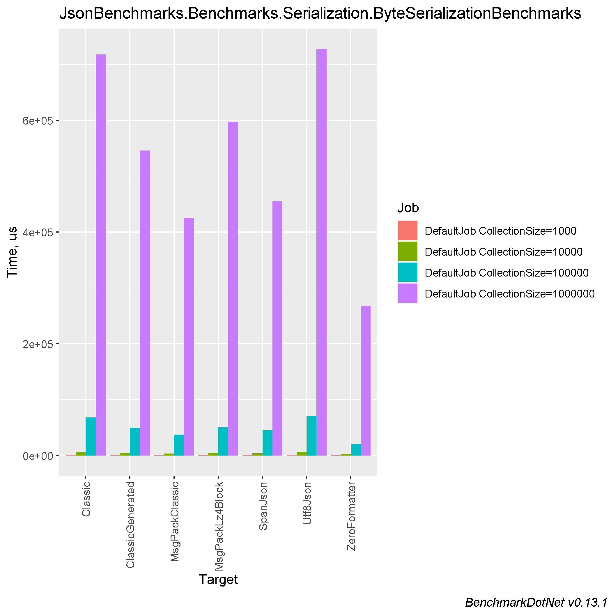
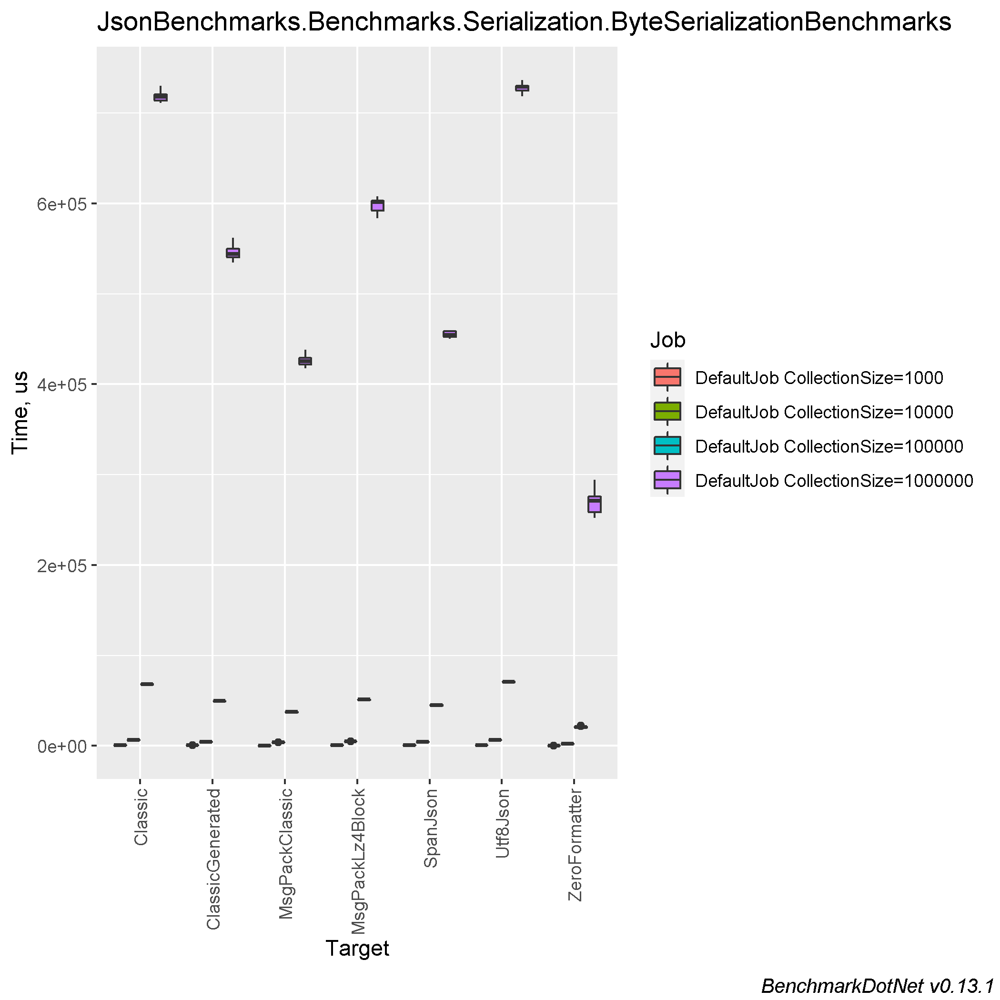

<a name="stream-ser"></a>
### Stream

| Method            | CollectionSize |           Mean |        Error |       StdDev |      StdErr |         Median |            Min |             Q1 |             Q3 |            Max |       Op/s | Ratio | RatioSD |      Gen 0 |      Gen 1 |     Gen 2 |  Allocated |
|-------------------|----------------|---------------:|-------------:|-------------:|------------:|---------------:|---------------:|---------------:|---------------:|---------------:|-----------:|------:|--------:|-----------:|-----------:|----------:|-----------:|
| Protobuf          | 1000           |       316.7 μs |      3.20 μs |      2.67 μs |     0.74 μs |       316.4 μs |       312.9 μs |       314.7 μs |       318.1 μs |       322.6 μs | 3,157.4533 |  0.33 |    0.00 |    30.7617 |     7.3242 |         - |     129 KB |
| ZeroFormatter     | 1000           |       342.4 μs |      2.25 μs |      1.99 μs |     0.53 μs |       342.5 μs |       339.8 μs |       340.6 μs |       343.8 μs |       345.5 μs | 2,920.1680 |  0.36 |    0.00 |    83.0078 |    41.5039 |   41.5039 |     413 KB |
| MsgPackNoCompress | 1000           |       481.6 μs |      3.20 μs |      2.99 μs |     0.77 μs |       481.2 μs |       475.3 μs |       479.8 μs |       484.0 μs |       486.0 μs | 2,076.4788 |  0.51 |    0.00 |    44.9219 |    44.9219 |   44.9219 |     256 KB |
| MsgPackLz4Block   | 1000           |       501.7 μs |      4.65 μs |      4.35 μs |     1.12 μs |       501.5 μs |       493.5 μs |       498.8 μs |       505.7 μs |       507.1 μs | 1,993.3213 |  0.53 |    0.01 |    11.7188 |     0.9766 |         - |      49 KB |
| Utf8Json          | 1000           |       746.9 μs |      7.91 μs |      7.40 μs |     1.91 μs |       748.0 μs |       734.4 μs |       742.7 μs |       752.9 μs |       758.7 μs | 1,338.8933 |  0.79 |    0.01 |   166.0156 |   166.0156 |  166.0156 |     522 KB |
| SystemTextJsonSourceGen  | 1000           |       777.1 μs |      6.77 μs |      6.33 μs |     1.63 μs |       777.0 μs |       763.8 μs |       774.1 μs |       781.0 μs |       788.6 μs | 1,286.7969 |  0.82 |    0.01 |   166.0156 |   166.0156 |  166.0156 |     647 KB |
| SystemTextJson           | 1000           |       950.2 μs |      5.73 μs |      4.79 μs |     1.33 μs |       950.1 μs |       940.7 μs |       947.7 μs |       952.7 μs |       960.6 μs | 1,052.4167 |  1.00 |    0.00 |   166.0156 |   166.0156 |  166.0156 |     650 KB |
| Maverick          | 1000           |     1,338.3 μs |     16.06 μs |     14.23 μs |     3.80 μs |     1,336.5 μs |     1,313.9 μs |     1,331.4 μs |     1,343.0 μs |     1,363.1 μs |   747.1908 |  1.41 |    0.02 |   115.2344 |   115.2344 |  115.2344 |     509 KB |
|                   |                |                |              |              |             |                |                |                |                |                |            |       |         |            |            |           |            |
| ZeroFormatter     | 10000          |     2,437.4 μs |     49.21 μs |    145.09 μs |    14.51 μs |     2,440.5 μs |     2,127.0 μs |     2,319.8 μs |     2,540.2 μs |     2,771.1 μs |   410.2695 |  0.34 |    0.02 |   398.4375 |   371.0938 |  367.1875 |   3,620 KB |
| Protobuf          | 10000          |     3,314.6 μs |     51.20 μs |     42.75 μs |    11.86 μs |     3,307.2 μs |     3,260.8 μs |     3,273.0 μs |     3,345.2 μs |     3,388.1 μs |   301.6934 |  0.46 |    0.01 |   191.4063 |   160.1563 |  160.1563 |   1,036 KB |
| MsgPackNoCompress | 10000          |     3,805.3 μs |     13.77 μs |     11.50 μs |     3.19 μs |     3,807.1 μs |     3,786.5 μs |     3,802.5 μs |     3,812.9 μs |     3,821.4 μs |   262.7902 |  0.53 |    0.01 |   265.6250 |   238.2813 |  238.2813 |   2,271 KB |
| MsgPackLz4Block   | 10000          |     5,174.9 μs |     42.84 μs |     40.07 μs |    10.35 μs |     5,154.5 μs |     5,119.9 μs |     5,151.0 μs |     5,195.7 μs |     5,257.7 μs |   193.2405 |  0.72 |    0.01 |   164.0625 |   140.6250 |  140.6250 |   1,095 KB |
| SystemTextJsonSourceGen  | 10000          |     5,577.8 μs |    105.55 μs |    112.94 μs |    26.62 μs |     5,576.8 μs |     5,399.1 μs |     5,496.4 μs |     5,636.9 μs |     5,846.2 μs |   179.2831 |  0.77 |    0.02 |   648.4375 |   632.8125 |  625.0000 |   5,663 KB |
| Utf8Json          | 10000          |     6,264.6 μs |    115.32 μs |     96.30 μs |    26.71 μs |     6,260.4 μs |     6,083.5 μs |     6,224.7 μs |     6,317.8 μs |     6,449.2 μs |   159.6259 |  0.87 |    0.02 |   640.6250 |   640.6250 |  640.6250 |   5,351 KB |
| SystemTextJson           | 10000          |     7,204.5 μs |    128.24 μs |    119.96 μs |    30.97 μs |     7,203.8 μs |     7,020.2 μs |     7,090.5 μs |     7,285.6 μs |     7,406.4 μs |   138.8025 |  1.00 |    0.00 |   695.3125 |   671.8750 |  671.8750 |   5,683 KB |
| Maverick          | 10000          |    10,641.2 μs |    165.89 μs |    155.17 μs |    40.07 μs |    10,560.8 μs |    10,493.5 μs |    10,521.5 μs |    10,755.6 μs |    10,920.0 μs |    93.9745 |  1.48 |    0.03 |   515.6250 |   484.3750 |  484.3750 |   4,093 KB |
|                   |                |                |              |              |             |                |                |                |                |                |            |       |         |            |            |           |            |
| ZeroFormatter     | 100000         |    25,427.4 μs |    617.56 μs |  1,820.90 μs |   182.09 μs |    24,743.0 μs |    23,378.4 μs |    23,866.4 μs |    27,168.9 μs |    30,338.7 μs |    39.3277 |  0.35 |    0.02 |   656.2500 |   625.0000 |  625.0000 |  32,109 KB |
| Protobuf          | 100000         |    35,317.0 μs |    674.60 μs |    631.02 μs |   162.93 μs |    35,367.4 μs |    34,245.2 μs |    34,950.2 μs |    35,673.1 μs |    36,640.2 μs |    28.3150 |  0.47 |    0.01 |   466.6667 |   466.6667 |  466.6667 |  16,592 KB |
| MsgPackNoCompress | 100000         |    39,451.3 μs |    782.38 μs |    960.84 μs |   204.85 μs |    39,374.6 μs |    38,234.1 μs |    38,569.8 μs |    40,154.4 μs |    41,278.5 μs |    25.3477 |  0.52 |    0.01 |   307.6923 |   307.6923 |  307.6923 |  18,383 KB |
| MsgPackLz4Block   | 100000         |    54,184.1 μs |    538.73 μs |    503.93 μs |   130.11 μs |    54,142.4 μs |    53,430.7 μs |    53,919.7 μs |    54,456.7 μs |    55,169.4 μs |    18.4556 |  0.72 |    0.01 |   200.0000 |   200.0000 |  200.0000 |  18,220 KB |
| SystemTextJsonSourceGen  | 100000         |    59,958.2 μs |    718.16 μs |    599.70 μs |   166.33 μs |    59,807.5 μs |    58,986.2 μs |    59,573.3 μs |    60,342.6 μs |    60,951.6 μs |    16.6783 |  0.79 |    0.01 |   555.5556 |   555.5556 |  555.5556 |  48,350 KB |
| Utf8Json          | 100000         |    71,158.5 μs |  1,412.14 μs |  1,569.59 μs |   360.09 μs |    70,862.6 μs |    69,230.7 μs |    70,032.5 μs |    72,119.5 μs |    74,091.6 μs |    14.0531 |  0.95 |    0.02 |   625.0000 |   625.0000 |  625.0000 |  46,460 KB |
| SystemTextJson           | 100000         |    75,668.2 μs |    614.52 μs |    544.75 μs |   145.59 μs |    75,581.8 μs |    74,667.6 μs |    75,340.2 μs |    75,887.2 μs |    76,840.1 μs |    13.2156 |  1.00 |    0.00 |   428.5714 |   428.5714 |  428.5714 |  48,510 KB |
| Maverick          | 100000         |   106,247.8 μs |  1,836.24 μs |  1,717.62 μs |   443.49 μs |   105,925.6 μs |   102,697.5 μs |   104,966.1 μs |   107,507.9 μs |   109,409.1 μs |     9.4120 |  1.40 |    0.02 |   600.0000 |   600.0000 |  600.0000 |  32,770 KB |
|                   |                |                |              |              |             |                |                |                |                |                |            |       |         |            |            |           |            |
| ZeroFormatter     | 1000000        |   293,463.5 μs |  3,380.99 μs |  2,997.16 μs |   801.02 μs |   292,649.5 μs |   288,894.1 μs |   291,317.5 μs |   295,202.8 μs |   300,392.1 μs |     3.4076 |  0.37 |    0.01 |  1000.0000 |  1000.0000 | 1000.0000 | 419,403 KB |
| Protobuf          | 1000000        |   358,070.0 μs |  2,266.46 μs |  1,892.60 μs |   524.91 μs |   358,013.9 μs |   354,223.7 μs |   356,790.4 μs |   359,746.4 μs |   360,174.5 μs |     2.7927 |  0.45 |    0.01 |          - |          - |         - | 132,741 KB |
| MsgPackNoCompress | 1000000        |   487,509.1 μs |  2,273.89 μs |  2,015.74 μs |   538.73 μs |   487,635.0 μs |   483,612.8 μs |   486,783.2 μs |   488,643.7 μs |   491,122.2 μs |     2.0512 |  0.61 |    0.01 | 13000.0000 |  6000.0000 |         - | 375,421 KB |
| SystemTextJsonSourceGen  | 1000000        |   627,319.4 μs |  5,396.94 μs |  4,784.25 μs | 1,278.64 μs |   626,881.0 μs |   619,619.2 μs |   624,671.5 μs |   628,789.0 μs |   637,185.6 μs |     1.5941 |  0.79 |    0.01 |          - |          - |         - | 414,805 KB |
| MsgPackLz4Block   | 1000000        |   651,717.1 μs | 12,499.96 μs | 22,540.00 μs | 3,520.16 μs |   647,468.5 μs |   611,530.2 μs |   642,002.6 μs |   660,647.7 μs |   696,460.9 μs |     1.5344 |  0.82 |    0.04 | 25000.0000 | 12000.0000 |         - | 266,594 KB |
| Utf8Json          | 1000000        |   728,128.4 μs |  5,989.67 μs |  5,309.68 μs | 1,419.07 μs |   728,095.5 μs |   721,073.9 μs |   723,609.1 μs |   731,352.8 μs |   740,893.3 μs |     1.3734 |  0.91 |    0.01 |          - |          - |         - | 662,344 KB |
| SystemTextJson           | 1000000        |   798,754.6 μs |  8,059.98 μs |  6,730.45 μs | 1,866.69 μs |   799,094.9 μs |   790,766.3 μs |   793,284.2 μs |   800,986.4 μs |   816,076.5 μs |     1.2519 |  1.00 |    0.00 |          - |          - |         - | 416,062 KB |
| Maverick          | 1000000        | 1,106,871.1 μs |  5,520.62 μs |  4,609.97 μs | 1,278.58 μs | 1,105,549.9 μs | 1,100,873.7 μs | 1,104,735.8 μs | 1,111,032.1 μs | 1,115,189.9 μs |     0.9034 |  1.39 |    0.01 |          - |          - |         - | 524,290 KB |

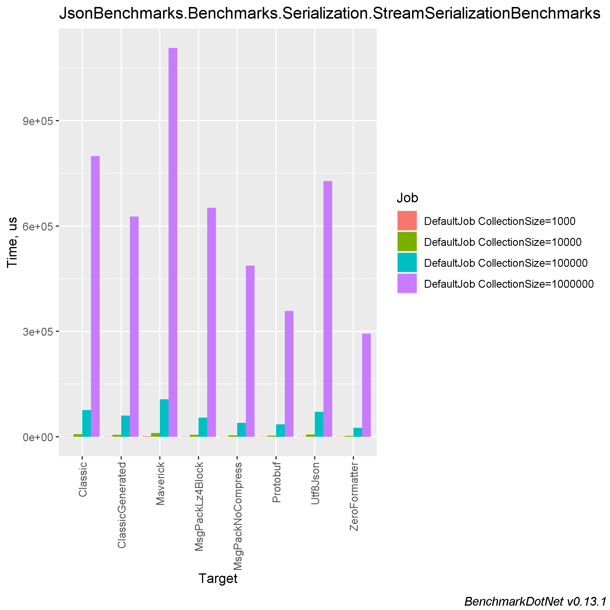
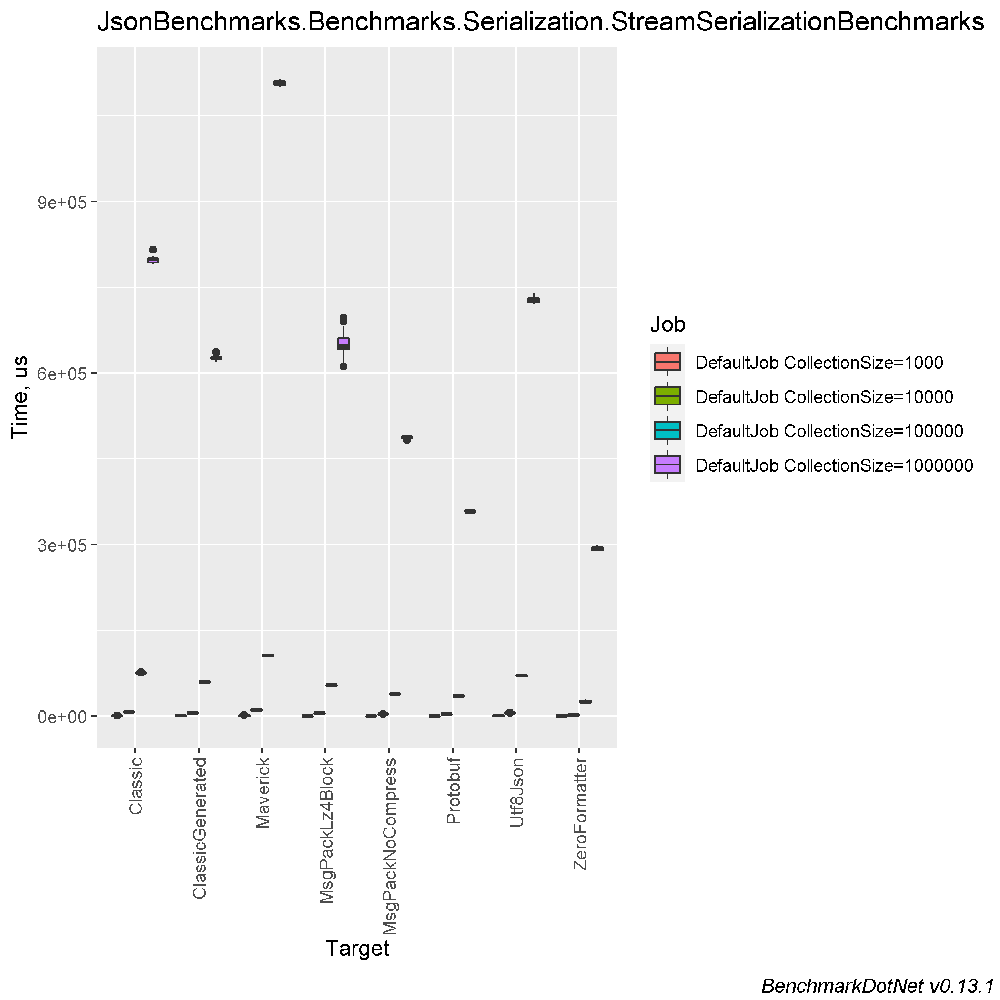

<a name="asynchronous-stream-ser"></a>
### Asynchronous Stream

| Method           | CollectionSize |         Mean |        Error |       StdDev |      StdErr |       Median |          Min |           Q1 |           Q3 |          Max |      Op/s | Ratio | RatioSD |      Gen 0 |      Gen 1 |    Gen 2 |  Allocated |
|------------------|----------------|-------------:|-------------:|-------------:|------------:|-------------:|-------------:|-------------:|-------------:|-------------:|----------:|------:|--------:|-----------:|-----------:|---------:|-----------:|
| SpanJson         | 1000           |     462.2 μs |      3.31 μs |      3.10 μs |     0.80 μs |     462.3 μs |     457.3 μs |     459.4 μs |     464.3 μs |     467.9 μs | 2,163.551 |  0.57 |    0.01 |    43.4570 |    43.4570 |  43.4570 |     138 KB |
| MsgPackSystemTextJson   | 1000           |     473.8 μs |      5.72 μs |      5.07 μs |     1.35 μs |     474.2 μs |     467.7 μs |     469.0 μs |     476.6 μs |     483.0 μs | 2,110.513 |  0.58 |    0.01 |    45.4102 |    45.4102 |  45.4102 |     256 KB |
| MsgPackLz4Block  | 1000           |     505.7 μs |      4.09 μs |      3.63 μs |     0.97 μs |     504.5 μs |     500.8 μs |     503.2 μs |     507.3 μs |     512.8 μs | 1,977.294 |  0.62 |    0.01 |    11.7188 |     1.9531 |        - |      49 KB |
| Utf8Json         | 1000           |     748.6 μs |      9.31 μs |      7.77 μs |     2.16 μs |     750.4 μs |     732.0 μs |     746.5 μs |     753.6 μs |     758.5 μs | 1,335.883 |  0.92 |    0.01 |   166.0156 |   166.0156 | 166.0156 |     523 KB |
| SystemTextJson          | 1000           |     812.7 μs |      5.57 μs |      5.21 μs |     1.35 μs |     812.3 μs |     805.8 μs |     808.7 μs |     815.0 μs |     823.1 μs | 1,230.493 |  1.00 |    0.00 |   110.3516 |   110.3516 | 110.3516 |     448 KB |
| SystemTextJsonSourceGen | 1000           |     821.1 μs |      6.23 μs |      5.20 μs |     1.44 μs |     822.5 μs |     807.5 μs |     820.3 μs |     824.6 μs |     826.7 μs | 1,217.842 |  1.01 |    0.01 |   110.3516 |   110.3516 | 110.3516 |     448 KB |
|                  |                |              |              |              |             |              |              |              |              |              |           |       |         |            |            |          |            |
| MsgPackSystemTextJson   | 10000          |   3,831.4 μs |     27.24 μs |     25.48 μs |     6.58 μs |   3,824.2 μs |   3,801.8 μs |   3,810.9 μs |   3,851.8 μs |   3,880.7 μs |   261.001 |  0.58 |    0.01 |   265.6250 |   242.1875 | 238.2813 |   2,272 KB |
| SpanJson         | 10000          |   4,223.7 μs |     27.07 μs |     25.32 μs |     6.54 μs |   4,224.6 μs |   4,167.3 μs |   4,211.1 μs |   4,236.9 μs |   4,274.5 μs |   236.762 |  0.64 |    0.01 |   179.6875 |   179.6875 | 179.6875 |   1,384 KB |
| MsgPackLz4Block  | 10000          |   5,194.2 μs |     32.28 μs |     28.62 μs |     7.65 μs |   5,194.5 μs |   5,136.2 μs |   5,175.0 μs |   5,215.4 μs |   5,233.1 μs |   192.523 |  0.79 |    0.01 |   164.0625 |   140.6250 | 140.6250 |   1,096 KB |
| Utf8Json         | 10000          |   6,158.5 μs |     70.03 μs |     62.08 μs |    16.59 μs |   6,134.3 μs |   6,093.3 μs |   6,106.7 μs |   6,207.1 μs |   6,279.8 μs |   162.377 |  0.93 |    0.01 |   625.0000 |   625.0000 | 625.0000 |   5,351 KB |
| SystemTextJson          | 10000          |   6,616.0 μs |     65.57 μs |     61.33 μs |    15.84 μs |   6,638.1 μs |   6,467.6 μs |   6,578.8 μs |   6,651.3 μs |   6,713.8 μs |   151.150 |  1.00 |    0.00 |   515.6250 |   492.1875 | 492.1875 |   3,675 KB |
| SystemTextJsonSourceGen | 10000          |   6,758.7 μs |     51.66 μs |     48.32 μs |    12.48 μs |   6,759.6 μs |   6,663.1 μs |   6,733.3 μs |   6,787.1 μs |   6,835.5 μs |   147.958 |  1.02 |    0.01 |   515.6250 |   492.1875 | 492.1875 |   3,682 KB |
|                  |                |              |              |              |             |              |              |              |              |              |           |       |         |            |            |          |            |
| MsgPackSystemTextJson   | 100000         |  38,580.6 μs |    242.05 μs |    214.57 μs |    57.35 μs |  38,608.9 μs |  38,070.2 μs |  38,527.6 μs |  38,702.7 μs |  38,946.0 μs |    25.920 |  0.56 |    0.01 |   285.7143 |   285.7143 | 285.7143 |  18,383 KB |
| SpanJson         | 100000         |  44,023.0 μs |    432.70 μs |    361.33 μs |   100.21 μs |  44,030.9 μs |  43,503.8 μs |  43,803.6 μs |  44,192.7 μs |  44,836.6 μs |    22.715 |  0.65 |    0.01 |          - |          - |        - |  13,818 KB |
| MsgPackLz4Block  | 100000         |  56,144.1 μs |    986.44 μs |    922.71 μs |   238.24 μs |  56,695.2 μs |  54,927.0 μs |  55,267.8 μs |  56,927.9 μs |  57,306.9 μs |    17.811 |  0.82 |    0.02 |   222.2222 |   222.2222 | 222.2222 |  18,199 KB |
| SystemTextJson          | 100000         |  68,364.7 μs |  1,153.93 μs |  1,022.93 μs |   273.39 μs |  68,056.2 μs |  66,980.5 μs |  67,755.7 μs |  68,794.0 μs |  70,205.2 μs |    14.627 |  1.00 |    0.00 |   750.0000 |   750.0000 | 750.0000 |  29,557 KB |
| SystemTextJsonSourceGen | 100000         |  69,353.3 μs |    584.81 μs |    547.03 μs |   141.24 μs |  69,225.0 μs |  68,661.5 μs |  68,971.0 μs |  69,623.7 μs |  70,439.6 μs |    14.419 |  1.01 |    0.02 |   750.0000 |   750.0000 | 750.0000 |  29,553 KB |
| Utf8Json         | 100000         |  70,734.0 μs |  1,158.31 μs |  1,083.49 μs |   279.75 μs |  70,561.2 μs |  68,709.5 μs |  70,219.7 μs |  71,514.7 μs |  72,755.0 μs |    14.137 |  1.03 |    0.03 |   625.0000 |   625.0000 | 625.0000 |  46,459 KB |
|                  |                |              |              |              |             |              |              |              |              |              |           |       |         |            |            |          |            |
| SpanJson         | 1000000        | 451,180.7 μs |  4,805.05 μs |  4,494.65 μs | 1,160.51 μs | 449,291.8 μs | 445,657.3 μs | 448,158.3 μs | 454,033.3 μs | 460,639.6 μs |     2.216 |  0.59 |    0.01 |          - |          - |        - | 138,187 KB |
| MsgPackSystemTextJson   | 1000000        | 495,878.1 μs |  8,769.36 μs | 13,391.74 μs | 2,405.23 μs | 488,726.1 μs | 479,637.0 μs | 485,979.5 μs | 509,925.2 μs | 526,199.8 μs |     2.017 |  0.66 |    0.01 | 13000.0000 |  6000.0000 |        - | 375,420 KB |
| MsgPackLz4Block  | 1000000        | 620,164.8 μs | 11,009.24 μs |  9,193.22 μs | 2,549.74 μs | 616,785.5 μs | 610,772.7 μs | 615,809.8 μs | 623,879.5 μs | 644,367.5 μs |     1.612 |  0.81 |    0.02 | 25000.0000 | 12000.0000 |        - | 266,609 KB |
| Utf8Json         | 1000000        | 730,011.5 μs |  3,213.70 μs |  2,509.05 μs |   724.30 μs | 730,599.9 μs | 724,589.5 μs | 728,313.8 μs | 731,410.6 μs | 733,746.5 μs |     1.370 |  0.95 |    0.01 |          - |          - |        - | 662,336 KB |
| SystemTextJson          | 1000000        | 766,753.5 μs |  7,677.20 μs |  6,410.81 μs | 1,778.04 μs | 766,583.4 μs | 758,178.8 μs | 761,699.4 μs | 768,813.1 μs | 781,784.9 μs |     1.304 |  1.00 |    0.00 |          - |          - |        - | 473,110 KB |
| SystemTextJsonSourceGen | 1000000        | 789,487.9 μs | 12,835.22 μs | 12,006.08 μs | 3,099.96 μs | 789,787.8 μs | 773,232.3 μs | 780,321.4 μs | 795,775.7 μs | 812,915.1 μs |     1.267 |  1.03 |    0.02 |          - |          - |        - | 473,139 KB |

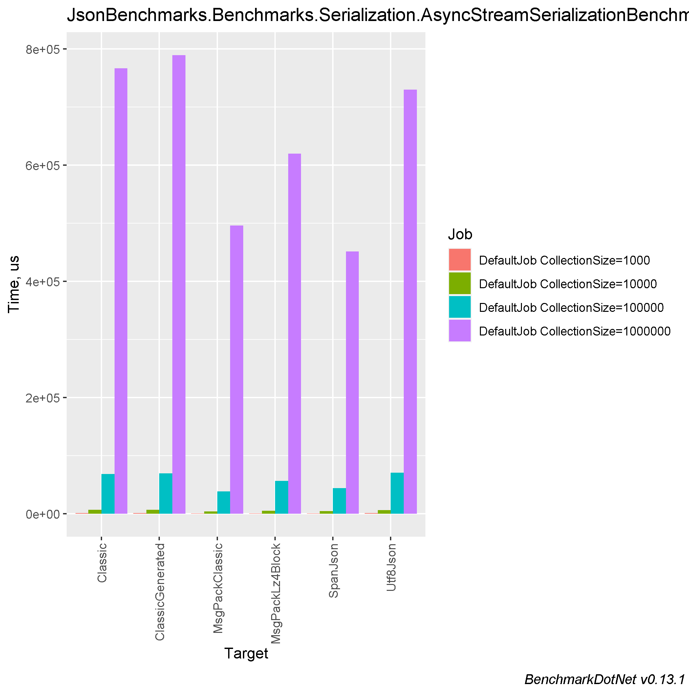
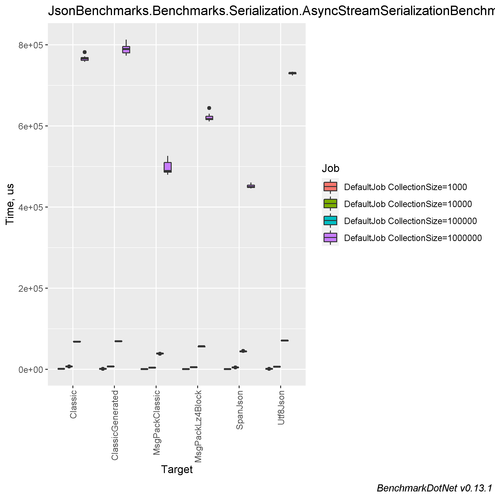

<a name="conclusions"></a>
## Conclusions

`Jil` behaved very unexpectedly bad. In some cases it refused to work with no reason.

Personally i will recommend using `SpanJson`. It has clean api and no additional overhead.
The two fastest are `MessagePack` and `Protobuf`, but they come with cost of compatibility with other serializers and have extraordinary API.

`SpanJson` is good at combining with `System.Text.Json` or `Newtonsoft.Json`, so consider using it in your project