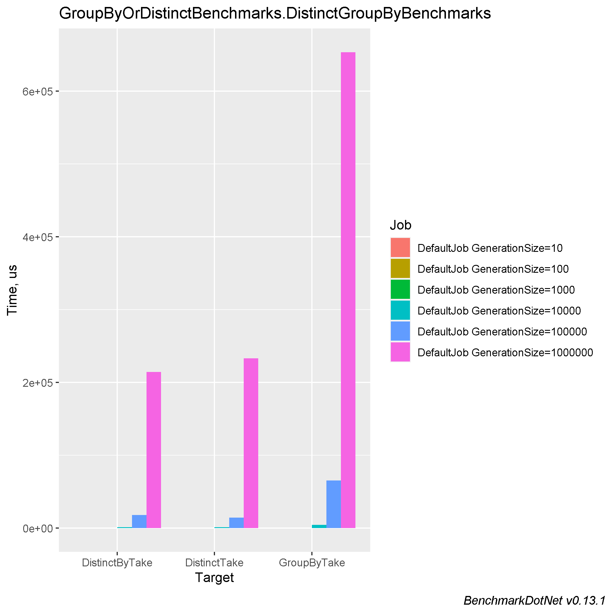
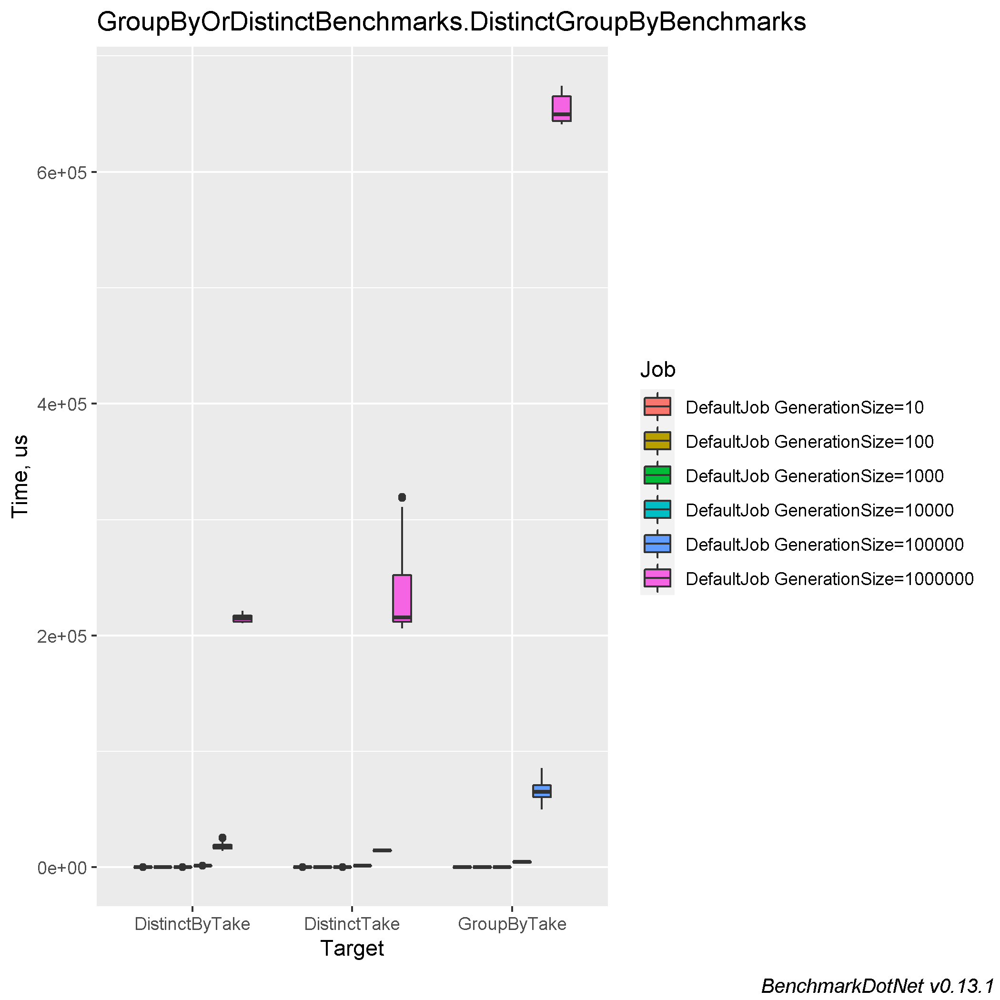

# Comparing different approaches in getting unique values (GroupBy, Distinct, DistinctBy)

### Table of contents
- [Machine information](#machine-information)
- [Benchmark results](#benchmark-results)
- [Conclusions](#conclusions)

<a name="machine-information"></a>
## Machine Information

``` ini
BenchmarkDotNet=v0.13.1, OS=Windows 10.0.22621
Intel Core i7-8550U CPU 1.80GHz (Kaby Lake R), 1 CPU, 8 logical and 4 physical cores
.NET SDK=6.0.202
  [Host]     : .NET 6.0.4 (6.0.422.16404), X64 RyuJIT
  DefaultJob : .NET 6.0.4 (6.0.422.16404), X64 RyuJIT
```

<a name="benchmark-results"></a>
## Benchmark results

| Method         | GenerationSize |           Mean |          Error |         StdDev |        StdErr |         Median |            Min |             Q1 |             Q3 |            Max |        Op/s | Ratio | RatioSD |      Gen 0 |     Gen 1 |    Gen 2 |     Allocated |
|----------------|----------------|---------------:|---------------:|---------------:|--------------:|---------------:|---------------:|---------------:|---------------:|---------------:|------------:|------:|--------:|-----------:|----------:|---------:|--------------:|
| DistinctByTake | 10             |       1.589 μs |      0.0482 μs |      0.1406 μs |     0.0142 μs |       1.540 μs |       1.360 μs |       1.495 μs |       1.679 μs |       1.972 μs | 629,232.213 |  0.67 |    0.08 |     0.2155 |         - |        - |         904 B |
| DistinctTake   | 10             |       1.762 μs |      0.0872 μs |      0.2459 μs |     0.0256 μs |       1.698 μs |       1.382 μs |       1.587 μs |       1.861 μs |       2.470 μs | 567,521.868 |  0.74 |    0.13 |     0.2155 |         - |        - |         904 B |
| GroupByTake    | 10             |       2.390 μs |      0.0733 μs |      0.2102 μs |     0.0216 μs |       2.346 μs |       2.036 μs |       2.238 μs |       2.508 μs |       2.891 μs | 418,325.195 |  1.00 |    0.00 |     0.4349 |         - |        - |       1,824 B |
|                |                |                |                |                |               |                |                |                |                |                |             |       |         |            |           |          |               |
| DistinctByTake | 100            |      13.370 μs |      0.3193 μs |      0.9110 μs |     0.0940 μs |      13.259 μs |      11.869 μs |      12.639 μs |      13.951 μs |      15.747 μs |  74,796.518 |  0.66 |    0.06 |     1.7853 |         - |        - |       7,520 B |
| DistinctTake   | 100            |      13.535 μs |      0.2770 μs |      0.8081 μs |     0.0816 μs |      13.539 μs |      12.032 μs |      12.939 μs |      14.076 μs |      15.601 μs |  73,885.030 |  0.67 |    0.05 |     1.7853 |         - |        - |       7,520 B |
| GroupByTake    | 100            |      20.290 μs |      0.4349 μs |      1.2686 μs |     0.1281 μs |      20.086 μs |      18.225 μs |      19.281 μs |      21.143 μs |      23.303 μs |  49,284.530 |  1.00 |    0.00 |     3.2043 |         - |        - |      13,448 B |
|                |                |                |                |                |               |                |                |                |                |                |             |       |         |            |           |          |               |
| DistinctByTake | 1000           |     130.483 μs |      4.6792 μs |     13.2742 μs |     1.3765 μs |     125.756 μs |     113.770 μs |     120.392 μs |     138.039 μs |     169.404 μs |   7,663.836 |  0.54 |    0.12 |    17.3340 |         - |        - |      73,296 B |
| DistinctTake   | 1000           |     134.103 μs |      5.9038 μs |     17.0340 μs |     1.7385 μs |     129.833 μs |     114.183 μs |     118.417 μs |     142.985 μs |     181.266 μs |   7,456.953 |  0.56 |    0.13 |    17.3340 |         - |        - |      73,296 B |
| GroupByTake    | 1000           |     250.670 μs |     20.7262 μs |     60.7864 μs |     6.1093 μs |     225.943 μs |     188.106 μs |     204.879 μs |     287.874 μs |     403.371 μs |   3,989.302 |  1.00 |    0.00 |    28.8086 |    7.0801 |        - |     121,440 B |
|                |                |                |                |                |               |                |                |                |                |                |             |       |         |            |           |          |               |
| DistinctByTake | 10000          |   1,449.953 μs |     28.4694 μs |     52.0579 μs |     8.0327 μs |   1,432.488 μs |   1,341.272 μs |   1,412.836 μs |   1,470.427 μs |   1,582.020 μs |     689.678 |  0.33 |    0.04 |   113.2813 |   68.3594 |  52.7344 |     673,450 B |
| DistinctTake   | 10000          |   1,474.383 μs |     26.3334 μs |     33.3033 μs |     6.9442 μs |   1,464.439 μs |   1,439.823 μs |   1,448.858 μs |   1,492.912 μs |   1,546.467 μs |     678.250 |  0.35 |    0.03 |   111.3281 |   68.3594 |  50.7813 |     673,408 B |
| GroupByTake    | 10000          |   4,577.630 μs |    165.6696 μs |    477.9945 μs |    48.7851 μs |   4,573.402 μs |   3,741.628 μs |   4,166.741 μs |   4,876.176 μs |   5,913.723 μs |     218.454 |  1.00 |    0.00 |   234.3750 |  148.4375 |  54.6875 |   1,405,347 B |
|                |                |                |                |                |               |                |                |                |                |                |             |       |         |            |           |          |               |
| DistinctTake   | 100000         |  14,405.112 μs |    105.9999 μs |     99.1524 μs |    25.6010 μs |  14,386.781 μs |  14,246.744 μs |  14,331.980 μs |  14,474.401 μs |  14,588.519 μs |      69.420 |  0.23 |    0.04 |   156.2500 |  109.3750 | 109.3750 |   6,038,015 B |
| DistinctByTake | 100000         |  17,887.329 μs |    918.8713 μs |  2,561.4460 μs |   270.0001 μs |  17,646.870 μs |  14,178.944 μs |  16,143.797 μs |  19,408.951 μs |  25,649.756 μs |      55.905 |  0.28 |    0.05 |   156.2500 |  125.0000 | 125.0000 |   6,038,032 B |
| GroupByTake    | 100000         |  65,502.562 μs |  3,072.6501 μs |  8,766.4436 μs |   904.1896 μs |  64,932.455 μs |  49,810.880 μs |  60,637.817 μs |  70,807.152 μs |  85,835.890 μs |      15.267 |  1.00 |    0.00 |  1500.0000 |  600.0000 | 100.0000 |  12,995,483 B |
|                |                |                |                |                |               |                |                |                |                |                |             |       |         |            |           |          |               |
| DistinctByTake | 1000000        | 214,677.776 μs |  3,533.6301 μs |  3,305.3598 μs |   853.4402 μs | 214,538.467 μs | 210,540.267 μs | 211,733.933 μs | 217,329.217 μs | 221,375.800 μs |       4.658 |  0.33 |    0.01 |          - |         - |        - |  53,889,635 B |
| DistinctTake   | 1000000        | 233,068.182 μs | 10,615.0498 μs | 29,414.2531 μs | 3,117.9046 μs | 215,723.100 μs | 206,158.833 μs | 211,647.533 μs | 252,028.200 μs | 319,590.967 μs |       4.291 |  0.39 |    0.07 |          - |         - |        - |  53,889,027 B |
| GroupByTake    | 1000000        | 653,531.275 μs | 12,079.1275 μs | 11,863.3184 μs | 2,965.8296 μs | 649,816.000 μs | 640,967.800 μs | 644,011.425 μs | 665,048.150 μs | 674,240.200 μs |       1.530 |  1.00 |    0.00 | 14000.0000 | 5000.0000 |        - | 121,557,200 B |

#### MultimodalDistribution
`DistinctGroupByBenchmarks.DistinctByTake`: Default -> It seems that the distribution is bimodal (mValue = 4.08)

`DistinctGroupByBenchmarks.DistinctTake`: Default   -> It seems that the distribution is bimodal (mValue = 3.88)

`DistinctGroupByBenchmarks.GroupByTake`: Default    -> It seems that the distribution is bimodal (mValue = 3.31)

`DistinctGroupByBenchmarks.DistinctByTake`: Default -> It seems that the distribution is multimodal (mValue = 4.8)




<a name="conclusions"></a>
## Conclusions

Do not instantly group. Make overall `.Distinct` or using `DistinctBy(Func)` to eliminate junk items. This will boost your performance and make Linq cleaner :)