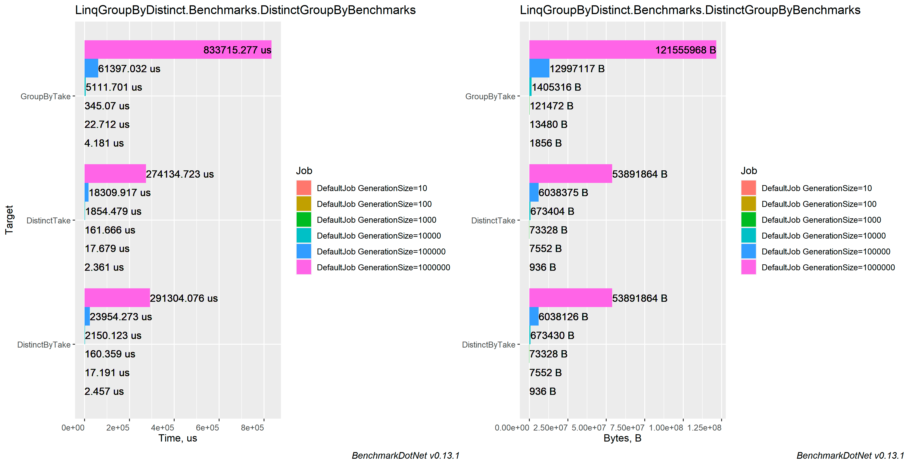

# Comparing different approaches in getting unique values (GroupBy, Distinct, DistinctBy)

### Table of contents
- [Machine information](#machine-information)
- [Benchmark results](#benchmark-results)
- [Conclusions](#conclusions)

<a name="machine-information"></a>
## Machine Information

``` ini
BenchmarkDotNet=v0.13.1, OS=Windows 10.0.22621
Intel Core i7-8550U CPU 1.80GHz (Kaby Lake R), 1 CPU, 8 logical and 4 physical cores
.NET SDK=6.0.202
  [Host]     : .NET 6.0.4 (6.0.422.16404), X64 RyuJIT
  DefaultJob : .NET 6.0.4 (6.0.422.16404), X64 RyuJIT
```

<a name="benchmark-results"></a>
## Benchmark results

| Method         | GenerationSize |           Mean |          Error |         StdDev |        StdErr |        Op/s |     Allocated |
|----------------|----------------|---------------:|---------------:|---------------:|--------------:|------------:|--------------:|
| DistinctByTake | 10             |       1.589 μs |      0.0482 μs |      0.1406 μs |     0.0142 μs | 629,232.213 |         904 B |
| DistinctTake   | 10             |       1.762 μs |      0.0872 μs |      0.2459 μs |     0.0256 μs | 567,521.868 |         904 B |
| GroupByTake    | 10             |       2.390 μs |      0.0733 μs |      0.2102 μs |     0.0216 μs | 418,325.195 |       1,824 B |
|                |                |                |                |                |               |             |               |
| DistinctByTake | 100            |      13.370 μs |      0.3193 μs |      0.9110 μs |     0.0940 μs |  74,796.518 |       7,520 B |
| DistinctTake   | 100            |      13.535 μs |      0.2770 μs |      0.8081 μs |     0.0816 μs |  73,885.030 |       7,520 B |
| GroupByTake    | 100            |      20.290 μs |      0.4349 μs |      1.2686 μs |     0.1281 μs |  49,284.530 |      13,448 B |
|                |                |                |                |                |               |             |               |
| DistinctByTake | 1000           |     130.483 μs |      4.6792 μs |     13.2742 μs |     1.3765 μs |   7,663.836 |      73,296 B |
| DistinctTake   | 1000           |     134.103 μs |      5.9038 μs |     17.0340 μs |     1.7385 μs |   7,456.953 |      73,296 B |
| GroupByTake    | 1000           |     250.670 μs |     20.7262 μs |     60.7864 μs |     6.1093 μs |   3,989.302 |     121,440 B |
|                |                |                |                |                |               |             |               |
| DistinctByTake | 10000          |   1,449.953 μs |     28.4694 μs |     52.0579 μs |     8.0327 μs |     689.678 |     673,450 B |
| DistinctTake   | 10000          |   1,474.383 μs |     26.3334 μs |     33.3033 μs |     6.9442 μs |     678.250 |     673,408 B |
| GroupByTake    | 10000          |   4,577.630 μs |    165.6696 μs |    477.9945 μs |    48.7851 μs |     218.454 |   1,405,347 B |
|                |                |                |                |                |               |             |               |
| DistinctTake   | 100000         |  14,405.112 μs |    105.9999 μs |     99.1524 μs |    25.6010 μs |      69.420 |   6,038,015 B |
| DistinctByTake | 100000         |  17,887.329 μs |    918.8713 μs |  2,561.4460 μs |   270.0001 μs |      55.905 |   6,038,032 B |
| GroupByTake    | 100000         |  65,502.562 μs |  3,072.6501 μs |  8,766.4436 μs |   904.1896 μs |      15.267 |  12,995,483 B |
|                |                |                |                |                |               |             |               |
| DistinctByTake | 1000000        | 214,677.776 μs |  3,533.6301 μs |  3,305.3598 μs |   853.4402 μs |       4.658 |  53,889,635 B |
| DistinctTake   | 1000000        | 233,068.182 μs | 10,615.0498 μs | 29,414.2531 μs | 3,117.9046 μs |       4.291 |  53,889,027 B |
| GroupByTake    | 1000000        | 653,531.275 μs | 12,079.1275 μs | 11,863.3184 μs | 2,965.8296 μs |       1.530 | 121,557,200 B |

#### MultimodalDistribution
`DistinctGroupByBenchmarks.DistinctByTake`: Default -> It seems that the distribution is bimodal (mValue = 4.08)

`DistinctGroupByBenchmarks.DistinctTake`: Default   -> It seems that the distribution is bimodal (mValue = 3.88)

`DistinctGroupByBenchmarks.GroupByTake`: Default    -> It seems that the distribution is bimodal (mValue = 3.31)

`DistinctGroupByBenchmarks.DistinctByTake`: Default -> It seems that the distribution is multimodal (mValue = 4.8)



<a name="conclusions"></a>
## Conclusions

Do not instantly group. Make overall `.Distinct` or using `DistinctBy(Func)` to eliminate junk items. This will boost your performance and make Linq cleaner.