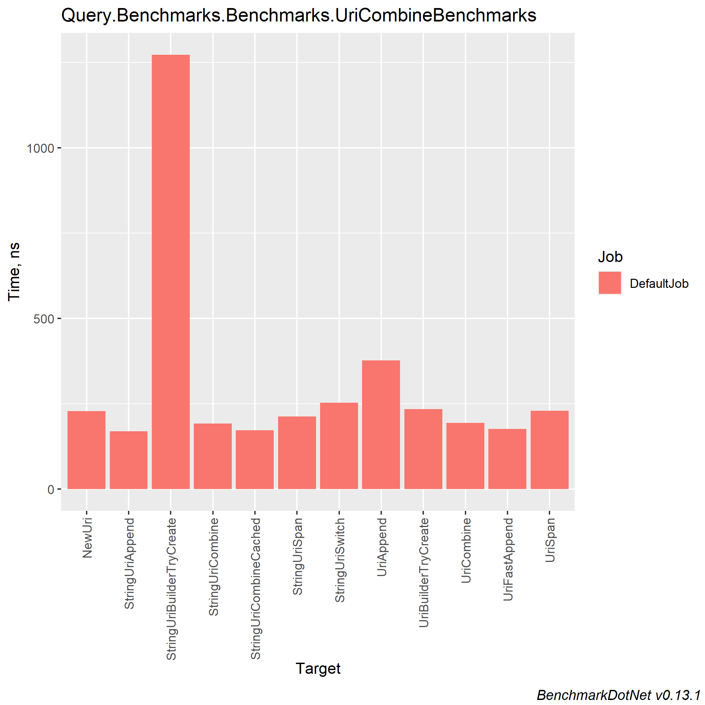
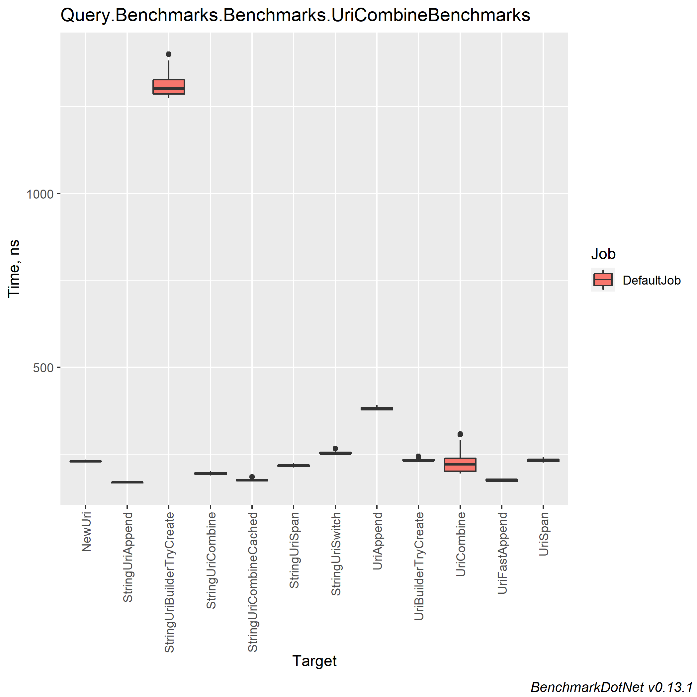
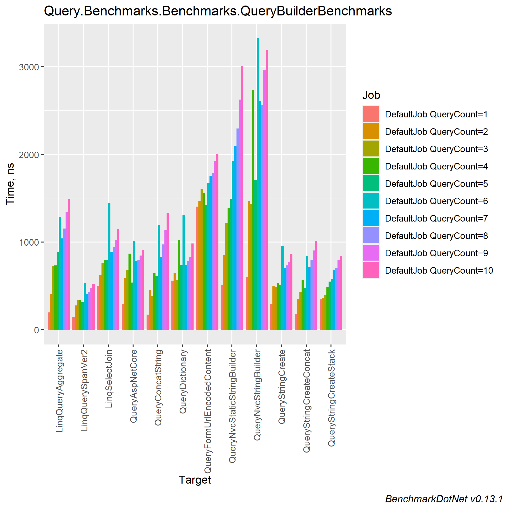
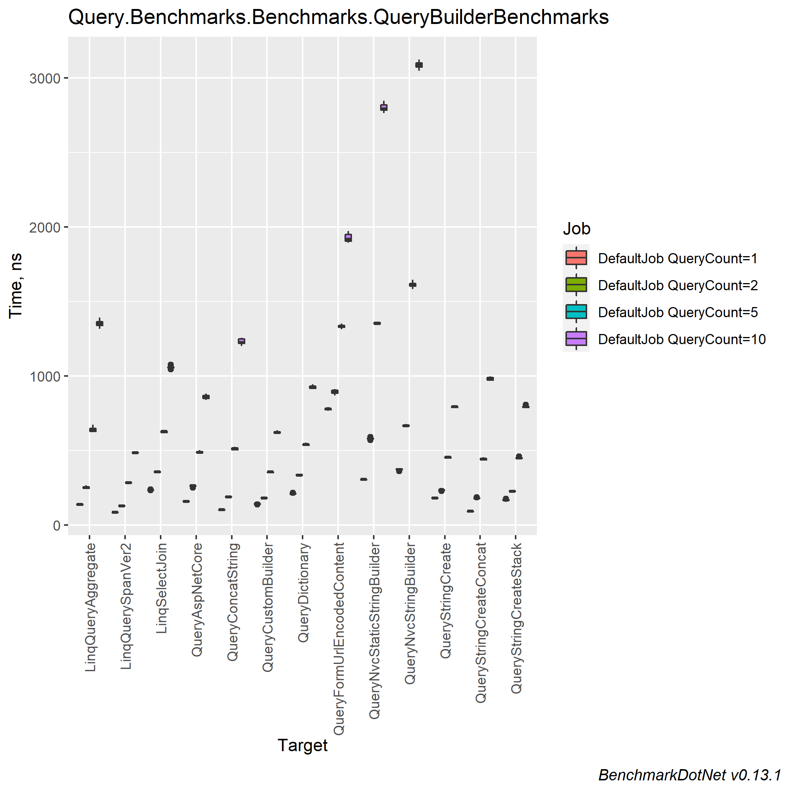

# Comparing different approaches for building Query strings and concatenating links

### Table of contents
- [Machine information](#machine-information)
- [Benchmark results](#benchmark-results)
  * [Uri combining](#uri-combining)
  * [Building query string](#building-query-string)
- [Conclusions](#conclusions)

<a name="machine-information"></a>
## Machine Information

``` ini
BenchmarkDotNet=v0.13.1, OS=Windows 10.0.22621
Intel Core i7-8550U CPU 1.80GHz (Kaby Lake R), 1 CPU, 8 logical and 4 physical cores
.NET SDK=6.0.202
  [Host]     : .NET 6.0.4 (6.0.422.16404), X64 RyuJIT
  DefaultJob : .NET 6.0.4 (6.0.422.16404), X64 RyuJIT
```

<a name="benchmark-results"></a>
## Benchmark Results

<a name="uri-combining"></a>
### Uri combining

| Method                    | Categories |       Mean |    Error |   StdDev |  StdErr |        Min |         Q1 |     Median |         Q3 |        Max |        Op/s | Ratio | RatioSD |  Gen 0 | Allocated |
|---------------------------|------------|-----------:|---------:|---------:|--------:|-----------:|-----------:|-----------:|-----------:|-----------:|------------:|------:|--------:|-------:|----------:|
| UriFastAppend             | Uri Url    |   175.2 ns |  3.12 ns |  2.91 ns | 0.75 ns |   170.9 ns |   172.8 ns |   174.4 ns |   178.2 ns |   179.7 ns | 5,706,962.2 |  0.76 |    0.01 | 0.0420 |     176 B |
| UriCombine                | Uri Url    |   226.3 ns |  9.96 ns | 28.25 ns | 2.93 ns |   195.3 ns |   201.7 ns |   221.4 ns |   239.1 ns |   308.3 ns | 4,419,815.8 |  1.04 |    0.10 | 0.0553 |     232 B |
| NewUri                    | Uri Url    |   230.4 ns |  2.15 ns |  1.91 ns | 0.51 ns |   227.4 ns |   229.4 ns |   230.4 ns |   231.5 ns |   234.5 ns | 4,339,821.5 |  1.00 |    0.00 | 0.0324 |     136 B |
| UriSpan                   | Uri Url    |   232.6 ns |  4.73 ns |  4.43 ns | 1.14 ns |   226.2 ns |   229.1 ns |   232.0 ns |   236.1 ns |   241.3 ns | 4,299,376.9 |  1.01 |    0.02 | 0.0610 |     256 B |
| UriBuilderTryCreate       | Uri Url    |   234.6 ns |  4.77 ns |  4.46 ns | 1.15 ns |   231.0 ns |   231.7 ns |   232.5 ns |   235.2 ns |   244.9 ns | 4,262,466.6 |  1.02 |    0.02 | 0.0458 |     192 B |
| UriAppend                 | Uri Url    |   382.2 ns |  5.28 ns |  4.94 ns | 1.27 ns |   376.7 ns |   378.4 ns |   380.2 ns |   385.2 ns |   391.8 ns | 2,616,273.2 |  1.66 |    0.02 | 0.0591 |     248 B |
|                           |            |            |          |          |         |            |            |            |            |            |             |       |         |        |           |
| StringUriAppend           | String Url |   169.3 ns |  2.12 ns |  1.88 ns | 0.50 ns |   166.2 ns |   168.1 ns |   169.6 ns |   170.1 ns |   172.8 ns | 5,905,978.8 |  0.78 |    0.01 | 0.0420 |     176 B |
| StringUriCombineCached    | String Url |   176.4 ns |  2.99 ns |  3.07 ns | 0.75 ns |   173.7 ns |   174.3 ns |   175.4 ns |   177.6 ns |   185.7 ns | 5,668,396.2 |  0.81 |    0.02 | 0.0420 |     176 B |
| StringUriCombine          | String Url |   194.3 ns |  3.75 ns |  3.68 ns | 0.92 ns |   188.8 ns |   192.1 ns |   193.7 ns |   197.8 ns |   201.2 ns | 5,145,361.7 |  0.90 |    0.02 | 0.0553 |     232 B |
| StringUriSpan             | String Url |   217.3 ns |  3.62 ns |  3.38 ns | 0.87 ns |   212.2 ns |   214.8 ns |   217.2 ns |   219.4 ns |   224.5 ns | 4,601,953.5 |  1.00 |    0.00 | 0.0610 |     256 B |
| StringUriSwitch           | String Url |   255.0 ns |  5.02 ns |  4.69 ns | 1.21 ns |   251.0 ns |   251.8 ns |   252.3 ns |   256.2 ns |   266.0 ns | 3,920,858.3 |  1.17 |    0.03 | 0.0553 |     232 B |
| StringUriBuilderTryCreate | String Url | 1,308.6 ns | 18.73 ns | 29.70 ns | 5.17 ns | 1,273.1 ns | 1,286.1 ns | 1,301.0 ns | 1,327.1 ns | 1,400.8 ns |   764,159.8 |  6.07 |    0.17 | 0.2193 |     920 B |

#### MultimodalDistribution
- `UriCombineBenchmarks.UriCombine: Default` -> It seems that the distribution can have several modes (mValue = 3.11)




<a name="building-query-string"></a>
### Building query string

| Method                      | QueryCount |       Mean |     Error |    StdDev |   StdErr |     Median |         Min |         Q1 |         Q3 |        Max |        Op/s | Ratio | RatioSD |  Gen 0 |  Gen 1 | Allocated |
|-----------------------------|------------|-----------:|----------:|----------:|---------:|-----------:|------------:|-----------:|-----------:|-----------:|------------:|------:|--------:|-------:|-------:|----------:|
| LinqQuerySpanVer2           | 1          |   148.9 ns |   9.50 ns |  28.01 ns |  2.80 ns |   148.8 ns |    94.77 ns |   130.2 ns |   165.5 ns |   208.7 ns | 6,717,934.4 |  0.35 |    0.19 | 0.0191 |      - |      80 B |
| QueryConcatString           | 1          |   174.4 ns |  13.31 ns |  38.39 ns |  3.92 ns |   177.3 ns |   106.92 ns |   145.3 ns |   197.2 ns |   284.3 ns | 5,735,037.9 |  0.41 |    0.21 | 0.0362 |      - |     152 B |
| QueryStringCreateConcat     | 1          |   180.3 ns |  13.95 ns |  41.12 ns |  4.11 ns |   188.6 ns |   106.36 ns |   143.4 ns |   213.6 ns |   269.7 ns | 5,546,803.9 |  0.41 |    0.22 | 0.0305 |      - |     128 B |
| LinqQueryAggregate          | 1          |   199.2 ns |  12.15 ns |  35.05 ns |  3.58 ns |   183.2 ns |   155.49 ns |   173.8 ns |   213.4 ns |   296.9 ns | 5,019,033.6 |  0.46 |    0.22 | 0.0439 |      - |     184 B |
| QueryStringCreate           | 1          |   295.2 ns |  22.56 ns |  66.53 ns |  6.65 ns |   280.8 ns |   204.56 ns |   234.0 ns |   348.6 ns |   511.4 ns | 3,387,680.7 |  0.69 |    0.39 | 0.0324 |      - |     136 B |
| QueryAspNetCore             | 1          |   296.3 ns |  25.35 ns |  73.55 ns |  7.47 ns |   299.0 ns |   176.25 ns |   237.7 ns |   330.9 ns |   483.8 ns | 3,375,381.5 |  0.66 |    0.34 | 0.0553 |      - |     232 B |
| QueryStringCreateStack      | 1          |   347.1 ns |  32.29 ns |  94.70 ns |  9.52 ns |   334.8 ns |   201.32 ns |   273.1 ns |   396.4 ns |   582.3 ns | 2,880,981.9 |  0.77 |    0.37 | 0.0324 |      - |     136 B |
| LinqSelectJoin              | 1          |   499.1 ns |  48.78 ns | 140.74 ns | 14.36 ns |   505.8 ns |   273.60 ns |   387.6 ns |   580.4 ns |   877.3 ns | 2,003,717.9 |  1.21 |    0.83 | 0.0572 |      - |     240 B |
| QueryNvcStaticStringBuilder | 1          |   514.8 ns |  30.90 ns |  89.66 ns |  9.10 ns |   517.9 ns |   335.00 ns |   441.6 ns |   570.0 ns |   758.3 ns | 1,942,325.8 |  1.22 |    0.68 | 0.0305 |      - |     128 B |
| QueryDictionary             | 1          |   561.6 ns |  95.40 ns | 281.29 ns | 28.13 ns |   422.7 ns |   240.38 ns |   305.0 ns |   848.6 ns | 1,231.8 ns | 1,780,484.1 |  1.00 |    0.00 | 0.0820 |      - |     344 B |
| QueryNvcStringBuilder       | 1          |   600.1 ns |  44.51 ns | 131.23 ns | 13.12 ns |   604.5 ns |   422.39 ns |   480.4 ns |   695.8 ns |   917.3 ns | 1,666,392.9 |  1.41 |    0.82 | 0.0553 |      - |     232 B |
| QueryFormUrlEncodedContent  | 1          | 1,405.4 ns | 124.88 ns | 368.22 ns | 36.82 ns | 1,451.9 ns |   895.22 ns | 1,030.3 ns | 1,683.6 ns | 2,612.0 ns |   711,545.2 |  3.38 |    2.04 | 0.2537 |      - |   1,064 B |
|                             |            |            |           |           |          |            |             |            |            |            |             |       |         |        |        |           |
| LinqQuerySpanVer2           | 2          |   278.2 ns |   7.65 ns |  22.30 ns |  2.25 ns |   277.7 ns |   238.26 ns |   260.6 ns |   291.9 ns |   336.4 ns | 3,594,983.5 |  0.47 |    0.15 | 0.0248 |      - |     104 B |
| QueryStringCreateConcat     | 2          |   353.9 ns |  28.56 ns |  82.86 ns |  8.41 ns |   326.5 ns |   216.92 ns |   292.3 ns |   420.8 ns |   557.7 ns | 2,825,347.1 |  0.58 |    0.18 | 0.0648 | 0.0005 |     272 B |
| QueryStringCreateStack      | 2          |   361.3 ns |   7.32 ns |  13.21 ns |  2.06 ns |   363.3 ns |   333.02 ns |   352.7 ns |   370.8 ns |   391.8 ns | 2,767,909.0 |  0.51 |    0.09 | 0.0381 |      - |     160 B |
| LinqQueryAggregate          | 2          |   411.6 ns |   8.27 ns |  18.99 ns |  2.39 ns |   409.3 ns |   371.39 ns |   399.7 ns |   423.3 ns |   466.4 ns | 2,429,711.3 |  0.66 |    0.20 | 0.0820 |      - |     344 B |
| QueryConcatString           | 2          |   452.5 ns |  19.29 ns |  55.02 ns |  5.68 ns |   460.3 ns |   242.57 ns |   437.7 ns |   478.5 ns |   547.9 ns | 2,209,745.9 |  0.76 |    0.26 | 0.0763 |      - |     320 B |
| QueryStringCreate           | 2          |   493.9 ns |  21.35 ns |  60.21 ns |  6.28 ns |   499.5 ns |   274.61 ns |   479.0 ns |   524.9 ns |   590.3 ns | 2,024,527.7 |  0.82 |    0.28 | 0.0381 |      - |     160 B |
| QueryAspNetCore             | 2          |   588.6 ns |  11.89 ns |  19.86 ns |  3.31 ns |   590.1 ns |   558.94 ns |   571.9 ns |   602.8 ns |   634.3 ns | 1,698,835.4 |  0.79 |    0.13 | 0.0916 |      - |     384 B |
| LinqSelectJoin              | 2          |   624.4 ns |  56.22 ns | 159.48 ns | 16.54 ns |   581.1 ns |   421.70 ns |   525.3 ns |   671.1 ns | 1,007.2 ns | 1,601,538.8 |  1.04 |    0.43 | 0.0916 |      - |     384 B |
| QueryDictionary             | 2          |   650.6 ns |  67.37 ns | 196.51 ns | 19.85 ns |   630.9 ns |   372.06 ns |   468.5 ns |   784.2 ns | 1,149.1 ns | 1,536,930.8 |  1.00 |    0.00 | 0.1202 |      - |     504 B |
| QueryNvcStaticStringBuilder | 2          |   855.2 ns |  17.17 ns |  40.81 ns |  4.99 ns |   848.1 ns |   775.15 ns |   824.6 ns |   874.0 ns |   971.3 ns | 1,169,366.7 |  1.36 |    0.43 | 0.0420 |      - |     176 B |
| QueryNvcStringBuilder       | 2          | 1,464.4 ns |  29.39 ns |  77.42 ns |  8.60 ns | 1,453.0 ns | 1,317.29 ns | 1,407.7 ns | 1,519.4 ns | 1,650.2 ns |   682,862.9 |  2.31 |    0.73 | 0.0916 |      - |     384 B |
| QueryFormUrlEncodedContent  | 2          | 1,468.4 ns |  28.38 ns |  57.33 ns |  8.11 ns | 1,459.2 ns | 1,330.87 ns | 1,432.8 ns | 1,503.9 ns | 1,597.5 ns |   681,002.7 |  2.21 |    0.59 | 0.2995 |      - |   1,256 B |
|                             |            |            |           |           |          |            |             |            |            |            |             |       |         |        |        |           |
| LinqQuerySpanVer2           | 3          |   338.4 ns |  16.88 ns |  47.88 ns |  4.96 ns |   327.1 ns |   251.32 ns |   307.1 ns |   364.9 ns |   466.7 ns | 2,955,336.5 |  0.60 |    0.09 | 0.0305 |      - |     128 B |
| QueryConcatString           | 3          |   383.6 ns |  11.69 ns |  32.98 ns |  3.44 ns |   381.7 ns |   326.66 ns |   359.0 ns |   399.2 ns |   480.6 ns | 2,606,945.2 |  0.68 |    0.06 | 0.1278 |      - |     536 B |
| QueryStringCreateStack      | 3          |   392.5 ns |  13.29 ns |  36.81 ns |  3.90 ns |   385.2 ns |   326.05 ns |   365.5 ns |   412.8 ns |   513.5 ns | 2,547,540.1 |  0.70 |    0.08 | 0.0439 |      - |     184 B |
| QueryStringCreateConcat     | 3          |   428.3 ns |  29.50 ns |  84.17 ns |  8.68 ns |   398.7 ns |   331.17 ns |   365.2 ns |   473.1 ns |   665.7 ns | 2,334,565.7 |  0.78 |    0.17 | 0.1049 |      - |     440 B |
| QueryStringCreate           | 3          |   490.4 ns |  21.77 ns |  60.69 ns |  6.40 ns |   473.7 ns |   365.95 ns |   453.8 ns |   518.6 ns |   658.4 ns | 2,038,954.3 |  0.87 |    0.11 | 0.0439 |      - |     184 B |
| QueryDictionary             | 3          |   570.2 ns |  11.51 ns |  28.86 ns |  3.36 ns |   563.8 ns |   526.91 ns |   551.0 ns |   579.6 ns |   663.3 ns | 1,753,625.7 |  1.00 |    0.00 | 0.1259 |      - |     528 B |
| QueryAspNetCore             | 3          |   680.8 ns |  57.17 ns | 164.02 ns | 16.83 ns |   632.0 ns |   461.04 ns |   567.6 ns |   751.8 ns | 1,090.0 ns | 1,468,842.9 |  1.22 |    0.32 | 0.1354 |      - |     568 B |
| LinqQueryAggregate          | 3          |   725.1 ns |  69.06 ns | 203.62 ns | 20.36 ns |   703.3 ns |   455.64 ns |   540.1 ns |   862.3 ns | 1,265.8 ns | 1,379,026.9 |  1.26 |    0.35 | 0.1259 |      - |     528 B |
| LinqSelectJoin              | 3          |   763.5 ns |  22.77 ns |  66.07 ns |  6.71 ns |   756.9 ns |   534.42 ns |   730.6 ns |   795.1 ns |   917.0 ns | 1,309,825.3 |  1.36 |    0.11 | 0.1144 |      - |     480 B |
| QueryNvcStaticStringBuilder | 3          | 1,215.2 ns |  79.93 ns | 213.34 ns | 23.42 ns | 1,169.9 ns |   949.79 ns | 1,085.8 ns | 1,314.0 ns | 1,928.6 ns |   822,909.4 |  2.10 |    0.37 | 0.0534 |      - |     224 B |
| QueryNvcStringBuilder       | 3          | 1,436.7 ns |  71.82 ns | 204.92 ns | 21.14 ns | 1,425.0 ns | 1,137.66 ns | 1,284.7 ns | 1,534.4 ns | 1,917.4 ns |   696,033.6 |  2.49 |    0.33 | 0.1354 |      - |     568 B |
| QueryFormUrlEncodedContent  | 3          | 1,602.5 ns |  83.91 ns | 239.39 ns | 24.69 ns | 1,603.1 ns | 1,242.99 ns | 1,398.7 ns | 1,770.0 ns | 2,149.1 ns |   624,021.2 |  2.89 |    0.44 | 0.3567 |      - |   1,496 B |
|                             |            |            |           |           |          |            |             |            |            |            |             |       |         |        |        |           |
| LinqQuerySpanVer2           | 4          |   344.4 ns |  28.30 ns |  81.21 ns |  8.33 ns |   308.8 ns |   260.21 ns |   280.4 ns |   384.2 ns |   558.7 ns | 2,903,622.3 |  0.38 |    0.17 | 0.0362 |      - |     152 B |
| QueryStringCreateStack      | 4          |   485.5 ns |   7.65 ns |   6.38 ns |  1.77 ns |   484.6 ns |   475.55 ns |   482.4 ns |   490.8 ns |   496.7 ns | 2,059,875.1 |  0.49 |    0.15 | 0.0496 |      - |     208 B |
| QueryStringCreate           | 4          |   534.9 ns |  22.16 ns |  61.78 ns |  6.51 ns |   516.5 ns |   464.36 ns |   481.4 ns |   570.0 ns |   719.6 ns | 1,869,343.1 |  0.58 |    0.21 | 0.0496 |      - |     208 B |
| QueryStringCreateConcat     | 4          |   565.6 ns |  37.92 ns | 103.18 ns | 11.13 ns |   530.5 ns |   426.12 ns |   491.8 ns |   608.0 ns |   937.7 ns | 1,768,124.7 |  0.59 |    0.21 | 0.1507 |      - |     632 B |
| QueryConcatString           | 4          |   649.6 ns |  42.62 ns | 118.81 ns | 12.52 ns |   629.8 ns |   466.58 ns |   563.9 ns |   710.2 ns | 1,018.4 ns | 1,539,391.8 |  0.69 |    0.24 | 0.1912 |      - |     800 B |
| LinqQueryAggregate          | 4          |   733.7 ns |  37.46 ns | 106.89 ns | 11.02 ns |   726.5 ns |   597.55 ns |   643.5 ns |   790.2 ns | 1,036.7 ns | 1,363,025.0 |  0.79 |    0.27 | 0.1755 |      - |     736 B |
| LinqSelectJoin              | 4          |   794.6 ns |  38.44 ns |  99.92 ns | 11.24 ns |   764.6 ns |   661.29 ns |   706.9 ns |   859.8 ns | 1,166.0 ns | 1,258,532.8 |  0.82 |    0.30 | 0.1373 |      - |     576 B |
| QueryAspNetCore             | 4          |   869.0 ns |  88.93 ns | 260.82 ns | 26.21 ns |   783.2 ns |   515.12 ns |   686.7 ns | 1,079.2 ns | 1,623.7 ns | 1,150,744.9 |  0.98 |    0.48 | 0.1469 |      - |     616 B |
| QueryDictionary             | 4          | 1,022.4 ns | 134.64 ns | 397.00 ns | 39.70 ns |   849.6 ns |   594.85 ns |   708.8 ns | 1,380.9 ns | 2,225.6 ns |   978,058.0 |  1.00 |    0.00 | 0.1793 |      - |     752 B |
| QueryNvcStaticStringBuilder | 4          | 1,388.8 ns |  27.80 ns |  68.18 ns |  8.09 ns | 1,372.4 ns | 1,291.86 ns | 1,334.2 ns | 1,428.2 ns | 1,568.5 ns |   720,057.0 |  1.37 |    0.45 | 0.0648 |      - |     272 B |
| QueryFormUrlEncodedContent  | 4          | 1,563.6 ns |  31.16 ns |  77.01 ns |  9.08 ns | 1,547.0 ns | 1,452.69 ns | 1,502.8 ns | 1,612.2 ns | 1,778.2 ns |   639,564.7 |  1.55 |    0.53 | 0.3777 |      - |   1,584 B |
| QueryNvcStringBuilder       | 4          | 2,733.1 ns | 194.18 ns | 563.34 ns | 57.20 ns | 2,732.0 ns | 1,724.91 ns | 2,262.3 ns | 3,107.9 ns | 4,176.6 ns |   365,885.4 |  2.98 |    1.08 | 0.1450 |      - |     616 B |
|                             |            |            |           |           |          |            |             |            |            |            |             |       |         |        |        |           |
| LinqQuerySpanVer2           | 5          |   312.5 ns |   6.30 ns |   8.20 ns |  1.67 ns |   311.6 ns |   301.71 ns |   306.2 ns |   316.2 ns |   332.1 ns | 3,200,122.2 |  0.43 |    0.03 | 0.0420 |      - |     176 B |
| QueryStringCreateConcat     | 5          |   479.1 ns |   9.64 ns |  10.72 ns |  2.46 ns |   478.2 ns |   458.56 ns |   472.4 ns |   486.7 ns |   501.6 ns | 2,087,071.0 |  0.66 |    0.03 | 0.2027 |      - |     848 B |
| QueryStringCreate           | 5          |   508.3 ns |  10.26 ns |  11.81 ns |  2.64 ns |   506.4 ns |   490.97 ns |   498.8 ns |   516.6 ns |   528.4 ns | 1,967,522.6 |  0.70 |    0.04 | 0.0553 |      - |     232 B |
| QueryAspNetCore             | 5          |   538.1 ns |  10.17 ns |  21.23 ns |  2.92 ns |   537.4 ns |   506.46 ns |   524.1 ns |   546.5 ns |   590.8 ns | 1,858,294.9 |  0.72 |    0.06 | 0.1583 |      - |     664 B |
| QueryStringCreateStack      | 5          |   549.6 ns |  26.12 ns |  71.93 ns |  7.67 ns |   518.7 ns |   466.29 ns |   494.6 ns |   587.7 ns |   801.7 ns | 1,819,491.6 |  0.74 |    0.10 | 0.0553 |      - |     232 B |
| QueryConcatString           | 5          |   612.9 ns |  19.78 ns |  58.00 ns |  5.83 ns |   599.7 ns |   536.70 ns |   564.9 ns |   648.7 ns |   765.8 ns | 1,631,669.2 |  0.83 |    0.10 | 0.2651 |      - |   1,112 B |
| QueryDictionary             | 5          |   741.2 ns |  19.76 ns |  56.07 ns |  5.81 ns |   725.0 ns |   652.71 ns |   701.5 ns |   777.5 ns |   902.2 ns | 1,349,094.3 |  1.00 |    0.00 | 0.1850 |      - |     776 B |
| LinqSelectJoin              | 5          |   796.6 ns |  19.09 ns |  55.40 ns |  5.62 ns |   781.6 ns |   726.48 ns |   756.9 ns |   826.9 ns |   942.8 ns | 1,255,394.1 |  1.08 |    0.12 | 0.1602 |      - |     672 B |
| LinqQueryAggregate          | 5          |   889.8 ns |  31.63 ns |  92.76 ns |  9.32 ns |   888.1 ns |   730.23 ns |   811.2 ns |   960.6 ns | 1,133.4 ns | 1,123,810.5 |  1.20 |    0.15 | 0.2308 |      - |     968 B |
| QueryFormUrlEncodedContent  | 5          | 1,427.3 ns |  27.83 ns |  23.24 ns |  6.45 ns | 1,422.2 ns | 1,390.42 ns | 1,411.4 ns | 1,445.4 ns | 1,466.0 ns |   700,642.3 |  2.01 |    0.07 | 0.4025 |      - |   1,688 B |
| QueryNvcStaticStringBuilder | 5          | 1,489.2 ns |  29.02 ns |  25.73 ns |  6.88 ns | 1,490.2 ns | 1,432.43 ns | 1,472.0 ns | 1,509.2 ns | 1,525.6 ns |   671,499.6 |  2.08 |    0.10 | 0.0763 |      - |     320 B |
| QueryNvcStringBuilder       | 5          | 1,705.4 ns |  16.48 ns |  12.86 ns |  3.71 ns | 1,707.1 ns | 1,680.43 ns | 1,702.9 ns | 1,714.1 ns | 1,720.9 ns |   586,377.8 |  2.40 |    0.08 | 0.1583 |      - |     664 B |
|                             |            |            |           |           |          |            |             |            |            |            |             |       |         |        |        |           |
| LinqQuerySpanVer2           | 6          |   533.6 ns |  45.25 ns | 133.41 ns | 13.34 ns |   470.9 ns |   362.84 ns |   426.4 ns |   641.4 ns |   951.4 ns | 1,874,202.5 |  0.48 |    0.23 | 0.0477 |      - |     200 B |
| QueryStringCreateStack      | 6          |   577.6 ns |  11.59 ns |  19.68 ns |  3.24 ns |   572.2 ns |   547.68 ns |   563.3 ns |   588.6 ns |   629.1 ns | 1,731,220.6 |  0.75 |    0.17 | 0.0610 |      - |     256 B |
| QueryStringCreateConcat     | 6          |   844.2 ns |  60.11 ns | 165.56 ns | 17.65 ns |   830.1 ns |   620.28 ns |   739.6 ns |   903.4 ns | 1,402.7 ns | 1,184,603.5 |  0.80 |    0.41 | 0.2594 |      - |   1,088 B |
| QueryStringCreate           | 6          |   952.8 ns | 100.14 ns | 295.28 ns | 29.53 ns |   864.1 ns |   597.70 ns |   687.1 ns | 1,209.9 ns | 1,627.9 ns | 1,049,571.6 |  0.85 |    0.40 | 0.0610 |      - |     256 B |
| QueryAspNetCore             | 6          | 1,009.1 ns |  79.98 ns | 232.03 ns | 23.56 ns |   948.8 ns |   692.25 ns |   821.4 ns | 1,153.6 ns | 1,695.5 ns |   991,024.9 |  0.93 |    0.43 | 0.2174 |      - |     912 B |
| QueryConcatString           | 6          | 1,195.9 ns | 126.22 ns | 366.18 ns | 37.18 ns | 1,064.5 ns |   722.66 ns |   920.1 ns | 1,407.4 ns | 2,081.3 ns |   836,157.5 |  1.05 |    0.45 | 0.3519 |      - |   1,472 B |
| LinqQueryAggregate          | 6          | 1,288.0 ns |  80.17 ns | 226.13 ns | 23.58 ns | 1,274.4 ns |   991.24 ns | 1,097.9 ns | 1,353.3 ns | 1,905.8 ns |   776,367.6 |  1.20 |    0.54 | 0.2918 |      - |   1,224 B |
| QueryDictionary             | 6          | 1,311.4 ns | 187.05 ns | 551.53 ns | 55.15 ns | 1,252.0 ns |   639.12 ns |   809.5 ns | 1,649.4 ns | 2,558.4 ns |   762,536.2 |  1.00 |    0.00 | 0.1907 |      - |     800 B |
| LinqSelectJoin              | 6          | 1,443.0 ns | 123.25 ns | 357.57 ns | 36.31 ns | 1,345.5 ns |   938.09 ns | 1,177.5 ns | 1,603.6 ns | 2,275.3 ns |   692,980.5 |  1.26 |    0.49 | 0.1831 |      - |     768 B |
| QueryFormUrlEncodedContent  | 6          | 1,676.9 ns |  32.68 ns |  38.90 ns |  8.49 ns | 1,667.0 ns | 1,619.22 ns | 1,656.0 ns | 1,683.1 ns | 1,767.8 ns |   596,336.5 |  2.43 |    0.16 | 0.4711 |      - |   1,976 B |
| QueryNvcStaticStringBuilder | 6          | 1,924.9 ns |  37.44 ns |  48.68 ns |  9.94 ns | 1,921.4 ns | 1,846.54 ns | 1,886.9 ns | 1,949.6 ns | 2,050.2 ns |   519,503.2 |  2.80 |    0.17 | 0.0877 |      - |     368 B |
| QueryNvcStringBuilder       | 6          | 3,324.8 ns | 310.91 ns | 897.05 ns | 91.55 ns | 3,095.9 ns | 2,250.98 ns | 2,524.7 ns | 3,998.7 ns | 5,947.8 ns |   300,766.9 |  3.12 |    1.62 | 0.2174 |      - |     912 B |
|                             |            |            |           |           |          |            |             |            |            |            |             |       |         |        |        |           |
| LinqQuerySpanVer2           | 7          |   406.5 ns |   8.10 ns |  12.84 ns |  2.24 ns |   400.6 ns |   388.88 ns |   397.6 ns |   416.2 ns |   436.5 ns | 2,459,814.2 |  0.56 |    0.02 | 0.0534 |      - |     224 B |
| QueryStringCreateStack      | 7          |   683.9 ns |  13.06 ns |  15.54 ns |  3.39 ns |   682.1 ns |   662.53 ns |   670.6 ns |   685.5 ns |   718.9 ns | 1,462,198.4 |  0.93 |    0.02 | 0.0668 |      - |     280 B |
| QueryStringCreate           | 7          |   704.2 ns |  12.55 ns |  24.78 ns |  3.58 ns |   697.5 ns |   669.13 ns |   686.0 ns |   720.6 ns |   775.4 ns | 1,420,073.7 |  0.96 |    0.04 | 0.0668 |      - |     280 B |
| QueryStringCreateConcat     | 7          |   718.7 ns |  14.25 ns |  22.60 ns |  3.94 ns |   713.0 ns |   686.98 ns |   697.0 ns |   736.6 ns |   774.8 ns | 1,391,392.3 |  0.96 |    0.02 | 0.3223 |      - |   1,352 B |
| QueryDictionary             | 7          |   741.3 ns |   8.19 ns |   6.39 ns |  1.85 ns |   741.2 ns |   728.00 ns |   738.6 ns |   743.2 ns |   753.0 ns | 1,348,951.0 |  1.00 |    0.00 | 0.1965 |      - |     824 B |
| QueryAspNetCore             | 7          |   783.1 ns |  12.08 ns |  10.09 ns |  2.80 ns |   785.0 ns |   770.83 ns |   775.1 ns |   791.0 ns |   802.8 ns | 1,276,964.2 |  1.06 |    0.02 | 0.2289 |      - |     960 B |
| QueryConcatString           | 7          |   834.2 ns |  16.32 ns |  26.36 ns |  4.52 ns |   830.1 ns |   795.54 ns |   812.3 ns |   850.7 ns |   903.3 ns | 1,198,817.1 |  1.13 |    0.05 | 0.4492 |      - |   1,880 B |
| LinqSelectJoin              | 7          |   886.2 ns |  15.52 ns |  37.18 ns |  4.51 ns |   876.6 ns |   812.00 ns |   857.5 ns |   903.7 ns | 1,000.5 ns | 1,128,354.2 |  1.25 |    0.05 | 0.2060 |      - |     864 B |
| LinqQueryAggregate          | 7          | 1,041.4 ns |  20.69 ns |  32.20 ns |  5.69 ns | 1,035.0 ns |   995.46 ns | 1,021.6 ns | 1,062.2 ns | 1,122.0 ns |   960,273.1 |  1.42 |    0.06 | 0.3595 |      - |   1,504 B |
| QueryFormUrlEncodedContent  | 7          | 1,755.8 ns |  34.89 ns |  55.33 ns |  9.63 ns | 1,734.0 ns | 1,693.52 ns | 1,719.4 ns | 1,788.2 ns | 1,920.7 ns |   569,549.8 |  2.38 |    0.09 | 0.4959 |      - |   2,080 B |
| QueryNvcStaticStringBuilder | 7          | 2,093.6 ns |  39.08 ns |  61.98 ns | 10.79 ns | 2,087.5 ns | 2,007.85 ns | 2,050.1 ns | 2,119.8 ns | 2,251.4 ns |   477,647.6 |  2.82 |    0.10 | 0.0992 |      - |     416 B |
| QueryNvcStringBuilder       | 7          | 2,609.5 ns |  50.25 ns |  70.44 ns | 13.56 ns | 2,597.6 ns | 2,506.22 ns | 2,563.4 ns | 2,653.5 ns | 2,783.2 ns |   383,217.0 |  3.52 |    0.12 | 0.2289 |      - |     960 B |
|                             |            |            |           |           |          |            |             |            |            |            |             |       |         |        |        |           |
| LinqQuerySpanVer2           | 8          |   433.1 ns |   8.73 ns |   9.71 ns |  2.23 ns |   431.7 ns |   422.23 ns |   424.7 ns |   439.2 ns |   457.2 ns | 2,308,705.1 |  0.55 |    0.02 | 0.0591 |      - |     248 B |
| QueryStringCreateStack      | 8          |   707.3 ns |   9.50 ns |   8.42 ns |  2.25 ns |   707.0 ns |   689.72 ns |   703.0 ns |   711.5 ns |   725.7 ns | 1,413,805.6 |  0.90 |    0.04 | 0.0725 |      - |     304 B |
| QueryStringCreate           | 8          |   734.2 ns |  14.60 ns |  20.94 ns |  3.96 ns |   729.0 ns |   708.66 ns |   718.4 ns |   746.9 ns |   785.2 ns | 1,362,022.7 |  0.94 |    0.04 | 0.0725 |      - |     304 B |
| QueryDictionary             | 8          |   782.5 ns |  15.26 ns |  22.84 ns |  4.17 ns |   774.4 ns |   749.54 ns |   766.9 ns |   793.8 ns |   841.0 ns | 1,277,964.0 |  1.00 |    0.00 | 0.2022 |      - |     848 B |
| QueryAspNetCore             | 8          |   793.2 ns |  13.12 ns |  20.82 ns |  3.62 ns |   791.6 ns |   753.75 ns |   776.9 ns |   809.2 ns |   843.2 ns | 1,260,704.8 |  1.02 |    0.04 | 0.2403 |      - |   1,008 B |
| QueryStringCreateConcat     | 8          |   795.9 ns |  15.65 ns |  25.28 ns |  4.34 ns |   792.6 ns |   755.41 ns |   777.7 ns |   810.1 ns |   853.6 ns | 1,256,463.4 |  1.02 |    0.04 | 0.3920 |      - |   1,640 B |
| LinqSelectJoin              | 8          |   946.0 ns |  18.79 ns |  37.10 ns |  5.35 ns |   934.9 ns |   890.27 ns |   920.4 ns |   960.2 ns | 1,043.5 ns | 1,057,116.6 |  1.22 |    0.07 | 0.2289 |      - |     960 B |
| QueryConcatString           | 8          |   973.4 ns |  19.32 ns |  34.84 ns |  5.44 ns |   964.1 ns |   927.19 ns |   946.9 ns |   992.2 ns | 1,062.3 ns | 1,027,305.5 |  1.24 |    0.06 | 0.5579 |      - |   2,336 B |
| LinqQueryAggregate          | 8          | 1,155.3 ns |  20.91 ns |  24.89 ns |  5.43 ns | 1,156.8 ns | 1,107.08 ns | 1,144.2 ns | 1,166.3 ns | 1,213.3 ns |   865,553.3 |  1.48 |    0.05 | 0.4311 |      - |   1,808 B |
| QueryFormUrlEncodedContent  | 8          | 1,787.1 ns |  34.67 ns |  32.43 ns |  8.37 ns | 1,781.2 ns | 1,733.09 ns | 1,758.6 ns | 1,813.7 ns | 1,833.9 ns |   559,566.3 |  2.27 |    0.08 | 0.5169 |      - |   2,168 B |
| QueryNvcStaticStringBuilder | 8          | 2,296.7 ns |  45.55 ns |  79.77 ns | 12.77 ns | 2,269.7 ns | 2,201.49 ns | 2,238.3 ns | 2,345.9 ns | 2,519.2 ns |   435,413.4 |  2.93 |    0.13 | 0.1106 |      - |     464 B |
| QueryNvcStringBuilder       | 8          | 2,567.8 ns |  48.75 ns |  54.18 ns | 12.43 ns | 2,562.3 ns | 2,489.65 ns | 2,531.5 ns | 2,601.3 ns | 2,678.3 ns |   389,437.1 |  3.27 |    0.12 | 0.2403 |      - |   1,008 B |
|                             |            |            |           |           |          |            |             |            |            |            |             |       |         |        |        |           |
| LinqQuerySpanVer2           | 9          |   473.8 ns |   9.33 ns |  12.13 ns |  2.48 ns |   473.1 ns |   458.63 ns |   462.8 ns |   480.2 ns |   502.1 ns | 2,110,603.1 |  0.57 |    0.02 | 0.0648 |      - |     272 B |
| QueryStringCreate           | 9          |   775.0 ns |  12.88 ns |  10.76 ns |  2.98 ns |   774.5 ns |   760.67 ns |   767.0 ns |   782.0 ns |   793.5 ns | 1,290,271.8 |  0.92 |    0.03 | 0.0782 |      - |     328 B |
| QueryStringCreateStack      | 9          |   795.0 ns |  13.83 ns |  21.54 ns |  3.81 ns |   793.1 ns |   758.45 ns |   781.5 ns |   807.4 ns |   854.3 ns | 1,257,783.0 |  0.95 |    0.04 | 0.0782 |      - |     328 B |
| QueryDictionary             | 9          |   833.4 ns |  16.21 ns |  27.52 ns |  4.52 ns |   831.4 ns |   797.57 ns |   815.5 ns |   843.5 ns |   917.4 ns | 1,199,922.6 |  1.00 |    0.00 | 0.2079 |      - |     872 B |
| QueryAspNetCore             | 9          |   846.1 ns |  16.63 ns |  22.76 ns |  4.46 ns |   839.7 ns |   815.76 ns |   828.1 ns |   858.7 ns |   892.4 ns | 1,181,902.4 |  1.02 |    0.04 | 0.2518 |      - |   1,056 B |
| QueryStringCreateConcat     | 9          |   903.4 ns |  18.02 ns |  30.11 ns |  5.02 ns |   894.0 ns |   859.80 ns |   877.9 ns |   926.7 ns |   984.8 ns | 1,106,886.4 |  1.08 |    0.04 | 0.4663 |      - |   1,952 B |
| LinqSelectJoin              | 9          | 1,028.9 ns |  19.77 ns |  26.40 ns |  5.28 ns | 1,025.5 ns |   988.56 ns | 1,012.8 ns | 1,037.6 ns | 1,102.7 ns |   971,904.0 |  1.24 |    0.06 | 0.2518 |      - |   1,056 B |
| QueryConcatString           | 9          | 1,140.4 ns |  22.59 ns |  24.17 ns |  5.70 ns | 1,138.3 ns | 1,103.06 ns | 1,123.5 ns | 1,151.9 ns | 1,184.2 ns |   876,882.1 |  1.36 |    0.06 | 0.6790 |      - |   2,840 B |
| LinqQueryAggregate          | 9          | 1,341.6 ns |  26.80 ns |  69.17 ns |  7.83 ns | 1,325.2 ns | 1,245.18 ns | 1,286.8 ns | 1,374.2 ns | 1,542.6 ns |   745,402.8 |  1.62 |    0.11 | 0.5093 |      - |   2,136 B |
| QueryFormUrlEncodedContent  | 9          | 1,922.9 ns |  35.88 ns |  46.65 ns |  9.52 ns | 1,914.5 ns | 1,862.78 ns | 1,883.7 ns | 1,955.5 ns | 2,036.0 ns |   520,054.0 |  2.31 |    0.09 | 0.5417 |      - |   2,272 B |
| QueryNvcStaticStringBuilder | 9          | 2,625.7 ns |  51.18 ns |  64.73 ns | 13.50 ns | 2,611.5 ns | 2,517.74 ns | 2,585.1 ns | 2,674.1 ns | 2,764.2 ns |   380,856.4 |  3.15 |    0.13 | 0.1221 |      - |     512 B |
| QueryNvcStringBuilder       | 9          | 2,958.7 ns |  58.55 ns |  57.50 ns | 14.38 ns | 2,942.8 ns | 2,882.60 ns | 2,926.8 ns | 2,980.9 ns | 3,077.8 ns |   337,990.9 |  3.53 |    0.11 | 0.2518 |      - |   1,056 B |
|                             |            |            |           |           |          |            |             |            |            |            |             |       |         |        |        |           |
| LinqQuerySpanVer2           | 10         |   518.9 ns |   9.26 ns |   8.67 ns |  2.24 ns |   518.3 ns |   508.03 ns |   512.9 ns |   521.6 ns |   539.6 ns | 1,927,055.3 |  0.53 |    0.01 | 0.0706 |      - |     296 B |
| QueryStringCreateStack      | 10         |   841.4 ns |  16.11 ns |  13.45 ns |  3.73 ns |   840.4 ns |   820.17 ns |   833.0 ns |   850.7 ns |   862.6 ns | 1,188,449.2 |  0.85 |    0.01 | 0.0839 |      - |     352 B |
| QueryStringCreate           | 10         |   864.9 ns |  17.08 ns |  23.38 ns |  4.59 ns |   859.9 ns |   837.24 ns |   844.8 ns |   881.0 ns |   927.6 ns | 1,156,168.9 |  0.88 |    0.02 | 0.0839 |      - |     352 B |
| QueryAspNetCore             | 10         |   906.7 ns |  16.78 ns |  23.52 ns |  4.53 ns |   904.1 ns |   871.18 ns |   889.7 ns |   916.5 ns |   962.2 ns | 1,102,903.7 |  0.92 |    0.03 | 0.2632 |      - |   1,104 B |
| QueryDictionary             | 10         |   985.7 ns |  19.77 ns |  16.51 ns |  4.58 ns |   985.9 ns |   953.53 ns |   976.1 ns |   998.9 ns | 1,011.0 ns | 1,014,538.0 |  1.00 |    0.00 | 0.2918 |      - |   1,224 B |
| QueryStringCreateConcat     | 10         | 1,010.3 ns |  19.03 ns |  18.69 ns |  4.67 ns | 1,011.4 ns |   971.51 ns |   997.3 ns | 1,017.8 ns | 1,044.4 ns |   989,838.4 |  1.03 |    0.03 | 0.5465 |      - |   2,288 B |
| LinqSelectJoin              | 10         | 1,149.3 ns |  22.93 ns |  46.84 ns |  6.56 ns | 1,134.5 ns | 1,085.51 ns | 1,113.0 ns | 1,168.0 ns | 1,276.1 ns |   870,123.0 |  1.19 |    0.06 | 0.2747 |      - |   1,152 B |
| QueryConcatString           | 10         | 1,337.5 ns |  26.18 ns |  42.28 ns |  7.25 ns | 1,326.3 ns | 1,280.96 ns | 1,306.7 ns | 1,369.0 ns | 1,457.1 ns |   747,663.4 |  1.37 |    0.05 | 0.8106 |      - |   3,392 B |
| LinqQueryAggregate          | 10         | 1,486.9 ns |  29.34 ns |  34.92 ns |  7.62 ns | 1,475.0 ns | 1,440.14 ns | 1,460.0 ns | 1,515.9 ns | 1,556.7 ns |   672,535.7 |  1.51 |    0.05 | 0.5932 |      - |   2,488 B |
| QueryFormUrlEncodedContent  | 10         | 2,002.0 ns |  39.36 ns |  38.66 ns |  9.66 ns | 1,997.8 ns | 1,944.86 ns | 1,969.4 ns | 2,026.8 ns | 2,085.5 ns |   499,507.5 |  2.03 |    0.04 | 0.5627 |      - |   2,360 B |
| QueryNvcStaticStringBuilder | 10         | 3,011.1 ns |  56.17 ns |  64.69 ns | 14.46 ns | 2,995.2 ns | 2,911.76 ns | 2,968.2 ns | 3,049.5 ns | 3,145.0 ns |   332,108.5 |  3.07 |    0.08 | 0.1335 |      - |     560 B |
| QueryNvcStringBuilder       | 10         | 3,190.4 ns |  48.02 ns |  42.56 ns | 11.38 ns | 3,182.9 ns | 3,128.63 ns | 3,163.1 ns | 3,210.4 ns | 3,270.2 ns |   313,442.1 |  3.24 |    0.07 | 0.2632 |      - |   1,104 B |

#### MultimodalDistribution
`QueryBuilderBenchmarks.QueryConcatString: Default`           -> It seems that the distribution is bimodal (mValue = 3.92)
`QueryBuilderBenchmarks.QueryStringCreateConcat: Default`     -> It seems that the distribution can have several modes (mValue = 2.91)
`QueryBuilderBenchmarks.QueryStringCreate: Default`           -> It seems that the distribution can have several modes (mValue = 3.16)
`QueryBuilderBenchmarks.QueryStringCreateStack: Default`      -> It seems that the distribution is bimodal (mValue = 3.41)
`QueryBuilderBenchmarks.LinqSelectJoin: Default`              -> It seems that the distribution is bimodal (mValue = 3.74)
`QueryBuilderBenchmarks.QueryDictionary: Default`             -> It seems that the distribution is bimodal (mValue = 3.51)
`QueryBuilderBenchmarks.QueryNvcStringBuilder: Default`       -> It seems that the distribution is bimodal (mValue = 3.27)
`QueryBuilderBenchmarks.QueryFormUrlEncodedContent: Default`  -> It seems that the distribution is bimodal (mValue = 3.35)
`QueryBuilderBenchmarks.QueryStringCreateConcat: Default`     -> It seems that the distribution can have several modes (mValue = 2.92)
`QueryBuilderBenchmarks.LinqSelectJoin: Default`              -> It seems that the distribution can have several modes (mValue = 3.1)
`QueryBuilderBenchmarks.QueryDictionary: Default`             -> It seems that the distribution is multimodal (mValue = 5)
`QueryBuilderBenchmarks.LinqQuerySpanVer2: Default`          -> It seems that the distribution can have several modes (mValue = 3.2)
`QueryBuilderBenchmarks.QueryAspNetCore: Default`             -> It seems that the distribution is bimodal (mValue = 3.64)
`QueryBuilderBenchmarks.LinqQueryAggregate: Default`          -> It seems that the distribution is bimodal (mValue = 4)
`QueryBuilderBenchmarks.QueryNvcStaticStringBuilder: Default` -> It seems that the distribution is multimodal (mValue = 4.35)
`QueryBuilderBenchmarks.QueryFormUrlEncodedContent: Default`  -> It seems that the distribution is bimodal (mValue = 3.91)
`QueryBuilderBenchmarks.QueryStringCreate: Default`           -> It seems that the distribution is bimodal (mValue = 3.29)
`QueryBuilderBenchmarks.QueryConcatString: Default`           -> It seems that the distribution is bimodal (mValue = 3.85)
`QueryBuilderBenchmarks.LinqQueryAggregate: Default`          -> It seems that the distribution is bimodal (mValue = 4.06)
`QueryBuilderBenchmarks.QueryNvcStringBuilder: Default`       -> It seems that the distribution can have several modes (mValue = 3)
`QueryBuilderBenchmarks.LinqQuerySpanVer2: Default`           -> It seems that the distribution can have several modes (mValue = 2.86)
`QueryBuilderBenchmarks.QueryStringCreateConcat: Default`     -> It seems that the distribution is multimodal (mValue = 4.24)
`QueryBuilderBenchmarks.QueryStringCreate: Default`           -> It seems that the distribution can have several modes (mValue = 2.93)
`QueryBuilderBenchmarks.LinqQueryAggregate: Default`          -> It seems that the distribution can have several modes (mValue = 2.82)
`QueryBuilderBenchmarks.LinqSelectJoin: Default`              -> It seems that the distribution can have several modes (mValue = 2.87)
`QueryBuilderBenchmarks.QueryStringCreate: Default`           -> It seems that the distribution is bimodal (mValue = 3.38)





<a name="conclusions"></a>
## Conclusions

For building Query strings prefer using native `AspNetCoreQueryBuilder` or my own implementation using spans: `LinqBuildQueryV23Span`.
No significant differences, but AspNet code is covered with tests and does not require maintenance.

As for Uri concatenation: 
I think that it is better to stick with `New Uri` approach due to same reasons. But you can also use `UriFastAppend` method.

