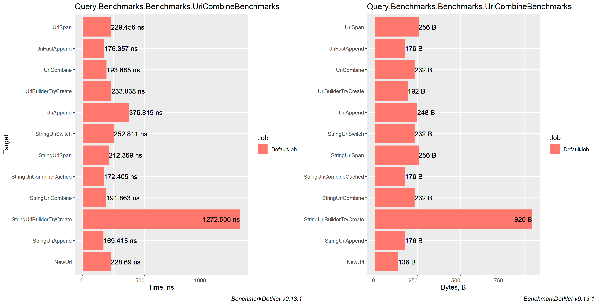
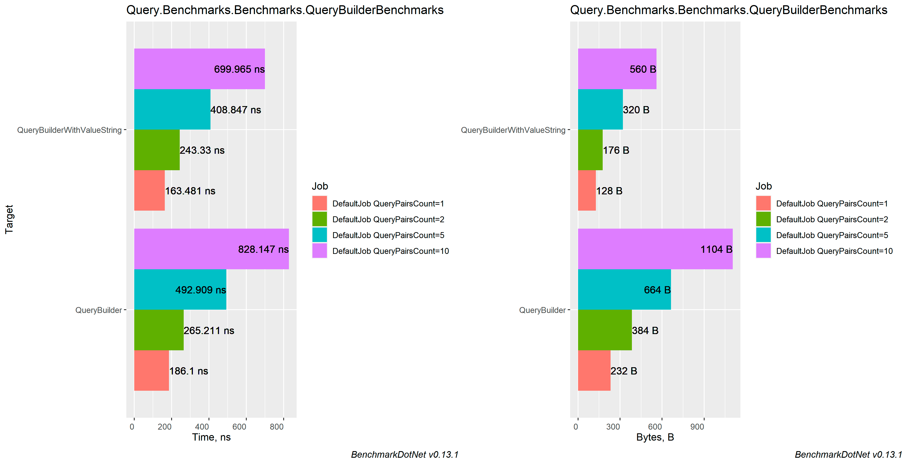

# Comparing different approaches for building Query strings and concatenating links

### Table of contents
- [Machine information](#machine-information)
- [Benchmark results](#benchmark-results)
  * [Uri combining](#uri-combining)
  * [Building query string](#building-query-string)
- [Conclusions](#conclusions)

<a name="machine-information"></a>
## Machine Information

``` ini
BenchmarkDotNet=v0.13.1, OS=Windows 10.0.22621
Intel Core i7-8550U CPU 1.80GHz (Kaby Lake R), 1 CPU, 8 logical and 4 physical cores
.NET SDK=6.0.202
  [Host]     : .NET 6.0.4 (6.0.422.16404), X64 RyuJIT
  DefaultJob : .NET 6.0.4 (6.0.422.16404), X64 RyuJIT
```

<a name="benchmark-results"></a>
## Benchmark Results

<a name="uri-combining"></a>
### Uri combining

| Method                    | Categories |       Mean |    Error |   StdDev |  StdErr |        Op/s | Allocated |
|---------------------------|------------|-----------:|---------:|---------:|--------:|------------:|----------:|
| UriFastAppend             | Uri Url    |   176.4 ns |  2.00 ns |  1.77 ns | 0.47 ns | 5,670,295.9 |     176 B |
| UriCombine                | Uri Url    |   193.9 ns |  3.36 ns |  3.14 ns | 0.81 ns | 5,157,708.1 |     232 B |
| NewUri                    | Uri Url    |   228.7 ns |  3.81 ns |  3.38 ns | 0.90 ns | 4,372,714.9 |     136 B |
| UriSpan                   | Uri Url    |   229.5 ns |  2.49 ns |  2.20 ns | 0.59 ns | 4,358,123.4 |     256 B |
| UriBuilderTryCreate       | Uri Url    |   233.8 ns |  2.82 ns |  2.64 ns | 0.68 ns | 4,276,460.9 |     192 B |
| UriAppend                 | Uri Url    |   376.8 ns |  3.71 ns |  3.47 ns | 0.90 ns | 2,653,826.3 |     248 B |
|                           |            |            |          |          |         |             |           |
| StringUriAppend           | String Url |   169.4 ns |  1.79 ns |  1.59 ns | 0.43 ns | 5,902,648.2 |     176 B |
| StringUriCombineCached    | String Url |   172.4 ns |  1.81 ns |  1.60 ns | 0.43 ns | 5,800,310.6 |     176 B |
| StringUriCombine          | String Url |   191.9 ns |  2.83 ns |  2.65 ns | 0.68 ns | 5,212,065.1 |     232 B |
| StringUriSpan             | String Url |   212.4 ns |  2.50 ns |  2.34 ns | 0.60 ns | 4,708,803.2 |     256 B |
| StringUriSwitch           | String Url |   252.8 ns |  3.93 ns |  3.68 ns | 0.95 ns | 3,955,532.8 |     232 B |
| StringUriBuilderTryCreate | String Url | 1,272.5 ns | 11.30 ns | 10.02 ns | 2.68 ns |   785,850.0 |     920 B |



<a name="building-query-string"></a>
### Building query string

| Method                      | QueryCount |        Mean |     Error |    StdDev |    StdErr |         Op/s | Allocated |
|-----------------------------|------------|------------:|----------:|----------:|----------:|-------------:|----------:|
| LinqQuerySpanVer2           | 1          |    82.59 ns |  1.239 ns |  1.159 ns |  0.299 ns | 12,107,713.2 |      80 B |
| QueryStringCreateConcat     | 1          |    96.12 ns |  1.811 ns |  1.605 ns |  0.429 ns | 10,403,690.4 |     128 B |
| QueryConcatString           | 1          |    98.04 ns |  1.313 ns |  1.228 ns |  0.317 ns | 10,199,934.5 |     152 B |
| LinqQueryAggregate          | 1          |   133.62 ns |  2.683 ns |  3.090 ns |  0.691 ns |  7,484,173.8 |     184 B |
| QueryCustomBuilder          | 1          |   139.99 ns |  2.080 ns |  1.946 ns |  0.502 ns |  7,143,273.2 |     128 B |
| QueryAspNetCore             | 1          |   163.08 ns |  3.187 ns |  3.543 ns |  0.813 ns |  6,132,068.0 |     232 B |
| QueryValueStringBuilder     | 1          |   170.13 ns |  2.897 ns |  2.568 ns |  0.686 ns |  5,877,697.6 |     128 B |
| QueryStringCreateStack      | 1          |   170.52 ns |  3.087 ns |  2.737 ns |  0.731 ns |  5,864,507.9 |     136 B |
| QueryStringCreate           | 1          |   172.51 ns |  2.171 ns |  1.925 ns |  0.514 ns |  5,796,599.8 |     136 B |
| QueryDictionary             | 1          |   215.13 ns |  4.348 ns |  5.340 ns |  1.138 ns |  4,648,383.7 |     344 B |
| LinqSelectJoin              | 1          |   232.26 ns |  2.400 ns |  2.004 ns |  0.556 ns |  4,305,427.1 |     240 B |
| QueryNvcStaticStringBuilder | 1          |   307.93 ns |  2.538 ns |  2.119 ns |  0.588 ns |  3,247,499.6 |     128 B |
| QueryNvcStringBuilder       | 1          |   388.53 ns |  7.145 ns |  5.966 ns |  1.655 ns |  2,573,794.9 |     232 B |
| QueryFormUrlEncodedContent  | 1          |   782.59 ns | 10.901 ns |  9.664 ns |  2.583 ns |  1,277,802.6 |   1,064 B |
|                             |            |             |           |           |           |              |           |
| LinqQuerySpanVer2           | 2          |   128.71 ns |  2.634 ns |  3.331 ns |  0.695 ns |  7,769,600.5 |     104 B |
| QueryCustomBuilder          | 2          |   172.32 ns |  3.503 ns |  3.105 ns |  0.830 ns |  5,803,009.4 |     176 B |
| QueryStringCreateConcat     | 2          |   181.37 ns |  2.793 ns |  2.476 ns |  0.662 ns |  5,513,740.5 |     272 B |
| QueryConcatString           | 2          |   190.86 ns |  1.877 ns |  1.664 ns |  0.445 ns |  5,239,467.1 |     320 B |
| QueryStringCreateStack      | 2          |   232.88 ns |  4.591 ns |  5.287 ns |  1.182 ns |  4,294,136.6 |     160 B |
| QueryStringCreate           | 2          |   234.53 ns |  2.422 ns |  2.147 ns |  0.574 ns |  4,263,862.4 |     160 B |
| QueryValueStringBuilder     | 2          |   241.22 ns |  4.707 ns |  6.443 ns |  1.264 ns |  4,145,646.0 |     176 B |
| LinqQueryAggregate          | 2          |   250.66 ns |  4.831 ns |  4.519 ns |  1.167 ns |  3,989,405.5 |     344 B |
| QueryAspNetCore             | 2          |   254.04 ns |  4.303 ns |  3.593 ns |  0.997 ns |  3,936,455.8 |     384 B |
| QueryDictionary             | 2          |   323.18 ns |  6.183 ns |  5.784 ns |  1.493 ns |  3,094,246.5 |     504 B |
| LinqSelectJoin              | 2          |   351.25 ns |  3.419 ns |  3.358 ns |  0.840 ns |  2,846,977.7 |     384 B |
| QueryNvcStaticStringBuilder | 2          |   567.15 ns | 10.682 ns | 10.491 ns |  2.623 ns |  1,763,206.1 |     176 B |
| QueryNvcStringBuilder       | 2          |   681.06 ns | 13.247 ns | 15.769 ns |  3.441 ns |  1,468,290.4 |     384 B |
| QueryFormUrlEncodedContent  | 2          |   919.47 ns | 18.305 ns | 23.802 ns |  4.859 ns |  1,087,585.8 |   1,256 B |
|                             |            |             |           |           |           |              |           |
| LinqQuerySpanVer2           | 5          |   286.23 ns |  4.713 ns |  4.408 ns |  1.138 ns |  3,493,699.7 |     176 B |
| QueryCustomBuilder          | 5          |   345.94 ns |  6.955 ns | 10.828 ns |  1.914 ns |  2,890,659.1 |     320 B |
| QueryValueStringBuilder     | 5          |   412.52 ns |  7.525 ns |  6.671 ns |  1.783 ns |  2,424,111.4 |     320 B |
| QueryStringCreateConcat     | 5          |   437.27 ns |  6.593 ns |  6.771 ns |  1.642 ns |  2,286,928.3 |     848 B |
| QueryStringCreateStack      | 5          |   448.75 ns |  9.043 ns |  8.459 ns |  2.184 ns |  2,228,422.3 |     232 B |
| QueryStringCreate           | 5          |   455.34 ns |  4.147 ns |  3.676 ns |  0.983 ns |  2,196,146.8 |     232 B |
| QueryAspNetCore             | 5          |   465.98 ns |  9.243 ns |  9.890 ns |  2.331 ns |  2,145,995.1 |     664 B |
| QueryConcatString           | 5          |   504.91 ns |  9.622 ns |  9.450 ns |  2.362 ns |  1,980,539.1 |   1,112 B |
| QueryDictionary             | 5          |   546.44 ns | 10.874 ns | 18.756 ns |  3.043 ns |  1,830,017.8 |     776 B |
| LinqQueryAggregate          | 5          |   594.80 ns | 10.562 ns |  9.363 ns |  2.502 ns |  1,681,235.6 |     968 B |
| LinqSelectJoin              | 5          |   606.74 ns | 11.865 ns | 11.098 ns |  2.866 ns |  1,648,143.6 |     672 B |
| QueryFormUrlEncodedContent  | 5          | 1,386.24 ns | 27.591 ns | 64.492 ns |  7.999 ns |    721,373.6 |   1,688 B |
| QueryNvcStaticStringBuilder | 5          | 1,426.95 ns | 24.244 ns | 21.492 ns |  5.744 ns |    700,795.9 |     320 B |
| QueryNvcStringBuilder       | 5          | 1,530.84 ns | 28.960 ns | 27.090 ns |  6.994 ns |    653,235.2 |     664 B |
|                             |            |             |           |           |           |              |           |
| LinqQuerySpanVer2           | 10         |   483.91 ns |  9.355 ns | 10.010 ns |  2.359 ns |  2,066,478.8 |     296 B |
| QueryCustomBuilder          | 10         |   601.98 ns | 11.578 ns | 13.783 ns |  3.008 ns |  1,661,179.0 |     560 B |
| QueryValueStringBuilder     | 10         |   709.09 ns | 14.210 ns | 16.916 ns |  3.691 ns |  1,410,258.9 |     560 B |
| QueryStringCreate           | 10         |   773.73 ns | 10.211 ns |  9.052 ns |  2.419 ns |  1,292,436.9 |     352 B |
| QueryAspNetCore             | 10         |   790.02 ns |  7.895 ns |  6.164 ns |  1.779 ns |  1,265,788.9 |   1,104 B |
| QueryStringCreateStack      | 10         |   804.09 ns |  8.602 ns |  7.183 ns |  1.992 ns |  1,243,645.6 |     352 B |
| QueryDictionary             | 10         |   904.18 ns | 11.494 ns | 10.189 ns |  2.723 ns |  1,105,973.6 |   1,224 B |
| QueryStringCreateConcat     | 10         |   956.91 ns | 19.010 ns | 32.280 ns |  5.307 ns |  1,045,025.3 |   2,288 B |
| LinqSelectJoin              | 10         | 1,043.38 ns | 19.362 ns | 19.016 ns |  4.754 ns |    958,420.6 |   1,152 B |
| QueryConcatString           | 10         | 1,206.28 ns | 20.923 ns | 19.571 ns |  5.053 ns |    828,995.5 |   3,392 B |
| LinqQueryAggregate          | 10         | 1,345.09 ns | 24.960 ns | 22.126 ns |  5.913 ns |    743,445.1 |   2,488 B |
| QueryFormUrlEncodedContent  | 10         | 1,967.12 ns | 37.754 ns | 44.943 ns |  9.807 ns |    508,357.7 |   2,360 B |
| QueryNvcStaticStringBuilder | 10         | 2,728.17 ns | 26.419 ns | 22.061 ns |  6.119 ns |    366,545.8 |     560 B |
| QueryNvcStringBuilder       | 10         | 2,885.87 ns | 41.479 ns | 38.799 ns | 10.018 ns |    346,515.7 |   1,104 B |



<a name="conclusions"></a>
## Conclusions

For building Query strings prefer using native `QueryAspNetCore` or my own implementation using spans: `QueryCustomBuilder`.
`AspNetCoreQueryBuilder` does not support mirroring for some special chars. `QueryCustomBuilder` supports mirroring and is well tested.
Difference is about 30-40%.
Also `QueryAspNetCore` internally uses `StringBuilder` that allocated enormous amounts of memory.

As for Uri concatenation: 
I think that it is better to stick with `New Uri` approach or my own implementation using spans `UriFastAppend`. It is well tested and outputs
perfect concatenated Url.

