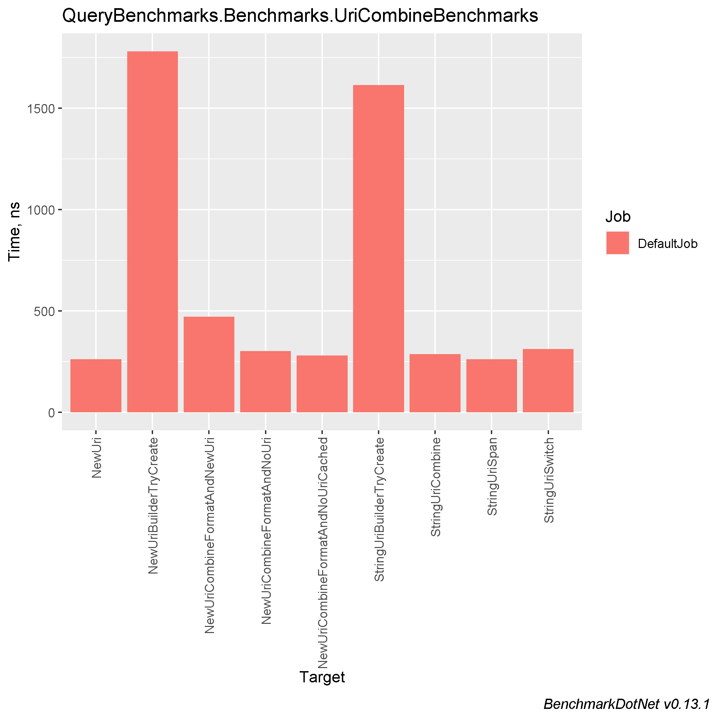
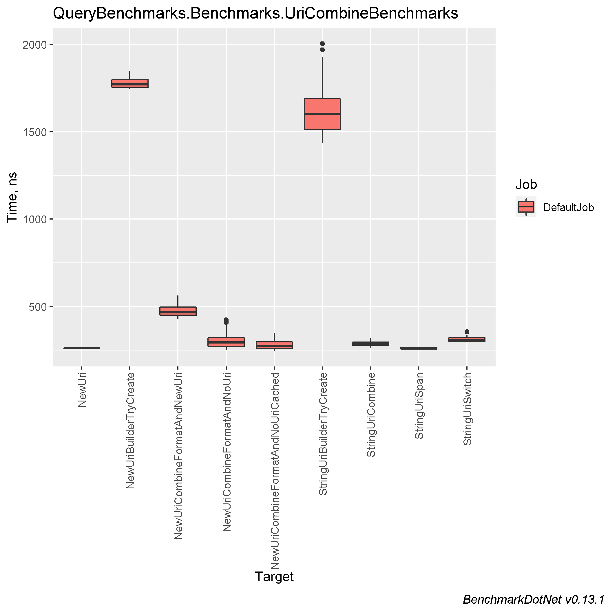
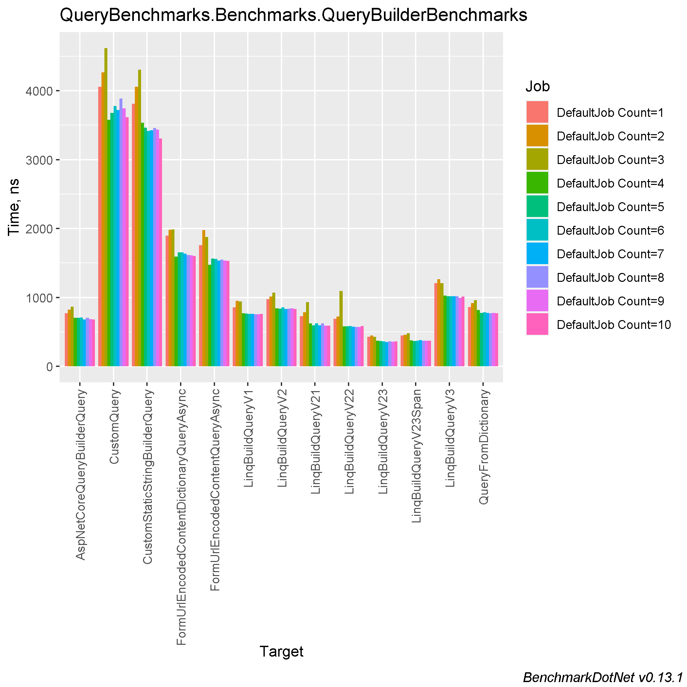
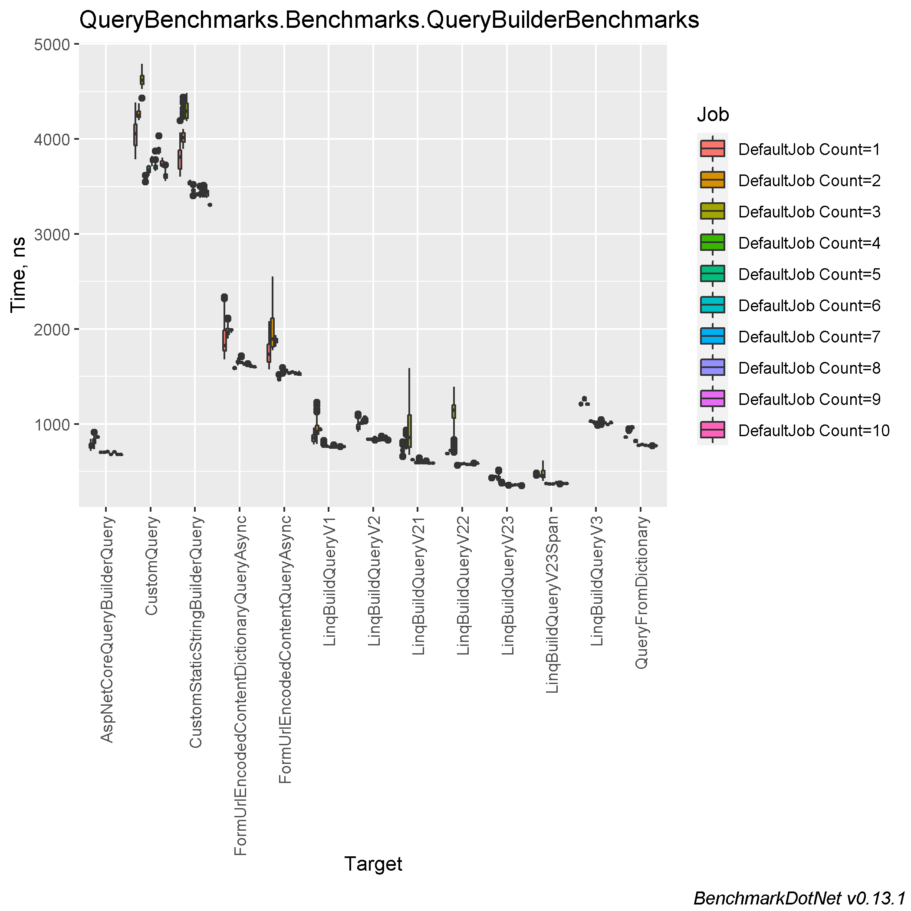

# Comparing different approaches for building Query strings and concatenating links

### Table of contents
- [Machine information](#machine-information)
- [Benchmark results](#benchmark-results)
  * [Uri combining](#uri-combining)
  * [Building query string](#building-query-string)
- [Conclusions](#conclusions)

<a name="machine-information"></a>
## Machine Information

``` ini
BenchmarkDotNet=v0.13.1, OS=Windows 10.0.22621
Intel Core i7-8550U CPU 1.80GHz (Kaby Lake R), 1 CPU, 8 logical and 4 physical cores
.NET SDK=6.0.202
  [Host]     : .NET 6.0.4 (6.0.422.16404), X64 RyuJIT
  DefaultJob : .NET 6.0.4 (6.0.422.16404), X64 RyuJIT
```

<a name="benchmark-results"></a>
## Benchmark Results

<a name="uri-combining"></a>
### Uri combining

| Method                            |       Mean |    Error |    StdDev |   StdErr |        Min |         Q1 |     Median |         Q3 |        Max |        Op/s | Ratio | RatioSD |  Gen 0 | Allocated |
|-----------------------------------|-----------:|---------:|----------:|---------:|-----------:|-----------:|-----------:|-----------:|-----------:|------------:|------:|--------:|-------:|----------:|
| StringUriSpan                     |   260.9 ns |  4.98 ns |   4.66 ns |  1.20 ns |   253.6 ns |   257.0 ns |   259.8 ns |   265.0 ns |   267.4 ns | 3,833,165.4 |  0.99 |    0.02 | 0.0515 |     216 B |
| NewUri                            |   262.0 ns |  2.58 ns |   2.29 ns |  0.61 ns |   258.2 ns |   260.5 ns |   261.5 ns |   263.4 ns |   266.7 ns | 3,816,908.3 |  1.00 |    0.00 | 0.0553 |     232 B |
| NewUriCombineFormatAndNoUriCached |   279.6 ns |  8.31 ns |  23.97 ns |  2.45 ns |   245.1 ns |   259.7 ns |   274.9 ns |   297.3 ns |   346.8 ns | 3,576,261.1 |  1.08 |    0.07 | 0.0515 |     216 B |
| StringUriCombine                  |   286.8 ns |  5.75 ns |  13.45 ns |  1.67 ns |   264.7 ns |   277.7 ns |   287.5 ns |   295.6 ns |   317.4 ns | 3,486,398.9 |  1.08 |    0.06 | 0.0668 |     280 B |
| NewUriCombineFormatAndNoUri       |   300.7 ns | 13.71 ns |  38.66 ns |  4.03 ns |   252.1 ns |   270.6 ns |   293.4 ns |   321.3 ns |   423.2 ns | 3,325,402.5 |  1.10 |    0.06 | 0.0515 |     216 B |
| StringUriSwitch                   |   310.9 ns |  6.23 ns |  13.15 ns |  1.79 ns |   294.6 ns |   299.8 ns |   309.1 ns |   320.0 ns |   354.7 ns | 3,216,180.1 |  1.21 |    0.07 | 0.0668 |     280 B |
| NewUriCombineFormatAndNewUri      |   471.6 ns | 10.03 ns |  28.77 ns |  2.95 ns |   427.8 ns |   449.9 ns |   466.9 ns |   495.8 ns |   562.6 ns | 2,120,559.3 |  1.74 |    0.10 | 0.0954 |     400 B |
| StringUriBuilderTryCreate         | 1,613.9 ns | 44.80 ns | 127.08 ns | 13.18 ns | 1,435.6 ns | 1,512.2 ns | 1,602.1 ns | 1,688.2 ns | 2,003.9 ns |   619,612.3 |  6.16 |    0.41 | 0.2079 |     872 B |
| NewUriBuilderTryCreate            | 1,780.5 ns | 29.77 ns |  30.58 ns |  7.42 ns | 1,746.5 ns | 1,755.7 ns | 1,772.5 ns | 1,798.8 ns | 1,849.0 ns |   561,644.5 |  6.80 |    0.15 | 0.2708 |   1,136 B |

#### MultimodalDistribution
- `UriCombineBenchmarks.StringUriBuilderTryCreate`: Default -> It seems that the distribution is bimodal (mValue = 3.62)




<a name="building-query-string"></a>
### Building query string
| Method                                    | Categories | Count |       Mean |    Error |    StdDev |   StdErr |     Median |        Min |         Q1 |         Q3 |        Max |        Op/s | Ratio | RatioSD |  Gen 0 | Allocated |
|-------------------------------------------|------------|-------|-----------:|---------:|----------:|---------:|-----------:|-----------:|-----------:|-----------:|-----------:|------------:|------:|--------:|-------:|----------:|
| LinqBuildQueryV23                         |            | 1     |   425.6 ns |  5.08 ns |   4.24 ns |  1.18 ns |   426.6 ns |   419.1 ns |   423.4 ns |   426.9 ns |   434.1 ns | 2,349,685.8 |  0.56 |    0.02 | 0.1392 |     584 B |
| LinqBuildQueryV23Span                     |            | 1     |   446.5 ns |  9.05 ns |  13.26 ns |  2.46 ns |   442.2 ns |   431.4 ns |   438.5 ns |   446.8 ns |   481.8 ns | 2,239,793.8 |  0.58 |    0.03 | 0.1392 |     584 B |
| LinqBuildQueryV22                         |            | 1     |   688.2 ns | 11.48 ns |  10.18 ns |  2.72 ns |   686.5 ns |   671.3 ns |   684.2 ns |   696.4 ns |   703.7 ns | 1,453,027.4 |  0.91 |    0.04 | 0.1602 |     672 B |
| LinqBuildQueryV21                         |            | 1     |   725.1 ns | 14.24 ns |  31.84 ns |  4.11 ns |   718.9 ns |   653.6 ns |   707.8 ns |   737.4 ns |   810.4 ns | 1,379,133.6 |  0.95 |    0.07 | 0.5522 |   2,312 B |
| AspNetCoreQueryBuilderQuery               |            | 1     |   767.7 ns | 15.43 ns |  31.17 ns |  4.41 ns |   770.5 ns |   716.3 ns |   745.3 ns |   791.9 ns |   842.1 ns | 1,302,590.1 |  1.00 |    0.00 | 0.2689 |   1,128 B |
| LinqBuildQueryV1                          |            | 1     |   854.5 ns | 17.09 ns |  43.49 ns |  4.99 ns |   852.5 ns |   785.9 ns |   817.0 ns |   882.3 ns |   964.2 ns | 1,170,221.3 |  1.12 |    0.08 | 0.3443 |   1,440 B |
| QueryFromDictionary                       |            | 1     |   862.1 ns |  6.99 ns |   5.45 ns |  1.57 ns |   863.3 ns |   853.0 ns |   858.0 ns |   864.8 ns |   872.8 ns | 1,159,927.0 |  1.14 |    0.04 | 0.2975 |   1,248 B |
| LinqBuildQueryV2                          |            | 1     |   975.4 ns | 19.42 ns |  46.90 ns |  5.65 ns |   962.5 ns |   915.8 ns |   944.2 ns |   993.2 ns | 1,105.3 ns | 1,025,175.0 |  1.28 |    0.08 | 0.6018 |   2,520 B |
| LinqBuildQueryV3                          |            | 1     | 1,208.6 ns | 18.46 ns |  16.37 ns |  4.37 ns | 1,204.6 ns | 1,180.1 ns | 1,198.1 ns | 1,220.4 ns | 1,236.9 ns |   827,421.4 |  1.60 |    0.07 | 0.6142 |   2,576 B |
| FormUrlEncodedContentQueryAsync           | Async      | 1     | 1,755.9 ns | 43.56 ns | 127.76 ns | 12.84 ns | 1,735.0 ns | 1,576.2 ns | 1,650.8 ns | 1,840.0 ns | 2,083.3 ns |   569,505.5 |  2.30 |    0.19 | 0.5798 |   2,432 B |
| FormUrlEncodedContentDictionaryQueryAsync | Async      | 1     | 1,895.1 ns | 61.02 ns | 176.06 ns | 17.97 ns | 1,825.5 ns | 1,678.9 ns | 1,772.7 ns | 1,987.7 ns | 2,337.4 ns |   527,665.7 |  2.44 |    0.22 | 0.5856 |   2,456 B |
| CustomStaticStringBuilderQuery            |            | 1     | 3,809.0 ns | 74.93 ns | 142.57 ns | 21.25 ns | 3,811.0 ns | 3,602.2 ns | 3,686.1 ns | 3,883.6 ns | 4,193.1 ns |   262,537.6 |  4.96 |    0.25 | 0.2136 |     904 B |
| CustomQuery                               |            | 1     | 4,059.0 ns | 75.40 ns | 150.59 ns | 21.51 ns | 4,054.0 ns | 3,788.5 ns | 3,934.8 ns | 4,155.6 ns | 4,384.0 ns |   246,364.1 |  5.29 |    0.30 | 0.3433 |   1,448 B |
|                                           |            |       |            |          |           |          |            |            |            |            |            |             |       |         |        |           |
| LinqBuildQueryV23                         |            | 2     |   448.4 ns |  6.54 ns |   5.80 ns |  1.55 ns |   447.1 ns |   440.0 ns |   444.2 ns |   453.8 ns |   457.3 ns | 2,230,209.5 |  0.57 |    0.02 | 0.1392 |     584 B |
| LinqBuildQueryV23Span                     |            | 2     |   455.4 ns |  5.12 ns |   4.54 ns |  1.21 ns |   455.4 ns |   449.3 ns |   451.6 ns |   458.3 ns |   465.3 ns | 2,195,665.5 |  0.58 |    0.02 | 0.1392 |     584 B |
| LinqBuildQueryV22                         |            | 2     |   720.7 ns |  9.49 ns |   7.92 ns |  2.20 ns |   719.3 ns |   706.7 ns |   715.6 ns |   727.6 ns |   734.9 ns | 1,387,462.3 |  0.91 |    0.03 | 0.1602 |     672 B |
| LinqBuildQueryV21                         |            | 2     |   784.5 ns | 19.81 ns |  54.88 ns |  5.82 ns |   768.5 ns |   728.6 ns |   745.4 ns |   794.4 ns |   934.0 ns | 1,274,737.5 |  0.96 |    0.10 | 0.5522 |   2,312 B |
| AspNetCoreQueryBuilderQuery               |            | 2     |   819.9 ns | 16.37 ns |  39.21 ns |  4.76 ns |   821.8 ns |   734.7 ns |   798.4 ns |   841.0 ns |   913.7 ns | 1,219,634.6 |  1.00 |    0.00 | 0.2689 |   1,128 B |
| QueryFromDictionary                       |            | 2     |   917.0 ns | 16.97 ns |  15.04 ns |  4.02 ns |   912.8 ns |   902.6 ns |   907.0 ns |   916.3 ns |   948.9 ns | 1,090,467.2 |  1.16 |    0.04 | 0.2975 |   1,248 B |
| LinqBuildQueryV1                          |            | 2     |   952.2 ns | 36.77 ns | 102.50 ns | 10.80 ns |   920.4 ns |   787.4 ns |   893.2 ns |   984.9 ns | 1,228.9 ns | 1,050,251.9 |  1.15 |    0.13 | 0.3443 |   1,440 B |
| LinqBuildQueryV2                          |            | 2     | 1,011.8 ns | 20.32 ns |  18.01 ns |  4.81 ns | 1,005.7 ns |   988.7 ns |   999.9 ns | 1,021.3 ns | 1,051.4 ns |   988,305.5 |  1.28 |    0.03 | 0.6008 |   2,520 B |
| LinqBuildQueryV3                          |            | 2     | 1,264.7 ns | 22.47 ns |  19.92 ns |  5.32 ns | 1,260.0 ns | 1,235.5 ns | 1,246.7 ns | 1,280.7 ns | 1,294.9 ns |   790,723.5 |  1.60 |    0.05 | 0.6142 |   2,576 B |
| FormUrlEncodedContentQueryAsync           | Async      | 2     | 1,977.5 ns | 70.36 ns | 206.34 ns | 20.74 ns | 1,893.4 ns | 1,774.1 ns | 1,814.1 ns | 2,113.0 ns | 2,552.9 ns |   505,691.9 |  2.48 |    0.33 | 0.5798 |   2,432 B |
| FormUrlEncodedContentDictionaryQueryAsync | Async      | 2     | 1,980.2 ns | 39.57 ns |  59.23 ns | 10.81 ns | 1,966.9 ns | 1,897.8 ns | 1,942.9 ns | 2,005.2 ns | 2,113.4 ns |   505,009.2 |  2.44 |    0.15 | 0.5836 |   2,456 B |
| CustomStaticStringBuilderQuery            |            | 2     | 4,059.4 ns | 80.48 ns | 140.96 ns | 22.57 ns | 4,015.8 ns | 3,895.4 ns | 3,968.4 ns | 4,066.7 ns | 4,438.7 ns |   246,341.2 |  5.05 |    0.34 | 0.2136 |     904 B |
| CustomQuery                               |            | 2     | 4,265.4 ns | 59.20 ns |  52.48 ns | 14.03 ns | 4,249.6 ns | 4,200.1 ns | 4,227.9 ns | 4,292.3 ns | 4,376.4 ns |   234,442.3 |  5.39 |    0.14 | 0.3433 |   1,448 B |
|                                           |            |       |            |          |           |          |            |            |            |            |            |             |       |         |        |           |
| LinqBuildQueryV23                         |            | 3     |   427.7 ns | 11.14 ns |  31.42 ns |  3.28 ns |   419.1 ns |   382.8 ns |   406.8 ns |   444.9 ns |   514.7 ns | 2,337,989.7 |  0.51 |    0.05 | 0.1392 |     584 B |
| LinqBuildQueryV23Span                     |            | 3     |   478.0 ns | 19.74 ns |  57.28 ns |  5.82 ns |   452.8 ns |   398.9 ns |   438.5 ns |   510.1 ns |   614.9 ns | 2,092,110.2 |  0.55 |    0.08 | 0.1392 |     584 B |
| AspNetCoreQueryBuilderQuery               |            | 3     |   863.5 ns | 12.64 ns |  11.20 ns |  2.99 ns |   863.2 ns |   846.2 ns |   857.5 ns |   870.5 ns |   885.7 ns | 1,158,058.2 |  1.00 |    0.00 | 0.2689 |   1,128 B |
| LinqBuildQueryV21                         |            | 3     |   930.7 ns | 73.90 ns | 217.89 ns | 21.79 ns |   857.6 ns |   671.9 ns |   755.5 ns | 1,092.7 ns | 1,587.2 ns | 1,074,423.2 |  1.02 |    0.26 | 0.5512 |   2,312 B |
| LinqBuildQueryV1                          |            | 3     |   942.3 ns | 12.58 ns |  11.15 ns |  2.98 ns |   944.2 ns |   922.4 ns |   934.1 ns |   947.5 ns |   965.4 ns | 1,061,226.5 |  1.09 |    0.02 | 0.3443 |   1,440 B |
| QueryFromDictionary                       |            | 3     |   962.1 ns | 14.09 ns |  17.30 ns |  3.69 ns |   965.3 ns |   924.4 ns |   953.6 ns |   976.4 ns |   988.2 ns | 1,039,419.0 |  1.11 |    0.03 | 0.2975 |   1,248 B |
| LinqBuildQueryV2                          |            | 3     | 1,067.7 ns | 19.18 ns |  16.02 ns |  4.44 ns | 1,070.0 ns | 1,031.1 ns | 1,066.1 ns | 1,075.2 ns | 1,087.5 ns |   936,618.5 |  1.23 |    0.03 | 0.6008 |   2,520 B |
| LinqBuildQueryV22                         |            | 3     | 1,094.6 ns | 57.95 ns | 169.95 ns | 17.08 ns | 1,146.6 ns |   702.8 ns | 1,061.9 ns | 1,198.5 ns | 1,392.8 ns |   913,603.9 |  1.02 |    0.12 | 0.1602 |     672 B |
| LinqBuildQueryV3                          |            | 3     | 1,208.6 ns | 13.21 ns |  11.03 ns |  3.06 ns | 1,208.7 ns | 1,191.5 ns | 1,200.4 ns | 1,217.6 ns | 1,226.7 ns |   827,428.5 |  1.40 |    0.02 | 0.6142 |   2,576 B |
| FormUrlEncodedContentQueryAsync           | Async      | 3     | 1,877.6 ns | 36.79 ns |  34.41 ns |  8.88 ns | 1,880.3 ns | 1,813.0 ns | 1,859.6 ns | 1,900.8 ns | 1,936.0 ns |   532,587.8 |  2.17 |    0.06 | 0.5798 |   2,432 B |
| FormUrlEncodedContentDictionaryQueryAsync | Async      | 3     | 1,988.2 ns | 17.13 ns |  15.18 ns |  4.06 ns | 1,988.7 ns | 1,959.6 ns | 1,983.5 ns | 2,000.8 ns | 2,006.3 ns |   502,978.9 |  2.30 |    0.03 | 0.5836 |   2,456 B |
| CustomStaticStringBuilderQuery            |            | 3     | 4,306.4 ns | 85.29 ns |  87.59 ns | 21.24 ns | 4,293.3 ns | 4,188.5 ns | 4,222.4 ns | 4,374.7 ns | 4,484.0 ns |   232,210.9 |  5.01 |    0.12 | 0.2136 |     904 B |
| CustomQuery                               |            | 3     | 4,619.6 ns | 76.89 ns |  85.46 ns | 19.61 ns | 4,620.4 ns | 4,429.4 ns | 4,575.1 ns | 4,669.1 ns | 4,793.4 ns |   216,467.7 |  5.35 |    0.11 | 0.3433 |   1,448 B |
|                                           |            |       |            |          |           |          |            |            |            |            |            |             |       |         |        |           |
| LinqBuildQueryV23                         |            | 4     |   369.1 ns |  6.46 ns |   6.35 ns |  1.59 ns |   367.1 ns |   363.2 ns |   365.6 ns |   369.4 ns |   384.4 ns | 2,709,087.4 |  0.53 |    0.01 | 0.1392 |     584 B |
| LinqBuildQueryV23Span                     |            | 4     |   374.0 ns |  2.57 ns |   2.86 ns |  0.66 ns |   373.6 ns |   369.1 ns |   371.6 ns |   376.6 ns |   378.7 ns | 2,674,111.5 |  0.53 |    0.00 | 0.1392 |     584 B |
| LinqBuildQueryV22                         |            | 4     |   577.4 ns |  7.15 ns |   5.59 ns |  1.61 ns |   580.2 ns |   564.5 ns |   575.5 ns |   580.9 ns |   581.7 ns | 1,731,884.5 |  0.82 |    0.01 | 0.1602 |     672 B |
| LinqBuildQueryV21                         |            | 4     |   622.6 ns |  5.67 ns |   5.30 ns |  1.37 ns |   624.3 ns |   614.3 ns |   619.1 ns |   626.9 ns |   629.5 ns | 1,606,058.4 |  0.89 |    0.01 | 0.5522 |   2,312 B |
| AspNetCoreQueryBuilderQuery               |            | 4     |   701.6 ns |  6.27 ns |   5.86 ns |  1.51 ns |   699.3 ns |   694.1 ns |   697.9 ns |   705.7 ns |   713.9 ns | 1,425,336.1 |  1.00 |    0.00 | 0.2689 |   1,128 B |
| LinqBuildQueryV1                          |            | 4     |   770.3 ns | 14.95 ns |  17.80 ns |  3.88 ns |   764.3 ns |   754.2 ns |   759.7 ns |   771.3 ns |   823.6 ns | 1,298,159.1 |  1.10 |    0.02 | 0.3443 |   1,440 B |
| QueryFromDictionary                       |            | 4     |   819.1 ns | 15.70 ns |  15.42 ns |  3.85 ns |   815.0 ns |   797.2 ns |   808.9 ns |   832.1 ns |   845.0 ns | 1,220,865.9 |  1.17 |    0.02 | 0.2975 |   1,248 B |
| LinqBuildQueryV2                          |            | 4     |   839.8 ns |  8.90 ns |   7.89 ns |  2.11 ns |   838.8 ns |   828.9 ns |   834.0 ns |   846.8 ns |   852.2 ns | 1,190,820.9 |  1.20 |    0.01 | 0.6018 |   2,520 B |
| LinqBuildQueryV3                          |            | 4     | 1,027.7 ns | 10.47 ns |   9.79 ns |  2.53 ns | 1,029.7 ns | 1,008.2 ns | 1,022.3 ns | 1,036.4 ns | 1,040.6 ns |   973,045.5 |  1.46 |    0.02 | 0.6142 |   2,576 B |
| FormUrlEncodedContentQueryAsync           | Async      | 4     | 1,473.1 ns | 20.51 ns |  18.18 ns |  4.86 ns | 1,466.4 ns | 1,446.0 ns | 1,461.7 ns | 1,483.3 ns | 1,517.4 ns |   678,854.3 |  2.10 |    0.03 | 0.5798 |   2,432 B |
| FormUrlEncodedContentDictionaryQueryAsync | Async      | 4     | 1,589.7 ns | 15.09 ns |  14.11 ns |  3.64 ns | 1,593.9 ns | 1,564.4 ns | 1,580.9 ns | 1,598.0 ns | 1,609.8 ns |   629,058.8 |  2.27 |    0.02 | 0.5856 |   2,456 B |
| CustomStaticStringBuilderQuery            |            | 4     | 3,536.9 ns | 21.34 ns |  18.92 ns |  5.06 ns | 3,534.0 ns | 3,511.2 ns | 3,522.0 ns | 3,553.0 ns | 3,573.6 ns |   282,737.3 |  5.04 |    0.04 | 0.2136 |     904 B |
| CustomQuery                               |            | 4     | 3,576.7 ns | 19.56 ns |  16.33 ns |  4.53 ns | 3,578.3 ns | 3,550.1 ns | 3,568.9 ns | 3,580.7 ns | 3,615.9 ns |   279,584.7 |  5.11 |    0.05 | 0.3433 |   1,448 B |
|                                           |            |       |            |          |           |          |            |            |            |            |            |             |       |         |        |           |
| LinqBuildQueryV23                         |            | 5     |   364.3 ns |  2.87 ns |   2.55 ns |  0.68 ns |   364.6 ns |   360.5 ns |   362.2 ns |   365.6 ns |   368.6 ns | 2,744,653.7 |  0.52 |    0.01 | 0.1392 |     584 B |
| LinqBuildQueryV23Span                     |            | 5     |   367.2 ns |  3.94 ns |   3.49 ns |  0.93 ns |   366.8 ns |   363.0 ns |   364.4 ns |   368.5 ns |   374.3 ns | 2,723,492.8 |  0.52 |    0.00 | 0.1392 |     584 B |
| LinqBuildQueryV22                         |            | 5     |   578.4 ns |  6.09 ns |   5.70 ns |  1.47 ns |   577.8 ns |   569.0 ns |   574.8 ns |   583.4 ns |   587.1 ns | 1,728,884.1 |  0.82 |    0.01 | 0.1602 |     672 B |
| LinqBuildQueryV21                         |            | 5     |   594.3 ns |  5.75 ns |   5.38 ns |  1.39 ns |   593.1 ns |   586.3 ns |   591.1 ns |   597.0 ns |   604.4 ns | 1,682,784.2 |  0.85 |    0.01 | 0.5522 |   2,312 B |
| AspNetCoreQueryBuilderQuery               |            | 5     |   701.5 ns |  5.24 ns |   4.90 ns |  1.27 ns |   701.2 ns |   692.6 ns |   698.0 ns |   705.5 ns |   707.8 ns | 1,425,572.2 |  1.00 |    0.00 | 0.2689 |   1,128 B |
| LinqBuildQueryV1                          |            | 5     |   764.8 ns |  6.14 ns |   5.74 ns |  1.48 ns |   765.4 ns |   755.4 ns |   760.0 ns |   767.6 ns |   777.1 ns | 1,307,584.1 |  1.09 |    0.01 | 0.3443 |   1,440 B |
| QueryFromDictionary                       |            | 5     |   773.7 ns |  6.75 ns |   6.32 ns |  1.63 ns |   774.7 ns |   762.2 ns |   768.7 ns |   777.4 ns |   785.6 ns | 1,292,421.2 |  1.10 |    0.01 | 0.2975 |   1,248 B |
| LinqBuildQueryV2                          |            | 5     |   835.3 ns |  8.31 ns |   7.37 ns |  1.97 ns |   836.7 ns |   818.7 ns |   831.7 ns |   840.7 ns |   844.9 ns | 1,197,151.4 |  1.19 |    0.01 | 0.6008 |   2,520 B |
| LinqBuildQueryV3                          |            | 5     | 1,014.7 ns | 15.51 ns |  13.75 ns |  3.67 ns | 1,016.5 ns |   989.5 ns | 1,006.8 ns | 1,024.1 ns | 1,039.3 ns |   985,503.2 |  1.45 |    0.02 | 0.6142 |   2,576 B |
| FormUrlEncodedContentQueryAsync           | Async      | 5     | 1,561.4 ns | 18.30 ns |  15.28 ns |  4.24 ns | 1,557.0 ns | 1,532.9 ns | 1,555.4 ns | 1,569.0 ns | 1,594.3 ns |   640,445.2 |  2.23 |    0.03 | 0.5798 |   2,432 B |
| FormUrlEncodedContentDictionaryQueryAsync | Async      | 5     | 1,652.0 ns | 16.17 ns |  19.85 ns |  4.23 ns | 1,649.0 ns | 1,613.3 ns | 1,641.1 ns | 1,665.5 ns | 1,699.6 ns |   605,314.1 |  2.36 |    0.04 | 0.5836 |   2,456 B |
| CustomStaticStringBuilderQuery            |            | 5     | 3,462.0 ns | 32.42 ns |  28.74 ns |  7.68 ns | 3,459.6 ns | 3,404.1 ns | 3,449.7 ns | 3,471.2 ns | 3,519.7 ns |   288,852.8 |  4.93 |    0.05 | 0.2136 |     904 B |
| CustomQuery                               |            | 5     | 3,677.4 ns | 47.31 ns |  39.51 ns | 10.96 ns | 3,673.7 ns | 3,612.5 ns | 3,650.8 ns | 3,712.0 ns | 3,727.6 ns |   271,934.1 |  5.24 |    0.05 | 0.3433 |   1,448 B |
|                                           |            |       |            |          |           |          |            |            |            |            |            |             |       |         |        |           |
| LinqBuildQueryV23                         |            | 6     |   361.4 ns |  3.25 ns |   2.88 ns |  0.77 ns |   362.0 ns |   354.7 ns |   360.0 ns |   363.4 ns |   364.9 ns | 2,767,269.3 |  0.51 |    0.01 | 0.1392 |     584 B |
| LinqBuildQueryV23Span                     |            | 6     |   368.7 ns |  2.60 ns |   2.31 ns |  0.62 ns |   368.9 ns |   365.2 ns |   367.1 ns |   370.3 ns |   373.2 ns | 2,712,402.9 |  0.52 |    0.01 | 0.1392 |     584 B |
| LinqBuildQueryV22                         |            | 6     |   584.3 ns |  6.84 ns |   6.06 ns |  1.62 ns |   583.8 ns |   571.7 ns |   581.1 ns |   589.3 ns |   593.9 ns | 1,711,524.7 |  0.82 |    0.02 | 0.1602 |     672 B |
| LinqBuildQueryV21                         |            | 6     |   620.2 ns | 10.29 ns |   8.59 ns |  2.38 ns |   618.2 ns |   608.8 ns |   616.0 ns |   620.5 ns |   642.5 ns | 1,612,446.8 |  0.88 |    0.02 | 0.5522 |   2,312 B |
| AspNetCoreQueryBuilderQuery               |            | 6     |   708.3 ns | 11.60 ns |  10.85 ns |  2.80 ns |   706.9 ns |   693.0 ns |   699.9 ns |   716.2 ns |   729.0 ns | 1,411,758.8 |  1.00 |    0.00 | 0.2689 |   1,128 B |
| LinqBuildQueryV1                          |            | 6     |   759.0 ns |  7.25 ns |   6.42 ns |  1.72 ns |   757.8 ns |   749.8 ns |   754.7 ns |   762.4 ns |   773.2 ns | 1,317,491.3 |  1.07 |    0.02 | 0.3443 |   1,440 B |
| QueryFromDictionary                       |            | 6     |   782.6 ns |  6.69 ns |   6.25 ns |  1.61 ns |   782.8 ns |   774.1 ns |   777.4 ns |   786.5 ns |   795.9 ns | 1,277,780.8 |  1.11 |    0.02 | 0.2975 |   1,248 B |
| LinqBuildQueryV2                          |            | 6     |   855.5 ns | 10.54 ns |   9.86 ns |  2.55 ns |   857.2 ns |   831.1 ns |   850.5 ns |   863.0 ns |   868.8 ns | 1,168,890.8 |  1.21 |    0.03 | 0.6018 |   2,520 B |
| LinqBuildQueryV3                          |            | 6     | 1,016.9 ns | 13.70 ns |  11.44 ns |  3.17 ns | 1,018.9 ns |   985.6 ns | 1,015.6 ns | 1,024.0 ns | 1,028.1 ns |   983,345.5 |  1.44 |    0.03 | 0.6142 |   2,576 B |
| FormUrlEncodedContentQueryAsync           | Async      | 6     | 1,556.8 ns | 19.53 ns |  17.31 ns |  4.63 ns | 1,554.6 ns | 1,526.1 ns | 1,546.2 ns | 1,572.8 ns | 1,584.7 ns |   642,361.2 |  2.20 |    0.04 | 0.5798 |   2,432 B |
| FormUrlEncodedContentDictionaryQueryAsync | Async      | 6     | 1,655.4 ns | 25.23 ns |  23.60 ns |  6.09 ns | 1,646.0 ns | 1,632.5 ns | 1,644.4 ns | 1,654.5 ns | 1,713.9 ns |   604,095.7 |  2.34 |    0.04 | 0.5856 |   2,456 B |
| CustomStaticStringBuilderQuery            |            | 6     | 3,414.7 ns | 17.05 ns |  13.31 ns |  3.84 ns | 3,419.2 ns | 3,392.2 ns | 3,405.4 ns | 3,422.9 ns | 3,430.1 ns |   292,851.3 |  4.82 |    0.08 | 0.2136 |     904 B |
| CustomQuery                               |            | 6     | 3,775.9 ns | 35.66 ns |  31.62 ns |  8.45 ns | 3,779.9 ns | 3,713.2 ns | 3,759.9 ns | 3,801.7 ns | 3,822.1 ns |   264,836.7 |  5.33 |    0.09 | 0.3433 |   1,448 B |
|                                           |            |       |            |          |           |          |            |            |            |            |            |             |       |         |        |           |
| LinqBuildQueryV23                         |            | 7     |   353.6 ns |  3.21 ns |   2.84 ns |  0.76 ns |   353.1 ns |   349.6 ns |   351.7 ns |   355.3 ns |   359.3 ns | 2,828,090.7 |  0.52 |    0.01 | 0.1392 |     584 B |
| LinqBuildQueryV23Span                     |            | 7     |   382.1 ns |  2.27 ns |   2.13 ns |  0.55 ns |   382.0 ns |   378.7 ns |   380.7 ns |   383.4 ns |   386.2 ns | 2,617,208.6 |  0.56 |    0.01 | 0.1392 |     584 B |
| LinqBuildQueryV22                         |            | 7     |   573.0 ns |  7.65 ns |   7.16 ns |  1.85 ns |   572.1 ns |   560.5 ns |   567.5 ns |   577.7 ns |   585.6 ns | 1,745,344.4 |  0.84 |    0.01 | 0.1602 |     672 B |
| LinqBuildQueryV21                         |            | 7     |   592.6 ns |  5.68 ns |   5.31 ns |  1.37 ns |   591.3 ns |   584.0 ns |   589.0 ns |   596.2 ns |   602.7 ns | 1,687,337.8 |  0.87 |    0.01 | 0.5522 |   2,312 B |
| AspNetCoreQueryBuilderQuery               |            | 7     |   681.6 ns |  7.28 ns |   6.81 ns |  1.76 ns |   680.3 ns |   672.6 ns |   677.4 ns |   685.2 ns |   696.8 ns | 1,467,115.6 |  1.00 |    0.00 | 0.2689 |   1,128 B |
| LinqBuildQueryV1                          |            | 7     |   761.2 ns | 10.88 ns |   9.65 ns |  2.58 ns |   757.4 ns |   749.7 ns |   755.7 ns |   763.7 ns |   781.3 ns | 1,313,639.4 |  1.12 |    0.02 | 0.3443 |   1,440 B |
| QueryFromDictionary                       |            | 7     |   776.5 ns |  9.06 ns |   8.48 ns |  2.19 ns |   774.8 ns |   766.0 ns |   770.1 ns |   780.9 ns |   791.9 ns | 1,287,823.7 |  1.14 |    0.02 | 0.2975 |   1,248 B |
| LinqBuildQueryV2                          |            | 7     |   833.0 ns | 15.89 ns |  15.61 ns |  3.90 ns |   829.0 ns |   815.4 ns |   822.0 ns |   839.0 ns |   862.0 ns | 1,200,533.8 |  1.22 |    0.02 | 0.6018 |   2,520 B |
| LinqBuildQueryV3                          |            | 7     | 1,018.2 ns | 13.30 ns |  11.79 ns |  3.15 ns | 1,017.5 ns |   996.2 ns | 1,013.4 ns | 1,024.2 ns | 1,042.3 ns |   982,083.1 |  1.49 |    0.02 | 0.6142 |   2,576 B |
| FormUrlEncodedContentQueryAsync           | Async      | 7     | 1,536.7 ns | 14.52 ns |  12.87 ns |  3.44 ns | 1,536.4 ns | 1,514.3 ns | 1,530.3 ns | 1,544.5 ns | 1,557.1 ns |   650,731.4 |  2.26 |    0.03 | 0.5798 |   2,432 B |
| FormUrlEncodedContentDictionaryQueryAsync | Async      | 7     | 1,633.6 ns | 13.41 ns |  10.47 ns |  3.02 ns | 1,630.4 ns | 1,621.3 ns | 1,626.6 ns | 1,636.9 ns | 1,651.8 ns |   612,136.6 |  2.40 |    0.03 | 0.5856 |   2,456 B |
| CustomStaticStringBuilderQuery            |            | 7     | 3,426.2 ns | 40.20 ns |  35.63 ns |  9.52 ns | 3,419.9 ns | 3,380.3 ns | 3,404.9 ns | 3,438.4 ns | 3,504.8 ns |   291,868.2 |  5.03 |    0.07 | 0.2136 |     904 B |
| CustomQuery                               |            | 7     | 3,720.9 ns | 66.30 ns |  55.36 ns | 15.35 ns | 3,706.5 ns | 3,663.8 ns | 3,685.4 ns | 3,721.3 ns | 3,872.8 ns |   268,751.2 |  5.46 |    0.07 | 0.3433 |   1,448 B |
|                                           |            |       |            |          |           |          |            |            |            |            |            |             |       |         |        |           |
| LinqBuildQueryV23                         |            | 8     |   360.1 ns |  2.85 ns |   2.38 ns |  0.66 ns |   359.9 ns |   356.6 ns |   358.5 ns |   361.8 ns |   365.2 ns | 2,776,866.9 |  0.51 |    0.01 | 0.1392 |     584 B |
| LinqBuildQueryV23Span                     |            | 8     |   369.5 ns |  2.25 ns |   1.99 ns |  0.53 ns |   369.8 ns |   365.7 ns |   369.0 ns |   370.9 ns |   372.5 ns | 2,706,271.4 |  0.52 |    0.01 | 0.1392 |     584 B |
| LinqBuildQueryV22                         |            | 8     |   571.7 ns |  6.72 ns |   5.25 ns |  1.51 ns |   572.6 ns |   561.6 ns |   568.5 ns |   574.8 ns |   579.2 ns | 1,749,287.9 |  0.81 |    0.01 | 0.1602 |     672 B |
| LinqBuildQueryV21                         |            | 8     |   620.5 ns |  6.39 ns |   5.33 ns |  1.48 ns |   620.5 ns |   611.1 ns |   618.7 ns |   623.0 ns |   628.6 ns | 1,611,549.3 |  0.88 |    0.01 | 0.5522 |   2,312 B |
| AspNetCoreQueryBuilderQuery               |            | 8     |   704.8 ns |  9.62 ns |   9.00 ns |  2.32 ns |   704.1 ns |   690.1 ns |   698.1 ns |   710.5 ns |   721.5 ns | 1,418,856.9 |  1.00 |    0.00 | 0.2689 |   1,128 B |
| LinqBuildQueryV1                          |            | 8     |   755.6 ns |  8.46 ns |   7.50 ns |  2.00 ns |   755.5 ns |   745.5 ns |   749.0 ns |   760.2 ns |   767.7 ns | 1,323,478.0 |  1.07 |    0.02 | 0.3443 |   1,440 B |
| QueryFromDictionary                       |            | 8     |   771.6 ns |  5.15 ns |   4.56 ns |  1.22 ns |   769.8 ns |   764.5 ns |   768.3 ns |   775.0 ns |   780.0 ns | 1,295,988.4 |  1.09 |    0.02 | 0.2975 |   1,248 B |
| LinqBuildQueryV2                          |            | 8     |   836.6 ns |  9.57 ns |  10.64 ns |  2.44 ns |   834.9 ns |   825.5 ns |   830.0 ns |   837.9 ns |   870.0 ns | 1,195,277.2 |  1.19 |    0.02 | 0.6018 |   2,520 B |
| LinqBuildQueryV3                          |            | 8     | 1,015.9 ns | 12.68 ns |  11.24 ns |  3.00 ns | 1,014.5 ns | 1,000.8 ns | 1,006.6 ns | 1,022.1 ns | 1,043.7 ns |   984,307.2 |  1.44 |    0.02 | 0.6142 |   2,576 B |
| FormUrlEncodedContentQueryAsync           | Async      | 8     | 1,547.5 ns |  8.23 ns |   7.30 ns |  1.95 ns | 1,546.6 ns | 1,536.5 ns | 1,542.3 ns | 1,552.0 ns | 1,561.1 ns |   646,205.5 |  2.20 |    0.03 | 0.5798 |   2,432 B |
| FormUrlEncodedContentDictionaryQueryAsync | Async      | 8     | 1,617.1 ns |  9.19 ns |   7.67 ns |  2.13 ns | 1,614.9 ns | 1,606.8 ns | 1,613.4 ns | 1,620.4 ns | 1,632.4 ns |   618,373.4 |  2.30 |    0.03 | 0.5856 |   2,456 B |
| CustomStaticStringBuilderQuery            |            | 8     | 3,459.9 ns | 26.44 ns |  22.08 ns |  6.12 ns | 3,456.3 ns | 3,420.6 ns | 3,451.6 ns | 3,461.1 ns | 3,511.7 ns |   289,027.9 |  4.91 |    0.07 | 0.2136 |     904 B |
| CustomQuery                               |            | 8     | 3,888.6 ns | 68.35 ns |  53.37 ns | 15.41 ns | 3,876.0 ns | 3,836.2 ns | 3,858.7 ns | 3,904.7 ns | 4,035.0 ns |   257,159.2 |  5.52 |    0.12 | 0.3433 |   1,448 B |
|                                           |            |       |            |          |           |          |            |            |            |            |            |             |       |         |        |           |
| LinqBuildQueryV23                         |            | 9     |   358.5 ns |  2.68 ns |   2.38 ns |  0.64 ns |   358.7 ns |   353.8 ns |   357.0 ns |   359.9 ns |   361.9 ns | 2,789,457.4 |  0.53 |    0.01 | 0.1392 |     584 B |
| LinqBuildQueryV23Span                     |            | 9     |   372.2 ns |  5.21 ns |   4.88 ns |  1.26 ns |   371.9 ns |   364.8 ns |   367.8 ns |   375.7 ns |   380.4 ns | 2,686,871.1 |  0.55 |    0.01 | 0.1392 |     584 B |
| LinqBuildQueryV22                         |            | 9     |   572.0 ns |  7.13 ns |   5.95 ns |  1.65 ns |   571.8 ns |   563.1 ns |   568.9 ns |   573.4 ns |   585.5 ns | 1,748,370.5 |  0.84 |    0.02 | 0.1602 |     672 B |
| LinqBuildQueryV21                         |            | 9     |   590.6 ns |  7.39 ns |   6.91 ns |  1.78 ns |   588.2 ns |   581.9 ns |   585.9 ns |   594.1 ns |   603.9 ns | 1,693,109.8 |  0.87 |    0.02 | 0.5522 |   2,312 B |
| AspNetCoreQueryBuilderQuery               |            | 9     |   682.3 ns |  8.67 ns |   8.11 ns |  2.09 ns |   680.4 ns |   670.8 ns |   677.8 ns |   687.6 ns |   698.3 ns | 1,465,720.7 |  1.00 |    0.00 | 0.2689 |   1,128 B |
| LinqBuildQueryV1                          |            | 9     |   754.0 ns |  4.49 ns |   3.75 ns |  1.04 ns |   752.8 ns |   749.7 ns |   751.3 ns |   755.2 ns |   761.2 ns | 1,326,225.1 |  1.11 |    0.01 | 0.3443 |   1,440 B |
| QueryFromDictionary                       |            | 9     |   776.8 ns |  4.19 ns |   3.50 ns |  0.97 ns |   777.6 ns |   769.3 ns |   775.5 ns |   779.1 ns |   782.3 ns | 1,287,297.7 |  1.14 |    0.02 | 0.2975 |   1,248 B |
| LinqBuildQueryV2                          |            | 9     |   840.1 ns |  5.48 ns |   4.86 ns |  1.30 ns |   839.3 ns |   832.1 ns |   837.3 ns |   842.0 ns |   850.3 ns | 1,190,375.9 |  1.23 |    0.02 | 0.6018 |   2,520 B |
| LinqBuildQueryV3                          |            | 9     |   994.0 ns |  7.49 ns |   6.26 ns |  1.74 ns |   995.3 ns |   982.7 ns |   991.6 ns |   998.6 ns | 1,003.7 ns | 1,006,065.6 |  1.46 |    0.02 | 0.6142 |   2,576 B |
| FormUrlEncodedContentQueryAsync           | Async      | 9     | 1,532.6 ns | 14.77 ns |  13.09 ns |  3.50 ns | 1,528.2 ns | 1,512.5 ns | 1,523.0 ns | 1,542.6 ns | 1,555.7 ns |   652,475.0 |  2.25 |    0.03 | 0.5798 |   2,432 B |
| FormUrlEncodedContentDictionaryQueryAsync | Async      | 9     | 1,609.4 ns | 15.28 ns |  13.54 ns |  3.62 ns | 1,606.0 ns | 1,588.3 ns | 1,601.0 ns | 1,615.6 ns | 1,635.7 ns |   621,347.2 |  2.36 |    0.03 | 0.5856 |   2,456 B |
| CustomStaticStringBuilderQuery            |            | 9     | 3,437.4 ns | 44.46 ns |  41.59 ns | 10.74 ns | 3,435.6 ns | 3,379.8 ns | 3,404.5 ns | 3,459.2 ns | 3,523.8 ns |   290,918.8 |  5.04 |    0.09 | 0.2136 |     904 B |
| CustomQuery                               |            | 9     | 3,742.6 ns | 35.99 ns |  33.66 ns |  8.69 ns | 3,728.2 ns | 3,700.5 ns | 3,720.2 ns | 3,768.0 ns | 3,807.1 ns |   267,190.9 |  5.49 |    0.08 | 0.3433 |   1,448 B |
|                                           |            |       |            |          |           |          |            |            |            |            |            |             |       |         |        |           |
| LinqBuildQueryV23                         |            | 10    |   359.2 ns |  3.76 ns |   3.14 ns |  0.87 ns |   359.9 ns |   351.3 ns |   358.4 ns |   361.2 ns |   362.9 ns | 2,783,933.5 |  0.53 |    0.00 | 0.1392 |     584 B |
| LinqBuildQueryV23Span                     |            | 10    |   372.4 ns |  2.47 ns |   2.19 ns |  0.59 ns |   372.4 ns |   369.4 ns |   370.4 ns |   373.6 ns |   376.9 ns | 2,685,009.2 |  0.55 |    0.00 | 0.1392 |     584 B |
| LinqBuildQueryV22                         |            | 10    |   585.3 ns |  5.06 ns |   4.73 ns |  1.22 ns |   586.1 ns |   576.5 ns |   582.2 ns |   589.2 ns |   592.2 ns | 1,708,563.5 |  0.87 |    0.01 | 0.1602 |     672 B |
| LinqBuildQueryV21                         |            | 10    |   588.8 ns |  3.34 ns |   2.96 ns |  0.79 ns |   589.0 ns |   583.8 ns |   587.7 ns |   590.6 ns |   593.9 ns | 1,698,305.3 |  0.87 |    0.01 | 0.5522 |   2,312 B |
| AspNetCoreQueryBuilderQuery               |            | 10    |   677.1 ns |  3.06 ns |   2.56 ns |  0.71 ns |   676.6 ns |   673.4 ns |   675.6 ns |   678.9 ns |   682.9 ns | 1,476,876.6 |  1.00 |    0.00 | 0.2689 |   1,128 B |
| LinqBuildQueryV1                          |            | 10    |   761.0 ns | 12.60 ns |  10.53 ns |  2.92 ns |   761.1 ns |   745.4 ns |   754.1 ns |   769.8 ns |   775.4 ns | 1,314,077.2 |  1.12 |    0.02 | 0.3443 |   1,440 B |
| QueryFromDictionary                       |            | 10    |   769.8 ns |  4.87 ns |   4.32 ns |  1.15 ns |   769.7 ns |   762.6 ns |   768.3 ns |   772.6 ns |   777.6 ns | 1,298,977.0 |  1.14 |    0.01 | 0.2975 |   1,248 B |
| LinqBuildQueryV2                          |            | 10    |   833.2 ns |  3.43 ns |   2.87 ns |  0.80 ns |   833.7 ns |   827.4 ns |   832.3 ns |   834.7 ns |   837.4 ns | 1,200,173.8 |  1.23 |    0.01 | 0.6018 |   2,520 B |
| LinqBuildQueryV3                          |            | 10    | 1,013.2 ns | 11.25 ns |   9.39 ns |  2.61 ns | 1,015.8 ns |   995.9 ns | 1,009.1 ns | 1,018.5 ns | 1,028.3 ns |   986,973.8 |  1.50 |    0.01 | 0.6142 |   2,576 B |
| FormUrlEncodedContentQueryAsync           | Async      | 10    | 1,528.9 ns | 18.01 ns |  16.84 ns |  4.35 ns | 1,526.0 ns | 1,505.8 ns | 1,517.1 ns | 1,538.5 ns | 1,562.5 ns |   654,062.0 |  2.26 |    0.02 | 0.5798 |   2,432 B |
| FormUrlEncodedContentDictionaryQueryAsync | Async      | 10    | 1,600.3 ns |  5.55 ns |   4.63 ns |  1.28 ns | 1,599.7 ns | 1,594.2 ns | 1,596.6 ns | 1,603.6 ns | 1,608.1 ns |   624,881.1 |  2.36 |    0.01 | 0.5856 |   2,456 B |
| CustomStaticStringBuilderQuery            |            | 10    | 3,308.2 ns | 15.15 ns |  12.65 ns |  3.51 ns | 3,305.6 ns | 3,285.1 ns | 3,301.8 ns | 3,314.6 ns | 3,329.6 ns |   302,276.9 |  4.89 |    0.03 | 0.2136 |     904 B |
| CustomQuery                               |            | 10    | 3,616.9 ns | 53.28 ns |  47.23 ns | 12.62 ns | 3,605.1 ns | 3,558.7 ns | 3,588.2 ns | 3,632.9 ns | 3,725.5 ns |   276,477.7 |  5.34 |    0.07 | 0.3433 |   1,448 B |

#### MultimodalDistribution
`QueryBuilderBenchmarks.FormUrlEncodedContentQueryAsync`: Default -> It seems that the distribution is bimodal (mValue = 3.57)

`QueryBuilderBenchmarks.LinqBuildQueryV1`: Default -> It seems that the distribution can have several modes (mValue = 3)

`QueryBuilderBenchmarks.LinqBuildQueryV21`: Default -> It seems that the distribution can have several modes (mValue = 2.94)




<a name="conclusions"></a>
## Conclusions

For building Query strings prefer using native `AspNetCoreQueryBuilder` or my own implementation using spans: `LinqBuildQueryV23Span`.
No significant differences, but AspNet code is covered with tests and does not require maintenance.

As for Uri concatenation: 
I think that it is better to stick with `New Uri` approach due to same reasons. But you can also use `StringUriSpan` method.

