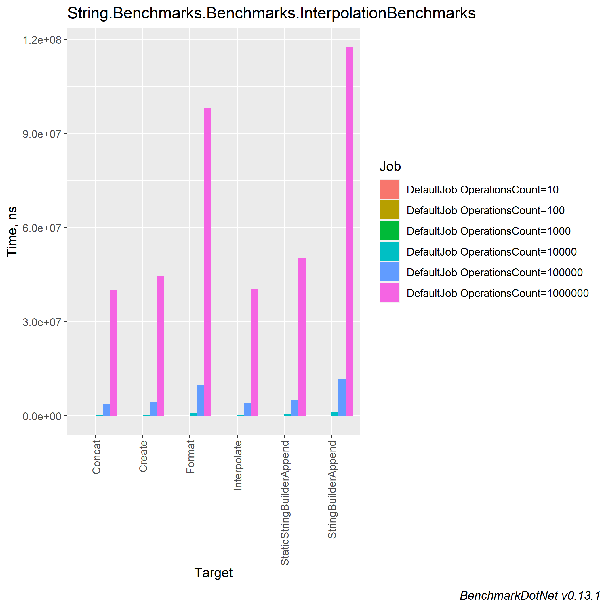
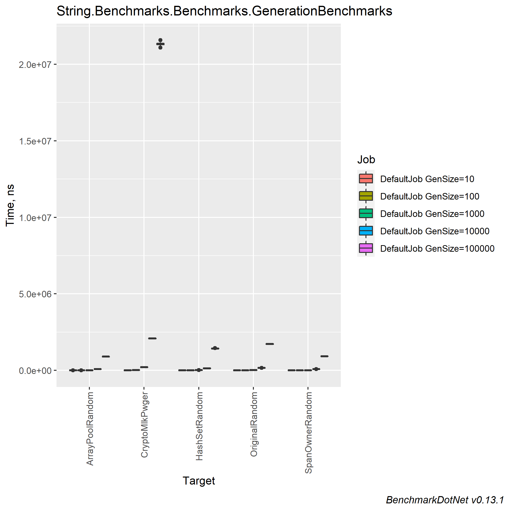
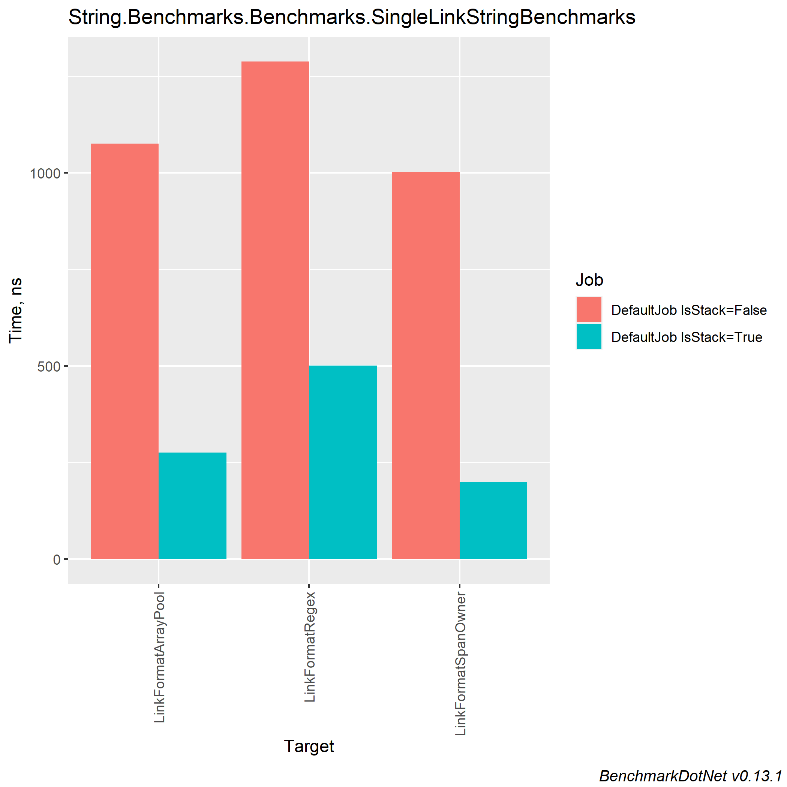
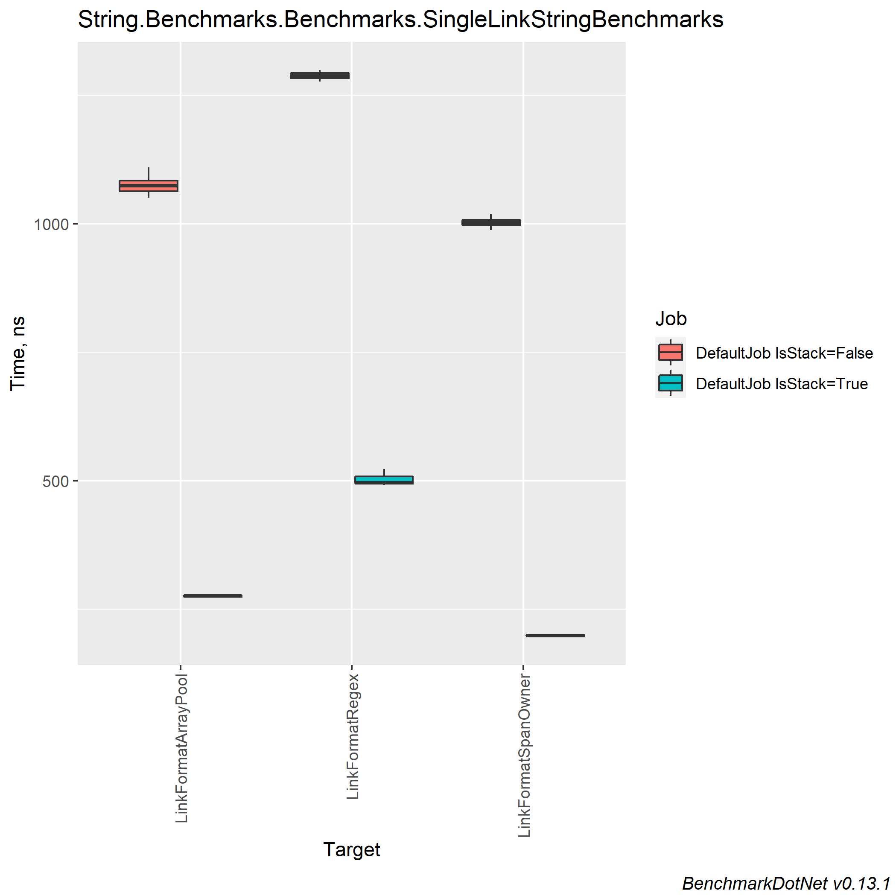
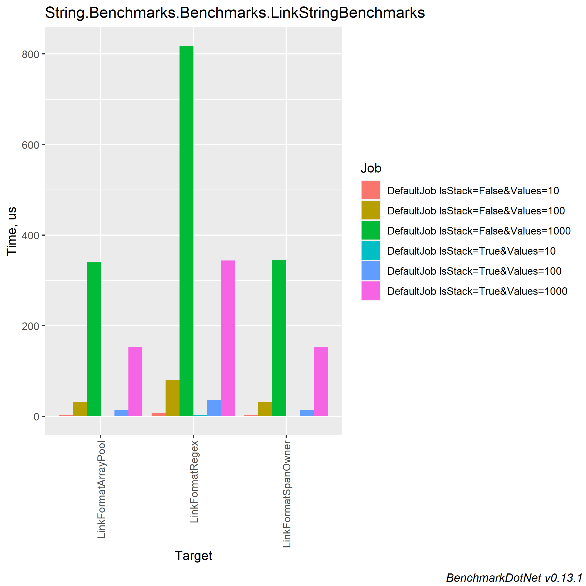
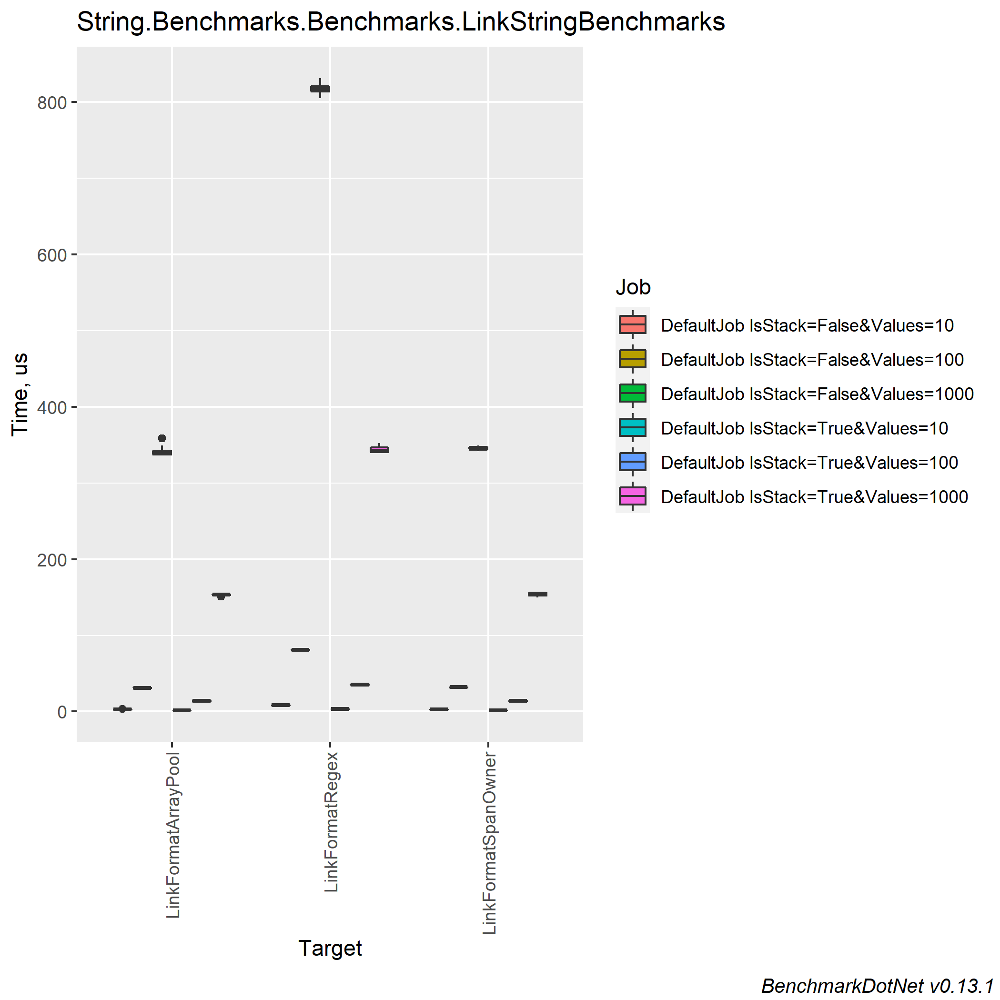
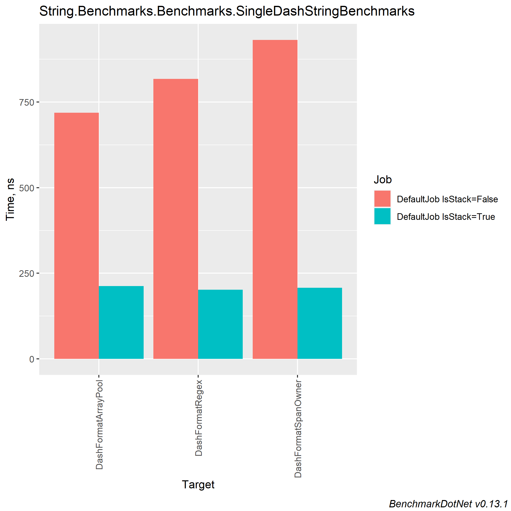
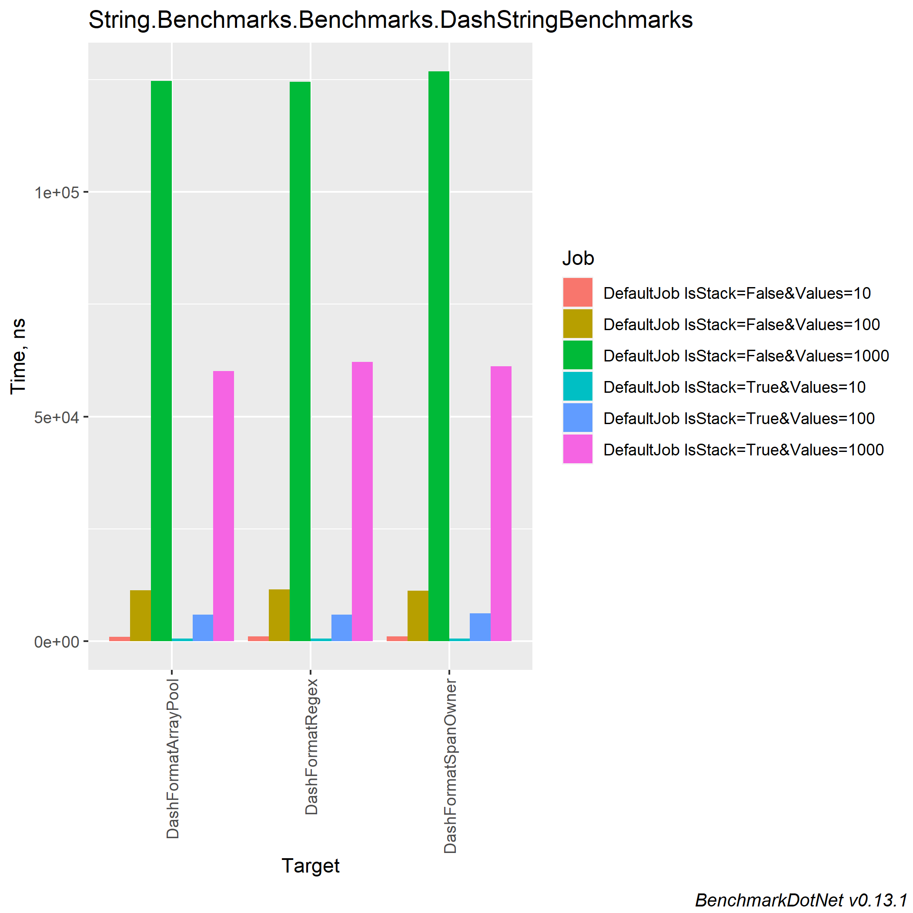
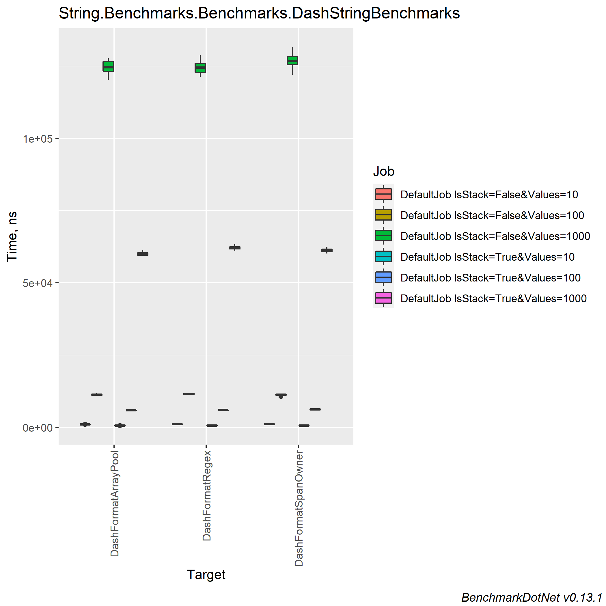

# Comparing string concatenation, different approaches to create link format string, generate unique string and create dash format string.

### Table of contents
- [Machine information](#machine-information)
- [Benchmark results](#benchmark-results)
    * [Contains char benchmarks](#contains-char-benchmarks)
    * [String interpolation](#string-interpolation)
    * [Unique string generation](#unique-string-generation)
    * [Link/Dash view benchmarks](#linkdash-view-benchmarks)
      * [Original string benchmarks](#original-string-benchmarks)
      * [Stack string benchmarks](#stack-string-benchmarks)
- [Conclusions](#conclusions)

<a name="machine-information"></a>
## Machine Information

``` ini
BenchmarkDotNet=v0.13.1, OS=Windows 10.0.22621
Intel Core i7-8550U CPU 1.80GHz (Kaby Lake R), 1 CPU, 8 logical and 4 physical cores
.NET SDK=6.0.202
  [Host]     : .NET 6.0.4 (6.0.422.16404), X64 RyuJIT
  DefaultJob : .NET 6.0.4 (6.0.422.16404), X64 RyuJIT
```

<a name="benchmark-results"></a>
## Benchmark Results

<a name="contains-char-benchmarks"></a>
### Contains char benchmarks

| Method                  |      Mean |     Error |    StdDev |    StdErr |       Min |        Q1 |    Median |        Q3 |       Max |          Op/s | Ratio | RatioSD | Allocated |
|-------------------------|----------:|----------:|----------:|----------:|----------:|----------:|----------:|----------:|----------:|--------------:|------:|--------:|----------:|
| ContainsExists          |  3.040 ns | 0.0921 ns | 0.0861 ns | 0.0222 ns |  2.978 ns |  3.006 ns |  3.023 ns |  3.035 ns |  3.343 ns | 328,934,319.1 |  1.00 |    0.00 |         - |
| IndexOfNotExists        |  3.256 ns | 0.0320 ns | 0.0284 ns | 0.0076 ns |  3.214 ns |  3.243 ns |  3.250 ns |  3.266 ns |  3.319 ns | 307,100,772.6 |  1.07 |    0.03 |         - |
| IndexOfExists           |  5.173 ns | 0.0488 ns | 0.0433 ns | 0.0116 ns |  5.109 ns |  5.139 ns |  5.171 ns |  5.185 ns |  5.253 ns | 193,317,930.0 |  1.70 |    0.04 |         - |
| ContainsNotExists       | 12.364 ns | 0.0530 ns | 0.0443 ns | 0.0123 ns | 12.287 ns | 12.338 ns | 12.363 ns | 12.393 ns | 12.461 ns |  80,879,403.0 |  4.07 |    0.11 |         - |
| ContainsCustomExists    | 65.009 ns | 0.4081 ns | 0.3817 ns | 0.0986 ns | 64.455 ns | 64.683 ns | 65.046 ns | 65.216 ns | 65.823 ns |  15,382,412.6 | 21.40 |    0.51 |         - |
| ContainsCustomNotExists | 74.668 ns | 0.5524 ns | 0.5167 ns | 0.1334 ns | 73.976 ns | 74.262 ns | 74.691 ns | 75.028 ns | 75.847 ns |  13,392,568.5 | 24.58 |    0.62 |         - |

<a name="string-interpolation"></a>
### String interpolation

| Method                    | OperationsCount |             Mean |           Error |          StdDev |        StdErr |              Min |               Q1 |           Median |               Q3 |              Max |          Op/s | Ratio | RatioSD |      Gen 0 |     Allocated |
|---------------------------|-----------------|-----------------:|----------------:|----------------:|--------------:|-----------------:|-----------------:|-----------------:|-----------------:|-----------------:|--------------:|------:|--------:|-----------:|--------------:|
| Concat                    | 10              |         422.1 ns |         4.03 ns |         3.36 ns |       0.93 ns |         417.0 ns |         418.9 ns |         423.0 ns |         424.0 ns |         427.7 ns | 2,368,830.449 |  0.99 |    0.01 |     0.1702 |         712 B |
| Interpolate               | 10              |         424.8 ns |         4.96 ns |         4.64 ns |       1.20 ns |         414.0 ns |         422.3 ns |         425.2 ns |         426.9 ns |         432.6 ns | 2,353,893.053 |  1.00 |    0.00 |     0.1702 |         712 B |
| Create                    | 10              |         471.5 ns |         6.53 ns |         6.11 ns |       1.58 ns |         464.4 ns |         466.5 ns |         471.9 ns |         474.4 ns |         484.9 ns | 2,120,760.461 |  1.11 |    0.02 |     0.1702 |         712 B |
| StaticStringBuilderAppend | 10              |         548.9 ns |         3.60 ns |         3.01 ns |       0.83 ns |         543.4 ns |         547.1 ns |         548.6 ns |         550.6 ns |         554.0 ns | 1,821,733.854 |  1.29 |    0.02 |     0.1702 |         712 B |
| Format                    | 10              |       1,010.3 ns |        19.26 ns |        17.08 ns |       4.56 ns |         990.2 ns |         998.8 ns |       1,006.4 ns |       1,021.1 ns |       1,053.8 ns |   989,788.515 |  2.38 |    0.04 |     0.1698 |         712 B |
| StringBuilderAppend       | 10              |       1,227.0 ns |        23.86 ns |        24.50 ns |       5.94 ns |       1,190.7 ns |       1,202.1 ns |       1,224.3 ns |       1,248.9 ns |       1,261.6 ns |   815,015.040 |  2.90 |    0.07 |     0.6676 |       2,792 B |
|                           |                 |                  |                 |                 |               |                  |                  |                  |                  |                  |               |       |         |            |               |
| Interpolate               | 100             |       3,663.4 ns |        39.89 ns |        37.31 ns |       9.63 ns |       3,610.6 ns |       3,639.4 ns |       3,657.3 ns |       3,685.5 ns |       3,747.6 ns |   272,968.737 |  1.00 |    0.00 |     1.5450 |       6,472 B |
| Concat                    | 100             |       3,675.1 ns |        56.23 ns |        49.85 ns |      13.32 ns |       3,617.5 ns |       3,639.2 ns |       3,664.6 ns |       3,698.3 ns |       3,794.2 ns |   272,103.560 |  1.00 |    0.01 |     1.5450 |       6,472 B |
| Create                    | 100             |       3,979.3 ns |        54.94 ns |        51.39 ns |      13.27 ns |       3,915.2 ns |       3,939.2 ns |       3,970.8 ns |       4,016.7 ns |       4,081.5 ns |   251,300.833 |  1.09 |    0.02 |     1.5450 |       6,472 B |
| StaticStringBuilderAppend | 100             |       4,785.1 ns |        93.33 ns |       136.80 ns |      25.40 ns |       4,598.1 ns |       4,671.0 ns |       4,779.8 ns |       4,863.6 ns |       5,133.7 ns |   208,980.313 |  1.32 |    0.05 |     1.5411 |       6,472 B |
| Format                    | 100             |       9,487.4 ns |        86.83 ns |        76.97 ns |      20.57 ns |       9,390.6 ns |       9,421.4 ns |       9,486.9 ns |       9,539.6 ns |       9,629.2 ns |   105,402.402 |  2.59 |    0.04 |     1.5411 |       6,472 B |
| StringBuilderAppend       | 100             |      11,347.6 ns |       212.82 ns |       177.71 ns |      49.29 ns |      11,054.1 ns |      11,250.7 ns |      11,371.6 ns |      11,420.8 ns |      11,722.7 ns |    88,124.124 |  3.10 |    0.05 |     6.5155 |      27,272 B |
|                           |                 |                  |                 |                 |               |                  |                  |                  |                  |                  |               |       |         |            |               |
| Concat                    | 1000            |      35,375.3 ns |       487.58 ns |       456.08 ns |     117.76 ns |      34,822.2 ns |      35,071.0 ns |      35,219.1 ns |      35,710.7 ns |      36,330.9 ns |    28,268.298 |  1.00 |    0.02 |    15.3198 |      64,072 B |
| Interpolate               | 1000            |      35,529.8 ns |       446.96 ns |       373.23 ns |     103.52 ns |      34,956.1 ns |      35,246.6 ns |      35,469.6 ns |      35,756.3 ns |      36,150.2 ns |    28,145.395 |  1.00 |    0.00 |    15.3198 |      64,072 B |
| Create                    | 1000            |      39,242.9 ns |       708.44 ns |       662.68 ns |     171.10 ns |      38,476.2 ns |      38,697.4 ns |      38,980.8 ns |      39,940.0 ns |      40,342.3 ns |    25,482.324 |  1.10 |    0.02 |    15.3198 |      64,072 B |
| StaticStringBuilderAppend | 1000            |      46,579.4 ns |       876.34 ns |       776.85 ns |     207.62 ns |      45,520.0 ns |      45,986.9 ns |      46,493.3 ns |      46,841.5 ns |      48,090.0 ns |    21,468.728 |  1.31 |    0.03 |    15.3198 |      64,072 B |
| Format                    | 1000            |      91,619.5 ns |     1,375.69 ns |     1,286.82 ns |     332.25 ns |      89,615.9 ns |      90,474.0 ns |      91,274.1 ns |      92,552.0 ns |      94,014.0 ns |    10,914.710 |  2.58 |    0.05 |    15.2588 |      64,072 B |
| StringBuilderAppend       | 1000            |     108,790.9 ns |     1,237.21 ns |     1,096.75 ns |     293.12 ns |     106,398.7 ns |     108,455.4 ns |     108,804.6 ns |     109,522.6 ns |     110,513.4 ns |     9,191.948 |  3.06 |    0.05 |    64.9414 |     272,072 B |
|                           |                 |                  |                 |                 |               |                  |                  |                  |                  |                  |               |       |         |            |               |
| Concat                    | 10000           |     359,412.6 ns |     5,934.80 ns |     5,551.42 ns |   1,433.37 ns |     351,469.7 ns |     354,559.3 ns |     359,627.5 ns |     363,962.3 ns |     368,327.1 ns |     2,782.318 |  0.98 |    0.02 |   152.8320 |     640,074 B |
| Interpolate               | 10000           |     365,508.7 ns |     5,566.64 ns |     5,716.53 ns |   1,386.46 ns |     358,196.6 ns |     361,365.4 ns |     364,569.8 ns |     369,656.4 ns |     376,095.3 ns |     2,735.913 |  1.00 |    0.00 |   152.8320 |     640,072 B |
| Create                    | 10000           |     417,291.0 ns |     6,851.25 ns |     6,073.46 ns |   1,623.20 ns |     406,118.2 ns |     414,096.8 ns |     416,836.5 ns |     420,626.3 ns |     428,662.3 ns |     2,396.409 |  1.14 |    0.02 |   152.8320 |     640,072 B |
| StaticStringBuilderAppend | 10000           |     491,638.6 ns |     9,616.23 ns |     9,875.16 ns |   2,395.08 ns |     476,484.3 ns |     482,375.7 ns |     495,565.3 ns |     498,933.6 ns |     507,658.5 ns |     2,034.014 |  1.35 |    0.04 |   152.8320 |     640,072 B |
| Format                    | 10000           |     917,079.8 ns |    12,225.18 ns |    10,837.30 ns |   2,896.39 ns |     903,575.9 ns |     908,922.2 ns |     917,305.7 ns |     921,824.2 ns |     940,891.3 ns |     1,090.418 |  2.50 |    0.06 |   152.3438 |     640,073 B |
| StringBuilderAppend       | 10000           |   1,119,929.9 ns |    11,977.54 ns |    11,203.80 ns |   2,892.81 ns |   1,102,127.7 ns |   1,114,467.5 ns |   1,117,298.7 ns |   1,129,163.7 ns |   1,137,275.6 ns |       892.913 |  3.06 |    0.07 |   650.3906 |   2,720,075 B |
|                           |                 |                  |                 |                 |               |                  |                  |                  |                  |                  |               |       |         |            |               |
| Concat                    | 100000          |   3,929,256.1 ns |    40,363.79 ns |    33,705.59 ns |   9,348.25 ns |   3,868,501.2 ns |   3,920,539.5 ns |   3,939,986.3 ns |   3,947,354.7 ns |   3,976,989.5 ns |       254.501 |  0.99 |    0.02 |  1527.3438 |   6,400,075 B |
| Interpolate               | 100000          |   3,954,986.7 ns |    77,807.72 ns |    72,781.39 ns |  18,792.07 ns |   3,862,975.0 ns |   3,897,432.2 ns |   3,941,857.8 ns |   3,996,769.1 ns |   4,108,367.6 ns |       252.845 |  1.00 |    0.00 |  1527.3438 |   6,400,075 B |
| Create                    | 100000          |   4,577,028.0 ns |    56,845.14 ns |    47,468.27 ns |  13,165.33 ns |   4,497,959.6 ns |   4,552,317.4 ns |   4,586,140.8 ns |   4,598,742.8 ns |   4,653,303.3 ns |       218.482 |  1.16 |    0.02 |  1527.3438 |   6,400,075 B |
| StaticStringBuilderAppend | 100000          |   5,209,319.1 ns |    61,160.17 ns |    57,209.26 ns |  14,771.37 ns |   5,120,797.7 ns |   5,167,984.8 ns |   5,183,781.2 ns |   5,246,213.3 ns |   5,334,409.4 ns |       191.964 |  1.32 |    0.03 |  1523.4375 |   6,400,078 B |
| Format                    | 100000          |   9,820,635.0 ns |    89,488.95 ns |    79,329.62 ns |  21,201.73 ns |   9,717,695.3 ns |   9,760,643.8 ns |   9,826,927.3 ns |   9,851,470.7 ns |   9,999,537.5 ns |       101.826 |  2.48 |    0.06 |  1515.6250 |   6,400,083 B |
| StringBuilderAppend       | 100000          |  11,875,543.3 ns |   230,989.22 ns |   247,155.88 ns |  58,255.20 ns |  11,567,548.4 ns |  11,682,382.8 ns |  11,813,663.3 ns |  12,007,439.1 ns |  12,438,204.7 ns |        84.207 |  3.00 |    0.07 |  6500.0000 |  27,200,086 B |
|                           |                 |                  |                 |                 |               |                  |                  |                  |                  |                  |               |       |         |            |               |
| Concat                    | 1000000         |  40,115,080.2 ns |   797,324.28 ns |   886,223.82 ns | 203,313.69 ns |  38,932,800.0 ns |  39,354,315.4 ns |  40,151,692.3 ns |  40,750,200.0 ns |  41,540,476.9 ns |        24.928 |  0.99 |    0.03 | 15230.7692 |  64,000,127 B |
| Interpolate               | 1000000         |  40,458,873.3 ns |   724,214.71 ns |   677,430.89 ns | 174,911.90 ns |  39,392,615.4 ns |  39,877,750.0 ns |  40,355,292.3 ns |  40,959,576.9 ns |  41,588,030.8 ns |        24.716 |  1.00 |    0.00 | 15230.7692 |  64,000,127 B |
| Create                    | 1000000         |  44,590,506.7 ns |   884,393.82 ns | 1,052,807.93 ns | 229,741.53 ns |  43,497,175.0 ns |  43,690,141.7 ns |  44,281,858.3 ns |  45,363,158.3 ns |  47,309,808.3 ns |        22.426 |  1.11 |    0.03 | 15250.0000 |  64,000,132 B |
| StaticStringBuilderAppend | 1000000         |  50,274,336.0 ns |   583,465.98 ns |   545,774.44 ns | 140,918.36 ns |  49,540,760.0 ns |  49,860,265.0 ns |  50,205,770.0 ns |  50,630,865.0 ns |  51,407,980.0 ns |        19.891 |  1.24 |    0.02 | 15300.0000 |  64,001,065 B |
| Format                    | 1000000         |  97,987,180.0 ns | 1,937,655.74 ns | 1,812,484.38 ns | 467,981.45 ns |  96,177,320.0 ns |  96,693,000.0 ns |  97,395,860.0 ns |  98,884,350.0 ns | 102,148,300.0 ns |        10.205 |  2.42 |    0.05 | 15200.0000 |  64,000,666 B |
| StringBuilderAppend       | 1000000         | 117,648,666.7 ns | 2,212,364.81 ns | 2,069,447.41 ns | 534,329.02 ns | 114,698,060.0 ns | 116,036,330.0 ns | 117,498,200.0 ns | 119,040,990.0 ns | 122,103,600.0 ns |         8.500 |  2.91 |    0.07 | 65000.0000 | 272,000,216 B |




<a name="unique-string-generation"></a>
### Unique string generation

| Method          | GenSize |            Mean |         Error |        StdDev |       StdErr |             Min |              Q1 |          Median |              Q3 |             Max |         Op/s | Ratio | RatioSD |     Gen 0 |    Gen 1 |    Gen 2 |   Allocated |
|-----------------|---------|----------------:|--------------:|--------------:|-------------:|----------------:|----------------:|----------------:|----------------:|----------------:|-------------:|------:|--------:|----------:|---------:|---------:|------------:|
| SpanOwnerRandom | 10      |        214.7 ns |       1.57 ns |       1.47 ns |      0.38 ns |        212.9 ns |        213.6 ns |        214.1 ns |        215.8 ns |        217.0 ns | 4,657,820.69 |  0.66 |    0.01 |    0.0286 |        - |        - |       120 B |
| ArrayPoolRandom | 10      |        215.6 ns |       2.28 ns |       2.02 ns |      0.54 ns |        212.2 ns |        214.4 ns |        215.5 ns |        216.0 ns |        219.7 ns | 4,638,647.72 |  0.66 |    0.01 |    0.0286 |        - |        - |       120 B |
| OriginalRandom  | 10      |        324.4 ns |       2.79 ns |       2.61 ns |      0.67 ns |        320.6 ns |        322.2 ns |        324.8 ns |        325.6 ns |        328.6 ns | 3,082,752.27 |  1.00 |    0.00 |    0.0343 |        - |        - |       144 B |
| HashSetRandom   | 10      |      1,553.6 ns |      12.64 ns |      11.82 ns |      3.05 ns |      1,530.0 ns |      1,545.4 ns |      1,553.4 ns |      1,563.4 ns |      1,575.4 ns |   643,682.70 |  4.79 |    0.05 |    0.4234 |        - |        - |     1,776 B |
| CryptoMlkPwger  | 10      |      4,294.9 ns |      55.31 ns |      51.74 ns |     13.36 ns |      4,220.1 ns |      4,254.8 ns |      4,303.9 ns |      4,322.7 ns |      4,397.5 ns |   232,832.70 | 13.24 |    0.16 |    0.9613 |        - |        - |     4,032 B |
|                 |         |                 |               |               |              |                 |                 |                 |                 |                 |              |       |         |           |          |          |             |
| ArrayPoolRandom | 100     |      1,161.1 ns |      13.87 ns |      11.58 ns |      3.21 ns |      1,141.1 ns |      1,155.1 ns |      1,160.0 ns |      1,164.8 ns |      1,182.6 ns |   861,260.35 |  0.61 |    0.01 |    0.0916 |        - |        - |       384 B |
| SpanOwnerRandom | 100     |      1,168.5 ns |      21.32 ns |      19.94 ns |      5.15 ns |      1,140.8 ns |      1,156.0 ns |      1,163.9 ns |      1,180.7 ns |      1,212.3 ns |   855,773.10 |  0.61 |    0.01 |    0.0916 |        - |        - |       384 B |
| OriginalRandom  | 100     |      1,907.3 ns |       8.42 ns |       7.46 ns |      1.99 ns |      1,893.2 ns |      1,903.5 ns |      1,905.7 ns |      1,911.9 ns |      1,918.5 ns |   524,298.01 |  1.00 |    0.00 |    0.1621 |        - |        - |       680 B |
| HashSetRandom   | 100     |      2,819.0 ns |      22.32 ns |      18.64 ns |      5.17 ns |      2,789.2 ns |      2,809.2 ns |      2,814.9 ns |      2,834.5 ns |      2,857.2 ns |   354,732.74 |  1.48 |    0.01 |    0.5684 |        - |        - |     2,392 B |
| CryptoMlkPwger  | 100     |     23,326.8 ns |     199.60 ns |     166.68 ns |     46.23 ns |     23,099.4 ns |     23,157.0 ns |     23,302.5 ns |     23,471.3 ns |     23,560.5 ns |    42,869.18 | 12.22 |    0.09 |    1.9531 |        - |        - |     8,280 B |
|                 |         |                 |               |               |              |                 |                 |                 |                 |                 |              |       |         |           |          |          |             |
| ArrayPoolRandom | 1000    |      8,982.3 ns |     178.30 ns |     166.78 ns |     43.06 ns |      8,759.4 ns |      8,865.7 ns |      8,952.1 ns |      9,080.8 ns |      9,310.5 ns |   111,329.66 |  0.53 |    0.01 |    0.7324 |        - |        - |     3,080 B |
| SpanOwnerRandom | 1000    |      8,984.7 ns |     171.89 ns |     160.79 ns |     41.52 ns |      8,756.3 ns |      8,877.7 ns |      8,940.3 ns |      9,073.4 ns |      9,319.7 ns |   111,300.66 |  0.53 |    0.01 |    0.7324 |        - |        - |     3,080 B |
| HashSetRandom   | 1000    |     15,221.5 ns |      99.69 ns |      88.37 ns |     23.62 ns |     15,112.5 ns |     15,170.4 ns |     15,200.8 ns |     15,242.9 ns |     15,413.8 ns |    65,696.75 |  0.90 |    0.01 |    1.4801 |        - |        - |     6,200 B |
| OriginalRandom  | 1000    |     17,002.0 ns |     243.98 ns |     216.28 ns |     57.80 ns |     16,556.3 ns |     16,885.1 ns |     16,981.2 ns |     17,219.1 ns |     17,295.0 ns |    58,816.53 |  1.00 |    0.00 |    1.4343 |        - |        - |     6,080 B |
| CryptoMlkPwger  | 1000    |    212,361.4 ns |   1,459.36 ns |   1,365.09 ns |    352.46 ns |    210,362.5 ns |    211,368.0 ns |    212,564.9 ns |    213,360.0 ns |    214,910.0 ns |     4,708.95 | 12.50 |    0.19 |   11.7188 |        - |        - |    49,840 B |
|                 |         |                 |               |               |              |                 |                 |                 |                 |                 |              |       |         |           |          |          |             |
| SpanOwnerRandom | 10000   |     89,127.3 ns |     988.91 ns |     876.65 ns |    234.29 ns |     88,171.4 ns |     88,407.6 ns |     89,032.8 ns |     89,371.4 ns |     90,960.6 ns |    11,219.91 |  0.54 |    0.00 |    7.0801 |        - |        - |    30,080 B |
| ArrayPoolRandom | 10000   |     89,971.6 ns |   1,077.80 ns |   1,008.18 ns |    260.31 ns |     88,386.9 ns |     89,400.3 ns |     89,865.3 ns |     90,798.9 ns |     91,568.9 ns |    11,114.62 |  0.55 |    0.01 |    7.0801 |        - |        - |    30,080 B |
| HashSetRandom   | 10000   |    137,817.6 ns |   1,990.36 ns |   1,861.79 ns |    480.71 ns |    135,026.0 ns |    136,217.2 ns |    137,776.7 ns |    139,049.7 ns |    140,916.3 ns |     7,255.97 |  0.84 |    0.01 |   12.9395 |   1.2207 |        - |    54,824 B |
| OriginalRandom  | 10000   |    164,518.7 ns |   1,361.49 ns |   1,206.92 ns |    322.56 ns |    163,319.4 ns |    163,622.5 ns |    164,225.3 ns |    164,618.2 ns |    167,129.2 ns |     6,078.33 |  1.00 |    0.00 |   14.1602 |   1.7090 |        - |    60,080 B |
| CryptoMlkPwger  | 10000   |  2,090,925.9 ns |  18,962.25 ns |  16,809.54 ns |  4,492.54 ns |  2,067,655.9 ns |  2,076,023.5 ns |  2,089,188.7 ns |  2,104,648.0 ns |  2,118,169.5 ns |       478.26 | 12.71 |    0.13 |  109.3750 |        - |        - |   464,090 B |
|                 |         |                 |               |               |              |                 |                 |                 |                 |                 |              |       |         |           |          |          |             |
| ArrayPoolRandom | 100000  |    901,328.9 ns |  14,897.52 ns |  13,935.15 ns |  3,598.04 ns |    884,367.4 ns |    890,708.6 ns |    898,767.0 ns |    907,278.4 ns |    930,501.4 ns |     1,109.47 |  0.52 |    0.01 |   89.8438 |  89.8438 |  89.8438 |   300,111 B |
| SpanOwnerRandom | 100000  |    927,799.9 ns |  18,530.20 ns |  17,333.16 ns |  4,475.40 ns |    906,898.6 ns |    915,599.7 ns |    920,583.2 ns |    938,049.8 ns |    966,119.3 ns |     1,077.82 |  0.54 |    0.01 |   89.8438 |  89.8438 |  89.8438 |   300,111 B |
| HashSetRandom   | 100000  |  1,427,664.5 ns |  15,270.70 ns |  12,751.73 ns |  3,536.69 ns |  1,409,781.6 ns |  1,420,858.6 ns |  1,424,506.2 ns |  1,434,508.8 ns |  1,458,156.4 ns |       700.44 |  0.83 |    0.01 |   60.5469 |  60.5469 |  60.5469 |   411,637 B |
| OriginalRandom  | 100000  |  1,729,569.7 ns |  20,820.03 ns |  19,475.07 ns |  5,028.44 ns |  1,705,196.5 ns |  1,715,042.1 ns |  1,727,150.8 ns |  1,740,975.8 ns |  1,766,876.0 ns |       578.18 |  1.00 |    0.00 |  181.6406 | 181.6406 | 181.6406 |   600,142 B |
| CryptoMlkPwger  | 100000  | 21,321,800.2 ns | 141,297.19 ns | 117,989.55 ns | 32,724.41 ns | 21,094,990.6 ns | 21,277,300.0 ns | 21,329,209.4 ns | 21,378,065.6 ns | 21,572,528.1 ns |        46.90 | 12.34 |    0.13 | 1000.0000 | 187.5000 |  93.7500 | 4,604,216 B |




<a name="link-view-benchmarks"></a>
## Link view benchmarks

<a name="single-link-view-benchmarks"></a>
### Single

| Method              | IsStack |       Mean |    Error |   StdDev |  StdErr |        Min |         Q1 |     Median |         Q3 |        Max |        Op/s |  Gen 0 | Allocated |
|---------------------|---------|-----------:|---------:|---------:|--------:|-----------:|-----------:|-----------:|-----------:|-----------:|------------:|-------:|----------:|
| LinkFormatSpanOwner | False   | 1,002.5 ns |  9.92 ns |  9.28 ns | 2.40 ns |   987.7 ns |   997.4 ns | 1,002.6 ns | 1,007.3 ns | 1,019.3 ns |   997,515.5 | 0.0839 |     352 B |
| LinkFormatArrayPool | False   | 1,075.6 ns | 18.15 ns | 16.98 ns | 4.38 ns | 1,050.5 ns | 1,063.7 ns | 1,073.9 ns | 1,084.3 ns | 1,109.8 ns |   929,713.7 | 0.0935 |     392 B |
| LinkFormatRegex     | False   | 1,288.1 ns |  8.09 ns |  6.75 ns | 1.87 ns | 1,277.0 ns | 1,283.7 ns | 1,288.2 ns | 1,293.1 ns | 1,298.8 ns |   776,336.3 | 0.0858 |     360 B |
|                     |         |            |          |          |         |            |            |            |            |            |             |        |           |
| LinkFormatSpanOwner | True    |   198.9 ns |  1.72 ns |  1.44 ns | 0.40 ns |   196.8 ns |   197.9 ns |   198.6 ns |   200.3 ns |   200.9 ns | 5,027,673.1 | 0.0210 |      88 B |
| LinkFormatArrayPool | True    |   276.1 ns |  2.58 ns |  2.29 ns | 0.61 ns |   273.1 ns |   274.0 ns |   276.0 ns |   277.7 ns |   279.6 ns | 3,622,394.7 | 0.0286 |     120 B |
| LinkFormatRegex     | True    |   501.4 ns |  9.97 ns |  9.32 ns | 2.41 ns |   491.6 ns |   494.3 ns |   496.1 ns |   508.3 ns |   522.6 ns | 1,994,424.2 | 0.0401 |     168 B |




<a name="multiple-link-view-benchmarks"></a>
### Multiple

| Method              | IsStack | Values |       Mean |     Error |    StdDev |    StdErr |        Min |         Q1 |     Median |         Q3 |        Max |      Op/s |   Gen 0 | Allocated |
|---------------------|---------|--------|-----------:|----------:|----------:|----------:|-----------:|-----------:|-----------:|-----------:|-----------:|----------:|--------:|----------:|
| LinkFormatArrayPool | False   | 10     |   2.950 μs | 0.0526 μs | 0.0563 μs | 0.0133 μs |   2.891 μs |   2.908 μs |   2.933 μs |   2.974 μs |   3.080 μs | 338,934.5 |  0.7858 |   3,288 B |
| LinkFormatSpanOwner | False   | 10     |   3.018 μs | 0.0347 μs | 0.0325 μs | 0.0084 μs |   2.973 μs |   2.986 μs |   3.015 μs |   3.048 μs |   3.068 μs | 331,394.0 |  0.8278 |   3,472 B |
| LinkFormatRegex     | False   | 10     |   8.227 μs | 0.1039 μs | 0.0972 μs | 0.0251 μs |   8.125 μs |   8.154 μs |   8.187 μs |   8.279 μs |   8.437 μs | 121,548.3 |  0.9308 |   3,945 B |
|                     |         |        |            |           |           |           |            |            |            |            |            |           |         |           |
| LinkFormatArrayPool | False   | 100    |  31.264 μs | 0.2994 μs | 0.2654 μs | 0.0709 μs |  30.856 μs |  31.087 μs |  31.217 μs |  31.440 μs |  31.871 μs |  31,986.1 |  8.0872 |  33,832 B |
| LinkFormatSpanOwner | False   | 100    |  32.027 μs | 0.3837 μs | 0.3589 μs | 0.0927 μs |  31.632 μs |  31.740 μs |  31.908 μs |  32.200 μs |  32.847 μs |  31,223.9 |  8.0566 |  33,736 B |
| LinkFormatRegex     | False   | 100    |  81.136 μs | 1.1671 μs | 1.0917 μs | 0.2819 μs |  79.832 μs |  80.311 μs |  80.879 μs |  81.757 μs |  83.497 μs |  12,324.9 |  9.0332 |  37,902 B |
|                     |         |        |            |           |           |           |            |            |            |            |            |           |         |           |
| LinkFormatArrayPool | False   | 1000   | 341.103 μs | 6.7769 μs | 6.3391 μs | 1.6367 μs | 336.188 μs | 337.232 μs | 338.688 μs | 342.538 μs | 358.355 μs |   2,931.7 | 79.1016 | 331,344 B |
| LinkFormatSpanOwner | False   | 1000   | 345.286 μs | 2.9869 μs | 2.6479 μs | 0.7077 μs | 341.497 μs | 343.940 μs | 344.963 μs | 347.664 μs | 349.560 μs |   2,896.1 | 79.5898 | 333,352 B |
| LinkFormatRegex     | False   | 1000   | 817.844 μs | 7.8251 μs | 7.3196 μs | 1.8899 μs | 805.213 μs | 813.816 μs | 817.429 μs | 821.028 μs | 831.201 μs |   1,222.7 | 89.8438 | 379,633 B |
|                     |         |        |            |           |           |           |            |            |            |            |            |           |         |           |
| LinkFormatArrayPool | True    | 10     |   1.361 μs | 0.0136 μs | 0.0127 μs | 0.0033 μs |   1.337 μs |   1.355 μs |   1.362 μs |   1.370 μs |   1.380 μs | 734,542.8 |  0.1965 |     824 B |
| LinkFormatSpanOwner | True    | 10     |   1.379 μs | 0.0141 μs | 0.0132 μs | 0.0034 μs |   1.357 μs |   1.370 μs |   1.378 μs |   1.387 μs |   1.407 μs | 725,009.2 |  0.2155 |     904 B |
| LinkFormatRegex     | True    | 10     |   3.378 μs | 0.0213 μs | 0.0189 μs | 0.0050 μs |   3.348 μs |   3.363 μs |   3.375 μs |   3.390 μs |   3.417 μs | 296,046.8 |  0.3128 |   1,312 B |
|                     |         |        |            |           |           |           |            |            |            |            |            |           |         |           |
| LinkFormatSpanOwner | True    | 100    |  13.774 μs | 0.0314 μs | 0.0245 μs | 0.0071 μs |  13.726 μs |  13.757 μs |  13.777 μs |  13.795 μs |  13.800 μs |  72,601.2 |  1.8311 |   7,680 B |
| LinkFormatArrayPool | True    | 100    |  14.140 μs | 0.1608 μs | 0.1504 μs | 0.0388 μs |  13.891 μs |  14.037 μs |  14.107 μs |  14.278 μs |  14.375 μs |  70,720.1 |  1.8768 |   7,880 B |
| LinkFormatRegex     | True    | 100    |  35.310 μs | 0.4881 μs | 0.4566 μs | 0.1179 μs |  34.369 μs |  35.102 μs |  35.432 μs |  35.660 μs |  35.822 μs |  28,321.0 |  2.9907 |  12,514 B |
|                     |         |        |            |           |           |           |            |            |            |            |            |           |         |           |
| LinkFormatArrayPool | True    | 1000   | 153.608 μs | 1.3549 μs | 1.2011 μs | 0.3210 μs | 151.099 μs | 153.128 μs | 153.591 μs | 154.202 μs | 155.580 μs |   6,510.1 | 18.3105 |  76,872 B |
| LinkFormatSpanOwner | True    | 1000   | 153.804 μs | 2.4173 μs | 2.2611 μs | 0.5838 μs | 149.931 μs | 152.297 μs | 153.682 μs | 155.748 μs | 157.063 μs |   6,501.8 | 18.3105 |  77,496 B |
| LinkFormatRegex     | True    | 1000   | 343.812 μs | 4.3309 μs | 3.8393 μs | 1.0261 μs | 339.979 μs | 340.767 μs | 342.548 μs | 347.032 μs | 352.260 μs |   2,908.6 | 29.7852 | 125,259 B |




<a name="dash-view-benchmarks"></a>
## Dash view benchmarks

<a name="single-dash-view-benchmarks"></a>
### Single

| Method              | IsStack |     Mean |    Error |   StdDev |  StdErr |      Min |       Q1 |   Median |       Q3 |      Max |        Op/s |  Gen 0 | Allocated |
|---------------------|---------|---------:|---------:|---------:|--------:|---------:|---------:|---------:|---------:|---------:|------------:|-------:|----------:|
| DashFormatArrayPool | False   | 718.7 ns |  4.88 ns |  4.07 ns | 1.13 ns | 709.5 ns | 717.6 ns | 719.5 ns | 721.0 ns | 724.1 ns | 1,391,359.2 | 0.0763 |     320 B |
| DashFormatRegex     | False   | 817.8 ns |  7.79 ns |  7.28 ns | 1.88 ns | 805.0 ns | 812.6 ns | 817.5 ns | 823.0 ns | 830.0 ns | 1,222,761.4 | 0.0877 |     368 B |
| DashFormatSpanOwner | False   | 931.5 ns | 15.68 ns | 14.67 ns | 3.79 ns | 911.2 ns | 917.3 ns | 935.3 ns | 942.0 ns | 953.4 ns | 1,073,493.0 | 0.0973 |     408 B |
|                     |         |          |          |          |         |          |          |          |          |          |             |        |           |
| DashFormatRegex     | True    | 202.0 ns |  2.04 ns |  1.91 ns | 0.49 ns | 198.2 ns | 200.7 ns | 202.4 ns | 202.8 ns | 205.1 ns | 4,951,692.3 | 0.0267 |     112 B |
| DashFormatSpanOwner | True    | 207.6 ns |  3.63 ns |  6.45 ns | 1.02 ns | 199.6 ns | 204.7 ns | 205.9 ns | 208.6 ns | 224.4 ns | 4,817,706.3 | 0.0267 |     112 B |
| DashFormatArrayPool | True    | 212.4 ns |  1.65 ns |  1.47 ns | 0.39 ns | 209.7 ns | 211.4 ns | 212.3 ns | 213.0 ns | 215.9 ns | 4,708,774.0 | 0.0286 |     120 B |




<a name="multiple-dash-view-benchmarks"></a>
### Multiple

| Method              | IsStack | Values |         Mean |       Error |      StdDev |    StdErr |          Min |           Q1 |       Median |           Q3 |          Max |        Op/s |   Gen 0 | Allocated |
|---------------------|---------|--------|-------------:|------------:|------------:|----------:|-------------:|-------------:|-------------:|-------------:|-------------:|------------:|--------:|----------:|
| DashFormatArrayPool | False   | 10     |     995.5 ns |    17.27 ns |    16.16 ns |   4.17 ns |     961.0 ns |     988.5 ns |     998.8 ns |   1,004.7 ns |   1,022.7 ns | 1,004,523.3 |  0.7648 |   3,200 B |
| DashFormatSpanOwner | False   | 10     |   1,078.2 ns |    21.13 ns |    20.76 ns |   5.19 ns |   1,038.0 ns |   1,060.7 ns |   1,086.8 ns |   1,094.8 ns |   1,105.0 ns |   927,485.4 |  0.8602 |   3,600 B |
| DashFormatRegex     | False   | 10     |   1,109.6 ns |    22.23 ns |    29.68 ns |   5.94 ns |   1,043.2 ns |   1,085.1 ns |   1,114.6 ns |   1,131.3 ns |   1,163.3 ns |   901,248.7 |  0.8469 |   3,544 B |
|                     |         |        |              |             |             |           |              |              |              |              |              |             |         |           |
| DashFormatSpanOwner | False   | 100    |  11,253.9 ns |   214.61 ns |   200.74 ns |  51.83 ns |  10,708.7 ns |  11,198.5 ns |  11,290.1 ns |  11,372.2 ns |  11,526.3 ns |    88,858.4 |  7.9651 |  33,312 B |
| DashFormatArrayPool | False   | 100    |  11,328.5 ns |   220.93 ns |   226.88 ns |  55.03 ns |  10,984.0 ns |  11,161.7 ns |  11,284.0 ns |  11,439.9 ns |  11,767.5 ns |    88,272.6 |  7.8735 |  32,960 B |
| DashFormatRegex     | False   | 100    |  11,514.8 ns |   216.56 ns |   202.57 ns |  52.30 ns |  11,198.2 ns |  11,373.6 ns |  11,524.1 ns |  11,664.0 ns |  11,856.5 ns |    86,844.4 |  7.9422 |  33,216 B |
|                     |         |        |              |             |             |           |              |              |              |              |              |             |         |           |
| DashFormatRegex     | False   | 1000   | 124,470.7 ns | 2,324.67 ns | 2,060.76 ns | 550.76 ns | 121,234.5 ns | 122,722.8 ns | 124,454.8 ns | 125,934.3 ns | 128,762.5 ns |     8,034.0 | 80.9326 | 338,600 B |
| DashFormatArrayPool | False   | 1000   | 124,651.1 ns | 2,378.08 ns | 2,224.46 ns | 574.35 ns | 120,214.5 ns | 123,167.2 ns | 124,596.8 ns | 126,541.4 ns | 127,667.8 ns |     8,022.4 | 80.4443 | 336,752 B |
| DashFormatSpanOwner | False   | 1000   | 126,863.4 ns | 2,365.93 ns | 2,213.09 ns | 571.42 ns | 121,980.2 ns | 125,480.9 ns | 126,692.8 ns | 128,224.6 ns | 131,488.9 ns |     7,882.5 | 80.4443 | 336,472 B |
|                     |         |        |              |             |             |           |              |              |              |              |              |             |         |           |
| DashFormatSpanOwner | True    | 10     |     593.0 ns |    11.32 ns |    11.12 ns |   2.78 ns |     579.7 ns |     583.4 ns |     589.9 ns |     602.3 ns |     613.4 ns | 1,686,313.1 |  0.2003 |     840 B |
| DashFormatArrayPool | True    | 10     |     593.7 ns |    11.47 ns |    12.75 ns |   2.92 ns |     571.7 ns |     585.7 ns |     593.3 ns |     600.4 ns |     624.8 ns | 1,684,285.0 |  0.2270 |     952 B |
| DashFormatRegex     | True    | 10     |     613.8 ns |    10.00 ns |     8.86 ns |   2.37 ns |     599.8 ns |     608.8 ns |     612.8 ns |     618.1 ns |     629.4 ns | 1,629,069.1 |  0.2117 |     888 B |
|                     |         |        |              |             |             |           |              |              |              |              |              |             |         |           |
| DashFormatArrayPool | True    | 100    |   5,883.0 ns |    73.57 ns |    68.82 ns |  17.77 ns |   5,793.3 ns |   5,826.4 ns |   5,880.0 ns |   5,920.4 ns |   6,011.1 ns |   169,980.0 |  1.9684 |   8,248 B |
| DashFormatRegex     | True    | 100    |   5,956.5 ns |    87.39 ns |    81.74 ns |  21.11 ns |   5,852.5 ns |   5,881.2 ns |   5,966.7 ns |   6,008.1 ns |   6,138.1 ns |   167,883.2 |  2.0065 |   8,392 B |
| DashFormatSpanOwner | True    | 100    |   6,169.7 ns |   112.87 ns |   165.45 ns |  30.72 ns |   5,929.2 ns |   6,047.1 ns |   6,150.0 ns |   6,268.5 ns |   6,575.8 ns |   162,081.2 |  2.0218 |   8,464 B |
|                     |         |        |              |             |             |           |              |              |              |              |              |             |         |           |
| DashFormatArrayPool | True    | 1000   |  60,107.0 ns |   642.50 ns |   601.00 ns | 155.18 ns |  59,471.4 ns |  59,642.4 ns |  59,723.2 ns |  60,342.3 ns |  61,347.9 ns |    16,637.0 | 19.4092 |  81,304 B |
| DashFormatSpanOwner | True    | 1000   |  61,197.8 ns |   672.21 ns |   628.79 ns | 162.35 ns |  60,092.3 ns |  60,737.3 ns |  61,292.3 ns |  61,601.6 ns |  62,443.1 ns |    16,340.5 | 19.1040 |  79,928 B |
| DashFormatRegex     | True    | 1000   |  62,122.1 ns |   622.53 ns |   582.31 ns | 150.35 ns |  61,111.1 ns |  61,707.8 ns |  62,020.9 ns |  62,439.8 ns |  63,293.4 ns |    16,097.3 | 19.4092 |  81,184 B |




<a name="conclusions"></a>
## Conclusions

For checking whether char is in string, use `IndexOf` method. For generating unique string - `ArrayPoolRandom`.
For dashing - `DashFormatArrayPool` and link creating either `LinkFormatArrayPool` or `LinkFormatSpanOwner`.