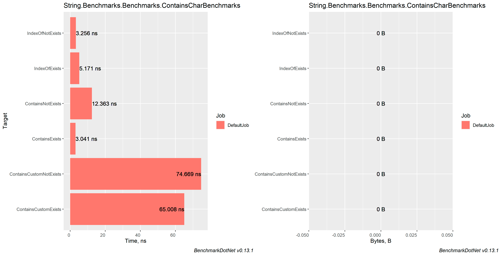
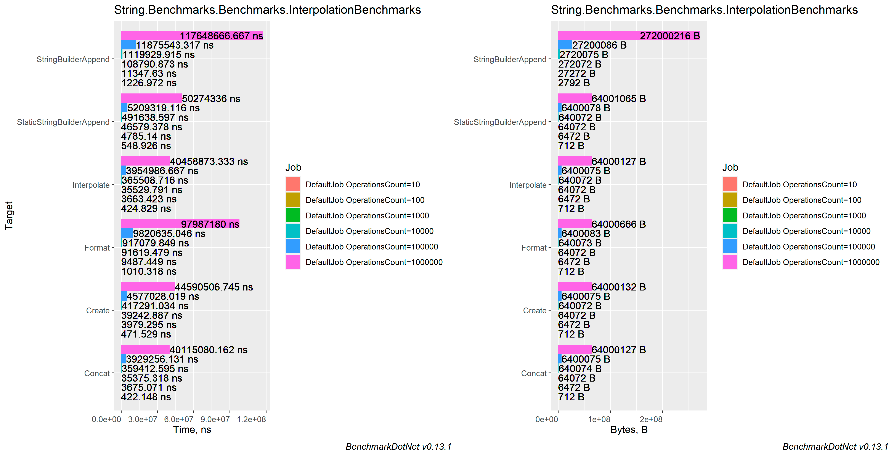
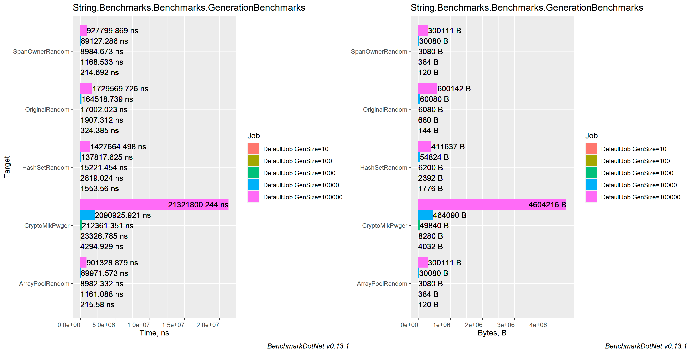
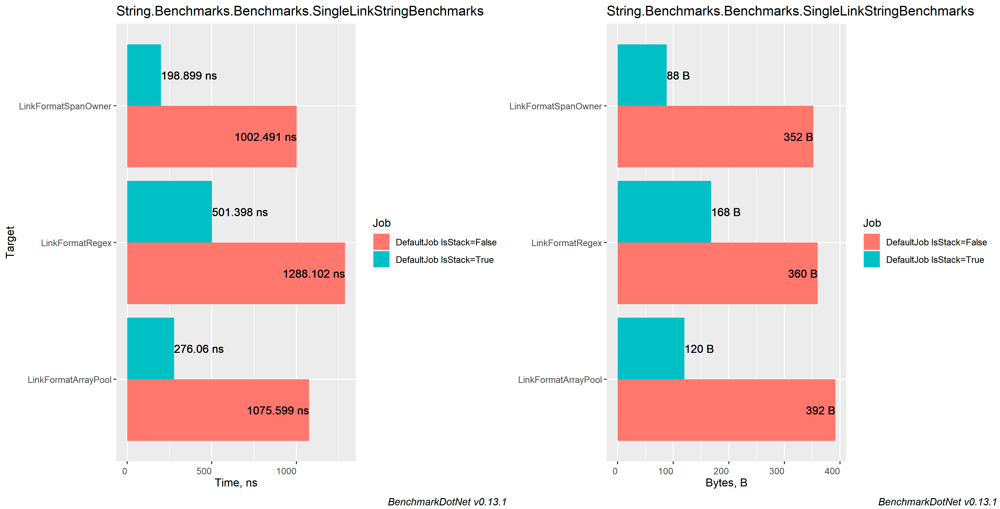
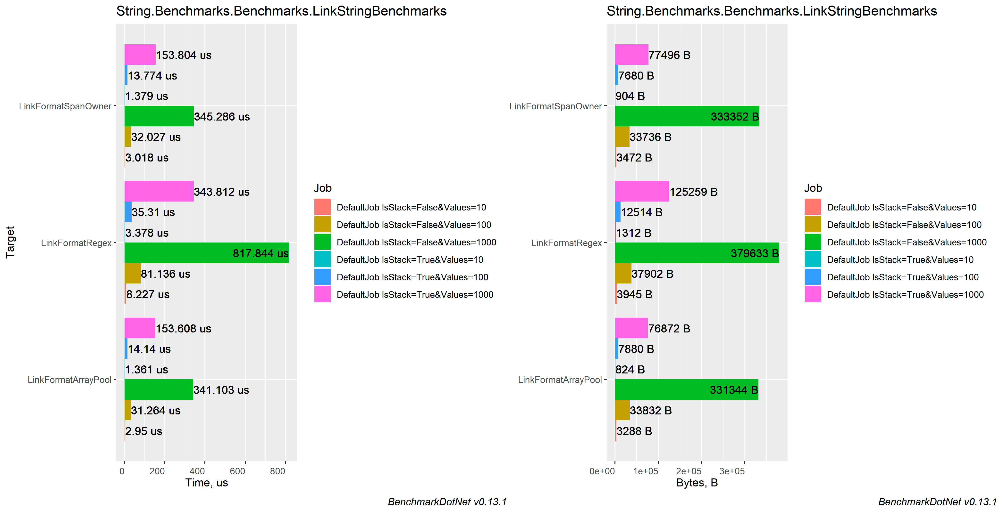
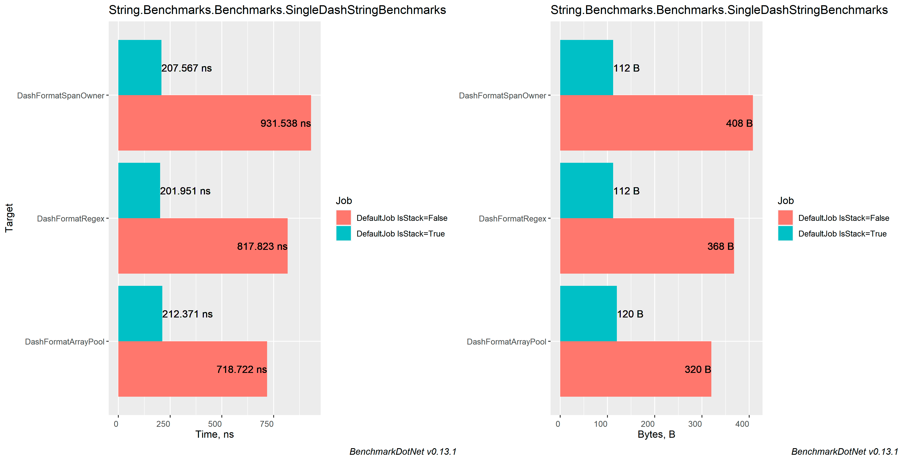
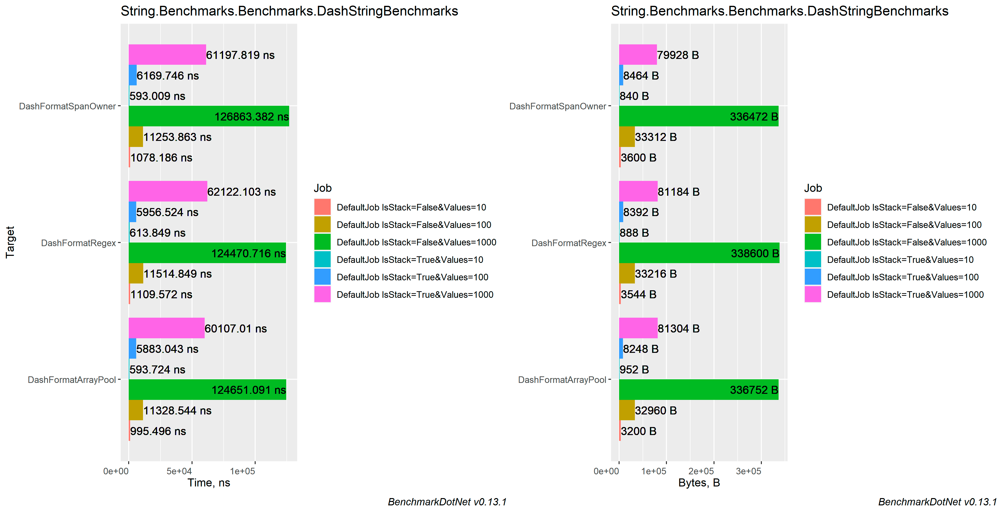

# Comparing string concatenation, different approaches to create link format string, generate unique string and create dash format string.

### Table of contents
- [Machine information](#machine-information)
- [Benchmark results](#benchmark-results)
    * [Contains char benchmarks](#contains-char-benchmarks)
    * [String interpolation](#string-interpolation)
    * [Unique string generation](#unique-string-generation)
    * [Link view benchmarks](#link-view-benchmarks)
      * [Single](#single-link-view-benchmarks)
      * [Multiple](#multiple-link-view-benchmarks)
    * [Dash view benchmarks](#Dash-view-benchmarks)
      * [Single](#single-dash-view-benchmarks)
      * [Multiple](#multiple-dash-view-benchmarks)
- [Conclusions](#conclusions)

<a name="machine-information"></a>
## Machine Information

``` ini
BenchmarkDotNet=v0.13.1, OS=Windows 10.0.22621
Intel Core i7-8550U CPU 1.80GHz (Kaby Lake R), 1 CPU, 8 logical and 4 physical cores
.NET SDK=6.0.202
  [Host]     : .NET 6.0.4 (6.0.422.16404), X64 RyuJIT
  DefaultJob : .NET 6.0.4 (6.0.422.16404), X64 RyuJIT
```

<a name="benchmark-results"></a>
## Benchmark Results

<a name="contains-char-benchmarks"></a>
### Contains char benchmarks

| Method                  |      Mean |     Error |    StdDev |    StdErr |          Op/s | Allocated |
|-------------------------|----------:|----------:|----------:|----------:|--------------:|----------:|
| ContainsExists          |  3.040 ns | 0.0921 ns | 0.0861 ns | 0.0222 ns | 328,934,319.1 |         - |
| IndexOfNotExists        |  3.256 ns | 0.0320 ns | 0.0284 ns | 0.0076 ns | 307,100,772.6 |         - |
| IndexOfExists           |  5.173 ns | 0.0488 ns | 0.0433 ns | 0.0116 ns | 193,317,930.0 |         - |
| ContainsNotExists       | 12.364 ns | 0.0530 ns | 0.0443 ns | 0.0123 ns |  80,879,403.0 |         - |
| ContainsCustomExists    | 65.009 ns | 0.4081 ns | 0.3817 ns | 0.0986 ns |  15,382,412.6 |         - |
| ContainsCustomNotExists | 74.668 ns | 0.5524 ns | 0.5167 ns | 0.1334 ns |  13,392,568.5 |         - |



<a name="string-interpolation"></a>
### String interpolation

| Method                    | OperationsCount |             Mean |           Error |          StdDev |        StdErr |          Op/s |     Allocated |
|---------------------------|-----------------|-----------------:|----------------:|----------------:|--------------:|--------------:|--------------:|
| Concat                    | 10              |         422.1 ns |         4.03 ns |         3.36 ns |       0.93 ns | 2,368,830.449 |         712 B |
| Interpolate               | 10              |         424.8 ns |         4.96 ns |         4.64 ns |       1.20 ns | 2,353,893.053 |         712 B |
| Create                    | 10              |         471.5 ns |         6.53 ns |         6.11 ns |       1.58 ns | 2,120,760.461 |         712 B |
| StaticStringBuilderAppend | 10              |         548.9 ns |         3.60 ns |         3.01 ns |       0.83 ns | 1,821,733.854 |         712 B |
| Format                    | 10              |       1,010.3 ns |        19.26 ns |        17.08 ns |       4.56 ns |   989,788.515 |         712 B |
| StringBuilderAppend       | 10              |       1,227.0 ns |        23.86 ns |        24.50 ns |       5.94 ns |   815,015.040 |       2,792 B |
|                           |                 |                  |                 |                 |               |               |               |
| Interpolate               | 100             |       3,663.4 ns |        39.89 ns |        37.31 ns |       9.63 ns |   272,968.737 |       6,472 B |
| Concat                    | 100             |       3,675.1 ns |        56.23 ns |        49.85 ns |      13.32 ns |   272,103.560 |       6,472 B |
| Create                    | 100             |       3,979.3 ns |        54.94 ns |        51.39 ns |      13.27 ns |   251,300.833 |       6,472 B |
| StaticStringBuilderAppend | 100             |       4,785.1 ns |        93.33 ns |       136.80 ns |      25.40 ns |   208,980.313 |       6,472 B |
| Format                    | 100             |       9,487.4 ns |        86.83 ns |        76.97 ns |      20.57 ns |   105,402.402 |       6,472 B |
| StringBuilderAppend       | 100             |      11,347.6 ns |       212.82 ns |       177.71 ns |      49.29 ns |    88,124.124 |      27,272 B |
|                           |                 |                  |                 |                 |               |               |               |
| Concat                    | 1000            |      35,375.3 ns |       487.58 ns |       456.08 ns |     117.76 ns |    28,268.298 |      64,072 B |
| Interpolate               | 1000            |      35,529.8 ns |       446.96 ns |       373.23 ns |     103.52 ns |    28,145.395 |      64,072 B |
| Create                    | 1000            |      39,242.9 ns |       708.44 ns |       662.68 ns |     171.10 ns |    25,482.324 |      64,072 B |
| StaticStringBuilderAppend | 1000            |      46,579.4 ns |       876.34 ns |       776.85 ns |     207.62 ns |    21,468.728 |      64,072 B |
| Format                    | 1000            |      91,619.5 ns |     1,375.69 ns |     1,286.82 ns |     332.25 ns |    10,914.710 |      64,072 B |
| StringBuilderAppend       | 1000            |     108,790.9 ns |     1,237.21 ns |     1,096.75 ns |     293.12 ns |     9,191.948 |     272,072 B |
|                           |                 |                  |                 |                 |               |               |               |
| Concat                    | 10000           |     359,412.6 ns |     5,934.80 ns |     5,551.42 ns |   1,433.37 ns |     2,782.318 |     640,074 B |
| Interpolate               | 10000           |     365,508.7 ns |     5,566.64 ns |     5,716.53 ns |   1,386.46 ns |     2,735.913 |     640,072 B |
| Create                    | 10000           |     417,291.0 ns |     6,851.25 ns |     6,073.46 ns |   1,623.20 ns |     2,396.409 |     640,072 B |
| StaticStringBuilderAppend | 10000           |     491,638.6 ns |     9,616.23 ns |     9,875.16 ns |   2,395.08 ns |     2,034.014 |     640,072 B |
| Format                    | 10000           |     917,079.8 ns |    12,225.18 ns |    10,837.30 ns |   2,896.39 ns |     1,090.418 |     640,073 B |
| StringBuilderAppend       | 10000           |   1,119,929.9 ns |    11,977.54 ns |    11,203.80 ns |   2,892.81 ns |       892.913 |   2,720,075 B |
|                           |                 |                  |                 |                 |               |               |               |
| Concat                    | 100000          |   3,929,256.1 ns |    40,363.79 ns |    33,705.59 ns |   9,348.25 ns |       254.501 |   6,400,075 B |
| Interpolate               | 100000          |   3,954,986.7 ns |    77,807.72 ns |    72,781.39 ns |  18,792.07 ns |       252.845 |   6,400,075 B |
| Create                    | 100000          |   4,577,028.0 ns |    56,845.14 ns |    47,468.27 ns |  13,165.33 ns |       218.482 |   6,400,075 B |
| StaticStringBuilderAppend | 100000          |   5,209,319.1 ns |    61,160.17 ns |    57,209.26 ns |  14,771.37 ns |       191.964 |   6,400,078 B |
| Format                    | 100000          |   9,820,635.0 ns |    89,488.95 ns |    79,329.62 ns |  21,201.73 ns |       101.826 |   6,400,083 B |
| StringBuilderAppend       | 100000          |  11,875,543.3 ns |   230,989.22 ns |   247,155.88 ns |  58,255.20 ns |        84.207 |  27,200,086 B |
|                           |                 |                  |                 |                 |               |               |               |
| Concat                    | 1000000         |  40,115,080.2 ns |   797,324.28 ns |   886,223.82 ns | 203,313.69 ns |        24.928 |  64,000,127 B |
| Interpolate               | 1000000         |  40,458,873.3 ns |   724,214.71 ns |   677,430.89 ns | 174,911.90 ns |        24.716 |  64,000,127 B |
| Create                    | 1000000         |  44,590,506.7 ns |   884,393.82 ns | 1,052,807.93 ns | 229,741.53 ns |        22.426 |  64,000,132 B |
| StaticStringBuilderAppend | 1000000         |  50,274,336.0 ns |   583,465.98 ns |   545,774.44 ns | 140,918.36 ns |        19.891 |  64,001,065 B |
| Format                    | 1000000         |  97,987,180.0 ns | 1,937,655.74 ns | 1,812,484.38 ns | 467,981.45 ns |        10.205 |  64,000,666 B |
| StringBuilderAppend       | 1000000         | 117,648,666.7 ns | 2,212,364.81 ns | 2,069,447.41 ns | 534,329.02 ns |         8.500 | 272,000,216 B |



<a name="unique-string-generation"></a>
### Unique string generation

| Method          | GenSize |            Mean |         Error |        StdDev |       StdErr |         Op/s |   Allocated |
|-----------------|---------|----------------:|--------------:|--------------:|-------------:|-------------:|------------:|
| SpanOwnerRandom | 10      |        214.7 ns |       1.57 ns |       1.47 ns |      0.38 ns | 4,657,820.69 |       120 B |
| ArrayPoolRandom | 10      |        215.6 ns |       2.28 ns |       2.02 ns |      0.54 ns | 4,638,647.72 |       120 B |
| OriginalRandom  | 10      |        324.4 ns |       2.79 ns |       2.61 ns |      0.67 ns | 3,082,752.27 |       144 B |
| HashSetRandom   | 10      |      1,553.6 ns |      12.64 ns |      11.82 ns |      3.05 ns |   643,682.70 |     1,776 B |
| CryptoMlkPwger  | 10      |      4,294.9 ns |      55.31 ns |      51.74 ns |     13.36 ns |   232,832.70 |     4,032 B |
|                 |         |                 |               |               |              |              |             |
| ArrayPoolRandom | 100     |      1,161.1 ns |      13.87 ns |      11.58 ns |      3.21 ns |   861,260.35 |       384 B |
| SpanOwnerRandom | 100     |      1,168.5 ns |      21.32 ns |      19.94 ns |      5.15 ns |   855,773.10 |       384 B |
| OriginalRandom  | 100     |      1,907.3 ns |       8.42 ns |       7.46 ns |      1.99 ns |   524,298.01 |       680 B |
| HashSetRandom   | 100     |      2,819.0 ns |      22.32 ns |      18.64 ns |      5.17 ns |   354,732.74 |     2,392 B |
| CryptoMlkPwger  | 100     |     23,326.8 ns |     199.60 ns |     166.68 ns |     46.23 ns |    42,869.18 |     8,280 B |
|                 |         |                 |               |               |              |              |             |
| ArrayPoolRandom | 1000    |      8,982.3 ns |     178.30 ns |     166.78 ns |     43.06 ns |   111,329.66 |     3,080 B |
| SpanOwnerRandom | 1000    |      8,984.7 ns |     171.89 ns |     160.79 ns |     41.52 ns |   111,300.66 |     3,080 B |
| HashSetRandom   | 1000    |     15,221.5 ns |      99.69 ns |      88.37 ns |     23.62 ns |    65,696.75 |     6,200 B |
| OriginalRandom  | 1000    |     17,002.0 ns |     243.98 ns |     216.28 ns |     57.80 ns |    58,816.53 |     6,080 B |
| CryptoMlkPwger  | 1000    |    212,361.4 ns |   1,459.36 ns |   1,365.09 ns |    352.46 ns |     4,708.95 |    49,840 B |
|                 |         |                 |               |               |              |              |             |
| SpanOwnerRandom | 10000   |     89,127.3 ns |     988.91 ns |     876.65 ns |    234.29 ns |    11,219.91 |    30,080 B |
| ArrayPoolRandom | 10000   |     89,971.6 ns |   1,077.80 ns |   1,008.18 ns |    260.31 ns |    11,114.62 |    30,080 B |
| HashSetRandom   | 10000   |    137,817.6 ns |   1,990.36 ns |   1,861.79 ns |    480.71 ns |     7,255.97 |    54,824 B |
| OriginalRandom  | 10000   |    164,518.7 ns |   1,361.49 ns |   1,206.92 ns |    322.56 ns |     6,078.33 |    60,080 B |
| CryptoMlkPwger  | 10000   |  2,090,925.9 ns |  18,962.25 ns |  16,809.54 ns |  4,492.54 ns |       478.26 |   464,090 B |
|                 |         |                 |               |               |              |              |             |
| ArrayPoolRandom | 100000  |    901,328.9 ns |  14,897.52 ns |  13,935.15 ns |  3,598.04 ns |     1,109.47 |   300,111 B |
| SpanOwnerRandom | 100000  |    927,799.9 ns |  18,530.20 ns |  17,333.16 ns |  4,475.40 ns |     1,077.82 |   300,111 B |
| HashSetRandom   | 100000  |  1,427,664.5 ns |  15,270.70 ns |  12,751.73 ns |  3,536.69 ns |       700.44 |   411,637 B |
| OriginalRandom  | 100000  |  1,729,569.7 ns |  20,820.03 ns |  19,475.07 ns |  5,028.44 ns |       578.18 |   600,142 B |
| CryptoMlkPwger  | 100000  | 21,321,800.2 ns | 141,297.19 ns | 117,989.55 ns | 32,724.41 ns |        46.90 | 4,604,216 B |



<a name="link-view-benchmarks"></a>
## Link view benchmarks

<a name="single-link-view-benchmarks"></a>
### Single

| Method              | IsStack |       Mean |    Error |   StdDev |  StdErr |        Min |         Q1 |     Median |         Q3 |        Max |        Op/s |  Gen 0 | Allocated |
|---------------------|---------|-----------:|---------:|---------:|--------:|-----------:|-----------:|-----------:|-----------:|-----------:|------------:|-------:|----------:|
| LinkFormatSpanOwner | False   | 1,002.5 ns |  9.92 ns |  9.28 ns | 2.40 ns |   987.7 ns |   997.4 ns | 1,002.6 ns | 1,007.3 ns | 1,019.3 ns |   997,515.5 | 0.0839 |     352 B |
| LinkFormatArrayPool | False   | 1,075.6 ns | 18.15 ns | 16.98 ns | 4.38 ns | 1,050.5 ns | 1,063.7 ns | 1,073.9 ns | 1,084.3 ns | 1,109.8 ns |   929,713.7 | 0.0935 |     392 B |
| LinkFormatRegex     | False   | 1,288.1 ns |  8.09 ns |  6.75 ns | 1.87 ns | 1,277.0 ns | 1,283.7 ns | 1,288.2 ns | 1,293.1 ns | 1,298.8 ns |   776,336.3 | 0.0858 |     360 B |
|                     |         |            |          |          |         |            |            |            |            |            |             |        |           |
| LinkFormatSpanOwner | True    |   198.9 ns |  1.72 ns |  1.44 ns | 0.40 ns |   196.8 ns |   197.9 ns |   198.6 ns |   200.3 ns |   200.9 ns | 5,027,673.1 | 0.0210 |      88 B |
| LinkFormatArrayPool | True    |   276.1 ns |  2.58 ns |  2.29 ns | 0.61 ns |   273.1 ns |   274.0 ns |   276.0 ns |   277.7 ns |   279.6 ns | 3,622,394.7 | 0.0286 |     120 B |
| LinkFormatRegex     | True    |   501.4 ns |  9.97 ns |  9.32 ns | 2.41 ns |   491.6 ns |   494.3 ns |   496.1 ns |   508.3 ns |   522.6 ns | 1,994,424.2 | 0.0401 |     168 B |



<a name="multiple-link-view-benchmarks"></a>
### Multiple

| Method              | IsStack | Values |       Mean |     Error |    StdDev |    StdErr |      Op/s | Allocated |
|---------------------|---------|--------|-----------:|----------:|----------:|----------:|----------:|----------:|
| LinkFormatArrayPool | False   | 10     |   2.950 μs | 0.0526 μs | 0.0563 μs | 0.0133 μs | 338,934.5 |   3,288 B |
| LinkFormatSpanOwner | False   | 10     |   3.018 μs | 0.0347 μs | 0.0325 μs | 0.0084 μs | 331,394.0 |   3,472 B |
| LinkFormatRegex     | False   | 10     |   8.227 μs | 0.1039 μs | 0.0972 μs | 0.0251 μs | 121,548.3 |   3,945 B |
|                     |         |        |            |           |           |           |           |           |
| LinkFormatArrayPool | False   | 100    |  31.264 μs | 0.2994 μs | 0.2654 μs | 0.0709 μs |  31,986.1 |  33,832 B |
| LinkFormatSpanOwner | False   | 100    |  32.027 μs | 0.3837 μs | 0.3589 μs | 0.0927 μs |  31,223.9 |  33,736 B |
| LinkFormatRegex     | False   | 100    |  81.136 μs | 1.1671 μs | 1.0917 μs | 0.2819 μs |  12,324.9 |  37,902 B |
|                     |         |        |            |           |           |           |           |           |
| LinkFormatArrayPool | False   | 1000   | 341.103 μs | 6.7769 μs | 6.3391 μs | 1.6367 μs |   2,931.7 | 331,344 B |
| LinkFormatSpanOwner | False   | 1000   | 345.286 μs | 2.9869 μs | 2.6479 μs | 0.7077 μs |   2,896.1 | 333,352 B |
| LinkFormatRegex     | False   | 1000   | 817.844 μs | 7.8251 μs | 7.3196 μs | 1.8899 μs |   1,222.7 | 379,633 B |
|                     |         |        |            |           |           |           |           |           |
| LinkFormatArrayPool | True    | 10     |   1.361 μs | 0.0136 μs | 0.0127 μs | 0.0033 μs | 734,542.8 |     824 B |
| LinkFormatSpanOwner | True    | 10     |   1.379 μs | 0.0141 μs | 0.0132 μs | 0.0034 μs | 725,009.2 |     904 B |
| LinkFormatRegex     | True    | 10     |   3.378 μs | 0.0213 μs | 0.0189 μs | 0.0050 μs | 296,046.8 |   1,312 B |
|                     |         |        |            |           |           |           |           |           |
| LinkFormatSpanOwner | True    | 100    |  13.774 μs | 0.0314 μs | 0.0245 μs | 0.0071 μs |  72,601.2 |   7,680 B |
| LinkFormatArrayPool | True    | 100    |  14.140 μs | 0.1608 μs | 0.1504 μs | 0.0388 μs |  70,720.1 |   7,880 B |
| LinkFormatRegex     | True    | 100    |  35.310 μs | 0.4881 μs | 0.4566 μs | 0.1179 μs |  28,321.0 |  12,514 B |
|                     |         |        |            |           |           |           |           |           |
| LinkFormatArrayPool | True    | 1000   | 153.608 μs | 1.3549 μs | 1.2011 μs | 0.3210 μs |   6,510.1 |  76,872 B |
| LinkFormatSpanOwner | True    | 1000   | 153.804 μs | 2.4173 μs | 2.2611 μs | 0.5838 μs |   6,501.8 |  77,496 B |
| LinkFormatRegex     | True    | 1000   | 343.812 μs | 4.3309 μs | 3.8393 μs | 1.0261 μs |   2,908.6 | 125,259 B |



<a name="dash-view-benchmarks"></a>
## Dash view benchmarks

<a name="single-dash-view-benchmarks"></a>
### Single

| Method              | IsStack |     Mean |    Error |   StdDev |  StdErr |      Min |       Q1 |   Median |       Q3 |      Max |        Op/s |  Gen 0 | Allocated |
|---------------------|---------|---------:|---------:|---------:|--------:|---------:|---------:|---------:|---------:|---------:|------------:|-------:|----------:|
| DashFormatArrayPool | False   | 718.7 ns |  4.88 ns |  4.07 ns | 1.13 ns | 709.5 ns | 717.6 ns | 719.5 ns | 721.0 ns | 724.1 ns | 1,391,359.2 | 0.0763 |     320 B |
| DashFormatRegex     | False   | 817.8 ns |  7.79 ns |  7.28 ns | 1.88 ns | 805.0 ns | 812.6 ns | 817.5 ns | 823.0 ns | 830.0 ns | 1,222,761.4 | 0.0877 |     368 B |
| DashFormatSpanOwner | False   | 931.5 ns | 15.68 ns | 14.67 ns | 3.79 ns | 911.2 ns | 917.3 ns | 935.3 ns | 942.0 ns | 953.4 ns | 1,073,493.0 | 0.0973 |     408 B |
|                     |         |          |          |          |         |          |          |          |          |          |             |        |           |
| DashFormatRegex     | True    | 202.0 ns |  2.04 ns |  1.91 ns | 0.49 ns | 198.2 ns | 200.7 ns | 202.4 ns | 202.8 ns | 205.1 ns | 4,951,692.3 | 0.0267 |     112 B |
| DashFormatSpanOwner | True    | 207.6 ns |  3.63 ns |  6.45 ns | 1.02 ns | 199.6 ns | 204.7 ns | 205.9 ns | 208.6 ns | 224.4 ns | 4,817,706.3 | 0.0267 |     112 B |
| DashFormatArrayPool | True    | 212.4 ns |  1.65 ns |  1.47 ns | 0.39 ns | 209.7 ns | 211.4 ns | 212.3 ns | 213.0 ns | 215.9 ns | 4,708,774.0 | 0.0286 |     120 B |



<a name="multiple-dash-view-benchmarks"></a>
### Multiple

| Method              | IsStack | Values |         Mean |       Error |      StdDev |    StdErr |        Op/s | Allocated |
|---------------------|---------|--------|-------------:|------------:|------------:|----------:|------------:|----------:|
| DashFormatArrayPool | False   | 10     |     995.5 ns |    17.27 ns |    16.16 ns |   4.17 ns | 1,004,523.3 |   3,200 B |
| DashFormatSpanOwner | False   | 10     |   1,078.2 ns |    21.13 ns |    20.76 ns |   5.19 ns |   927,485.4 |   3,600 B |
| DashFormatRegex     | False   | 10     |   1,109.6 ns |    22.23 ns |    29.68 ns |   5.94 ns |   901,248.7 |   3,544 B |
|                     |         |        |              |             |             |           |             |           |
| DashFormatSpanOwner | False   | 100    |  11,253.9 ns |   214.61 ns |   200.74 ns |  51.83 ns |    88,858.4 |  33,312 B |
| DashFormatArrayPool | False   | 100    |  11,328.5 ns |   220.93 ns |   226.88 ns |  55.03 ns |    88,272.6 |  32,960 B |
| DashFormatRegex     | False   | 100    |  11,514.8 ns |   216.56 ns |   202.57 ns |  52.30 ns |    86,844.4 |  33,216 B |
|                     |         |        |              |             |             |           |             |           |
| DashFormatRegex     | False   | 1000   | 124,470.7 ns | 2,324.67 ns | 2,060.76 ns | 550.76 ns |     8,034.0 | 338,600 B |
| DashFormatArrayPool | False   | 1000   | 124,651.1 ns | 2,378.08 ns | 2,224.46 ns | 574.35 ns |     8,022.4 | 336,752 B |
| DashFormatSpanOwner | False   | 1000   | 126,863.4 ns | 2,365.93 ns | 2,213.09 ns | 571.42 ns |     7,882.5 | 336,472 B |
|                     |         |        |              |             |             |           |             |           |
| DashFormatSpanOwner | True    | 10     |     593.0 ns |    11.32 ns |    11.12 ns |   2.78 ns | 1,686,313.1 |     840 B |
| DashFormatArrayPool | True    | 10     |     593.7 ns |    11.47 ns |    12.75 ns |   2.92 ns | 1,684,285.0 |     952 B |
| DashFormatRegex     | True    | 10     |     613.8 ns |    10.00 ns |     8.86 ns |   2.37 ns | 1,629,069.1 |     888 B |
|                     |         |        |              |             |             |           |             |           |
| DashFormatArrayPool | True    | 100    |   5,883.0 ns |    73.57 ns |    68.82 ns |  17.77 ns |   169,980.0 |   8,248 B |
| DashFormatRegex     | True    | 100    |   5,956.5 ns |    87.39 ns |    81.74 ns |  21.11 ns |   167,883.2 |   8,392 B |
| DashFormatSpanOwner | True    | 100    |   6,169.7 ns |   112.87 ns |   165.45 ns |  30.72 ns |   162,081.2 |   8,464 B |
|                     |         |        |              |             |             |           |             |           |
| DashFormatArrayPool | True    | 1000   |  60,107.0 ns |   642.50 ns |   601.00 ns | 155.18 ns |    16,637.0 |  81,304 B |
| DashFormatSpanOwner | True    | 1000   |  61,197.8 ns |   672.21 ns |   628.79 ns | 162.35 ns |    16,340.5 |  79,928 B |
| DashFormatRegex     | True    | 1000   |  62,122.1 ns |   622.53 ns |   582.31 ns | 150.35 ns |    16,097.3 |  81,184 B |



<a name="conclusions"></a>
## Conclusions

For checking whether char is in string, use `IndexOf` method. For generating unique string - `ArrayPoolRandom`.
For dashing - `DashFormatArrayPool` and link creating either `LinkFormatArrayPool` or `LinkFormatSpanOwner`.