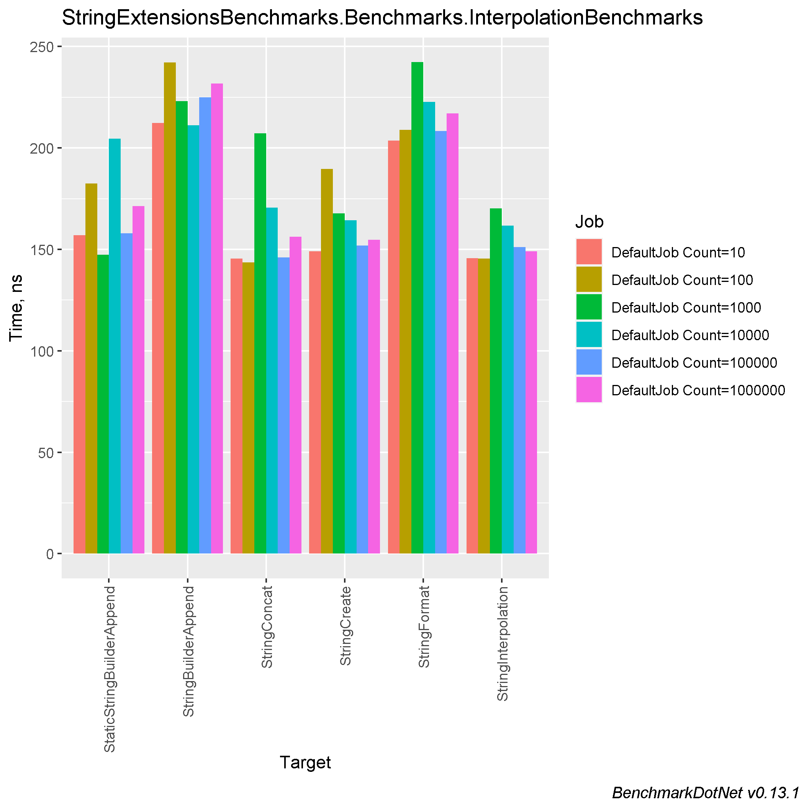
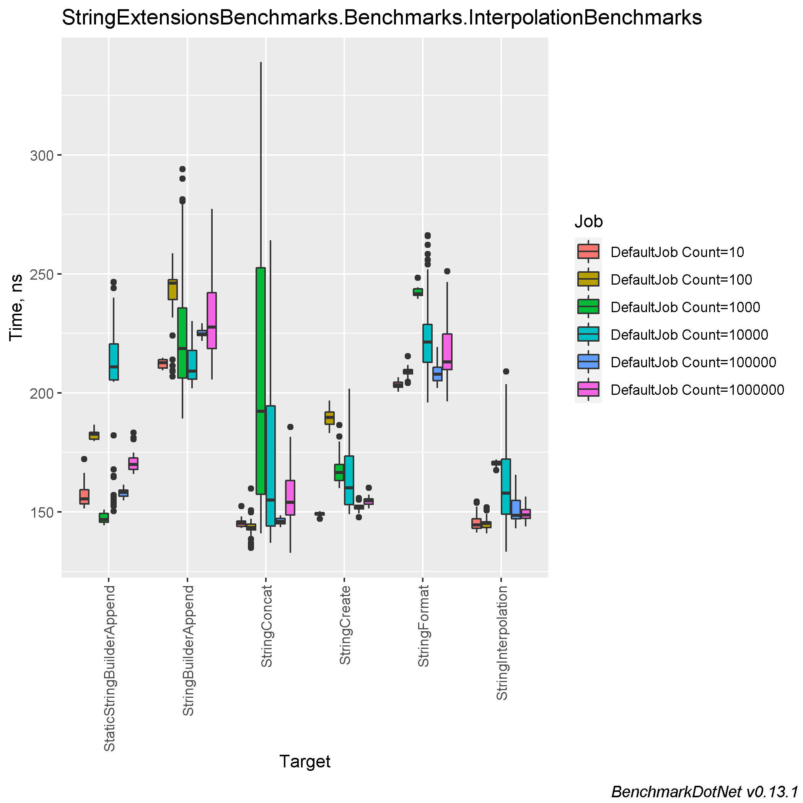
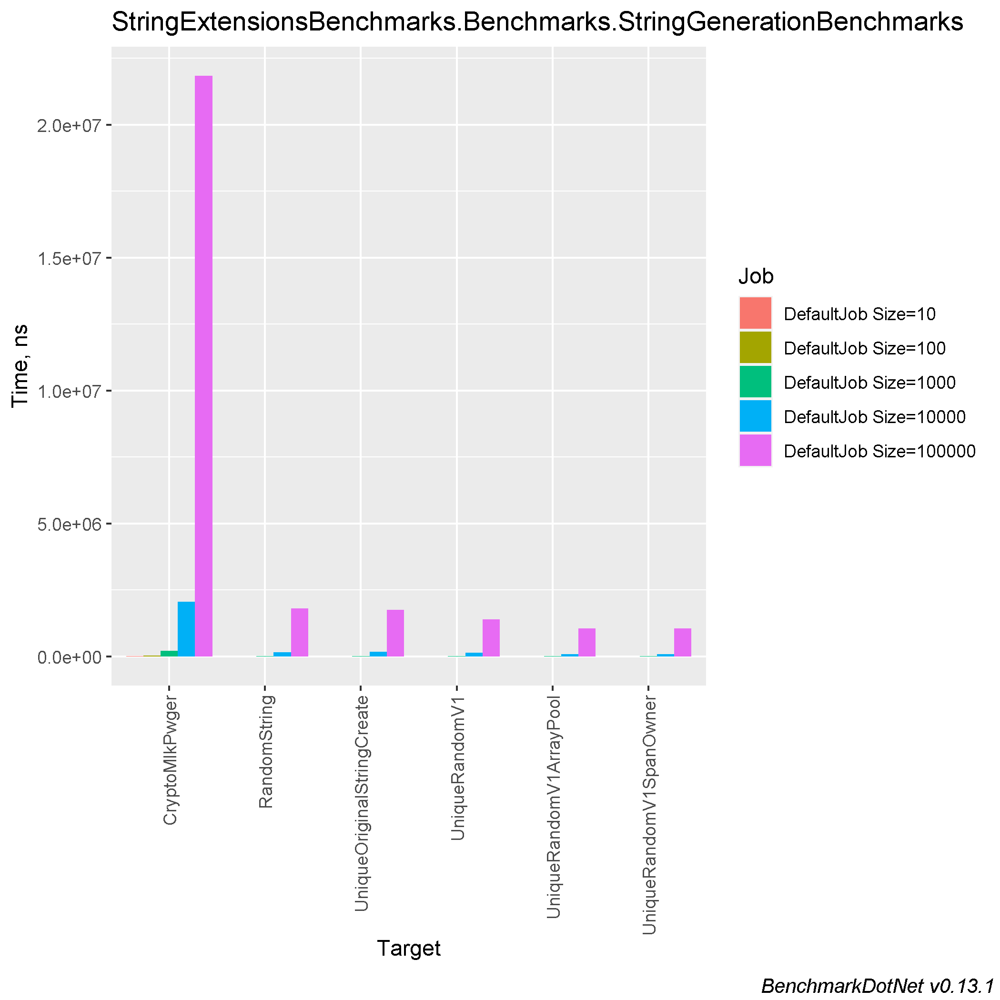
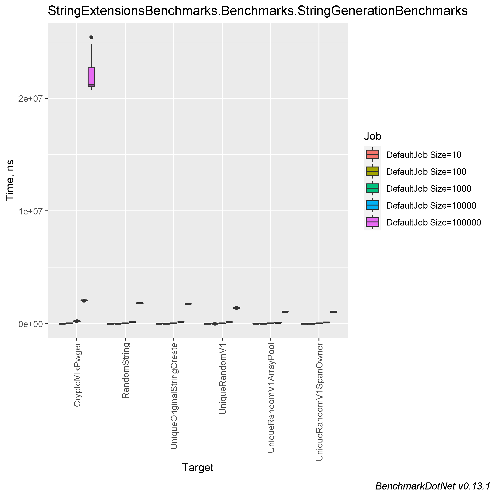
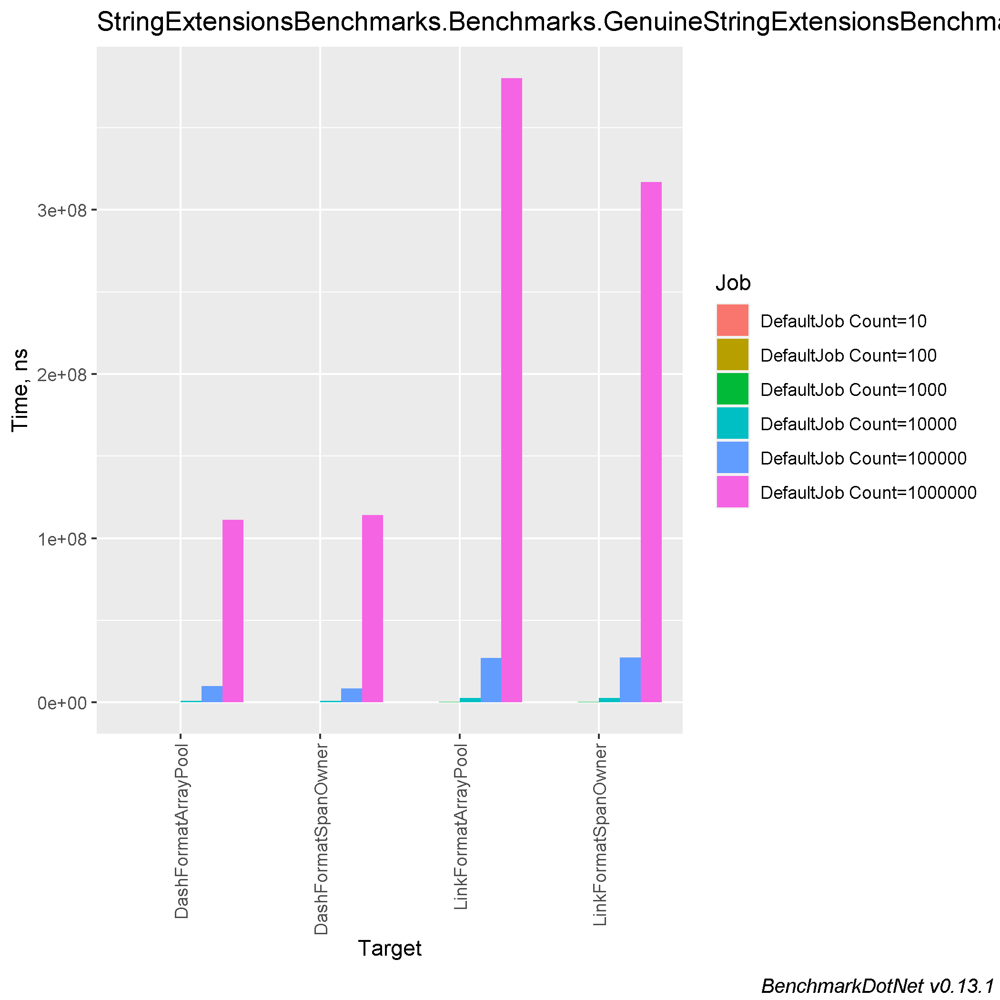
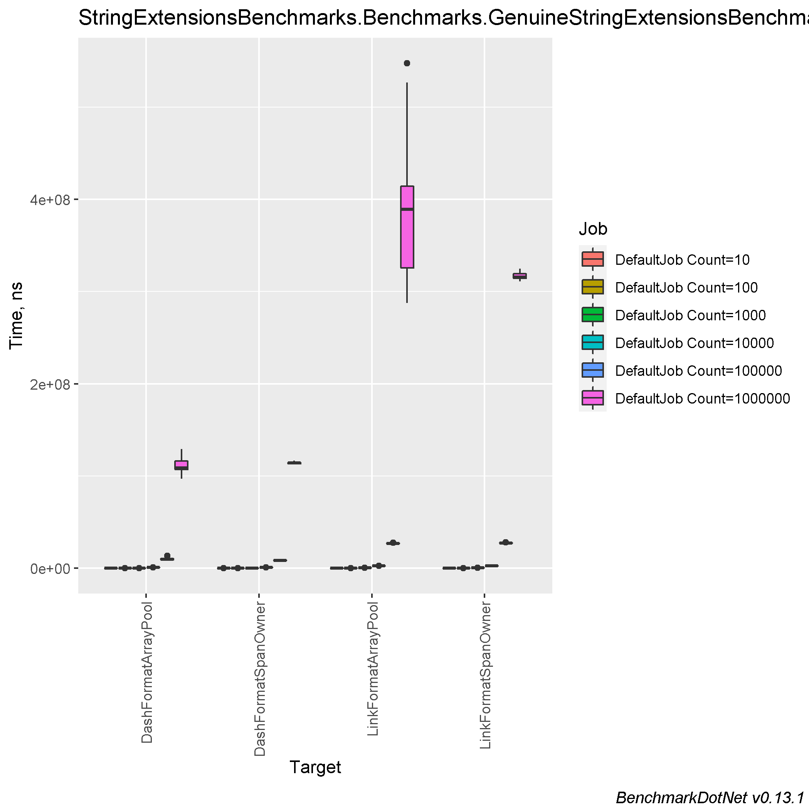
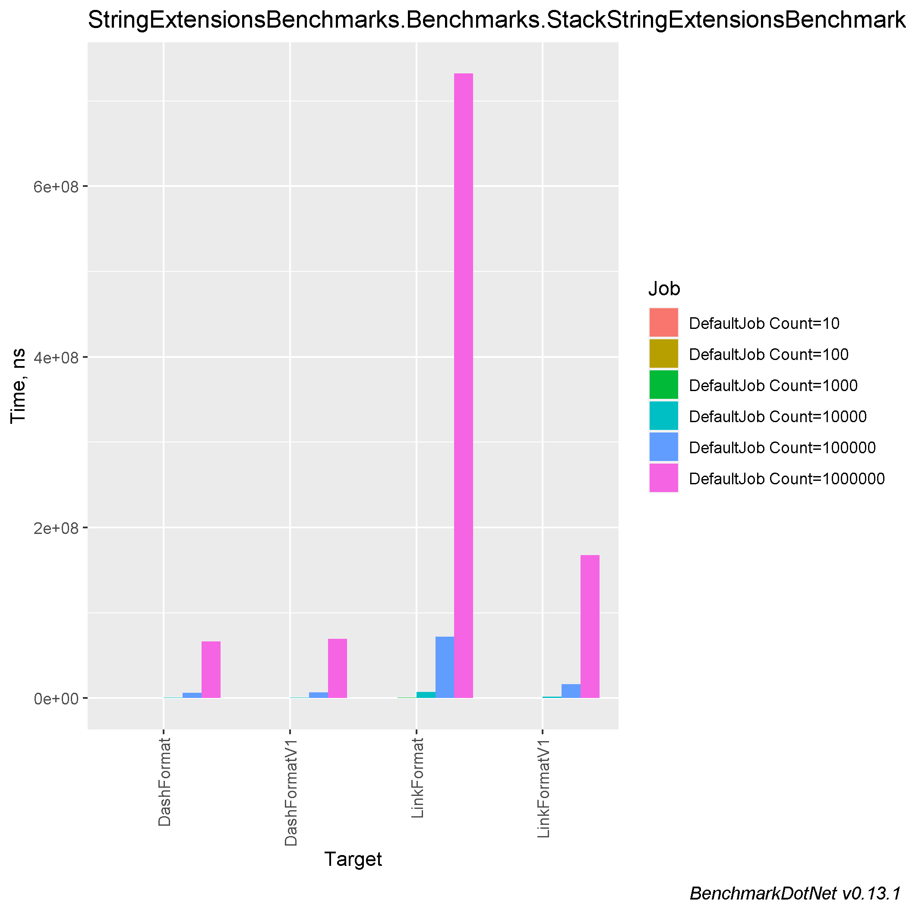
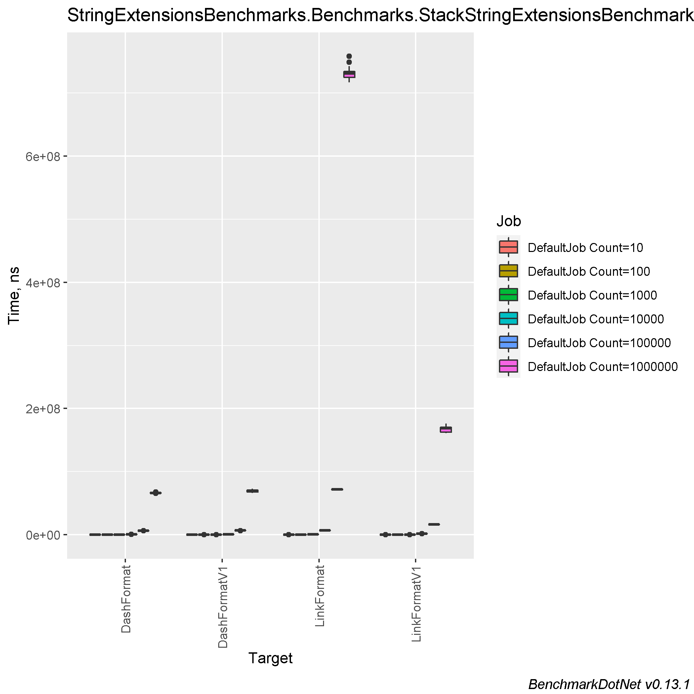

# Comparing string concatenation, different approaches to create link format string, generate unique string and create dash format string.

### Table of contents
- [Machine information](#machine-information)
- [Benchmark results](#benchmark-results)
    * [String interpolation](#string-interpolation)
    * [Unique string generation](#unique-string-generation)
    * [Link/Dash view benchmarks](#linkdash-view-benchmarks)
      * [Original string benchmarks](#original-string-benchmarks)
      * [Stack string benchmarks](#stack-string-benchmarks)
- [Conclusions](#conclusions)

<a name="machine-information"></a>
## Machine Information

``` ini
BenchmarkDotNet=v0.13.1, OS=Windows 10.0.22621
Intel Core i7-8550U CPU 1.80GHz (Kaby Lake R), 1 CPU, 8 logical and 4 physical cores
.NET SDK=6.0.202
  [Host]     : .NET 6.0.4 (6.0.422.16404), X64 RyuJIT
  DefaultJob : .NET 6.0.4 (6.0.422.16404), X64 RyuJIT
```

<a name="benchmark-results"></a>
## Benchmark Results

<a name="string-interpolation"></a>
### String interpolation

| Method                    | Count   |     Mean |    Error |   StdDev |  StdErr |   Median |      Min |       Q1 |       Q3 |      Max |        Op/s | Ratio | RatioSD |  Gen 0 | Allocated |
|---------------------------|---------|---------:|---------:|---------:|--------:|---------:|---------:|---------:|---------:|---------:|------------:|------:|--------:|-------:|----------:|
| StringConcat              | 10      | 145.5 ns |  2.17 ns |  2.23 ns | 0.54 ns | 145.2 ns | 143.2 ns | 143.9 ns | 146.1 ns | 152.3 ns | 6,870,616.7 |  1.00 |    0.03 | 0.0229 |      96 B |
| StringInterpolation       | 10      | 145.7 ns |  2.66 ns |  3.65 ns | 0.72 ns | 144.6 ns | 141.4 ns | 143.1 ns | 147.2 ns | 154.3 ns | 6,861,981.8 |  1.00 |    0.00 | 0.0229 |      96 B |
| StringCreate              | 10      | 149.0 ns |  1.22 ns |  1.02 ns | 0.28 ns | 149.3 ns | 147.1 ns | 148.7 ns | 149.7 ns | 150.4 ns | 6,711,064.4 |  1.02 |    0.03 | 0.0229 |      96 B |
| StaticStringBuilderAppend | 10      | 157.0 ns |  3.10 ns |  4.91 ns | 0.86 ns | 155.4 ns | 151.5 ns | 153.4 ns | 159.4 ns | 172.2 ns | 6,369,273.9 |  1.08 |    0.04 | 0.0229 |      96 B |
| StringFormat              | 10      | 203.7 ns |  2.21 ns |  1.85 ns | 0.51 ns | 203.4 ns | 200.5 ns | 202.4 ns | 204.5 ns | 206.6 ns | 4,909,932.1 |  1.39 |    0.04 | 0.0229 |      96 B |
| StringBuilderAppend       | 10      | 212.2 ns |  2.31 ns |  1.93 ns | 0.54 ns | 212.7 ns | 209.4 ns | 210.4 ns | 213.9 ns | 214.8 ns | 4,712,065.9 |  1.45 |    0.04 | 0.0725 |     304 B |
|                           |         |          |          |          |         |          |          |          |          |          |             |       |         |        |           |
| StringConcat              | 100     | 143.6 ns |  2.33 ns |  4.20 ns | 0.66 ns | 143.4 ns | 134.9 ns | 142.5 ns | 144.8 ns | 159.8 ns | 6,963,926.5 |  0.99 |    0.04 | 0.0229 |      96 B |
| StringInterpolation       | 100     | 145.4 ns |  2.56 ns |  3.05 ns | 0.67 ns | 145.1 ns | 141.0 ns | 143.5 ns | 145.8 ns | 151.9 ns | 6,875,245.2 |  1.00 |    0.00 | 0.0229 |      96 B |
| StaticStringBuilderAppend | 100     | 182.4 ns |  2.49 ns |  2.21 ns | 0.59 ns | 182.6 ns | 179.7 ns | 180.5 ns | 183.4 ns | 186.6 ns | 5,481,642.6 |  1.25 |    0.03 | 0.0229 |      96 B |
| StringCreate              | 100     | 189.6 ns |  3.69 ns |  4.10 ns | 0.94 ns | 189.7 ns | 183.0 ns | 186.8 ns | 192.0 ns | 196.7 ns | 5,275,444.9 |  1.30 |    0.03 | 0.0229 |      96 B |
| StringFormat              | 100     | 208.8 ns |  3.26 ns |  2.89 ns | 0.77 ns | 208.9 ns | 204.2 ns | 207.9 ns | 209.8 ns | 215.3 ns | 4,788,922.5 |  1.44 |    0.04 | 0.0229 |      96 B |
| StringBuilderAppend       | 100     | 242.1 ns |  4.81 ns | 11.25 ns | 1.39 ns | 246.0 ns | 206.9 ns | 239.1 ns | 247.5 ns | 258.6 ns | 4,130,033.1 |  1.59 |    0.10 | 0.0725 |     304 B |
|                           |         |          |          |          |         |          |          |          |          |          |             |       |         |        |           |
| StaticStringBuilderAppend | 1000    | 147.4 ns |  2.96 ns |  2.31 ns | 0.67 ns | 146.8 ns | 144.4 ns | 145.7 ns | 149.4 ns | 151.0 ns | 6,784,156.8 |  0.87 |    0.01 | 0.0229 |      96 B |
| StringCreate              | 1000    | 167.7 ns |  3.36 ns |  6.22 ns | 0.95 ns | 166.6 ns | 160.0 ns | 163.2 ns | 169.8 ns | 186.5 ns | 5,962,864.5 |  1.01 |    0.03 | 0.0229 |      96 B |
| StringInterpolation       | 1000    | 170.1 ns |  1.50 ns |  1.33 ns | 0.35 ns | 170.3 ns | 167.5 ns | 169.8 ns | 171.2 ns | 172.1 ns | 5,877,920.0 |  1.00 |    0.00 | 0.0229 |      96 B |
| StringConcat              | 1000    | 207.2 ns | 19.82 ns | 58.45 ns | 5.85 ns | 192.3 ns | 141.1 ns | 157.4 ns | 252.4 ns | 338.9 ns | 4,825,591.1 |  1.22 |    0.12 | 0.0229 |      96 B |
| StringBuilderAppend       | 1000    | 223.0 ns |  8.34 ns | 22.98 ns | 2.45 ns | 218.6 ns | 189.1 ns | 206.3 ns | 235.7 ns | 294.0 ns | 4,484,335.8 |  1.38 |    0.05 | 0.0725 |     304 B |
| StringFormat              | 1000    | 242.3 ns |  2.88 ns |  2.41 ns | 0.67 ns | 241.6 ns | 239.6 ns | 241.0 ns | 243.8 ns | 248.4 ns | 4,127,501.1 |  1.42 |    0.02 | 0.0229 |      96 B |
|                           |         |          |          |          |         |          |          |          |          |          |             |       |         |        |           |
| StringInterpolation       | 10000   | 161.7 ns |  6.16 ns | 17.69 ns | 1.81 ns | 157.9 ns | 133.2 ns | 149.1 ns | 172.1 ns | 209.0 ns | 6,183,356.5 |  1.00 |    0.00 | 0.0229 |      96 B |
| StringCreate              | 10000   | 164.4 ns |  4.73 ns | 13.72 ns | 1.39 ns | 160.1 ns | 149.0 ns | 153.0 ns | 173.4 ns | 201.8 ns | 6,084,403.2 |  1.03 |    0.13 | 0.0229 |      96 B |
| StringConcat              | 10000   | 170.6 ns | 11.40 ns | 33.44 ns | 3.36 ns | 154.9 ns | 137.0 ns | 144.1 ns | 194.5 ns | 264.0 ns | 5,860,079.0 |  1.06 |    0.25 | 0.0229 |      96 B |
| StaticStringBuilderAppend | 10000   | 204.6 ns |  9.21 ns | 26.14 ns | 2.71 ns | 210.8 ns | 150.4 ns | 205.4 ns | 220.5 ns | 246.6 ns | 4,886,865.3 |  1.28 |    0.21 | 0.0229 |      96 B |
| StringBuilderAppend       | 10000   | 211.2 ns |  4.19 ns |  7.56 ns | 1.18 ns | 209.1 ns | 201.8 ns | 205.8 ns | 217.8 ns | 230.1 ns | 4,735,582.2 |  1.28 |    0.15 | 0.0725 |     304 B |
| StringFormat              | 10000   | 222.7 ns |  5.85 ns | 16.31 ns | 1.72 ns | 221.3 ns | 196.0 ns | 212.8 ns | 228.7 ns | 266.1 ns | 4,489,621.5 |  1.38 |    0.15 | 0.0229 |      96 B |
|                           |         |          |          |          |         |          |          |          |          |          |             |       |         |        |           |
| StringConcat              | 100000  | 146.1 ns |  1.74 ns |  1.55 ns | 0.41 ns | 146.0 ns | 143.6 ns | 145.1 ns | 147.3 ns | 148.6 ns | 6,843,523.3 |  0.94 |    0.05 | 0.0229 |      96 B |
| StringInterpolation       | 100000  | 151.1 ns |  3.04 ns |  5.72 ns | 0.86 ns | 148.6 ns | 143.2 ns | 147.1 ns | 154.8 ns | 165.7 ns | 6,616,735.0 |  1.00 |    0.00 | 0.0229 |      96 B |
| StringCreate              | 100000  | 151.9 ns |  2.55 ns |  2.13 ns | 0.59 ns | 151.9 ns | 147.8 ns | 151.2 ns | 152.7 ns | 155.9 ns | 6,585,338.0 |  0.98 |    0.05 | 0.0229 |      96 B |
| StaticStringBuilderAppend | 100000  | 158.0 ns |  2.32 ns |  1.94 ns | 0.54 ns | 158.1 ns | 154.7 ns | 156.6 ns | 159.1 ns | 161.5 ns | 6,329,100.9 |  1.02 |    0.05 | 0.0229 |      96 B |
| StringFormat              | 100000  | 208.4 ns |  3.73 ns |  4.58 ns | 0.98 ns | 207.8 ns | 202.0 ns | 205.0 ns | 210.7 ns | 219.2 ns | 4,799,608.8 |  1.36 |    0.07 | 0.0229 |      96 B |
| StringBuilderAppend       | 100000  | 224.9 ns |  2.47 ns |  2.06 ns | 0.57 ns | 224.8 ns | 221.8 ns | 224.0 ns | 226.1 ns | 229.1 ns | 4,445,803.7 |  1.44 |    0.06 | 0.0725 |     304 B |
|                           |         |          |          |          |         |          |          |          |          |          |             |       |         |        |           |
| StringInterpolation       | 1000000 | 149.1 ns |  2.99 ns |  2.93 ns | 0.73 ns | 148.8 ns | 143.9 ns | 147.3 ns | 151.0 ns | 156.4 ns | 6,708,578.7 |  1.00 |    0.00 | 0.0229 |      96 B |
| StringCreate              | 1000000 | 154.7 ns |  2.62 ns |  2.19 ns | 0.61 ns | 154.7 ns | 151.5 ns | 153.2 ns | 155.5 ns | 160.1 ns | 6,462,221.2 |  1.04 |    0.03 | 0.0229 |      96 B |
| StringConcat              | 1000000 | 156.3 ns |  3.63 ns | 10.52 ns | 1.07 ns | 154.0 ns | 132.7 ns | 148.7 ns | 163.1 ns | 185.7 ns | 6,397,592.5 |  1.07 |    0.04 | 0.0229 |      96 B |
| StaticStringBuilderAppend | 1000000 | 171.4 ns |  3.47 ns |  4.87 ns | 0.94 ns | 169.9 ns | 165.9 ns | 167.9 ns | 172.6 ns | 183.2 ns | 5,835,449.8 |  1.15 |    0.05 | 0.0229 |      96 B |
| StringFormat              | 1000000 | 217.0 ns |  4.37 ns | 11.05 ns | 1.28 ns | 213.0 ns | 196.5 ns | 209.7 ns | 224.6 ns | 251.1 ns | 4,608,721.2 |  1.45 |    0.07 | 0.0229 |      96 B |
| StringBuilderAppend       | 1000000 | 231.8 ns |  5.80 ns | 16.92 ns | 1.71 ns | 227.6 ns | 205.5 ns | 218.7 ns | 242.1 ns | 277.3 ns | 4,314,756.5 |  1.58 |    0.14 | 0.0725 |     304 B |




<a name="unique-string-generation"></a>
### Unique string generation

| Method                     | Size   |            Mean |         Error |          StdDev |        StdErr |          Median |             Min |              Q1 |              Q3 |             Max |         Op/s | Ratio | RatioSD |     Gen 0 |    Gen 1 |    Gen 2 |   Allocated |
|----------------------------|--------|----------------:|--------------:|----------------:|--------------:|----------------:|----------------:|----------------:|----------------:|----------------:|-------------:|------:|--------:|----------:|---------:|---------:|------------:|
| UniqueRandomV1SpanOwner    | 10     |        213.5 ns |       1.65 ns |         1.38 ns |       0.38 ns |        213.9 ns |        210.9 ns |        212.7 ns |        214.5 ns |        215.0 ns | 4,683,466.26 |  0.65 |    0.01 |    0.0286 |        - |        - |       120 B |
| UniqueRandomV1ArrayPool    | 10     |        216.0 ns |       1.83 ns |         1.53 ns |       0.42 ns |        216.1 ns |        212.4 ns |        215.2 ns |        217.1 ns |        218.1 ns | 4,629,038.59 |  0.66 |    0.01 |    0.0286 |        - |        - |       120 B |
| UniqueOriginalStringCreate | 10     |        322.2 ns |       2.67 ns |         2.08 ns |       0.60 ns |        322.5 ns |        317.4 ns |        321.1 ns |        323.6 ns |        325.3 ns | 3,103,567.82 |  0.98 |    0.01 |    0.0343 |        - |        - |       144 B |
| RandomString               | 10     |        328.5 ns |       2.40 ns |         2.00 ns |       0.55 ns |        327.4 ns |        325.1 ns |        327.0 ns |        330.0 ns |        331.9 ns | 3,044,461.02 |  1.00 |    0.00 |    0.0343 |        - |        - |       144 B |
| UniqueRandomV1             | 10     |      1,430.8 ns |      12.66 ns |        11.84 ns |       3.06 ns |      1,433.5 ns |      1,410.7 ns |      1,424.3 ns |      1,436.4 ns |      1,448.5 ns |   698,916.27 |  4.35 |    0.04 |    0.4234 |        - |        - |     1,776 B |
| CryptoMlkPwger             | 10     |      3,981.7 ns |      53.12 ns |        47.09 ns |      12.59 ns |      3,971.8 ns |      3,930.6 ns |      3,946.3 ns |      4,007.4 ns |      4,090.0 ns |   251,149.75 | 12.13 |    0.16 |    0.9613 |        - |        - |     4,032 B |
|                            |        |                 |               |                 |               |                 |                 |                 |                 |                 |              |       |         |           |          |          |             |
| UniqueRandomV1SpanOwner    | 100    |      1,142.4 ns |      17.79 ns |        16.64 ns |       4.30 ns |      1,137.7 ns |      1,121.7 ns |      1,130.5 ns |      1,153.0 ns |      1,173.5 ns |   875,350.26 |  0.60 |    0.01 |    0.0916 |        - |        - |       384 B |
| UniqueRandomV1ArrayPool    | 100    |      1,147.6 ns |      11.03 ns |         9.77 ns |       2.61 ns |      1,149.4 ns |      1,128.1 ns |      1,143.2 ns |      1,155.5 ns |      1,160.2 ns |   871,392.26 |  0.61 |    0.01 |    0.0916 |        - |        - |       384 B |
| RandomString               | 100    |      1,894.6 ns |      17.42 ns |        15.44 ns |       4.13 ns |      1,892.5 ns |      1,872.7 ns |      1,883.2 ns |      1,905.5 ns |      1,923.9 ns |   527,826.85 |  1.00 |    0.00 |    0.1602 |        - |        - |       680 B |
| UniqueOriginalStringCreate | 100    |      1,970.4 ns |      32.70 ns |        30.59 ns |       7.90 ns |      1,961.5 ns |      1,939.3 ns |      1,948.0 ns |      1,983.3 ns |      2,032.5 ns |   507,520.87 |  1.04 |    0.02 |    0.1602 |        - |        - |       680 B |
| UniqueRandomV1             | 100    |      2,519.0 ns |      32.72 ns |        29.00 ns |       7.75 ns |      2,514.7 ns |      2,479.6 ns |      2,500.3 ns |      2,529.2 ns |      2,586.9 ns |   396,990.05 |  1.33 |    0.02 |    0.5684 |        - |        - |     2,392 B |
| CryptoMlkPwger             | 100    |     22,732.5 ns |     235.09 ns |       219.90 ns |      56.78 ns |     22,699.8 ns |     22,414.1 ns |     22,579.5 ns |     22,882.0 ns |     23,229.4 ns |    43,989.96 | 11.98 |    0.14 |    1.9531 |        - |        - |     8,280 B |
|                            |        |                 |               |                 |               |                 |                 |                 |                 |                 |              |       |         |           |          |          |             |
| UniqueRandomV1ArrayPool    | 1000   |      8,659.4 ns |      87.24 ns |        72.85 ns |      20.20 ns |      8,647.9 ns |      8,564.8 ns |      8,587.6 ns |      8,716.2 ns |      8,805.8 ns |   115,481.44 |  0.49 |    0.00 |    0.7324 |        - |        - |     3,080 B |
| UniqueRandomV1SpanOwner    | 1000   |      9,116.3 ns |     119.98 ns |       106.36 ns |      28.43 ns |      9,115.7 ns |      8,935.8 ns |      9,050.5 ns |      9,201.4 ns |      9,301.4 ns |   109,693.70 |  0.51 |    0.01 |    0.7324 |        - |        - |     3,080 B |
| UniqueRandomV1             | 1000   |     14,260.3 ns |     109.89 ns |       102.79 ns |      26.54 ns |     14,258.1 ns |     14,065.4 ns |     14,209.5 ns |     14,317.8 ns |     14,468.3 ns |    70,124.84 |  0.80 |    0.01 |    1.4801 |        - |        - |     6,200 B |
| UniqueOriginalStringCreate | 1000   |     16,940.7 ns |     301.19 ns |       281.73 ns |      72.74 ns |     16,978.8 ns |     16,575.3 ns |     16,691.5 ns |     17,099.9 ns |     17,428.9 ns |    59,029.50 |  0.95 |    0.02 |    1.4343 |        - |        - |     6,080 B |
| RandomString               | 1000   |     17,770.6 ns |     120.31 ns |       106.65 ns |      28.50 ns |     17,738.2 ns |     17,617.4 ns |     17,688.4 ns |     17,850.9 ns |     18,005.8 ns |    56,272.85 |  1.00 |    0.00 |    1.4343 |        - |        - |     6,080 B |
| CryptoMlkPwger             | 1000   |    209,623.0 ns |   2,044.39 ns |     1,812.30 ns |     484.36 ns |    210,037.6 ns |    206,109.0 ns |    209,019.0 ns |    210,800.8 ns |    212,389.8 ns |     4,770.47 | 11.80 |    0.11 |   11.7188 |        - |        - |    49,840 B |
|                            |        |                 |               |                 |               |                 |                 |                 |                 |                 |              |       |         |           |          |          |             |
| UniqueRandomV1ArrayPool    | 10000  |     87,582.4 ns |     535.45 ns |       447.12 ns |     124.01 ns |     87,451.7 ns |     87,082.4 ns |     87,191.6 ns |     87,949.1 ns |     88,588.6 ns |    11,417.82 |  0.54 |    0.01 |    7.0801 |        - |        - |    30,080 B |
| UniqueRandomV1SpanOwner    | 10000  |     88,142.5 ns |     943.57 ns |       882.61 ns |     227.89 ns |     87,943.9 ns |     87,147.9 ns |     87,520.9 ns |     88,546.4 ns |     89,804.4 ns |    11,345.26 |  0.55 |    0.01 |    7.0801 |        - |        - |    30,080 B |
| UniqueRandomV1             | 10000  |    134,161.7 ns |     951.27 ns |       742.69 ns |     214.40 ns |    134,310.2 ns |    132,754.6 ns |    133,716.8 ns |    134,591.9 ns |    135,443.4 ns |     7,453.69 |  0.83 |    0.02 |   12.9395 |   1.4648 |        - |    54,824 B |
| RandomString               | 10000  |    161,067.8 ns |   3,199.82 ns |     3,423.77 ns |     806.99 ns |    159,695.0 ns |    156,504.8 ns |    158,378.5 ns |    164,541.4 ns |    168,133.3 ns |     6,208.56 |  1.00 |    0.00 |   14.1602 |   0.2441 |        - |    60,080 B |
| UniqueOriginalStringCreate | 10000  |    165,043.3 ns |   1,638.55 ns |     1,368.26 ns |     379.49 ns |    165,061.6 ns |    162,942.7 ns |    164,159.8 ns |    165,573.8 ns |    167,554.4 ns |     6,059.02 |  1.03 |    0.02 |   14.1602 |   0.2441 |        - |    60,080 B |
| CryptoMlkPwger             | 10000  |  2,061,383.9 ns |  14,893.80 ns |    13,931.67 ns |   3,597.14 ns |  2,062,041.8 ns |  2,029,541.4 ns |  2,053,458.6 ns |  2,068,619.3 ns |  2,089,809.4 ns |       485.11 | 12.83 |    0.27 |  109.3750 |        - |        - |   464,090 B |
|                            |        |                 |               |                 |               |                 |                 |                 |                 |                 |              |       |         |           |          |          |             |
| UniqueRandomV1ArrayPool    | 100000 |  1,050,899.7 ns |   9,365.96 ns |     8,302.68 ns |   2,218.98 ns |  1,050,753.9 ns |  1,036,593.2 ns |  1,046,434.3 ns |  1,054,397.5 ns |  1,065,259.2 ns |       951.57 |  0.58 |    0.01 |   89.8438 |  89.8438 |  89.8438 |   300,111 B |
| UniqueRandomV1SpanOwner    | 100000 |  1,055,747.7 ns |  17,790.27 ns |    16,641.03 ns |   4,296.69 ns |  1,051,180.9 ns |  1,036,827.3 ns |  1,041,306.0 ns |  1,065,726.9 ns |  1,091,818.6 ns |       947.20 |  0.58 |    0.01 |   89.8438 |  89.8438 |  89.8438 |   300,111 B |
| UniqueRandomV1             | 100000 |  1,401,216.0 ns |  10,346.52 ns |     9,171.92 ns |   2,451.30 ns |  1,400,106.9 ns |  1,386,139.3 ns |  1,398,008.0 ns |  1,405,869.4 ns |  1,418,141.6 ns |       713.67 |  0.78 |    0.01 |   60.5469 |  60.5469 |  60.5469 |   411,637 B |
| UniqueOriginalStringCreate | 100000 |  1,757,599.2 ns |  13,139.41 ns |    12,290.61 ns |   3,173.42 ns |  1,754,120.0 ns |  1,740,126.1 ns |  1,749,949.3 ns |  1,764,974.8 ns |  1,786,298.1 ns |       568.96 |  0.97 |    0.01 |  181.6406 | 181.6406 | 181.6406 |   600,142 B |
| RandomString               | 100000 |  1,807,911.0 ns |  10,403.01 ns |     8,686.98 ns |   2,409.34 ns |  1,805,798.4 ns |  1,796,161.1 ns |  1,801,225.6 ns |  1,813,711.3 ns |  1,823,348.0 ns |       553.12 |  1.00 |    0.00 |  181.6406 | 181.6406 | 181.6406 |   600,142 B |
| CryptoMlkPwger             | 100000 | 21,842,223.3 ns | 414,804.69 ns | 1,128,506.76 ns | 121,690.01 ns | 21,226,528.1 ns | 20,767,703.1 ns | 21,052,389.8 ns | 22,693,525.8 ns | 25,408,628.1 ns |        45.78 | 12.63 |    0.41 | 1000.0000 | 187.5000 |  93.7500 | 4,604,228 B |




<a name="linkdash-view-benchmarks"></a>
## Link/Dash view benchmarks

<a name="original-string-benchmarks"></a>
### Original string benchmarks

| Method              | Categories  | Count   |           Mean |          Error |         StdDev |        StdErr |         Median |             Min |              Q1 |             Q3 |            Max |        Op/s |      Gen 0 |  Allocated |
|---------------------|-------------|---------|---------------:|---------------:|---------------:|--------------:|---------------:|----------------:|----------------:|---------------:|---------------:|------------:|-----------:|-----------:|
| LinkFormatSpanOwner | Link Format | 10      |       4.363 μs |      0.0736 μs |      0.0688 μs |     0.0178 μs |       4.340 μs |       4.2715 μs |       4.3050 μs |       4.409 μs |       4.460 μs | 229,222.355 |     0.7935 |       3 KB |
| LinkFormatArrayPool | Link Format | 10      |       4.384 μs |      0.2400 μs |      0.7077 μs |     0.0708 μs |       4.245 μs |       2.8287 μs |       4.0428 μs |       4.987 μs |       6.089 μs | 228,084.366 |     0.6599 |       3 KB |
| LinkFormatSpanOwner | Link Format | 100     |      26.880 μs |      0.5361 μs |      1.3646 μs |     0.1565 μs |      26.597 μs |      24.1471 μs |      26.3410 μs |      27.047 μs |      31.780 μs |  37,202.738 |     7.1106 |      29 KB |
| LinkFormatArrayPool | Link Format | 100     |      27.087 μs |      0.8070 μs |      2.2894 μs |     0.2374 μs |      26.338 μs |      23.8095 μs |      25.7787 μs |      28.304 μs |      33.681 μs |  36,918.193 |     6.9885 |      29 KB |
| LinkFormatArrayPool | Link Format | 1000    |     268.177 μs |      5.3162 μs |     14.2816 μs |     1.5583 μs |     261.790 μs |     254.1761 μs |     257.9750 μs |     274.797 μs |     310.811 μs |   3,728.887 |    69.8242 |     286 KB |
| LinkFormatSpanOwner | Link Format | 1000    |     292.539 μs |      5.6458 μs |     14.0601 μs |     1.6456 μs |     288.735 μs |     282.5496 μs |     285.9844 μs |     291.196 μs |     367.429 μs |   3,418.350 |    69.8242 |     287 KB |
| LinkFormatArrayPool | Link Format | 10000   |   2,673.669 μs |     29.6427 μs |     24.7530 μs |     6.8653 μs |   2,676.462 μs |   2,635.3633 μs |   2,660.9609 μs |   2,686.593 μs |   2,732.120 μs |     374.018 |   695.3125 |   2,845 KB |
| LinkFormatSpanOwner | Link Format | 10000   |   2,709.997 μs |     24.0066 μs |     21.2812 μs |     5.6876 μs |   2,713.340 μs |   2,674.7207 μs |   2,693.4036 μs |   2,722.827 μs |   2,748.241 μs |     369.004 |   695.3125 |   2,852 KB |
| LinkFormatArrayPool | Link Format | 100000  |  27,037.774 μs |    235.3954 μs |    208.6719 μs |    55.7699 μs |  26,965.547 μs |  26,785.8312 μs |  26,900.8086 μs |  27,095.237 μs |  27,531.009 μs |      36.985 |  6968.7500 |  28,533 KB |
| LinkFormatSpanOwner | Link Format | 100000  |  27,355.435 μs |    303.1543 μs |    268.7384 μs |    71.8234 μs |  27,270.397 μs |  27,048.2313 μs |  27,158.8930 μs |  27,435.815 μs |  28,020.263 μs |      36.556 |  6968.7500 |  28,537 KB |
| LinkFormatSpanOwner | Link Format | 1000000 | 316,844.613 μs |  4,199.3462 μs |  3,928.0710 μs | 1,014.2236 μs | 315,676.700 μs | 311,112.3000 μs | 314,159.6500 μs | 319,517.100 μs | 324,947.300 μs |       3.156 | 69000.0000 | 285,161 KB |
| LinkFormatArrayPool | Link Format | 1000000 | 380,300.561 μs | 18,115.9044 μs | 52,844.9433 μs | 5,338.1454 μs | 389,172.150 μs | 287,475.4000 μs | 325,767.8500 μs | 414,340.000 μs | 547,703.400 μs |       2.629 | 69000.0000 | 285,138 KB |
|                     |             |         |                |                |                |               |                |                 |                 |                |                |             |            |            |
| DashFormatArrayPool | Dash View   | 10      |       1.183 μs |      0.0942 μs |      0.2779 μs |     0.0278 μs |       1.289 μs |       0.5995 μs |       0.9517 μs |       1.371 μs |       1.656 μs | 845,317.687 |     0.6847 |       3 KB |
| DashFormatSpanOwner | Dash View   | 10      |       1.317 μs |      0.0257 μs |      0.0240 μs |     0.0062 μs |       1.309 μs |       1.2855 μs |       1.3060 μs |       1.332 μs |       1.372 μs | 759,376.212 |     0.7076 |       3 KB |
| DashFormatArrayPool | Dash View   | 100     |       7.522 μs |      0.2714 μs |      0.7521 μs |     0.0797 μs |       7.287 μs |       6.3513 μs |       7.1198 μs |       7.709 μs |       9.798 μs | 132,940.729 |     7.0190 |      29 KB |
| DashFormatSpanOwner | Dash View   | 100     |       7.658 μs |      0.3500 μs |      0.9403 μs |     0.1026 μs |       7.430 μs |       6.2323 μs |       7.0510 μs |       8.228 μs |      10.806 μs | 130,587.474 |     7.1564 |      29 KB |
| DashFormatArrayPool | Dash View   | 1000    |      73.219 μs |      0.3945 μs |      0.3497 μs |     0.0935 μs |      73.354 μs |      72.3340 μs |      73.0457 μs |      73.426 μs |      73.752 μs |  13,657.654 |    69.8242 |     286 KB |
| DashFormatSpanOwner | Dash View   | 1000    |      74.097 μs |      0.8568 μs |      0.7595 μs |     0.2030 μs |      74.147 μs |      73.0580 μs |      73.5628 μs |      74.454 μs |      75.783 μs |  13,495.809 |    71.0449 |     290 KB |
| DashFormatSpanOwner | Dash View   | 10000   |     828.706 μs |      4.8052 μs |      4.0126 μs |     1.1129 μs |     828.382 μs |     823.7655 μs |     825.6234 μs |     829.440 μs |     836.174 μs |   1,206.700 |   708.9844 |   2,896 KB |
| DashFormatArrayPool | Dash View   | 10000   |     830.732 μs |      6.4188 μs |      6.0042 μs |     1.5503 μs |     830.714 μs |     817.3108 μs |     829.3252 μs |     834.601 μs |     838.823 μs |   1,203.758 |   704.1016 |   2,879 KB |
| DashFormatSpanOwner | Dash View   | 100000  |   8,571.340 μs |     95.0728 μs |     79.3901 μs |    22.0189 μs |   8,587.967 μs |   8,463.1406 μs |   8,498.0141 μs |   8,628.750 μs |   8,680.519 μs |     116.668 |  7062.5000 |  28,897 KB |
| DashFormatArrayPool | Dash View   | 100000  |   9,980.301 μs |    370.7334 μs |  1,027.3006 μs |   108.8936 μs |   9,735.605 μs |   8,595.7250 μs |   9,105.1437 μs |  10,606.103 μs |  13,212.256 μs |     100.197 |  7078.1250 |  28,926 KB |
| DashFormatArrayPool | Dash View   | 1000000 | 111,300.626 μs |  2,216.9561 μs |  5,762.1636 μs |   648.2941 μs | 108,664.550 μs |  96,972.7000 μs | 106,965.9625 μs | 116,029.262 μs | 128,994.125 μs |       8.985 | 70750.0000 | 289,032 KB |
| DashFormatSpanOwner | Dash View   | 1000000 | 114,199.070 μs |  1,423.4215 μs |  1,111.3139 μs |   320.8087 μs | 114,228.550 μs | 112,519.3800 μs | 113,348.0150 μs | 114,728.180 μs | 116,446.140 μs |       8.757 | 70600.0000 | 289,110 KB |




<a name="stack-string-benchmarks"></a>
### Stack string benchmarks

| Method       | Categories  | Count   |             Mean |           Error |           StdDev |          StdErr |           Median |              Min |               Q1 |               Q3 |              Max |          Op/s | Ratio | RatioSD |      Gen 0 |     Allocated |
|--------------|-------------|---------|-----------------:|----------------:|-----------------:|----------------:|-----------------:|-----------------:|-----------------:|-----------------:|-----------------:|--------------:|------:|--------:|-----------:|--------------:|
| LinkFormatV1 | Link Format | 10      |       1,166.5 ns |        19.07 ns |         16.90 ns |         4.52 ns |       1,161.4 ns |       1,141.2 ns |       1,155.1 ns |       1,174.4 ns |       1,205.4 ns |   857,290.808 |  0.17 |    0.01 |     0.2155 |         904 B |
| LinkFormat   | Link Format | 10      |       6,518.1 ns |       122.26 ns |        297.61 ns |        35.57 ns |       6,400.7 ns |       6,272.9 ns |       6,364.1 ns |       6,502.7 ns |       7,665.8 ns |   153,418.209 |  1.00 |    0.00 |     0.6866 |       2,872 B |
|              |             |         |                  |                 |                  |                 |                  |                  |                  |                  |                  |               |       |         |            |               |
| DashFormat   | Dash View   | 10      |         440.5 ns |         3.85 ns |          3.60 ns |         0.93 ns |         439.7 ns |         436.0 ns |         437.8 ns |         443.0 ns |         448.4 ns | 2,270,262.620 |     ? |       ? |     0.2542 |       1,064 B |
| DashFormatV1 | Dash View   | 10      |         476.1 ns |         3.44 ns |          3.22 ns |         0.83 ns |         475.8 ns |         471.5 ns |         473.3 ns |         477.9 ns |         482.2 ns | 2,100,493.774 |     ? |       ? |     0.2079 |         872 B |
|              |             |         |                  |                 |                  |                 |                  |                  |                  |                  |                  |               |       |         |            |               |
| LinkFormatV1 | Link Format | 100     |      12,689.1 ns |       208.73 ns |        195.25 ns |        50.41 ns |      12,612.0 ns |      12,446.9 ns |      12,528.2 ns |      12,793.4 ns |      13,021.7 ns |    78,807.820 |  0.18 |    0.00 |     2.0752 |       8,720 B |
| LinkFormat   | Link Format | 100     |      69,421.5 ns |       525.19 ns |        438.55 ns |       121.63 ns |      69,546.4 ns |      68,518.4 ns |      69,165.4 ns |      69,775.7 ns |      70,091.9 ns |    14,404.762 |  1.00 |    0.00 |     7.0801 |      29,945 B |
|              |             |         |                  |                 |                  |                 |                  |                  |                  |                  |                  |               |       |         |            |               |
| DashFormat   | Dash View   | 100     |       4,288.1 ns |        80.00 ns |         74.84 ns |        19.32 ns |       4,255.1 ns |       4,191.1 ns |       4,224.8 ns |       4,338.3 ns |       4,436.3 ns |   233,200.923 |     ? |       ? |     2.2278 |       9,328 B |
| DashFormatV1 | Dash View   | 100     |       5,017.7 ns |        62.17 ns |         51.92 ns |        14.40 ns |       5,006.2 ns |       4,961.7 ns |       4,977.8 ns |       5,035.9 ns |       5,150.0 ns |   199,296.412 |     ? |       ? |     2.2659 |       9,496 B |
|              |             |         |                  |                 |                  |                 |                  |                  |                  |                  |                  |               |       |         |            |               |
| LinkFormatV1 | Link Format | 1000    |     152,965.0 ns |     2,050.18 ns |      1,817.43 ns |       485.73 ns |     152,909.0 ns |     148,616.3 ns |     152,394.0 ns |     153,721.4 ns |     155,975.0 ns |     6,537.443 |  0.22 |    0.00 |    21.2402 |      89,552 B |
| LinkFormat   | Link Format | 1000    |     696,422.5 ns |     7,590.61 ns |      6,728.88 ns |     1,798.37 ns |     694,963.3 ns |     683,679.2 ns |     692,656.2 ns |     699,854.2 ns |     710,035.0 ns |     1,435.910 |  1.00 |    0.00 |    70.3125 |     295,298 B |
|              |             |         |                  |                 |                  |                 |                  |                  |                  |                  |                  |               |       |         |            |               |
| DashFormat   | Dash View   | 1000    |      53,939.0 ns |       375.99 ns |        333.31 ns |        89.08 ns |      53,814.9 ns |      53,511.1 ns |      53,704.5 ns |      54,230.8 ns |      54,481.7 ns |    18,539.457 |     ? |       ? |    21.6064 |      90,456 B |
| DashFormatV1 | Dash View   | 1000    |      60,574.6 ns |     1,168.82 ns |      1,713.24 ns |       318.14 ns |      59,941.1 ns |      58,713.5 ns |      59,517.0 ns |      60,951.8 ns |      64,800.3 ns |    16,508.563 |     ? |       ? |    22.0337 |      92,400 B |
|              |             |         |                  |                 |                  |                 |                  |                  |                  |                  |                  |               |       |         |            |               |
| LinkFormatV1 | Link Format | 10000   |   1,592,255.3 ns |    11,212.43 ns |      9,362.89 ns |     2,596.80 ns |   1,592,694.7 ns |   1,575,656.6 ns |   1,588,070.1 ns |   1,596,152.0 ns |   1,610,643.8 ns |       628.040 |  0.22 |    0.00 |   212.8906 |     893,210 B |
| LinkFormat   | Link Format | 10000   |   7,141,975.2 ns |   100,147.17 ns |     93,677.72 ns |    24,187.48 ns |   7,120,180.5 ns |   7,027,928.1 ns |   7,068,032.0 ns |   7,176,195.3 ns |   7,309,744.5 ns |       140.017 |  1.00 |    0.00 |   695.3125 |   2,939,084 B |
|              |             |         |                  |                 |                  |                 |                  |                  |                  |                  |                  |               |       |         |            |               |
| DashFormat   | Dash View   | 10000   |     600,978.4 ns |     3,726.45 ns |      3,303.40 ns |       882.87 ns |     601,167.9 ns |     594,000.4 ns |     599,631.2 ns |     602,394.0 ns |     606,731.2 ns |     1,663.953 |     ? |       ? |   211.9141 |     889,737 B |
| DashFormatV1 | Dash View   | 10000   |     632,497.7 ns |     6,901.18 ns |      6,455.36 ns |     1,666.77 ns |     631,718.4 ns |     621,397.8 ns |     628,583.5 ns |     635,550.3 ns |     645,928.4 ns |     1,581.033 |     ? |       ? |   221.6797 |     929,673 B |
|              |             |         |                  |                 |                  |                 |                  |                  |                  |                  |                  |               |       |         |            |               |
| LinkFormatV1 | Link Format | 100000  |  16,275,742.0 ns |   155,510.06 ns |    137,855.62 ns |    36,843.46 ns |  16,240,412.5 ns |  16,090,890.6 ns |  16,182,715.6 ns |  16,417,979.7 ns |  16,471,381.2 ns |        61.441 |  0.23 |    0.00 |  2125.0000 |   8,913,642 B |
| LinkFormat   | Link Format | 100000  |  71,975,694.3 ns |   847,467.87 ns |    792,721.97 ns |   204,679.93 ns |  71,989,500.0 ns |  70,744,085.7 ns |  71,450,792.9 ns |  72,426,792.9 ns |  73,454,628.6 ns |        13.894 |  1.00 |    0.00 |  7000.0000 |  29,498,162 B |
|              |             |         |                  |                 |                  |                 |                  |                  |                  |                  |                  |               |       |         |            |               |
| DashFormat   | Dash View   | 100000  |   6,265,922.8 ns |    88,270.67 ns |     68,915.93 ns |    19,894.32 ns |   6,239,023.8 ns |   6,197,039.8 ns |   6,221,782.8 ns |   6,284,643.9 ns |   6,406,834.4 ns |       159.593 |     ? |       ? |  2125.0000 |   8,914,046 B |
| DashFormatV1 | Dash View   | 100000  |   6,741,179.9 ns |    55,196.01 ns |     48,929.82 ns |    13,077.05 ns |   6,737,086.7 ns |   6,637,216.4 ns |   6,728,784.0 ns |   6,768,923.6 ns |   6,815,212.5 ns |       148.342 |     ? |       ? |  2218.7500 |   9,296,206 B |
|              |             |         |                  |                 |                  |                 |                  |                  |                  |                  |                  |               |       |         |            |               |
| LinkFormatV1 | Link Format | 1000000 | 167,545,223.5 ns | 3,331,637.33 ns |  4,670,490.23 ns |   898,836.26 ns | 168,888,266.7 ns | 160,783,233.3 ns | 162,445,200.0 ns | 170,472,450.0 ns | 176,285,266.7 ns |         5.969 |  0.23 |    0.01 | 21000.0000 |  88,999,096 B |
| LinkFormat   | Link Format | 1000000 | 732,083,800.0 ns | 9,751,418.98 ns | 10,013,989.35 ns | 2,428,749.17 ns | 730,692,700.0 ns | 716,621,300.0 ns | 724,727,100.0 ns | 733,840,600.0 ns | 757,893,400.0 ns |         1.366 |  1.00 |    0.00 | 70000.0000 | 294,483,472 B |
|              |             |         |                  |                 |                  |                 |                  |                  |                  |                  |                  |               |       |         |            |               |
| DashFormat   | Dash View   | 1000000 |  66,387,285.6 ns |   550,807.44 ns |    459,949.16 ns |   127,566.94 ns |  66,320,937.5 ns |  65,718,700.0 ns |  66,203,037.5 ns |  66,513,800.0 ns |  67,539,712.5 ns |        15.063 |     ? |       ? | 21250.0000 |  89,005,485 B |
| DashFormatV1 | Dash View   | 1000000 |  69,364,451.7 ns | 1,364,566.79 ns |  2,000,164.31 ns |   371,421.19 ns |  69,964,085.7 ns |  66,189,414.3 ns |  67,458,485.7 ns |  70,960,428.6 ns |  73,202,485.7 ns |        14.417 |     ? |       ? | 22142.8571 |  92,943,149 B |




<a name="conclusions"></a>
## Conclusions