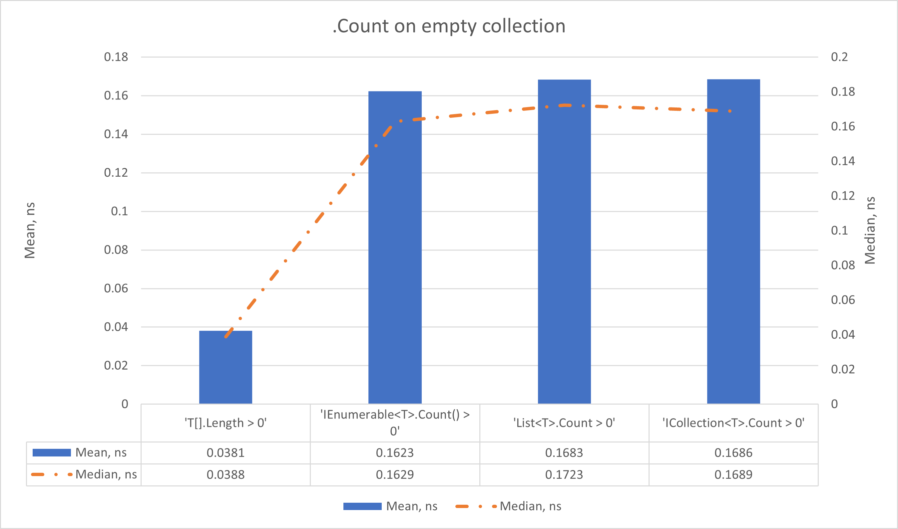
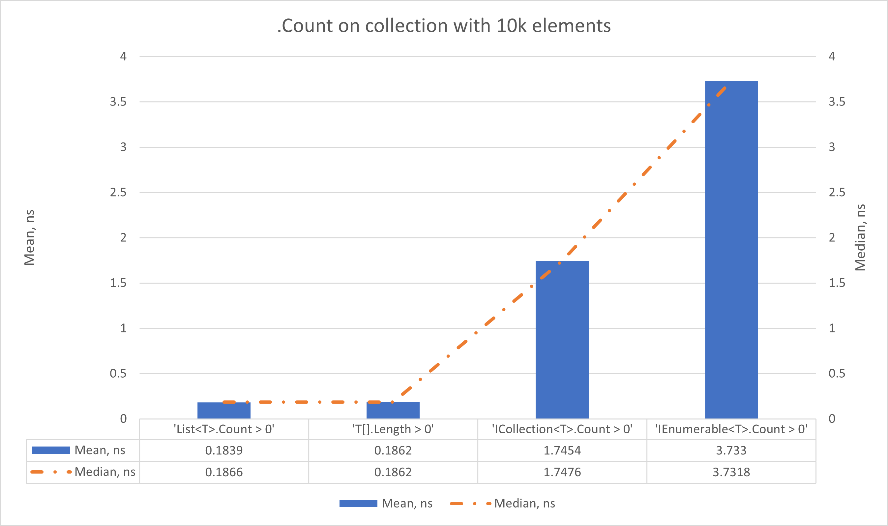
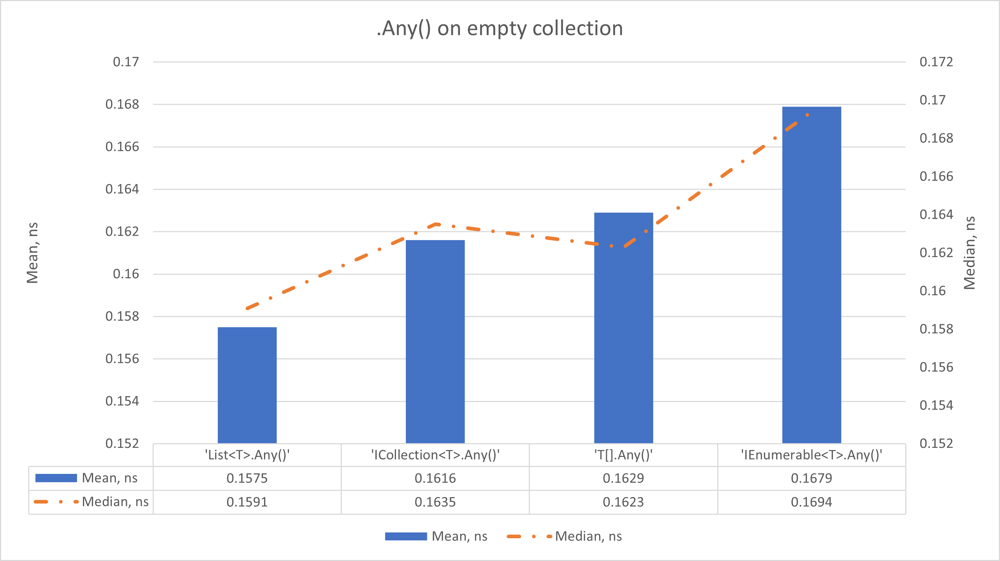
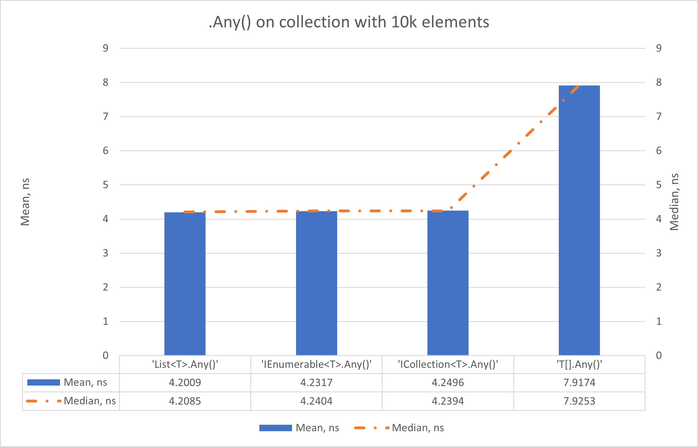

# Comparing Different Collection checks with different collections

### Table of contents

- [Reasons and introduction](#reasons-and-introduction)
- [Machine information](#machine-information)
- [Benchmarks](#benchmarks)
  - [Getting Size by '.Count'](#getting-size-by-count)
  - [Getting Size by '.Any()' method](#getting-size-by-any-method)
- [Conclusions](#conclusions)

<a name="reasons-and-introduction"></a>
## Reasons and introduction

The main purpose of benchmark comparison is to find out the best way possible to check:
- Whether collection has any items inside and is not `null`;
- A collection size, if needed.

By using different collections, we can have different approaches. 
In this project, i tend to check all popular checks with the popular collection.

<a name="machine-information"></a>

## Machine Information

``` ini
BenchmarkDotNet v0.13.12, Windows 11 (10.0.22631.3296/23H2/2023Update/SunValley3)
13th Gen Intel Core i9-13905H, 1 CPU, 20 logical and 14 physical cores
.NET SDK 8.0.100
  [Host]     : .NET 8.0.0 (8.0.23.53103), X64 RyuJIT AVX2
  DefaultJob : .NET 8.0.0 (8.0.23.53103), X64 RyuJIT AVX2
```

<a name="benchmarks"></a>

## Benchmarks

There are two kinds of benchmarks, with empty collection, and a collection with **10000** elements.

<a name="getting-size-by-count"></a>
### Getting Size by '.Count'

In this section, the size of collections was retrieved using either `.Count` property or, in case of `IEnumerable<T>`, `.Count()` method.

Firstly, let's see benchmarks for an empty collection: 

| Method                       |      Mean |     Error |    StdDev |    StdErr |       Min |        Q1 |    Median |        Q3 |       Max |             Op/s |
|------------------------------|----------:|----------:|----------:|----------:|----------:|----------:|----------:|----------:|----------:|-----------------:|
| 'T[].Length > 0'             | 0.0381 ns | 0.0139 ns | 0.0124 ns | 0.0033 ns | 0.0243 ns | 0.0259 ns | 0.0388 ns | 0.0460 ns | 0.0650 ns | 26,244,019,715.3 |
| 'IEnumerable<T>.Count() > 0' | 0.1623 ns | 0.0036 ns | 0.0030 ns | 0.0008 ns | 0.1542 ns | 0.1615 ns | 0.1629 ns | 0.1640 ns | 0.1663 ns |  6,161,384,507.6 |
| 'List<T>.Count > 0'          | 0.1683 ns | 0.0123 ns | 0.0103 ns | 0.0029 ns | 0.1487 ns | 0.1599 ns | 0.1723 ns | 0.1777 ns | 0.1808 ns |  5,942,393,755.6 |
| 'ICollection<T>.Count > 0'   | 0.1686 ns | 0.0156 ns | 0.0138 ns | 0.0037 ns | 0.1379 ns | 0.1640 ns | 0.1689 ns | 0.1778 ns | 0.1905 ns |  5,932,726,195.4 |



As we can see, time getting a `.Length` on raw `T[]` array increased significantly. Getting `.Count` or event `.Count()` is almost identical.

Now, let's see same methods on a collection with 10k entities:

| Method                     |      Mean |     Error |    StdDev |    StdErr |       Min |        Q1 |    Median |        Q3 |       Max |             Op/s |
|----------------------------|----------:|----------:|----------:|----------:|----------:|----------:|----------:|----------:|----------:|-----------------:|
| 'List<T>.Count > 0'        | 0.1839 ns | 0.0158 ns | 0.0132 ns | 0.0036 ns | 0.1565 ns | 0.1817 ns | 0.1866 ns | 0.1923 ns | 0.2023 ns |  5,439,195,656.5 |
| 'T[].Length > 0'           | 0.1862 ns | 0.0088 ns | 0.0082 ns | 0.0021 ns | 0.1736 ns | 0.1806 ns | 0.1862 ns | 0.1902 ns | 0.2045 ns |  5,371,758,129.9 |
| 'ICollection<T>.Count > 0' | 1.7454 ns | 0.0166 ns | 0.0147 ns | 0.0039 ns | 1.7044 ns | 1.7450 ns | 1.7476 ns | 1.7517 ns | 1.7632 ns |    572,927,716.8 |
| 'IEnumerable<T>.Count > 0' | 3.7330 ns | 0.0119 ns | 0.0105 ns | 0.0028 ns | 3.7135 ns | 3.7286 ns | 3.7318 ns | 3.7377 ns | 3.7560 ns |    267,880,232.1 |



Here, the picture is completely different. Getting `List<T>.Count > 0` and `T[].Length > 0` are identical (Probably, in `List<T>` it gets directly a size of under the hood array).

Getting a `ICollection<T>.Count > 0` is on slower that `List<T>.Count > 0`.

Lastly, getting `.Count()` method on `IEnumerable<T>` is the slowest:
- Significantly slower than `List<T>.Count > 0`;
- Significantly slower than `ICollection<T>.Count > 0`

<a name="getting-size-by-any-method"></a>
### Getting Size by '.Any()' method

In this section, the size of collections was retrieved using `.Any()` method.

Firstly, let's see benchmarks for an empty collection:

| Method                 |      Mean |     Error |    StdDev |    StdErr |       Min |        Q1 |    Median |        Q3 |       Max |            Op/s |
|------------------------|----------:|----------:|----------:|----------:|----------:|----------:|----------:|----------:|----------:|----------------:|
| 'List<T>.Any()'        | 0.1575 ns | 0.0102 ns | 0.0090 ns | 0.0024 ns | 0.1321 ns | 0.1540 ns | 0.1591 ns | 0.1628 ns | 0.1693 ns | 6,348,659,655.4 |
| 'ICollection<T>.Any()' | 0.1616 ns | 0.0136 ns | 0.0106 ns | 0.0031 ns | 0.1395 ns | 0.1609 ns | 0.1635 ns | 0.1676 ns | 0.1731 ns | 6,187,631,887.6 |
| 'T[].Any()'            | 0.1629 ns | 0.0057 ns | 0.0050 ns | 0.0013 ns | 0.1542 ns | 0.1591 ns | 0.1623 ns | 0.1675 ns | 0.1705 ns | 6,137,454,191.2 |
| 'IEnumerable<T>.Any()' | 0.1679 ns | 0.0049 ns | 0.0046 ns | 0.0012 ns | 0.1588 ns | 0.1659 ns | 0.1694 ns | 0.1707 ns | 0.1739 ns | 5,956,805,902.1 |



As we can see, time getting an `.Any()` is almost identical on any collection types.

But, looking at `T[]` results, it is drastically slower than using native `T[].Length > 0`.

Now, let's see same methods on a collection with 10k entities:

| Method                 |      Mean |     Error |    StdDev |    StdErr |       Min |        Q1 |    Median |        Q3 |       Max |          Op/s |
|------------------------|----------:|----------:|----------:|----------:|----------:|----------:|----------:|----------:|----------:|--------------:|
| 'List<T>.Any()'        | 4.2009 ns | 0.0369 ns | 0.0327 ns | 0.0087 ns | 4.1261 ns | 4.1909 ns | 4.2085 ns | 4.2185 ns | 4.2435 ns | 238,045,897.8 |
| 'IEnumerable<T>.Any()' | 4.2317 ns | 0.0358 ns | 0.0317 ns | 0.0085 ns | 4.1693 ns | 4.2177 ns | 4.2404 ns | 4.2422 ns | 4.2798 ns | 236,313,616.2 |
| 'ICollection<T>.Any()' | 4.2496 ns | 0.0340 ns | 0.0318 ns | 0.0082 ns | 4.2130 ns | 4.2269 ns | 4.2394 ns | 4.2680 ns | 4.3174 ns | 235,315,449.7 |
| 'T[].Any()'            | 7.9174 ns | 0.1175 ns | 0.1099 ns | 0.0284 ns | 7.6922 ns | 7.8355 ns | 7.9253 ns | 7.9733 ns | 8.1004 ns | 126,303,828.2 |



Here is an interesting situation occurs. As we can see, `T[].Any()` is **drastically** slower, that any collections. Currently, it is an open question to me why it occurs.

Also, using `.Any()` on `List<T>`, `ICollection<T>` and `T[]` is **drastically** , than using a `.Count` field.

<a name="conclusions"></a>
## Conclusions

For a defined collections, like `List<T>`, `ICollection<T>` or `T[]` prefer checking existence by using `.Count` or `.Length` fields rather using `.Any()` method.

For an `IEnumerable<T>`, consider **NOT** using `Count()` method to check size as it will cause multiple enumerations and can degrade a performance.