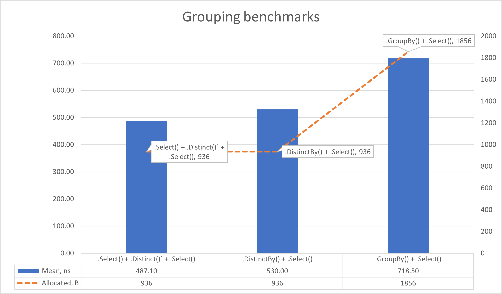
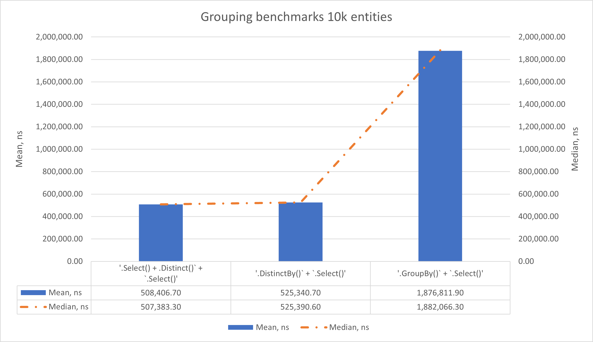

# Comparing 'GroupBy()' with 'Distinct()'

## Table of contents

- [Reasons and introduction](#reasons-and-introduction)
- [Machine information](#machine-information)
- [Benchmarks](#benchmarks)
- [Conclusions](#conclusions)

<a name="reasons-and-introduction"></a>
## Reasons and introduction

One time, we had an argument about a best way to get an array of entity from other entity.

So, here i test following:
- `.GroupBy()` + `.Select()`;
- `.Distinct()` + `.Select()`;
- `.DistinctBy()` + `.Select()`;

<a name="machine-info"></a>
## Machine Information
``` ini
BenchmarkDotNet v0.13.12, Windows 11 (10.0.22631.3296/23H2/2023Update/SunValley3)
13th Gen Intel Core i9-13905H, 1 CPU, 20 logical and 14 physical cores
.NET SDK 8.0.100
  [Host]     : .NET 8.0.0 (8.0.23.53103), X64 RyuJIT AVX2
  DefaultJob : .NET 8.0.0 (8.0.23.53103), X64 RyuJIT AVX2
```

<a name="benchmarks"></a>
## Benchmarks

So, I test three different combinations:

1. `.GroupBy()` + `.Select()`:

```csharp
  public static IEnumerable<InnerModel> GroupByTake(
      this IEnumerable<SimpleModel> testModelsList, Dictionary<string, InnerModel> innerTestModels, string innerTestModelConstId)
  {
      return testModelsList
          .GroupBy(x => x.InnerTestModelId)
          .Select(_ => innerTestModels[innerTestModelConstId]);
  }
```

2. `.DistinctBy()` + `.Select()`:

```csharp
  public static IEnumerable<InnerModel> DistinctByTake(
      this IEnumerable<SimpleModel> testModelsList, Dictionary<string, InnerModel> innerTestModels, string innerTestModelConstId)
  {
      return testModelsList
          .DistinctBy(x => x.InnerTestModelId)
          .Select(_ => innerTestModels[innerTestModelConstId]);
  }
```

3. `.Select() + .Distinct()` + `.Select()`:

```csharp
  public static IEnumerable<InnerModel> DistinctTake(
      this IEnumerable<SimpleModel> testModelsList, Dictionary<string, InnerModel> innerTestModels, string innerTestModelConstId)
  {
      return testModelsList
          .Select(x => x.InnerTestModelId)
          .Distinct()
          .Select(_ => innerTestModels[innerTestModelConstId]);
  }
```

Here are results for 10 entities in a `IEnumerable<SimpleModel>` collection:

| Method                                 |     Mean |   Error |  StdDev |  StdErr |   Median |      Min |       Q1 |       Q3 |      Max |          Op/s | Ratio | RatioSD |   Gen0 | Allocated | Alloc Ratio |       
|----------------------------------------|---------:|--------:|--------:|--------:|---------:|---------:|---------:|---------:|---------:|--------------:|------:|--------:|-------:|----------:|------------:|
| '.Select() + .Distinct()` + .Select()' | 487.1 ns | 1.33 ns | 1.11 ns | 0.31 ns | 487.2 ns | 485.3 ns | 486.2 ns | 487.4 ns | 489.5 ns | 2,053,164.993 |  0.68 |    0.00 | 0.0744 |     936 B |        0.50 |       
| '.DistinctBy() + .Select()'            | 530.0 ns | 0.73 ns | 0.65 ns | 0.17 ns | 530.1 ns | 529.0 ns | 529.4 ns | 530.5 ns | 530.9 ns | 1,886,853.086 |  0.74 |    0.00 | 0.0744 |     936 B |        0.50 |       
| '.GroupBy() + .Select()'               | 718.5 ns | 1.19 ns | 1.06 ns | 0.28 ns | 718.3 ns | 716.8 ns | 717.9 ns | 718.9 ns | 720.7 ns | 1,391,747.265 |  1.00 |    0.00 | 0.1478 |    1856 B |        1.00 | 



Here are results for 10k entities in a `IEnumerable<SimpleModel>` collection:

| Method                                | GenerationSize |           Mean |        Error |       StdDev |      StdErr |         Median |            Min |             Q1 |             Q3 |            Max |      Op/s | Ratio | RatioSD |     Gen0 |     Gen1 |    Gen2 | Allocated | Alloc Ratio |       
|---------------------------------------|----------------|---------------:|-------------:|-------------:|------------:|---------------:|---------------:|---------------:|---------------:|---------------:|----------:|------:|--------:|---------:|---------:|--------:|----------:|------------:|
| '.Select() + .Distinct() + .Select()' | 10000          |   508,406.7 ns |  9,835.68 ns |  9,659.95 ns | 2,414.99 ns |   507,383.3 ns |   490,481.1 ns |   502,015.4 ns |   517,857.1 ns |   520,371.8 ns | 1,966.929 |  0.27 |    0.01 |  71.2891 |  59.5703 | 50.7813 |  673426 B |        0.48 |       
| '.DistinctBy()` + .Select()'          | 10000          |   525,340.7 ns |  4,625.46 ns |  4,100.35 ns | 1,095.87 ns |   525,390.6 ns |   514,544.3 ns |   523,567.2 ns |   527,033.6 ns |   532,817.5 ns | 1,903.526 |  0.28 |    0.01 |  73.2422 |  62.5000 | 52.7344 |  673510 B |        0.48 |       
| '.GroupBy() + .Select()'              | 10000          | 1,876,811.9 ns | 36,974.12 ns | 45,407.54 ns | 9,680.92 ns | 1,882,066.3 ns | 1,784,802.9 ns | 1,842,103.0 ns | 1,911,506.6 ns | 1,948,529.3 ns |   532.818 |  1.00 |    0.00 | 138.6719 | 136.7188 | 48.8281 | 1405272 B |        1.00 |     



<a name="conclusions"></a>
## Conclusions

Well, `.Select() + .Distinct()` + `.Select()` seems still to be the fastest solution for this issue.