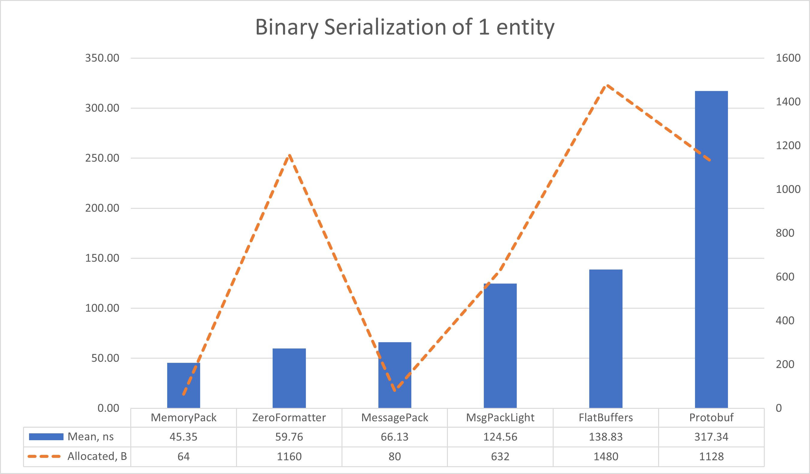
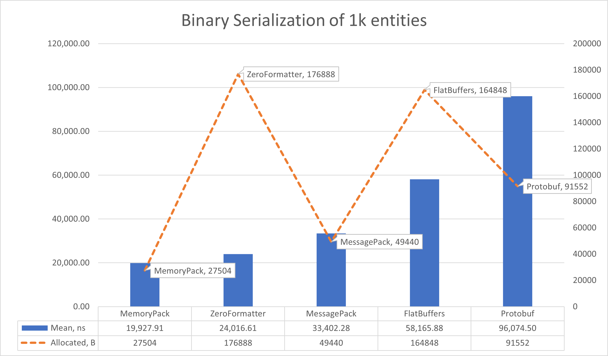
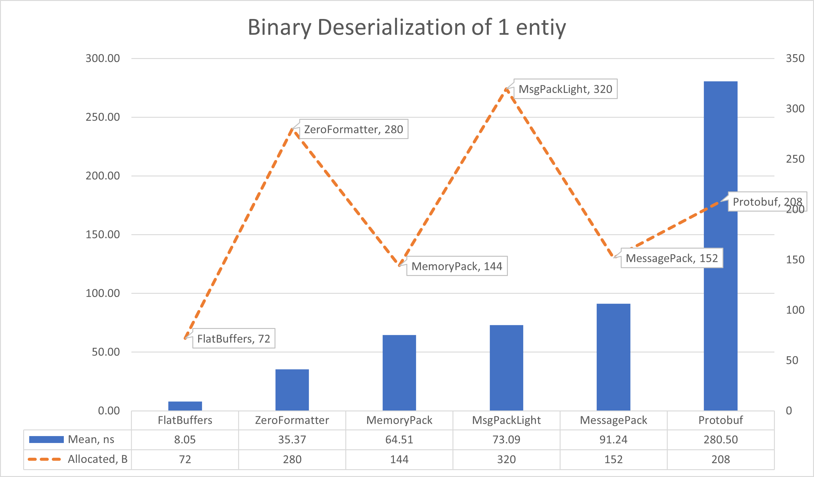
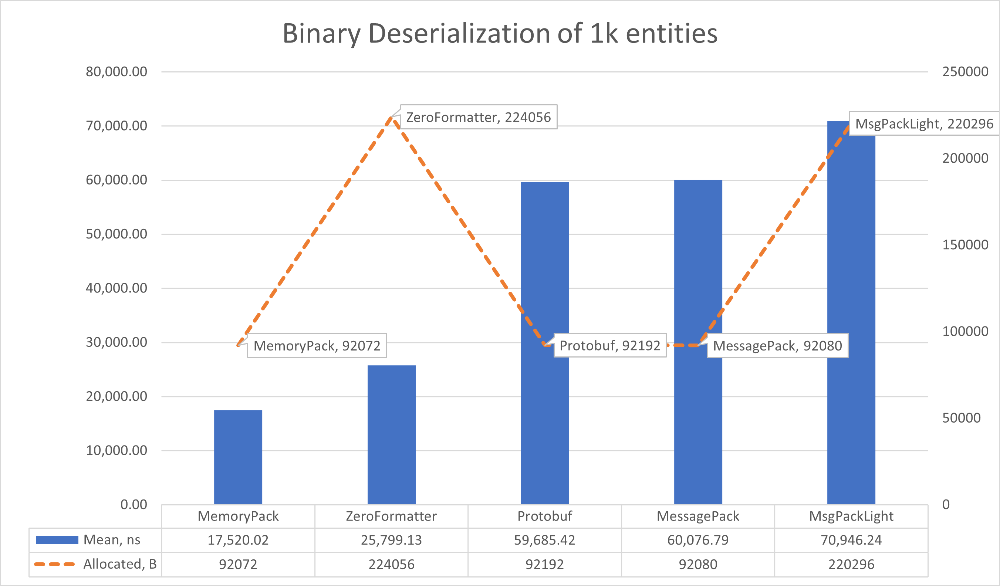

# Binary serializers benchmarks

## Table of contents

- [Reasons and introduction](#reasons-and-introduction)
- [Machine information](#machine-information)
- [Benchmarks](#benchmarks)
    - [Serialization](#binary-serialization)
    - [Deserialization](#binary-deserialization)
- [Conclusions](#conclusions)

<a name="reasons-and-introduction"></a>
## Reasons and introduction

The main purpose is to compare different binary serializers:
- [MemoryPack](https://github.com/Cysharp/MemoryPack)
- [ZeroFormatter](https://github.com/neuecc/ZeroFormatter)
- [MessagePack](https://github.com/MessagePack-CSharp/MessagePack-CSharp)
- [MsgPackLight](https://github.com/progaudi/MsgPack.Light)
- [FlatBuffers](https://github.com/google/flatbuffers)
- [Protobuf](https://github.com/protobuf-net/protobuf-net)

<a name="machine-info"></a>
## Machine Information
``` ini
BenchmarkDotNet v0.13.12, Windows 11 (10.0.22631.3296/23H2/2023Update/SunValley3)
13th Gen Intel Core i9-13905H, 1 CPU, 20 logical and 14 physical cores
.NET SDK 8.0.100
  [Host]     : .NET 8.0.0 (8.0.23.53103), X64 RyuJIT AVX2
  DefaultJob : .NET 8.0.0 (8.0.23.53103), X64 RyuJIT AVX2
```

<a name="benchmarks"></a>
## Benchmarks

<a name="binary-serialization"></a>
### Serialization

Here we test a serialization of different binary serializers

Let's look at serializing only 1 entity:

| Method        |      Mean |    Error |   StdDev |   StdErr |       Min |        Q1 |    Median |        Q3 |       Max |         Op/s |   Gen0 |   Gen1 | Allocated |
|---------------|----------:|---------:|---------:|---------:|----------:|----------:|----------:|----------:|----------:|-------------:|-------:|-------:|----------:|
| MemoryPack    |  45.35 ns | 0.091 ns | 0.085 ns | 0.022 ns |  45.15 ns |  45.29 ns |  45.37 ns |  45.41 ns |  45.46 ns | 22,050,406.1 | 0.0051 |      - |      64 B |
| ZeroFormatter |  59.76 ns | 0.496 ns | 0.464 ns | 0.120 ns |  58.42 ns |  59.62 ns |  59.76 ns |  59.98 ns |  60.41 ns | 16,733,097.4 | 0.0924 | 0.0004 |    1160 B |
| MessagePack   |  66.13 ns | 0.339 ns | 0.317 ns | 0.082 ns |  65.51 ns |  65.97 ns |  66.17 ns |  66.28 ns |  66.68 ns | 15,121,277.7 | 0.0063 |      - |      80 B |
| MsgPackLight  | 124.56 ns | 0.389 ns | 0.325 ns | 0.090 ns | 123.77 ns | 124.45 ns | 124.52 ns | 124.72 ns | 125.17 ns |  8,028,106.5 | 0.0503 |      - |     632 B |
| FlatBuffers   | 138.83 ns | 0.965 ns | 0.903 ns | 0.233 ns | 136.22 ns | 138.60 ns | 138.96 ns | 139.42 ns | 139.91 ns |  7,203,073.6 | 0.1178 | 0.0005 |    1480 B |
| Protobuf      | 317.34 ns | 1.920 ns | 1.702 ns | 0.455 ns | 314.14 ns | 317.49 ns | 317.79 ns | 318.41 ns | 319.40 ns |  3,151,228.2 | 0.0896 |      - |    1128 B |



Let's look at serializing an array of 1000 entities:

| Method        |          Mean |      Error |     StdDev |     StdErr |           Min |            Q1 |        Median |            Q3 |           Max |     Op/s |    Gen0 |   Gen1 | Allocated |
|---------------|--------------:|-----------:|-----------:|-----------:|--------------:|--------------:|--------------:|--------------:|--------------:|---------:|--------:|-------:|----------:|
| MemoryPack    |  19,927.91 ns | 290.831 ns | 272.043 ns |  70.241 ns |  19,460.68 ns |  19,714.50 ns |  20,040.12 ns |  20,150.82 ns |  20,216.99 ns | 50,180.9 |  2.1667 |      - |   27504 B |
| ZeroFormatter |  24,016.61 ns | 163.415 ns | 152.859 ns |  39.468 ns |  23,583.74 ns |  23,962.64 ns |  24,054.81 ns |  24,085.28 ns |  24,223.13 ns | 41,637.8 | 14.0686 |      - |  176888 B |
| MessagePack   |  33,402.28 ns |  91.010 ns |  85.131 ns |  21.981 ns |  33,301.46 ns |  33,334.23 ns |  33,372.37 ns |  33,483.82 ns |  33,557.70 ns | 29,938.1 |  3.9063 |      - |   49440 B |
| FlatBuffers   |  58,165.88 ns | 307.765 ns | 287.883 ns |  74.331 ns |  57,489.79 ns |  57,983.78 ns |  58,134.89 ns |  58,413.35 ns |  58,591.89 ns | 17,192.2 | 13.0615 | 2.1362 |  164848 B |
| Protobuf      |  96,074.50 ns | 613.975 ns | 574.313 ns | 148.287 ns |  95,337.89 ns |  95,655.43 ns |  95,921.22 ns |  96,515.33 ns |  97,375.61 ns | 10,408.6 |  7.2021 | 0.6104 |   91552 B |
| MsgPackLight  | 105,371.18 ns | 536.684 ns | 502.015 ns | 129.620 ns | 104,210.47 ns | 105,159.45 ns | 105,229.48 ns | 105,640.76 ns | 106,209.89 ns |  9,490.3 | 25.7568 | 4.2725 |  325528 B |



<a name="binary-deserialization"></a>
### Deserialization

Here we test a deserialization of different binary deserializers

Let's look at deserializing only 1 entity:

| Method        |       Mean |     Error |    StdDev |    StdErr |        Min |         Q1 |     Median |         Q3 |        Max |          Op/s |   Gen0 | Allocated |
|---------------|-----------:|----------:|----------:|----------:|-----------:|-----------:|-----------:|-----------:|-----------:|--------------:|-------:|----------:|
| FlatBuffers   |   8.047 ns | 0.0349 ns | 0.0327 ns | 0.0084 ns |   7.967 ns |   8.032 ns |   8.055 ns |   8.069 ns |   8.092 ns | 124,265,777.3 | 0.0057 |      72 B |
| ZeroFormatter |  35.372 ns | 0.2988 ns | 0.2795 ns | 0.0722 ns |  34.595 ns |  35.276 ns |  35.411 ns |  35.570 ns |  35.736 ns |  28,270,810.8 | 0.0223 |     280 B |
| MemoryPack    |  64.513 ns | 0.1741 ns | 0.1543 ns | 0.0413 ns |  64.356 ns |  64.415 ns |  64.429 ns |  64.577 ns |  64.809 ns |  15,500,771.3 | 0.0114 |     144 B |
| MsgPackLight  |  73.093 ns | 0.3430 ns | 0.3208 ns | 0.0828 ns |  72.630 ns |  72.823 ns |  73.165 ns |  73.220 ns |  73.698 ns |  13,681,199.9 | 0.0254 |     320 B |
| MessagePack   |  91.240 ns | 0.4831 ns | 0.4519 ns | 0.1167 ns |  90.259 ns |  91.029 ns |  91.265 ns |  91.518 ns |  92.054 ns |  10,960,071.5 | 0.0120 |     152 B |
| Protobuf      | 280.499 ns | 0.9661 ns | 0.9037 ns | 0.2333 ns | 278.679 ns | 279.945 ns | 280.483 ns | 281.057 ns | 281.878 ns |   3,565,072.5 | 0.0162 |     208 B |



Let's look at deserializing an array of 1000 entities:

| Method        |          Mean |       Error |      StdDev |     StdErr |           Min |            Q1 |        Median |            Q3 |           Max |     Op/s |    Gen0 |   Gen1 | Allocated |
|---------------|--------------:|------------:|------------:|-----------:|--------------:|--------------:|--------------:|--------------:|--------------:|---------:|--------:|-------:|----------:|
| MemoryPack    | 17,520.021 ns |  98.2732 ns |  87.1166 ns | 23.2829 ns | 17,300.034 ns | 17,497.576 ns | 17,512.207 ns | 17,559.448 ns | 17,687.897 ns | 57,077.6 |  7.3242 | 1.4648 |   92072 B |
| ZeroFormatter | 25,799.126 ns | 140.7635 ns | 124.7832 ns | 33.3497 ns | 25,438.998 ns | 25,750.211 ns | 25,830.739 ns | 25,858.833 ns | 25,934.705 ns | 38,761.0 | 17.8528 | 4.7302 |  224056 B |
| Protobuf      | 59,685.415 ns | 318.0812 ns | 297.5333 ns | 76.8228 ns | 59,251.318 ns | 59,427.814 ns | 59,651.025 ns | 59,939.432 ns | 60,123.486 ns | 16,754.5 |  7.3242 | 1.4038 |   92192 B |
| MessagePack   | 60,076.787 ns | 327.2404 ns | 290.0901 ns | 77.5298 ns | 59,653.076 ns | 59,916.144 ns | 60,027.820 ns | 60,191.046 ns | 60,687.891 ns | 16,645.4 |  7.3242 | 1.4648 |   92080 B |
| MsgPackLight  | 70,946.240 ns | 299.4175 ns | 280.0753 ns | 72.3151 ns | 70,540.906 ns | 70,735.144 ns | 70,938.062 ns | 71,086.530 ns | 71,441.785 ns | 14,095.2 | 17.4561 | 3.5400 |  220296 B |



<a name="conclusions"></a>
## Conclusions