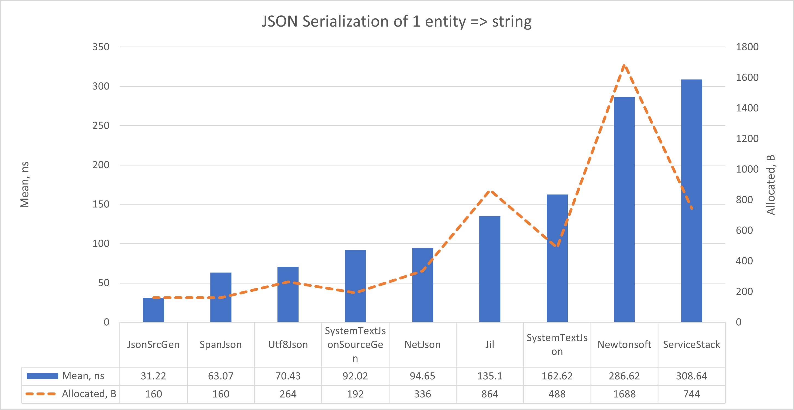
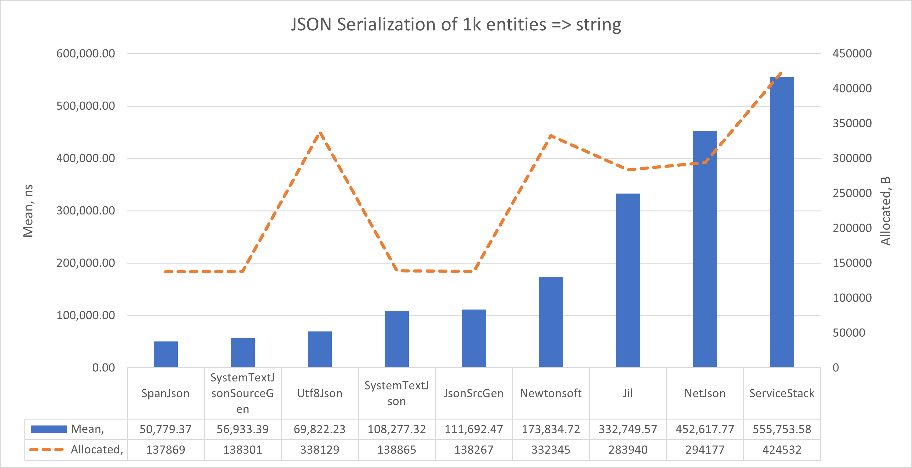
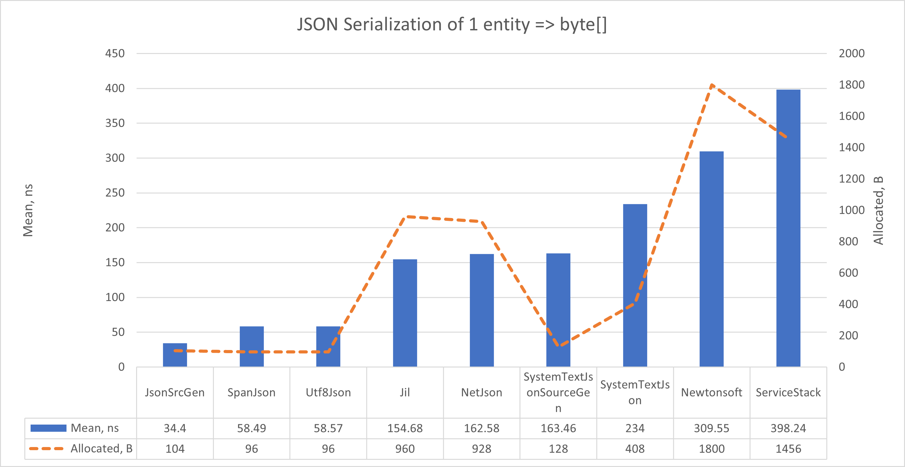
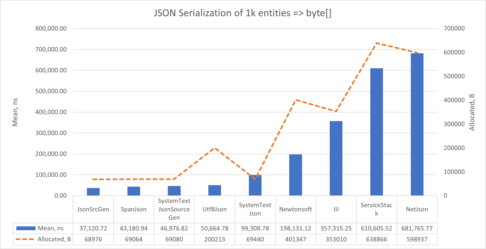
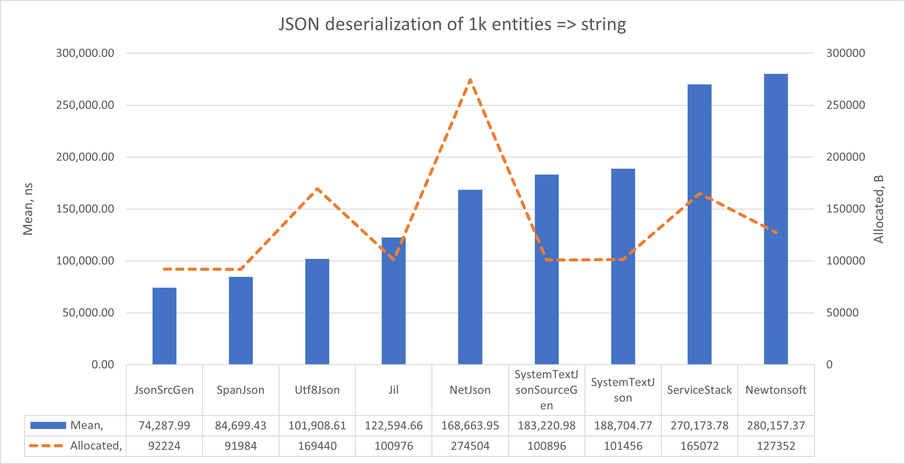
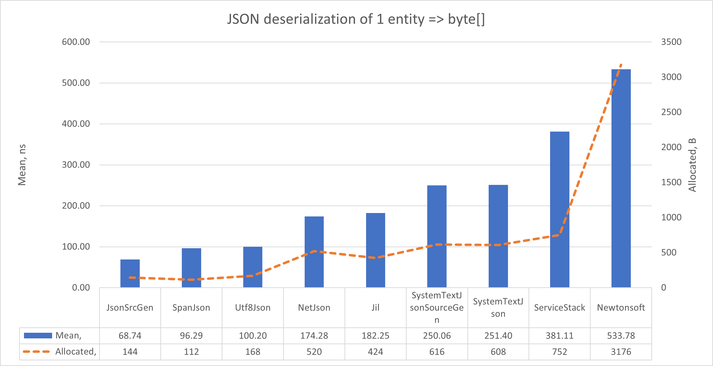
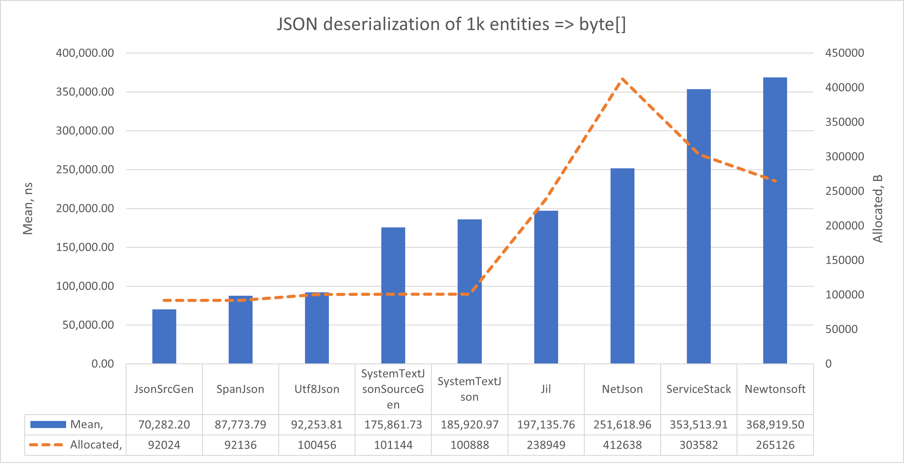

# JSON serializers benchmarks

## Table of contents

- [Reasons and introduction](#reasons-and-introduction)
- [Machine information](#machine-information)
- [Benchmarks](#benchmarks)
    - [Serialization](#json-serialization)
        - [String](#json-string-serialization)
        - [Bytes](#json-byte-serialization)
    - [Deserialization](#json-deserialization)
        - [String](#json-string-deserialization)
        - [Bytes](#json-byte-deserialization)
- [Conclusions](#conclusions)

<a name="reasons-and-introduction"></a>
## Reasons and introduction

The main purpose is to compare different JSON serializers:
- [Jil](https://github.com/kevin-montrose/Jil)
- [JsonSrcGen](https://github.com/trampster/JsonSrcGen)
- [NET.Json](https://github.com/netjson/netjson)
- [Newtonsoft.Json](https://github.com/JamesNK/Newtonsoft.Json)
- [ServiceStack](https://github.com/ServiceStack/ServiceStack)
- [SpanJson](https://github.com/Tornhoof/SpanJson)
- [System.Text.Json](https://github.com/dotnet/runtime/blob/main/src/libraries/System.Text.Json/ref/System.Text.Json.cs)
    - [SourceGen System.Text.Json ](https://github.com/dotnet/runtime/blob/main/src/libraries/System.Text.Json/ref/System.Text.Json.cs)
- [UTF8Json](https://github.com/dotnet/runtime/blob/main/src/libraries/System.Text.Json/ref/System.Text.Json.cs)

<a name="machine-info"></a>
## Machine Information
``` ini
BenchmarkDotNet v0.13.12, Windows 11 (10.0.22631.3296/23H2/2023Update/SunValley3)
13th Gen Intel Core i9-13905H, 1 CPU, 20 logical and 14 physical cores
.NET SDK 8.0.100
  [Host]     : .NET 8.0.0 (8.0.23.53103), X64 RyuJIT AVX2
  DefaultJob : .NET 8.0.0 (8.0.23.53103), X64 RyuJIT AVX2
```

<a name="benchmarks"></a>
## Benchmarks

Basically, the most common way of using JSON serializer is to deserialize/serialize payload for HTTP request.
There are two ways of handling and processing entities synchronously, via `string` or `byte[]`.
Here are tests for both, `byte[]` and `string` manipulations.

<a name="json-serialization"></a>
### Serialization

Here we test a serialization of different JSON serializers with input `string` and `byte[]` parameters.

<a name="json-string-serialization"></a>
#### String

Let's look at serializing only 1 entity:

| Method                  |          Mean |         Error |        StdDev |       StdErr |           Min |        Median | Allocated |
|-------------------------|--------------:|--------------:|--------------:|-------------:|--------------:|--------------:|----------:|
| JsonSrcGen              |      31.22 ns |      0.110 ns |      0.103 ns |     0.027 ns |      31.00 ns |      31.20 ns |     160 B |
| SpanJson                |      63.07 ns |      0.136 ns |      0.127 ns |     0.033 ns |      62.76 ns |      63.08 ns |     160 B |
| Utf8Json                |      70.43 ns |      0.482 ns |      0.451 ns |     0.117 ns |      69.82 ns |      70.39 ns |     264 B |
| SystemTextJsonSourceGen |      92.02 ns |      0.172 ns |      0.152 ns |     0.041 ns |      91.70 ns |      92.03 ns |     192 B |
| NetJson                 |      94.65 ns |      0.251 ns |      0.234 ns |     0.061 ns |      93.92 ns |      94.72 ns |     336 B |
| Jil                     |     135.10 ns |      0.719 ns |      0.673 ns |     0.174 ns |     133.66 ns |     135.30 ns |     864 B |
| SystemTextJson          |     162.62 ns |      0.377 ns |      0.353 ns |     0.091 ns |     162.11 ns |     162.63 ns |     488 B |
| Newtonsoft              |     286.62 ns |      1.828 ns |      1.527 ns |     0.423 ns |     283.85 ns |     287.30 ns |    1688 B |
| ServiceStack            |     308.64 ns |      0.922 ns |      0.863 ns |     0.223 ns |     306.05 ns |     308.83 ns |     744 B |



Let's look at serializing an array of 1000 entities:

| Method                  |          Mean |         Error |        StdDev |       StdErr |           Min |        Median | Allocated |
|-------------------------|--------------:|--------------:|--------------:|-------------:|--------------:|--------------:|----------:|
| SpanJson                |  50,779.37 ns |    857.878 ns |    802.459 ns |   207.194 ns |  49,581.76 ns |  50,796.03 ns |  137869 B |
| SystemTextJsonSourceGen |  56,933.39 ns |    443.346 ns |    414.706 ns |   107.077 ns |  56,263.05 ns |  56,857.82 ns |  138301 B |
| Utf8Json                |  69,822.23 ns |  1,215.796 ns |  1,137.256 ns |   293.638 ns |  67,322.97 ns |  69,990.53 ns |  338129 B |
| SystemTextJson          | 108,277.32 ns |  1,151.879 ns |  1,077.468 ns |   278.201 ns | 105,782.79 ns | 108,246.44 ns |  138865 B |
| JsonSrcGen              | 111,692.47 ns |  1,853.617 ns |  1,733.874 ns |   447.684 ns | 109,504.03 ns | 110,894.92 ns |  138267 B |
| Newtonsoft              | 173,834.72 ns |  3,884.419 ns | 11,392.328 ns | 1,144.972 ns | 156,461.52 ns | 172,515.36 ns |  332345 B |
| Jil                     | 332,749.57 ns | 16,936.791 ns | 49,938.511 ns | 4,993.851 ns | 215,385.64 ns | 338,674.98 ns |  283940 B |
| NetJson                 | 452,617.77 ns |  8,795.869 ns | 12,039.885 ns | 2,361.216 ns | 428,599.12 ns | 455,074.12 ns |  294177 B |
| ServiceStack            | 555,753.58 ns | 11,032.858 ns | 31,118.371 ns | 3,244.314 ns | 492,012.89 ns | 550,359.42 ns |  424532 B |



<a name="json-byte-serialization"></a>
#### Bytes

Let's look at serializing only 1 entity:

| Method                  |           Mean |         Error |        StdDev |       StdErr |           Min |        Median | Allocated |
|-------------------------|---------------:|--------------:|--------------:|-------------:|--------------:|--------------:|----------:|
| JsonSrcGen              |       34.40 ns |      0.051 ns |      0.042 ns |     0.012 ns |      34.35 ns |      34.39 ns |     104 B |
| SpanJson                |       58.49 ns |      0.116 ns |      0.108 ns |     0.028 ns |      58.16 ns |      58.51 ns |      96 B |
| Utf8Json                |       58.57 ns |      0.293 ns |      0.274 ns |     0.071 ns |      57.93 ns |      58.70 ns |      96 B |
| Jil                     |      154.68 ns |      0.723 ns |      0.677 ns |     0.175 ns |     153.05 ns |     155.00 ns |     960 B |
| NetJson                 |      162.58 ns |      0.229 ns |      0.203 ns |     0.054 ns |     162.16 ns |     162.62 ns |     928 B |
| SystemTextJsonSourceGen |      163.46 ns |      0.459 ns |      0.429 ns |     0.111 ns |     162.96 ns |     163.42 ns |     128 B |
| SystemTextJson          |      234.00 ns |      1.494 ns |      1.397 ns |     0.361 ns |     231.04 ns |     233.81 ns |     408 B |
| Newtonsoft              |      309.55 ns |      1.956 ns |      1.830 ns |     0.472 ns |     306.10 ns |     310.43 ns |    1800 B |
| ServiceStack            |      398.24 ns |      1.314 ns |      1.229 ns |     0.317 ns |     396.50 ns |     398.26 ns |    1456 B |



Let's look at serializing an array of 1000 entities:

| Method                  |           Mean |         Error |        StdDev |       StdErr |           Min |        Median | Allocated |
|-------------------------|---------------:|--------------:|--------------:|-------------:|--------------:|--------------:|----------:|
| JsonSrcGen              |   37,120.72 ns |    143.396 ns |    119.742 ns |    33.211 ns |  36,876.56 ns |  37,111.72 ns |   68976 B |
| SpanJson                |   43,180.94 ns |    144.164 ns |    134.851 ns |    34.818 ns |  42,948.47 ns |  43,184.48 ns |   69064 B |
| SystemTextJsonSourceGen |   46,976.82 ns |    143.008 ns |    126.773 ns |    33.882 ns |  46,765.36 ns |  46,958.23 ns |   69080 B |
| Utf8Json                |   50,664.78 ns |    459.979 ns |    384.103 ns |   106.531 ns |  49,970.21 ns |  50,698.11 ns |  200213 B |
| SystemTextJson          |   99,308.78 ns |    175.059 ns |    155.185 ns |    41.475 ns |  98,870.89 ns |  99,351.53 ns |   69440 B |
| Newtonsoft              |  198,131.12 ns |  7,094.149 ns | 20,581.413 ns | 2,089.726 ns | 167,855.37 ns | 194,280.47 ns |  401347 B |
| Jil                     |  357,315.25 ns | 16,751.170 ns | 49,391.202 ns | 4,939.120 ns | 225,948.88 ns | 360,852.95 ns |  353010 B |
| ServiceStack            |  610,605.52 ns | 12,205.614 ns | 14,529.915 ns | 3,170.687 ns | 582,284.57 ns | 613,483.40 ns |  638866 B |
| NetJson                 |  681,765.77 ns | 27,163.104 ns | 80,091.024 ns | 8,009.102 ns | 432,949.32 ns | 686,838.38 ns |  598937 B |



<a name="json-deserialization"></a>
### Deserialization

Here we test a serialization of different JSON deserializers

<a name="json-string-deserialization"></a>
#### String

Let's look at deserialization of 1 entity:

| Method                  |          Mean |        Error |       StdDev |     StdErr |           Min |        Median |  Allocated |
|-------------------------|--------------:|-------------:|-------------:|-----------:|--------------:|--------------:|-----------:|
| JsonSrcGen              |      68.74 ns |     0.491 ns |     0.435 ns |   0.116 ns |      68.27 ns |      68.59 ns |      144 B |
| SpanJson                |      96.29 ns |     0.316 ns |     0.296 ns |   0.076 ns |      95.60 ns |      96.29 ns |      112 B |
| Utf8Json                |     100.20 ns |     0.372 ns |     0.348 ns |   0.090 ns |      99.61 ns |     100.14 ns |      168 B |
| NetJson                 |     174.28 ns |     0.592 ns |     0.553 ns |   0.143 ns |     173.68 ns |     174.06 ns |      520 B |
| Jil                     |     182.25 ns |     0.532 ns |     0.471 ns |   0.126 ns |     181.45 ns |     182.21 ns |      424 B |
| SystemTextJsonSourceGen |     250.06 ns |     0.856 ns |     0.801 ns |   0.207 ns |     248.06 ns |     250.01 ns |      616 B |
| SystemTextJson          |     251.40 ns |     2.408 ns |     2.011 ns |   0.558 ns |     247.48 ns |     251.70 ns |      608 B |
| ServiceStack            |     381.11 ns |     1.072 ns |     1.003 ns |   0.259 ns |     378.21 ns |     381.36 ns |      752 B |
| Newtonsoft              |     533.78 ns |     3.034 ns |     2.838 ns |   0.733 ns |     526.62 ns |     535.09 ns |     3176 B |


Let's look at deserialization of 1000 entities:

| Method                  |          Mean |        Error |       StdDev |     StdErr |           Min |        Median |  Allocated |
|-------------------------|--------------:|-------------:|-------------:|-----------:|--------------:|--------------:|-----------:|
| JsonSrcGen              |  70,282.20 ns |   166.609 ns |   147.695 ns |  39.473 ns |  70,082.20 ns |  70,290.89 ns |    92024 B |
| SpanJson                |  87,773.79 ns |   386.869 ns |   361.878 ns |  93.436 ns |  87,159.13 ns |  87,900.13 ns |    92136 B |
| Utf8Json                |  92,253.81 ns |   200.810 ns |   187.838 ns |  48.500 ns |  92,010.30 ns |  92,253.61 ns |   100456 B |
| SystemTextJsonSourceGen | 175,861.73 ns |   253.760 ns |   237.367 ns |  61.288 ns | 175,429.83 ns | 175,808.98 ns |   101144 B |
| SystemTextJson          | 185,920.97 ns |   322.766 ns |   301.916 ns |  77.954 ns | 185,398.54 ns | 185,983.28 ns |   100888 B |
| Jil                     | 197,135.76 ns |   962.897 ns |   900.695 ns | 232.558 ns | 195,962.43 ns | 196,905.52 ns |   238949 B |
| NetJson                 | 251,618.96 ns | 3,147.522 ns | 2,790.196 ns | 745.711 ns | 248,730.27 ns | 250,966.19 ns |   412638 B |
| ServiceStack            | 353,513.91 ns | 4,060.614 ns | 3,798.301 ns | 980.717 ns | 348,812.45 ns | 353,355.27 ns |   303582 B |
| Newtonsoft              | 368,919.50 ns | 3,975.930 ns | 3,719.088 ns | 960.264 ns | 365,802.59 ns | 366,761.47 ns |   265126 B |



<a name="json-byte-deserialization"></a>
#### Bytes

Let's look at deserialization of 1 entity:

| Method                  |          Mean |        Error |       StdDev |     StdErr |           Min |        Median | Allocated |
|-------------------------|--------------:|-------------:|-------------:|-----------:|--------------:|--------------:|----------:|
| JsonSrcGen              |      72.39 ns |     0.227 ns |     0.202 ns |   0.054 ns |      71.74 ns |      72.41 ns |     152 B |
| SpanJson                |      96.51 ns |     0.240 ns |     0.224 ns |   0.058 ns |      96.11 ns |      96.61 ns |     120 B |
| Utf8Json                |     120.01 ns |     0.577 ns |     0.511 ns |   0.137 ns |     118.99 ns |     120.18 ns |     264 B |
| NetJson                 |     149.56 ns |     0.555 ns |     0.520 ns |   0.134 ns |     148.94 ns |     149.39 ns |     344 B |
| Jil                     |     160.74 ns |     0.523 ns |     0.489 ns |   0.126 ns |     159.58 ns |     161.01 ns |     272 B |
| SystemTextJson          |     287.15 ns |     1.300 ns |     1.216 ns |   0.314 ns |     284.71 ns |     286.99 ns |     608 B |
| SystemTextJsonSourceGen |     292.74 ns |     0.743 ns |     0.695 ns |   0.180 ns |     290.92 ns |     292.84 ns |     608 B |
| ServiceStack            |     363.70 ns |     0.666 ns |     0.556 ns |   0.154 ns |     362.79 ns |     363.56 ns |     600 B |
| Newtonsoft              |     498.97 ns |     5.019 ns |     4.695 ns |   1.212 ns |     489.48 ns |     500.43 ns |    3000 B |



Let's look at deserialization of 1000 entities:

| Method                  |          Mean |        Error |       StdDev |     StdErr |           Min |        Median | Allocated |
|-------------------------|--------------:|-------------:|-------------:|-----------:|--------------:|--------------:|----------:|
| JsonSrcGen              |  74,287.99 ns |   427.920 ns |   400.277 ns | 103.351 ns |  73,636.40 ns |  74,213.95 ns |   92224 B |
| SpanJson                |  84,699.43 ns |   391.369 ns |   346.939 ns |  92.723 ns |  84,233.25 ns |  84,618.87 ns |   91984 B |
| Utf8Json                | 101,908.61 ns |   237.300 ns |   221.970 ns |  57.312 ns | 101,463.67 ns | 101,948.57 ns |  169440 B |
| Jil                     | 122,594.66 ns |   552.627 ns |   516.928 ns | 133.470 ns | 121,473.34 ns | 122,722.24 ns |  100976 B |
| NetJson                 | 168,663.95 ns |   490.384 ns |   409.493 ns | 113.573 ns | 167,915.80 ns | 168,835.55 ns |  274504 B |
| SystemTextJsonSourceGen | 183,220.98 ns | 1,562.079 ns | 1,461.170 ns | 377.272 ns | 181,568.12 ns | 182,345.73 ns |  100896 B |
| SystemTextJson          | 188,704.77 ns |   842.847 ns |   788.400 ns | 203.564 ns | 186,996.51 ns | 188,992.46 ns |  101456 B |
| ServiceStack            | 270,173.78 ns | 1,405.324 ns | 1,314.541 ns | 339.413 ns | 266,840.53 ns | 270,628.03 ns |  165072 B |
| Newtonsoft              | 280,157.37 ns |   477.352 ns |   446.515 ns | 115.290 ns | 279,090.97 ns | 280,134.72 ns |  127352 B |



<a name="conclusions"></a>
## Conclusions

[SpanJson](https://github.com/Tornhoof/SpanJson) is by far superior library, that demonstrates superior performance with little to no drawbacks.
If JSON serialization/deserialization is not a bottleneck of your performance, it is not important to change anything.

Note, built-in `System.Text.Json` is much faster than popular [Newtonsoft.Json](https://github.com/JamesNK/Newtonsoft.Json).
If you don't have complicated contracts with custom serializers, use `System.Text.Json`.
